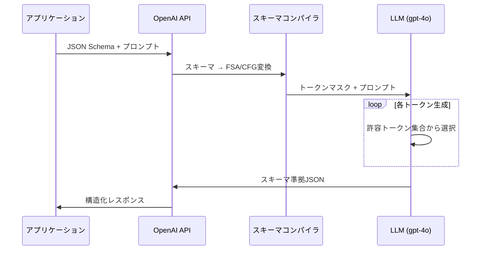

本記事は [OpenAI Structured Outputs公式ドキュメント](https://developers.openai.com/api/docs/guides/structured-outputs) の解説記事です。

## ブログ概要（Summary）

OpenAIのStructured Outputs APIは、LLMの出力をJSON Schemaに厳密に準拠させる機能である。2024年8月にリリースされ、gpt-4o-2024-08-06以降のモデルで利用可能である。制約付きデコーディング（Constrained Decoding）技術により、生成されたJSONがスキーマの構造・型・制約に100%準拠することが保証される。Semantic Kernelの`response_format`にPydanticモデルを指定する機能は、この APIを基盤として構築されている。

この記事は [Zenn記事: Semantic Kernel v1.44×Pydantic Structured Outputで型安全AIエージェントを構築する](https://zenn.dev/0h_n0/articles/9c3ea7a3879be1) の深掘りです。Zenn記事で紹介した`OpenAIChatPromptExecutionSettings.response_format`の動作原理を、OpenAI公式ドキュメントに基づいて詳解します。

## 情報源

- **種別**: 企業テックブログ / 公式APIドキュメント
- **URL**: [https://developers.openai.com/api/docs/guides/structured-outputs](https://developers.openai.com/api/docs/guides/structured-outputs)
- **組織**: OpenAI
- **初回発表日**: 2024年8月6日（Introducing Structured Outputs in the API）

## 技術的背景（Technical Background）

### なぜ構造化出力が必要か

LLMの出力をアプリケーションのデータパイプラインに統合する際、最大の障壁はフォーマットの不確実性であった。従来のJSON mode（`response_format: {type: "json_object"}`）は、出力がJSONであることのみを保証し、スキーマ準拠は保証しなかった。これにより以下の問題が発生していた。

- 必須フィールドの欠落
- 型の不一致（数値が文字列として出力される等）
- enumの範囲外の値
- ネスト構造の不正

Structured Outputsは、制約付きデコーディングによりこれらの問題を根本的に解決する。OpenAIの評価では、gpt-4o-2024-08-06モデルがスキーマ準拠率100%を達成したと報告されている。

### 制約付きデコーディングの原理

Structured Outputsの内部では、制約付きデコーディング技術が使われている。JSONスキーマからコンテキストフリー文法（CFG）または有限状態オートマトン（FSA）を構築し、各デコーディングステップで、現在の解析状態から許容されるトークンのみを選択可能にする。



形式的には、スキーマ$S$から導出されるオートマトン$A_S$の現在状態$q_t$に基づき、許容トークン集合$V_t$が計算される。

$$
V_t = \{v \in V \mid \delta(q_t, v) \neq \emptyset\}
$$

ここで、$\delta$はオートマトンの遷移関数、$V$は語彙全体である。スキーマに違反するトークンはマスクされ、確率0に設定される。

## 2つの利用方法

Structured Outputsは2つの異なる方法で利用できる。

### 1. Responses API / Chat Completions APIでの利用

テキスト応答全体をJSONスキーマに準拠させる方法。Semantic Kernelの`response_format`はこの方法を使用している。

```python
from pydantic import BaseModel, Field
from openai import OpenAI

client = OpenAI()

class SentimentAnalysis(BaseModel):
    sentiment: str = Field(description="positive/negative/neutral")
    confidence: float = Field(ge=0.0, le=1.0)
    key_phrases: list[str] = Field(max_length=5)

response = client.responses.create(
    model="gpt-4o",
    input="このレストランは素晴らしい料理と最高のサービスでした。",
    text={
        "format": {
            "type": "json_schema",
            "strict": True,
            "name": "sentiment_analysis",
            "schema": SentimentAnalysis.model_json_schema(),
        }
    },
)

result = SentimentAnalysis.model_validate_json(response.output_text)
```

OpenAIのPython SDKでは、`pydantic.BaseModel`を直接渡すヘルパーメソッド`client.beta.chat.completions.parse()`も提供されている。Semantic Kernelはこの機能をラップし、`OpenAIChatPromptExecutionSettings.response_format`として公開している。

### 2. Function Calling（strict mode）での利用

ツール呼び出しの引数をJSONスキーマに準拠させる方法。Semantic Kernelの`@kernel_function`プラグインでFunction Callingを使う際に、内部的にこの機能が活用される。

```python
tools = [{
    "type": "function",
    "function": {
        "name": "get_weather",
        "description": "指定都市の天気を取得",
        "parameters": {
            "type": "object",
            "properties": {
                "city": {"type": "string", "description": "都市名"},
                "unit": {"type": "string", "enum": ["celsius", "fahrenheit"]}
            },
            "required": ["city"],
            "additionalProperties": False,
        },
        "strict": True,
    }
}]
```

`strict: True`を指定すると、LLMが生成するFunction Calling引数がスキーマに厳密に準拠する。`strict: False`（デフォルト）の場合は、スキーマはヒントとして扱われ、厳密な準拠は保証されない。

## 対応モデルとスキーマ制約

### 対応モデル

OpenAI公式ドキュメント（2026年9月時点）に基づく対応モデル一覧:

| モデル | Structured Outputs対応 | 備考 |
|-------|----------------------|------|
| gpt-4o (2024-08-06以降) | ✅ | 初期対応モデル |
| gpt-4o-mini | ✅ | 軽量版 |
| GPT-5.x以降 | ✅ | 最新世代 |
| gpt-6-astra | ✅ | 最新モデル |
| gpt-4-turbo | ❌ | JSON modeのみ |
| gpt-3.5-turbo | ❌ | JSON modeのみ |

### スキーマ制約事項

Structured Outputsは「JSON Schemaの多くの部分」をサポートするが、以下の制約がある。

**必須要件**:
- `additionalProperties: false`が必須（すべてのオブジェクト型に対して）
- すべてのプロパティが`required`に含まれる必要がある
- オプショナルフィールドは`type: ["string", "null"]`のようにnull許容型で表現

**サポートされる要素**:
- オブジェクト型、配列型、文字列型、数値型、ブーリアン型
- `enum`制約
- `$ref`による再帰的スキーマ（制限あり）
- ネスト構造

**制限事項**:
- `anyOf`/`oneOf`の一部パターンに制限
- 非常に深いネスト（100階層以上）は非対応
- 動的なスキーマ（`patternProperties`等）は非対応

### Pydanticモデルとの互換性

Semantic Kernelで`response_format`にPydanticモデルを指定する際、OpenAI APIの制約を満たすためにいくつかの注意が必要である。

```python
from pydantic import BaseModel, Field
from typing import Optional

class SafeModel(BaseModel):
    """OpenAI Structured Outputsと完全互換のモデル設計"""
    model_config = {"extra": "forbid"}

    name: str = Field(description="名前")
    age: int = Field(description="年齢")
    email: Optional[str] = Field(default=None, description="メールアドレス")
    tags: list[str] = Field(default_factory=list, description="タグ")
```

ポイント:
- `model_config = {"extra": "forbid"}`で`additionalProperties: false`を生成
- `Optional`型はPydanticが自動的にnull許容型に変換
- `default`値を指定しても、APIレベルでは`required`に含まれる

## 実装アーキテクチャ（Architecture）

### 初回レイテンシとキャッシュ

新しいスキーマを初めて使用する際、OpenAI API側でスキーマのコンパイル（FSA/CFG構築）が行われる。OpenAI公式ドキュメントでは「最初のリクエストでは追加のレイテンシが発生する」と記載されている。同一スキーマの2回目以降のリクエストではこのオーバーヘッドは発生しない。

### 安全機能

**明示的拒否（Explicit Refusals）**: モデルが安全上の理由でリクエストを拒否する場合、`refusal`フィールドでプログラム的に検出可能である。

```python
if response.refusal:
    print(f"拒否理由: {response.refusal}")
else:
    result = MyModel.model_validate_json(response.content)
```

**不完全なレスポンス**: `max_tokens`に到達した場合やコンテンツフィルターが作動した場合、レスポンスの`status`が`incomplete`となり、`incomplete_details`に理由が記載される。この場合、出力JSONはスキーマに準拠しない可能性がある。

```python
if response.status == "incomplete":
    print(f"不完全: {response.incomplete_details}")
```

### Semantic Kernelでの統合パターン

Semantic Kernelでは、上記のOpenAI APIの機能が`OpenAIChatPromptExecutionSettings`として抽象化されている。

```python
from semantic_kernel.connectors.ai.open_ai import OpenAIChatPromptExecutionSettings

settings = OpenAIChatPromptExecutionSettings()
settings.response_format = ReviewAnalysis

agent = ChatCompletionAgent(
    service=AzureChatCompletion(),
    name="Analyzer",
    arguments=KernelArguments(settings=settings),
)
```

この設定により、以下の処理が内部的に行われる。

1. `ReviewAnalysis.model_json_schema()`でJSONスキーマを生成
2. OpenAI APIの`response_format`パラメータにスキーマを設定
3. APIからのレスポンスをJSON文字列として受信
4. `ReviewAnalysis.model_validate_json()`でPydanticオブジェクトに変換

## Production Deployment Guide

### AWS実装パターン（コスト最適化重視）

Structured Outputsを活用したAIアプリケーションのAWS構成を以下に示す。

| 規模 | 月間リクエスト | 推奨構成 | 月額コスト | 主要サービス |
|------|--------------|---------|-----------|------------|
| **Small** | ~3,000 (100/日) | Serverless | $50–150 | Lambda + OpenAI API + DynamoDB |
| **Medium** | ~30,000 (1,000/日) | Hybrid | $300–800 | Lambda + ECS Fargate + ElastiCache |
| **Large** | 300,000+ (10,000/日) | Container | $2,000–5,000 | EKS + Karpenter + EC2 Spot |

**Small構成の詳細**（月額$50–150）:
- **Lambda**: 1GB RAM, 60秒タイムアウト（$20/月）
- **OpenAI API**: gpt-4o-mini, Structured Outputs使用（$80/月）
- **DynamoDB**: On-Demand, スキーマキャッシュ用（$10/月）

**コスト削減テクニック**:
- gpt-4o-miniの活用: gpt-4oの約1/10のコストでStructured Outputs対応
- スキーマの再利用: 初回コンパイルオーバーヘッド回避のため同一スキーマを継続使用
- Batch API活用: 非リアルタイム処理で50%コスト削減

**コスト試算の注意事項**: 上記は2026年9月時点の料金に基づく概算値です。OpenAI APIの料金は変動するため、最新料金は[OpenAI Pricing](https://openai.com/api/pricing/)で確認してください。

### Terraformインフラコード

```hcl
resource "aws_iam_role" "lambda_structured" {
  name = "lambda-structured-output-role"
  assume_role_policy = jsonencode({
    Version = "2012-10-17"
    Statement = [{
      Action    = "sts:AssumeRole"
      Effect    = "Allow"
      Principal = { Service = "lambda.amazonaws.com" }
    }]
  })
}

resource "aws_secretsmanager_secret" "openai_api_key" {
  name = "openai-api-key"
}

resource "aws_lambda_function" "structured_handler" {
  filename      = "lambda.zip"
  function_name = "structured-output-handler"
  role          = aws_iam_role.lambda_structured.arn
  handler       = "index.handler"
  runtime       = "python3.12"
  timeout       = 60
  memory_size   = 512
  environment {
    variables = {
      OPENAI_SECRET_ARN = aws_secretsmanager_secret.openai_api_key.arn
      DYNAMODB_TABLE    = aws_dynamodb_table.cache.name
    }
  }
}

resource "aws_dynamodb_table" "cache" {
  name         = "structured-output-cache"
  billing_mode = "PAY_PER_REQUEST"
  hash_key     = "schema_hash"
  attribute {
    name = "schema_hash"
    type = "S"
  }
  ttl {
    attribute_name = "expire_at"
    enabled        = true
  }
}
```

### セキュリティベストプラクティス

- OpenAI APIキー: Secrets Managerに格納、Lambda環境変数にはARNのみ設定
- ネットワーク: Lambda VPC内配置、NAT Gateway経由でOpenAI APIアクセス
- 入力検証: ユーザー入力のサニタイズ（プロンプトインジェクション対策）
- レスポンス検証: `refusal`フィールドと`status`フィールドの確認を必須化

### コスト最適化チェックリスト

- [ ] gpt-4o-mini優先使用（コスト1/10）
- [ ] 同一スキーマ再利用（初回コンパイルオーバーヘッド回避）
- [ ] Batch API活用（非リアルタイム処理50%削減）
- [ ] `max_tokens`適切設定（過剰生成防止）
- [ ] DynamoDB TTL設定（古いキャッシュ自動削除）
- [ ] Lambda メモリ最適化（512MB–1GB推奨）
- [ ] AWS Budgets: 月額予算設定
- [ ] Cost Anomaly Detection有効化
- [ ] CloudWatch: API呼び出し回数・レイテンシ監視
- [ ] タグ戦略: 環境別コスト可視化

## パフォーマンス最適化（Performance）

### スキーマ設計によるレイテンシ最適化

Structured Outputsのレイテンシは、スキーマの複雑度に依存する。以下の設計指針でレイテンシを最小化できる。

- **フラットなスキーマ**: ネスト深度を3階層以内に抑える
- **プロパティ数の制限**: 1オブジェクトあたり20プロパティ以内を推奨
- **enum値の制限**: enum要素数が多い場合、`description`で範囲を記述し、文字列型に変更を検討
- **再帰的スキーマの回避**: `$ref`による自己参照は初回コンパイル時間を増大させる

### JSON modeとの使い分け

| 要件 | Structured Outputs | JSON mode |
|------|-------------------|-----------|
| スキーマ準拠保証 | ✅ 100% | ❌ ベストエフォート |
| 初回レイテンシ | やや増加 | なし |
| 対応モデル | gpt-4o以降 | gpt-3.5-turbo以降 |
| 用途 | 型安全なデータ抽出 | 柔軟なJSON出力 |

Semantic Kernelでは、`response_format`にPydanticモデルを指定した場合はStructured Outputs、`response_format={"type": "json_object"}`を指定した場合はJSON modeが使用される。

## 運用での学び（Production Lessons）

### 不完全レスポンスへの対策

`max_tokens`に到達してJSONが不完全になるケースは、プロダクション環境で最も多い障害パターンである。対策として:

1. **`max_tokens`の十分な設定**: スキーマのサイズに基づいて必要トークン数を推定し、1.5倍のマージンを設定
2. **`status`チェックの必須化**: `response.status == "incomplete"`の場合にリトライまたはフォールバック
3. **スキーマの簡素化**: 出力が長くなりすぎるスキーマは分割を検討

### 安全拒否（Refusal）への対応

モデルが安全上の理由で構造化出力を拒否するケースでは、`refusal`フィールドが設定される。この場合、構造化JSONは返されないため、アプリケーション側でフォールバック処理が必要である。

```python
import tenacity

@tenacity.retry(stop=tenacity.stop_after_attempt(3), wait=tenacity.wait_exponential())
async def safe_structured_call(agent, message):
    response = await agent.get_response(messages=message)
    content = str(response)
    if '"refusal"' in content:
        raise ValueError(f"Model refused: {content}")
    return MyModel.model_validate_json(content)
```

## 学術研究との関連（Academic Connection）

Structured Outputsの内部技術は、以下の学術研究に基礎を置いている。

- **Constrained Decoding (Scholak et al., 2021)**: テキストからSQL変換において、文法制約をデコーディングに組み込む手法を提案
- **Outlines (Willard & Louf, 2023)**: 正規表現をFSMに変換し、LLMのデコーディングを制約するオープンソースライブラリ
- **JSONSchemaBench (Geng et al., 2025)**: 構造化出力フレームワークの体系的ベンチマーク。OpenAIのStructured Outputsも評価対象に含まれている

OpenAIの実装は、これらの研究成果を商用APIとして統合し、スケーラブルなサービスとして提供している点に特徴がある。

## まとめと実践への示唆

OpenAIのStructured Outputs APIは、LLM出力の型安全性を保証する技術基盤として、Semantic Kernelを含む多くのフレームワークで活用されている。

Semantic Kernelユーザーにとっての実践的な示唆:
- `response_format`にPydanticモデルを指定する際は、`model_config = {"extra": "forbid"}`を設定して`additionalProperties: false`を保証する
- `Optional`フィールドを活用してスキーマの柔軟性を確保する
- 初回レイテンシを考慮したウォームアップ戦略を導入する
- `max_tokens`を十分に設定し、不完全レスポンスを防止する
- gpt-4o-miniの活用でコストを1/10に削減できる

## 参考文献

- **OpenAI Structured Outputs Guide**: [https://developers.openai.com/api/docs/guides/structured-outputs](https://developers.openai.com/api/docs/guides/structured-outputs)
- **OpenAI Blog: Introducing Structured Outputs**: [https://openai.com/index/introducing-structured-outputs-in-the-api/](https://openai.com/index/introducing-structured-outputs-in-the-api/)
- **OpenAI Cookbook: Structured Outputs Intro**: [https://developers.openai.com/cookbook/examples/structured_outputs_intro](https://developers.openai.com/cookbook/examples/structured_outputs_intro)
- **Related Zenn article**: [https://zenn.dev/0h_n0/articles/9c3ea7a3879be1](https://zenn.dev/0h_n0/articles/9c3ea7a3879be1)

---

> この記事はAI（Claude Code）により自動生成されました。内容の正確性については公式ドキュメントもご確認ください。
