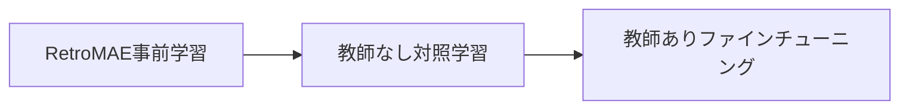

本記事は [論文: M3-Embedding](https://arxiv.org/abs/2402.03216) の解説記事です。

## 論文概要（Abstract）

M3-Embeddingは、多言語性（Multi-Linguality）、多機能性（Multi-Functionality）、多粒度（Multi-Granularity）の3つの「M」を同時に実現するテキスト埋め込みモデルである。著者らは、単一のエンコーダからDense検索、Sparse（語彙的）検索、ColBERT型のMulti-Vector検索という3種類の検索表現を同時に生成する手法を提案している。194言語に対応し、短文から最大8,192トークンの長文書まで扱える点が特徴である。学習には自己知識蒸留（Self-Knowledge Distillation）を導入し、3種の検索スコアを統合した教師信号で個別手法の性能を相互に引き上げる仕組みを採用している。MIRACL、MKQA、MLDRなど多言語検索ベンチマークにおいて、著者らは既存手法を上回る結果を報告している。

この記事は [Zenn記事: BGE-M3マルチベクトルで構築するハイブリッド検索](https://zenn.dev/0h_n0/articles/1850036c47fa53) の深掘りです。

## 情報源

- **arXiv ID**: 2402.03216
- **URL**: [https://arxiv.org/abs/2402.03216](https://arxiv.org/abs/2402.03216)
- **著者**: Jianlv Chen, Shitao Xiao, Peitian Zhang et al.
- **発表年**: 2024（2025年12月改訂）
- **分野**: cs.CL, cs.AI, cs.LG

## 背景と動機（Background & Motivation）

テキスト検索における埋め込みモデルは、Dense検索（DPR等）、Sparse検索（SPLADE等）、Multi-Vector検索（ColBERT等）がそれぞれ独立に発展してきた。しかし実務では、これらを組み合わせたハイブリッド検索が求められる場面が多く、複数モデルの運用は推論コストとシステム複雑性の増大を招く。

さらに、既存の高性能埋め込みモデルの多くは英語に特化しており、多言語対応が不十分である。E5-mistral-7bのようなLLMベースの手法は高い性能を示すが、7Bパラメータという規模がプロダクション環境での利用を制約する。また、入力長の制限（多くは512トークン）により、長文書の検索にはチャンク分割などの追加処理が必要となる。

著者らはこれらの課題を統一的に解決するため、1つのモデルで3種の検索機能を提供し、194言語・最大8,192トークンに対応するM3-Embeddingを設計している。

## 主要な貢献（Key Contributions）

- **3種の検索表現の統合**: 単一エンコーダからDense・Sparse・Multi-Vectorの3種類の埋め込みを同時生成し、モデル数を1つに集約
- **自己知識蒸留**: 3種のスコアを統合した教師信号を構成し、各検索手法の性能を相互に向上させる学習手法を提案
- **多言語・多粒度への対応**: RetroMAE事前学習によりXLM-RoBERTaの入力長を8,192トークンに拡張し、194言語の12億テキストペアで学習
- **効率的バッチ戦略**: 長系列入力に対するグラジエントチェックポイントとGPU間ブロードキャストで学習効率を確保

## 技術的詳細（Technical Details）

### アーキテクチャ

M3-EmbeddingのバックボーンはXLM-RoBERTa（約560Mパラメータ）である。RetroMAE（Xiao et al., 2022）による事前学習で最大入力長を8,192トークンに拡張している。単一のエンコーダから3種類の検索表現を以下のように生成する。

#### Dense検索

`[CLS]`トークンの出力ベクトルを正規化して使用する。

$$
\mathbf{e}_p = \text{normalize}(H_p[0]), \quad \mathbf{e}_q = \text{normalize}(H_q[0])
$$

$$
s_{\text{dense}} = \langle \mathbf{e}_p, \mathbf{e}_q \rangle
$$

ここで、$H_p$はパッセージのエンコーダ出力、$H_p[0]$は`[CLS]`トークンに対応する隠れ状態ベクトルである。スコアは内積で計算される。

#### Sparse（語彙的）検索

各トークン位置の隠れ状態を線形射影$W_{\text{lex}}$でスカラー値に変換し、ReLU活性化で非負にする。同一トークンが複数回出現する場合は最大値を採用し、クエリとパッセージの共起トークンの重み積を合算する。

$$
w_{t} = \text{ReLU}(W_{\text{lex}} \cdot H[i])
$$

$$
s_{\text{lex}} = \sum_{t \in q \cap p} (w_{t}^{(q)} \cdot w_{t}^{(p)})
$$

ここで、$w_t^{(q)}$と$w_t^{(p)}$はそれぞれクエリとパッセージにおけるトークン$t$の重みである。この手法はSPLADEと類似するが、MLMヘッドによる語彙分布推定を行わず、各トークンの出力から直接重みを計算する点が異なる。

#### Multi-Vector（ColBERT型）検索

全トークンの隠れ状態を線形射影$W_{\text{mul}}$で低次元空間に変換し、Late Interaction方式でスコアを計算する。

$$
\mathbf{m}_i = W_{\text{mul}} \cdot H[i]
$$

$$
s_{\text{mul}} = \frac{1}{N} \sum_{i=1}^{N} \max_{j=1}^{M} \langle \mathbf{m}_i^{(q)}, \mathbf{m}_j^{(p)} \rangle
$$

ここで、$N$はクエリのトークン数、$M$はパッセージのトークン数である。クエリの各トークンに対してパッセージ中で最も類似度の高いトークンとの内積を求め、その平均をスコアとする。

### 自己知識蒸留（Self-Knowledge Distillation）

M3-Embeddingの学習における核心的な工夫が自己知識蒸留である。3種の検索スコアを重み付き和で統合した統合スコアを教師信号として利用する。

$$
s_{\text{inter}} = w_1 \cdot s_{\text{dense}} + w_2 \cdot s_{\text{lex}} + w_3 \cdot s_{\text{mul}}
$$

ここで、$w_1, w_2, w_3$は各手法の重みであり、著者らは均等な重みを使用していると報告している。

各検索手法に対して個別のInfoNCE損失を計算する。Dense検索を例にとると以下となる。

$$
\mathcal{L}_{\text{dense}} = -\log \frac{\exp(s_{\text{dense}}(q, p^+) / \tau)}{\sum_{p \in \{p^+, p_1^-, \ldots, p_k^-\}} \exp(s_{\text{dense}}(q, p) / \tau)}
$$

ここで、$p^+$は正例パッセージ、$p_i^-$は負例パッセージ、$\tau$は温度パラメータである。同様の損失を$\mathcal{L}_{\text{lex}}$と$\mathcal{L}_{\text{mul}}$についても計算する。

蒸留損失は、統合スコアのsoftmax正規化確率を教師とし、各手法のスコアが教師分布に近づくように学習する。

$$
p_i^{(\text{inter})} = \frac{\exp(s_{\text{inter}}(q, p_i) / \tau)}{\sum_j \exp(s_{\text{inter}}(q, p_j) / \tau)}
$$

$$
\mathcal{L}_{\text{dense}}' = -\sum_i p_i^{(\text{inter})} \cdot \log \frac{\exp(s_{\text{dense}}(q, p_i) / \tau)}{\sum_j \exp(s_{\text{dense}}(q, p_j) / \tau)}
$$

最終損失は個別損失と蒸留損失の平均で構成される。

$$
\mathcal{L}_{\text{final}} = \frac{1}{2}(\mathcal{L}_{\text{dense}} + \mathcal{L}_{\text{lex}} + \mathcal{L}_{\text{mul}}) + \frac{1}{2}(\mathcal{L}_{\text{dense}}' + \mathcal{L}_{\text{lex}}' + \mathcal{L}_{\text{mul}}')
$$

この自己蒸留の効果は顕著であり、Ablation実験（論文Table 6）によると、蒸留を除去した場合、MIRACLにおけるSparse検索のnDCG@10が53.9から36.7に低下したと報告されている。Dense・Multi-Vectorの統合スコアが語彙的検索のための豊富な監督信号を提供していることを示唆する結果である。

### 学習データと多段階学習

学習データは194言語にわたる約12億テキストペアで構成される。

| データ種別 | 主なソース | 規模 |
|----------|---------|------|
| 教師なし | Wikipedia, S2ORC, xP3, mC4 | 約10億ペア |
| 教師あり（英語） | MS MARCO, HotpotQA, NQ | 数百万ペア |
| 教師あり（中国語） | DuReader, T2Ranking等7データセット | 数百万ペア |
| 合成データ | GPT-3.5による多言語長文書ペア | 41,434ペア |

学習は3段階で行われる。



1. **RetroMAE事前学習**: XLM-RoBERTaの位置埋め込みを8,192トークンに拡張
2. **教師なし対照学習**: タイトル-本文ペアなど自然に得られるペアで学習
3. **教師ありファインチューニング**: MS MARCOなどのアノテーション付きデータで最終調整

各段階での性能向上が報告されており、MIRACLのDense検索nDCG@10はファインチューニングのみの60.5から、RetroMAE追加で66.1、教師なし事前学習追加で69.2へと改善している（論文Table 5より）。

### 効率的バッチ戦略

8,192トークンの長系列入力を扱う際のメモリ効率化として、2つの手法が導入されている。

**Length-grouped Sampling**: 学習データを長さでソートし、同程度の長さのサンプルをバッチにまとめることでパディングを最小化する。

**Split-batch法**: グラジエントチェックポイントと組み合わせ、バッチを小さなサブバッチに分割して逐次的にエンコードし、勾配を累積する。著者らは8,192トークン入力に対してバッチサイズを20倍に拡大できたと報告している。さらに、複数GPU間でエンコード済みベクトルをブロードキャストし、in-batch negativesの候補数を増大させている。

## 実装のポイント（Implementation）

M3-Embeddingを実際に利用する際のポイントを整理する。

```python
from FlagEmbedding import BGEM3FlagModel

def encode_with_m3(
    texts: list[str],
    model_name: str = "BAAI/bge-m3",
    max_length: int = 8192,
    batch_size: int = 12,
) -> dict[str, object]:
    """M3-Embeddingで3種のベクトルを同時生成する

    Args:
        texts: エンコード対象テキストのリスト
        model_name: モデル名
        max_length: 最大トークン数
        batch_size: バッチサイズ

    Returns:
        dense_vecs, lexical_weights, colbert_vecsを含む辞書
    """
    model = BGEM3FlagModel(model_name, use_fp16=True)
    output = model.encode(
        texts,
        max_length=max_length,
        batch_size=batch_size,
        return_dense=True,
        return_sparse=True,
        return_colbert_vecs=True,
    )
    return output
```

利用時の注意点として以下が挙げられる。

- **Sparse表現の格納**: 語彙重みはスパースベクトルとして格納する。Qdrant・Milvusともにスパースベクトルのネイティブサポートがあるため、辞書形式（token_id → weight）での保存が可能
- **ColBERTベクトルのストレージ**: 各トークンに対して低次元ベクトルが生成されるため、文書あたりのストレージ量はDenseの数十倍になる。プロダクション環境ではリランキング段階でのみ使用し、第一段階検索にはDense+Sparseを用いる設計が現実的である
- **FP16推論**: 著者らはFP16精度での推論を推奨しており、FP32と比較して精度劣化はほぼ見られないと報告している
- **長文書のMCLS**: 8,192トークンを超える文書については、256トークンごとに`[CLS]`トークンを挿入するMCLS手法が提案されている。長文書検索（MLDR）ではnDCG@10が41.2から45.0に改善されている（論文Table 7より）

## Production Deployment Guide

本論文はDense・Sparse・Multi-Vectorの3種検索を統合したハイブリッド検索の実運用に直結するため、AWSでのデプロイ構成を示す。

### AWS実装パターン（コスト最適化重視）

M3-Embeddingを用いたハイブリッド検索サービスのトラフィック量別推奨構成を以下に示す。コスト試算は2026年9月時点のAWS ap-northeast-1（東京）リージョン料金に基づく概算値であり、実際のコストはトラフィックパターンやバースト使用量により変動する。

| 構成 | トラフィック | サービス | 月額目安 |
|------|-----------|---------|---------|
| Small | ~100 req/日 | Lambda + OpenSearch Serverless | $80-200 |
| Medium | ~1,000 req/日 | ECS Fargate + OpenSearch | $400-900 |
| Large | 10,000+ req/日 | EKS + Qdrant on Spot + GPU推論 | $2,500-6,000 |

**Small構成**: Lambda関数でbge-m3モデルをONNXランタイムで推論し、OpenSearch Serverlessにベクトルを格納する。コールドスタートが課題となるため、Provisioned Concurrencyを1-2に設定する。

**Medium構成**: ECS Fargateでbge-m3推論サーバ（FastAPI）を常時起動し、OpenSearchの k-NN プラグインでDense・Sparse検索を実行する。GPU不要のCPU推論（ONNX最適化）で4vCPU/8GBメモリのタスクを2台運用する。

**Large構成**: EKS上でGPU推論ノード（g5.xlarge Spot）を配置し、QdrantをStatefulSetで運用する。Karpenterでスポットインスタンスの自動補充を行う。

**コスト削減テクニック**:
- Spot Instances: GPU推論ノードをSpotで最大72%削減
- ONNX Runtime: FP16モデルをONNXに変換しCPU推論コストを削減
- バッチ推論: 非リアルタイムのインデキシングはStep Functionsでバッチ処理
- キャッシュ: 頻出クエリの埋め込みをElastiCache（Redis）にキャッシュ

### Terraformインフラコード

**Small構成（Serverless）**:

```hcl
# M3-Embedding ハイブリッド検索 — Small構成
# Lambda + OpenSearch Serverless

resource "aws_iam_role" "m3_lambda_role" {
  name = "m3-embedding-lambda-role"
  assume_role_policy = jsonencode({
    Version = "2012-10-17"
    Statement = [{
      Action = "sts:AssumeRole"
      Effect = "Allow"
      Principal = { Service = "lambda.amazonaws.com" }
    }]
  })
}

resource "aws_iam_role_policy" "m3_lambda_policy" {
  name = "m3-embedding-lambda-policy"
  role = aws_iam_role.m3_lambda_role.id
  policy = jsonencode({
    Version = "2012-10-17"
    Statement = [
      {
        Effect   = "Allow"
        Action   = ["aoss:APIAccessAll"]
        Resource = aws_opensearchserverless_collection.vectors.arn
      },
      {
        Effect   = "Allow"
        Action   = ["logs:CreateLogGroup", "logs:CreateLogStream", "logs:PutLogEvents"]
        Resource = "arn:aws:logs:*:*:*"
      },
      {
        Effect   = "Allow"
        Action   = ["s3:GetObject"]
        Resource = "${aws_s3_bucket.model_artifacts.arn}/*"
      }
    ]
  })
}

resource "aws_lambda_function" "m3_inference" {
  function_name = "m3-embedding-inference"
  role          = aws_iam_role.m3_lambda_role.arn
  package_type  = "Image"
  image_uri     = "${aws_ecr_repository.m3.repository_url}:latest"
  memory_size   = 4096  # ONNX推論に十分なメモリ
  timeout       = 60
  architectures = ["x86_64"]

  environment {
    variables = {
      OPENSEARCH_ENDPOINT = aws_opensearchserverless_collection.vectors.collection_endpoint
      MODEL_PATH          = "s3://${aws_s3_bucket.model_artifacts.id}/bge-m3-onnx/"
      MAX_LENGTH          = "512"
    }
  }
}

resource "aws_opensearchserverless_collection" "vectors" {
  name = "m3-vectors"
  type = "VECTORSEARCH"
}

# コスト監視アラーム
resource "aws_cloudwatch_metric_alarm" "lambda_cost" {
  alarm_name          = "m3-lambda-invocation-spike"
  comparison_operator = "GreaterThanThreshold"
  evaluation_periods  = 1
  metric_name         = "Invocations"
  namespace           = "AWS/Lambda"
  period              = 3600
  statistic           = "Sum"
  threshold           = 500
  alarm_actions       = [aws_sns_topic.alerts.arn]

  dimensions = {
    FunctionName = aws_lambda_function.m3_inference.function_name
  }
}
```

**Large構成（Container）**:

```hcl
# M3-Embedding ハイブリッド検索 — Large構成
# EKS + Karpenter + Spot Instances

module "eks" {
  source          = "terraform-aws-modules/eks/aws"
  version         = "~> 20.0"
  cluster_name    = "m3-embedding-cluster"
  cluster_version = "1.31"

  vpc_id     = module.vpc.vpc_id
  subnet_ids = module.vpc.private_subnets

  cluster_endpoint_public_access = false  # セキュリティ: プライベートのみ

  eks_managed_node_groups = {
    system = {
      instance_types = ["m7i.large"]
      min_size       = 2
      max_size       = 3
      desired_size   = 2
    }
  }
}

# Karpenter: Spot優先でGPU推論ノードを自動スケーリング
resource "kubectl_manifest" "karpenter_nodepool" {
  yaml_body = yamlencode({
    apiVersion = "karpenter.sh/v1"
    kind       = "NodePool"
    metadata   = { name = "gpu-spot" }
    spec = {
      template = {
        spec = {
          requirements = [
            { key = "karpenter.sh/capacity-type", operator = "In", values = ["spot", "on-demand"] },
            { key = "node.kubernetes.io/instance-type", operator = "In", values = ["g5.xlarge", "g5.2xlarge"] },
          ]
          nodeClassRef = { name = "default" }
        }
      }
      limits   = { cpu = "64", memory = "256Gi" }
      disruption = {
        consolidationPolicy = "WhenEmptyOrUnderutilized"
        consolidateAfter    = "30s"
      }
    }
  })
}

# AWS Budgets: 月額予算アラート
resource "aws_budgets_budget" "m3_monthly" {
  name         = "m3-embedding-monthly"
  budget_type  = "COST"
  limit_amount = "5000"
  limit_unit   = "USD"
  time_unit    = "MONTHLY"

  notification {
    comparison_operator       = "GREATER_THAN"
    threshold                 = 80
    threshold_type            = "PERCENTAGE"
    notification_type         = "ACTUAL"
    subscriber_email_addresses = ["ops-team@example.com"]
  }
}
```

### 運用・監視設定

**CloudWatch Logs Insights — レイテンシ分析クエリ**:

```
fields @timestamp, @message
| filter @message like /embedding_latency/
| stats avg(latency_ms) as avg_lat,
        pct(latency_ms, 95) as p95_lat,
        pct(latency_ms, 99) as p99_lat,
        count(*) as req_count
  by bin(1h)
| sort @timestamp desc
```

**CloudWatch アラーム — 推論レイテンシ異常検知（Python）**:

```python
import boto3

def create_latency_alarm(function_name: str, threshold_ms: float = 5000) -> dict:
    """Lambda推論レイテンシの異常を検知するアラームを作成する

    Args:
        function_name: Lambda関数名
        threshold_ms: アラーム閾値（ミリ秒）

    Returns:
        CloudWatch APIレスポンス
    """
    cw = boto3.client("cloudwatch", region_name="ap-northeast-1")
    return cw.put_metric_alarm(
        AlarmName=f"{function_name}-latency-p95",
        MetricName="Duration",
        Namespace="AWS/Lambda",
        Statistic="p95",
        Period=300,
        EvaluationPeriods=2,
        Threshold=threshold_ms,
        ComparisonOperator="GreaterThanThreshold",
        Dimensions=[{"Name": "FunctionName", "Value": function_name}],
        AlarmActions=["arn:aws:sns:ap-northeast-1:123456789012:ops-alerts"],
    )
```

**X-Ray トレーシング設定（Python）**:

```python
from aws_xray_sdk.core import xray_recorder, patch_all
import boto3

def setup_xray_tracing(service_name: str = "m3-embedding") -> None:
    """X-Rayトレーシングを設定しboto3を自動計装する

    Args:
        service_name: トレーシングで表示されるサービス名
    """
    xray_recorder.configure(service=service_name)
    patch_all()  # boto3, requests等を自動計装

@xray_recorder.capture("encode_query")
def traced_encode(query: str, model: object) -> dict:
    """クエリエンコードをX-Rayでトレースする

    Args:
        query: 検索クエリ
        model: M3-Embeddingモデルインスタンス

    Returns:
        3種のベクトルを含む辞書
    """
    subsegment = xray_recorder.current_subsegment()
    subsegment.put_annotation("query_length", len(query))
    result = model.encode([query], return_dense=True, return_sparse=True)
    subsegment.put_metadata("dense_dim", len(result["dense_vecs"][0]))
    return result
```

**Cost Explorer日次レポート（Python）**:

```python
import boto3
from datetime import date, timedelta

def get_daily_cost_report(target_date: date | None = None) -> dict[str, float]:
    """日次コストレポートを取得しサービス別内訳を返す

    Args:
        target_date: レポート対象日（デフォルト: 前日）

    Returns:
        サービス名をキー、コスト（USD）を値とする辞書
    """
    ce = boto3.client("ce", region_name="us-east-1")
    if target_date is None:
        target_date = date.today() - timedelta(days=1)

    resp = ce.get_cost_and_usage(
        TimePeriod={
            "Start": target_date.isoformat(),
            "End": (target_date + timedelta(days=1)).isoformat(),
        },
        Granularity="DAILY",
        Metrics=["UnblendedCost"],
        GroupBy=[{"Type": "DIMENSION", "Key": "SERVICE"}],
    )
    costs: dict[str, float] = {}
    for group in resp["ResultsByTime"][0]["Groups"]:
        service = group["Keys"][0]
        amount = float(group["Metrics"]["UnblendedCost"]["Amount"])
        if amount > 0.01:
            costs[service] = round(amount, 2)
    return costs
```

### コスト最適化チェックリスト

**アーキテクチャ選択**:
- [ ] トラフィック量に応じた構成選択（~100 req/日: Serverless、~1,000: Hybrid、10,000+: Container）
- [ ] 推論方式の選択（GPU vs ONNX CPU）
- [ ] ColBERTベクトルの使用範囲決定（全件 vs リランキングのみ）

**リソース最適化**:
- [ ] EC2/EKS: Spot Instances優先（GPU推論ノードで最大72%削減）
- [ ] Reserved Instances: 推論サーバの常時起動分は1年コミットで最大40%削減
- [ ] Savings Plans: Fargate/Lambda向けCompute Savings Plans検討
- [ ] Lambda: メモリサイズ最適化（Power Tuningで4096MB vs 8192MB比較）
- [ ] EKS: Karpenterで未使用ノード30秒後に回収

**ストレージ最適化**:
- [ ] Sparseベクトル: 非ゼロ要素のみ格納（全語彙の1-5%）
- [ ] ColBERTベクトル: FP16量子化でストレージ50%削減
- [ ] OpenSearch: UltraWarmティアで低頻度インデックスのコスト削減
- [ ] S3: モデルアーティファクトにIntelligent-Tieringを適用

**検索パイプライン最適化**:
- [ ] クエリ埋め込みキャッシュ（ElastiCache Redis、TTL=1h）
- [ ] バッチインデキシング（Step Functions + SQS）
- [ ] 2段階検索（Dense+Sparse → ColBERTリランク）でColBERT計算量を削減
- [ ] 入力トークン数制限（クエリ512、パッセージ8,192）

**監視・アラート**:
- [ ] AWS Budgets: 月額上限設定（80%/100%でアラート）
- [ ] CloudWatch: 推論レイテンシP95アラーム
- [ ] Cost Anomaly Detection: 日次異常検知有効化
- [ ] 日次コストレポート: SNS通知で$100/日超過を検知

**リソース管理**:
- [ ] 未使用OpenSearchインデックス削除（Index Lifecycle Management）
- [ ] タグ戦略: `project=m3-embedding`, `env=prod/dev`
- [ ] ECRライフサイクルポリシー: 古いイメージを30日後に削除
- [ ] 開発環境: 夜間・週末にEKSノードをゼロスケール

## 実験結果（Results）

### 多言語検索（MIRACL）

MIRACLベンチマークは18言語のWikipedia検索タスクであり、nDCG@10で評価される。著者らの報告（論文Table 2より）によると、M3-EmbeddingのDense検索は69.2を達成し、mE5-large（66.6）およびE5-mistral-7b（63.4）を上回っている。3種統合スコアではさらに71.5に向上している。

| モデル | パラメータ | Dense | Combined |
|-------|----------|-------|----------|
| mE5-large | 560M | 66.6 | — |
| E5-mistral-7b | 7B | 63.4 | — |
| M3-Embedding | 560M | 69.2 | 71.5 |

E5-mistral-7bが7Bパラメータであるのに対し、M3-Embeddingは560Mパラメータで上回っている点が注目に値する。

### 多言語QA検索（MKQA）

MKQAは25の非英語言語でのQA検索タスクであり、Recall@100で評価される（論文Table 3より）。Dense検索で75.1、統合スコアで75.5を達成し、BM25（34.9）を大きく上回っている。

### 長文書検索（MLDR）

MLDRは多言語長文書検索ベンチマークであり、nDCG@10で評価される（論文Table 4より）。統合スコアで65.0を達成し、OpenAI text-embedding-3-large（51.6、NarrativeQA基準）を上回る結果が報告されている。特にSparse検索が62.2と高い性能を示しており、長文書では語彙的マッチングが有効に機能することを示唆している。

### Ablation実験

自己知識蒸留の寄与を検証するAblation実験の結果（論文Table 6より）:

| 設定 | MIRACL Sparse (nDCG@10) |
|-----|------------------------|
| 蒸留あり（提案手法） | 53.9 |
| 蒸留なし | 36.7 |
| 差分 | -17.2 |

Sparse検索が蒸留なしで大幅に劣化する結果は、Dense・Multi-Vectorからの知識転移がSparse表現の学習に不可欠であることを示している。

## 実運用への応用（Practical Applications）

M3-Embeddingの3種検索統合は、Zenn記事で解説されているハイブリッド検索パイプラインに直接対応する。実運用での適用ポイントを整理する。

**RRF/DBSF融合との組み合わせ**: Dense検索とSparse検索の結果をReciprocal Rank Fusion（RRF）またはDistribution-Based Score Fusion（DBSF）で融合する際、同一モデルから生成された表現を使用することで、異なるモデル間のスコア分布の不整合が軽減される。

**2段階検索パイプライン**: プロダクション環境では、第1段階でDense+Sparseによる候補取得（高速）、第2段階でColBERTによるリランキング（高精度）を行う2段階設計が実用的である。ColBERTのトークン単位のストレージコストは大きいが、リランキング対象を上位100-200件に限定することで管理可能となる。

**多言語RAGシステム**: 194言語対応により、多言語ドキュメントが混在するナレッジベースでも単一モデルで検索が完結する。言語ごとにモデルを切り替える運用が不要となり、システムの複雑性が大幅に低減される。

**レイテンシ考慮**: 560Mパラメータのモデルサイズは、ONNX Runtime + CPU推論で1クエリあたり50-200ms程度の推論速度が見込める。GPU推論であれば10ms以下も実現可能であり、リアルタイム検索に十分対応できる。

## 関連研究（Related Work）

- **ColBERT (Khattab & Zaharia, 2020)**: Late Interactionによるトークン単位のマッチングを提案。M3-EmbeddingのMulti-Vector検索はこのアーキテクチャを基盤としている
- **SPLADE (Formal et al., 2021)**: MLMヘッドを用いた学習型スパース検索。M3-Embeddingは同様のスパース表現を生成するが、MLMヘッドを使わず直接的な線形射影で実現している点が異なる
- **E5-mistral-7b (Wang et al., 2024)**: LLMベースの高性能埋め込みモデル。Dense検索では高い性能を示すが、7Bパラメータのモデルサイズが運用コストの制約となる。M3-Embeddingは12倍以上小さいモデルでMIRACLにおいて上回る結果を報告している
- **GTE (Li et al., 2023)**: 英語向けの多タスク埋め込みモデル。M3-Embeddingは多言語対応と3種検索の統合で差別化されている

## まとめと今後の展望

M3-Embeddingは、Dense・Sparse・Multi-Vectorの3種検索を単一エンコーダで統合し、自己知識蒸留によって個別手法の性能を相互に向上させる手法を提示した。560Mパラメータという実用的なモデルサイズで194言語・8,192トークンに対応し、MIRACLやMLDRなどのベンチマークで7Bパラメータモデルを上回る結果が報告されている。

実務への示唆として、ハイブリッド検索システムにおけるモデル統合のコスト削減効果が大きい。3つの検索モデルを1つに集約できるため、推論サーバの運用コストとデプロイの複雑性が大幅に低減される。Zenn記事で解説されているRRF・DBSF融合戦略との組み合わせにより、検索品質とコスト効率の両立が期待できる。

## 参考文献

- **arXiv**: [https://arxiv.org/abs/2402.03216](https://arxiv.org/abs/2402.03216)
- **Code**: [https://github.com/FlagOpen/FlagEmbedding](https://github.com/FlagOpen/FlagEmbedding)
- **Model**: [https://huggingface.co/BAAI/bge-m3](https://huggingface.co/BAAI/bge-m3)
- **Related Zenn article**: [https://zenn.dev/0h_n0/articles/1850036c47fa53](https://zenn.dev/0h_n0/articles/1850036c47fa53)
