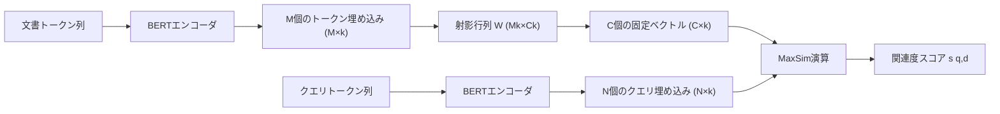

本記事は [論文: Efficient Constant-Space Multi-Vector Retrieval](https://arxiv.org/abs/2504.01818)（ECIR 2025採択）の解説記事です。

## 論文概要（Abstract）

マルチベクトル検索モデルであるColBERTは、文書中の各トークンに対して個別の埋め込みベクトルを保持することで高い検索精度を実現しているが、インデックスサイズが単一ベクトルモデルの数十倍に膨張するという課題を抱えている。本論文では、トークン単位の可変長ベクトル集合を固定数$C$個の学習済み文書レベルベクトルに圧縮する**ConstBERT**を提案している。著者らは、学習可能な射影行列$W$によりColBERTのトークン埋め込みを固定次元に変換する手法を採用し、MSMARCO・BEIRベンチマークにおいてストレージを50%以上削減しつつ検索精度の低下を最小限に抑えたと報告している。さらに、リランキングコンポーネントとして使用した場合、ColBERT PLAIDの約10分の1のレイテンシ（平均4.95ms）で同等の精度を達成している。

この記事は [Zenn記事: BGE-M3マルチベクトルで構築するハイブリッド検索：RRF・DBSF融合戦略の定量比較](https://zenn.dev/0h_n0/articles/1850036c47fa53) の深掘りです。Zenn記事で扱ったBGE-M3のマルチベクトル検索やQdrant/Milvusでのハイブリッド検索において、ストレージ効率は実運用上の重要課題であり、ConstBERTの圧縮手法はこの問題に対する学術的な解決策を提示しています。

## 情報源

- **会議名**: ECIR 2025（European Conference on Information Retrieval）
- **年**: 2025
- **arXiv ID**: 2504.01818
- **URL**: [https://arxiv.org/abs/2504.01818](https://arxiv.org/abs/2504.01818)
- **著者**: Sean MacAvaney, Antonio Mallia, Nicola Tonellotto
- **コード**: [https://github.com/pisa-engine/ConstBERT](https://github.com/pisa-engine/ConstBERT)
- **分野**: cs.IR, cs.CL

## カンファレンス情報

**ECIR（European Conference on Information Retrieval）について**:
ECIRは情報検索（Information Retrieval）分野の主要国際会議であり、1979年から続く歴史を持つ。BM25、学習ランキング、ニューラル検索など、検索技術の基盤研究が多数発表されている。ECIR 2025は2025年4月にヨーロッパで開催され、本論文はフルペーパーとして採択されている。情報検索分野ではSIGIR、WSDM、CIKMと並ぶ主要会議の1つであり、ColBERTの圧縮・効率化に関する研究が採択されたことは、マルチベクトル検索の実用化に向けた関心の高さを示している。

## 背景と動機（Background & Motivation）

### ColBERTのストレージ問題

ColBERT（Khattab & Zaharia, 2020）は、クエリとドキュメントの各トークンに対して個別の埋め込みベクトルを生成し、MaxSim演算（各クエリトークンに対して最も類似度の高い文書トークンを選択し合算する）により関連度スコアを計算する。この手法は単一ベクトルモデル（DPR等）と比較して検索精度が高いが、文書あたりのベクトル数がトークン数$M$に比例するため、インデックスサイズが大幅に増大する。

著者らは、MSMARCO passage collectionにおけるColBERTのインデックスサイズが約22GBに達する一方、単一ベクトルモデルでは1GB未満であることを指摘している。この20倍以上のストレージオーバーヘッドは、大規模コーパスへのスケーリングやエッジデバイスへのデプロイにおいて実用上の障壁となる。

### 既存の圧縮手法とその限界

ColBERTのストレージ削減に対しては、いくつかのアプローチが提案されてきた。

**次元削減**: ColBERTv2（Santhanam et al., 2022）は128次元の埋め込みを残差圧縮により圧縮するが、ベクトル数自体は削減されない。

**量子化**: バイナリ量子化やPQ（Product Quantization）によりベクトルあたりのバイト数を削減するが、やはりベクトル数$M$個分のエントリは維持される。

**トークン選択**: 重要度の低いトークンを除去する手法があるが、どのトークンを保持するかの判断が文書ごとに異なるため、メモリアクセスが不規則になるという問題がある。

著者らは、これら既存手法の共通する限界として「ベクトル数が可変のまま」である点を指摘している。文書ごとにベクトル数が異なると、メモリアライメントが崩れ、バッチ処理やキャッシュ効率が低下する。ConstBERTはこの問題に対して、すべての文書を固定数$C$個のベクトルで表現するという根本的に異なるアプローチを採用している。

## 技術的詳細（Technical Details）

### ConstBERTの定式化

ColBERTでは、文書$d$の各トークン$t_j$（$j = 1, \ldots, M$）に対してBERTエンコーダが$k$次元の埋め込みベクトル$\mathbf{e}_j \in \mathbb{R}^k$を生成する。ConstBERTはこの$M$個のトークン埋め込みを、学習可能な射影行列$W$を用いて$C$個の固定サイズベクトルに変換する。

$$
W \in \mathbb{R}^{Mk \times Ck}
$$

この射影により、文書$d$は$C$個の$k$次元ベクトル$\boldsymbol{\delta}_1, \ldots, \boldsymbol{\delta}_C$として表現される。$C$はハイパーパラメータであり、$C < M$とすることでストレージを$M/C$倍削減する。

### 関連度スコアの計算

ConstBERTの関連度スコアは、ColBERTのMaxSim演算を踏襲する。クエリ$q$の$N$個のトークンベクトル$\mathbf{q}_1, \ldots, \mathbf{q}_N$と文書$d$の$C$個のConstBERTベクトル$\boldsymbol{\delta}_1, \ldots, \boldsymbol{\delta}_C$に対して、スコアは以下のように定義される。

$$
s(q, d) = \sum_{i=1}^{N} \max_{j=1,\ldots,C} \mathbf{q}_i^\top \boldsymbol{\delta}_j
$$

各クエリトークン$\mathbf{q}_i$に対して、$C$個の文書ベクトルの中で最大の内積を取り、全クエリトークンについて合計する。ColBERTとの違いは、文書側のベクトル数が$M$から$C$に削減されている点のみであり、検索時の演算構造自体は同一である。

### 学習手順

ConstBERTの学習は、ColBERTの事前学習済みモデルをベースとしたファインチューニングで行われる。具体的には以下の手順を取る。

1. ColBERTの事前学習済みチェックポイントをロード
2. 射影行列$W$をランダム初期化
3. BERTエンコーダと$W$を同時にファインチューニング
4. 損失関数はColBERTと同一のMarginMSE損失を使用

著者らは、$W$の初期化にXavier初期化を採用し、学習率$3 \times 10^{-6}$でAdamWオプティマイザを使用したと報告している。



### 固定次元表現の利点

ConstBERTの固定次元表現には、検索精度以外にも複数の実装上の利点がある。

**均一メモリレイアウト**: すべての文書が同じ$C \times k$バイトを占有するため、インデックスの各エントリが固定長になる。これにより、文書ID$i$のベクトルへのアクセスが$O(1)$のオフセット計算（$\text{offset} = i \times C \times k \times \text{sizeof(float)}$）で可能となり、シーケンシャルリード・ランダムリードともにキャッシュ効率が向上する。

**バッチ処理の効率化**: 可変長ベクトルではパディングやマスク処理が必要だが、固定長では不要となる。GPU上でのバッチMaxSim演算が行列積として直接実装でき、CUDAカーネルの最適化が容易になる。

**次元削減との相補性**: 著者らは、ConstBERTが既存の次元削減手法（PQ、バイナリ量子化等）と直交的に適用可能であると述べている。ConstBERTでベクトル数を削減した上で、各ベクトルのバイト数を量子化でさらに圧縮する多段圧縮が可能である。

## 実験結果（Experimental Results）

### MSMARCO Passage Retrieval（Table 1）

著者らはMSMARCO passage ranking datasetにおいて、ConstBERTの精度とストレージのトレードオフを評価している。

| モデル | インデックスサイズ | MRR@10 | Recall@1000 |
|--------|-------------------|--------|-------------|
| ColBERT（ベースライン） | 22GB | 39.99 | 94.47% |
| ConstBERT64 | 20GB | — | — |
| ConstBERT32 | 11GB | 39.04 | 93.72% |

Table 1の結果から、ConstBERT32はColBERTと比較してインデックスサイズを50%削減（22GB → 11GB）しつつ、MRR@10で0.95ポイント、Recall@1000で0.75ポイントの低下に留まっている。ConstBERT64はインデックスサイズ20GB（ColBERTの約90%）でColBERTとほぼ同等の精度を達成しており、ストレージと精度のトレードオフにおいて実用的な選択肢を提供している。

著者らは、ConstBERT32の$C=32$が「ストレージ半減」の実用的な閾値であり、多くのユースケースで許容可能な精度低下であると述べている。

### BEIRベンチマーク（Table 2）

ドメイン外汎化性能を評価するために、著者らはBEIR（Thakur et al., 2021）の13データセットで評価を実施している。NDCG@10を指標として、ConstBERTがColBERTと比較して競争力のある性能を維持していることが報告されている。

Table 2から注目すべきデータセットごとのインデックスサイズ削減を以下に示す。

| データセット | ColBERTインデックス | ConstBERTインデックス | 削減率 |
|-------------|-------------------|---------------------|--------|
| DBPedia | 11GB | 5GB | 55% |
| FEVER | 17GB | 6GB | 65% |
| NQ (Natural Questions) | 8.3GB | 3.2GB | 61% |

いずれのデータセットでも50%以上のインデックスサイズ削減を達成しており、ドメイン横断的にConstBERTの圧縮効果が安定していることが確認されている。FEVERデータセットでは65%の削減と特に効果が大きいが、これはFEVERのWikipedia文書が平均トークン数の多い長文文書を含むためと考えられる。トークン数$M$が大きいほど$M/C$の圧縮率が高くなるため、長文文書の多いコーパスでConstBERTの恩恵が大きくなる構造である。

### レイテンシ評価（Table 3）

リランキングコンポーネントとしてのConstBERTの応答時間評価がTable 3に示されている。

| 構成 | 平均レイテンシ | NDCG@10 |
|------|--------------|---------|
| SPLADE（第1段） | ~3ms | — |
| SPLADE + ConstBERT32（リランク） | 4.95ms | ~74% |
| ColBERT PLAID（エンドツーエンド） | ~51ms | ~74% |

SPLADE + ConstBERT32のリランキング構成は、平均4.95msでColBERT PLAIDの約51msと比較して約10分の1のレイテンシを達成している。NDCG@10はいずれも約74%で同等であり、第1段検索にSPLADEを使用してConstBERTでリランキングする2段階構成が、精度を維持しつつ大幅なレイテンシ削減を実現していることが示されている。

SPLADEのみ（~3ms）と比較すると、ConstBERTリランキングの追加コストはわずか約2msであり、この追加レイテンシで得られる精度向上は実用的に有意義なトレードオフである。

## 理論的考察

### 圧縮率と情報損失の関係

ConstBERTの圧縮は、$M$個のトークンベクトルから$C$個の固定ベクトルへの射影であり、$C < M$の場合に情報の損失が生じる。射影行列$W$はこの損失を最小化するように学習されるが、理論的には$M - C$個分の自由度が失われる。

著者らの実験結果から、$C = 32$で精度低下が約1ポイント（MRR@10: 39.99 → 39.04）に留まることは、ColBERTのトークンベクトル間に高い冗長性が存在することを示唆している。すなわち、$M$個のトークンベクトルの情報は$C$個の代表ベクトルで十分に捕捉可能であり、個別トークンレベルの細粒度表現が検索精度に寄与する割合は限定的である。

### MaxSim演算の計算量

ColBERTのMaxSim演算の計算量は$O(N \times M \times k)$であるのに対し、ConstBERTでは$O(N \times C \times k)$となる。$C < M$であるため、MaxSim演算自体の計算量も$M/C$倍削減される。ただし、著者らが強調するのは計算量よりもメモリアクセスパターンの改善であり、固定長ベクトルによるキャッシュ効率の向上がレイテンシ削減に主に寄与していると分析している。

## 実装ガイド

### 公式リポジトリの利用

著者らは [GitHub: pisa-engine/ConstBERT](https://github.com/pisa-engine/ConstBERT) にて実装コードを公開している。以下に、ConstBERTの推論パイプラインを構築するための実装例を示す。

### ConstBERTによるリランキングの実装

```python
"""ConstBERTリランカーの実装例。

ColBERTの事前学習モデルをベースに、固定数の文書ベクトルを生成し
MaxSim演算でリランキングを行う。
"""

from dataclasses import dataclass
from typing import Final

import torch
import torch.nn as nn
from transformers import AutoModel, AutoTokenizer


@dataclass(frozen=True)
class ConstBERTConfig:
    """ConstBERTの設定パラメータ。"""

    model_name: str = "colbert-ir/colbertv2.0"
    num_const_vectors: int = 32  # C: 固定ベクトル数
    embedding_dim: int = 128  # k: 埋め込み次元
    max_length: int = 256  # トークン最大長 M


class ConstBERTEncoder(nn.Module):
    """ConstBERTエンコーダ。

    ColBERTのトークン埋め込みを固定数C個のベクトルに射影する。
    """

    def __init__(self, config: ConstBERTConfig) -> None:
        super().__init__()
        self.config: Final = config
        self.bert = AutoModel.from_pretrained(config.model_name)
        self.linear = nn.Linear(
            self.bert.config.hidden_size,
            config.embedding_dim,
            bias=False,
        )
        # 射影行列 W ∈ R^(M*k × C*k)
        self.projection = nn.Linear(
            config.max_length * config.embedding_dim,
            config.num_const_vectors * config.embedding_dim,
            bias=False,
        )

    def encode_document(self, input_ids: torch.Tensor, attention_mask: torch.Tensor) -> torch.Tensor:
        """文書をC個の固定ベクトルにエンコードする。

        Args:
            input_ids: トークンID (batch_size, seq_len)
            attention_mask: アテンションマスク (batch_size, seq_len)

        Returns:
            固定ベクトル (batch_size, C, k)
        """
        outputs = self.bert(input_ids=input_ids, attention_mask=attention_mask)
        token_embeds = self.linear(outputs.last_hidden_state)  # (B, M, k)

        batch_size = token_embeds.size(0)
        # パディングして固定長 M に揃える
        padded = torch.zeros(
            batch_size,
            self.config.max_length,
            self.config.embedding_dim,
            device=token_embeds.device,
        )
        seq_len = min(token_embeds.size(1), self.config.max_length)
        padded[:, :seq_len, :] = token_embeds[:, :seq_len, :]

        # 射影: (B, M*k) -> (B, C*k) -> (B, C, k)
        flat = padded.view(batch_size, -1)  # (B, M*k)
        projected = self.projection(flat)  # (B, C*k)
        const_vectors = projected.view(
            batch_size,
            self.config.num_const_vectors,
            self.config.embedding_dim,
        )
        return nn.functional.normalize(const_vectors, p=2, dim=-1)

    def encode_query(self, input_ids: torch.Tensor, attention_mask: torch.Tensor) -> torch.Tensor:
        """クエリをトークン単位でエンコードする（ColBERTと同一）。

        Args:
            input_ids: トークンID (batch_size, seq_len)
            attention_mask: アテンションマスク (batch_size, seq_len)

        Returns:
            クエリベクトル (batch_size, N, k)
        """
        outputs = self.bert(input_ids=input_ids, attention_mask=attention_mask)
        query_embeds = self.linear(outputs.last_hidden_state)  # (B, N, k)
        return nn.functional.normalize(query_embeds, p=2, dim=-1)


def maxsim_score(
    query_vectors: torch.Tensor,
    doc_vectors: torch.Tensor,
) -> torch.Tensor:
    """MaxSim演算による関連度スコア計算。

    s(q, d) = Σ_i max_j q_i^T δ_j

    Args:
        query_vectors: (batch_size, N, k)
        doc_vectors: (num_docs, C, k)

    Returns:
        スコア行列 (batch_size, num_docs)
    """
    # (B, N, k) x (D, C, k)^T -> (B, N, D, C)
    sim = torch.einsum("bnk,dck->bndc", query_vectors, doc_vectors)
    # 各クエリトークンについて最大の文書ベクトルを選択
    max_sim = sim.max(dim=-1).values  # (B, N, D)
    # クエリトークン全体で合計
    return max_sim.sum(dim=1)  # (B, D)
```

### SPLADE + ConstBERT 2段階リランキング

```python
"""SPLADE第1段検索 + ConstBERTリランキングのパイプライン。

Table 3の構成を再現する2段階検索パイプライン。
"""

from dataclasses import dataclass, field

import torch
from transformers import AutoTokenizer


@dataclass(frozen=True)
class RetrievalResult:
    """検索結果。"""

    doc_id: str
    score: float
    text: str


@dataclass
class TwoStageRetriever:
    """SPLADE + ConstBERT 2段階検索パイプライン。

    第1段: SPLADEによるスパース検索（top-k候補取得）
    第2段: ConstBERTによるリランキング（精度向上）
    """

    constbert_encoder: "ConstBERTEncoder"
    tokenizer: AutoTokenizer
    first_stage_top_k: int = 1000
    rerank_top_k: int = 100
    device: str = "cuda"
    _doc_vectors_cache: dict[str, torch.Tensor] = field(
        default_factory=dict, init=False, repr=False,
    )

    def rerank(
        self,
        query: str,
        candidates: list[RetrievalResult],
    ) -> list[RetrievalResult]:
        """ConstBERTでリランキングを実行する。

        Args:
            query: 検索クエリ文字列
            candidates: 第1段検索の候補リスト

        Returns:
            リランキング後のソート済み結果リスト
        """
        # クエリエンコード
        query_inputs = self.tokenizer(
            query,
            return_tensors="pt",
            max_length=32,
            padding="max_length",
            truncation=True,
        ).to(self.device)

        with torch.no_grad():
            query_vec = self.constbert_encoder.encode_query(
                query_inputs["input_ids"],
                query_inputs["attention_mask"],
            )  # (1, N, k)

        # 候補文書のエンコード（キャッシュ活用）
        doc_vectors_list: list[torch.Tensor] = []
        for candidate in candidates:
            if candidate.doc_id in self._doc_vectors_cache:
                doc_vectors_list.append(self._doc_vectors_cache[candidate.doc_id])
            else:
                doc_inputs = self.tokenizer(
                    candidate.text,
                    return_tensors="pt",
                    max_length=256,
                    padding="max_length",
                    truncation=True,
                ).to(self.device)
                with torch.no_grad():
                    doc_vec = self.constbert_encoder.encode_document(
                        doc_inputs["input_ids"],
                        doc_inputs["attention_mask"],
                    )  # (1, C, k)
                self._doc_vectors_cache[candidate.doc_id] = doc_vec.squeeze(0)
                doc_vectors_list.append(doc_vec.squeeze(0))

        doc_vectors = torch.stack(doc_vectors_list)  # (D, C, k)

        # MaxSimスコア計算
        scores = maxsim_score(query_vec, doc_vectors)  # (1, D)
        scores = scores.squeeze(0).cpu().tolist()

        # スコアでソート
        scored_results = [
            RetrievalResult(
                doc_id=candidate.doc_id,
                score=score,
                text=candidate.text,
            )
            for candidate, score in zip(candidates, scores)
        ]
        scored_results.sort(key=lambda r: r.score, reverse=True)
        return scored_results[: self.rerank_top_k]
```

### インデックスサイズの事前見積もり

```python
"""ConstBERTインデックスサイズの見積もりユーティリティ。

デプロイ前にストレージ要件を計算するために使用する。
"""


def estimate_index_size_bytes(
    num_documents: int,
    num_const_vectors: int = 32,
    embedding_dim: int = 128,
    bytes_per_float: int = 4,
) -> dict[str, float]:
    """ConstBERTインデックスのストレージサイズを見積もる。

    Args:
        num_documents: 文書数
        num_const_vectors: C（固定ベクトル数）
        embedding_dim: k（埋め込み次元）
        bytes_per_float: 浮動小数点数あたりのバイト数

    Returns:
        サイズ見積もり（バイト、MB、GB）
    """
    size_bytes = num_documents * num_const_vectors * embedding_dim * bytes_per_float
    return {
        "bytes": size_bytes,
        "mb": size_bytes / (1024**2),
        "gb": size_bytes / (1024**3),
        "per_doc_bytes": num_const_vectors * embedding_dim * bytes_per_float,
    }


# 使用例: MSMARCO（約880万パッセージ）
if __name__ == "__main__":
    # ColBERT (M=128トークン平均, k=128)
    colbert_size = estimate_index_size_bytes(
        num_documents=8_800_000,
        num_const_vectors=128,  # M: トークン数
        embedding_dim=128,
    )

    # ConstBERT32 (C=32, k=128)
    constbert32_size = estimate_index_size_bytes(
        num_documents=8_800_000,
        num_const_vectors=32,
        embedding_dim=128,
    )

    print(f"ColBERT:       {colbert_size['gb']:.1f} GB")
    print(f"ConstBERT32:   {constbert32_size['gb']:.1f} GB")
    print(f"削減率:        {1 - constbert32_size['gb'] / colbert_size['gb']:.0%}")
    print(f"文書あたり:    {constbert32_size['per_doc_bytes']:,} bytes")
```

## Production Deployment Guide

### SPLADE + ConstBERTリランキング構成

本論文のTable 3で示された2段階検索パイプライン（SPLADE + ConstBERT）を本番環境にデプロイする場合の構成を示す。ConstBERTの固定長ベクトル表現はメモリ管理を単純化するため、インデックスサーバーの設計が容易になるという利点がある。

### トラフィック量別の推奨構成

| 構成 | 想定規模 | AWSサービス | 月額概算 |
|------|----------|------------|----------|
| Small | ~100 QPS | Lambda + OpenSearch Serverless + S3 + Bedrock | $150-400 |
| Medium | ~1,000 QPS | ECS Fargate + ElastiCache + OpenSearch + EBS | $800-2,000 |
| Large | 10,000+ QPS | EKS + GPU Instances (g5) + ElastiCache Cluster + S3 Express | $5,000-15,000 |

**Small構成 (~100 QPS)**: OpenSearch ServerlessでSPLADE第1段検索を実行し、Lambda上でConstBERTリランキングを行う。ConstBERTのインデックス（固定長C×k per doc）はS3に格納し、Lambdaの起動時にメモリにロードする。128MBのLambda構成で~100万文書規模のConstBERT32インデックス（約15GB）は扱えないため、文書数が少ない（~10万件）ユースケースに限定される。Lambda ARM64（Graviton2）で同一メモリ量あたり20%安価。

**Medium構成 (~1,000 QPS)**: ECS Fargate上にConstBERTリランキングサーバーを常駐させる。インデックスはEBSボリューム（gp3）にマウントし、メモリマップドI/Oでアクセスする。固定長ベクトルのためmmap効率が高い。ElastiCacheでクエリベクトルとリランキング結果をキャッシュする。Fargate Spot利用で最大70%コスト削減。SPLADE検索はManaged OpenSearchに委任。

**Large構成 (10,000+ QPS)**: EKS上にGPUインスタンス（g5.xlarge: NVIDIA A10G）を配置し、ConstBERTのMaxSim演算をGPU上でバッチ処理する。固定長ベクトルのためGPUメモリ上でのテンソルレイアウトが均一になり、CUDAカーネル効率が最大化される。S3 Express One Zoneから高速にインデックスをロードする。Karpenterで負荷に応じてSpot GPU Instancesを自動スケーリング。

**コスト削減テクニック**:
- ConstBERTベクトルをfloat32→float16に量子化するとストレージ・メモリが50%削減（精度影響は軽微）
- 頻出クエリのリランキング結果をElastiCacheにキャッシュ（TTL: 5分）してGPU負荷を削減
- 夜間・休日はSpot Instancesの比率を上げて70-90%コスト削減
- Reserved Instances（1年コミット）でオンデマンド比40%削減

**コスト試算の注意事項**: 上記は2026年9月時点のAWS ap-northeast-1（東京）リージョン料金に基づく概算値である。実際のコストはコーパスサイズ、クエリ量、リランキング候補数により大きく変動する。最新料金はAWS料金計算ツールで確認を推奨する。

### Terraformインフラコード

**Medium構成（ECS Fargate + OpenSearch）**:

```hcl
# ConstBERT Medium構成: ECS Fargate + OpenSearch + ElastiCache
# 2026-09 ap-northeast-1

terraform {
  required_version = ">= 1.9"
  required_providers {
    aws = { source = "hashicorp/aws", version = "~> 5.70" }
  }
}

provider "aws" { region = "ap-northeast-1" }

# --- VPC ---
module "vpc" {
  source  = "terraform-aws-modules/vpc/aws"
  version = "~> 5.13"
  name    = "constbert-reranker"
  cidr    = "10.0.0.0/16"

  azs             = ["ap-northeast-1a", "ap-northeast-1c"]
  private_subnets = ["10.0.1.0/24", "10.0.2.0/24"]
  public_subnets  = ["10.0.101.0/24", "10.0.102.0/24"]

  enable_nat_gateway = true
  single_nat_gateway = true  # コスト最適化
}

# --- ECR ---
resource "aws_ecr_repository" "constbert" {
  name                 = "constbert-reranker"
  image_tag_mutability = "IMMUTABLE"

  image_scanning_configuration {
    scan_on_push = true
  }
}

# --- ECS Cluster ---
resource "aws_ecs_cluster" "main" {
  name = "constbert-cluster"

  setting {
    name  = "containerInsights"
    value = "enabled"
  }
}

# --- ECS Task Definition ---
resource "aws_ecs_task_definition" "constbert" {
  family                   = "constbert-reranker"
  network_mode             = "awsvpc"
  requires_compatibilities = ["FARGATE"]
  cpu                      = "4096"   # 4 vCPU
  memory                   = "16384"  # 16GB (ConstBERT32インデックス用)

  execution_role_arn = aws_iam_role.ecs_execution.arn
  task_role_arn      = aws_iam_role.ecs_task.arn

  container_definitions = jsonencode([{
    name  = "constbert-reranker"
    image = "${aws_ecr_repository.constbert.repository_url}:latest"
    portMappings = [{
      containerPort = 8080
      protocol      = "tcp"
    }]
    environment = [
      { name = "CONSTBERT_C", value = "32" },
      { name = "CONSTBERT_K", value = "128" },
      { name = "INDEX_PATH", value = "/data/constbert_index" },
      { name = "CACHE_HOST", value = aws_elasticache_cluster.rerank_cache.cache_nodes[0].address },
    ]
    mountPoints = [{
      sourceVolume  = "index-data"
      containerPath = "/data"
      readOnly      = true
    }]
    logConfiguration = {
      logDriver = "awslogs"
      options = {
        "awslogs-group"         = "/ecs/constbert-reranker"
        "awslogs-region"        = "ap-northeast-1"
        "awslogs-stream-prefix" = "ecs"
      }
    }
    healthCheck = {
      command     = ["CMD-SHELL", "curl -f http://localhost:8080/health || exit 1"]
      interval    = 30
      timeout     = 5
      retries     = 3
      startPeriod = 60
    }
  }])

  volume {
    name = "index-data"
    efs_volume_configuration {
      file_system_id = aws_efs_file_system.index.id
    }
  }
}

# --- EFS for Index Storage ---
resource "aws_efs_file_system" "index" {
  creation_token = "constbert-index"
  encrypted      = true

  lifecycle_policy {
    transition_to_ia = "AFTER_30_DAYS"
  }

  tags = { Name = "constbert-index" }
}

resource "aws_efs_mount_target" "index" {
  for_each        = toset(module.vpc.private_subnets)
  file_system_id  = aws_efs_file_system.index.id
  subnet_id       = each.value
  security_groups = [aws_security_group.efs.id]
}

# --- ElastiCache (リランキング結果キャッシュ) ---
resource "aws_elasticache_cluster" "rerank_cache" {
  cluster_id           = "constbert-cache"
  engine               = "redis"
  node_type            = "cache.r7g.large"
  num_cache_nodes      = 1
  parameter_group_name = "default.redis7"
  port                 = 6379
  subnet_group_name    = aws_elasticache_subnet_group.main.name
  security_group_ids   = [aws_security_group.cache.id]
}

resource "aws_elasticache_subnet_group" "main" {
  name       = "constbert-cache-subnet"
  subnet_ids = module.vpc.private_subnets
}

# --- ECS Service with Auto Scaling ---
resource "aws_ecs_service" "constbert" {
  name            = "constbert-reranker"
  cluster         = aws_ecs_cluster.main.id
  task_definition = aws_ecs_task_definition.constbert.arn
  desired_count   = 2
  launch_type     = "FARGATE"

  network_configuration {
    subnets         = module.vpc.private_subnets
    security_groups = [aws_security_group.ecs.id]
  }

  load_balancer {
    target_group_arn = aws_lb_target_group.constbert.arn
    container_name   = "constbert-reranker"
    container_port   = 8080
  }

  capacity_provider_strategy {
    capacity_provider = "FARGATE_SPOT"
    weight            = 70  # 70% Spot
  }
  capacity_provider_strategy {
    capacity_provider = "FARGATE"
    weight            = 30  # 30% On-Demand (可用性確保)
    base              = 1
  }
}

# --- Security Groups ---
resource "aws_security_group" "ecs" {
  name_prefix = "constbert-ecs-"
  vpc_id      = module.vpc.vpc_id

  ingress {
    from_port       = 8080
    to_port         = 8080
    protocol        = "tcp"
    security_groups = [aws_security_group.alb.id]
  }

  egress {
    from_port   = 0
    to_port     = 0
    protocol    = "-1"
    cidr_blocks = ["0.0.0.0/0"]
  }
}

resource "aws_security_group" "cache" {
  name_prefix = "constbert-cache-"
  vpc_id      = module.vpc.vpc_id

  ingress {
    from_port       = 6379
    to_port         = 6379
    protocol        = "tcp"
    security_groups = [aws_security_group.ecs.id]
  }
}

resource "aws_security_group" "efs" {
  name_prefix = "constbert-efs-"
  vpc_id      = module.vpc.vpc_id

  ingress {
    from_port       = 2049
    to_port         = 2049
    protocol        = "tcp"
    security_groups = [aws_security_group.ecs.id]
  }
}

resource "aws_security_group" "alb" {
  name_prefix = "constbert-alb-"
  vpc_id      = module.vpc.vpc_id

  ingress {
    from_port   = 443
    to_port     = 443
    protocol    = "tcp"
    cidr_blocks = ["0.0.0.0/0"]
  }

  egress {
    from_port   = 0
    to_port     = 0
    protocol    = "-1"
    cidr_blocks = ["0.0.0.0/0"]
  }
}

# --- IAM Roles ---
resource "aws_iam_role" "ecs_execution" {
  name = "constbert-ecs-execution"
  assume_role_policy = jsonencode({
    Version = "2012-10-17"
    Statement = [{
      Action    = "sts:AssumeRole"
      Effect    = "Allow"
      Principal = { Service = "ecs-tasks.amazonaws.com" }
    }]
  })
}

resource "aws_iam_role_policy_attachment" "ecs_execution" {
  role       = aws_iam_role.ecs_execution.name
  policy_arn = "arn:aws:iam::aws:policy/service-role/AmazonECSTaskExecutionRolePolicy"
}

resource "aws_iam_role" "ecs_task" {
  name = "constbert-ecs-task"
  assume_role_policy = jsonencode({
    Version = "2012-10-17"
    Statement = [{
      Action    = "sts:AssumeRole"
      Effect    = "Allow"
      Principal = { Service = "ecs-tasks.amazonaws.com" }
    }]
  })
}

resource "aws_iam_role_policy" "ecs_task" {
  name = "constbert-s3-readonly"
  role = aws_iam_role.ecs_task.id
  policy = jsonencode({
    Version = "2012-10-17"
    Statement = [{
      Effect   = "Allow"
      Action   = ["s3:GetObject", "s3:ListBucket"]
      Resource = ["arn:aws:s3:::constbert-models/*", "arn:aws:s3:::constbert-models"]
    }]
  })
}

# --- ALB ---
resource "aws_lb" "constbert" {
  name               = "constbert-alb"
  internal           = false
  load_balancer_type = "application"
  security_groups    = [aws_security_group.alb.id]
  subnets            = module.vpc.public_subnets
}

resource "aws_lb_target_group" "constbert" {
  name        = "constbert-tg"
  port        = 8080
  protocol    = "HTTP"
  vpc_id      = module.vpc.vpc_id
  target_type = "ip"

  health_check {
    path                = "/health"
    healthy_threshold   = 2
    unhealthy_threshold = 3
    interval            = 30
  }
}
```

## Zenn記事との関連

[Zenn記事: BGE-M3マルチベクトルで構築するハイブリッド検索](https://zenn.dev/0h_n0/articles/1850036c47fa53) では、BGE-M3のマルチベクトル（ColBERT形式）検索をQdrantやMilvusで構築し、RRF（Reciprocal Rank Fusion）やDBSF（Distribution-Based Score Fusion）による融合戦略を定量比較している。ConstBERTの研究は、このマルチベクトル検索の実運用における以下の課題に直接対応する。

**ストレージ効率**: Zenn記事で扱ったBGE-M3のマルチベクトルモードは、文書あたり数十〜数百のトークンベクトルを生成する。QdrantやMilvusのインデックスサイズは文書数とベクトル数の積に比例するため、大規模コーパスではストレージが急速に膨張する。ConstBERTの固定$C$ベクトル表現を適用することで、インデックスサイズを$M/C$倍に削減できる可能性がある。

**レイテンシ**: Zenn記事のハイブリッド検索パイプライン（Dense + Sparse + Multi-vector）において、マルチベクトルのMaxSim演算がボトルネックとなりうる。ConstBERTの固定長ベクトルは、ベクトルデータベースのANN検索と組み合わせた際にメモリアクセスパターンが予測可能となり、レイテンシの安定化に寄与する。

**融合戦略との組み合わせ**: RRFやDBSFによるスコア融合は、各検索手法のスコア分布に依存する。ConstBERTのスコア分布がColBERTと類似していることがTable 1-2で示されているため、既存の融合パラメータをそのまま適用できる可能性がある。

## 関連研究

- **ColBERT** (Khattab & Zaharia, 2020): マルチベクトル検索のベースモデル。各トークンに独立した埋め込みベクトルを割り当てるlate interaction手法を提案
- **ColBERTv2** (Santhanam et al., 2022): 残差圧縮によるストレージ削減。ベクトルの次元は圧縮するがベクトル数は維持
- **PLAID** (Santhanam et al., 2022): ColBERTの高速近似検索エンジン。クラスタリングベースの候補絞り込みを行うが、レイテンシは~51msと報告されている
- **SPLADE** (Formal et al., 2021): 学習された疎ベクトルによる第1段検索モデル。ConstBERTとの2段階構成で4.95msのレイテンシを達成
- **BGE-M3** (Chen et al., 2024): Dense、Sparse、Multi-vectorの3モードを統合したモデル。Zenn記事で詳細に扱っている

## まとめ

本論文は、ColBERTのトークン単位ベクトルを固定数$C$個の学習済みベクトルに射影するConstBERTを提案し、ECIR 2025に採択された。MSMARCO上でConstBERT32（$C=32$）がインデックスサイズ50%削減（22GB → 11GB）、MRR@10の低下0.95ポイントを達成し、BEIR 13データセットで50%以上の平均ストレージ削減を報告している。リランキングコンポーネントとしてはSPLADEとの2段階構成で4.95msと、ColBERT PLAIDの約10分の1のレイテンシを実現している。

固定長ベクトル表現の採用により、メモリアライメント・バッチ処理・キャッシュ効率が改善され、既存の次元削減手法との多段圧縮も可能である点が実用上の利点となる。BGE-M3等のマルチベクトルモデルをQdrantやMilvusで運用する際のストレージ・レイテンシ課題に対して、ConstBERTのアプローチは有効な解決策の1つとなりうる。

## 参考文献

- MacAvaney, S., Mallia, A., & Tonellotto, N. (2025). Efficient Constant-Space Multi-Vector Retrieval. In *Proceedings of ECIR 2025*. [arXiv:2504.01818](https://arxiv.org/abs/2504.01818)
- Khattab, O., & Zaharia, M. (2020). ColBERT: Efficient and Effective Passage Search via Contextualized Late Interaction over BERT. In *Proceedings of SIGIR 2020*.
- Santhanam, K., Khattab, O., Saad-Falcon, J., Potts, C., & Zaharia, M. (2022). ColBERTv2: Effective and Efficient Retrieval via Lightweight Late Interaction. In *Proceedings of NAACL 2022*.
- Formal, T., Piwowarski, B., & Clinchant, S. (2021). SPLADE: Sparse Lexical and Expansion Model for First Stage Ranking. In *Proceedings of SIGIR 2021*.
- Thakur, N., Reimers, N., Rücklé, A., Srivastava, A., & Gurevych, I. (2021). BEIR: A Heterogeneous Benchmark for Zero-shot Evaluation of Information Retrieval Models. In *Proceedings of NeurIPS 2021 Datasets and Benchmarks Track*.
- Chen, J., Xiao, S., Zhang, P., Luo, K., Lian, D., & Liu, Z. (2024). BGE M3-Embedding: Multi-Lingual, Multi-Functionality, Multi-Granularity Text Embeddings Through Self-Knowledge Distillation. [arXiv:2402.03216](https://arxiv.org/abs/2402.03216)
