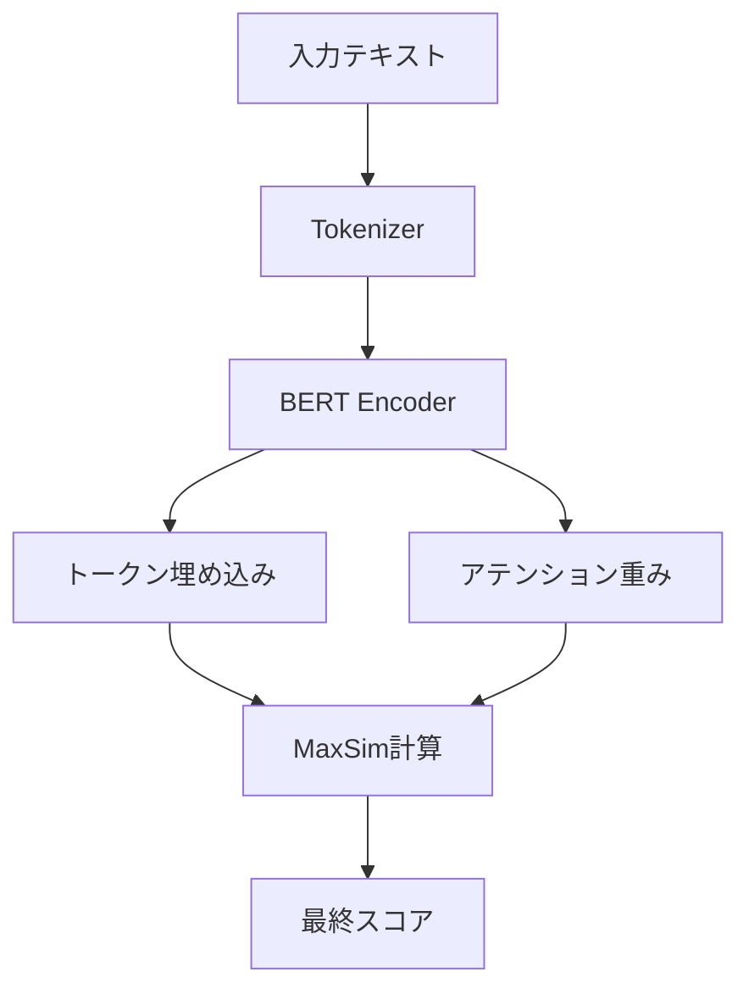

## 論文概要（Abstract）

本記事は [論文: ColBERT-Att](https://arxiv.org/abs/2603.25248) の解説記事です。

ColBERT-Attは、ColBERTのlate-interactionアーキテクチャにおけるMaxSimスコアリングにアテンション重みを統合した手法である。従来のColBERTでは全トークンが均等に扱われていたのに対し、ColBERT-Attはエンコーディング時に得られるアテンション重みを活用してトークンごとの重要度を反映する。著者らは、クエリ側とドキュメント側の両方にアテンション重みを導入し、さらにドキュメント長の正規化パラメータ $\delta$ を組み合わせることで、MS-MARCO、LoTTE、BEIRの各ベンチマークにおいてColBERTv2を上回る性能を達成したと報告している。アテンション重みはTransformerエンコーディングの副産物であり、推論時の追加レイテンシは発生しない点が実用上の利点として挙げられている。

この記事は [Zenn記事: BGE-M3マルチベクトルで構築するハイブリッド検索：RRF・DBSF融合戦略の定量比較](https://zenn.dev/0h_n0/articles/1850036c47fa53) の深掘りです。

## 情報源

- **arXiv ID**: 2603.25248
- **URL**: [https://arxiv.org/abs/2603.25248](https://arxiv.org/abs/2603.25248)
- **著者**: Raj Nath Patel, Sourav Dutta
- **発表年**: 2026年3月
- **分野**: cs.IR（情報検索）

## 背景と動機（Background & Motivation）

情報検索モデルは大きく3つのパラダイムに分類される。bi-encoder（クエリとドキュメントを独立にエンコードし単一ベクトルで類似度計算）、cross-encoder（クエリとドキュメントを連結して精密なスコアリング）、そしてlate-interaction（トークンレベルの埋め込みを保持し、MaxSim演算で類似度を計算）である。

ColBERTに代表されるlate-interactionモデルは、bi-encoderのインデックス構築効率とcross-encoderに近い精度を両立する手法として注目されてきた。ColBERTv2ではresidual compressionによるストレージ効率化、PLAIDではcentroid-basedの近似検索による高速化が実現されている。

しかし、従来のColBERTのMaxSimスコアリングには構造的な制約がある。全クエリトークン・全ドキュメントトークンが均等な重みで扱われるため、検索クエリにおいて重要なトークン（例: 固有名詞、技術用語）と比較的重要でないトークン（例: 冠詞、前置詞）が同じ影響力を持つ。この問題はストップワード除去やトークンフィルタリングで部分的に対処されてきたが、トークンの重要度を連続値で反映する仕組みは導入されていなかった。

ColBERT-Attは、Transformerのself-attentionメカニズムで生成されるアテンション重みをMaxSimスコアリングに統合することで、この制約を解消するアプローチを提案している。アテンション重みはエンコーディングの過程で自然に生成される副産物であるため、追加の計算コストなしにトークン重要度を利用できるという設計思想に基づいている。

## 主要な貢献（Key Contributions）

- **アテンション重み付きMaxSimスコアリング**: クエリトークンとドキュメントトークンの両方にアテンション重みを導入した修正スコアリング関数の定式化
- **文書長正規化パラメータ $\delta$**: 訓練データと検索対象で文書長分布が異なる場合の性能劣化を防ぐ正規化メカニズム
- **ゼロコスト推論**: アテンション重みがTransformerエンコーディングの副産物として得られるため、推論レイテンシへの影響がない実装設計
- **複数ベンチマークでの一貫した改善**: MS-MARCO、LoTTE（Search/Forum）、BEIRの各データセットでColBERTv2_PLAIDを上回る性能

## 技術的詳細（Technical Details）

### 従来のColBERT MaxSimスコアリング

ColBERTの標準的なスコアリング関数は以下のように定義される。クエリ $Q$ の各トークン $q_i$ に対して、ドキュメント $D$ の全トークン $d_j$ との最大コサイン類似度を求め、その総和をスコアとする。

$$
\mathcal{S}_{\text{ColBERT}}(Q, D) = \sum_{i=1}^{n} \max_{j=1}^{m} (Q_i \odot D_j)
$$

ここで $n$ はクエリのトークン数、$m$ はドキュメントのトークン数、$\odot$ はコサイン類似度演算子である。この定式化では、全てのクエリトークンが同じ重み1で加算されるため、"the"や"a"のようなトークンも固有名詞と同等に扱われる。

### ColBERT-Attの修正スコアリング

ColBERT-Attは、上記のスコアリング関数にアテンション重みと文書長正規化を組み込む。修正されたスコアリング関数は以下の通りである。

$$
\mathcal{S}(Q, D) = \sum_{i=1}^{n} e^{\mathcal{A}_{q_i}} \cdot \max_{j=1}^{m} (Q_i \odot D_j) \cdot (e^{\mathcal{A}_{d_w}})^{\delta}
$$

各項の意味は以下の通りである。

- $\mathcal{A}_{q_i}$: クエリトークン $q_i$ のアテンション重み。Transformerエンコーダの最終層におけるself-attention分布から取得される
- $e^{\mathcal{A}_{q_i}}$: 指数関数によるアテンション重みの変換。重要なトークンの寄与を増幅する
- $\mathcal{A}_{d_w}$: ドキュメント側のアテンション重み。クエリトークン $q_i$ と最大類似度を持つドキュメントトークン $d_w$（すなわち $w = \arg\max_j (Q_i \odot D_j)$）のアテンション重みが使用される
- $(e^{\mathcal{A}_{d_w}})^{\delta}$: ドキュメントアテンション重みに文書長正規化 $\delta$ を適用した項

### 文書長正規化パラメータ $\delta$

$$
\delta = \min\left(1, \frac{\text{doc\_len}}{150}\right)
$$

$\delta$ はドキュメント長に基づく正規化パラメータであり、以下の役割を果たす。

- ドキュメント長が150トークン以上の場合: $\delta = 1$ となり、ドキュメントアテンション重みがそのまま適用される
- ドキュメント長が150トークン未満の場合: $\delta < 1$ となり、ドキュメントアテンション重みの影響が減衰する

値150はMS-MARCOの訓練データにおけるドキュメント長の中央値に基づいて選択されている。訓練時と異なる文書長分布を持つデータセット（例: Quoraの回答文は平均30トークン程度）では、$\delta$ による正規化が性能安定化に寄与する。著者らのアブレーションでは、$\delta$ を導入することでQuoraデータセットにおけるnDCG@10が55%改善したと報告されている。

### アテンション重みの取得方法

アテンション重みはTransformerエンコーダの最終層のself-attention行列から取得される。標準的なTransformerでは、入力シーケンスの各トークンに対するアテンション分布が全ヘッドで計算される。ColBERT-Attではこのアテンション分布をトークン重要度の指標として再利用する。



著者らは「アテンション重みはエンコーディングの固有の副産物であり、推論レイテンシへの影響はない」と述べている。通常のColBERTでもTransformerのforward passでアテンション計算は行われるが、その結果は破棄されている。ColBERT-Attはこの破棄されていた情報を活用するのみであるため、エンコーディング速度は変化しない。スコアリングフェーズでの追加コストは、アテンション重みの乗算のみであり、MaxSim演算と比較して無視できる程度である。

### アブレーション分析

著者らは各コンポーネントの寄与を分離するアブレーションを実施している。

- **クエリアテンションのみ**: $e^{\mathcal{A}_{q_i}}$ のみを適用し、ドキュメント側の重みを1とする。結果は混合的（mixed）であり、データセットによって改善と悪化の両方が観察されている
- **ドキュメントアテンションのみ**: $(e^{\mathcal{A}_{d_w}})^{\delta}$ のみを適用し、クエリ側の重みを1とする。個別コンポーネントとしては最も強い改善を示している
- **両方の統合（ColBERT-Att）**: クエリとドキュメント双方のアテンション重みを組み合わせた構成が最適な結果を達成している
- **$\delta$ の効果**: 文書長正規化なし（$\delta = 1$ 固定）の場合、短文ドキュメントが多いデータセット（Quora等）で性能が大幅に低下する

この結果から、ドキュメント側のアテンション重みがスコアリング改善の主要因であり、クエリアテンションは補助的な役割を果たすことが読み取れる。

## 実験結果（Results）

### MS-MARCO（Dev Set）

著者らはMS-MARCO Dev Setでの検索性能を報告している。

| モデル | R@50 | R@100 | R@1K |
|-------|------|-------|------|
| ColBERTv2\_PLAID | 86.76 | 91.36 | 97.58 |
| ColBERT-Att | 86.78 | 91.54 | 97.64 |

R@50で+0.02、R@100で+0.18、R@1Kで+0.06の改善が確認されている。改善幅は小さいが、MS-MARCOは既にColBERTv2で高い性能に達しているベンチマークであり、飽和領域での改善であることを考慮する必要がある。R@100での+0.18ポイントの改善は、再ランキングパイプラインの入力候補品質の向上に寄与する。

### LoTTE Search（Success@5）

LoTTE（Long-Tail Topic-stratified Evaluation）のSearchサブセットでは、4カテゴリ全てでColBERTv2\_PLAIDを上回る結果が報告されている。

| カテゴリ | ColBERTv2\_PLAID | ColBERT-Att | 差分 |
|----------|-----------------|-------------|------|
| Lifestyle | 84.3 | 84.9 | +0.6 |
| Science | 56.6 | 56.9 | +0.3 |
| Writing | 79.5 | 80.2 | +0.7 |
| Technology | 66.1 | 67.8 | +1.7 |
| **Weighted Avg.** | **72.7** | **73.5** | **+0.8** |

Technologyカテゴリで+1.7ポイントの改善が見られる点は注目に値する。技術文書は専門用語の重要度が高く、アテンション重みによるトークン重要度の反映が効果的に機能したと推測される。

### LoTTE Forum（Success@5）

Forumサブセットの加重平均はColBERTv2\_PLAIDの64.4からColBERT-Attの65.1へ+0.7ポイントの改善が報告されている。フォーラムの投稿はSearchクエリと比較して口語的な表現が多く含まれるが、アテンション重みの効果が一貫して維持されている。

### BEIR（nDCG@10）

BEIRベンチマークでは複数のデータセットで改善が報告されている。

| データセット | ColBERTv2\_PLAID | ColBERT-Att | 差分 |
|------------|-----------------|-------------|------|
| ArguAna | 42.06 | 44.3 | +2.24 |
| FEVER | 76.53 | 77.4 | +0.87 |
| NQ | 48.8 | 49.0 | +0.2 |

ArguAnaでの+2.24ポイントの改善は、全ベンチマーク中で最大の改善幅である。ArguAnaは議論文の検索タスクであり、主張のキーワードと関連する反論を正確にマッチングする必要がある。アテンション重みによるトークン選択の精密化がこの種のタスクに適していることが示唆される。

### 訓練設定

著者らは以下の訓練設定を報告している。

- **訓練ステップ数**: 1M steps
- **GPU**: 2× NVIDIA A100 80GB
- **クエリトークン長**: 32トークン
- **ドキュメントトークン長**: 300トークン
- **文書長クリッピング**: $l = 150$

## 実装のポイント（Implementation）

ColBERT-Attの実装において注意すべき技術的ポイントを以下に整理する。

### アテンション重みの抽出

PyTorchのTransformerエンコーダでは、`output_attentions=True` を指定することでアテンション行列を取得できる。ColBERT-Attでは最終層のアテンション分布を使用する。

```python
from dataclasses import dataclass
from typing import Optional
import torch
from transformers import AutoModel, AutoTokenizer


@dataclass
class ColBERTAttConfig:
    """ColBERT-Att設定

    Attributes:
        model_name: ベースモデル名
        query_max_len: クエリの最大トークン長
        doc_max_len: ドキュメントの最大トークン長
        doc_len_clip: 文書長正規化のクリッピング値
    """
    model_name: str = "colbert-ir/colbertv2.0"
    query_max_len: int = 32
    doc_max_len: int = 300
    doc_len_clip: int = 150


def extract_attention_weights(
    model: AutoModel,
    input_ids: torch.Tensor,
    attention_mask: torch.Tensor,
) -> tuple[torch.Tensor, torch.Tensor]:
    """Transformerエンコーダからトークン埋め込みとアテンション重みを取得する

    Args:
        model: BERTモデル
        input_ids: トークンID (batch_size, seq_len)
        attention_mask: アテンションマスク (batch_size, seq_len)

    Returns:
        (トークン埋め込み, アテンション重み) のタプル
        - embeddings: (batch_size, seq_len, hidden_dim)
        - attention_weights: (batch_size, seq_len)
    """
    outputs = model(
        input_ids=input_ids,
        attention_mask=attention_mask,
        output_attentions=True,
    )

    embeddings = outputs.last_hidden_state

    # 最終層のアテンション: (batch_size, num_heads, seq_len, seq_len)
    last_layer_attention = outputs.attentions[-1]

    # ヘッド平均 → 各トークンが受けるアテンション（列方向の平均）
    # (batch_size, seq_len)
    attention_weights = last_layer_attention.mean(dim=1).mean(dim=1)

    return embeddings, attention_weights
```

### スコアリング関数の実装

```python
def compute_colbert_att_score(
    query_embeddings: torch.Tensor,
    query_attention: torch.Tensor,
    doc_embeddings: torch.Tensor,
    doc_attention: torch.Tensor,
    doc_len: int,
    config: ColBERTAttConfig,
) -> torch.Tensor:
    """ColBERT-Attスコアを計算する

    Args:
        query_embeddings: クエリトークン埋め込み (n, hidden_dim)
        query_attention: クエリアテンション重み (n,)
        doc_embeddings: ドキュメントトークン埋め込み (m, hidden_dim)
        doc_attention: ドキュメントアテンション重み (m,)
        doc_len: ドキュメントの実トークン長（パディング除く）
        config: ColBERT-Att設定

    Returns:
        スコア値 (スカラー)
    """
    # コサイン類似度行列: (n, m)
    query_norm = torch.nn.functional.normalize(query_embeddings, dim=-1)
    doc_norm = torch.nn.functional.normalize(doc_embeddings, dim=-1)
    similarity_matrix = query_norm @ doc_norm.T

    # MaxSim: 各クエリトークンの最大類似度とそのインデックス
    max_sim, max_indices = similarity_matrix.max(dim=-1)  # (n,), (n,)

    # クエリアテンション重み: e^{A_qi}
    query_weight = torch.exp(query_attention)  # (n,)

    # ドキュメントアテンション重み: max_indicesに対応するドキュメントトークンの重み
    doc_weight_selected = doc_attention[max_indices]  # (n,)

    # 文書長正規化: delta = min(1, doc_len / 150)
    delta = min(1.0, doc_len / config.doc_len_clip)

    # ドキュメント重み: (e^{A_dw})^delta
    doc_weight = torch.exp(doc_weight_selected).pow(delta)  # (n,)

    # 最終スコア: Σ e^{A_qi} * MaxSim(qi, D) * (e^{A_dw})^delta
    score = (query_weight * max_sim * doc_weight).sum()

    return score
```

### バッチ処理対応の実装

実運用では複数クエリ・複数ドキュメントのバッチ処理が必要となる。以下に効率的なバッチスコアリングの実装例を示す。

```python
def batch_colbert_att_score(
    query_embeddings: torch.Tensor,
    query_attention: torch.Tensor,
    query_mask: torch.Tensor,
    doc_embeddings: torch.Tensor,
    doc_attention: torch.Tensor,
    doc_lengths: torch.Tensor,
    config: ColBERTAttConfig,
) -> torch.Tensor:
    """バッチ対応のColBERT-Attスコア計算

    Args:
        query_embeddings: (batch_q, n, hidden_dim)
        query_attention: (batch_q, n)
        query_mask: (batch_q, n) パディングマスク
        doc_embeddings: (batch_d, m, hidden_dim)
        doc_attention: (batch_d, m)
        doc_lengths: (batch_d,) 各ドキュメントの実トークン長
        config: ColBERT-Att設定

    Returns:
        スコア行列 (batch_q, batch_d)
    """
    # 正規化
    q_norm = torch.nn.functional.normalize(query_embeddings, dim=-1)
    d_norm = torch.nn.functional.normalize(doc_embeddings, dim=-1)

    # 類似度テンソル: (batch_q, batch_d, n, m)
    sim = torch.einsum("qnh,dmh->qdnm", q_norm, d_norm)

    # MaxSim + 対応するドキュメントトークンのインデックス
    max_sim, max_idx = sim.max(dim=-1)  # (batch_q, batch_d, n)

    # クエリアテンション重み
    q_weight = torch.exp(query_attention).unsqueeze(1)  # (batch_q, 1, n)

    # ドキュメントアテンション重み: max_idxに対応するもの
    # doc_attention: (batch_d, m) → gather用に展開
    batch_d = doc_embeddings.shape[0]
    max_idx_expanded = max_idx  # (batch_q, batch_d, n)
    d_att_expanded = doc_attention.unsqueeze(0).expand(
        query_embeddings.shape[0], -1, -1,
    )  # (batch_q, batch_d, m)
    d_weight_selected = torch.gather(d_att_expanded, 2, max_idx_expanded)  # (batch_q, batch_d, n)

    # 文書長正規化
    delta = torch.clamp(doc_lengths.float() / config.doc_len_clip, max=1.0)  # (batch_d,)
    delta = delta.unsqueeze(0).unsqueeze(-1)  # (1, batch_d, 1)

    d_weight = torch.exp(d_weight_selected).pow(delta)  # (batch_q, batch_d, n)

    # マスク適用（パディングトークンを除外）
    mask = query_mask.unsqueeze(1).float()  # (batch_q, 1, n)

    scores = (q_weight * max_sim * d_weight * mask).sum(dim=-1)  # (batch_q, batch_d)

    return scores
```

## Production Deployment Guide

ColBERT-Attをプロダクション環境にデプロイする際のAWS実装パターンを示す。late-interactionモデルはトークンレベルの埋め込みを保持するため、ストレージとインデックス構築の設計が通常のbi-encoderと異なる。

### AWS実装パターン（コスト最適化重視）

**トラフィック量別の推奨構成**:

| 構成 | トラフィック | アーキテクチャ | 月額コスト概算 |
|------|-------------|---------------|--------------|
| Small | ~100 req/日 | Lambda + S3 + DynamoDB | $50-150 |
| Medium | ~1,000 req/日 | ECS Fargate + ElastiCache + EBS | $300-800 |
| Large | 10,000+ req/日 | EKS + Karpenter + Spot + PLAID | $2,000-5,000 |

**Small構成（~100 req/日）**: Lambda関数でクエリエンコーディングとスコアリングを実行する。ColBERTの埋め込みインデックス（トークンレベルの残差圧縮済みベクトル）はS3に格納し、Lambda起動時にメモリにロードする。ドキュメントのアテンション重みは埋め込みとともにインデックスに含める。月額内訳: Lambda $10-30（メモリ3GB設定、cold start対策にProvisioned Concurrency 1）、S3 $5-20（インデックスサイズ依存）、DynamoDB $5-10（メタデータ）、CloudWatch $5。

**Medium構成（~1,000 req/日）**: ECS Fargateで常時稼働のColBERT-Attサーバを配置する。インデックスはEBSボリュームに格納し、ElastiCacheでホットクエリのスコアリング結果をキャッシュする。PLAIDのcentroid-based検索をフルに活用するにはGPUが望ましいが、CPU推論でも中規模コーパス（~1M文書）なら実用的なレイテンシに収まる。月額内訳: ECS Fargate（2vCPU, 8GB RAM x 2タスク）$200-300、EBS（gp3, 100GB）$10、ElastiCache（cache.r7g.large）$200-300、ALB $25、CloudWatch $10。

**Large構成（10,000+ req/日）**: EKSクラスタにPLAIDインデックスサーバをデプロイし、GPU Spot InstancesでMaxSim+アテンション重みスコアリングを高速化する。Karpenterによる自動スケーリングでトラフィック変動に対応する。月額内訳: EKS コントロールプレーン $75、EC2 Spot（g5.xlarge x 2-4台）$800-2,000、EBS $50-100、ALB $25、監視 $50。

### Terraformインフラコード

**Small構成（Serverless）**:

```hcl
# ColBERT-Att Serverless構成 - Lambda + S3 + DynamoDB
# 2026-09時点の最新安定版

terraform {
  required_version = ">= 1.9"
  required_providers {
    aws = { source = "hashicorp/aws", version = "~> 5.70" }
  }
}

provider "aws" { region = "ap-northeast-1" }

# --- S3（ColBERTインデックス格納） ---
resource "aws_s3_bucket" "colbert_index" {
  bucket = "colbert-att-index-${data.aws_caller_identity.current.account_id}"
  tags   = { Project = "colbert-att", Environment = "production" }
}

resource "aws_s3_bucket_versioning" "colbert_index" {
  bucket = aws_s3_bucket.colbert_index.id
  versioning_configuration { status = "Enabled" }
}

resource "aws_s3_bucket_server_side_encryption_configuration" "colbert_index" {
  bucket = aws_s3_bucket.colbert_index.id
  rule {
    apply_server_side_encryption_by_default {
      sse_algorithm = "aws:kms"
    }
  }
}

data "aws_caller_identity" "current" {}

# --- IAMロール ---
resource "aws_iam_role" "colbert_lambda" {
  name = "colbert-att-lambda-role"
  assume_role_policy = jsonencode({
    Version = "2012-10-17"
    Statement = [{
      Action    = "sts:AssumeRole"
      Effect    = "Allow"
      Principal = { Service = "lambda.amazonaws.com" }
    }]
  })
}

resource "aws_iam_role_policy" "colbert_lambda" {
  name = "colbert-att-lambda-policy"
  role = aws_iam_role.colbert_lambda.id
  policy = jsonencode({
    Version = "2012-10-17"
    Statement = [
      {
        Effect   = "Allow"
        Action   = ["s3:GetObject", "s3:ListBucket"]
        Resource = [
          aws_s3_bucket.colbert_index.arn,
          "${aws_s3_bucket.colbert_index.arn}/*",
        ]
      },
      {
        Effect   = "Allow"
        Action   = ["dynamodb:PutItem", "dynamodb:GetItem", "dynamodb:Query"]
        Resource = aws_dynamodb_table.search_metadata.arn
      },
      {
        Effect   = "Allow"
        Action   = ["logs:CreateLogGroup", "logs:CreateLogStream", "logs:PutLogEvents"]
        Resource = "arn:aws:logs:ap-northeast-1:*:*"
      }
    ]
  })
}

# --- DynamoDB（検索メタデータ） ---
resource "aws_dynamodb_table" "search_metadata" {
  name         = "colbert-att-metadata"
  billing_mode = "PAY_PER_REQUEST"
  hash_key     = "doc_id"

  attribute {
    name = "doc_id"
    type = "S"
  }

  server_side_encryption { enabled = true }
  point_in_time_recovery { enabled = true }

  tags = { Project = "colbert-att", Environment = "production" }
}

# --- Lambda関数 ---
resource "aws_lambda_function" "colbert_search" {
  function_name = "colbert-att-search"
  runtime       = "python3.12"
  handler       = "handler.search"
  role          = aws_iam_role.colbert_lambda.arn
  timeout       = 60
  memory_size   = 3008  # ColBERTインデックスのメモリロード用
  filename      = "lambda_package.zip"

  environment {
    variables = {
      INDEX_BUCKET     = aws_s3_bucket.colbert_index.bucket
      METADATA_TABLE   = aws_dynamodb_table.search_metadata.name
      DOC_LEN_CLIP     = "150"
      QUERY_MAX_LEN    = "32"
    }
  }

  tracing_config { mode = "Active" }
  tags = { Project = "colbert-att" }
}

# --- CloudWatchアラーム ---
resource "aws_cloudwatch_metric_alarm" "lambda_errors" {
  alarm_name          = "colbert-att-lambda-errors"
  comparison_operator = "GreaterThanThreshold"
  evaluation_periods  = 2
  metric_name         = "Errors"
  namespace           = "AWS/Lambda"
  period              = 300
  statistic           = "Sum"
  threshold           = 5
  alarm_actions       = []

  dimensions = { FunctionName = aws_lambda_function.colbert_search.function_name }
}
```

**Large構成（Container）**:

```hcl
# ColBERT-Att Container構成 - EKS + Karpenter + Spot
# PLAIDインデックスサーバのGPUデプロイ

module "eks" {
  source  = "terraform-aws-modules/eks/aws"
  version = "~> 20.24"

  cluster_name    = "colbert-att-cluster"
  cluster_version = "1.31"

  vpc_id     = module.vpc.vpc_id
  subnet_ids = module.vpc.private_subnets

  cluster_endpoint_public_access  = true
  cluster_endpoint_private_access = true

  eks_managed_node_groups = {
    system = {
      instance_types = ["m6i.large"]
      min_size       = 1
      max_size       = 3
      desired_size   = 2
      capacity_type  = "ON_DEMAND"
    }
  }

  tags = { Project = "colbert-att", Environment = "production" }
}

# --- Karpenter NodePool（GPU Spot優先） ---
resource "kubectl_manifest" "karpenter_nodepool" {
  yaml_body = yamlencode({
    apiVersion = "karpenter.sh/v1"
    kind       = "NodePool"
    metadata   = { name = "colbert-att-gpu" }
    spec = {
      template = {
        spec = {
          requirements = [
            { key = "karpenter.sh/capacity-type", operator = "In", values = ["spot", "on-demand"] },
            { key = "node.kubernetes.io/instance-type", operator = "In",
              values = ["g5.xlarge", "g5.2xlarge", "g6.xlarge"] },
          ]
        }
      }
      limits     = { cpu = "32", "nvidia.com/gpu" = "4" }
      disruption = { consolidationPolicy = "WhenEmptyOrUnderutilized" }
    }
  })
}

# --- AWS Budgets ---
resource "aws_budgets_budget" "colbert_att" {
  name         = "colbert-att-monthly"
  budget_type  = "COST"
  limit_amount = "4000"
  limit_unit   = "USD"
  time_unit    = "MONTHLY"

  notification {
    comparison_operator        = "GREATER_THAN"
    threshold                  = 80
    threshold_type             = "PERCENTAGE"
    notification_type          = "ACTUAL"
    subscriber_email_addresses = ["ops-team@example.com"]
  }
}
```

### 運用・監視設定

**CloudWatch Logs Insights クエリ**:

```
# 検索レイテンシとスコア分布の監視
fields @timestamp, query_tokens, doc_tokens, score, latency_ms
| stats avg(latency_ms) as avg_latency,
        percentile(latency_ms, 95) as p95,
        percentile(latency_ms, 99) as p99,
        avg(score) as avg_score
  by bin(1h)
| sort @timestamp desc
```

**インデックス管理スクリプト**:

```python
import boto3
import torch
from pathlib import Path
from dataclasses import dataclass


@dataclass
class IndexConfig:
    """ColBERT-Attインデックス設定

    Attributes:
        bucket: S3バケット名
        prefix: インデックスのS3プレフィックス
        local_cache: ローカルキャッシュパス
    """
    bucket: str
    prefix: str = "colbert-att-index/v1"
    local_cache: str = "/tmp/colbert-index"


def upload_index_with_attention(
    index_dir: Path,
    config: IndexConfig,
) -> None:
    """アテンション重み付きColBERTインデックスをS3にアップロードする

    Args:
        index_dir: ローカルインデックスディレクトリ
        config: インデックス設定
    """
    s3 = boto3.client("s3")

    required_files = [
        "centroids.pt",      # PLAIDセントロイド
        "ivf.pt",            # 転置ファイルインデックス
        "residuals.pt",      # 残差圧縮済み埋め込み
        "attention_weights.pt",  # ColBERT-Att追加: ドキュメントアテンション重み
        "doc_lengths.pt",    # ColBERT-Att追加: ドキュメント長（delta計算用）
        "metadata.json",     # インデックスメタデータ
    ]

    for filename in required_files:
        filepath = index_dir / filename
        if not filepath.exists():
            raise FileNotFoundError(f"Required index file not found: {filepath}")

        s3.upload_file(
            str(filepath),
            config.bucket,
            f"{config.prefix}/{filename}",
        )
```

### コスト最適化チェックリスト

**アーキテクチャ選択**:
- [ ] コーパスサイズとトラフィック量に応じた構成を選択
- [ ] トークンレベル埋め込み + アテンション重みのストレージ要件を見積もり
- [ ] レイテンシ要件（ColBERT-Attのスコアリングは従来ColBERTとほぼ同等）を確認

**ストレージ最適化**:
- [ ] PLAIDのresidual compressionを有効化（ストレージ最大36倍削減）
- [ ] アテンション重みをfloat16で格納（float32比50%削減、精度影響は軽微）
- [ ] S3 Intelligent-Tieringでアクセス頻度に応じた自動階層化

**コンピュート最適化**:
- [ ] GPU: Spot Instances優先（g5.xlarge Spot: ~$0.30/h、オンデマンド比70%削減）
- [ ] CPU推論: 中規模コーパス（~1M文書）ではCPUでも実用的（p95 < 200ms）
- [ ] Lambda: Provisioned Concurrencyでcold start回避（~$15/月/並列数）

**LLMコスト削減（再ランキングパイプライン併用時）**:
- [ ] ColBERT-Attの上位k件を再ランキングモデルに渡す構成で、re-rankerのトークン消費を削減
- [ ] アテンション重み改善により、より小さいk値（k=50→k=30等）でも同等の最終精度を維持可能

**監視・アラート**:
- [ ] インデックスサイズとアテンション重みファイルの容量監視
- [ ] スコアリングレイテンシのP95/P99アラーム設定
- [ ] AWS Budgets: 月次予算アラート（閾値80%/100%）

**コスト試算の注意事項**: 上記は2026年9月時点のAWS ap-northeast-1（東京）リージョン料金に基づく概算値である。実際のコストはコーパスサイズ、クエリ頻度、インデックスの圧縮率により変動する。最新料金はAWS料金計算ツール（calculator.aws）で確認を推奨する。

## 実運用への応用（Practical Applications）

ColBERT-Attの知見は、Zenn記事「BGE-M3マルチベクトルで構築するハイブリッド検索」で扱われたマルチベクトル検索とハイブリッド融合戦略に直接関連する。

**マルチベクトル検索との統合**: BGE-M3が提供するdense、sparse、multi-vectorの3つのベクトル表現のうち、multi-vector（ColBERT方式）のスコアリングにColBERT-Attのアテンション重みを導入することで、精度改善が期待される。BGE-M3のエンコーダもTransformerベースであるため、アテンション重みの抽出は同様のアプローチで実装可能である。

**RRF/DBSF融合戦略への影響**: ハイブリッド検索でReciprocal Rank Fusion（RRF）やDistribution-Based Score Fusion（DBSF）を適用する際、ColBERT-Attによるスコア分布の変化が融合結果に影響を与える可能性がある。アテンション重みの導入によりスコアの分散が変化するため、DBSFの正規化パラメータの再調整が必要となる場合がある。

**文書長正規化の汎用性**: $\delta$ パラメータの設計は、訓練データと推論データの文書長分布が異なる場合の汎化性能を改善する汎用的な手法である。RAGパイプラインでは、チャンクサイズの設定（例: 512トークン vs 256トークン）によって文書長が大きく変動するため、$\delta$ のような正規化メカニズムは実用上重要である。

**Qdrant/Milvusでの実装**: QdrantのMulti-vectorサポートやMilvusのColBERTインデックスを使用する場合、カスタムスコアリング関数としてColBERT-Attのアテンション重み付きMaxSimを組み込むことが考えられる。ただし、これらのベクトルDBが提供するネイティブのMaxSim実装を置き換えるには、カスタムプラグインまたはアプリケーション側での再スコアリングが必要となる。

## 関連研究（Related Work）

- **ColBERTv2**: Santhanam et al.による残差圧縮を導入したColBERTの改良版。ColBERT-Attはこのアーキテクチャを基盤として構築されている
- **PLAID**: Santhanam et al.によるcentroid-based近似検索の高速化手法。ColBERT-Attの実験ではPLAIDエンジン上で評価が実施されている
- **BGE-M3**: Chen et al.によるマルチ言語・マルチ機能・マルチ粒度の埋め込みモデル。dense、sparse、multi-vector（ColBERT方式）を統合的に提供する
- **JaColBERT**: 日本語に特化したColBERTモデル。ColBERT-Attのアテンション重み手法は言語非依存であるため、JaColBERTへの適用も検討可能である
- **COIL / UniCOIL**: トークンレベルの重み付けを行うsparse-denseハイブリッドモデル。ColBERT-Attとは異なり、学習可能な重みパラメータを導入するアプローチである

## まとめと今後の展望

ColBERT-Attは、ColBERTのMaxSimスコアリングにTransformerのアテンション重みと文書長正規化を統合した手法である。著者らは、MS-MARCO（R@100: +0.18）、LoTTE Search（加重平均: +0.8）、BEIR ArguAna（nDCG@10: +2.24）の各ベンチマークで一貫した改善を報告している。

技術的な意義として、アテンション重みがエンコーディングの副産物であり推論コストが増加しない点、文書長正規化 $\delta$ によるドメイン間汎化の改善が挙げられる。改善幅はMS-MARCOでは小さいが、LoTTEのTechnologyカテゴリ（+1.7）やBEIRのArguAna（+2.24）のように、トークン重要度の差が大きいタスクでより顕著な改善が観察されている。

今後の方向として、アテンション重みの取得層の最適化（最終層以外の層や複数層の組み合わせ）、文書長クリッピング値 $l$ のデータセット適応的な決定方法、およびBGE-M3のようなマルチベクトルモデルへのアテンション重み統合が考えられる。

## 参考文献

- **arXiv**: [https://arxiv.org/abs/2603.25248](https://arxiv.org/abs/2603.25248)
- **Related Zenn article**: [https://zenn.dev/0h_n0/articles/1850036c47fa53](https://zenn.dev/0h_n0/articles/1850036c47fa53)
- **ColBERTv2**: Santhanam et al., "ColBERTv2: Effective and Efficient Retrieval via Lightweight Late Interaction"
- **PLAID**: Santhanam et al., "PLAID: An Efficient Engine for Late Interaction Retrieval"
- **BGE-M3**: Chen et al., "BGE M3-Embedding: Multi-Lingual, Multi-Functionality, Multi-Granularity Text Embeddings Through Self-Knowledge Distillation"
