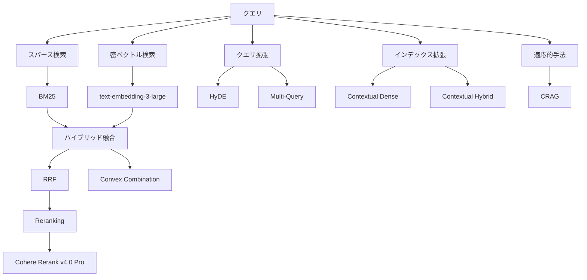
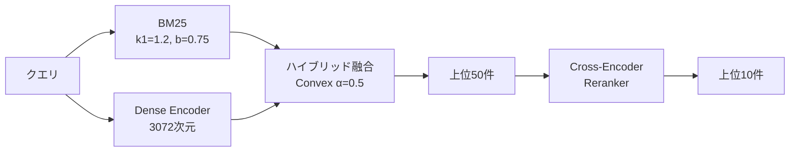

本記事は [論文: From BM25 to Corrective RAG](https://arxiv.org/abs/2604.01733) の解説記事です。

## 論文概要（Abstract）

本論文は、テキストと表（テーブル）が混在する金融文書を対象に、BM25からCorrective RAG（CRAG）まで10種類の検索戦略を体系的にベンチマークした研究である。著者らは、FinQA・ConvFinQA・TAT-DQAの3データセットを統合した23,088件のQAトリプルからなるT2-RAGBenchを構築し、7,318件の金融文書（SEC提出書類）に対する検索性能を定量的に比較している。主要な知見として、ハイブリッド検索（BM25+Dense）にCross-Encoder Rerankerを組み合わせた構成がRecall@5で0.816、MRR@3で0.605を達成し、他の全手法を統計的有意に上回ったことが報告されている。一方で、HyDEは金融ドメインにおいて仮想文書中に架空の数値を生成するため、ベースラインのBM25よりも性能が低下するという結果が示されている。

この記事は [Zenn記事: BGE-M3マルチベクトルで構築するハイブリッド検索](https://zenn.dev/0h_n0/articles/1850036c47fa53) の深掘りです。

## 情報源

- **arXiv ID**: 2604.01733
- **URL**: [https://arxiv.org/abs/2604.01733](https://arxiv.org/abs/2604.01733)
- **著者**: Meftun Akarsu, Recep Kaan Karaman, Christopher Mierbach
- **発表年**: 2026
- **分野**: cs.IR, cs.CL

## 背景と動機（Background & Motivation）

RAG（Retrieval-Augmented Generation）の性能は、検索段階の品質に強く依存する。特に金融文書のように、テキストと構造化された表が混在する文書では、クエリと関連文書のマッチングが従来の手法では困難である。BM25のような語彙的マッチングは専門用語の完全一致に強みを持つ一方で、意味的な類似性を捉えることが難しい。密ベクトル検索（Dense Retrieval）は意味的な近接性を捉えられるが、金融文書特有の数値や専門用語の正確なマッチングでは劣る傾向がある。

既存研究では、個別の検索手法の提案は多いものの、同一条件下での公平な比較が不足していた。著者らは、この課題に対して以下の3つの研究課題（RQ）を設定している。

- **RQ1**: スパース検索・密ベクトル検索・ハイブリッド検索の中で、テキスト・表混在文書に対してどの手法が有効か
- **RQ2**: クエリ拡張（HyDE、Multi-Query）やインデックス拡張（Contextual Retrieval）はベースラインをどの程度改善するか
- **RQ3**: 検索品質の改善はエンドツーエンドの回答生成品質にどの程度寄与するか

## 主要な貢献（Key Contributions）

- **T2-RAGBenchデータセットの構築**: FinQA、ConvFinQA、TAT-DQAの3データセットから23,088件のQAトリプルを統合し、文脈依存の質問をLLMで文脈独立に再定式化（成功率83.9%）した大規模評価基盤の構築
- **10種類の検索戦略の統一的ベンチマーク**: スパース、密ベクトル、ハイブリッド、リランキング、クエリ拡張、インデックス拡張、適応的手法をすべて同一データセット・同一評価指標で比較
- **統計的検証の厳密さ**: Paired Bootstrap検定（B=10,000）にBonferroni補正を適用し、手法間の差異の統計的有意性を確認
- **エラー分析**: ハイブリッドRRFの検索失敗7,188件を分析し、73%が表構造の不一致、20%が数値推論の失敗、5%が語彙の不一致であることを特定

## 技術的詳細（Technical Details）

### 評価データセット: T2-RAGBench

著者らが構築したT2-RAGBenchは以下の構成を持つ。

| 項目 | 値 |
|------|-----|
| QAトリプル数 | 23,088 |
| ユニーク文書数 | 7,318 |
| 平均文書長 | 約920トークン |
| データソース | FinQA, ConvFinQA, TAT-DQA |
| 文書形式 | SEC提出書類（テキスト+Markdownテーブル） |

元のデータセットには文脈依存の質問（会話形式の後続質問など）が含まれるため、著者らはGPT-4oを用いて質問を文脈独立に再定式化している。再定式化の成功率は83.9%であり、失敗した質問は除外されている。

### 10種の検索戦略

本論文で評価された10種の検索戦略を、以下に整理する。



#### 1. スパース検索: BM25

BM25のスコア関数は以下で定義される。

$$
\text{BM25}(q, d) = \sum_{t \in q} \text{IDF}(t) \cdot \frac{f(t, d) \cdot (k_1 + 1)}{f(t, d) + k_1 \cdot \left(1 - b + b \cdot \frac{|d|}{\text{avgdl}}\right)}
$$

ここで、$f(t, d)$は文書$d$における語$t$の出現頻度、$k_1 = 1.2$、$b = 0.75$は標準的なパラメータ設定である。$\text{IDF}(t)$は逆文書頻度を表す。

金融文書では「revenue」「EBITDA」「diluted EPS」といった専門用語が重要な検索キーとなるため、語彙的な完全一致が有効に機能する。著者らはBM25がRecall@5で0.644、MRR@3で0.411を達成し、密ベクトル検索を上回ったと報告している（Table I）。

#### 2. 密ベクトル検索: Dense Retrieval

OpenAIのtext-embedding-3-large（3,072次元）を用い、FAISS IndexFlatIPによる内積検索を実施している。クエリ$q$と文書$d$のスコアは以下で計算される。

$$
\text{score}(q, d) = \mathbf{e}_q^{\top} \mathbf{e}_d
$$

ここで、$\mathbf{e}_q, \mathbf{e}_d \in \mathbb{R}^{3072}$はそれぞれクエリと文書の埋め込みベクトルである。密ベクトル検索はRecall@5で0.587にとどまり、BM25を下回っている。著者らは、金融文書の数値や専門用語の正確なマッチングにおいて、埋め込みベクトルの表現力が不足していると分析している。

#### 3. ハイブリッド融合: RRFとConvex Combination

**Reciprocal Rank Fusion（RRF）** は、複数のランキングリストを以下の式で統合する。

$$
\text{RRF}(d) = \sum_{r \in R} \frac{1}{k + r(d)}
$$

ここで、$R$は各検索手法によるランキングリストの集合、$r(d)$はリスト$r$における文書$d$の順位、$k = 60$は平滑化パラメータである。RRFはRecall@5で0.695を達成し、BM25単体（0.644）を+5.1pp上回っている。

**Convex Combination** は、正規化されたスコアの線形結合で定義される。

$$
\text{score}_{\text{hybrid}}(d) = \alpha \cdot \hat{s}_{\text{BM25}}(d) + (1 - \alpha) \cdot \hat{s}_{\text{dense}}(d)
$$

ここで、$\hat{s}$はmin-max正規化されたスコア、$\alpha = 0.5$である。著者らのアブレーション実験では、Convex CombinationがRecall@5で0.726を達成し、RRF（0.695）を上回ったと報告されている。この結果は、スコアの大きさ情報を保持するConvex Combinationが、順位のみに依存するRRFよりも情報量が多いためと考察されている。

#### 4. リランキング: Cross-Encoder Reranker

ハイブリッド検索の上位50件の候補に対して、Cohere Rerank v4.0 Proを適用し、上位10件を選択する二段階パイプラインが採用されている。Cross-Encoder Rerankerはクエリと文書のペアを同時にエンコードし、直接的な関連度スコアを出力する。

$$
\text{score}_{\text{rerank}}(q, d) = \sigma(\mathbf{W} \cdot \text{Enc}([q; d]) + b)
$$

この構成はRecall@5で0.816、MRR@3で0.605を達成し、リランキングなしのハイブリッドRRF（MRR@3: 0.433）と比較して+17.2ppの改善が報告されている（Table I）。

#### 5. クエリ拡張: HyDEとMulti-Query

**HyDE（Hypothetical Document Embeddings）** は、クエリに対してLLMが仮想的な回答文書を生成し、その埋め込みで検索を行う手法である。しかし、金融ドメインでは仮想文書中に架空の数値（例: 実在しない収益額や利益率）が含まれるため、検索精度がむしろ低下する。著者らはHyDEがRecall@5で0.544にとどまり、BM25（0.644）を10pp下回ったと報告している。

**Multi-Query** は、元のクエリから3つのバリエーションを生成し、それぞれの検索結果をRRFで統合する手法である。Recall@5は0.640でBM25（0.644）とほぼ同等であり、追加の計算コストに見合う改善が得られていない。

#### 6. インデックス拡張: Contextual Retrieval

Contextual Retrievalは、各文書チャンクにLLM生成の要約コンテキストを付与してインデックスに格納する手法である。密ベクトル検索に適用した場合、Recall@5が0.587から0.615へ+2.8pp改善している。ハイブリッド検索に適用した場合はRecall@5が0.695から0.717へ+2.2pp改善している（Table I）。

改善幅は限定的だが、一度のインデックス構築時にコストが発生するだけであり、推論時の追加レイテンシがない点で実用的な手法といえる。

#### 7. 適応的手法: Corrective RAG（CRAG）

CRAGは、検索結果の品質をLLMが分類し、品質が低い場合にクエリを書き換えて再検索を行う適応的フレームワークである。著者らの実装では、以下の3段階のパイプラインが採用されている。

1. 初回検索: ハイブリッドRRFで上位10件を取得
2. 関連度分類: LLMが各文書を「Correct」「Incorrect」「Ambiguous」に分類
3. 条件分岐: 全文書が「Incorrect」の場合はクエリを書き換えて再検索

CRAGはRecall@5で0.658を達成しているが、ハイブリッドRRF（0.695）を下回っている。著者らは、CRAGの関連度分類の精度が十分ではなく、「Correct」と判定された文書が実際には関連度が低い場合があると分析している。

### 主要結果の比較（Table I）

論文Table Iの主要結果を以下に再掲する。

| 手法 | R@5 | R@10 | MRR@3 | nDCG@10 | MAP |
|------|-----|------|-------|---------|-----|
| BM25 | 0.644 | 0.735 | 0.411 | 0.515 | 0.449 |
| Dense | 0.587 | 0.703 | 0.351 | 0.466 | 0.398 |
| HyDE | 0.544 | 0.671 | 0.318 | 0.433 | 0.365 |
| Multi-Query | 0.640 | 0.734 | 0.397 | 0.506 | 0.439 |
| Contextual Dense | 0.615 | 0.732 | 0.373 | 0.490 | 0.420 |
| Contextual Hybrid | 0.717 | 0.818 | 0.454 | 0.571 | 0.497 |
| CRAG | 0.658 | 0.788 | 0.415 | 0.536 | 0.456 |
| Hybrid RRF | 0.695 | 0.801 | 0.433 | 0.551 | 0.477 |
| Hybrid + Rerank | 0.816 | 0.861 | 0.605 | 0.683 | 0.625 |

Paired Bootstrap検定（B=10,000、Bonferroni補正）により、Hybrid + Rerankと他の全手法との差異がp<0.05で統計的に有意であることが確認されている。

### エラー分析

ハイブリッドRRFが上位5件に正解文書を含められなかった7,188件の失敗事例を分析した結果、以下の分布が報告されている。

| 失敗カテゴリ | 割合 | 例 |
|-------------|------|-----|
| 表構造の不一致 | 73% | 同一テーブルの行列位置の取り違え |
| 数値推論の失敗 | 20% | 「前年比増加率」の計算に必要な複数行の未取得 |
| 語彙の不一致 | 5% | 略語・同義語の不一致 |

73%を占める表構造の不一致は、Markdownテーブルとして線形化された表データにおいて、行と列の構造的な関係が検索時に失われることに起因している。この問題は、テーブルの構造的な特徴を保持する専用のエンコーダや、テーブル対応のチャンキング戦略の必要性を示唆している。

### エンドツーエンド生成との相関

著者らは、検索品質（nDCG@10）と回答生成品質の相関を分析し、ピアソン相関係数$r > 0.99$という結果を報告している。これは、検索段階の改善がそのまま最終的な回答品質に反映されることを示しており、RAGシステムにおける検索段階への投資の重要性を定量的に裏付けている。

### アブレーション: 融合手法の比較

RRFとConvex Combinationの比較は、ハイブリッド検索の設計においてどの融合戦略を選択すべきかという実務的な問いに直接答えるものである。

$$
\text{Convex}(\alpha=0.5): \text{R@5} = 0.726 \quad \text{vs.} \quad \text{RRF}(k=60): \text{R@5} = 0.695
$$

Convex Combinationが+3.1ppの改善を示したことは注目に値する。RRFは順位のみを利用するため、1位のスコアが2位を大幅に上回るケースと僅差のケースを区別できない。一方、Convex Combinationはスコアの絶対値を利用するため、この区別が可能である。ただし、Convex CombinationはBM25スコアと密ベクトルスコアのスケーリングに敏感であり、$\alpha$パラメータのチューニングが必要となる点に留意が必要である。

## 実装のポイント（Implementation Details）

### BM25 + Dense Hybrid検索の実装

以下に、本論文の手法に基づくハイブリッド検索パイプラインのPython実装を示す。

```python
from dataclasses import dataclass
from typing import Sequence

import numpy as np
from numpy.typing import NDArray


@dataclass(frozen=True)
class ScoredDocument:
    """検索結果のスコア付き文書."""

    doc_id: str
    score: float


def bm25_score(
    query_terms: list[str],
    doc_term_freqs: dict[str, int],
    doc_length: int,
    avg_doc_length: float,
    idf_values: dict[str, float],
    k1: float = 1.2,
    b: float = 0.75,
) -> float:
    """BM25スコアを計算する.

    Args:
        query_terms: クエリの単語リスト
        doc_term_freqs: 文書中の各単語の出現頻度
        doc_length: 文書の長さ（単語数）
        avg_doc_length: コーパス全体の平均文書長
        idf_values: 各単語のIDF値
        k1: 飽和パラメータ（論文設定: 1.2）
        b: 文書長正規化パラメータ（論文設定: 0.75）

    Returns:
        BM25スコア
    """
    score = 0.0
    for term in query_terms:
        tf = doc_term_freqs.get(term, 0)
        idf = idf_values.get(term, 0.0)
        numerator = tf * (k1 + 1)
        denominator = tf + k1 * (1 - b + b * doc_length / avg_doc_length)
        score += idf * numerator / denominator
    return score


def reciprocal_rank_fusion(
    rankings: list[list[ScoredDocument]],
    k: int = 60,
) -> list[ScoredDocument]:
    """Reciprocal Rank Fusionで複数のランキングを統合する.

    Args:
        rankings: 各検索手法のランキングリスト
        k: 平滑化パラメータ（論文設定: 60）

    Returns:
        RRFスコアでソートされた文書リスト
    """
    rrf_scores: dict[str, float] = {}
    for ranking in rankings:
        for rank, doc in enumerate(ranking, start=1):
            rrf_scores[doc.doc_id] = rrf_scores.get(doc.doc_id, 0.0) + 1.0 / (k + rank)

    return sorted(
        [ScoredDocument(doc_id=doc_id, score=score) for doc_id, score in rrf_scores.items()],
        key=lambda d: d.score,
        reverse=True,
    )


def convex_combination(
    sparse_scores: dict[str, float],
    dense_scores: dict[str, float],
    alpha: float = 0.5,
) -> list[ScoredDocument]:
    """Convex Combinationで2つのスコアを線形結合する.

    Args:
        sparse_scores: BM25スコア（doc_id -> score）
        dense_scores: Dense検索スコア（doc_id -> score）
        alpha: BM25の重み（論文設定: 0.5）

    Returns:
        統合スコアでソートされた文書リスト
    """
    all_doc_ids = set(sparse_scores.keys()) | set(dense_scores.keys())

    # Min-Max正規化
    def normalize(scores: dict[str, float]) -> dict[str, float]:
        values = list(scores.values())
        if not values:
            return {}
        min_val, max_val = min(values), max(values)
        if max_val == min_val:
            return {k: 0.0 for k in scores}
        return {k: (v - min_val) / (max_val - min_val) for k, v in scores.items()}

    norm_sparse = normalize(sparse_scores)
    norm_dense = normalize(dense_scores)

    combined: list[ScoredDocument] = []
    for doc_id in all_doc_ids:
        s_sparse = norm_sparse.get(doc_id, 0.0)
        s_dense = norm_dense.get(doc_id, 0.0)
        combined.append(ScoredDocument(doc_id=doc_id, score=alpha * s_sparse + (1 - alpha) * s_dense))

    return sorted(combined, key=lambda d: d.score, reverse=True)
```

### 二段階リランキングパイプラインの構成

```python
from dataclasses import dataclass


@dataclass(frozen=True)
class RerankConfig:
    """リランキングパイプラインの設定."""

    first_stage_top_k: int = 50  # 初段検索の取得件数
    rerank_top_k: int = 10       # リランキング後の選択件数
    fusion_method: str = "rrf"   # "rrf" or "convex"
    rrf_k: int = 60
    convex_alpha: float = 0.5


def two_stage_pipeline(
    query: str,
    bm25_results: list[ScoredDocument],
    dense_results: list[ScoredDocument],
    reranker_fn: callable,
    config: RerankConfig = RerankConfig(),
) -> list[ScoredDocument]:
    """二段階検索パイプライン.

    Stage 1: BM25 + Dense のハイブリッド融合（上位 first_stage_top_k 件）
    Stage 2: Cross-Encoder Reranker による再スコアリング（上位 rerank_top_k 件）

    Args:
        query: 検索クエリ
        bm25_results: BM25の検索結果
        dense_results: Dense検索の結果
        reranker_fn: リランカー関数 (query, docs) -> scored_docs
        config: パイプライン設定

    Returns:
        リランキング後の上位文書リスト
    """
    # Stage 1: ハイブリッド融合
    if config.fusion_method == "rrf":
        fused = reciprocal_rank_fusion(
            [bm25_results, dense_results], k=config.rrf_k
        )
    else:
        sparse_dict = {d.doc_id: d.score for d in bm25_results}
        dense_dict = {d.doc_id: d.score for d in dense_results}
        fused = convex_combination(sparse_dict, dense_dict, alpha=config.convex_alpha)

    candidates = fused[: config.first_stage_top_k]

    # Stage 2: リランキング
    reranked = reranker_fn(query, candidates)
    return reranked[: config.rerank_top_k]
```

## 実験結果の解釈（Analysis of Results）

### BM25がDenseを上回る理由

本論文において、BM25が密ベクトル検索を全指標で上回った点は注目に値する。著者らは以下の要因を挙げている。

1. **専門用語の完全一致**: 金融文書では「diluted earnings per share」「net operating income」といった定型表現が検索キーとなる。BM25はこれらの語彙的一致を直接捉えられる
2. **数値の正確性**: 「Q3 2024 revenue」のような数値を含むクエリでは、埋め込みベクトルが数値の意味を正確に捉えることが難しい
3. **文書長の正規化**: BM25の文書長正規化（パラメータ$b$）が、長さの異なるSEC提出書類に対して有効に機能する

この結果は、ドメインに特化した語彙が重要な領域では、密ベクトル検索の導入前にBM25のベースライン性能を確認することの重要性を示唆している。

### Rerankerの効果が顕著な理由

リランキングによるMRR@3の+17.2ppという改善は、本論文で観測された最大の性能差である。この効果が大きい理由として、以下の構造的要因が考えられる。

1. **Cross-Encoderのペアワイズ注意機構**: Bi-Encoderがクエリと文書を独立にエンコードするのに対し、Cross-Encoderは両者を同時に入力することで、トークン間の細かいインタラクションを捉えられる
2. **候補の絞り込み**: 50件という候補数は、Cross-Encoderの計算コストを許容範囲に収めつつ、十分な recall を確保するバランス点である
3. **表構造の理解**: Cross-Encoderはクエリとテーブルのセルを同時に参照できるため、「この行のこの列の値」という構造的なマッチングが可能になる

### HyDEの失敗メカニズム

HyDEが金融ドメインで失敗するメカニズムは、実務的に重要な教訓を含む。LLMが「Apple Inc.のQ3 2024の収益は?」というクエリに対して仮想文書を生成する際、実在しない数値（例: 「$94.8 billion」）を含む文書を生成する傾向がある。この架空の数値がベクトル空間上での検索方向を歪め、正しい文書からの距離を増大させる。

この問題は、金融・医療・法律など数値の正確性が重要なドメインにおいて、HyDEの適用に慎重であるべきことを示している。

## Production Deployment Guide

本論文の知見を実運用システムに適用する際の指針を、手法ごとに整理する。

### 推奨構成: 二段階ハイブリッド + Rerank

論文の結果に基づく推奨構成は以下の通りである。



### 手法選択のガイドライン

| 条件 | 推奨手法 | 期待Recall@5 | 追加コスト |
|------|---------|-------------|-----------|
| レイテンシ優先（<100ms） | BM25単体 | 0.644 | 低 |
| 精度とコストのバランス | Hybrid RRF | 0.695 | 中（Embedding API） |
| 精度重視（オフライン可） | Hybrid + Rerank | 0.816 | 高（Reranker API） |
| インデックス更新が稀 | Contextual Hybrid | 0.717 | 中（一度のLLMコスト） |

### 融合戦略の選択基準

1. **RRF**: スコアの正規化が困難な場合、異なるスコア体系の検索手法を統合する場合に有効。パラメータ$k$の調整のみで動作する
2. **Convex Combination**: スコアの分布が安定している場合、本論文ではRRFを+3.1pp上回る性能を示した。ただし$\alpha$のチューニングが必要

### 10手法のコスト・レイテンシ・精度マトリクス

| 手法 | 推論時レイテンシ | インデックスコスト | API依存 | R@5 |
|------|----------------|-----------------|---------|-----|
| BM25 | 低 | 低 | なし | 0.644 |
| Dense | 低〜中 | 中 | Embedding API | 0.587 |
| Hybrid RRF | 中 | 中 | Embedding API | 0.695 |
| Hybrid Convex | 中 | 中 | Embedding API | 0.726 |
| Hybrid + Rerank | 高 | 中 | Embedding + Reranker API | 0.816 |
| HyDE | 高 | 中 | LLM + Embedding API | 0.544 |
| Multi-Query | 高 | 中 | LLM + Embedding API | 0.640 |
| Contextual Dense | 低〜中 | 高（初回） | LLM + Embedding API | 0.615 |
| Contextual Hybrid | 中 | 高（初回） | LLM + Embedding API | 0.717 |
| CRAG | 高 | 中 | LLM + Embedding API | 0.658 |

### 表構造への対応

エラー分析で73%を占めた表構造の不一致への対策として、以下のアプローチが考えられる。

1. **テーブル対応チャンキング**: 表の行列構造を保持したままチャンクに分割する。各チャンクにヘッダー行を付与する
2. **テーブルのシリアライズ**: Markdown形式に加え、JSONや自然言語形式での多重エンコーディング
3. **テーブル専用エンコーダ**: TAPAS（Herzig et al., 2020）やTaBERT（Yin et al., 2020）のようなテーブル対応の事前学習モデルの活用

### 統計的検証の実践

本論文で採用されたPaired Bootstrap検定は、検索システムの改善が統計的に有意であることを確認するための標準的な手法である。

```python
import numpy as np
from numpy.typing import NDArray


def paired_bootstrap_test(
    scores_a: NDArray[np.float64],
    scores_b: NDArray[np.float64],
    n_bootstrap: int = 10_000,
    seed: int = 42,
) -> float:
    """Paired Bootstrap検定でp値を計算する.

    Args:
        scores_a: 手法Aのクエリごとのスコア
        scores_b: 手法Bのクエリごとのスコア
        n_bootstrap: ブートストラップ反復回数（論文設定: 10,000）
        seed: 乱数シード

    Returns:
        p値（帰無仮説: 手法Aと手法Bに差がない）
    """
    rng = np.random.default_rng(seed)
    n = len(scores_a)
    observed_diff = np.mean(scores_a) - np.mean(scores_b)

    count = 0
    for _ in range(n_bootstrap):
        indices = rng.integers(0, n, size=n)
        boot_diff = np.mean(scores_a[indices]) - np.mean(scores_b[indices])
        if boot_diff <= 0:
            count += 1

    return count / n_bootstrap


def bonferroni_correction(p_values: list[float], alpha: float = 0.05) -> list[bool]:
    """Bonferroni補正で多重比較を制御する.

    Args:
        p_values: 各比較のp値リスト
        alpha: 有意水準（論文設定: 0.05）

    Returns:
        各比較が有意かどうかのリスト
    """
    adjusted_alpha = alpha / len(p_values)
    return [p < adjusted_alpha for p in p_values]
```

## 関連研究（Related Work）

本論文は、以下の研究系譜に位置づけられる。

**ハイブリッド検索**: Lin et al.（2021）はBM25と密ベクトル検索の相補性を実証し、RRFによる融合の有効性を示した。本論文はこの知見を金融ドメインの表混在文書に適用し、ドメイン固有の挙動を明らかにしている。

**Reranking**: Nogueira & Cho（2019）がBERT-based Rerankerを提案して以降、Cross-Encoder Rerankingは二段階検索パイプラインの標準的な手法となっている。本論文では、Cohere Rerank v4.0 Proが金融文書の表構造を含むコンテキストで有効に機能することを示している。

**Corrective RAG**: Yan et al.（2024）はCRAGを提案し、検索結果の品質に基づく適応的な戦略を導入した。本論文では、CRAGの関連度分類の精度が実用的なパフォーマンス改善に結びつかない場合があることを報告している。

**テーブルQA**: Herzig et al.（2020）のTAPASやPasupat & Liang（2015）のWikiTableQuestionsなど、テーブル理解に特化した研究は多い。本論文はテーブルを汎用的な検索パイプラインで扱う際の限界を定量的に示している。

## まとめ

本論文は、テキストと表が混在する金融文書に対する10種類の検索戦略を、23,088件のQAトリプルを用いて体系的に比較した研究である。主要な知見は以下の通りである。

1. **ハイブリッド + Rerank構成の有効性**: Recall@5で0.816を達成し、全手法中で統計的有意に最高の精度を示した
2. **BM25の堅牢性**: 金融ドメインの専門用語マッチングにおいて、密ベクトル検索を上回る性能を示した（R@5: 0.644 vs 0.587）
3. **融合戦略の選択**: Convex Combination（$\alpha=0.5$）がRRFを+3.1pp上回り、スコア情報の保持が有効であることを示唆した
4. **HyDEの限界**: 数値の正確性が重要なドメインでは、仮想文書生成が逆効果となることが確認された
5. **表構造の課題**: 検索失敗の73%が表構造の不一致に起因しており、テーブル対応の検索手法の必要性が示された
6. **検索と生成の強い相関**: nDCG@10と回答品質のピアソン相関$r > 0.99$が、検索段階への投資の重要性を定量的に裏付けた

これらの知見は、RAGシステムの検索パイプラインを設計する際の定量的な判断材料を提供するものである。特に、ドメイン固有の語彙が重要な領域では、BM25を含むハイブリッド構成が依然として有効であり、Cross-Encoder Rerankingによる二段階パイプラインが現時点で実用的な精度上限を示している。

## 参考文献

- Akarsu, M., Karaman, R. K., & Mierbach, C. (2026). From BM25 to Corrective RAG: Benchmarking Retrieval Strategies for Text-and-Table Documents. arXiv:2604.01733.
- Herzig, J. et al. (2020). TaPas: Weakly Supervised Table Parsing via Pre-training. ACL.
- Lin, J. et al. (2021). Pyserini: A Python Toolkit for Reproducible Information Retrieval Research with Sparse and Dense Representations.
- Nogueira, R., & Cho, K. (2019). Passage Re-ranking with BERT. arXiv:1901.04085.
- Yan, S. et al. (2024). Corrective Retrieval Augmented Generation. arXiv:2401.15884.
- Yin, P. et al. (2020). TaBERT: Pretraining for Joint Understanding of Textual and Tabular Data. ACL.
