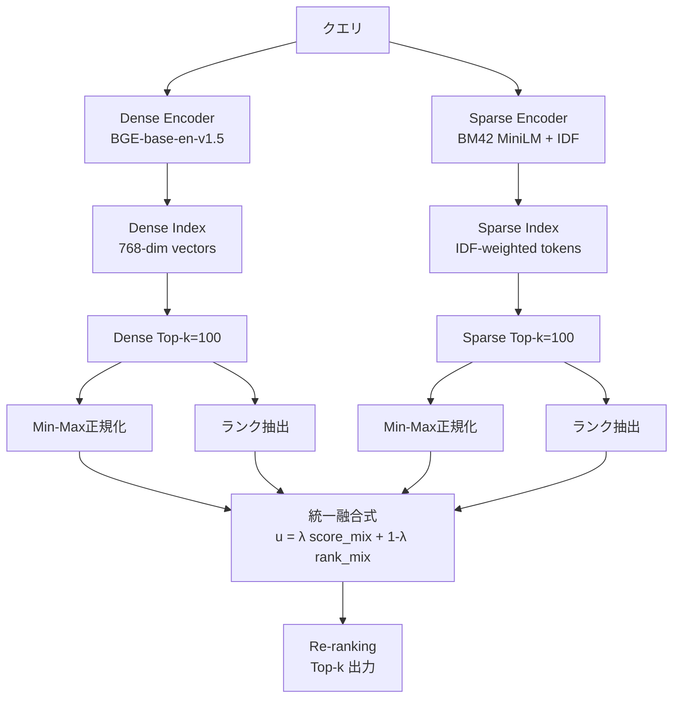

本記事は [論文: Parameterized Dense-Sparse Fusion for Hybrid Retrieval](https://arxiv.org/abs/2609.22770) の解説記事です。

## 論文概要（Abstract）

本論文は、Dense検索とSparse検索を融合するハイブリッド検索において、スコアベースの融合とランクベースの融合を統一的にパラメータ化する手法を提案している。著者らは3つのパラメータ——Dense重み$\alpha$、スコア・ランク混合比$\lambda$、RRF平滑化定数$\kappa$——を導入し、BEIR SciFact データセット上でグリッドサーチによる系統的チューニングを実施している。その結果、チューニングされた融合構成がnDCG@10で0.753を達成し、等重みRRF（0.707）を+0.046、Denseベースライン（0.742）を+0.011上回ることが報告されている。さらに20データセットへの汎化検証では、チューニング済み融合がRRFに対して20/20、Denseに対して16/20のデータセットで勝利したことが示されている。

この記事は [Zenn記事: BGE-M3マルチベクトルで構築するハイブリッド検索](https://zenn.dev/0h_n0/articles/1850036c47fa53) の深掘りです。

## 情報源

- **arXiv ID**: 2609.22770
- **URL**: [https://arxiv.org/abs/2609.22770](https://arxiv.org/abs/2609.22770)
- **著者**: Satyanarayan Pati, Srikanth Patil
- **発表年**: 2026年9月
- **分野**: cs.IR, cs.AI

## 背景と動機（Background & Motivation）

情報検索の分野では、Dense検索（ベクトル埋め込みによる意味的類似度検索）とSparse検索（BM25やTF-IDFに基づくキーワードマッチング）がそれぞれ相補的な強みを持つことが広く知られている。Dense検索は同義語や言い換えに対する頑健性に優れる一方、Sparse検索は固有名詞や稀な用語の完全一致に強い。

両者を組み合わせるハイブリッド検索は、RAG（Retrieval-Augmented Generation）パイプラインにおいて標準的なアプローチとなりつつある。しかし、融合方法の選択は多くの場合ヒューリスティックに行われている。最も広く使われているReciprocal Rank Fusion（RRF）は、各チャネルのランクを等しい重みで統合するが、この等重み仮定がすべてのデータセットに対して適切かどうかは自明ではない。

著者らはこの問題に対し、スコアベースの融合とランクベースの融合を単一の統一式で表現し、パラメータのグリッドサーチによって最適な融合構成を発見するアプローチを提案している。実装にはQdrant 1.18を採用し、実運用環境に近い条件での評価を行っている点が特徴的である。

## 主要な貢献（Key Contributions）

- **スコア・ランク統一融合式の定式化**: スコアベースの重み付き線形結合とランクベースのRRFを、$\alpha$, $\lambda$, $\kappa$の3パラメータで連続的に制御可能な単一の式に統合
- **BEIR SciFact上での系統的チューニング**: グリッドサーチにより、等重みRRF（nDCG@10 = 0.707）を+0.046上回る融合構成（nDCG@10 = 0.753）を発見
- **20データセットへの汎化検証**: SciFactでチューニングしたパラメータを20データセットに適用し、RRFに対する20/20勝利を確認
- **量子化の影響分析**: INT8/バイナリ量子化＋FP32リスコアリングがフルFP32と同等の検索品質（nDCG@10 = 0.7445）を維持することを検証
- **Sparse Router（クエリ分類器）の分析**: クエリに応じてSparse検索を動的にスキップするルーティング機構の有効性と限界を報告

## 技術的詳細（Technical Details）

### 統一融合式の定式化

著者らが提案するパラメータ化された融合式は以下の通りである。

$$
u(d) = \lambda \bigl(\alpha \tilde{s}_d + (1 - \alpha) \tilde{s}_s \bigr) + (1 - \lambda) \bigl(\alpha \rho(r_d; \kappa) + (1 - \alpha) \rho(r_s; \kappa) \bigr)
$$

ここで各変数は以下を表す。

| 記号 | 意味 |
|------|------|
| $d$ | 文書 |
| $\tilde{s}_d$, $\tilde{s}_s$ | Dense / Sparse スコア（Min-Max正規化後、$[0, 1]$に写像） |
| $r_d$, $r_s$ | Dense / Sparse チャネルにおける文書$d$のランク |
| $\rho(r; \kappa) = \frac{1}{r + \kappa}$ | RRFカーネル関数 |
| $\alpha$ | Dense優先度（dense prior）。$\alpha = 1$でDense-only、$\alpha = 0$でSparse-only |
| $\lambda$ | スコア・ランク混合比。$\lambda = 1$で純粋なスコアベース融合、$\lambda = 0$で純粋なランクベース融合 |
| $\kappa$ | RRF平滑化定数。大きいほどランク差の影響を平坦化 |

この式の設計意図は、既存の融合手法を特殊ケースとして包含することにある。

- **$\lambda = 0$, $\alpha = 0.5$**: 等重みRRF（Cormack et al., 2009）
- **$\lambda = 1$, $\alpha = 0.5$**: 等重みスコア融合（DBSF）
- **$\lambda = 0.75$, $\alpha = 0.80$**: 著者らがSciFact上で選択したチューニング済み構成

Min-Max正規化は各チャネル内で独立に行われる。

$$
\tilde{s} = \frac{s - s_{\min}}{s_{\max} - s_{\min}}
$$

各チャネルから上位$k = 100$件を取得し、正規化を適用している。この正規化によりスコアの分布が異なるDenseチャネルとSparseチャネルを同一のスケールで比較可能としている。

### パラメータ探索空間と選択結果

著者らは3つのパラメータに対してグリッドサーチを実施している。探索空間と選択結果を以下に示す。

| パラメータ | 探索範囲 | SciFact選択値 |
|-----------|---------|--------------|
| $\alpha$（Dense重み） | {0.55, 0.65, 0.75, 0.85, 0.95} | 0.80 |
| $\lambda$（スコア・ランク混合比） | {0.55, 0.75} | 0.75 |
| $\kappa$（RRF平滑化定数） | {10, 20, 60} | 20 |

$\alpha = 0.80$が選択されたことは、Dense検索がこのタスクでは主要な情報源であり、Sparse検索が補助的な役割を果たすことを示唆している。$\lambda = 0.75$は、融合においてスコア情報がランク情報よりも重要であるが、ランク情報も一定の寄与を持つことを意味している。

### αの感度分析

著者らは$\alpha$パラメータの感度について詳細な分析を報告している。品質のピークは$\alpha \approx 0.7 \text{--} 0.8$の範囲に位置し、Dense検索に比重を置いた構成が最良であることが示されている。この結果は、BGE-base-en-v1.5のようなファインチューニング済みDenseモデルが、BM42ベースのSparseモデルよりも高い基本性能を持つことと整合的である。

$\alpha$が0.5を下回る（Sparse偏重）領域では品質が低下する傾向が観察されており、少なくともBEIRベンチマークの文脈では、Dense検索のベースライン性能が高い場合にSparse側の重みを過度に増やすことは逆効果となりうる。

### Sparse Router（クエリルーティング）

論文では、クエリごとにSparse検索の有効性を予測し、不要な場合にSparse検索をスキップするルーティング機構も検討されている。Sparse Router は閾値パラメータ$\tau$を用い、Sparseスコアが$\tau$を下回るクエリについてはSparse検索をスキップする設計である。

著者らの報告によれば、SciFact上での最適な$\tau$は$\infty$（常にSparse検索を実行）であった。有限の閾値を設定した場合、52--60%のクエリでSparse検索がスキップされ、検索品質が低下したことが示されている。この結果は、SciFact のようなドメイン特化型データセットにおいてSparse検索が一貫して補助的な情報を提供していることを示唆している。

ただし、著者らはこの結果がSciFact特有である可能性にも言及しており、他のデータセットでは異なる結論が得られうると指摘している。

## 実験結果（Experimental Results）

### BEIR SciFact での性能比較

BEIR SciFact データセット上でのnDCG@10およびRecall@10の結果を以下に示す。

| 手法 | nDCG@10 | Recall@10 |
|------|---------|-----------|
| Dense BGEベースライン | 0.742 | 0.871 |
| 等重みRRF | 0.707 | — |
| チューニング済み融合（$\alpha$=0.80, $\lambda$=0.75, $\kappa$=20） | 0.753 | 0.889 |

チューニング済み融合構成は、Denseベースラインに対して nDCG@10 で+0.011、Recall@10 で+0.018 の改善を達成している。等重みRRFとの差はnDCG@10 で+0.046であり、適切なパラメータチューニングによる改善幅が確認されている。

注目すべきは、等重みRRF（0.707）がDenseベースライン（0.742）を下回っている点である。これは、Sparse検索チャネルの性能がDenseより低い場合に、等しい重みで融合すると品質が「引きずられる」現象を示している。

### 20データセットへの汎化検証

SciFact上でチューニングしたパラメータ（$\alpha = 0.80$, $\lambda = 0.75$, $\kappa = 20$）を20のBEIRデータセットに適用した結果が報告されている。

| 指標 | チューニング済み融合 | Dense | 等重みRRF |
|------|-------------------|-------|----------|
| Unit-mean nDCG@10 | 0.467 | 0.462 | 0.420 |
| vs RRF 勝利数 | 20/20 | — | — |
| vs Dense 勝利数 | 16/20 | — | — |

チューニング済み融合は等重みRRFに対して全20データセットで勝利し、Denseベースラインに対しても16/20で優位性を示している。残り4データセットでの敗北は、これらのデータセットがSparse検索の寄与を必要としない特性を持つか、SciFact由来のパラメータが不適合であった可能性がある。

### 未チューニングハイブリッドの落とし穴

著者らは「Nine-Zip Untuned」構成（パラメータをデフォルト値で適用したハイブリッド検索）についても検証している。この構成では、nDCG@10 が0.479にとどまり、Dense単体（0.519）を下回る結果となっている。この結果は、ハイブリッド検索が自動的に性能を向上させるわけではなく、不適切なパラメータではむしろ性能低下を引き起こしうることを示す重要な知見である。

著者らは「他のデータセットでは探索範囲を再利用すべきであり、SciFactの数値をそのまま適用すべきではない」と明確に警告している。

### 量子化の影響

実運用においてメモリ効率は重要な関心事である。著者らはINT8量子化およびバイナリ量子化にFP32リスコアリングを組み合わせた構成を検証し、nDCG@10 = 0.7445 を達成したことを報告している。これはフルFP32精度と同等の値であり、ベクトルの圧縮がランキング品質に実質的な影響を与えないことが示されている。

## 実装環境と再現条件

著者らの実験は以下の環境で実施されている。

| 構成要素 | 仕様 |
|---------|------|
| ベクトルDB | Qdrant 1.18（Docker） |
| Denseモデル | BGE-base-en-v1.5（768次元） |
| Sparseモデル | BM42 MiniLM with IDF |
| 取得件数 | 各チャネル上位$k = 100$ |
| 正規化 | Min-Max正規化（$[0, 1]$） |

BGE-base-en-v1.5 は BAAI が公開するファインチューニング済みのDense Retrieverであり、768次元の密ベクトルを出力する。BM42 MiniLM は Qdrant が提供する学習可能なSparse Retriever であり、IDF重みを用いてトークンの重要度を調整する。

## 技術的詳細の補足（数式展開）

### Min-Max正規化の役割

Dense検索とSparse検索ではスコアの分布が根本的に異なる。Dense検索のコサイン類似度は$[-1, 1]$の範囲をとり、Sparse検索のBM25/BM42スコアは非負だが上限が不定である。Min-Max正規化は、各チャネルの上位$k$件のスコアを$[0, 1]$に線形写像することで、両チャネルのスコアを直接比較可能にする。

$$
\tilde{s}_i = \frac{s_i - \min_{j \in \text{top-}k} s_j}{\max_{j \in \text{top-}k} s_j - \min_{j \in \text{top-}k} s_j}
$$

この正規化はクエリごとに独立に計算されるため、クエリ間でのスコア分布の差異にも対応できる。ただし、上位$k$件のスコア範囲に依存するため、$k$の選択が正規化の安定性に影響しうる点は留意が必要である。

### RRFカーネルの特性

RRFカーネル$\rho(r; \kappa) = \frac{1}{r + \kappa}$は、ランク$r$を非線形にスコア化する関数である。$\kappa$は上位ランクと下位ランクの差をどの程度圧縮するかを制御する。

- **$\kappa$が小さい場合**（例: $\kappa = 10$）: 上位ランクに高い重みが集中し、下位ランクの寄与が急速に減衰する
- **$\kappa$が大きい場合**（例: $\kappa = 60$）: ランク間の重み差が平坦化され、下位ランクも一定の寄与を持つ

著者らがSciFact上で$\kappa = 20$を選択したことは、上位ランクへの集中と下位ランクの寄与のバランスがこの値で取れていることを示している。

$$
\rho(1; 20) = \frac{1}{21} \approx 0.048, \quad \rho(10; 20) = \frac{1}{30} \approx 0.033, \quad \rho(100; 20) = \frac{1}{120} \approx 0.008
$$

上位1位と10位の比率は約$1.45:1$であり、急激なランク差ではなく緩やかな減衰カーブとなっている。

## アーキテクチャ図

論文で提示されたハイブリッド検索パイプラインの全体構成を図示する。



## 実運用デプロイメントガイド（Production Deployment Guide）

論文の知見を実運用環境に適用する際の実装例を以下に示す。

### Qdrant コレクション設定

```python
from qdrant_client import QdrantClient
from qdrant_client.models import (
    Distance,
    QuantizationConfig,
    ScalarQuantization,
    ScalarQuantizationConfig,
    VectorParams,
    SparseVectorParams,
    SparseIndexParams,
)


def create_hybrid_collection(
    client: QdrantClient,
    collection_name: str,
    dense_dim: int = 768,
    on_disk: bool = True,
) -> None:
    """ハイブリッド検索用のQdrantコレクションを作成する。

    Dense（BGE-base-en-v1.5, 768次元）とSparse（BM42）の
    両インデックスを持つコレクションを構成する。
    INT8量子化を有効にし、FP32リスコアリングで品質を維持する。

    Args:
        client: QdrantClient インスタンス
        collection_name: コレクション名
        dense_dim: Dense ベクトルの次元数（デフォルト: 768）
        on_disk: ベクトルをディスク上に保持するか
    """
    client.create_collection(
        collection_name=collection_name,
        vectors_config={
            "dense": VectorParams(
                size=dense_dim,
                distance=Distance.COSINE,
                on_disk=on_disk,
                quantization_config=QuantizationConfig(
                    scalar=ScalarQuantization(
                        config=ScalarQuantizationConfig(
                            type="int8",
                            always_ram=True,
                            quantile=0.99,
                        )
                    )
                ),
            )
        },
        sparse_vectors_config={
            "sparse": SparseVectorParams(
                index=SparseIndexParams(on_disk=on_disk)
            )
        },
    )
```

### 統一融合式の実装

```python
from dataclasses import dataclass


@dataclass(frozen=True)
class FusionParams:
    """融合パラメータを保持するイミュータブルなデータクラス。

    Attributes:
        alpha: Dense優先度。0.0=Sparse-only, 1.0=Dense-only
        lam: スコア・ランク混合比。1.0=スコアのみ, 0.0=ランクのみ
        kappa: RRF平滑化定数。大きいほどランク差を平坦化
        top_k: 各チャネルから取得する件数
    """

    alpha: float = 0.80
    lam: float = 0.75
    kappa: int = 20
    top_k: int = 100


def min_max_normalize(scores: list[float]) -> list[float]:
    """スコアリストをMin-Max正規化で[0, 1]に写像する。

    Args:
        scores: 正規化前のスコアリスト

    Returns:
        [0, 1]に正規化されたスコアリスト。
        全スコアが同一の場合は全て0.0を返す。
    """
    if not scores:
        return []
    s_min = min(scores)
    s_max = max(scores)
    if s_max == s_min:
        return [0.0] * len(scores)
    return [(s - s_min) / (s_max - s_min) for s in scores]


def rrf_kernel(rank: int, kappa: int) -> float:
    """RRFカーネル関数。ランクをスコアに変換する。

    Args:
        rank: 1-indexed のランク
        kappa: 平滑化定数

    Returns:
        RRFスコア（1 / (rank + kappa)）
    """
    return 1.0 / (rank + kappa)


def fuse_results(
    dense_results: list[tuple[str, float]],
    sparse_results: list[tuple[str, float]],
    params: FusionParams,
) -> list[tuple[str, float]]:
    """Dense検索結果とSparse検索結果を統一融合式で結合する。

    論文の式: u(d) = λ(α s̃_d + (1-α) s̃_s) + (1-λ)(α ρ(r_d;κ) + (1-α) ρ(r_s;κ))

    Args:
        dense_results: (doc_id, score) のリスト（スコア降順）
        sparse_results: (doc_id, score) のリスト（スコア降順）
        params: 融合パラメータ

    Returns:
        (doc_id, fused_score) のリスト（スコア降順でソート済み）
    """
    # スコアをMin-Max正規化
    dense_scores_norm = min_max_normalize([s for _, s in dense_results])
    sparse_scores_norm = min_max_normalize([s for _, s in sparse_results])

    # doc_id -> 正規化スコアのマッピング
    dense_score_map: dict[str, float] = {
        doc_id: score
        for (doc_id, _), score in zip(dense_results, dense_scores_norm)
    }
    sparse_score_map: dict[str, float] = {
        doc_id: score
        for (doc_id, _), score in zip(sparse_results, sparse_scores_norm)
    }

    # doc_id -> ランク（1-indexed）のマッピング
    dense_rank_map: dict[str, int] = {
        doc_id: rank + 1 for rank, (doc_id, _) in enumerate(dense_results)
    }
    sparse_rank_map: dict[str, int] = {
        doc_id: rank + 1 for rank, (doc_id, _) in enumerate(sparse_results)
    }

    # 全文書IDの和集合
    all_doc_ids = set(dense_score_map.keys()) | set(sparse_score_map.keys())

    # 融合スコア計算
    fused: list[tuple[str, float]] = []
    default_rank = params.top_k + 1  # 未出現文書のデフォルトランク

    for doc_id in all_doc_ids:
        s_d = dense_score_map.get(doc_id, 0.0)
        s_s = sparse_score_map.get(doc_id, 0.0)
        r_d = dense_rank_map.get(doc_id, default_rank)
        r_s = sparse_rank_map.get(doc_id, default_rank)

        # スコアベース成分
        score_component = params.alpha * s_d + (1 - params.alpha) * s_s

        # ランクベース成分
        rank_component = (
            params.alpha * rrf_kernel(r_d, params.kappa)
            + (1 - params.alpha) * rrf_kernel(r_s, params.kappa)
        )

        # 統一融合
        u = params.lam * score_component + (1 - params.lam) * rank_component
        fused.append((doc_id, u))

    # スコア降順でソート
    fused.sort(key=lambda x: x[1], reverse=True)
    return fused
```

### パラメータチューニングの実装

論文の知見に基づき、新しいデータセットに対してパラメータを探索する際のグリッドサーチ実装を示す。著者らが「探索範囲を再利用すべきであり、SciFactの数値をそのまま適用すべきではない」と警告していることに留意されたい。

```python
from itertools import product


def grid_search_fusion_params(
    dense_results: list[tuple[str, float]],
    sparse_results: list[tuple[str, float]],
    relevance_labels: dict[str, int],
    alpha_range: tuple[float, ...] = (0.55, 0.65, 0.75, 0.85, 0.95),
    lambda_range: tuple[float, ...] = (0.55, 0.75),
    kappa_range: tuple[int, ...] = (10, 20, 60),
) -> tuple[FusionParams, float]:
    """融合パラメータのグリッドサーチを実行する。

    論文のTable記載の探索範囲をデフォルトとするが、
    新しいデータセットではデータセット固有のチューニングが必要である。

    Args:
        dense_results: Dense検索結果（doc_id, score）
        sparse_results: Sparse検索結果（doc_id, score）
        relevance_labels: 文書IDと関連度ラベルの辞書
        alpha_range: αの探索範囲
        lambda_range: λの探索範囲
        kappa_range: κの探索範囲

    Returns:
        (最適パラメータ, 最良nDCG@10) のタプル
    """
    best_params = FusionParams()
    best_ndcg = 0.0

    for alpha, lam, kappa in product(alpha_range, lambda_range, kappa_range):
        params = FusionParams(alpha=alpha, lam=lam, kappa=kappa)
        fused = fuse_results(dense_results, sparse_results, params)

        ndcg = compute_ndcg_at_k(fused, relevance_labels, k=10)
        if ndcg > best_ndcg:
            best_ndcg = ndcg
            best_params = params

    return best_params, best_ndcg


def compute_ndcg_at_k(
    ranked_results: list[tuple[str, float]],
    relevance_labels: dict[str, int],
    k: int = 10,
) -> float:
    """nDCG@kを計算する。

    Args:
        ranked_results: (doc_id, score) のソート済みリスト
        relevance_labels: 文書IDと関連度ラベル（0以上の整数）の辞書
        k: 評価する上位件数

    Returns:
        nDCG@k の値（0.0 - 1.0）
    """
    import math

    # DCG@k
    dcg = 0.0
    for i, (doc_id, _) in enumerate(ranked_results[:k]):
        rel = relevance_labels.get(doc_id, 0)
        dcg += (2**rel - 1) / math.log2(i + 2)

    # Ideal DCG@k
    ideal_rels = sorted(relevance_labels.values(), reverse=True)[:k]
    idcg = sum(
        (2**rel - 1) / math.log2(i + 2) for i, rel in enumerate(ideal_rels)
    )

    if idcg == 0:
        return 0.0
    return dcg / idcg
```

### Docker Compose による Qdrant デプロイ

```yaml
# docker-compose.yml
services:
  qdrant:
    image: qdrant/qdrant:v1.18.0
    ports:
      - "6333:6333"   # REST API
      - "6334:6334"   # gRPC
    volumes:
      - qdrant_storage:/qdrant/storage
    environment:
      - QDRANT__SERVICE__GRPC_PORT=6334
    deploy:
      resources:
        limits:
          memory: 4G  # INT8量子化使用時の目安

volumes:
  qdrant_storage:
```

### 運用時の注意事項

著者らの知見に基づく運用上の推奨事項を整理する。

1. **パラメータのデータセット依存性**: SciFact由来のパラメータ（$\alpha = 0.80$, $\lambda = 0.75$, $\kappa = 20$）は汎化性能を示したが、著者らは探索範囲を再利用しつつ、各データセットで再チューニングすることを推奨している
2. **量子化の活用**: INT8量子化＋FP32リスコアリングは品質劣化なくメモリ使用量を削減できるため、実運用では積極的に採用を検討すべきである（nDCG@10 = 0.7445でFP32と同等）
3. **Sparse Routerの慎重な適用**: クエリルーティングは理論的にはレイテンシ削減に有効だが、SciFact上では$\tau = \infty$（常時実行）が最適であった。ルーティングの導入は、対象ドメインでの事前検証が必要である
4. **Dense-heavy構成をベースラインとする**: $\alpha \approx 0.7 \text{--} 0.8$の範囲がベースラインとして妥当であり、Sparse検索の重みを過度に高くすることは避けるべきである

## 関連研究との位置づけ

本論文は、ハイブリッド検索の融合手法に関する既存研究の系譜に位置づけられる。

**Reciprocal Rank Fusion（RRF）** は Cormack et al.（2009）が提案した手法であり、各チャネルのランクの逆数を合算する。その単純性と頑健性から広く採用されているが、チャネル間の重みを制御するパラメータを持たないため、一方のチャネルが明らかに優れている場合に不利な融合結果を生じうる。本論文の結果（等重みRRF 0.707 vs Dense 0.742）はこの問題を実証的に示している。

**Distribution-Based Score Fusion（DBSF）** は正規化されたスコアの加重平均を取るアプローチである。本論文の融合式において$\lambda = 1$とした場合に相当し、スコア情報のみを利用する。著者らの結果は$\lambda = 0.75$が最適であることを示しており、ランク情報も25%程度の寄与を持つことが示唆されている。

**BGE-M3**（Xiao et al.）は、Dense・Sparse・ColBERTの3つの表現を単一モデルから生成するマルチベクトルモデルである。Zenn記事ではBGE-M3を用いたハイブリッド検索が扱われているが、本論文ではBGE-base-en-v1.5（Denseのみ）とBM42（Sparse）を別個のモデルとして使用している。モデル構成は異なるが、融合パラメータのチューニング方法論は共通して適用可能である。

## まとめ

本論文の主要な知見を整理する。

1. **統一融合式**: Dense/Sparse検索のスコアベース融合とランクベース融合を3パラメータ（$\alpha$, $\lambda$, $\kappa$）で制御可能な単一の式に統合し、既存手法（RRF、DBSF）を特殊ケースとして包含する定式化を提示した
2. **チューニングの有効性**: BEIR SciFact上で、チューニング済み融合（nDCG@10 = 0.753）が等重みRRF（0.707）を+0.046、Denseベースライン（0.742）を+0.011上回ることが示された
3. **汎化性能**: SciFactでチューニングしたパラメータは20データセット中20でRRFに勝利、16でDenseに勝利しており、一定の転移可能性が確認された
4. **未チューニングの危険性**: パラメータを適切に設定しないハイブリッド検索はDense単体を下回りうる（0.479 vs 0.519）ことが実証された
5. **量子化耐性**: INT8量子化＋FP32リスコアリングがフルFP32と同等の品質を維持し、実運用でのメモリ効率化が実現可能である

RAGパイプラインにおけるハイブリッド検索の採用を検討する際、本論文は「とりあえず等重みRRF」というアプローチの限界を定量的に示し、データセット固有のパラメータチューニングの重要性を提起している。一方で、探索空間が限定的（$\alpha$: 5値、$\lambda$: 2値、$\kappa$: 3値）であり、より細粒度のグリッドや連続最適化手法の適用余地が残されている点には留意が必要である。
