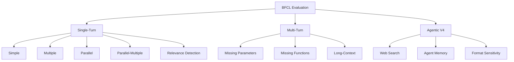

## 論文概要（Abstract）

Berkeley Function Calling Leaderboard（BFCL）は、LLMのFunction Calling（ツール使用）能力を体系的に評価するための包括的ベンチマークである。著者らは、シリアル・パラレルの関数呼び出しを複数プログラミング言語で評価するAbstract Syntax Tree（AST）評価手法を提案し、さらにマルチターンのエージェント設定における推論・状態管理能力を評価する。BFCL-V3では4,951テストインスタンス（3,951単一ターン + 1,000マルチターン）を構築し、最新のV4ではWebサーチやエージェントメモリ管理を含むエージェント評価へと拡張している。

本記事は [https://proceedings.mlr.press/v267/patil25a.html](https://proceedings.mlr.press/v267/patil25a.html) の解説記事です。

## 情報源

- **会議名**: ICML 2025（International Conference on Machine Learning）
- **掲載**: PMLR v267, pp. 48371-48392
- **URL**: [https://proceedings.mlr.press/v267/patil25a.html](https://proceedings.mlr.press/v267/patil25a.html)
- **著者**: Shishir G. Patil, Huanzhi Mao, Fanjia Yan, Charlie Cheng-Jie Ji, Vishnu Suresh, Ion Stoica, Joseph E. Gonzalez
- **コード**: [https://github.com/ShishirPatil/gorilla/tree/main/berkeley-function-call-leaderboard](https://github.com/ShishirPatil/gorilla/tree/main/berkeley-function-call-leaderboard)
- **リーダーボード**: [https://gorilla.cs.berkeley.edu/leaderboard.html](https://gorilla.cs.berkeley.edu/leaderboard.html)

## カンファレンス情報

ICML（International Conference on Machine Learning）は、機械学習分野における最高峰の国際会議の1つである。NeurIPS、ICLRと並ぶトップ会議であり、採択率は例年25-30%前後と競争率が高い。BFCLはFunction Callingの標準ベンチマークとしてde factoの地位を確立しており、ICML 2025での発表は同分野への影響力の大きさを示している。

## 技術的詳細（Technical Details）

### BFCLの設計思想

BFCLは「Function Callingには標準的なベンチマークが存在しなかった」という課題に対し、実世界のユースケースを網羅する体系的な評価フレームワークを構築した。著者らは、専門家キュレーションとユーザ投稿の2つのソースから評価データを収集し、単一ターンの関数呼び出しからマルチターンのエージェント設定まで段階的に評価難度を上げる構成を採用している。

ベンチマークの評価方針として、LLMの出力を「コードとして構造解析する」アプローチを採用している点が特徴的である。従来のテキストマッチングではなく、Abstract Syntax Tree（AST）レベルで構造的等価性を検証することにより、出力フォーマットの微妙な差異（引数の順序、空白、文字列の大小文字等）に対してロバストな評価を実現した。

### 評価カテゴリ

BFCLは以下の評価カテゴリを定義している。



**Single-Turn カテゴリ**:

- **Simple**: 単一のAPIに対して1つの関数呼び出しを生成する最も基本的なタスク。Python、Java、JavaScriptの各言語で評価される（399インスタンス）
- **Multiple**: 複数の候補関数定義から正しい1つを選択して呼び出すタスク（199インスタンス）。関数選択の判断力を測る
- **Parallel**: 単一の関数を複数回、独立に呼び出す必要があるタスク。例えば「東京と大阪の天気を調べて」という指示に対して`get_weather("Tokyo")`と`get_weather("Osaka")`を並列に生成する能力を評価する
- **Parallel-Multiple**: 複数の異なる関数を複数回呼び出す最も複雑なカテゴリ。関数選択と並列生成を同時に要求する

**Relevance Detection**:

提供された関数がユーザのクエリに対して無関係である場合に、関数呼び出しを行わない（`no_call`を出力する）能力を評価する。239インスタンス（オフライン）+ 884インスタンス（ライブ）で構成され、モデルが不必要なハルシネーション呼び出しを生成しないかを検証する。

### AST評価手法

BFCLの中核をなすAST（Abstract Syntax Tree）評価は、モデルが生成した関数呼び出しを構文木に変換し、正解の構文木と構造的に比較する手法である。

AST精度は以下のように定義される。

$$
\text{AST\_Acc} = \frac{1}{N} \sum_{i=1}^{N} \mathbb{1}\bigl(\text{AST}(\hat{y}_i) \equiv \text{AST}(y_i)\bigr)
$$

ここで、
- $N$: テストインスタンスの総数
- $\hat{y}_i$: モデルが生成した$i$番目の関数呼び出し
- $y_i$: $i$番目の正解（ground truth）
- $\text{AST}(\cdot)$: コードを抽象構文木に変換する関数
- $\equiv$: 構造的等価性（関数名、引数名、引数の型、値が一致）
- $\mathbb{1}(\cdot)$: 指示関数（条件が真なら1、偽なら0）

AST比較では以下のルールが適用される。

1. **関数名の完全一致**: 呼び出し先の関数名が正解と一致すること
2. **必須引数の包含**: 関数仕様で定義されたすべての必須パラメータが含まれること
3. **型の一致**: 引数の型が仕様に合致すること（文字列は大文字小文字を区別しない）
4. **ハルシネーション引数の検出**: 仕様に存在しない引数が含まれていないこと
5. **リスト引数**: 順序依存で比較される

### Executable評価

AST評価に加え、BFCLは**Executable評価**（実行可能性評価）も提供する。これは生成された関数呼び出しを実際にサンドボックス環境で実行し、期待される出力と比較する手法である。AST評価が構造的正しさを検証するのに対し、Executable評価は意味的正しさ（実行結果の等価性）を検証する。両評価の組み合わせにより、「構文的に正しいが意味的に間違った呼び出し」を検出できる。

### V1からV4への進化

BFCLは継続的に拡張されている。

| バージョン | リリース時期 | 主な追加内容 |
|-----------|------------|-------------|
| V1 | 2024年2月 | AST評価メトリクス導入、2,000+テストペア |
| V2 | 2024年8月 | 67,000+コミュニティ投稿から2,251データポイントをキュレーション |
| V3 | 2024年9月 | マルチターン評価（1,000インスタンス）、状態管理評価 |
| V4 | 2025年7月 | エージェント評価（Webサーチ、メモリ管理、フォーマット感度） |

V4では、Overall Scoreの算出に以下の重み付けが適用されている。

$$
\text{Overall} = 0.4 \times S_{\text{agentic}} + 0.3 \times S_{\text{multi-turn}} + 0.1 \times S_{\text{live}} + 0.1 \times S_{\text{non-live}} + 0.1 \times S_{\text{hallucination}}
$$

ここで各$S$は対応するカテゴリのスコア（0-100）を表す。エージェント能力に40%の重みが割り当てられている点は、著者らがFunction Callingの将来方向としてエージェント応用を重視していることを反映している。

### V4 Agentic評価の詳細

V4で新設されたエージェント評価は以下の3トラックから構成される。

**Web Searchトラック（99クエリ）**: 人手で作成されたマルチホップ質問に対し、`search_engine_query`と`fetch_url_content`の2つのツールを使い分けて回答する能力を評価する。6種類のプログラマティックアクセスエラー（503 Server Error、429 Too Many Requests、403 Forbidden等）がランダムに注入され、エラーリカバリ能力も評価対象となる。

**Agent Memoryトラック（155シナリオ）**: 顧客対応、学生管理、金融、医療、メモ取りの5つのドメインで、事前に蓄積された会話履歴からの情報検索能力を評価する。Key-Valueストア、ベクトルストア、再帰要約の3つのメモリアーキテクチャを対象とする。

**Format Sensitivityトラック**: 26種類のプロンプトフォーマット変動（システムメッセージの違い、ドキュメント表現の違い、XML/JSON出力要件の違い）を適用し、フォーマット変更に対するモデルの頑健性を評価する。

## 実装のポイント

### BFCLでの評価実行方法

BFCLはPythonパッケージとして提供されており、`pip install bfcl-eval`でインストールできる。評価は「生成」と「評価」の2ステップパイプラインで実行する。

```python
"""BFCLによるFunction Calling評価の実行例

Prerequisites:
    pip install bfcl-eval
    # .envファイルにAPIキーを設定
"""
import subprocess
from pathlib import Path


def run_bfcl_evaluation(
    model_name: str,
    test_categories: list[str],
    num_threads: int = 4,
) -> dict[str, Path]:
    """BFCLベンチマークの生成と評価を実行する

    Args:
        model_name: 評価対象モデル名（例: "gpt-4o-2024-08-06"）
        test_categories: 評価カテゴリのリスト
            （例: ["simple_python", "parallel", "multiple"]）
        num_threads: 並列推論スレッド数

    Returns:
        カテゴリ名をキー、スコアファイルパスを値とする辞書
    """
    score_paths: dict[str, Path] = {}

    for category in test_categories:
        # Step 1: モデル出力の生成
        subprocess.run(
            [
                "bfcl", "generate",
                "--model", model_name,
                "--test-category", category,
                "--num-threads", str(num_threads),
            ],
            check=True,
        )

        # Step 2: AST/Executable評価の実行
        subprocess.run(
            [
                "bfcl", "evaluate",
                "--model", model_name,
                "--test-category", category,
            ],
            check=True,
        )

        score_path = Path(f"score/{model_name}/BFCL_v3_{category}_score.json")
        score_paths[category] = score_path

    return score_paths
```

### 自社モデルの評価手順

自社モデルをBFCLで評価するには、`model_handler/`ディレクトリにカスタムハンドラクラスを実装し、`constants/model_config.py`にモデル設定を追加する。ハンドラクラスでは、入力プロンプトの変換とモデル出力のパース処理を定義する。SGL/vLLMバックエンドを利用したローカル推論にも対応しており、`--backend sglang`または`--backend vllm`オプションで指定できる。

評価結果は`score/`ディレクトリにJSON形式で出力され、`data_overall.csv`に全カテゴリの集約結果が記録される。部分的な評価には`--partial-eval`フラグを使用する。

## 実験結果

### モデル間比較

著者らの報告によると、最先端のLLMは単一ターンのFunction Callingでは高い精度を達成する一方、並列呼び出しやマルチターンの設定では精度が大きく低下する。

V4リーダーボード（2025年7月時点）の上位モデルを以下に示す。

| モデル | Overall Score | 特記事項 |
|-------|--------------|---------|
| GLM-4.5 (FC) | 70.85% | Function Calling特化モデル |
| Claude Opus 4.1 | 70.36% | 汎用モデルとして最上位 |
| Claude Sonnet 4 | 70.29% | Opus 4.1とほぼ同等の性能 |
| GPT-5 | 59.22% | エージェントカテゴリで苦戦 |

これらのスコアはリーダーボード公開値に基づく（[gorilla.cs.berkeley.edu/leaderboard.html](https://gorilla.cs.berkeley.edu/leaderboard.html)）。

### 並列呼び出しでの精度低下パターン

著者らは、並列関数呼び出しにおいて以下の精度低下パターンを報告している。

- **Parallel-Multiple**: Simple に比べて精度が顕著に低下する。関数選択と並列生成の同時処理が困難であることを示唆する
- **パラフレーズ感度**: 入力クエリのパラフレーズ（言い換え）により、exact-match精度が13-19ポイント低下するとの報告がある
- **ツールキット拡張**: ディストラクタ関数の追加により、平均1-8ポイントの精度低下が観測されている

### エージェント評価の課題

V4のエージェント評価では、メモリ管理が最も困難なカテゴリであることが明らかになった。先行モデルでもメモリサブカテゴリでは12%程度のスコアにとどまるケースが報告されており、単純な関数実行と複雑な状態管理付き推論の間に大きな性能ギャップが存在する。

## 実運用への応用

### BFCLをCI/CDに組み込む

BFCLはコマンドラインツールとして提供されているため、CI/CDパイプラインに統合して自社モデルのFunction Calling性能を継続監視できる。

```python
"""CI/CDパイプラインでのBFCL回帰テスト例"""
import json
from pathlib import Path


def check_regression(
    model_name: str,
    category: str,
    min_accuracy: float = 0.85,
) -> bool:
    """BFCLスコアが閾値を下回っていないか検証する

    Args:
        model_name: 評価対象モデル名
        category: 評価カテゴリ（例: "simple_python"）
        min_accuracy: 最低許容精度（デフォルト: 0.85）

    Returns:
        精度が閾値以上ならTrue
    """
    score_path = Path(f"score/{model_name}/BFCL_v3_{category}_score.json")

    if not score_path.exists():
        raise FileNotFoundError(f"Score file not found: {score_path}")

    with score_path.open() as f:
        scores = json.load(f)

    accuracy = scores.get("accuracy", 0.0)
    passed = accuracy >= min_accuracy

    if not passed:
        print(
            f"REGRESSION DETECTED: {category} accuracy {accuracy:.2%} "
            f"< threshold {min_accuracy:.2%}"
        )

    return passed
```

### 実運用での活用指針

1. **モデル選定**: BFCLのカテゴリ別スコアを参照し、自社ユースケースに合致するモデルを選定できる。並列呼び出しが多いエージェントアプリケーションでは、Parallel-Multipleカテゴリのスコアが特に重要となる

2. **プロンプト設計の検証**: Format Sensitivityトラックの結果から、モデルごとに最適なプロンプト形式（XML/JSON/自然言語）を特定できる

3. **エラーハンドリング設計**: Web Searchトラックで注入される6種のエラーパターンは、実運用でのリトライ戦略やフォールバック設計の参考になる

4. **回帰テスト**: モデルのバージョンアップやファインチューニング後に、BFCLスコアの低下がないかを自動検証できる

## 関連研究

BFCLは以下の関連研究の文脈に位置づけられる。

- **Gorilla** (Patil et al., 2023): BFCLの母体プロジェクト。LLMにAPIドキュメントを理解させ正確な関数呼び出しを生成するモデルを構築した。BFCLはGorillaの評価インフラから発展した
- **ToolBench** (Qin et al., 2023): 16,000以上のREST APIを対象とした大規模ツール使用ベンチマーク。BFCLとは評価対象の粒度が異なり、ToolBenchはAPI呼び出しチェーン全体、BFCLは個別の関数呼び出し精度に焦点を当てる
- **API-Bank** (Li et al., 2023): APIの検索・呼び出し・応答統合を含む対話型ベンチマーク。BFCLのRelevance Detectionカテゴリと一部重複するが、BFCLはAST評価により定量的な精度測定を可能にした点で差別化される
- **ToolACE** (Liu et al., 2024): Function Calling能力をファインチューニングで強化するアプローチ。8Bパラメータモデルで多くのAPIベースモデルを上回る性能を報告しており、BFCLが訓練データ構築にも活用されていることを示す

## まとめ

BFCLは、LLMのFunction Calling能力に対する初の包括的かつ実行可能なベンチマークとして、評価の標準化に貢献している。AST評価手法により構造的正しさを大規模にスケーラブルに検証可能とし、V3でのマルチターン評価、V4でのエージェント評価と段階的に拡張を続けている。著者らの実験結果は、最先端LLMが単一ターンの関数呼び出しでは高い精度を達成する一方、メモリ管理・動的意思決定・長期推論といったエージェント的能力には依然として大きな課題が残ることを示している。Function Callingベースのエージェントを構築する実務者にとって、BFCLはモデル選定・プロンプト設計・回帰テストの指針となる重要なリソースである。

## 参考文献

- **Conference URL**: [https://proceedings.mlr.press/v267/patil25a.html](https://proceedings.mlr.press/v267/patil25a.html)
- **Code**: [https://github.com/ShishirPatil/gorilla/tree/main/berkeley-function-call-leaderboard](https://github.com/ShishirPatil/gorilla/tree/main/berkeley-function-call-leaderboard)
- **Leaderboard**: [https://gorilla.cs.berkeley.edu/leaderboard.html](https://gorilla.cs.berkeley.edu/leaderboard.html)
- **Related Zenn article**: [https://zenn.dev/0h_n0/articles/57c4107d4591b1](https://zenn.dev/0h_n0/articles/57c4107d4591b1)
