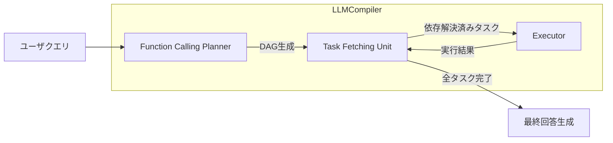

本記事は [論文: An LLM Compiler for Parallel Function Calling](https://arxiv.org/abs/2312.04511) の解説記事です。

## 論文概要（Abstract）

本論文は、LLMによる関数呼び出し（Function Calling）を並列化するフレームワークLLMCompilerを提案している。従来のReActパターンでは、推論と行動を逐次的に繰り返すため高レイテンシ・高コストという課題があった。著者らは古典的コンパイラの設計原理に着想を得て、Function Calling Planner・Task Fetching Unit・Executorの3コンポーネントからなるアーキテクチャを設計した。実験の結果、ReActと比較して最大3.7倍のレイテンシ短縮、最大6.7倍のコスト削減、最大約9%の精度改善が報告されている。

この記事は [Zenn記事: Function Calling並列実行入門：3社APIでエージェントを構築する](https://zenn.dev/0h_n0/articles/57c4107d4591b1) の深掘りです。

## 情報源

- **arXiv ID**: 2312.04511
- **URL**: [https://arxiv.org/abs/2312.04511](https://arxiv.org/abs/2312.04511)
- **著者**: Sehoon Kim, Suhong Moon, Ryan Tabrizi, Nicholas Lee, Michael W. Mahoney, Kurt Keutzer, Amir Gholami
- **発表年**: 2023（ICML 2024採択）
- **分野**: cs.CL

## 背景と動機（Background & Motivation）

LLMの推論能力の向上により、外部関数（ツール）の呼び出しを通じて知識のカットオフや計算能力の不足を補う手法が広く採用されている。代表的なフレームワークであるReActは、推論（Thought）→ 行動（Action）→ 観察（Observation）のサイクルを繰り返すことで関数呼び出しを実現する。

しかし、ReActの逐次的なアプローチには以下の構造的問題がある。

1. **高レイテンシ**: 各関数呼び出しごとにLLMの推論ステップが必要となり、$N$個の関数呼び出しに対して$N$回のLLM推論が発生する
2. **高コスト**: 推論ステップごとにコンテキスト全体を再入力するため、トークン消費が累積的に増大する
3. **精度低下**: 長い推論チェーンで早期停止（premature early stopping）や同一関数の反復呼び出しが発生する

著者らは、Movie Recommendationタスクにおいてリコメンデーションの85%がReActの早期停止によって失敗し、HotpotQAでは約10%のクエリで4回以上の反復的な関数呼び出しが観測されたと報告している。これらの課題に対し、並列実行による根本的な解決を目指したのがLLMCompilerである。

## 主要な貢献（Key Contributions）

- **DAGベースの実行計画生成**: LLMの推論能力を活用して関数呼び出しの依存関係をDAG（有向非巡回グラフ）として自動生成し、独立なタスクを並列実行可能にするFunction Calling Plannerの提案
- **ストリーミング型タスクディスパッチ**: Plannerの出力をストリーミングで受け取り、依存関係が解決されたタスクを即座にディスパッチするTask Fetching Unitの設計。これにより計画生成と実行をパイプライン化し、レイテンシをさらに削減
- **オープンソース・クローズドソース双方での有効性実証**: GPT-3.5/4およびLLaMA-2 70Bの両方でReActに対する一貫した改善を示し、フレームワークの汎用性を検証

## 技術的詳細（Technical Details）

### アーキテクチャ概要

LLMCompilerは古典的コンパイラの3段階構造（フロントエンド・ミドルエンド・バックエンド）に対応する3コンポーネントで構成される。



### Function Calling Planner

Plannerは、ユーザクエリとツール定義を入力として、関数呼び出しの実行計画をDAGとして生成する。各タスクは以下の形式でテキストとして出力される。

```
1. search("Sehoon Kim")
2. search("Amir Gholami")
3. get_affiliation($1)
4. get_affiliation($2)
5. join([$3, $4])
```

ここで`$i`はタスク$i$の出力を参照するプレースホルダ変数であり、タスク間の依存関係を表現する。この例では、タスク1と2は互いに独立であるため並列実行可能であり、タスク3はタスク1の完了を、タスク4はタスク2の完了をそれぞれ待つ必要がある。

### レイテンシの数理モデル

ReActとLLMCompilerのレイテンシを以下の数式でモデル化する。

**ReActのレイテンシ**:

$$
T^R = \sum_{i=1}^{N} \left( T_P^R(P_i) + T_E(E_i) \right)
$$

ここで、
- $N$: 関数呼び出しの総数
- $T_P^R(P_i)$: $i$番目の推論ステップのLLM処理時間
- $T_E(E_i)$: $i$番目の関数実行時間

**LLMCompilerのレイテンシ**:

$$
T^C = \sum_{j=1}^{M} T_P^C(P_j) + \max_{k \in \text{critical path}} T_E(E_k)
$$

ここで、
- $M$: Plannerの呼び出し回数（通常$M \ll N$、リプランニングがなければ$M = 1$）
- $\max_{k}$: クリティカルパス上の実行時間の最大値

**ストリーミング最適化**を適用した場合：

$$
T^{SC} = \sum_{j=1}^{M} T_P^C(P_j) + T_E(E_N)
$$

ストリーミングではPlannerの出力生成とタスク実行がパイプライン化されるため、$T^{SC} \leq T^C$が成立する。

**速度向上比**は以下で定義される：

$$
\gamma = \frac{T^R}{T^C}
$$

理論上の最大速度向上比$\gamma_{\max}$は、すべてのタスクが独立かつ同等の実行時間を持つ場合に$\gamma_{\max} \approx N$に近づく。

### Task Fetching Unit

Task Fetching Unitは、Plannerが生成したDAGに基づき、以下の貪欲（greedy）アルゴリズムでタスクをディスパッチする。

1. DAGから依存関係が未解決のタスクを監視
2. 前提タスクの実行が完了した時点で、プレースホルダ変数`$i`を実行結果の実際の値に置換（replace_variable）
3. 依存関係がすべて解決されたタスクをExecutorのキューに追加
4. すべてのタスクが完了するまで2-3を繰り返す

このユニットはLLMを使用せず、単純なキューイングメカニズムとして実装されている点が特徴である。LLMの推論オーバーヘッドなしにタスクスケジューリングを実現することで、コストとレイテンシの両面で効率化を達成している。

### Executor

Executorは、Task Fetching Unitからディスパッチされたタスクを非同期に並列実行する。各タスクは専用のメモリ領域を持ち、実行結果は依存するタスクに伝播される。独立したタスクはスレッドプールまたは非同期I/Oにより同時実行される。

### 動的リプランニング

一部のタスクでは、実行結果に基づいて計画を修正する必要がある。著者らは、Executorの実行結果をPlannerにフィードバックし、新たな実行計画を生成する動的リプランニング機構を提供している。Game of 24タスクでは、この機構により中間結果を検証しながら段階的に解を構築することが可能となっている。

## 実装のポイント（Implementation）

LLMCompilerの実装において重要な設計判断を以下に整理する。公式実装は[GitHub](https://github.com/SqueezeAILab/LLMCompiler)で公開されている。

```python
from __future__ import annotations

import asyncio
from dataclasses import dataclass, field
from typing import Any, Callable


@dataclass
class Task:
    """DAG上の1タスクを表現するデータクラス。

    Attributes:
        task_id: タスクの一意識別子
        function: 実行する関数
        args: 関数の引数（プレースホルダを含む場合がある）
        dependencies: 依存するタスクIDのリスト
        result: 実行結果（未実行時はNone）
    """

    task_id: int
    function: Callable[..., Any]
    args: list[Any]
    dependencies: list[int] = field(default_factory=list)
    result: Any = None


async def execute_dag(tasks: dict[int, Task]) -> dict[int, Any]:
    """DAGに基づきタスクを並列実行する。

    依存関係が解決されたタスクから順次実行し、
    すべてのタスク完了後に結果を返す。

    Args:
        tasks: タスクIDをキーとするTaskの辞書

    Returns:
        タスクIDと実行結果のマッピング
    """
    completed: dict[int, Any] = {}
    pending = set(tasks.keys())

    while pending:
        ready = [
            tid for tid in pending
            if all(dep in completed for dep in tasks[tid].dependencies)
        ]

        if not ready:
            raise RuntimeError("Circular dependency detected in DAG")

        # 依存解決済みタスクを並列実行
        async_tasks = []
        for tid in ready:
            task = tasks[tid]
            resolved_args = _resolve_args(task.args, completed)
            async_tasks.append(_run_task(tid, task.function, resolved_args))

        results = await asyncio.gather(*async_tasks)

        for tid, result in results:
            completed[tid] = result
            pending.discard(tid)

    return completed


def _resolve_args(
    args: list[Any], completed: dict[int, Any]
) -> list[Any]:
    """プレースホルダ変数を実行結果で置換する。

    Args:
        args: 関数の引数リスト
        completed: 完了済みタスクの結果

    Returns:
        プレースホルダが解決された引数リスト
    """
    resolved = []
    for arg in args:
        if isinstance(arg, str) and arg.startswith("$"):
            ref_id = int(arg[1:])
            resolved.append(completed[ref_id])
        else:
            resolved.append(arg)
    return resolved


async def _run_task(
    task_id: int,
    func: Callable[..., Any],
    args: list[Any],
) -> tuple[int, Any]:
    """単一タスクを非同期実行する。

    Args:
        task_id: タスクID
        func: 実行する関数
        args: 解決済み引数

    Returns:
        タスクIDと実行結果のタプル
    """
    if asyncio.iscoroutinefunction(func):
        result = await func(*args)
    else:
        loop = asyncio.get_event_loop()
        result = await loop.run_in_executor(None, func, *args)
    return task_id, result
```

実装における注意点として、Plannerの出力パースでは正規表現によるタスク抽出とプレースホルダ変数の検出が必要である。公式リポジトリではLangGraphおよびLlamaIndexとの統合も提供されており、既存のエージェントフレームワークに組み込むことが可能である。

## Production Deployment Guide

### AWS実装パターン（コスト最適化重視）

LLMCompilerのプランニング・並列実行アーキテクチャをAWS上に展開する際の推奨構成を示す。コスト試算は2026年10月時点のAWS ap-northeast-1（東京）リージョン料金に基づく概算値であり、実際のコストはトラフィックパターンやバースト使用量により変動する。最新料金はAWS料金計算ツールで確認を推奨する。

| 構成 | トラフィック | サービス | 月額目安 |
|------|------------|----------|---------|
| Small | ~100 req/日 | Lambda + Bedrock + DynamoDB | $50-150 |
| Medium | ~1,000 req/日 | ECS Fargate + Bedrock + ElastiCache | $300-800 |
| Large | 10,000+ req/日 | EKS + Karpenter + Spot Instances | $2,000-5,000 |

**Small構成**（~100 req/日）: Lambda関数でPlanner・Task Fetching Unit・Executorの各コンポーネントを実装する。PlannerはBedrock（Claude/GPT相当モデル）を呼び出し、DAGをDynamoDBに永続化する。並列実行はLambdaの非同期呼び出し（`InvokeAsync`）で実現する。月額$50-150の内訳はLambda $5-10、Bedrock $30-100（トークン量依存）、DynamoDB $5-15、CloudWatch $5-10である。

**Medium構成**（~1,000 req/日）: ECS Fargateで常駐サービスを運用し、Task Fetching Unitの状態管理にElastiCacheを使用する。Fargateのタスク数は並列度に応じて自動スケーリングする。月額$300-800の内訳はFargate $100-250、Bedrock $150-400、ElastiCache $30-60、ALB $20-40である。

**Large構成**（10,000+ req/日）: EKS上でKarpenterによる自動スケーリングを活用し、Spot Instancesを優先して最大90%のコンピュート費用を削減する。Executorはワーカーポッドとして水平スケールし、SQSベースのタスクキューで負荷分散する。月額$2,000-5,000の内訳はEKS $73（コントロールプレーン）、EC2 Spot $500-1,500、Bedrock $1,000-2,500、SQS/ElastiCache $100-200である。

**コスト削減テクニック**:
- Spot Instances活用でEC2コストを最大90%削減
- Reserved Instances（1年コミット）で最大72%削減
- Bedrock Batch APIで非リアルタイム処理を50%削減
- Prompt Caching有効化でPlannerプロンプトの再入力コストを30-90%削減

### Terraformインフラコード

**Small構成（Serverless）**: Lambda + Bedrock + DynamoDB

```hcl
# LLMCompiler Small構成 - Serverless
# Lambda + Bedrock + DynamoDB

terraform {
  required_version = ">= 1.9"
  required_providers {
    aws = {
      source  = "hashicorp/aws"
      version = "~> 5.70"
    }
  }
}

provider "aws" {
  region = "ap-northeast-1"
}

# IAMロール（最小権限）
resource "aws_iam_role" "llm_compiler_lambda" {
  name = "llm-compiler-lambda-role"

  assume_role_policy = jsonencode({
    Version = "2012-10-17"
    Statement = [{
      Action = "sts:AssumeRole"
      Effect = "Allow"
      Principal = { Service = "lambda.amazonaws.com" }
    }]
  })
}

resource "aws_iam_role_policy" "llm_compiler_policy" {
  name = "llm-compiler-policy"
  role = aws_iam_role.llm_compiler_lambda.id

  policy = jsonencode({
    Version = "2012-10-17"
    Statement = [
      {
        Effect = "Allow"
        Action = [
          "bedrock:InvokeModel",
          "bedrock:InvokeModelWithResponseStream"
        ]
        Resource = "arn:aws:bedrock:ap-northeast-1::foundation-model/*"
      },
      {
        Effect = "Allow"
        Action = [
          "dynamodb:PutItem",
          "dynamodb:GetItem",
          "dynamodb:UpdateItem",
          "dynamodb:Query"
        ]
        Resource = aws_dynamodb_table.task_dag.arn
      },
      {
        Effect = "Allow"
        Action = [
          "logs:CreateLogGroup",
          "logs:CreateLogStream",
          "logs:PutLogEvents"
        ]
        Resource = "arn:aws:logs:*:*:*"
      },
      {
        # 並列実行用: 自己呼び出し
        Effect   = "Allow"
        Action   = "lambda:InvokeFunction"
        Resource = "arn:aws:lambda:ap-northeast-1:*:function:llm-compiler-*"
      }
    ]
  })
}

# DynamoDB: DAGタスク状態管理（On-Demandでコスト最適化）
resource "aws_dynamodb_table" "task_dag" {
  name         = "llm-compiler-task-dag"
  billing_mode = "PAY_PER_REQUEST"
  hash_key     = "execution_id"
  range_key    = "task_id"

  attribute {
    name = "execution_id"
    type = "S"
  }
  attribute {
    name = "task_id"
    type = "N"
  }

  server_side_encryption { enabled = true }
  point_in_time_recovery { enabled = true }

  ttl {
    attribute_name = "expires_at"
    enabled        = true
  }
}

# Lambda: Planner + Executor
resource "aws_lambda_function" "planner" {
  function_name = "llm-compiler-planner"
  runtime       = "python3.12"
  handler       = "planner.handler"
  role          = aws_iam_role.llm_compiler_lambda.arn
  timeout       = 120
  memory_size   = 512

  environment {
    variables = {
      DAG_TABLE_NAME = aws_dynamodb_table.task_dag.name
      MODEL_ID       = "anthropic.claude-sonnet-4-20250514"
    }
  }

  filename = "lambda_planner.zip"
}

# CloudWatchアラーム: コスト監視
resource "aws_cloudwatch_metric_alarm" "bedrock_token_spike" {
  alarm_name          = "llm-compiler-bedrock-token-spike"
  comparison_operator = "GreaterThanThreshold"
  evaluation_periods  = 1
  metric_name         = "InputTokenCount"
  namespace           = "AWS/Bedrock"
  period              = 3600
  statistic           = "Sum"
  threshold           = 100000
  alarm_description   = "Bedrockトークン使用量スパイク検知"
  alarm_actions       = []  # SNS ARNを設定
}
```

**Large構成（Container）**: EKS + Karpenter + Spot Instances

```hcl
# LLMCompiler Large構成 - Container
# EKS + Karpenter + Spot Instances

module "eks" {
  source  = "terraform-aws-modules/eks/aws"
  version = "~> 20.24"

  cluster_name    = "llm-compiler-cluster"
  cluster_version = "1.31"

  vpc_id     = module.vpc.vpc_id
  subnet_ids = module.vpc.private_subnets

  # Karpenter用設定
  enable_cluster_creator_admin_permissions = true

  cluster_endpoint_public_access = false  # セキュリティ: プライベートのみ
}

# Karpenter: Spot優先の自動スケーリング
resource "kubectl_manifest" "karpenter_node_pool" {
  yaml_body = yamlencode({
    apiVersion = "karpenter.sh/v1"
    kind       = "NodePool"
    metadata   = { name = "llm-compiler-workers" }
    spec = {
      template = {
        spec = {
          requirements = [
            {
              key      = "karpenter.sh/capacity-type"
              operator = "In"
              values   = ["spot", "on-demand"]  # Spot優先
            },
            {
              key      = "node.kubernetes.io/instance-type"
              operator = "In"
              values   = ["m7i.xlarge", "m7i.2xlarge", "m6i.xlarge", "m6i.2xlarge"]
            }
          ]
        }
      }
      limits   = { cpu = "160", memory = "640Gi" }
      disruption = {
        consolidationPolicy = "WhenEmptyOrUnderutilized"
        consolidateAfter    = "60s"
      }
    }
  })
}

# Secrets Manager: Bedrock設定
resource "aws_secretsmanager_secret" "bedrock_config" {
  name                    = "llm-compiler/bedrock-config"
  recovery_window_in_days = 7
}

# AWS Budgets: 予算アラート
resource "aws_budgets_budget" "llm_compiler" {
  name         = "llm-compiler-monthly"
  budget_type  = "COST"
  limit_amount = "5000"
  limit_unit   = "USD"
  time_unit    = "MONTHLY"

  notification {
    comparison_operator       = "GREATER_THAN"
    threshold                 = 80
    threshold_type            = "PERCENTAGE"
    notification_type         = "ACTUAL"
    subscriber_email_addresses = ["alert@example.com"]
  }
}
```

### 運用・監視設定

**CloudWatch Logs Insights クエリ**: Plannerのトークン使用量とレイテンシを分析する。

```
# コスト異常検知: 1時間あたりのトークン使用量
fields @timestamp, input_tokens, output_tokens
| stats sum(input_tokens) as total_input, sum(output_tokens) as total_output by bin(1h) as hour
| filter total_input > 50000
| sort hour desc

# レイテンシ分析: P95/P99
fields @timestamp, duration_ms, task_count
| stats percentile(duration_ms, 95) as p95, percentile(duration_ms, 99) as p99 by bin(5m)
| sort @timestamp desc
```

**CloudWatch アラーム設定（Python）**:

```python
import boto3


def setup_cost_alarms(sns_topic_arn: str) -> None:
    """Bedrockトークン使用量とLambda実行時間のアラームを設定する。

    Args:
        sns_topic_arn: 通知先SNSトピックのARN
    """
    cw = boto3.client("cloudwatch", region_name="ap-northeast-1")

    # Bedrockトークン使用量スパイク検知
    cw.put_metric_alarm(
        AlarmName="llm-compiler-token-spike",
        MetricName="InputTokenCount",
        Namespace="AWS/Bedrock",
        Statistic="Sum",
        Period=3600,
        EvaluationPeriods=1,
        Threshold=100_000,
        ComparisonOperator="GreaterThanThreshold",
        AlarmActions=[sns_topic_arn],
    )

    # Lambda実行時間異常検知
    cw.put_metric_alarm(
        AlarmName="llm-compiler-lambda-duration",
        MetricName="Duration",
        Namespace="AWS/Lambda",
        Dimensions=[{"Name": "FunctionName", "Value": "llm-compiler-planner"}],
        Statistic="p99",
        Period=300,
        EvaluationPeriods=3,
        Threshold=90_000,
        ComparisonOperator="GreaterThanThreshold",
        AlarmActions=[sns_topic_arn],
    )
```

**X-Ray トレーシング設定（Python）**:

```python
from aws_xray_sdk.core import xray_recorder, patch_all


def configure_xray_tracing() -> None:
    """X-Rayトレーシングを初期化しboto3を自動計装する。"""
    xray_recorder.configure(service="llm-compiler")
    patch_all()  # boto3, requests等を自動計装


@xray_recorder.capture("planner_invoke")
def invoke_planner(query: str, tools: list[dict]) -> dict:
    """Plannerを呼び出しDAGを生成する（X-Rayトレース付き）。

    Args:
        query: ユーザクエリ
        tools: ツール定義のリスト

    Returns:
        生成されたDAG
    """
    subsegment = xray_recorder.current_subsegment()
    subsegment.put_annotation("query_length", len(query))
    subsegment.put_annotation("tool_count", len(tools))

    # Bedrock呼び出し（自動計装済み）
    result = _call_bedrock_planner(query, tools)

    subsegment.put_metadata("task_count", result["task_count"])
    return result
```

**Cost Explorer自動レポート（Python）**:

```python
import datetime

import boto3


def daily_cost_report(sns_topic_arn: str, threshold_usd: float = 100.0) -> None:
    """日次コストレポートを取得し閾値超過時にSNS通知する。

    Args:
        sns_topic_arn: 通知先SNSトピックのARN
        threshold_usd: 通知閾値（USD/日）
    """
    ce = boto3.client("ce", region_name="us-east-1")
    today = datetime.date.today()
    yesterday = today - datetime.timedelta(days=1)

    response = ce.get_cost_and_usage(
        TimePeriod={"Start": str(yesterday), "End": str(today)},
        Granularity="DAILY",
        Metrics=["UnblendedCost"],
        Filter={
            "Tags": {
                "Key": "Project",
                "Values": ["llm-compiler"],
            }
        },
        GroupBy=[{"Type": "DIMENSION", "Key": "SERVICE"}],
    )

    total = sum(
        float(g["Metrics"]["UnblendedCost"]["Amount"])
        for group in response["ResultsByTime"]
        for g in group["Groups"]
    )

    if total > threshold_usd:
        sns = boto3.client("sns", region_name="ap-northeast-1")
        sns.publish(
            TopicArn=sns_topic_arn,
            Subject=f"LLMCompiler Cost Alert: ${total:.2f}/day",
            Message=f"日次コストが閾値${threshold_usd}を超過: ${total:.2f}",
        )
```

### コスト最適化チェックリスト

**アーキテクチャ選択**:
- [ ] トラフィック~100 req/日 → Serverless（Lambda + Bedrock）
- [ ] トラフィック~1,000 req/日 → Hybrid（ECS Fargate + Bedrock）
- [ ] トラフィック10,000+ req/日 → Container（EKS + Spot）

**リソース最適化**:
- [ ] EC2/EKS: Spot Instances優先（最大90%削減）
- [ ] Reserved Instances: 1年コミットで最大72%削減
- [ ] Savings Plans: Compute Savings Plans検討
- [ ] Lambda: メモリサイズをPower Tuningで最適化（512MB推奨）
- [ ] ECS/EKS: Karpenterでアイドル時スケールダウン（consolidateAfter: 60s）
- [ ] NAT Gateway: VPCエンドポイント活用でデータ転送費削減

**LLMコスト削減**:
- [ ] Bedrock Batch API: 非リアルタイム処理で50%削減
- [ ] Prompt Caching有効化: Plannerプロンプトのキャッシュで30-90%削減
- [ ] モデル選択ロジック: 簡単なクエリはHaiku/mini、複雑なクエリはSonnet/GPT-4o
- [ ] トークン数制限: Plannerの出力トークンに上限設定
- [ ] DAGキャッシュ: 同一パターンのクエリに対する計画を再利用

**監視・アラート**:
- [ ] AWS Budgets: 月額予算の80%で警告
- [ ] CloudWatch アラーム: トークンスパイク・レイテンシ異常
- [ ] Cost Anomaly Detection: ML ベースの異常検知有効化
- [ ] 日次コストレポート: Cost Explorer APIで自動取得

**リソース管理**:
- [ ] 未使用リソース削除: 週次で未参照Lambda/ECRイメージを削除
- [ ] タグ戦略: `Project=llm-compiler`タグを全リソースに付与
- [ ] ライフサイクルポリシー: DynamoDB TTL、CloudWatch Logsの保持期間設定
- [ ] 開発環境: 夜間・休日のEKSノード停止（Karpenter disruption設定）
- [ ] ECRイメージ: ライフサイクルポリシーで古いイメージを自動削除

## 実験結果（Results）

著者らは5つのベンチマークで評価を実施している。主要な結果を以下にまとめる。

### HotpotQA（2-way並列、1,500問）

| 手法 | モデル | 精度 | レイテンシ | 速度向上比 |
|------|--------|------|-----------|-----------|
| ReAct | GPT-3.5-turbo | 59.17% | 7.11s | 1.00× |
| LLMCompiler | GPT-3.5-turbo | 62.00% | 3.95s | 1.80× |
| LLMCompiler | LLaMA-2 70B | 57.83% | 9.58s | 1.40× |

### Movie Recommendation（8-way並列、500問）

| 手法 | モデル | 精度 | レイテンシ | 速度向上比 | コスト削減比 |
|------|--------|------|-----------|-----------|-------------|
| ReAct | GPT-3.5-turbo | 52.53% | 20.44s | 1.00× | 1.00× |
| LLMCompiler | GPT-3.5-turbo | 77.13% | 5.47s | 3.74× | 6.73× |
| LLMCompiler | LLaMA-2 70B | 77.80% | 11.83s | 2.82× | - |

Movie Recommendationでは、ReActの精度が52.53%にとどまっている。著者らは、ReActが8件の映画を検索する前に早期停止してしまう問題が85%のケースで発生したと報告しており、LLMCompilerではすべてのタスクを完了してから最終回答を生成するため、この問題を根本的に回避している。

### ParallelQA（複雑な依存関係、113問）

| 手法 | モデル | 精度 | レイテンシ | 速度向上比 | コスト削減比 |
|------|--------|------|-----------|-----------|-------------|
| ReAct | GPT-4-turbo | 80.09% | 35.93s | 1.00× | 1.00× |
| LLMCompiler | GPT-4-turbo | 89.38% | 16.69s | 2.15× | 4.65× |
| LLMCompiler | LLaMA-2 70B | 68.14% | 26.20s | 2.27× | - |

トークン消費量の比較では、ReActがParallelQAで入力46,000トークン・出力470トークン・コスト$480を消費するのに対し、LLMCompilerは入力9,200トークン・出力340トークン・コスト$103にとどまり、約80%のトークン削減を達成している（論文Table参照）。

### 失敗分析

ParallelQAにおけるLLMCompilerの失敗要因は以下の分布であったと著者らは報告している：Planner起因8%、Executor起因64%、最終出力生成起因28%。Executor起因の失敗が多いのは、外部API呼び出し自体のエラーやタイムアウトが主因であり、フレームワーク固有の問題ではない。

## 実運用への応用（Practical Applications）

Zenn記事「Function Calling並列実行入門：3社APIでエージェントを構築する」で解説されているOpenAI・Claude・GeminiのFunction Calling機能は、いずれも逐次的な呼び出しが基本である。LLMCompilerのアプローチは、これらのAPIの上位レイヤーとして適用可能である。

**具体的な活用シナリオ**:

1. **マルチソース情報検索エージェント**: 複数のAPIやデータベースから同時に情報を取得するRAGパイプライン。HotpotQAの結果が示すように、2-way並列でも1.8倍の速度向上が得られる
2. **レコメンデーションシステム**: Movie Recommendationの結果が示すように、8つの候補を並列に評価することで精度と速度の両面で改善が見込める。ECサイトの商品推薦や求人マッチングへの応用が考えられる
3. **コスト最適化が重要な大規模バッチ処理**: 6.7倍のコスト削減は、月間数千〜数万のリクエストを処理するプロダクションシステムにおいて顕著な運用コスト削減につながる

LangGraphおよびLlamaIndexとの統合が公式に提供されているため、既存のエージェントフレームワークへの導入障壁は低い。

## 関連研究（Related Work）

- **ReAct** (Yao et al., 2022): 推論と行動を交互に実行するフレームワーク。LLMCompilerが直接比較対象としている逐次実行のベースライン
- **Toolformer** (Schick et al., 2023): LLMがツール呼び出しのタイミングと方法を自律的に学習する手法。LLMCompilerは学習不要で任意のツールに適用可能な点で異なる
- **Gorilla** (Patil et al., 2023): 大規模APIリポジトリから適切なAPIを選択するLLM。APIの選択に特化しており、LLMCompilerの並列実行最適化とは相補的な関係にある
- **Tree of Thoughts** (Yao et al., 2023): 探索的な推論を可能にするフレームワーク。Game of 24タスクでLLMCompilerと比較され、LLMCompilerが2.89倍の速度向上を達成

## まとめと今後の展望

LLMCompilerは、古典的コンパイラの設計原理をLLMの関数呼び出しに適用することで、ReActの逐次実行パターンが抱えるレイテンシ・コスト・精度の課題を同時に解決するフレームワークである。DAGベースの実行計画生成とストリーミング型タスクディスパッチにより、理論的にはタスク数$N$に比例する速度向上が期待できる。

今後の研究方向として、著者らはPlannerの精度向上（特にオープンソースモデルでの改善）と、動的リプランニングのオーバーヘッド削減を課題として挙げている。OpenAI・Claude・Geminiの各プロバイダがネイティブの並列Function Callingを拡充する中で、LLMCompilerのDAGベースの最適化手法がこれらのAPIとどのように統合されていくかが注目される。

## 参考文献

- **arXiv**: [https://arxiv.org/abs/2312.04511](https://arxiv.org/abs/2312.04511)
- **Code**: [https://github.com/SqueezeAILab/LLMCompiler](https://github.com/SqueezeAILab/LLMCompiler)
- **Related Zenn article**: [https://zenn.dev/0h_n0/articles/57c4107d4591b1](https://zenn.dev/0h_n0/articles/57c4107d4591b1)
