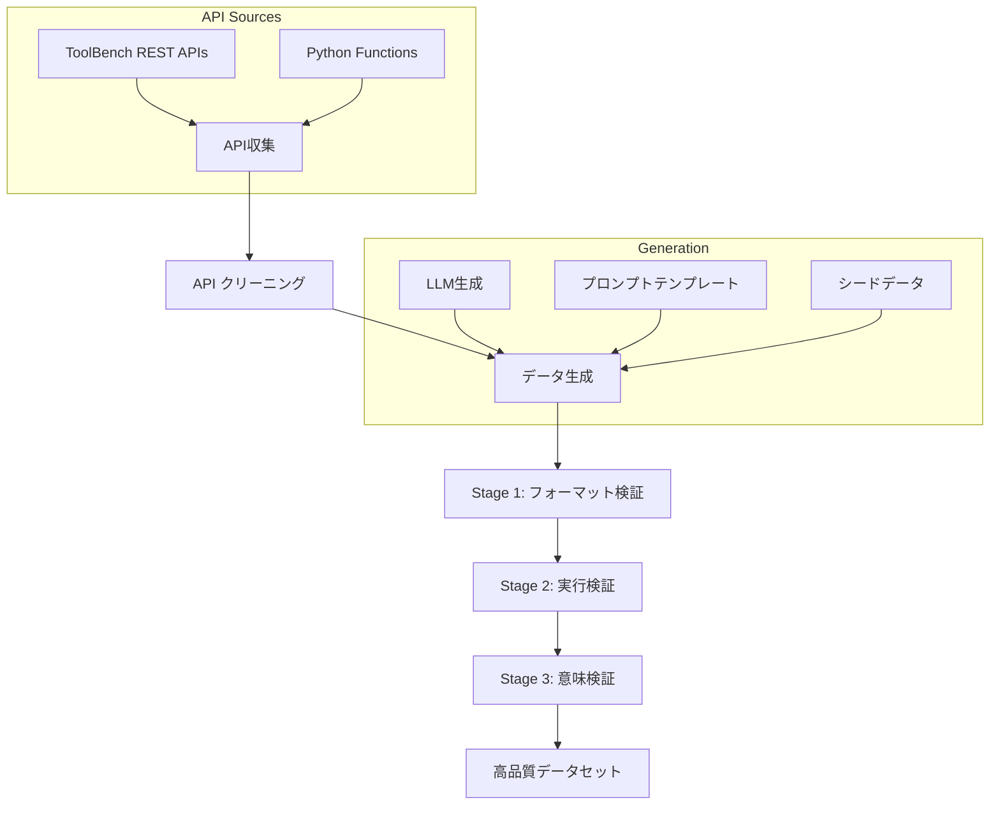

本記事は [論文: APIGen: Automated Pipeline for Generating Verifiable and Diverse Function-Calling Datasets](https://arxiv.org/abs/2406.18518) の解説記事です。

## 論文概要（Abstract）

APIGenは、Function Calling（関数呼び出し）に特化した高品質な学習データセットを自動生成するパイプラインである。著者らは21カテゴリにまたがる3,673個の実行可能なAPIを収集し、フォーマット検証・実行検証・意味検証の3段階品質保証を経て60,000件のデータセットを構築している。このデータセットでファインチューニングした7Bパラメータモデル（xLAM-7b-fc-r）はBerkeley Function-Calling Leaderboard（BFCL）で複数のGPT-4モデルを上回る性能を達成し、1Bモデル（xLAM-1b-fc-r）もGPT-3.5-TurboおよびClaude-3 Haikuを超える精度を報告している。

この記事は [Zenn記事: Function Calling並列実行入門：3社APIでエージェントを構築する](https://zenn.dev/0h_n0/articles/57c4107d4591b1) の深掘りです。

## 情報源

- **arXiv ID**: 2406.18518
- **URL**: [https://arxiv.org/abs/2406.18518](https://arxiv.org/abs/2406.18518)
- **著者**: Zuxin Liu, Thai Hoang, Jianguo Zhang, et al.（Salesforce AI Research）
- **発表年**: 2024（NeurIPS 2024 Datasets and Benchmarks Track採択）
- **分野**: cs.CL, cs.AI, cs.LG, cs.SE

## 背景と動機（Background & Motivation）

Function Calling（Tool Use）はLLMエージェントの中核機能であり、外部APIやツールを正確に呼び出す能力がエージェントの実用性を左右する。しかし、Function Callingモデルの学習には高品質なデータセットが不可欠であるにもかかわらず、既存のデータセットには以下の課題がある。

第一に、**品質の検証可能性**の欠如がある。ToolBenchやToolAlpacaなどの既存データセットは、LLMが生成した関数呼び出しが実際に正しく実行されるかを確認していない。引数の型エラーや存在しないパラメータの指定など、表面的には正しく見えるが実行不可能なデータが混在している。第二に、**多様性**の不足がある。既存データセットの多くは単純な1関数呼び出し（simple）のみを扱い、複数関数の並列呼び出し（parallel）や複数候補からの選択（multiple）といった実務で頻出するパターンを網羅していない。著者らは、これらの課題を解決するために、検証可能性と多様性を両立するデータ生成パイプラインAPIGenを提案している。

## 主要な貢献（Key Contributions）

- **自動化されたデータ生成パイプライン**: API収集からデータ生成、3段階検証までを自動化し、人手アノテーションなしで高品質なデータセットを構築できるフレームワークの提案
- **3段階の品質保証機構**: フォーマット検証（Stage 1）、実行検証（Stage 2）、意味検証（Stage 3）の階層的フィルタリングにより、生成データの正確性を保証
- **並列呼び出しシナリオの初サポート**: 著者らの知る限り、parallel（並列呼び出し）およびparallel_multiple（複数関数の並列呼び出し）シナリオを含む大規模データセットの初の提供
- **小規模モデルでの高性能達成**: 60,000件のデータで7Bモデルが複数のGPT-4バリアントを上回り、1BモデルがGPT-3.5-Turboを超えるBFCL性能を実証

## 技術的詳細（Technical Details）

### パイプライン全体像

APIGenのパイプラインは、API収集・クリーニング、データ生成、3段階検証の3フェーズで構成される。



### API収集とクリーニング

著者らはToolBenchデータセットから16,464件のREST APIを出発点とし、以下のクリーニング処理を適用している。

1. **アクセシビリティテスト**: 各APIエンドポイントに実際にリクエストを送信し、応答を確認
2. **ドキュメント品質フィルタリング**: ノイズの多いドキュメントをLLMで再生成
3. **カテゴリ統合**: 重複するカテゴリを21カテゴリに再編成

最終的にREST API 3,539件とPython関数134件（数学、金融、データ管理分野）の計3,673件が収集されている。

### クエリタイプの分類

APIGenは4種類のクエリタイプを生成し、Function Callingの多様なシナリオをカバーしている。

| クエリタイプ | 説明 | 例 |
|-------------|------|-----|
| Simple | 単一関数の単一呼び出し | 「東京の天気を教えて」→ `get_weather("Tokyo")` |
| Multiple | 複数候補から適切な関数を1つ選択 | 3つのAPI候補から最適な1つを選択して呼び出し |
| Parallel | 単一関数を異なる引数で並列呼び出し | 「東京と大阪の天気」→ `get_weather("Tokyo")`, `get_weather("Osaka")` |
| Parallel Multiple | 複数関数を並列で呼び出し | 天気APIと為替APIを同時呼び出し |

この分類はBFCLの評価カテゴリと対応しており、特にparallelおよびparallel_multipleのシナリオを含むデータセットは、著者らが報告する限り本研究が初となる。

### 3段階検証パイプライン

APIGenの品質保証の核心は、以下の3段階の階層的検証にある。

**Stage 1: フォーマット検証（Format Checker）**

LLMの出力が所定のJSON形式に準拠しているかを検証する。具体的には以下をチェックする。

- JSONとしての構文的正当性（パース可能性）
- `query`フィールドと`answer`フィールドの存在
- 関数名がAPIライブラリに存在するか
- 引数名とデータ型がAPIの仕様に一致するか
- オプションフィールド`thought`（Chain-of-Thought推論）の妥当性

**Stage 2: 実行検証（Execution Checker）**

Stage 1を通過した関数呼び出しを実際に実行し、正常に動作するかを検証する。Python関数は別プロセスでインポート・実行され、REST APIは実際のエンドポイントに対してHTTPリクエストが送信される。以下のエラーが検出される。

- 引数の型エラー（例: 文字列を期待する引数に整数を渡す）
- 無効なパラメータ（APIに存在しない引数の指定）
- ランタイムエラー・タイムアウト
- API側のエラーレスポンス

**Stage 3: 意味検証（Semantic Checker）**

実行結果がユーザクエリの意図に合致しているかをLLMで判定する。以下の5つの観点で評価される。

1. 関数とクエリの整合性（適切な関数が選択されているか）
2. 引数の妥当性（クエリの要件を反映した引数か）
3. 呼び出し回数の適切性（ユーザ意図に対して過不足ないか）
4. 実行エラーの有無
5. 結果のクエリ目的への関連性

### データ生成モデルと通過率

著者らは4つのLLMをデータ生成に使用し、各モデルの3段階検証通過率を報告している（論文Table 2相当）。

| 生成モデル | 検証済みデータ | フォーマット不合格 | 実行不合格 | 意味不合格 | 通過率 |
|-----------|-------------|-----------------|-----------|-----------|--------|
| DeepSeek-Coder-33B-Inst | 13,769 | 4,311 | 15,496 | 6,424 | 34.42% |
| Mixtral-8x7B-Inst | 15,385 | 3,311 | 12,341 | 7,963 | 38.46% |
| Mixtral-8x22B-Inst | 26,384 | 1,680 | 5,073 | 6,863 | 65.96% |
| DeepSeek-V2-Chat (236B) | 33,659 | 817 | 3,359 | 2,165 | 84.15% |

モデルのパラメータ数が大きいほど通過率が高い傾向が見て取れる。最終的なデータセットはDeepSeek-V2-Chat（33,659件）とMixtral-8x22B-Inst（26,384件）の検証済みデータから構成され、約60,000件がリリースされている。

### データ品質スコアリング

3段階検証における品質スコアは、各ステージの通過を二値判定とした合成スコアとして定式化できる。

$$
Q(x) = \mathbb{1}[\text{Format}(x)] \cdot \mathbb{1}[\text{Exec}(x)] \cdot \mathbb{1}[\text{Sem}(x)]
$$

ここで、
- $x$: 生成されたデータサンプル（クエリ・関数呼び出しペア）
- $\mathbb{1}[\text{Format}(x)]$: フォーマット検証の通過（1）または不合格（0）
- $\mathbb{1}[\text{Exec}(x)]$: 実行検証の通過（1）または不合格（0）
- $\mathbb{1}[\text{Sem}(x)]$: 意味検証の通過（1）または不合格（0）
- $Q(x) = 1$ となるサンプルのみが最終データセットに含まれる

全体の通過率は以下で計算される。

$$
\text{PassRate} = \frac{\sum_{i=1}^{N} Q(x_i)}{N}
$$

ここで$N$は生成されたサンプル総数である。この階層的フィルタリングにより、3段階すべてを通過した高品質データのみが学習に使用される。

## 実装のポイント（Implementation）

### データセットの利用方法

APIGenのデータセットはHuggingFaceで公開されており、以下のコードでロードできる。

```python
from datasets import load_dataset

def load_apigen_dataset(split: str = "train") -> dict:
    """APIGen Function-Calling データセットをロードする

    Args:
        split: データセット分割（"train"）

    Returns:
        データセットオブジェクト
    """
    ds = load_dataset(
        "Salesforce/xlam-function-calling-60k",
        split=split,
    )
    return ds
```

各サンプルは以下の3フィールドで構成されている。

- `query`（str）: ユーザのリクエスト文
- `tools`（list[dict]）: 利用可能な関数のスキーマ（名前、説明、パラメータ定義）
- `answers`（list[dict]）: 正解の関数呼び出し（関数名と引数）

### ファインチューニング設定

著者らはDeepSeek-Coder-1.3Bおよび7B-instruct-v1.5をベースモデルとして、以下のハイパーパラメータでファインチューニングを実施している。

```python
from dataclasses import dataclass


@dataclass
class TrainingConfig:
    """APIGen ファインチューニング設定

    論文記載のハイパーパラメータを再現する設定クラス。
    """
    learning_rate: float = 5e-6
    num_epochs: int = 4
    optimizer: str = "adamw"
    cutoff_length: int = 2048
    per_device_batch_size: int = 6
    num_gpus: int = 8  # NVIDIA A100
    dtype: str = "bf16"
    scheduler: str = "cosine"
    warmup_steps: int = 50
```

注意すべき点として、学習率が5e-6と非常に小さく設定されており、ベースモデルの汎用能力を保持しつつFunction Calling能力を付与するlow-rate SFT（Supervised Fine-Tuning）のアプローチが採られている。

## Production Deployment Guide

Function Callingデータセットの自動生成パイプラインをAWSに構築し、自社API向けの学習データを継続的に生成する実装パターンを示す。

### AWS実装パターン（コスト最適化重視）

APIGenパイプラインの3段階検証を含むデータ生成ワークロードは、バッチ処理が中心であるためコスト効率の高いアーキテクチャが選択できる。

**トラフィック量別の推奨構成**

| 構成 | ユースケース | 月額概算 | 主要サービス |
|------|------------|---------|------------|
| Small (~100件/日) | PoC・小規模API | $50-150 | Lambda + Bedrock + DynamoDB |
| Medium (~1,000件/日) | 中規模API群 | $300-800 | ECS Fargate + Bedrock + S3 |
| Large (10,000+件/日) | 大規模データセット構築 | $2,000-5,000 | EKS + Spot + S3 + Bedrock Batch |

> **コスト試算の注意**: 上記は2026年10月時点のAWS ap-northeast-1（東京）リージョン料金に基づく概算値。実際のコストはトラフィックパターン、リージョン、バースト使用量により変動する。最新料金は[AWS料金計算ツール](https://calculator.aws/)で確認を推奨。

**Small構成（~100件/日）の詳細**

- Lambda（ARM64, 1024MB, 最大900秒）: API実行検証用。REST API呼び出しとPython関数実行をサンドボックス内で処理
- Bedrock（Claude 3.5 Haiku）: データ生成および意味検証用。Batch API使用で50%コスト削減
- DynamoDB（On-Demand）: 生成データ・検証結果の保存。TTL設定で古いデータを自動削除
- S3: 最終データセットの保存。Intelligent-Tieringで保存コスト最適化
- Step Functions: 3段階検証パイプラインのオーケストレーション
- 月額内訳: Lambda ~$5, Bedrock ~$80-120, DynamoDB ~$10, S3 ~$1, Step Functions ~$5

**Large構成（10,000+件/日）の詳細**

- EKS（Karpenter + Spot Instances）: データ生成ワーカーの大規模並列実行。Spot優先で最大90%コスト削減
- Bedrock Batch API: 大量のLLM推論をバッチ処理。オンデマンドの50%コスト
- S3 + Athena: データセットの保存と品質分析クエリ
- ECR: カスタムコンテナイメージ管理
- 月額内訳: EKS ~$500-1,000, Bedrock ~$1,000-3,000, S3/Athena ~$100, その他 ~$200

**コスト削減テクニック**

- **Spot Instances**: データ生成ワーカーはステートレスなため中断耐性が高く、最大90%削減が見込める
- **Bedrock Batch API**: 非リアルタイムのデータ生成に適用し50%削減
- **Prompt Caching**: 同一APIスキーマを含むプロンプトのキャッシュで30-90%のトークンコスト削減
- **Reserved Instances**: EKSノード用に1年コミットで最大72%削減

### Terraformインフラコード

**Small構成（Serverless）**

```hcl
# APIGen Data Generation Pipeline - Small (Serverless)
# Lambda + Bedrock + DynamoDB

terraform {
  required_version = ">= 1.9"
  required_providers {
    aws = {
      source  = "hashicorp/aws"
      version = "~> 5.70"
    }
  }
}

provider "aws" {
  region = "ap-northeast-1"
}

# --- IAM ---
resource "aws_iam_role" "apigen_lambda" {
  name = "apigen-lambda-role"
  assume_role_policy = jsonencode({
    Version = "2012-10-17"
    Statement = [{
      Action = "sts:AssumeRole"
      Effect = "Allow"
      Principal = { Service = "lambda.amazonaws.com" }
    }]
  })
}

resource "aws_iam_role_policy" "apigen_lambda" {
  name = "apigen-lambda-policy"
  role = aws_iam_role.apigen_lambda.id
  policy = jsonencode({
    Version = "2012-10-17"
    Statement = [
      {
        Effect = "Allow"
        Action = [
          "bedrock:InvokeModel",
          "bedrock:InvokeModelWithResponseStream"
        ]
        Resource = "arn:aws:bedrock:ap-northeast-1::foundation-model/anthropic.*"
      },
      {
        Effect = "Allow"
        Action = [
          "dynamodb:PutItem",
          "dynamodb:GetItem",
          "dynamodb:Query",
          "dynamodb:UpdateItem"
        ]
        Resource = aws_dynamodb_table.apigen_data.arn
      },
      {
        Effect = "Allow"
        Action = [
          "s3:PutObject",
          "s3:GetObject"
        ]
        Resource = "${aws_s3_bucket.apigen_dataset.arn}/*"
      },
      {
        Effect   = "Allow"
        Action   = ["logs:CreateLogGroup", "logs:CreateLogStream", "logs:PutLogEvents"]
        Resource = "arn:aws:logs:*:*:*"
      }
    ]
  })
}

# --- DynamoDB ---
resource "aws_dynamodb_table" "apigen_data" {
  name         = "apigen-generated-data"
  billing_mode = "PAY_PER_REQUEST" # On-Demand: コスト最適化
  hash_key     = "sample_id"

  attribute {
    name = "sample_id"
    type = "S"
  }

  ttl {
    attribute_name = "expires_at"
    enabled        = true # 古いデータ自動削除でコスト削減
  }

  server_side_encryption {
    enabled = true # KMS暗号化
  }
}

# --- S3 ---
resource "aws_s3_bucket" "apigen_dataset" {
  bucket = "apigen-dataset-${data.aws_caller_identity.current.account_id}"
}

resource "aws_s3_bucket_intelligent_tiering_configuration" "apigen" {
  bucket = aws_s3_bucket.apigen_dataset.id
  name   = "apigen-tiering"

  tiering {
    access_tier = "ARCHIVE_ACCESS"
    days        = 90
  }
}

resource "aws_s3_bucket_server_side_encryption_configuration" "apigen" {
  bucket = aws_s3_bucket.apigen_dataset.id
  rule {
    apply_server_side_encryption_by_default {
      sse_algorithm = "aws:kms"
    }
  }
}

# --- Lambda ---
resource "aws_lambda_function" "apigen_verifier" {
  function_name = "apigen-execution-verifier"
  role          = aws_iam_role.apigen_lambda.arn
  handler       = "handler.lambda_handler"
  runtime       = "python3.12"
  architectures = ["arm64"] # Graviton: 20%コスト削減
  timeout       = 900
  memory_size   = 1024
  filename      = "lambda_package.zip"

  environment {
    variables = {
      DYNAMODB_TABLE = aws_dynamodb_table.apigen_data.name
      S3_BUCKET      = aws_s3_bucket.apigen_dataset.id
      BEDROCK_MODEL  = "anthropic.claude-3-5-haiku-20241022-v1:0"
    }
  }

  tracing_config {
    mode = "Active" # X-Ray有効化
  }
}

# --- CloudWatch Alarm ---
resource "aws_cloudwatch_metric_alarm" "lambda_errors" {
  alarm_name          = "apigen-lambda-errors"
  comparison_operator = "GreaterThanThreshold"
  evaluation_periods  = 2
  metric_name         = "Errors"
  namespace           = "AWS/Lambda"
  period              = 300
  statistic           = "Sum"
  threshold           = 10
  alarm_description   = "APIGen Lambda error rate exceeded threshold"

  dimensions = {
    FunctionName = aws_lambda_function.apigen_verifier.function_name
  }
}

data "aws_caller_identity" "current" {}
```

**Large構成（Container）**

```hcl
# APIGen Data Generation Pipeline - Large (EKS + Karpenter)

module "eks" {
  source  = "terraform-aws-modules/eks/aws"
  version = "~> 20.24"

  cluster_name    = "apigen-cluster"
  cluster_version = "1.31"

  vpc_id     = module.vpc.vpc_id
  subnet_ids = module.vpc.private_subnets

  cluster_endpoint_public_access = false # セキュリティ: プライベートのみ

  eks_managed_node_groups = {
    system = {
      instance_types = ["m7g.large"] # Graviton: コスト効率
      min_size       = 1
      max_size       = 3
      desired_size   = 2
    }
  }
}

# Karpenter: Spot優先の自動スケーリング
resource "kubectl_manifest" "karpenter_nodepool" {
  yaml_body = yamlencode({
    apiVersion = "karpenter.sh/v1"
    kind       = "NodePool"
    metadata   = { name = "apigen-workers" }
    spec = {
      template = {
        spec = {
          requirements = [
            { key = "karpenter.sh/capacity-type", operator = "In", values = ["spot", "on-demand"] },
            { key = "node.kubernetes.io/instance-type", operator = "In",
              values = ["m7i.xlarge", "m6i.xlarge", "m7a.xlarge", "c7i.xlarge"] },
          ]
          nodeClassRef = { name = "default" }
        }
      }
      limits   = { cpu = "100", memory = "400Gi" }
      disruption = {
        consolidationPolicy = "WhenEmptyOrUnderutilized"
        consolidateAfter    = "30s"
      }
    }
  })
}

# Secrets Manager: API Keys
resource "aws_secretsmanager_secret" "api_keys" {
  name       = "apigen/api-keys"
  kms_key_id = aws_kms_key.apigen.arn
}

# AWS Budgets: コストアラート
resource "aws_budgets_budget" "apigen" {
  name         = "apigen-monthly"
  budget_type  = "COST"
  limit_amount = "5000"
  limit_unit   = "USD"
  time_unit    = "MONTHLY"

  notification {
    comparison_operator       = "GREATER_THAN"
    threshold                 = 80
    threshold_type            = "PERCENTAGE"
    notification_type         = "ACTUAL"
    subscriber_email_addresses = ["alerts@example.com"]
  }
}

resource "aws_kms_key" "apigen" {
  description             = "APIGen encryption key"
  deletion_window_in_days = 7
  enable_key_rotation     = true
}
```

### 運用・監視設定

**CloudWatch Logs Insights クエリ**

```
# コスト異常検知: 1時間あたりのBedrock トークン使用量
fields @timestamp, @message
| filter @message like /bedrock/
| stats sum(input_tokens) as total_input, sum(output_tokens) as total_output by bin(1h)
| filter total_input > 1000000
| sort @timestamp desc
```

```
# レイテンシ分析: API実行検証のP95/P99
fields @timestamp, duration_ms, api_category
| filter event = "execution_verification"
| stats percentile(duration_ms, 95) as p95,
        percentile(duration_ms, 99) as p99,
        avg(duration_ms) as avg_ms
  by api_category
| sort p99 desc
```

**CloudWatch アラーム設定**

```python
import boto3


def create_apigen_alarms(sns_topic_arn: str) -> None:
    """APIGen パイプライン用 CloudWatch アラームを作成する

    Args:
        sns_topic_arn: 通知先SNSトピックのARN
    """
    cw = boto3.client("cloudwatch", region_name="ap-northeast-1")

    # Bedrock トークン使用量スパイク検知
    cw.put_metric_alarm(
        AlarmName="apigen-bedrock-token-spike",
        MetricName="InputTokenCount",
        Namespace="AWS/Bedrock",
        Statistic="Sum",
        Period=3600,
        EvaluationPeriods=1,
        Threshold=500000,
        ComparisonOperator="GreaterThanThreshold",
        AlarmActions=[sns_topic_arn],
    )

    # Lambda 実行時間異常検知
    cw.put_metric_alarm(
        AlarmName="apigen-lambda-duration",
        MetricName="Duration",
        Namespace="AWS/Lambda",
        Statistic="p99",
        Period=300,
        EvaluationPeriods=3,
        Threshold=60000,
        ComparisonOperator="GreaterThanThreshold",
        Dimensions=[
            {"Name": "FunctionName", "Value": "apigen-execution-verifier"},
        ],
        AlarmActions=[sns_topic_arn],
    )
```

**X-Ray トレーシング設定**

```python
from aws_xray_sdk.core import xray_recorder, patch_all


def configure_xray_tracing() -> None:
    """X-Ray 自動計装を設定する

    boto3, requests, httplib を自動パッチし、
    APIGen パイプラインの各ステージをトレースする。
    """
    xray_recorder.configure(service="apigen-pipeline")
    patch_all()


@xray_recorder.capture("verify_function_call")
def verify_function_call(sample: dict, stage: str) -> dict:
    """関数呼び出しの検証をX-Rayでトレースする

    Args:
        sample: 検証対象のデータサンプル
        stage: 検証ステージ（format/execution/semantic）

    Returns:
        検証結果を含む辞書
    """
    subsegment = xray_recorder.current_subsegment()
    subsegment.put_annotation("stage", stage)
    subsegment.put_annotation("query_type", sample.get("query_type", "unknown"))
    subsegment.put_metadata("sample_id", sample["id"])

    result = _run_verification(sample, stage)

    subsegment.put_metadata("passed", result["passed"])
    return result
```

**Cost Explorer 自動レポート**

```python
import boto3
from datetime import datetime, timedelta


def generate_daily_cost_report(sns_topic_arn: str) -> dict:
    """日次コストレポートを生成しSNS通知する

    Args:
        sns_topic_arn: 通知先SNSトピックのARN

    Returns:
        コストレポート辞書
    """
    ce = boto3.client("ce", region_name="us-east-1")
    sns = boto3.client("sns", region_name="ap-northeast-1")

    end = datetime.utcnow().strftime("%Y-%m-%d")
    start = (datetime.utcnow() - timedelta(days=1)).strftime("%Y-%m-%d")

    response = ce.get_cost_and_usage(
        TimePeriod={"Start": start, "End": end},
        Granularity="DAILY",
        Metrics=["UnblendedCost"],
        Filter={
            "Tags": {
                "Key": "Project",
                "Values": ["apigen"],
            }
        },
        GroupBy=[{"Type": "DIMENSION", "Key": "SERVICE"}],
    )

    total = 0.0
    breakdown: list[dict[str, str]] = []
    for group in response["ResultsByTime"][0]["Groups"]:
        service = group["Keys"][0]
        cost = float(group["Metrics"]["UnblendedCost"]["Amount"])
        total += cost
        breakdown.append({"service": service, "cost_usd": f"{cost:.2f}"})

    # $100/日超過でアラート
    if total > 100:
        sns.publish(
            TopicArn=sns_topic_arn,
            Subject="APIGen Daily Cost Alert",
            Message=f"Daily cost: ${total:.2f}\n{breakdown}",
        )

    return {"date": start, "total_usd": f"{total:.2f}", "breakdown": breakdown}
```

### コスト最適化チェックリスト

**アーキテクチャ選択**

- [ ] トラフィック量に応じた構成選択（~100件/日: Serverless, ~1,000件/日: Hybrid, 10,000+件/日: Container）
- [ ] バッチ処理前提の設計（リアルタイム要件がないことを確認）

**リソース最適化**

- [ ] EC2/EKSノード: Spot Instances優先（データ生成はステートレスで中断耐性あり）
- [ ] Reserved Instances: 常時稼働ノード用に1年コミットで最大72%削減
- [ ] Savings Plans: Compute Savings Plansで柔軟なコスト削減
- [ ] Lambda: ARM64（Graviton）で20%コスト削減、メモリサイズを実測値に最適化
- [ ] EKS: Karpenter Consolidation設定でアイドルノード自動回収

**LLMコスト削減**

- [ ] Bedrock Batch API: 非リアルタイム処理で50%削減
- [ ] Prompt Caching: 同一APIスキーマの反復利用でトークンコスト30-90%削減
- [ ] モデル選択ロジック: フォーマット検証にはHaiku、意味検証にはSonnetと使い分け
- [ ] トークン数制限: max_tokensを適切に設定し不必要な生成を抑制
- [ ] APIスキーマの圧縮: 不要なdescriptionフィールドを除去しトークン消費を削減

**監視・アラート**

- [ ] AWS Budgets: 月次予算上限を設定
- [ ] CloudWatch アラーム: Bedrockトークン使用量スパイク検知
- [ ] Cost Anomaly Detection: 異常なコスト発生の自動検知
- [ ] 日次コストレポート: Cost Explorer APIで自動取得しSNS通知

**リソース管理**

- [ ] 未使用リソース削除: 不要なS3オブジェクト、ECRイメージの定期削除
- [ ] タグ戦略: `Project=apigen` タグで全リソースを追跡
- [ ] ライフサイクルポリシー: S3 Intelligent-Tiering、DynamoDB TTLの適用
- [ ] 開発環境夜間停止: EKSノードのスケジュールスケーリング設定
- [ ] ECRイメージ: ライフサイクルポリシーで古いイメージを自動削除

## 実験結果（Results）

### BFCL ベンチマーク性能

著者らはAPIGenデータセットでファインチューニングしたxLAMモデルをBerkeley Function-Calling Leaderboard（BFCL）で評価し、以下の結果を報告している。

| モデル | パラメータ数 | Overall Accuracy | 備考 |
|--------|------------|-----------------|------|
| xLAM-7b-fc-r | 7B | 88.24% | BFCL 3位相当。GPT-4-turbo, Gemini-1.5-Proを上回る |
| xLAM-1b-fc-r | 1B | 78.94% | GPT-3.5-Turbo, Claude-3 Haikuを上回る |

7Bモデルが複数のGPT-4バリアントを上回る性能を達成した点は注目に値する。著者らは、データの品質が量よりも重要であることを示す結果だと考察している。

### アブレーション: 検証フィルタリングの効果

著者らは、3段階検証でフィルタリングされたデータ（不合格データ）を学習データに追加した場合の性能変化を報告している。Stage 2（実行不合格）やStage 3（意味不合格）のデータを含めると、最終性能が低下することが確認されている。特に1Bモデルのような小規模モデルでは、不良データの影響がより顕著に現れると報告されている。

この結果は、APIGenの3段階検証パイプラインがデータ品質の維持に不可欠であることを実証するものである。単にデータ量を増やすのではなく、検証済みの高品質データのみを使用することが、小規模モデルの性能向上に直結するという知見は実務上も重要である。

### 人手評価

著者らは600件のサンプルを人手で評価し、95%以上の正確性を確認したと報告している。これは3段階の自動検証パイプラインが人手評価に近い品質保証能力を持つことを示唆している。

## 実運用への応用（Practical Applications）

APIGenのパイプラインは、自社APIに対するFunction Callingデータセットの構築に直接応用できる。Zenn記事で解説されているOpenAI・Claude・GeminiのFunction Calling APIを活用するエージェント開発において、以下の応用パターンが考えられる。

**自社API用データセットの構築**: 社内で運用しているREST APIやPython関数のスキーマ定義をAPIGenパイプラインに入力し、Function Calling学習データを自動生成する。OpenAPI仕様やJSON Schemaから自動的にAPIスキーマを変換することで、大規模なAPI群に対しても効率的にデータを生成できる。

**小規模モデルへの知識蒸留**: GPT-4やClaudeのFunction Calling能力を、APIGenで生成した高品質データを介して7Bや1Bモデルに蒸留する。オンプレミス環境やエッジデバイスでの推論コスト削減、レイテンシ改善が見込める。

**継続的なデータ品質改善**: APIの仕様変更やエンドポイントの追加に伴い、データセットを継続的に更新するCI/CDパイプラインの構築。3段階検証をGitHub Actionsやステップ関数で自動実行し、常に最新のAPIに対応した学習データを維持できる。

## 関連研究（Related Work）

- **ToolBench（Qin et al., 2024）**: RapidAPI Hub上の16,464 APIを対象とした大規模ツール利用データセット。APIGenはToolBenchのAPI定義を出発点としつつ、品質面で3段階検証を追加した点が差分となる
- **Gorilla（Patil et al., 2023）**: APIドキュメントをコンテキストとして与え、正確なAPI呼び出しを生成するLLM。BFCLの設計元でもある
- **ToolACE（Liu et al., 2024）**: 自己進化的なデータ合成によるツール利用データセット。APIGenと同様に自動データ生成を志向するが、実行検証の有無が主な差異となる
- **AgentOhana（Zhang et al., 2024）**: 複数のエージェントデータセットを統合した統一フレームワーク

## まとめと今後の展望

APIGenは、Function Callingデータセットの品質保証を3段階検証（フォーマット・実行・意味）で自動化し、60,000件の高品質データで7Bモデルが複数のGPT-4バリアントを上回る性能を達成した。この結果は、学習データの品質がモデルサイズの制約を補完し得ることを示している。

現在の制約として、REST APIとPython関数のみを対象としている点、単一ターンのFunction Callingのみをサポートしている点がある。著者らは、マルチターン対話やより複雑なエージェント間インタラクションへの拡張を今後の方向として示している。実務的には、自社APIに対するAPIGenパイプラインの適用と、生成データによる小規模モデルのファインチューニングが、推論コスト削減の有力な選択肢となる。

## 参考文献

- **arXiv**: [https://arxiv.org/abs/2406.18518](https://arxiv.org/abs/2406.18518)
- **Project Page**: [https://apigen-pipeline.github.io/](https://apigen-pipeline.github.io/)
- **Dataset**: [Salesforce/xlam-function-calling-60k](https://huggingface.co/datasets/Salesforce/xlam-function-calling-60k)（HuggingFace）
- **Related Zenn article**: [https://zenn.dev/0h_n0/articles/57c4107d4591b1](https://zenn.dev/0h_n0/articles/57c4107d4591b1)
