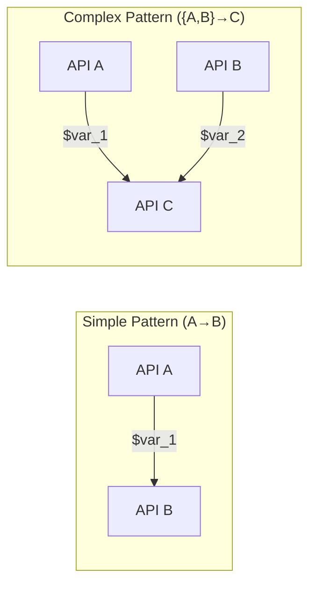
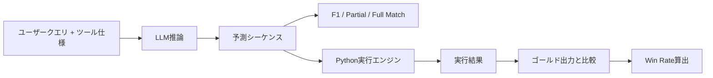

本記事は [https://arxiv.org/abs/2409.03797](https://arxiv.org/abs/2409.03797) の解説記事です。

## 論文概要（Abstract）

NESTFULは、LLMのツール呼び出し能力をネスト構造（あるAPI呼び出しの出力を別のAPI呼び出しの入力として使用する連鎖的な関数呼び出し）に対して評価するベンチマークである。著者らは数学的推論ドメインとコーディングドメインから1,800件以上の実行可能なテストケースを構築し、19モデルを評価している。最良モデルであるGPT-4oでさえ完全一致精度（Full Sequence Match Accuracy）は28%にとどまり、Win Rateは60%であると報告されている。この結果は、単発のFunction Callingでは高精度を達成するモデルであっても、ネスト構造の関数呼び出しでは依然として大きな改善余地があることを示している。

この記事は [Zenn記事: Function Calling並列実行入門：3社APIでエージェントを構築する](https://zenn.dev/0h_n0/articles/57c4107d4591b1) の深掘りです。Zenn記事ではOpenAI・Claude・Geminiの3社APIにおける並列ツール呼び出しとエージェントループの実装方法を解説していますが、並列呼び出しの「先」にある課題としてネスト呼び出し（あるAPIの出力を別のAPIの入力に使う）の困難さがあります。NESTFULはこの課題を定量的に評価するベンチマークであり、実務で複雑なツールチェインを設計する際の参考指標を提供します。

## 情報源

- **arXiv ID**: 2409.03797
- **URL**: [https://arxiv.org/abs/2409.03797](https://arxiv.org/abs/2409.03797)
- **著者**: Kinjal Basu, Ibrahim Abdelaziz, Kiran Kate et al.（IBM Research）
- **発表年**: 2024（初版）、EMNLP 2025採択
- **分野**: cs.AI, cs.CL
- **コード・データセット**: [https://github.com/IBM/NESTFUL](https://github.com/IBM/NESTFUL)（Apache 2.0ライセンス）

## 背景と動機（Background & Motivation）

### 単発Function Calling評価の限界

LLMのFunction Calling（ツール呼び出し）能力を評価するベンチマークは複数存在する。APIBench（Patil et al., 2023）やBFCL（Berkeley Function Calling Leaderboard; Yan et al., 2024）は、モデルが適切な関数名と引数を生成できるかを測定する代表的なベンチマークである。しかし、これらのベンチマークは主に**単一のAPI呼び出し**や**独立した並列呼び出し**を対象としており、実世界で頻繁に発生する**依存関係のある呼び出し列**を十分に評価していない。

### 実世界におけるネスト呼び出しの重要性

実運用のエージェントシステムでは、1つのタスクを完了するために複数のAPI呼び出しを連鎖させる必要がある。例えば「ユーザーの住所から最寄り駅を検索し、その最寄り駅の時刻表を取得する」というタスクでは、`get_nearest_station(address)` の出力を `get_timetable(station_id)` の入力に渡す必要がある。この種のネスト構造では、前段の呼び出し結果を正しく変数に格納し、後段の引数として正しく参照する能力が求められる。著者らは、既存ベンチマークの多くがこのデータ依存性を持つシーケンスを少数しか含まないこと（例: ToolBenchのネストサンプルは205件）を指摘し、大規模かつ実行検証可能なベンチマークの必要性を主張している。

### NESTFULの位置づけ

既存の関連ベンチマークであるNesTools（Han et al., 2024）は完全に合成的に生成されたデータで平均3.04回の呼び出しシーケンスを含むが、NESTFULは実在するベンチマーク（MathQAおよびStarCoder2-Instruct）から構築され、平均呼び出し回数が4.36回とより長いシーケンスを含む。さらに全テストケースに対してPythonによる実行環境を整備し、実行ベースの正確性検証を可能にしている点が特徴である。

## 主要な貢献（Key Contributions）

著者らは以下の3点を主要な貢献として挙げている。

- **大規模ネスト呼び出しベンチマークの構築**: 数学的推論（1,415件、40ツール）とコーディング（446件、881以上のユニークツール）の2ドメインから、合計1,800件以上の実行可能なネストAPI呼び出しシーケンスを構築した
- **ネスト構造の体系的分類**: DAG（有向非巡回グラフ）に基づくネストパターンの分類体系を導入し、Simple Pattern（$A \to B$）やComplex Pattern（$\{A, B\} \to C$）などのパターンごとにLLM性能を分析する枠組みを提供した
- **19モデルの包括的評価**: 1Bから685Bパラメータまでの19モデルを4つの評価指標で比較し、モデルサイズよりも指示追従能力やin-context learning能力がネスト呼び出し性能に寄与することを示した

## 技術的詳細（Technical Details）

### ネスト呼び出しの形式的定義

NESTFULでは、ネスト呼び出しシーケンスをDAGとして定式化している。各ノードは1つのAPI呼び出しを表し、エッジはデータ依存関係（あるAPI呼び出しの出力が別の呼び出しの入力に渡されること）を表す。

API呼び出しシーケンス $S = [c_1, c_2, \ldots, c_n]$ において、呼び出し $c_i$ の出力を変数 $\text{\$var}_i$ に格納し、後続の呼び出し $c_j$（$j > i$）の引数として $\text{\$var}_i$ を参照する場合、$c_i \to c_j$ というデータ依存エッジが存在する。

著者らは以下の指標でネスト構造の複雑さを特徴づけている。

- **ネスト深さ（Nesting Depth）**: DAGにおける最長パスの長さ。データ依存の連鎖がどれだけ深くなるかを表す
- **総データ依存数（Total Data Dependencies）**: DAGのエッジ総数。シーケンス全体の依存関係の密度を表す

### ネストパターンの分類

著者らはDAGの構造に基づき、以下のパターンを分類している。



- **Simple Pattern（$A \to B$）**: 1つのAPIの出力が別の1つのAPIの入力に渡される最も基本的なパターン
- **Complex Pattern（$\{A, B\} \to C$）**: 複数のAPIの出力が1つのAPIの入力に集約されるパターン。呼び出し $c_j$ が複数の先行呼び出し $c_i, c_k$ の出力を引数として受け取る

Complex Patternでは、モデルは複数の先行呼び出しの出力変数を正しく区別して参照する必要があるため、Simple Patternと比較して難易度が高い。

### データセット構築

#### 数学的推論ドメイン

MathQAベンチマークのテストセットから構築されている。MathQAの各問題には "annotated formula" が付与されており、著者らはこれを関数呼び出しシーケンスにパースしている。40個のツール仕様を手動で定義し、各ツールに対応するPython実装を作成した。実行ベースのフィルタリングにより、生成されたシーケンスが正解を再現するサンプルのみを採用し、最終的に1,415件のサンプルを得ている。平均呼び出し回数は5.1回であり、比較的深いネスト構造を含む。

#### コーディングドメイン

StarCoder2-Instructデータセット（50,000のPython関数）をベースとしている。Mixtral-8x22Bを用いてパラメータの型ヒントを推論し、構文エラーや実行不可の関数をフィルタリングした。DiGiTフレームワークによる合成データ生成を適用し、Mixtral-8x22Bを教師モデルとして10個のシード例から生成している。最終的に446件のサンプル（881以上のユニークツール）を得ており、平均呼び出し回数は2.1回である。

### 評価メトリクスの定義

NESTFULでは以下の4つのメトリクスを定義している。

$$
\text{F1}_{\text{func}} = \frac{2 \cdot P_{\text{func}} \cdot R_{\text{func}}}{P_{\text{func}} + R_{\text{func}}}
$$

ここで $P_{\text{func}}$ と $R_{\text{func}}$ はそれぞれ関数名の適合率と再現率である。同様にパラメータ名に対する $\text{F1}_{\text{param}}$ も定義されている。

- **F1 Score（関数名/パラメータ名）**: 予測されたAPI呼び出しの関数名・パラメータ名がゴールドシーケンスとどの程度一致するかを測定する
- **Partial Sequence Matching（部分一致精度）**: 予測されたAPIの引数値ペアがゴールドシーケンスと一致する割合。個々の呼び出しレベルでの正確性を評価する
- **Full Sequence Matching（完全一致精度）**: シーケンス全体の関数名と引数値ペアがゴールドと完全に一致するかを判定する。1つでも不一致があれば0となる厳格な指標
- **Win Rate（勝率）**: 予測されたAPIシーケンスを実際にPythonで実行し、出力がゴールドの期待出力と完全一致するかを判定する。実行ベースの最終指標

Win RateとFull Sequence Matchingの違いは重要である。異なる関数呼び出しシーケンスでも最終的に同じ出力を生成するケースがあるため、Win Rateは関数名の一致を要求せず、実行結果のみで判定する。

### 実行パイプライン



LLMに対してユーザークエリとツール仕様（関数名、引数名、型、説明）を入力し、ネストされたAPI呼び出しシーケンスを生成させる。生成されたシーケンスはまずテキストベースのメトリクス（F1、Partial/Full Match）で評価され、さらにPython実行エンジンで実行してWin Rateが算出される。

## 実装のポイント（Implementation）

### NESTFULで自社ツールのネスト呼び出し能力を評価する

NESTFULのデータスキーマと評価手法は、自社のAPI群に対するLLMのネスト呼び出し能力評価にも応用できる。以下に、NESTFULの評価パイプラインを模したPython実装例を示す。

```python
"""NESTFULスタイルのネストAPI呼び出し評価パイプライン。

LLMが生成したAPI呼び出しシーケンスを実行し、
ゴールド出力との一致を検証する。
"""

from dataclasses import dataclass, field
from typing import Any


@dataclass(frozen=True)
class APICall:
    """単一のAPI呼び出しを表すデータクラス。

    Attributes:
        function_name: 呼び出す関数名
        arguments: 引数の辞書。値に "$var_N" を含む場合、
                   先行呼び出しの出力を参照するネスト呼び出しを意味する
        output_var: この呼び出しの出力を格納する変数名
    """

    function_name: str
    arguments: dict[str, Any]
    output_var: str


@dataclass
class NestfulEvaluator:
    """ネストAPI呼び出しシーケンスの評価器。

    Attributes:
        tool_registry: 関数名からCallableへのマッピング
    """

    tool_registry: dict[str, Any] = field(default_factory=dict)

    def execute_sequence(
        self,
        sequence: list[APICall],
    ) -> dict[str, Any]:
        """API呼び出しシーケンスを実行し、各ステップの出力を記録する。

        Args:
            sequence: 実行するAPI呼び出しのリスト（依存順にソート済み）

        Returns:
            変数名から実行結果へのマッピング

        Raises:
            KeyError: 未登録の関数名が指定された場合
            ValueError: 未解決の変数参照が存在する場合
        """
        env: dict[str, Any] = {}

        for call in sequence:
            resolved_args = self._resolve_variables(call.arguments, env)
            func = self.tool_registry[call.function_name]
            result = func(**resolved_args)
            env[call.output_var] = result

        return env

    def _resolve_variables(
        self,
        arguments: dict[str, Any],
        env: dict[str, Any],
    ) -> dict[str, Any]:
        """引数中の変数参照（$var_N）を実際の値に解決する。

        Args:
            arguments: 解決前の引数辞書
            env: 変数名から値へのマッピング

        Returns:
            変数参照が解決された引数辞書
        """
        resolved: dict[str, Any] = {}
        for key, value in arguments.items():
            if isinstance(value, str) and value.startswith("$"):
                if value not in env:
                    msg = f"未解決の変数参照: {value}"
                    raise ValueError(msg)
                resolved[key] = env[value]
            else:
                resolved[key] = value
        return resolved

    def compute_win_rate(
        self,
        predicted_env: dict[str, Any],
        gold_output: Any,
        final_var: str,
    ) -> bool:
        """Win Rateの判定（実行結果とゴールド出力の完全一致）。

        Args:
            predicted_env: 予測シーケンスの実行結果
            gold_output: 期待される最終出力
            final_var: 最終出力を格納する変数名

        Returns:
            実行結果がゴールド出力と一致する場合True
        """
        if final_var not in predicted_env:
            return False
        return predicted_env[final_var] == gold_output
```

このように、NESTFULの評価パイプラインの核は「変数参照の解決」と「実行ベースの検証」にある。自社のツール群でも同様のスキーマを定義し、LLMが生成するシーケンスの正確性を段階的（F1 → Partial → Full → Win Rate）に評価することで、ネスト呼び出し性能のボトルネックを特定できる。

## 実験結果（Results）

### モデル別性能比較

著者らは1Bから685Bパラメータの19モデルをOne-Shot ICL設定で評価している。以下にTable 2から主要モデルの結果を抜粋する。

| モデル | パラメータ | F1（関数名） | F1（パラメータ） | 部分一致 | 完全一致 | Win Rate |
|--------|-----------|-------------|----------------|---------|---------|----------|
| GPT-4o (2024-08-06) | 非公開 | 0.73 | 0.41 | 0.38 | **0.28** | **0.59** |
| DeepSeek-V3 | 685B(MoE) | 0.69 | 0.36 | 0.27 | 0.09 | 0.43 |
| Llama-3.1-8B-Instruct | 8B | 0.64 | 0.19 | 0.17 | 0.06 | 0.06 |
| Granite-20B-FC | 20B | 0.64 | 0.20 | 0.17 | 0.02 | 0.05 |
| Hammer2.0-7b | 7B | 0.56 | 0.24 | 0.21 | 0.07 | 0.16 |
| xLAM-8x22b-fc-r | 8x22B(MoE) | 0.53 | 0.21 | 0.22 | 0.12 | 0.03 |
| Mixtral-8x22B-Instruct | 8x22B(MoE) | 0.49 | 0.21 | 0.17 | 0.06 | 0.07 |
| Llama-3.1-70B-Instruct | 70B | 0.41 | 0.19 | 0.15 | 0.04 | 0.09 |
| Llama-3.1-405B-fp8 | 405B | 0.41 | 0.14 | 0.08 | 0.03 | 0.10 |

### 結果の分析

著者らの報告に基づく主要な知見は以下の通りである。

**モデルサイズと性能の非線形関係**: Llama-3.1シリーズにおいて、8B（Win Rate 0.06）→ 70B（0.09）→ 405B（0.10）と、パラメータ数を50倍に増やしてもWin Rateはほぼ横ばいである。一方、GPT-4oはWin Rate 0.59と突出している。著者らは、モデルサイズよりも指示追従能力とin-context learning能力がネスト呼び出し性能に主に寄与すると分析している。

**ネスト深さと性能の関係（Figure 6a）**: ネスト深さが1の場合と比較して、深さ2以上でWin Rateが急激に低下することが報告されている。GPT-4oでさえ深さ3以上のシーケンスでは大幅な精度低下を示しており、長い依存チェインの維持が現行モデルにとって困難であることを示している。

**ネストパターンと性能の関係（Figure 6c）**: Complex Pattern（$\{A, B\} \to C$）のWin Rateは、Simple Pattern（$A \to B$）と比較して顕著に低い。複数の変数を同時に管理し正しく参照することが、現行LLMにとって依然として大きな課題である。

### Three-Shot ICLおよびReActエージェント

著者らはThree-Shot ICL設定でも評価を実施している。DeepSeek-V3はThree-Shot設定で完全一致精度0.29、Win Rate 0.60を達成し、GPT-4oのOne-Shot結果（0.28、0.59）とほぼ同等の性能に到達している。

ReActエージェントフレームワーク（Yao et al., 2022）との比較では、Mixtral-8x22BがDirect Prompting（Win Rate 0.07）からReAct（0.30）へと大幅に改善する一方、DeepSeek-V3はDirect（0.43）からReAct（0.46）へと微増にとどまっている。著者らは、ベースモデルの能力が低い場合にReActフレームワークの恩恵が大きいと分析している。

## 実運用への応用（Practical Applications）

### ネストFunction Callingの設計指針

NESTFULの実験結果から、実運用のエージェントシステムを設計する際に以下の指針を導くことができる。

**ネスト深さの制限**: 深さ2以上でWin Rateが急落するため、1つのLLM呼び出しで生成させるネストは深さ2程度に抑え、それ以上の深さが必要な場合はマルチターン対話で段階的に実行する方が信頼性が高い。Zenn記事で解説されているエージェントループパターンは、このアプローチに合致する。

**Complex Patternの回避**: 複数のAPIの出力を1つのAPIに集約する$\{A, B\} \to C$パターンは精度が低いため、可能な限りSimple Pattern（$A \to B$）に分解する。例えば、2つの検索結果を統合する処理は、LLMではなくアプリケーションコードで実装することが推奨される。

### エラー伝播の考慮

ネスト呼び出しでは前段のエラーが後段に伝播するカスケード障害が発生しうる。NESTFULの結果が示すように、完全一致精度が28%ということは72%のケースで少なくとも1つの呼び出しが失敗しており、その失敗が後続の呼び出し全体を無効にする。実運用では各ステップの出力検証と、失敗時のフォールバック戦略（リトライ、代替ツールの使用、ユーザーへの確認）を組み込むことが重要である。

### 評価パイプラインの導入

自社のツール群に対してNESTFULスタイルの評価パイプラインを構築し、モデル選定やプロンプト改善の定量的な判断基準とすることが有効である。特にWin Rate（実行ベースの検証）をCI/CDに組み込むことで、モデルバージョンアップやプロンプト変更がネスト呼び出し性能に与える影響を継続的に監視できる。

## 関連研究（Related Work）

- **BFCL（Berkeley Function Calling Leaderboard）**: Yan et al. (2024) による包括的なFunction Calling評価ベンチマーク。単発呼び出し、並列呼び出し、マルチターンを含むが、ネスト構造のテストケースは限定的である。NESTFULはBFCLの「ネスト」部分を大幅に拡張した位置づけにある
- **ToolBench**: Xu et al. (2023) によるツール利用ベンチマーク。16,000以上のAPIを含むが、ネストサンプルは205件にとどまる。NESTFULは1,800件以上のネストサンプルを提供し、実行検証も可能にしている
- **NesTools**: Han et al. (2024) によるネスト呼び出し特化ベンチマーク。完全合成データで平均3.04回のシーケンス長であるのに対し、NESTFULは実データベースで平均4.36回とより長いシーケンスを含む
- **API-BLEND**: Basu et al. (2024) による複数ベンチマーク統合フレームワーク。著者グループが重複しており、NESTFULはAPI-BLENDのネスト呼び出し部分を独立・拡張したものと位置づけられる

## まとめと今後の展望

NESTFULは、LLMのネストAPI呼び出し能力を実行ベースで評価する大規模ベンチマークとして、既存の単発Function Calling評価の盲点を明らかにした。GPT-4oでさえ完全一致精度28%にとどまるという結果は、現行LLMの関数呼び出し能力が「1回のAPI呼び出しは正確だが、依存関係のある連鎖は苦手」という段階にあることを定量的に示している。

今後の研究方向として、著者らはファインチューニングによるネスト呼び出し精度の向上、ReActエージェントとの組み合わせによる段階的解決、およびより多様なドメイン（Web API、データベース操作等）への拡張を示唆している。実務においては、NESTFULのようなベンチマークでモデルを事前評価し、ネスト深さやパターンの制約をシステム設計に反映させることが、信頼性の高いエージェントシステム構築への鍵となる。

## 参考文献

- **arXiv**: [https://arxiv.org/abs/2409.03797](https://arxiv.org/abs/2409.03797)
- **Code / Dataset**: [https://github.com/IBM/NESTFUL](https://github.com/IBM/NESTFUL)
- **Related Zenn article**: [https://zenn.dev/0h_n0/articles/57c4107d4591b1](https://zenn.dev/0h_n0/articles/57c4107d4591b1)
- Patil, S. G. et al. (2023). Gorilla: Large Language Model Connected with Massive APIs. arXiv:2305.15334
- Yan, F. et al. (2024). Berkeley Function Calling Leaderboard. arXiv:2402.15671
- Xu, Q. et al. (2023). On the Tool Manipulation Capability of Open-source Large Language Models. arXiv:2305.16504
- Han, J. et al. (2024). NesTools: A Dataset for Evaluating Nested Tool Learning Abilities of Large Language Models. arXiv:2403.02530
- Basu, K. et al. (2024). API-BLEND: A Comprehensive Corpora for Training and Benchmarking API LLMs. arXiv:2402.15491
- Yao, S. et al. (2022). ReAct: Synergizing Reasoning and Acting in Language Models. arXiv:2210.03629
