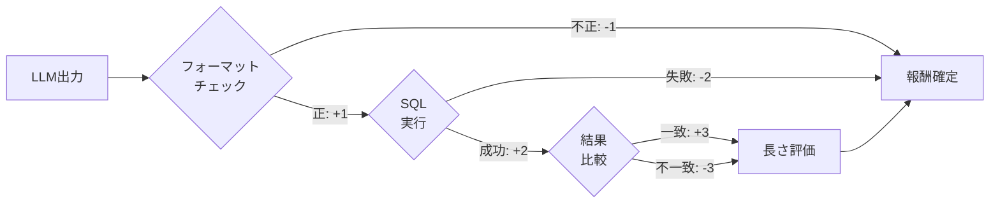

本記事は [SQL-R1 (arXiv:2504.08600)](https://arxiv.org/abs/2504.08600) の解説記事です。NeurIPS 2025に採択された論文である。

## 論文概要（Abstract）

SQL-R1は、自然言語からSQL生成（NL2SQL）における推論能力を強化学習で獲得させるフレームワークである。著者らは、SynSQL-2.5Mの大規模合成データを用いたSFTコールドスタートと、フォーマット・実行・結果・長さの4段階報酬を用いたGRPO訓練により、7BモデルでSpider開発セット87.6%、BIRDで67.1%の実行正解率を達成したと報告している。

この記事は [Zenn記事: TRL GRPO×RLVRでQwen3-8Bを社内DB向けText-to-SQLに特化する](https://zenn.dev/0h_n0/articles/2a3ebad6f46b19) の深掘りです。

## 情報源

- **arXiv ID**: 2504.08600
- **URL**: [https://arxiv.org/abs/2504.08600](https://arxiv.org/abs/2504.08600)
- **著者**: Peixian Ma, Xialie Zhuang, Chengjin Xu, Xuhui Jiang, Ran Chen, Jian Guo
- **発表年**: 2025（NeurIPS 2025採択）
- **分野**: cs.CL, cs.AI

## 背景と動機（Background & Motivation）

従来のText-to-SQLアプローチはSFT（教師あり微調整）に依存しており、複雑なマルチテーブルJOINやネストクエリに対する推論能力が限定的であった。著者らは、DeepSeek-R1等の推論強化モデルの成功を踏まえ、RL訓練がNL2SQLにおいても推論能力を向上させるかを検証した。特に、RL訓練の成功に不可欠な「どのようなコールドスタートデータが効果的か」「どのような報酬設計が有効か」という2つの問いに対して体系的な実験を行っている。

## 主要な貢献（Key Contributions）

- **貢献1**: NL2SQLに特化した4段階の階層的報酬関数（フォーマット→実行→結果→長さ）を設計し、各コンポーネントの効果を個別に検証
- **貢献2**: SynSQL-2.5M（250万サンプル）による大規模合成データSFTコールドスタートの有効性を実証。データの量と起源がRL訓練の成功に決定的であることを示した
- **貢献3**: 3Bの小規模モデルがRL訓練から最も大きな恩恵を受けることを発見し、コスト効率の高いデプロイの可能性を示唆

## 技術的詳細（Technical Details）

### 4段階報酬関数

SQL-R1の報酬関数は4つのコンポーネントから構成される。各段階はSQL生成の品質を粒度を変えて評価し、累積的な学習信号を提供する。

$$
R = S_f + S_e + S_r + S_l
$$

| コンポーネント | 正報酬 | 負報酬 | 役割 |
|-------------|--------|--------|------|
| フォーマット報酬 $S_f$ | +1（正しいタグ形式） | -1（不正形式） | 出力構造の学習 |
| 実行報酬 $S_e$ | +2（実行成功） | -2（実行エラー） | 構文的正しさ |
| 結果報酬 $S_r$ | +3（結果一致） | -3（結果不一致） | 意味的正しさ |
| 長さ報酬 $S_l$ | 可変 | 可変 | 冗長性の抑制 |

著者らは、各コンポーネントの除去実験により、いずれか1つを削除すると精度が0.7〜2.7ポイント低下することを確認している。特に結果報酬の除去は最大の精度低下をもたらす。



### GRPO訓練設定

```python
# SQL-R1のRL訓練設定（論文より再構成）
rl_config = {
    "base_model": "SFT checkpoint (SynSQL-200K)",
    "rl_data": "SynSQL-Complex-5K",
    "learning_rate": 3e-7,
    "actor_rollouts": 8,
    "max_response_length": 2048,
    "inference_temperature": 0.8,
    "inference_candidates": 8,
}
```

### 合成データ戦略

著者らのデータ戦略は2段階で構成される：

**SFT段階**: SynSQL-200K（200Kサンプル、難易度均等分布）を用いたコールドスタート。著者らは、SynSQL-2.5M全体を使用した場合と200Kサブセットを使用した場合を比較し、大規模データによるSFTがRL訓練のより良い初期点を提供すると報告している。

**RL段階**: SynSQL-Complex-5K（5Kサンプル、複雑クエリに特化）を用いたGRPO訓練。RL段階では学習データの質（複雑性）が量よりも重要であることが示されている。

この「大規模SFTコールドスタート→小規模高品質RLデータ」というパイプラインは、Zenn記事で解説されている「SFTウォームアップ→GRPO」パイプラインと同一の設計思想に基づいている。

### コールドスタートの重要性

著者らは、コールドスタート（SFT初期化）の効果がデータの起源と量に依存することを実験的に示している。SynSQL-2.5Mで初期化したモデルは、200Kで初期化したモデルよりもRL訓練後に高い精度を達成した。これは、大規模合成データがSQL生成の基礎パターンをより広くカバーするためである。社内DBに適用する際は、対象スキーマに基づく十分な量の合成データを生成し、SFT初期化の品質を確保することが重要である。

## 実装のポイント（Implementation）

**モデルサイズの選択**: 著者らは3B、7B、14Bモデルで実験を行い、3BモデルがRL訓練から最も大きな相対的改善を示したと報告している。これは、コスト効率を重視する社内デプロイにおいて、小規模モデル＋RL訓練が有効な選択肢であることを示唆する。

**推論時のアンサンブル**: 推論時に8候補を生成し、温度0.8でサンプリングする。多数決によりロバストな結果を得ている。

**コード公開**: GitHubでコードが公開されており（CC BY-SA 4.0ライセンス）、再現実験が可能である。

## 実験結果（Results）

### ベンチマーク結果（論文より）

| データセット | 7Bモデル | 14Bモデル |
|------------|---------|----------|
| Spider Dev | 87.6% | — |
| Spider Test | 88.7% | — |
| BIRD Dev | 66.6% | 67.1% |

### SFTとRLの比較

著者らは、SFTのみとSFT+RLの比較を行い、RL訓練による追加的な精度向上を確認している。特に複雑なクエリ（マルチテーブルJOIN、ネストサブクエリ）において、RL訓練の効果が顕著であると報告されている。3BモデルではSFTからRLへの相対的な改善幅が最大であり、小規模モデルほどRL訓練の恩恵が大きいことが確認されている。

## Production Deployment Guide

### AWS実装パターン（コスト最適化重視）

| 規模 | 月間リクエスト | 推奨構成 | 月額コスト | 主要サービス |
|------|--------------|---------|-----------|------------|
| **Small** | ~3,000 | Serverless | $50-150 | Lambda + Bedrock + DynamoDB |
| **Medium** | ~30,000 | Hybrid | $300-800 | ECS Fargate + SageMaker Endpoint |
| **Large** | 300,000+ | Container | $2,000-5,000 | EKS + vLLM + GPU Spot |

**コスト試算の注意事項**: 上記は2026年10月時点のAWS ap-northeast-1料金に基づく概算値である。

**Small構成**（$50-150/月）:
- Lambda: 1GB RAM, 60秒タイムアウト ($25/月)
- Bedrock: Claude 3.5 Haiku ($80/月)
- DynamoDB: On-Demand ($10/月)

**コスト削減テクニック**:
- Spot Instances活用（GPU推論で最大90%削減）
- SageMaker Inferentia2チップ活用（推論コスト70%削減）
- Prompt Caching有効化（30-90%削減）
- 3Bモデル選択による推論コスト削減（SQL-R1の知見：小規模モデルでもRL後に競争力ある精度）

### Terraformインフラコード

```hcl
resource "aws_sagemaker_endpoint_configuration" "sql_model" {
  name = "text-to-sql-endpoint"
  production_variants {
    variant_name           = "primary"
    model_name             = aws_sagemaker_model.sql_r1.name
    initial_instance_count = 1
    instance_type          = "ml.g5.xlarge"
  }
}

resource "aws_cloudwatch_metric_alarm" "sql_latency" {
  alarm_name          = "sql-inference-latency"
  comparison_operator = "GreaterThanThreshold"
  evaluation_periods  = 2
  metric_name         = "ModelLatency"
  namespace           = "AWS/SageMaker"
  period              = 300
  statistic           = "Average"
  threshold           = 5000
  alarm_description   = "SQL推論レイテンシ異常"
}
```

### コスト最適化チェックリスト

- [ ] 3Bモデルでの精度検証（SQL-R1の知見：小規模モデルでRL効果大）
- [ ] Spot Instances優先（GPU推論で最大90%削減）
- [ ] SageMaker Serverless Inference検討（低トラフィック時）
- [ ] Prompt Caching有効化（30-90%削減）
- [ ] バッチ推論活用（50%削減）
- [ ] AWS Budgets設定（月額上限アラート）
- [ ] CloudWatch アラーム（レイテンシ・エラー率）
- [ ] Cost Anomaly Detection有効化

## 実運用への応用（Practical Applications）

SQL-R1の知見を社内DB向けに適用する際の主要ポイントを整理する。

**コールドスタートデータの重要性**: 社内DBに適用する際は、対象スキーマに基づく十分な量の合成データ（数千〜数万サンプル）を生成し、SFT初期化の品質を確保すべきである。SQL-R1ではSynSQL-2.5Mという大規模データを使用しているが、社内DBの場合はドメイン特化のためより少ないサンプルでも効果が期待できる。

**小規模モデルの活用**: 3Bモデルがrl訓練から最大の恩恵を受けるという知見は、推論コストを抑えつつ精度を確保したい社内デプロイにおいて有用である。

## 関連研究（Related Work）

- **Reasoning-SQL** (arXiv 2503.23157): 6種の部分報酬を使用。SQL-R1の4段階報酬と比較して、LLM-as-Judgeやスキーマリンキング報酬などより多様な報酬源を採用
- **ReViSQL** (arXiv 2603.20004): データ品質に焦点を当て、偽陽性問題を解決。SQL-R1の合成データアプローチとは対照的に、既存データのクリーニングを重視
- **CHASE-SQL** (ICLR 2025): 選好最適化ベースの候補選択。RL訓練ではなく推論時の最適化に焦点

## まとめと今後の展望

SQL-R1は、大規模合成データによるSFTコールドスタートと4段階階層報酬のGRPO訓練を組み合わせることで、NeurIPS 2025に採択される水準のText-to-SQL性能を達成した。特に3Bモデルでもrl訓練により競争力ある精度を獲得できるという発見は、コスト効率の高い社内デプロイを計画する際に重要な知見である。Zenn記事のSFTウォームアップ→GRPOパイプラインに、SQL-R1のデータ戦略と報酬設計を組み合わせることで、より効果的な社内DB特化モデルの構築が期待できる。

## 参考文献

- **arXiv**: [https://arxiv.org/abs/2504.08600](https://arxiv.org/abs/2504.08600)
- **Code**: [GitHub](https://github.com/peixianma/SQL-R1)（CC BY-SA 4.0）
- **Related Zenn article**: [https://zenn.dev/0h_n0/articles/2a3ebad6f46b19](https://zenn.dev/0h_n0/articles/2a3ebad6f46b19)

---

:::message
この記事はAI（Claude Code）により自動生成されました。内容の正確性については複数の情報源で検証していますが、実際の利用時は公式ドキュメントもご確認ください。
:::
