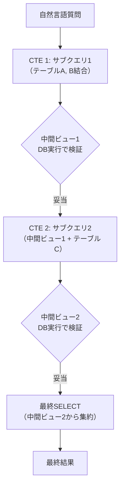

本記事は [Reward-SQL (arXiv:2505.04671)](https://arxiv.org/abs/2505.04671) の解説記事です。

## 論文概要（Abstract）

Reward-SQLは、Common Table Expression（CTE）ベースの分割統治フレームワーク「CoCTE」と、エントロピー加重プロセス報酬モデル（PRM）を組み合わせた3段階手法である。著者らは、8BモデルでBIRDベンチマーク70.3%（PRM@32）を達成し、Qwen3-8Bベースラインからの相対誤差削減率34.9%、ハルシネーションエラーを95.8%削減（6.26% → 0.26%）したと報告している。

この記事は [Zenn記事: TRL GRPO×RLVRでQwen3-8Bを社内DB向けText-to-SQLに特化する](https://zenn.dev/0h_n0/articles/2a3ebad6f46b19) の深掘りです。

## 情報源

- **arXiv ID**: 2505.04671
- **URL**: [https://arxiv.org/abs/2505.04671](https://arxiv.org/abs/2505.04671)
- **著者**: Yuxin Zhang, Meihao Fan, Ju Fan, Mingyang Yi, Yuyu Luo, Guoliang Li, Bin Wu, Wenchao Zhou
- **発表年**: 2025（v3: 2026年6月更新）
- **分野**: cs.CL, cs.LG

## 背景と動機（Background & Motivation）

既存のRL系Text-to-SQL手法は、生成されたSQL全体の実行結果のみで報酬を計算する「結果報酬（Outcome Reward）」に依存している。この設計には2つの根本的な問題がある。第一に、複雑なSQLは多段階の推論を必要とするが、最終結果のみの報酬では中間ステップの正否が区別できず、信用割当問題（credit assignment problem）が発生する。第二に、結果報酬のみでは、モデルは正しい推論パスを特定できず、偶然の正解（偽陽性）も正の報酬で強化されてしまう。Reward-SQLは、CTEベースの分割統治で中間検証点を設け、プロセス報酬で各ステップを個別に評価することでこれらの問題を解決する。

## 主要な貢献（Key Contributions）

- **貢献1**: CoCTEフレームワークにより、複雑なSQLをCTE単位のサブタスクに分割し、各中間ビューの実行結果をデータベースで検証する仕組みを構築
- **貢献2**: 軌跡スコアモデルとエントロピー逆加重を組み合わせたプロセス報酬モデル（PRM）により、情報量の大きいステップに重点的に報酬を配分
- **貢献3**: ハルシネーションエラー（スキーマに存在しないテーブル・カラムの参照）を95.8%削減

## 技術的詳細（Technical Details）

### CoCTEアーキテクチャ

CoCTEは、複雑なSQLクエリをCommon Table Expression（CTE）の連鎖として生成する。各CTEは独立して実行可能な中間ビューを定義し、最終的にそれらを組み合わせて結果を得る。



従来の手法がSQLを一括生成するのに対し、CoCTEは各CTEの実行結果を中間検証点として利用する。これにより、「どのステップで誤りが発生したか」を特定でき、プロセス報酬の基盤となる。

### プロセス報酬モデル（PRM）

PRMは2つのコンポーネントを組み合わせている：

**軌跡スコアモデル $R_\phi$**: Monte Carlo Tree Search（MCTS）ラベルを用いて訓練される。各中間ステップの正しさを推定し、ステップ単位のスコアを出力する。

**エントロピー逆加重 $I_H$**: モデルの不確実性が低い（エントロピーが小さい）ステップにより高い重みを与える。これは、モデルが「確信を持って間違えた」ステップに重点的にフィードバックを与える設計意図である。

統合的なプロセス報酬は以下のように定義される：

$$
R_{\text{proc}}(T_{\leq d}) = \sum_{i=1}^{d} I_H(t_i) \cdot R_\phi(t_i)
$$

ここで、
- $T_{\leq d}$: ステップ$d$までの軌跡
- $t_i$: $i$番目のステップ（CTE）
- $I_H(t_i)$: ステップ$i$のエントロピー逆加重
- $R_\phi(t_i)$: ステップ$i$の軌跡スコア

結果報酬のみ（Outcome Reward）と比較して、PRMは訓練の安定性を向上させる。著者らは、結果報酬のみの分散が$\pm 0.76$であるのに対し、PRM導入後は$\pm 0.58$に改善されたと報告している。

### 3段階手法

Reward-SQLは以下の3段階で構成される：

**Stage 1 - モデル初期化（SFT）**: CoCTEフォーマットでのSQL生成能力を教師あり学習で獲得させる。

**Stage 2 - プロセス報酬設計**: MCTSラベルによる軌跡スコアモデルの訓練と、エントロピー加重の計算。

**Stage 3 - プロセス報酬RL + 推論ガイド**: PRMを用いたGRPO訓練と、推論時のPRMによる候補選択（PRM@K）。

### ハルシネーション削減メカニズム

CoCTEにより各中間ビューがDBで検証されるため、存在しないテーブル・カラムを参照するCTEは即座に実行エラーとなる。これが自動的なハルシネーション検出として機能し、エラー率6.26% → 0.26%の劇的な削減を実現している。

## 実装のポイント（Implementation）

**CTE生成のプロンプト設計**: モデルにCTE形式での出力を強制するために、SFT段階でCTE形式の訓練データを十分に用意する必要がある。著者らは、既存のSQL回答をCTE形式に自動変換するスクリプトを使用している。

**PRM@K推論**: 推論時にK個の候補を生成し、PRMでスコアリングして最高スコアの候補を選択する。K=32で最高精度（70.3%）を達成しているが、K=8でも67.5%と十分な精度が得られる。推論コストとのトレードオフで選択する。

**中間ビュー検証のオーバーヘッド**: 各CTEをDBで実行するため、推論時にDB接続が必要となる。バッチ推論時は接続プーリングの設計が重要である。

## 実験結果（Results）

### ベンチマーク結果（論文より）

| 手法 | BIRD EX (%) | 備考 |
|------|------------|------|
| Qwen3-8B ベースライン | — | 参照点 |
| Reward-SQL (greedy) | 65.9 | 単一候補 |
| Reward-SQL (PRM@32) | **70.3** | 32候補からPRM選択 |
| Spider (PRM) | 85.4 | テスト時スケーリング |

### エラー分析（論文より）

| エラータイプ | ベースライン | Reward-SQL | 削減率 |
|-------------|------------|-----------|--------|
| ハルシネーション | 6.26% | 0.26% | **95.8%** |
| スキーマリンキング | 高 | 大幅削減 | — |

### 訓練安定性

| 報酬タイプ | 精度分散 |
|-----------|---------|
| 結果報酬のみ | $\pm 0.76$ |
| PRM（プロセス報酬） | $\pm 0.58$ |

PRMにより訓練の安定性が向上していることが確認されている。

## 実運用への応用（Practical Applications）

Reward-SQLの知見は、社内DB向けパイプラインに以下の形で応用可能である。

**CTE分割の導入**: 社内DBの複雑なクエリ（複数テーブルJOIN、サブクエリ、集約の組み合わせ）に対して、CTE形式での生成を導入することで、中間結果の検証が可能になる。これはZenn記事の多層報酬に加えて、ステップレベルの検証を追加する位置づけとなる。

**ハルシネーション対策**: 社内DBではスキーマの正確な参照が特に重要である。CoCTEによる中間検証は、テーブル名・カラム名の誤参照を自動検出する効果的な手段となる。ReViSQLの偽陽性率32.8%の問題に対しても、CTE中間検証が補完的な対策となる。

**PRM@K推論のコスト管理**: 推論時にK=32候補を生成するとコストが32倍になる。社内デプロイではK=4〜8程度に抑え、精度とコストのバランスを取ることが現実的である。

## Production Deployment Guide

### AWS実装パターン（コスト最適化重視）

| 規模 | 月間リクエスト | 推奨構成 | 月額コスト | 主要サービス |
|------|--------------|---------|-----------|------------|
| **Small** | ~3,000 | Serverless | $50-150 | Lambda + Bedrock + DynamoDB |
| **Medium** | ~30,000 | Hybrid | $400-1,000 | ECS Fargate + SageMaker + RDS |
| **Large** | 300,000+ | Container | $2,500-6,000 | EKS + vLLM + RDS Cluster |

**コスト試算の注意事項**: 2026年10月時点のAWS ap-northeast-1料金に基づく概算値。CTE中間検証のDB接続コストを含む。

**CTE検証特有の考慮事項**:
- RDS/Auroraインスタンスが中間ビュー検証に必要（DynamoDBではSQL実行不可）
- 接続プーリング（RDS Proxy）の導入を推奨
- 中間ビュー検証のタイムアウト設計（1CTE あたり5秒以内を推奨）

**コスト削減テクニック**:
- PRM@Kの候補数最適化（K=4-8で十分な精度確保）
- Spot Instances活用（最大90%削減）
- Prompt Caching有効化（30-90%削減）
- RDS Proxy利用で接続管理コスト削減

### Terraformインフラコード

```hcl
resource "aws_db_instance" "sql_validation" {
  identifier        = "sql-cte-validation"
  engine            = "mysql"
  engine_version    = "8.0"
  instance_class    = "db.t3.micro"
  allocated_storage = 20
  storage_encrypted = true

  vpc_security_group_ids = [aws_security_group.db_sg.id]
  db_subnet_group_name   = aws_db_subnet_group.main.name

  skip_final_snapshot = true
}

resource "aws_db_proxy" "sql_proxy" {
  name                   = "sql-validation-proxy"
  debug_logging          = false
  engine_family          = "MYSQL"
  idle_client_timeout    = 1800
  require_tls            = true
  role_arn               = aws_iam_role.rds_proxy.arn
  vpc_security_group_ids = [aws_security_group.proxy_sg.id]
  vpc_subnet_ids         = module.vpc.private_subnets

  auth {
    auth_scheme = "SECRETS"
    secret_arn  = aws_secretsmanager_secret.db_creds.arn
  }
}
```

### コスト最適化チェックリスト

- [ ] PRM@K候補数の最適化（K=4-8推奨）
- [ ] RDS Proxy利用で接続管理最適化
- [ ] Spot Instances優先（GPU推論で最大90%削減）
- [ ] Prompt Caching有効化（30-90%削減）
- [ ] 中間ビュー検証のタイムアウト設計
- [ ] AWS Budgets設定（月額上限アラート）
- [ ] CloudWatch アラーム（DB接続数、推論レイテンシ）
- [ ] Cost Anomaly Detection有効化

## 関連研究（Related Work）

- **Reasoning-SQL** (arXiv 2503.23157): 6種の部分報酬を使用した結果報酬ベース。Reward-SQLのPRMはステップレベルの信用割当を実現する点で差別化される
- **Progress-SQL** (arXiv 2606.06825): 多段RLで改善軌跡を報酬化。Reward-SQLのCTE分割とは異なるアプローチで多段推論を実現
- **CHASE-SQL** (ICLR 2025): 推論時の候補選択に焦点。Reward-SQLのPRM@K推論と類似の推論時スケーリング戦略

## まとめと今後の展望

Reward-SQLは、CTE分割統治とプロセス報酬モデルの組み合わせにより、Text-to-SQLの信用割当問題を解決した。ハルシネーション95.8%削減は、社内DBでのスキーマ正確性が要求される環境において特に有用な特性である。Zenn記事の多層報酬にCTE中間検証とPRMを追加することで、より信頼性の高い社内SQL生成モデルの構築が期待できる。ただし、CTE検証にはDB接続が必須であり、推論アーキテクチャの複雑化はトレードオフとして考慮すべきである。

## 参考文献

- **arXiv**: [https://arxiv.org/abs/2505.04671](https://arxiv.org/abs/2505.04671)
- **Related Zenn article**: [https://zenn.dev/0h_n0/articles/2a3ebad6f46b19](https://zenn.dev/0h_n0/articles/2a3ebad6f46b19)

---

:::message
この記事はAI（Claude Code）により自動生成されました。内容の正確性については複数の情報源で検証していますが、実際の利用時は公式ドキュメントもご確認ください。
:::
