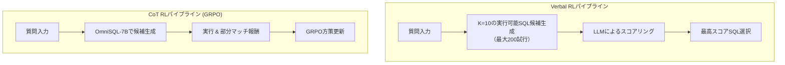

本記事は [PaVeRL-SQL (arXiv:2509.07159)](https://arxiv.org/abs/2509.07159) の解説記事です。

## 論文概要（Abstract）

PaVeRL-SQLは、部分マッチ報酬（Partial-Match Rewards）と言語強化学習（Verbal Reinforcement Learning）を組み合わせた二重パイプラインにより、産業規模のデータベースに対するText-to-SQL生成を改善するフレームワークである。著者らは、Spider 2.0-SQLiteで既存手法を7.4%上回り、多方言（SQLite + MySQL）同時訓練によりMySQL精度を約3倍に向上させたと報告している。

この記事は [Zenn記事: TRL GRPO×RLVRでQwen3-8Bを社内DB向けText-to-SQLに特化する](https://zenn.dev/0h_n0/articles/2a3ebad6f46b19) の深掘りです。

## 情報源

- **arXiv ID**: 2509.07159
- **URL**: [https://arxiv.org/abs/2509.07159](https://arxiv.org/abs/2509.07159)
- **著者**: Heng Hao, Wenjun Hu, Oxana Verkholyak, Davoud Ataee Tarzanagh, Baruch Gutow, Sima Didari, Masoud Faraki, Hankyu Moon, Seungjai Min
- **発表年**: 2025
- **分野**: cs.CL, cs.LG

## 背景と動機（Background & Motivation）

産業規模のデータベースでのText-to-SQLは、学術ベンチマーク（Spider, BIRD）と比較して桁違いに複雑なスキーマ（数百テーブル、数千カラム）と多様なSQL方言（SQLite, MySQL, PostgreSQL等）への対応が求められる。従来のRL手法はバイナリ報酬（正解=1/不正解=0）に依存しており、複雑なクエリでは報酬信号が極めて疎になる。PaVeRL-SQLは、この報酬疎性問題を「部分マッチ」による連続報酬と「言語フィードバック」による自己改善の2軸で解決しようとするものである。

## 主要な貢献（Key Contributions）

- **貢献1**: Verbal RLとCoT RL（GRPO）の二重パイプラインを設計し、それぞれの強みを活かした使い分けを提案
- **貢献2**: カラム単位の部分マッチ報酬（EXf: Fractional Execution Accuracy）を導入し、報酬の粒度を大幅に向上
- **貢献3**: SQLite + MySQLの多方言同時訓練で、少数リソース方言（MySQL）の精度を約3倍に向上させることを実証

## 技術的詳細（Technical Details）

### 二重パイプラインアーキテクチャ

PaVeRL-SQLは2つの独立したパイプラインで構成される：



**Verbal RLパイプライン**: 候補SQLを生成し、実行可能な候補をK=10収集するまで繰り返す（最大200試行）。収集した候補をLLM自身がスコアリングし、最高スコアのSQLを選択する。GPT-5 miniをバックエンドとした場合、Spider 2.0-SQLiteで37.0%を達成している。

**CoT RLパイプライン**: OmniSQL-7B（Qwen2.5-coderベース、SynSQL-2.5Mで事前訓練済み）をGRPOで訓練する。部分マッチ報酬により連続的な学習信号を提供する。

### 部分マッチ報酬（EXf）

従来のバイナリ報酬に代わり、カラム単位の部分一致を測定する連続報酬を設計している：

$$
R = \begin{cases} 10 \cdot \text{EX}_f, & \text{SQLが実行成功かつ結果返却} \\ 0.5, & \text{SQLが実行成功だが結果不一致} \\ 0, & \text{実行失敗} \end{cases}
$$

ここで、$\text{EX}_f$（Fractional Execution Accuracy）はゴールド結果とのカラム単位マッチング率を$[0, 1]$のスケールで測定する。10倍のスケーリングはGRPOのAdvantage推定における信号強度を確保するためである。

**EXfの計算**: 生成SQLの結果セットの各カラムを、ゴールド結果の各カラムと比較し、一致するカラムの割合を算出する。これにより、「テーブルは正しいがSELECTカラムが一部間違い」のような部分的正解にも正の報酬が与えられる。

**EXb（Binary版）との使い分け**: $\tau = 5$カラムの許容差を持つバイナリ版EXbも定義されている。EXfは訓練信号として、EXbは最終評価指標として使用される。

### OmniSQL-7Bの役割

OmniSQL-7BはQwen2.5-coderをベースに、SynSQL-2.5M（250万サンプル）でSFT事前訓練されたモデルである。PaVeRL-SQLではこれをGRPO訓練のコールドスタートモデルとして使用している。Zenn記事で解説されている「SFTウォームアップ → GRPO」パイプラインにおけるSFTチェックポイントに相当する。

### 多方言訓練

SQLite + MySQLの混合データで訓練した場合、単一方言訓練と比較してMySQL精度が約3倍に向上（20.1% → 74.7-75.7%）した一方、SQLite精度は維持されたと著者らは報告している。社内DBが複数の方言（MySQL + PostgreSQL等）を使用している場合、混合訓練が有効である。

### 訓練ハイパーパラメータ

| パラメータ | 値 |
|-----------|-----|
| バッチサイズ | 1,024 |
| 温度 | 0.8 |
| ロールアウト/プロンプト | 10 |
| Stage 1 エポック | 10 |
| ウォームアップ学習率 | 1e-7 〜 5e-7 |
| 最大学習率 | 1e-5 〜 5e-5 |
| GPU | 8 × H100 (96GB) |
| 総エポック | ≤20 |

## 実装のポイント（Implementation）

**大規模バッチサイズ**: バッチサイズ1,024は他手法（Reasoning-SQL: 32、SQL-R1: 未記載）と比較して非常に大きい。著者らは大バッチにより報酬の分散推定が安定し、GRPOの更新が安定化すると述べている。

**200試行の候補生成**: Verbal RLパイプラインでは最大200試行で実行可能な候補を生成する。この過程で構文エラーのパターンを多数サンプリングしており、暗黙的なデータ拡張の効果がある。

**アンサンブルサイズ**: 著者らの実験では、多数決のアンサンブルサイズは約32サンプルが最適であり、それ以上では収穫逓減が確認されている。

## 実験結果（Results）

### ベンチマーク結果（論文より）

| データセット | 手法 | EX (%) |
|------------|------|--------|
| Spider 2.0-SQLite | CoT RL | 17.0 |
| Spider 2.0-SQLite | Verbal RL (GPT-5 mini) | **37.0** |
| BIRD Dev | CoT RL | **67.2** |
| Spider Dev | CoT RL | 83.4 |

Spider 2.0-SQLiteにおけるVerbal RLパイプラインの37.0%は、先行手法を7.4%上回る結果である。

### 多方言訓練結果

| 方言 | 単一訓練 | 混合訓練 | 改善 |
|------|---------|---------|------|
| SQLite | 基準 | 維持 | — |
| MySQL | 20.1% | 74.7-75.7% | **約3倍** |

多方言訓練は、少数リソース方言で劇的な改善をもたらしつつ、主方言の性能を維持している。

## 実運用への応用（Practical Applications）

PaVeRL-SQLの知見は、社内DB向けパイプラインに以下の形で応用可能である。

**部分マッチ報酬の導入**: Zenn記事の多層報酬に加え、PaVeRL-SQLのEXf（カラム単位部分マッチ）を導入することで、報酬の粒度をさらに向上させられる。特に社内DBで結果セットのカラム数が多いクエリにおいて有効である。

**多方言対応**: 社内でMySQL・PostgreSQL・BigQuery等の複数方言を使用している場合、混合訓練により単一モデルで複数方言に対応できる。PaVeRL-SQLの結果は、少数サンプルの方言でも混合訓練で劇的な精度改善が得られることを示している。

**Verbal RLの活用**: Verbal RLパイプラインは追加訓練なしで推論時の自己改善を実現する。社内デプロイ後の継続的改善（新しいスキーマへの適応等）に応用可能である。

## Production Deployment Guide

### AWS実装パターン（コスト最適化重視）

| 規模 | 月間リクエスト | 推奨構成 | 月額コスト | 主要サービス |
|------|--------------|---------|-----------|------------|
| **Small** | ~3,000 | Serverless | $50-150 | Lambda + Bedrock + DynamoDB |
| **Medium** | ~30,000 | Hybrid | $300-800 | ECS Fargate + SageMaker |
| **Large** | 300,000+ | Container | $2,000-5,000 | EKS + vLLM + GPU Spot |

**コスト試算の注意事項**: 2026年10月時点のAWS ap-northeast-1料金に基づく概算値。

**多方言対応の場合**: 単一モデルで複数方言に対応できるため、方言ごとにエンドポイントを分ける必要がない。これにより推論インフラのコストを大幅に削減できる。

**コスト削減テクニック**:
- Spot Instances活用（最大90%削減）
- 部分マッチ報酬によるモデル品質向上→リトライコスト削減
- 多方言単一モデル→インフラ統合でコスト削減

### Terraformインフラコード

```hcl
resource "aws_lambda_function" "sql_handler" {
  filename      = "lambda.zip"
  function_name = "multi-dialect-sql-handler"
  role          = aws_iam_role.lambda_sql.arn
  handler       = "index.handler"
  runtime       = "python3.12"
  timeout       = 60
  memory_size   = 1024
  environment {
    variables = {
      MODEL_ENDPOINT = aws_sagemaker_endpoint.sql_model.name
      SUPPORTED_DIALECTS = "sqlite,mysql,postgresql"
      ENABLE_VERBAL_RL = "true"
    }
  }
}

resource "aws_dynamodb_table" "dialect_cache" {
  name         = "sql-dialect-cache"
  billing_mode = "PAY_PER_REQUEST"
  hash_key     = "query_hash"
  range_key    = "dialect"
  attribute { name = "query_hash"; type = "S" }
  attribute { name = "dialect"; type = "S" }
  ttl { attribute_name = "expire_at"; enabled = true }
}
```

### コスト最適化チェックリスト

- [ ] 多方言単一モデルでインフラ統合
- [ ] Spot Instances優先（GPU推論で最大90%削減）
- [ ] Prompt Caching有効化（30-90%削減）
- [ ] バッチ推論活用（非リアルタイムで50%削減）
- [ ] AWS Budgets設定（月額上限アラート）
- [ ] CloudWatch アラーム（方言別のレイテンシ監視）
- [ ] Verbal RL推論候補数の最適化（コスト vs 精度トレードオフ）
- [ ] Cost Anomaly Detection有効化

## 関連研究（Related Work）

- **Reasoning-SQL** (arXiv 2503.23157): 6種の部分報酬でGRPO訓練。PaVeRL-SQLのEXf報酬はカラム単位でより細粒度
- **SQL-R1** (arXiv 2504.08600): SynSQL-2.5Mによるコールドスタート。PaVeRL-SQLもOmniSQL-7B（同データで訓練）を使用
- **OmniSQL** (arXiv 2411.17653): PaVeRL-SQLのCoTパイプラインのベースモデル。大規模合成データSFTの効果を実証

## まとめと今後の展望

PaVeRL-SQLは、部分マッチ報酬による密な学習信号と、Verbal RL + CoT RLの二重パイプラインにより、産業規模のText-to-SQL性能を改善した。特に多方言同時訓練でMySQL精度が3倍に向上した知見は、社内で複数のDBエンジンを運用している場合に有用である。Zenn記事の報酬設計にEXf報酬を追加することで、社内DB向けモデルの学習効率をさらに向上させることが期待できる。

## 参考文献

- **arXiv**: [https://arxiv.org/abs/2509.07159](https://arxiv.org/abs/2509.07159)
- **Related Zenn article**: [https://zenn.dev/0h_n0/articles/2a3ebad6f46b19](https://zenn.dev/0h_n0/articles/2a3ebad6f46b19)

---

:::message
この記事はAI（Claude Code）により自動生成されました。内容の正確性については複数の情報源で検証していますが、実際の利用時は公式ドキュメントもご確認ください。
:::
