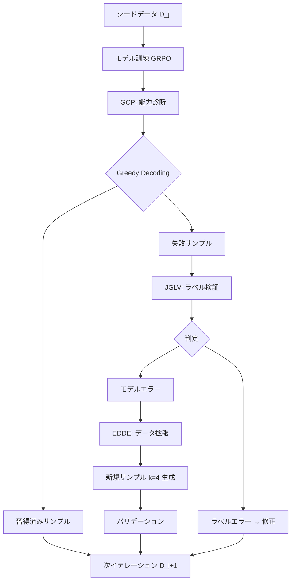

本記事は [論文: LoopTool: Closing the Data-Training Loop for Robust LLM Tool Calls](https://arxiv.org/abs/2511.09148) の解説記事です。

## 論文概要（Abstract）

LLMに外部ツール呼び出し能力を獲得させるための学習データ生成と訓練は、従来は別々のプロセスとして実行される静的パイプラインに依存していた。この方式ではモデル固有の弱点に適応的に対処できず、アノテーションノイズが蓄積して訓練効率が低下する。著者らは、データ合成とモデル訓練を密結合するClosed-loopフレームワーク**LoopTool**を提案している。Greedy Capability Probing（GCP）、Judgement-Guided Label Verification（JGLV）、Error-Driven Data Expansion（EDDE）の3モジュールがイテレーティブにデータとモデルを共進化させ、8BパラメータモデルがBFCL-v3およびACEBenchベンチマークで同規模のSOTAを達成したと報告している。

この記事は [Zenn記事: Function Calling並列実行入門：3社APIでエージェントを構築する](https://zenn.dev/0h_n0/articles/57c4107d4591b1) の深掘りです。Zenn記事ではOpenAI・Claude・Geminiの3社APIにおけるFunction Calling並列実行の実装方法を扱っていますが、本記事ではその背後にある「LLMがツール呼び出しをどう学習するか」という根本的な課題に対するLoopToolの解決策を詳述します。

## 情報源

- **arXiv ID**: 2511.09148
- **URL**: [https://arxiv.org/abs/2511.09148](https://arxiv.org/abs/2511.09148)
- **著者**: Kangning Zhang, Wenxiang Jiao, Kounianhua Du et al.
- **投稿日**: 2025年11月12日（v2: 2025年11月18日）
- **分野**: cs.CL, cs.AI, cs.LG
- **コード**: [https://github.com/Rednote-DeepExperience/LoopTool](https://github.com/Rednote-DeepExperience/LoopTool)
- **モデル**: [https://huggingface.co/zhuiguang-ning/LoopTool-8B](https://huggingface.co/zhuiguang-ning/LoopTool-8B)
- **ライセンス**: MIT

## 背景と動機（Background & Motivation）

LLMに外部ツール（API、データベース、コード実行環境等）を呼び出させるtool learningは、エージェント型システムの基盤技術である。Zenn記事で扱ったOpenAI・Claude・GeminiのFunction Callingも、この能力の商用実装にあたる。

従来のtool learning用データパイプラインは、データ生成フェーズとモデル訓練フェーズが完全に分離されていた。具体的には、大規模LLM（GPT-4やQwen-32B等）でtool-call学習用のサンプルを一括生成し、そのデータセットで小規模モデルを訓練するという2段階プロセスである。

著者らはこの静的パイプラインに3つの構造的問題を指摘している。第一に、データ生成がモデルの現時点での能力プロファイルを考慮しないため、すでに習得済みの簡単なサンプルが過剰に含まれ、未習得の難しいパターンが過少になる。第二に、データ生成器自体のアノテーションエラー（ラベルノイズ）が学習データに混入し、訓練効率を低下させる。第三に、1回限りのデータ生成では、モデルの訓練に伴う能力変化に追従できず、カリキュラム的な難易度調整が不可能である。

LoopToolはこれらの問題に対し、データ合成と訓練を単一のClosed-loopに統合することで、モデルの弱点に適応的にフォーカスするフレームワークを実現している。

## 主要な貢献（Key Contributions）

- **Closed-loop統合**: データ生成とモデル訓練を密結合するイテレーティブフレームワークを設計し、静的パイプラインの3つの構造的問題（適応不足・ラベルノイズ・カリキュラム不在）を同時に解決している
- **3モジュールの協調動作**: GCP（能力診断）、JGLV（ラベル検証・修正）、EDDE（エラー駆動データ拡張）が相互補完的に機能し、各イテレーションでデータ品質とモデル能力を共進化させる設計を提案している
- **オープンソースエコシステムでの実現**: 訓練・データ生成・評価のすべてにオープンソースモデル（Qwen3-8B/32B）を使用し、クローズドソースAPIへの依存を排除した低コスト運用を実現している
- **同規模SOTA達成**: 8BパラメータモデルがBFCL-v3で74.93%、ACEBenchで73.4%を達成し、データ生成に使用した32Bモデル（69.25%/71.1%）を大幅に上回っている

## 技術的詳細（Technical Details）

### Closed-loopアーキテクチャ

LoopToolは各イテレーション$j$において、3つのモジュールが以下の順序で実行される。



### モジュール1: Greedy Capability Probing（GCP）

GCPは訓練済みモデルの現時点での能力を診断するモジュールである。訓練データ全体に対してgreedy decoding（温度0のサンプリング）を実行し、各サンプルに対するモデルの出力を正解ラベルと比較する。

サンプルレベルのパープレキシティは以下のように定義される。

$$
\text{PPL}(\mathcal{T}, c_t) = \exp\left(-\frac{1}{L}\sum_{i=1}^{L} \log p_\theta(o_i \mid \mathcal{T}, c_t, o_{1:i-1})\right)
$$

ここで、
- $\mathcal{T}$: ツール定義（API仕様）
- $c_t$: ユーザクエリ（コンテキスト）
- $o_i$: 出力の$i$番目のトークン
- $L$: 出力系列長
- $p_\theta$: モデルの条件付き確率

GCPはサンプルを以下の3カテゴリに分類する。

1. **習得済み（Mastered）**: greedy decodingで正解を生成できたサンプル
2. **失敗（Failed）**: 不正解を生成したサンプル（JGLVとEDDEの入力となる）
3. **高パープレキシティ（HPPL）**: 正解は生成したがパープレキシティが高いサンプル（決定境界上にあり、継続学習に有用）

著者らは、高パープレキシティサンプルを次イテレーションの訓練データに含めることで、モデルが「まぐれ当たり」している不安定な能力を確実に定着させる効果があると述べている。

### モジュール2: Judgement-Guided Label Verification（JGLV）

JGLVはGCPで「失敗」と分類されたサンプルに対して、失敗の原因がモデルの能力不足なのか、それとも参照ラベル（正解データ）のアノテーションエラーなのかを判別するモジュールである。

オープンソースのジャッジモデル（Qwen3-32B）を用いて、モデルの予測$\hat{y}$と参照ラベル$y^*$をツール定義$\mathcal{T}$およびクエリ$c_t$のコンテキストで比較し、以下の4カテゴリのいずれかを出力する。

$$
\text{JGLV}(\hat{y}, y^*, \mathcal{T}, c_t) \in \{\texttt{PRED\_WRONG}, \texttt{LABEL\_WRONG}, \texttt{BOTH\_CORRECT}, \texttt{BOTH\_WRONG}\}
$$

- **PRED_WRONG**: モデルの予測が誤り、ラベルが正しい → エラーシードとしてEDDEへ送出
- **LABEL_WRONG**: ラベルが誤り、モデルの予測が正しい → モデルの予測で参照ラベルを置換
- **BOTH_CORRECT**: 両方正しい（表現の違い等） → 習得済みとして再分類
- **BOTH_WRONG**: 両方誤り → 当該サンプルを訓練データから除去

この設計により、訓練データのラベルノイズがイテレーションごとに自動的に修正される。著者らは、32Bデータ生成器が生成したサンプルの約10-20%にアノテーションエラーが含まれていたと報告しており、JGLVの修正効果は訓練効率に直接寄与すると述べている。

### モジュール3: Error-Driven Data Expansion（EDDE）

EDDEはJGLVで「PRED_WRONG」と判定されたサンプル（真のモデルエラー）を起点として、構造的に類似しつつ文脈的に多様な新規サンプルを$k=4$件生成するモジュールである。

生成された各サンプルは、ルールベースの構造検証（JSON形式の妥当性、引数型の整合性等）とQwen3-32Bによるセマンティック検証の2段階バリデーションを通過したもののみが次イテレーションの訓練データに追加される。

著者らは、エラーパターンの「核心的な機能的チャレンジ」を保存しつつシナリオを変化させることで、モデルが特定のエラーパターンを汎化的に克服できるようになると述べている。

### データセット構成の変遷

各イテレーション$j$の訓練データ$D_{j+1}$は以下の4要素から構成される。

$$
D_{j+1} = D_j^{\text{ES}} \cup D_j^{\text{EE}} \cup D_j^{\text{HPPL}} \cup D_j^{\text{Seed-new}}
$$

ここで、
- $D_j^{\text{ES}}$: JGLVで検証・修正されたエラーシード
- $D_j^{\text{EE}}$: EDDEで生成された新規サンプル
- $D_j^{\text{HPPL}}$: GCPで検出された高パープレキシティサンプル
- $D_j^{\text{Seed-new}}$: 新規追加のシードサンプル

著者らの報告（Table 4）によれば、イテレーションが進むにつれてエラーシードとEDDEサンプルの比率が増加し（イテレーション2: ES 10.48%/EE 35.87% → イテレーション4: ES 20.38%/EE 44.63%）、新規シードの比率が減少する（30.77% → 7.69%）。これは、モデルの弱点に対するフォーカスが自然に強化されるClosed-loopの特性を示している。

### 訓練手法: GRPO

モデル訓練にはGRPO（Group Relative Policy Optimization）を採用している。目的関数は以下の通りである。

$$
J_{\text{GRPO}}(\theta) = \mathbb{E}\left[\frac{1}{G}\sum_{i=1}^{G}\min\left(\rho_i A_i, \text{clip}(\rho_i, 1-\varepsilon, 1+\varepsilon) A_i\right) - \beta \text{KL}(\pi_\theta \| \pi_{\text{old}})\right]
$$

ここで、$\rho_i = \pi_\theta(a_i)/\pi_{\text{old}}(a_i)$は重要度比、$A_i$はアドバンテージ、$\varepsilon$はクリッピング係数（0.2→0.28）、$\beta$はKLペナルティ係数（0に設定）である。報酬関数はバイナリ（ToolMatchが成立すれば$r=1$、不成立なら$r=0$）で定義される。

## 実装のポイント（Implementation）

### オープンソースエコシステムでの構成

LoopToolの全パイプラインはオープンソースコンポーネントで構成される。

- **ベースモデル**: Qwen3-8B
- **ジャッジ/データ生成モデル**: Qwen3-32B
- **訓練ライブラリ**: Verl（オープンソースRLライブラリ）
- **シードデータ**: ToolBenchの1,200件のツール定義から28kサンプルを生成
- **訓練パラメータ**: バッチサイズ128、学習率$1 \times 10^{-6}$、各イテレーション2エポック

### ジャッジモデル選定の指針

JGLVのジャッジモデルにはQwen3-32Bを採用している。著者らは、ジャッジモデルが訓練対象モデルより大きいパラメータサイズを持つことが重要であると述べている。ただし、GPT-4等のクローズドソースモデルを使用せずとも、32Bクラスのオープンソースモデルで十分な判定精度が得られることを実験的に確認している。

### イテレーション管理の実装例

```python
from dataclasses import dataclass, field
from enum import Enum
from pathlib import Path


class JGLVVerdict(Enum):
    """JGLVの判定カテゴリ

    Attributes:
        PRED_WRONG: モデル予測が誤り、ラベルが正しい
        LABEL_WRONG: ラベルが誤り、モデル予測が正しい
        BOTH_CORRECT: 両方正しい
        BOTH_WRONG: 両方誤り
    """
    PRED_WRONG = "pred_wrong"
    LABEL_WRONG = "label_wrong"
    BOTH_CORRECT = "both_correct"
    BOTH_WRONG = "both_wrong"


@dataclass
class LoopToolSample:
    """LoopToolの学習サンプル

    Attributes:
        tool_def: ツール定義（API仕様）のJSON文字列
        query: ユーザクエリ
        reference_label: 参照ラベル（正解のtool call）
        perplexity: GCPで計算されたパープレキシティ
        source: サンプルの生成元（seed/edde/hppl/error_seed）
    """
    tool_def: str
    query: str
    reference_label: str
    perplexity: float = 0.0
    source: str = "seed"


@dataclass
class IterationState:
    """各イテレーションの状態管理

    Attributes:
        iteration: 現在のイテレーション番号
        mastered_count: 習得済みサンプル数
        failed_count: 失敗サンプル数
        hppl_count: 高パープレキシティサンプル数
        label_corrected: JGLV修正数
        edde_generated: EDDE生成数
    """
    iteration: int
    mastered_count: int = 0
    failed_count: int = 0
    hppl_count: int = 0
    label_corrected: int = 0
    edde_generated: int = 0
    samples: list[LoopToolSample] = field(default_factory=list)

    def build_next_dataset(
        self,
        error_seeds: list[LoopToolSample],
        edde_samples: list[LoopToolSample],
        hppl_samples: list[LoopToolSample],
        new_seeds: list[LoopToolSample],
    ) -> list[LoopToolSample]:
        """次イテレーションの訓練データを構築する

        D_{j+1} = D_j^ES ∪ D_j^EE ∪ D_j^HPPL ∪ D_j^Seed-new

        Args:
            error_seeds: JGLVで検証済みのエラーシード
            edde_samples: EDDEで生成された新規サンプル
            hppl_samples: 高パープレキシティサンプル
            new_seeds: 新規シードサンプル

        Returns:
            次イテレーションの訓練データセット
        """
        next_dataset: list[LoopToolSample] = []
        next_dataset.extend(error_seeds)
        next_dataset.extend(edde_samples)
        next_dataset.extend(hppl_samples)
        next_dataset.extend(new_seeds)
        return next_dataset
```

## Production Deployment Guide

LoopToolのClosed-loopパイプラインをプロダクション環境に構築する際のAWS実装パターンを示す。LoopToolはデータ生成・能力診断・訓練の3工程を反復実行するため、GPU計算リソースの効率的なスケジューリングとコスト管理が設計上の要点となる。

### AWS実装パターン（コスト最適化重視）

**トラフィック量別の推奨構成**:

| 構成 | 用途 | アーキテクチャ | 月額コスト概算 |
|------|------|---------------|--------------|
| Small | 週1回のイテレーション実行 | Lambda + SageMaker Training Job + S3 | $50-150 |
| Medium | 日次イテレーション | ECS Fargate + SageMaker + Step Functions | $300-800 |
| Large | 継続的Closed-loop運用 | EKS + Karpenter + Spot GPU + SageMaker | $2,000-5,000 |

**Small構成（週1回イテレーション）**: Step Functionsでパイプライン全体をオーケストレーションする。GCPフェーズではSageMaker Processing Jobで推論を実行し、JGLVのジャッジ呼び出しはLambda関数でQwen3-32Bの推論エンドポイント（SageMaker Serverless Inference）に委譲する。EDDE生成はSageMaker Processing Jobで実行し、生成サンプルをS3に格納する。訓練フェーズはSageMaker Training Jobでml.g5.2xlargeインスタンスを使用する。月額内訳: SageMaker Training（ml.g5.2xlarge、週4時間） $80-120、SageMaker Processing $20-30、Lambda $5-10、S3 $5-10、Step Functions $1。

**Medium構成（日次イテレーション）**: ECS FargateでGCP・JGLV・EDDEの前処理を常時稼働させ、訓練はSageMaker Training Jobに委譲する。Step FunctionsとEventBridgeで日次スケジュールを管理する。月額内訳: ECS Fargate（2vCPU, 8GB RAM x 1タスク）$100-150、SageMaker Training（ml.g5.2xlarge、日次2時間）$400-500、S3 $10-20、Step Functions + EventBridge $5、CloudWatch $10。

**Large構成（継続的Closed-loop運用）**: EKSクラスタにLoopToolの全モジュールをコンテナとしてデプロイし、KarpenterによるGPU Spot Instancesの自動スケーリングでコスト効率を最大化する。Argo Workflowsでパイプラインのオーケストレーションを行い、MLflowで各イテレーションのメトリクスとモデルバージョンを管理する。月額内訳: EKS コントロールプレーン $75、EC2 Spot（g5.2xlarge x 2-4台）$800-2,000、EBS $50-100、ALB $25、監視 $50。

**コスト削減テクニック**:
- Spot Instances活用で最大90%削減（g5.xlargeのSpot価格は東京リージョンでOn-Demandの約70%オフ）
- SageMaker Managed Spot Trainingで最大70%削減
- S3 Intelligent-Tieringでモデルチェックポイントのストレージコスト最適化
- 訓練ジョブの夜間・週末スケジューリングで電力効率を向上

**コスト試算の注意事項**: 上記はAWS ap-northeast-1（東京）リージョンの2026年10月時点の概算値である。実際のコストはGPUインスタンスの可用性、Spot価格の変動、データサイズにより変動する。最新料金はAWS料金計算ツールで確認を推奨する。

### Terraformインフラコード

**Small構成（Serverless）**:

```hcl
# LoopTool Serverless構成 - Step Functions + SageMaker + Lambda
# 2026-10時点の最新安定版

terraform {
  required_version = ">= 1.9"
  required_providers {
    aws = { source = "hashicorp/aws", version = "~> 5.72" }
  }
}

provider "aws" { region = "ap-northeast-1" }

data "aws_caller_identity" "current" {}

# --- S3（訓練データ・モデルチェックポイント格納） ---
resource "aws_s3_bucket" "looptool_data" {
  bucket = "looptool-data-${data.aws_caller_identity.current.account_id}"
  tags   = { Project = "looptool", Environment = "production" }
}

resource "aws_s3_bucket_versioning" "looptool_data" {
  bucket = aws_s3_bucket.looptool_data.id
  versioning_configuration { status = "Enabled" }
}

resource "aws_s3_bucket_server_side_encryption_configuration" "looptool_data" {
  bucket = aws_s3_bucket.looptool_data.id
  rule {
    apply_server_side_encryption_by_default {
      sse_algorithm = "aws:kms"
    }
  }
}

resource "aws_s3_bucket_intelligent_tiering_configuration" "looptool_data" {
  bucket = aws_s3_bucket.looptool_data.id
  name   = "checkpoints"
  filter { prefix = "checkpoints/" }
  tiering {
    access_tier = "ARCHIVE_ACCESS"
    days        = 90
  }
}

# --- IAMロール（SageMaker） ---
resource "aws_iam_role" "sagemaker_training" {
  name = "looptool-sagemaker-training"
  assume_role_policy = jsonencode({
    Version = "2012-10-17"
    Statement = [{
      Action    = "sts:AssumeRole"
      Effect    = "Allow"
      Principal = { Service = "sagemaker.amazonaws.com" }
    }]
  })
}

resource "aws_iam_role_policy" "sagemaker_training" {
  name = "looptool-sagemaker-policy"
  role = aws_iam_role.sagemaker_training.id
  policy = jsonencode({
    Version = "2012-10-17"
    Statement = [
      {
        Effect   = "Allow"
        Action   = ["s3:GetObject", "s3:PutObject", "s3:ListBucket"]
        Resource = [
          aws_s3_bucket.looptool_data.arn,
          "${aws_s3_bucket.looptool_data.arn}/*",
        ]
      },
      {
        Effect   = "Allow"
        Action   = ["logs:CreateLogGroup", "logs:CreateLogStream", "logs:PutLogEvents"]
        Resource = "arn:aws:logs:ap-northeast-1:*:*"
      },
      {
        Effect   = "Allow"
        Action   = ["ecr:GetAuthorizationToken", "ecr:BatchGetImage", "ecr:GetDownloadUrlForLayer"]
        Resource = "*"
      }
    ]
  })
}

# --- IAMロール（Lambda: JGLV判定） ---
resource "aws_iam_role" "jglv_lambda" {
  name = "looptool-jglv-lambda"
  assume_role_policy = jsonencode({
    Version = "2012-10-17"
    Statement = [{
      Action    = "sts:AssumeRole"
      Effect    = "Allow"
      Principal = { Service = "lambda.amazonaws.com" }
    }]
  })
}

resource "aws_iam_role_policy" "jglv_lambda" {
  name = "looptool-jglv-policy"
  role = aws_iam_role.jglv_lambda.id
  policy = jsonencode({
    Version = "2012-10-17"
    Statement = [
      {
        Effect   = "Allow"
        Action   = ["s3:GetObject", "s3:PutObject"]
        Resource = "${aws_s3_bucket.looptool_data.arn}/*"
      },
      {
        Effect   = "Allow"
        Action   = ["sagemaker:InvokeEndpoint"]
        Resource = "arn:aws:sagemaker:ap-northeast-1:*:endpoint/looptool-judge-*"
      },
      {
        Effect   = "Allow"
        Action   = ["logs:CreateLogGroup", "logs:CreateLogStream", "logs:PutLogEvents"]
        Resource = "arn:aws:logs:ap-northeast-1:*:*"
      }
    ]
  })
}

# --- Lambda関数（JGLV判定） ---
resource "aws_lambda_function" "jglv_judge" {
  function_name = "looptool-jglv-judge"
  runtime       = "python3.12"
  handler       = "handler.judge"
  role          = aws_iam_role.jglv_lambda.arn
  timeout       = 300
  memory_size   = 1024
  filename      = "lambda_jglv.zip"

  environment {
    variables = {
      JUDGE_ENDPOINT = "looptool-judge-qwen32b"
      DATA_BUCKET    = aws_s3_bucket.looptool_data.bucket
    }
  }

  tracing_config { mode = "Active" }
  tags = { Project = "looptool" }
}

# --- DynamoDB（イテレーション状態管理） ---
resource "aws_dynamodb_table" "iteration_state" {
  name         = "looptool-iteration-state"
  billing_mode = "PAY_PER_REQUEST"
  hash_key     = "iteration_id"

  attribute {
    name = "iteration_id"
    type = "S"
  }

  server_side_encryption { enabled = true }
  point_in_time_recovery { enabled = true }
  tags = { Project = "looptool", Environment = "production" }
}

# --- CloudWatchアラーム ---
resource "aws_cloudwatch_metric_alarm" "training_cost" {
  alarm_name          = "looptool-training-cost-alert"
  comparison_operator = "GreaterThanThreshold"
  evaluation_periods  = 1
  metric_name         = "EstimatedCharges"
  namespace           = "AWS/Billing"
  period              = 86400
  statistic           = "Maximum"
  threshold           = 200
  alarm_actions       = []
  dimensions          = { Currency = "USD" }
}
```

**Large構成（Container）**:

```hcl
# LoopTool Container構成 - EKS + Karpenter + Spot GPU
# Argo Workflowsでパイプラインオーケストレーション

module "eks" {
  source  = "terraform-aws-modules/eks/aws"
  version = "~> 20.26"

  cluster_name    = "looptool-cluster"
  cluster_version = "1.31"

  vpc_id     = module.vpc.vpc_id
  subnet_ids = module.vpc.private_subnets

  cluster_endpoint_public_access  = true
  cluster_endpoint_private_access = true

  eks_managed_node_groups = {
    system = {
      instance_types = ["m7i.large"]
      min_size       = 1
      max_size       = 3
      desired_size   = 2
      capacity_type  = "ON_DEMAND"
    }
  }

  tags = { Project = "looptool", Environment = "production" }
}

# --- Karpenter NodePool（GPU Spot優先） ---
resource "kubectl_manifest" "karpenter_gpu_pool" {
  yaml_body = yamlencode({
    apiVersion = "karpenter.sh/v1"
    kind       = "NodePool"
    metadata   = { name = "looptool-gpu" }
    spec = {
      template = {
        spec = {
          requirements = [
            { key = "karpenter.sh/capacity-type", operator = "In", values = ["spot", "on-demand"] },
            { key = "node.kubernetes.io/instance-type", operator = "In",
              values = ["g5.2xlarge", "g5.4xlarge", "g6.2xlarge"] },
          ]
        }
      }
      limits     = { cpu = "64", "nvidia.com/gpu" = "8" }
      disruption = { consolidationPolicy = "WhenEmptyOrUnderutilized" }
    }
  })
}

# --- Secrets Manager（MLflow・モデルレジストリ設定） ---
resource "aws_secretsmanager_secret" "looptool_config" {
  name = "looptool/pipeline-config"
  tags = { Project = "looptool" }
}

# --- AWS Budgets ---
resource "aws_budgets_budget" "looptool" {
  name         = "looptool-monthly"
  budget_type  = "COST"
  limit_amount = "4000"
  limit_unit   = "USD"
  time_unit    = "MONTHLY"

  notification {
    comparison_operator        = "GREATER_THAN"
    threshold                  = 80
    threshold_type             = "PERCENTAGE"
    notification_type          = "ACTUAL"
    subscriber_email_addresses = ["ops-team@example.com"]
  }
}
```

### 運用・監視設定

**CloudWatch Logs Insights クエリ**:

```
# LoopToolイテレーション別のGCP診断結果を集計
fields @timestamp, iteration, mastered_count, failed_count, hppl_count, label_corrected
| stats sum(mastered_count) as total_mastered,
        sum(failed_count) as total_failed,
        sum(label_corrected) as total_corrected
  by iteration
| sort iteration asc
```

```
# JGLV判定分布の監視（ラベルエラー率の推移）
fields @timestamp, verdict, iteration
| stats count(*) as cnt by verdict, iteration
| sort iteration asc, verdict asc
```

**CloudWatch アラーム設定コード**:

```python
import boto3
from datetime import datetime


def create_training_alarms(
    sns_topic_arn: str,
    training_job_prefix: str = "looptool",
) -> list[str]:
    """LoopTool訓練ジョブの監視アラームを作成する

    Args:
        sns_topic_arn: 通知先SNSトピックのARN
        training_job_prefix: SageMaker訓練ジョブ名のプレフィックス

    Returns:
        作成されたアラームのARNリスト
    """
    cw = boto3.client("cloudwatch")
    alarm_arns: list[str] = []

    # GPU使用率低下アラーム（訓練が停滞している可能性）
    response = cw.put_metric_alarm(
        AlarmName=f"{training_job_prefix}-gpu-utilization-low",
        ComparisonOperator="LessThanThreshold",
        EvaluationPeriods=3,
        MetricName="GPUUtilization",
        Namespace="/aws/sagemaker/TrainingJobs",
        Period=300,
        Statistic="Average",
        Threshold=20.0,
        AlarmActions=[sns_topic_arn],
        AlarmDescription="GPU utilization below 20% for 15 min - training may be stalled",
    )
    alarm_arns.append(response.get("AlarmArn", ""))

    # 訓練時間超過アラーム
    response = cw.put_metric_alarm(
        AlarmName=f"{training_job_prefix}-training-duration",
        ComparisonOperator="GreaterThanThreshold",
        EvaluationPeriods=1,
        MetricName="TrainingTimeDuration",
        Namespace="/aws/sagemaker/TrainingJobs",
        Period=3600,
        Statistic="Maximum",
        Threshold=14400,  # 4時間超過
        AlarmActions=[sns_topic_arn],
        AlarmDescription="Training job exceeded 4 hours",
    )
    alarm_arns.append(response.get("AlarmArn", ""))

    return alarm_arns
```

**X-Rayトレーシング設定**:

```python
from aws_xray_sdk.core import xray_recorder, patch_all
from aws_xray_sdk.core.models.subsegment import Subsegment


# boto3自動計装
patch_all()


def trace_looptool_iteration(
    iteration: int,
    phase: str,
    sample_count: int,
) -> Subsegment:
    """LoopToolイテレーションのX-Rayトレースを記録する

    Args:
        iteration: イテレーション番号
        phase: 実行フェーズ（gcp/jglv/edde/train）
        sample_count: 処理サンプル数

    Returns:
        X-Rayサブセグメント
    """
    subsegment = xray_recorder.begin_subsegment(f"looptool-{phase}")
    subsegment.put_annotation("iteration", iteration)
    subsegment.put_annotation("phase", phase)
    subsegment.put_metadata("sample_count", sample_count)
    return subsegment
```

**Cost Explorer自動レポート**:

```python
import boto3
from datetime import datetime, timedelta


def get_looptool_daily_cost(
    sns_topic_arn: str,
    cost_threshold: float = 100.0,
) -> dict[str, float]:
    """LoopToolの日次コストレポートを取得しSNS通知する

    Args:
        sns_topic_arn: 通知先SNSトピックのARN
        cost_threshold: アラート閾値（USD/日）

    Returns:
        サービス別コスト辞書
    """
    ce = boto3.client("ce")
    today = datetime.utcnow().strftime("%Y-%m-%d")
    yesterday = (datetime.utcnow() - timedelta(days=1)).strftime("%Y-%m-%d")

    response = ce.get_cost_and_usage(
        TimePeriod={"Start": yesterday, "End": today},
        Granularity="DAILY",
        Metrics=["BlendedCost"],
        Filter={
            "Tags": {
                "Key": "Project",
                "Values": ["looptool"],
            }
        },
        GroupBy=[{"Type": "DIMENSION", "Key": "SERVICE"}],
    )

    costs: dict[str, float] = {}
    total = 0.0
    for group in response["ResultsByTime"][0]["Groups"]:
        service = group["Keys"][0]
        amount = float(group["Metrics"]["BlendedCost"]["Amount"])
        costs[service] = amount
        total += amount

    if total > cost_threshold:
        sns = boto3.client("sns")
        sns.publish(
            TopicArn=sns_topic_arn,
            Subject=f"LoopTool Daily Cost Alert: ${total:.2f}",
            Message=f"LoopTool daily cost ${total:.2f} exceeded threshold ${cost_threshold:.2f}.\n"
            + "\n".join(f"  {k}: ${v:.2f}" for k, v in sorted(costs.items(), key=lambda x: -x[1])),
        )

    return costs
```

### コスト最適化チェックリスト

**アーキテクチャ選択**:
- [ ] イテレーション頻度に応じた構成選択（週1: Serverless、日次: Hybrid、継続: Container）
- [ ] GPU要件の見積もり（8Bモデル訓練: g5.2xlarge以上、32Bジャッジ推論: g5.4xlarge以上）

**リソース最適化**:
- [ ] EC2/SageMaker: Spot Instances優先（g5系で最大70%削減）
- [ ] SageMaker Managed Spot Training有効化
- [ ] Reserved Instances: 月次以上の定常利用は1年コミット検討
- [ ] Savings Plans: SageMaker Savings Plansで最大64%削減
- [ ] Lambda: メモリサイズをJGLV判定の実測値に合わせて最適化
- [ ] 非稼働時間帯のGPUインスタンス自動停止

**LLMコスト削減**:
- [ ] ジャッジモデル（Qwen3-32B）の量子化（AWQ/GPTQ）でVRAM削減
- [ ] GCPフェーズのバッチ推論でスループット最大化
- [ ] EDDEの生成数$k$の調整（$k=4$が論文デフォルト、コスト重視なら$k=2$に削減）
- [ ] SageMaker Serverless InferenceのCold Start対策（Provisioned Concurrency）

**監視・アラート**:
- [ ] AWS Budgets設定（月額上限アラート）
- [ ] CloudWatch アラーム（GPU使用率低下、訓練時間超過）
- [ ] Cost Anomaly Detection有効化
- [ ] 日次コストレポートのSNS通知

**リソース管理**:
- [ ] 古いモデルチェックポイントのS3 Intelligent-Tiering/Glacier移行
- [ ] タグ戦略（Project=looptool, Iteration=N）
- [ ] ECRイメージのライフサイクルポリシー（30日以上の未使用イメージ削除）
- [ ] 開発環境のGPUインスタンス夜間自動停止
- [ ] SageMaker Endpointの不要時削除

## 実験結果（Results）

### BFCL-v3ベンチマーク

著者らは4,951件のテストインスタンス（3,951件のシングルターン + 1,000件のマルチターン）で構成されるBFCL-v3（Berkeley Function Calling Leaderboard v3）で評価を実施している。

| モデル | パラメータ | Overall | シングルターン | マルチターン |
|--------|-----------|---------|--------------|------------|
| LoopTool-8B | 8B | **74.93%** | — | — |
| GPT-4o | — | 71.71% | — | — |
| Qwen3-32B（データ生成器） | 32B | 69.25% | — | — |
| Qwen3-8B（ベースライン） | 8B | 66.34% | — | — |

LoopTool-8Bは、データ生成に使用したQwen3-32Bを5.68ポイント上回り、GPT-4oも3.22ポイント上回っている。8Bパラメータモデルが32Bモデルおよび商用モデルを超えた点は、Closed-loopによるデータ品質向上の効果を示す結果であると著者らは述べている。BFCL-v3リーダーボードで3位にランクインしたと報告されている。

### ACEBenchベンチマーク

ACEBenchはNormal/Special/Agentの3カテゴリでツール呼び出し能力を評価するベンチマークである。

| モデル | Overall | Normal | Special | Agent |
|--------|---------|--------|---------|-------|
| LoopTool-8B | 73.4% | — | — | — |
| Qwen3-32B | 71.1% | — | — | — |
| Qwen3-8B | 67.1% | — | — | — |
| GPT-4o | 81.1% | — | — | — |

ACEBenchではGPT-4o（81.1%）には及ばないものの、同規模のSOTAを達成している。特にQwen3-32Bを2.3ポイント上回っており、パラメータ数4倍のモデルを超えた点が注目される。

### 汎用能力の維持

著者らは、LoopTool-8Bがツール呼び出し以外のタスクでも性能を維持していることを確認している。

| ベンチマーク | Qwen3-8B（ベースライン） | LoopTool-8B | 差分 |
|-------------|------------------------|-------------|------|
| MMLU-redux | 87.72% | 87.37% | -0.35 |
| IFEval | — | — | +1.40 |
| LiveCodeBench | — | — | +3.84 |
| Math-500 | — | — | +1.20 |

MMLU-reduxでは0.35ポイントの微小な低下にとどまり、IFEval・LiveCodeBench・Math-500ではむしろ性能が向上している。著者らは、LoopToolの訓練がtool-calling能力に特化しつつも、汎用能力を犠牲にしない設計であると述べている。

## 実運用への応用（Practical Applications）

### 自社ツール呼び出しモデルの構築

Zenn記事で扱ったOpenAI・Claude・GeminiのFunction Callingは商用APIとして提供されるが、社内固有のツール群（内部API、データベース操作、業務ワークフロー等）に最適化されたモデルを構築する場合、LoopToolのClosed-loopアプローチが有効である。

具体的な応用シナリオとして以下が考えられる。

**社内APIへの特化**: 社内の数百のマイクロサービスAPIに対してFunction Callingを学習させる場合、静的なデータ生成では全APIを均等にカバーするサンプルを作成するが、実際にはモデルが苦手とするAPI（複雑な引数構造、ネストされたオブジェクト型等）が偏在する。LoopToolのGCPにより弱点APIを特定し、EDDEで集中的にサンプルを生成することで、効率的な学習が可能になる。

**コスト効率**: 全パイプラインがオープンソースで構成されるため、GPT-4のAPI呼び出しコストが不要である。著者らの報告では、4イテレーションの全プロセスがQwen3-8B/32Bのみで完結しており、クローズドソースAPIへの依存がない。8Bモデルを推論に使用する場合、GPU1枚（A100/H100）での推論が可能であり、商用APIと比較してトークンあたりのコストを大幅に削減できる。

**継続学習**: 新しいAPIの追加や既存APIの仕様変更に対して、LoopToolのイテレーションを追加実行するだけで対応できる。静的パイプラインでは全データを再生成する必要があるが、LoopToolはGCPで新APIに関連する弱点のみを検出し、EDDEで重点的にサンプルを生成する。

## 関連研究（Related Work）

- **ToolLLM / APIGen**: ツール呼び出しデータの合成パイプライン。大規模LLMでデータを一括生成する静的アプローチであり、LoopToolが解決を目指すモデル非適応性の問題を抱えている
- **Self-Instruct / DADA**: LLM自身が学習データを生成する自己進化型手法。LoopToolはこれらの自己生成アプローチにGCPの能力診断とJGLVのラベル検証を加えることで、データ品質の保証を強化している
- **GRPO / DeepSeekMath**: 強化学習ベースのLLM最適化手法。LoopToolはGRPOを訓練アルゴリズムとして採用しつつ、データ側の品質管理（JGLV・EDDE）を追加した統合フレームワークとして位置づけられる
- **ToolACE**: ツール呼び出しの自動評価フレームワーク。LoopToolのJGLVモジュールは類似の評価機能を持つが、評価結果をデータ修正に直結させるClosed-loop設計が差別化点である

## まとめと今後の展望

LoopToolは、LLMのtool learning用データパイプラインにおける静的設計の限界を、データ生成・能力診断・訓練のClosed-loop統合によって克服するフレームワークである。GCP・JGLV・EDDEの3モジュールが相互に連携し、4イテレーションで8Bモデルが32Bデータ生成器およびGPT-4oを上回るBFCL-v3スコアを達成した。

著者らは現在の制限事項として、フレームワークがオフライン・逐次実行に限定されている点を挙げ、オンライン・ストリーミング型のデータ進化や、GCP/JGLV/EDDEの並列化による高速化を今後の研究方向として示している。

## 参考文献

- **arXiv**: [https://arxiv.org/abs/2511.09148](https://arxiv.org/abs/2511.09148)
- **Code**: [https://github.com/Rednote-DeepExperience/LoopTool](https://github.com/Rednote-DeepExperience/LoopTool)
- **Model**: [https://huggingface.co/zhuiguang-ning/LoopTool-8B](https://huggingface.co/zhuiguang-ning/LoopTool-8B)
- **Related Zenn article**: [https://zenn.dev/0h_n0/articles/57c4107d4591b1](https://zenn.dev/0h_n0/articles/57c4107d4591b1)
