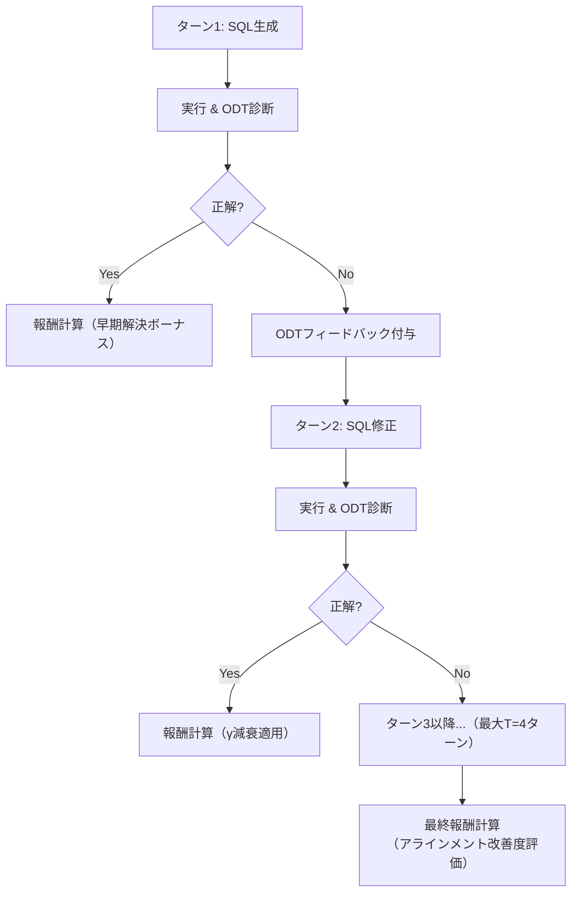

本記事は [Progress-SQL (arXiv:2606.06825)](https://arxiv.org/abs/2606.06825) の解説記事です。

## 論文概要（Abstract）

Progress-SQLは、Text-to-SQLにおける強化学習を多段（マルチターン）フレームワークに拡張し、漸進的報酬（Progressive Rewards）で「生成SQLの改善度合い」を評価する手法である。著者らは、Oracle-guided Diagnostic Tree（ODT）による構造的フィードバックを訓練時に付与することで、7BモデルでBIRD開発セット64.3%（+12.0%）、Spider開発セット87.1%（+7.4%）を達成したと報告している。

この記事は [Zenn記事: TRL GRPO×RLVRでQwen3-8Bを社内DB向けText-to-SQLに特化する](https://zenn.dev/0h_n0/articles/2a3ebad6f46b19) の深掘りです。

## 情報源

- **arXiv ID**: 2606.06825
- **URL**: [https://arxiv.org/abs/2606.06825](https://arxiv.org/abs/2606.06825)
- **著者**: Shihao Zhang, Xiaoman Wang, Yuan Liu, Yunshi Lan, Weining Qian
- **発表年**: 2026
- **分野**: cs.CL, cs.AI

## 背景と動機（Background & Motivation）

既存のRL系Text-to-SQL手法は、1回の生成に対して最終状態のみで報酬を与える「ワンショット」設計を採用している。この設計では、SQLの部分的な改善に対するフィードバックが得られず、報酬が疎になりがちである。著者らは、人間のSQLデバッグプロセス（エラー特定→修正→再実行→改善確認）に着想を得て、複数ターンにわたるSQL改善の軌跡（trajectory）全体を報酬の対象とする多段RLフレームワークを提案した。核心的なアイデアは、「最終的な正解/不正解」ではなく「初期SQLから最終SQLへの改善度合い」を報酬化することである。

## 主要な貢献（Key Contributions）

- **貢献1**: Oracle-guided Diagnostic Tree（ODT）を設計し、SQL文を節レベル（SELECT, FROM, WHERE等）の構造プロファイルに分解して診断的フィードバックを提供
- **貢献2**: 漸進的報酬を4コンポーネント（アラインメント改善・進捗遅延・実行状態・フォーマット）で構成し、軌跡全体の改善を評価
- **貢献3**: 7Bモデルで既存のReasoning-SQL、Reward-SQL、SQL-R1を上回る性能を達成。単一ターン推論でも内部化されたデバッグパターンにより精度が向上

## 技術的詳細（Technical Details）

### Oracle-guided Diagnostic Tree（ODT）

ODTはSQL文を節レベルの構造プロファイルに分解する。JSQLParser 4.6を使用して以下の構造単位を抽出する：

- SELECT節: 選択カラム集合
- FROM節: テーブル集合
- JOIN: 結合条件署名
- WHERE: 述語条件
- GROUP BY / HAVING
- ORDER BY / DISTINCT
- 集約関数パターン

生成SQLとゴールドSQLの構造プロファイルを比較し、どの節に誤りがあるかを特定する。テーブル名は小文字化、リテラルはプレースホルダに置換、述語は正規化された上で、重み付きJaccard類似度で構造的一致度を計算する。

### 漸進的報酬設計

報酬関数は4つのコンポーネントの和として定義される：

$$
\mathcal{R}(Y) = \mathcal{R}_{\text{fmt}} + \mathcal{R}_{\text{exec}} + \mathcal{R}_{\text{late}} + \mathcal{R}_{\text{align}}
$$

#### アラインメント改善報酬

初期SQLから最終SQLへの改善度合いを測定する：

$$
\mathcal{R}_{\text{align}} = \begin{cases} \omega_{\text{align}}^{+} \cdot \Delta, & \text{if } \Delta > 0 \\ \omega_{\text{align}}^{-}, & \text{if } \Delta \leq 0 \end{cases}
$$

ここで、$\Delta = \mathcal{F}(y^{(T)}, y^*) - \mathcal{F}(y^{(1)}, y^*)$ は最終SQLと初期SQLのゴールドに対する類似度の差分である。$\mathcal{F}$は構造的アラインメント$\mathcal{F}_{\text{struct}}$と語彙的アラインメント$\mathcal{F}_{\text{lex}}$の組み合わせとして定義される。$\omega_{\text{align}}^{+} = 1.0$、$\omega_{\text{align}}^{-} = -0.25$が使用されている。

#### 進捗遅延報酬

より早いターンで正解に到達することを促進する：

$$
\mathcal{R}_{\text{late}} = \begin{cases} \omega_{\text{acc}} \cdot \gamma^{k^*-1}, & 1 \leq k^* \leq T \\ 0, & \text{otherwise} \end{cases}
$$

ここで$\gamma = 0.5$は幾何減衰率、$k^*$は初めて正解に到達したターン番号である。第1ターンで正解すれば最大報酬、後のターンほど指数的に減衰する。

著者らのアブレーション実験（論文Table参照）では、$\gamma = 1.0$（減衰なし）にした場合にBIRDで-16.8%、Spiderで-25.8%という壊滅的な精度低下が発生しており、この遅延ペナルティが学習安定性に極めて重要であることが確認されている。

#### 実行状態報酬

ターン間のSQL実行状態遷移を評価する：

$$
\mathcal{R}_{\text{exec}} = \begin{cases} \omega_{\text{keep}}, & \text{両ターンで実行可能} \\ \omega_{\text{rec}}, & \text{不正→正常への回復}(\omega_{\text{rec}}=0.25) \\ \omega_{\text{det}}, & \text{正常→不正への劣化（ペナルティ）} \\ 0, & \text{その他} \end{cases}
$$

### 多段RLフレームワーク

**重要な設計**: ODTフィードバックは訓練時のみ使用される。評価時は標準的な単一ターン推論で行う。訓練で内部化されたデバッグパターンにより、単一ターンでも改善された精度が得られると著者らは主張している。

### 訓練設定

| パラメータ | 値 |
|-----------|-----|
| ベースモデル | Qwen2.5-Coder-7B/14B-Instruct |
| アルゴリズム | GRPO |
| GPU | 8 × H100 |
| バッチサイズ | 64 |
| ロールアウト数 $G$ | 8 |
| 温度 $\tau$ | 1.0 |
| 最大ターン数 $T$ | 4 |
| 学習率 | $1 \times 10^{-6}$ |
| 最大応答長 | 8192トークン |
| クリッピング $\varepsilon$ | 0.2 |
| 訓練データ | 20,000サンプル（BIRD, Spider, SynSQL-2.5M） |

## 実装のポイント（Implementation）

**ODTの実装**: JSQLParser 4.6をベースにSQLの構造解析を行う。Pythonから呼び出す場合はjpypeパッケージ経由でJavaライブラリを利用する。構造プロファイルの比較ロジックは重み付きJaccard類似度で実装できる。

**多段推論のコスト**: 訓練時のみ4ターンを実行するため、訓練コストは増加する（8 H100でのフル訓練）。ただし推論時は単一ターンであるため、デプロイコストは他手法と同等である。

**温度設定**: $\tau = 1.0$は他手法（Reasoning-SQL: 未記載、SQL-R1: 0.8）と比較して高い。著者らは、多段RL訓練では多様な修正パスを探索する必要があるため高温度が適切としている。

## 実験結果（Results）

### ベンチマーク結果（論文より）

| ベンチマーク | 7B ベース | Progress-SQL 7B | 改善幅 |
|------------|----------|-----------------|--------|
| BIRD Dev | 52.3% | 64.3% | **+12.0%** |
| Spider Dev (EX) | 79.7% | 87.1% | +7.4% |
| Spider Dev (TS) | 73.8% | 80.9% | +7.1% |
| Spider Test (EX) | 81.8% | 87.8% | +6.0% |

### ロバストネス評価

Spider系の困難なバリアントでも安定した改善を示している：Spider-Syn 76.6%（+5.7%）、Spider-Realistic 84.1%（+9.7%）、Spider-DK 75.9%（+9.0%）。

### 既存手法との比較（7Bモデル）

著者らは、Progress-SQL-7BがReasoning-SQL-7B（Spider Dev 78.7%）、Reward-SQL-7B（77.1%）、SQL-R1-7B（81.8%）を上回る87.1%を達成したと報告している。

### アブレーション結果

| 除去コンポーネント | BIRD変化 | Spider変化 |
|------------------|---------|-----------|
| 単一ターン化 | -3.1% | -2.3% |
| 構造的アラインメント除去 | -2.7% | — |
| 語彙的アラインメント除去 | -2.2% | — |
| 実行状態報酬除去 | -1.2% | — |
| 進捗遅延$\gamma=1.0$ | **-16.8%** | **-25.8%** |

$\gamma = 1.0$（遅延ペナルティなし）が壊滅的な精度低下を引き起こすことは、「後のターンでの正解に頼りすぎる」報酬ハッキングが発生するためである。

## 実運用への応用（Practical Applications）

Progress-SQLの知見は、Zenn記事で解説されている社内DB向けパイプラインに以下の形で応用可能である。

**報酬設計の拡張**: 現在のバイナリ報酬（正解=1、不正解=0）に、ODTベースのアラインメント報酬を追加することで、より密な学習信号を提供できる。特に社内DBのスキーマが複雑な場合、節レベルの部分的正解も報酬化できる利点がある。

**訓練コストとのトレードオフ**: 多段RL訓練は推論時コストを増加させないが、訓練コストは増加する。8 H100が必要であり、社内リソースとの兼ね合いで適用を判断すべきである。推論時は単一ターンで動作するため、デプロイ後のコストは他手法と同等である。

**ODTフィードバックの活用**: 訓練時のODTフィードバックは、モデルにデバッグパターンを内部化させる。社内DBでは、スキーマ特有のエラーパターン（頻出するJOINの誤り等）をODTフィードバックに含めることで、ドメイン特化の推論能力を獲得させることが期待できる。

## 関連研究（Related Work）

- **Reasoning-SQL** (arXiv 2503.23157): 6種の部分報酬を用いた単一ターンGRPO訓練。Progress-SQLは多段化により+8.4%の改善を達成（Spider Dev比較）
- **SQL-R1** (arXiv 2504.08600): 4段階報酬と合成データ拡張。Progress-SQLとは報酬の粒度（状態遷移 vs 最終状態）で差別化される
- **ReViSQL** (arXiv 2603.20004): データ品質に焦点。Progress-SQLの「改善度合い」報酬とは直交するアプローチ

## まとめと今後の展望

Progress-SQLは、Text-to-SQL RL訓練を「最終結果の評価」から「改善軌跡の評価」へとパラダイムシフトさせた手法である。ODTによる構造的診断と漸進的報酬の組み合わせにより、7Bモデルで既存手法を上回る性能を達成している。社内DB向けパイプラインにおいても、ODTベースのフィードバックを訓練時に導入することで、スキーマ特化の推論能力獲得が期待される。ただし、多段RL訓練の追加コスト（8 H100×複数ターン）と、ODT実装の複雑さは考慮すべきトレードオフである。

## 参考文献

- **arXiv**: [https://arxiv.org/abs/2606.06825](https://arxiv.org/abs/2606.06825)
- **Related Zenn article**: [https://zenn.dev/0h_n0/articles/2a3ebad6f46b19](https://zenn.dev/0h_n0/articles/2a3ebad6f46b19)

---

:::message
この記事はAI（Claude Code）により自動生成されました。内容の正確性については複数の情報源で検証していますが、実際の利用時は公式ドキュメントもご確認ください。
:::
