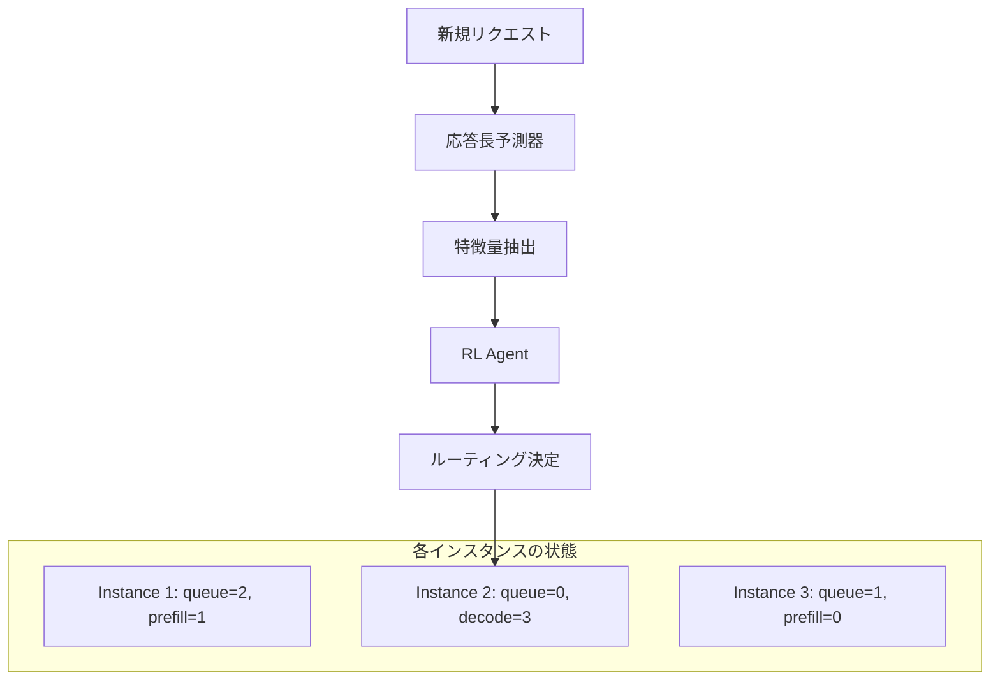

本記事は [Intelligent Router for LLM Workloads: Improving Performance Through Workload-Aware Load Balancing（arXiv:2408.13510）](https://arxiv.org/abs/2408.13510) の解説記事です。

## 論文概要（Abstract）

LLM推論は、入力トークンを一括処理するprefillフェーズと、出力トークンを逐次生成するdecodeフェーズという、計算・メモリ要求が大きく異なる2つのフェーズで構成される。しかし従来のスケジューリング手法はLLMリクエストをモノリシックな単位として扱い、このフェーズ特性を無視している。著者らのJain et al.は、**ヒューリスティックガイド付き強化学習ベースのインテリジェントルーター**を提案し、応答長予測器とワークロード相互作用モデリングを組み合わせたデータ駆動型スケジューリングを実現している。著者らの報告によると、パブリックデータセットで11%以上、実際のクラウドプロバイダワークロードで7.8%のエンドツーエンドレイテンシ削減が達成されている。

この記事は [Zenn記事: Nginx×njsでLLMゲートウェイを構築しマルチプロバイダAPI統合とストリーミング制御を実装する](https://zenn.dev/0h_n0/articles/15a8ec3ad38ba2) の深掘りです。

## 情報源

- **arXiv ID**: 2408.13510
- **URL**: [https://arxiv.org/abs/2408.13510](https://arxiv.org/abs/2408.13510)
- **著者**: Kunal Jain, Anjaly Parayil, Ankur Mallick, Esha Choukse, Xiaoting Qin, Jue Zhang, Íñigo Goiri, Rujia Wang, Chetan Bansal, Victor Rühle, Anoop Kulkarni, Steve Kofsky, Saravan Rajmohan
- **発表年**: 2024年（2024年8月24日投稿、2025年1月7日改訂）
- **分野**: cs.DC（分散・並列・クラスタコンピューティング）、eess.SY（システム・制御）

## 背景と動機（Background & Motivation）

LLM推論サービングのスケジューリングにおいて、従来のロードバランシング手法（ラウンドロビン、最小接続数、ランダム等）はHTTPリクエストの処理時間が比較的均一であることを前提としている。しかしLLM推論リクエストは、入力プロンプト長と出力生成長によって処理時間が数倍〜数十倍異なり、この前提が成り立たない。

さらに、LLM推論は以下の2つのフェーズに分かれ、それぞれの計算特性が異なる：

- **Prefillフェーズ**: 入力トークン全体を一括で処理し、KVキャッシュを構築する。**計算バウンド**（GPU演算能力がボトルネック）
- **Decodeフェーズ**: 出力トークンを1つずつ逐次生成する。**メモリバウンド**（KVキャッシュのメモリアクセスがボトルネック）

著者らは、この2フェーズの特性を考慮せずにスケジューリングすると、あるインスタンスにprefill重い（長い入力の）リクエストが集中し、別のインスタンスは軽い（短い入力の）リクエストのdecodeで遊んでいる、というアンバランスが生じることを指摘している。

重要な知見として著者らが示しているのは、**個別インスタンスのスケジューラ最適化よりも、インスタンス間のロードバランシング改善の方がレイテンシ削減効果が大きい**という点である。これは、NginxのようなL7ロードバランサーの設定がLLM推論パフォーマンスに直結することを意味する。

## 主要な貢献（Key Contributions）

- **貢献1**: LLM推論のprefill/decodeフェーズの負荷特性の違いがスケジューリングに与える影響の定量的分析
- **貢献2**: 応答長予測器を組み込んだヒューリスティックガイド付き強化学習（RL）ベースのルーティングアルゴリズムの提案
- **貢献3**: 異なるワークロードが同一インスタンス上で相互作用する効果をモデル化する新しい定式化の提案
- **貢献4**: LLM推論スケジューラのベンチマーキング標準の確立

## 技術的詳細（Technical Details）

### レイテンシの構成要素分析

著者らはまず、LLM推論のエンドツーエンドレイテンシを以下の要素に分解している：

$$
T_{\text{e2e}} = T_{\text{queue}} + T_{\text{prefill}} + T_{\text{decode}}
$$

ここで、
- $T_{\text{queue}}$: キュー待ち時間（他のリクエストの処理完了待ち）
- $T_{\text{prefill}}$: prefillフェーズの処理時間（入力長 $L_{\text{in}}$ に比例）
- $T_{\text{decode}}$: decodeフェーズの処理時間（出力長 $L_{\text{out}}$ に比例）

prefillの計算量は入力長に対して概ね二次的（Self-Attentionの $O(L^2)$ ）であるのに対し、decodeの計算量は出力長に対して線形である。したがって、入力が長いリクエストと短いリクエストでは、同一インスタンスへの負荷が大きく異なる。

### 応答長予測器

ルーティング決定時点では出力長が不明であるため、著者らは**学習可能な応答長予測器**を導入している：

$$
\hat{L}_{\text{out}} = f_\theta(x_{\text{prompt}}, L_{\text{in}}, \text{model\_id})
$$

ここで、
- $\hat{L}_{\text{out}}$: 予測出力トークン数
- $x_{\text{prompt}}$: 入力プロンプトの特徴量
- $L_{\text{in}}$: 入力トークン数
- $\text{model\_id}$: 対象モデルの識別子
- $\theta$: 予測器のパラメータ

この予測器により、ルーティング時点でリクエストの推定処理時間を事前に算出し、各インスタンスの将来の負荷を予測できる。

### ワークロード相互作用モデリング

同一インスタンスで複数リクエストが同時処理される場合、prefillとdecodeのリソース競合が発生する。著者らはこの相互作用を以下のようにモデル化している：

$$
T_{\text{effective}}(r_i, S_j) = T_{\text{isolated}}(r_i) \cdot g(S_j)
$$

ここで、
- $r_i$: 新規リクエスト
- $S_j$: インスタンス $j$ 上で現在処理中のリクエスト集合
- $T_{\text{isolated}}(r_i)$: $r_i$ が単独で処理された場合の推定処理時間
- $g(S_j)$: 既存ワークロード $S_j$ による干渉係数

干渉係数 $g(S_j)$ は、インスタンス上のprefillリクエスト数・decodeリクエスト数・KVキャッシュ使用率から推定される。prefill中のリクエストが多いインスタンスへのdecodeリクエストのルーティングは、メモリバンド幅の競合を引き起こすため、ペナルティが大きくなる。

### 強化学習ベースのルーティング

著者らは、上記の予測器とワークロードモデルをヒューリスティックとして組み込んだ強化学習エージェントでルーティングポリシーを学習する：

- **状態**: 各インスタンスのキュー長、処理中リクエストのフェーズ（prefill/decode）、KVキャッシュ使用率、新規リクエストの特徴量
- **行動**: リクエストのルーティング先インスタンスの選択
- **報酬**: エンドツーエンドレイテンシの負値（レイテンシが低いほど報酬が高い）

ヒューリスティックガイドにより、RLエージェントの探索空間が制約され、学習効率が向上する。

## 実装のポイント（Implementation）

### Nginxとの関連

Zenn記事で解説したNginxの `least_conn` ロードバランシングは、接続数のみを考慮する静的な手法である。Intelligent Routerの知見を活用すると、以下の改善が可能である：

1. **カスタムヘッダによるヒント**: クライアントがリクエストに `X-Estimated-Tokens` ヘッダを付与し、Nginxのnjsでルーティング判断に利用
2. **バックエンドメトリクスの取得**: vLLMやTGIのメトリクスエンドポイント（`/metrics`）から各インスタンスのKVキャッシュ使用率を取得し、ルーティングに反映
3. **重み付きロードバランシング**: GPU性能差（A100 vs T4）を `weight` パラメータで反映（論文のワークロード相互作用モデリングの簡易版）

ただし、Nginx単体では論文のRL ベースのルーティングは実現困難であり、Kubernetes環境ではNGINX Gateway Fabricのインテリジェントルーティング（EPP: Endpoint Picker）が同様のアプローチに近い。

### ベンチマーキング標準

著者らは、LLM推論スケジューラのベンチマーキング手法も提案している。特定のモデル・ハードウェア・スケジューラの組み合わせに対する最適ベースラインレイテンシを確立することで、新しいスケジューリングアルゴリズムの公平な比較が可能になる。

## 実験結果（Results）

### パブリックデータセットでの評価

| データセット特性 | ベースライン（Round Robin） | Intelligent Router | 改善率 |
|----------------|--------------------------|-------------------|--------|
| 混合ワークロード（公開データ） | 基準値 | -11%レイテンシ | 11%削減 |
| クラウドプロバイダ実ワークロード | 基準値 | -7.8%レイテンシ | 7.8%削減 |

著者らの報告によると、パブリックデータセットでは11%以上のエンドツーエンドレイテンシ削減が達成されている。クラウドプロバイダの実ワークロード（入力長・出力長の多様性が高い）では7.8%の改善が報告されている。

### インスタンスレベル vs クラスタレベルの最適化

著者らの分析の核心は、**インスタンス内のスケジューラ最適化よりも、インスタンス間のロードバランシング改善の方が効果が大きい**という知見である。これは、個々のvLLMインスタンスのバッチサイズやスケジューリングポリシーを調整するよりも、リクエストを適切なインスタンスに振り分けることの方が全体的なレイテンシに与える影響が大きいことを意味する。

### ワークロード相互作用の影響

prefill重いリクエスト（長い入力）とdecode重いリクエスト（長い出力）が同一インスタンスで混在する場合、相互の干渉によりレイテンシが最大30%悪化するケースが報告されている。Intelligent Routerはこの干渉を予測的に回避することで、スループットを維持しつつレイテンシを削減する。

## 実運用への応用（Practical Applications）

### Nginxロードバランシングの改善指針

この論文の知見は、Nginxベースのゲートウェイ設計に以下の示唆を与える：

1. **`least_conn` は次善の策**: LLM推論ではリクエストごとの処理時間が大きく異なるため、接続数ベースの `least_conn` はラウンドロビンよりは良いが、ワークロード特性を考慮したルーティングには及ばない
2. **KVキャッシュ使用率の監視**: バックエンド推論サーバーのKVキャッシュ使用率が高いインスタンスへの新規ルーティングを抑制する仕組みが有効
3. **長い入力の分散**: プロンプトが特に長い（例: RAGで大量のコンテキストを付与した）リクエストを特定のインスタンスに集中させない工夫が必要

### スケーラビリティ

クラスタサイズが増えるにつれ、ルーティング判断の複雑さも増す。論文のRLベースアプローチはクラスタサイズに対してスケーラブルだが、Nginxの静的設定ではインスタンスの動的な追加・削除への対応が難しい。Kubernetesの動的スケーリングと組み合わせる場合は、NGINX Gateway FabricやEnvoy AI Gatewayのようなクラウドネイティブなソリューションが適している。

## 関連研究（Related Work）

- **Llumnix** (Xing et al., 2024): 推論中のリクエストをインスタンス間でリアルタイムにマイグレーションするアプローチ。Intelligent Routerがルーティング時点での最適化に焦点を当てているのに対し、Llumnixは実行中のリバランシングを行う点が異なる
- **RouteBalance** (Da & Kalyvianaki, 2026, arXiv:2606.17949): モデルルーティングとロードバランシングを融合したアプローチ。Intelligent Routerが単一モデルの複数インスタンス間でのルーティングに焦点を当てているのに対し、RouteBalanceは異なるモデル間のルーティングとロードバランシングを統合している
- **LAPS** (2025, arXiv:2601.11589): 入力長を考慮したprefillスケジューリング。Intelligent Routerの応答長予測器と相補的なアプローチ

## まとめと今後の展望

Intelligent Routerは、LLM推論のprefill/decodeフェーズの負荷特性の違いを活用し、強化学習ベースのルーティングによりエンドツーエンドレイテンシを11%削減するアプローチである。特に「インスタンス間のロードバランシング改善の方がインスタンス内の最適化より効果が大きい」という知見は、NginxのようなL7ロードバランサーの設定がLLM推論パフォーマンスに直結することを示している。

Nginxの `least_conn` は実務上の出発点として有用だが、ワークロード特性を考慮したルーティングには、バックエンドメトリクスの取得と動的な重み付けの仕組みが必要である。将来的には、NGINX Gateway FabricのEPPやEnvoy AI Gatewayのトークンベースルーティングが、この論文のアプローチを本番環境で実現する方向に進化していくと考えられる。

## 参考文献

- **arXiv**: [https://arxiv.org/abs/2408.13510](https://arxiv.org/abs/2408.13510)
- **Related**: Da, W. & Kalyvianaki, E. (2026). "RouteBalance: Fused Model Routing and Load Balancing for Heterogeneous LLM Serving." arXiv:2606.17949
- **Related Zenn article**: [Nginx×njsでLLMゲートウェイを構築しマルチプロバイダAPI統合とストリーミング制御を実装する](https://zenn.dev/0h_n0/articles/15a8ec3ad38ba2)
