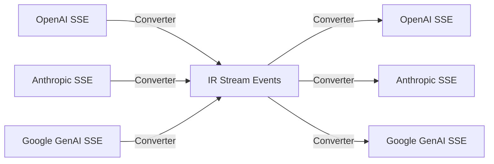

本記事は [LLM-Rosetta: A Hub-and-Spoke Intermediate Representation for Cross-Provider LLM API Translation（arXiv:2604.09360）](https://arxiv.org/abs/2604.09360) の解説記事です。

## 論文概要（Abstract）

LLMプロバイダが独自のAPI仕様を公開する現状では、複数プロバイダを統合するアプリケーションがベンダーロックインに陥りやすい。プロバイダ間の相互変換には通常 $O(N^2)$ のアダプタが必要になるが、著者のPeng Dingは、主要LLM APIが「大きな構文的差異にもかかわらず、共通のセマンティックコア」を共有していることを指摘し、ハブ＆スポーク型の中間表現（IR）による $O(N)$ 変換フレームワーク「LLM-Rosetta」を提案している。論文の報告によると、変換オーバーヘッドは100マイクロ秒未満で、ラウンドトリップの忠実度はロスレスであるとされている。

この記事は [Zenn記事: Nginx×njsでLLMゲートウェイを構築しマルチプロバイダAPI統合とストリーミング制御を実装する](https://zenn.dev/0h_n0/articles/15a8ec3ad38ba2) の深掘りです。

## 情報源

- **arXiv ID**: 2604.09360
- **URL**: [https://arxiv.org/abs/2604.09360](https://arxiv.org/abs/2604.09360)
- **著者**: Peng Ding
- **発表年**: 2026年（2026年4月10日投稿）
- **分野**: cs.SE（ソフトウェアエンジニアリング）、cs.AI（人工知能）

## 背景と動機（Background & Motivation）

LLMプロバイダのAPI仕様は、OpenAI Chat Completions、Anthropic Messages、Google GenAIなど、プロバイダごとに大きく異なる。たとえばシステムプロンプトの扱いについて、OpenAIは `messages` 配列内に `role: "system"` として含めるのに対し、Anthropicはトップレベルの `system` フィールドに分離する。ストリーミングレスポンスのSSEスキーマも、OpenAIは `delta` チャンク方式、Anthropicはタイプ付きイベント方式、Googleは `candidates` 累積方式と、それぞれ異なる。

$N$ 個のプロバイダ間で双方向の変換を実装する場合、素朴なアプローチでは $O(N^2)$ のアダプタペアが必要になる。現在のプロバイダ数は主要4社程度だが、各社がChat Completions形式とResponses形式を併存させるなど、APIバリアント数は増加傾向にあり、組み合わせ爆発は現実的な問題である。

従来のLiteLLMのようなツールは、各プロバイダからOpenAI形式への片方向変換（$O(N)$）を提供するが、双方向変換や中間表現を介した拡張性は限定的である。LLM-Rosettaは、この問題をソフトウェアエンジニアリングの観点からフォーマルに解決することを目指している。

## 主要な貢献（Key Contributions）

- **貢献1**: 主要LLM APIが共有する「セマンティックコア」の同定と、それを捉えるハブ＆スポーク型中間表現（IR）の設計。9種類のコンテントタイプと10種類のストリームイベントスキーマで構成
- **貢献2**: 各APIスタンダードを独立に追加可能な**モジュラーOps-composition**コンバータアーキテクチャの提案。新プロバイダ追加時の実装量が $O(1)$ に抑えられる
- **貢献3**: チャンクレベルのストリーミング変換のサポート。ステートフルなコンテキスト管理により、SSEストリーム中の部分的なイベントも正しく変換可能
- **貢献4**: 4つのAPIスタンダード（OpenAI Chat Completions、OpenAI Responses、Anthropic Messages、Google GenAI）に対するコンバータの実装と、Argonne National Laboratoryでの本番デプロイメント

## 技術的詳細（Technical Details）

### ハブ＆スポーク中間表現の設計

LLM-Rosettaの中核は、プロバイダ固有のAPI仕様を抽象化する中間表現（IR）である。IRは以下の2つのスキーマで構成される。

**9種類のコンテントモデル**:

各プロバイダのリクエスト・レスポンスに含まれる要素を以下のタイプに分類し、IR上で統一的に表現する。

| # | コンテントタイプ | 説明 | OpenAI対応 | Anthropic対応 |
|---|---------------|------|-----------|--------------|
| 1 | Message | ユーザー/アシスタントメッセージ | `messages[]` | `messages[]` |
| 2 | SystemPrompt | システムプロンプト | `messages[].role="system"` | `system` (top-level) |
| 3 | TextContent | テキストコンテンツ | `content: string` | `content[].type="text"` |
| 4 | ImageContent | 画像入力 | `content[].type="image_url"` | `content[].type="image"` |
| 5 | ToolCall | ツール呼び出し | `tool_calls[]` | `content[].type="tool_use"` |
| 6 | ToolResult | ツール実行結果 | `role="tool"` | `content[].type="tool_result"` |
| 7 | ReasoningTrace | 推論過程 | `reasoning` (Responses API) | `content[].type="thinking"` |
| 8 | GenerationControl | 生成パラメータ | `temperature`, `max_tokens` | `temperature`, `max_tokens` |
| 9 | Metadata | メタデータ | `usage`, `model` | `usage`, `model` |

**10種類のストリームイベントスキーマ**:

SSEストリーミングでは、プロバイダごとにイベントの構造が大きく異なる。LLM-Rosettaは以下の10種類のストリームイベントタイプを定義し、プロバイダ固有のSSEイベントをIRイベントに変換する。



### Ops-compositionコンバータアーキテクチャ

各プロバイダ用のコンバータは、小さな変換操作（Op）の合成（Composition）として構成される。

$$
\text{Convert}_{A \to B}(x) = \text{ToIR}_A(x) \circ \text{FromIR}_B(\cdot)
$$

ここで、
- $x$: 入力リクエスト/レスポンス
- $\text{ToIR}_A$: プロバイダAからIRへの変換関数
- $\text{FromIR}_B$: IRからプロバイダBへの変換関数

新プロバイダCを追加する場合、$\text{ToIR}_C$ と $\text{FromIR}_C$ の2関数のみを実装すれば、既存の全プロバイダとの相互変換が自動的に得られる。これがハブ＆スポーク方式の利点であり、$O(N^2)$ から $O(N)$ への計算量削減を実現している。

各コンバータ内部では、以下のようなOpチェーンが構成される：

```python
class OpenAIToIR:
    """OpenAI Chat Completions → IR 変換パイプライン"""
    ops = [
        ExtractSystemPrompt(),    # messages[role=system] → IR.SystemPrompt
        ConvertMessages(),         # messages[] → IR.Message[]
        MapToolCalls(),            # tool_calls[] → IR.ToolCall[]
        NormalizeParams(),         # temperature, max_tokens → IR.GenerationControl
        ExtractUsage(),            # usage → IR.Metadata
    ]

    def convert(self, request: dict) -> IRRequest:
        ir = IRRequest()
        for op in self.ops:
            ir = op.apply(request, ir)
        return ir
```

### ストリーミング変換のステートフル管理

SSEストリーミングでは、各チャンクが独立しておらず、前のチャンクのコンテキストに依存する場合がある。たとえばAnthropicの `content_block_delta` イベントは、先行する `content_block_start` で開始されたブロックのインデックスを参照する。

LLM-Rosettaでは、ストリーム変換中にステートフルなコンテキストマネージャを維持する：

```python
class StreamContext:
    """ストリーム変換の状態管理"""
    def __init__(self):
        self.active_blocks: dict[int, ContentBlock] = {}
        self.accumulated_usage: Usage = Usage()
        self.current_tool_call: ToolCall | None = None

    def process_chunk(self, chunk: ProviderChunk) -> IRStreamEvent:
        # チャンクをIRイベントに変換しつつ状態を更新
        ir_event = self.converter.to_ir(chunk, self)
        self.update_state(chunk)
        return ir_event
```

この設計により、ストリーミング途中でのツールコール開始・完了、推論トレースの断片的な配信、最終チャンクでの使用量メタデータ収集が正しく処理される。

## 実装のポイント（Implementation）

### パラメータ範囲の正規化

プロバイダ間で同名パラメータの有効範囲が異なるケースへの対処が重要である：

- **temperature**: OpenAI（0〜2）→ Anthropic（0〜1）。IR内で正規化し、変換時にクランプ
- **max_tokens**: OpenAIではオプション（デフォルトはモデル依存）、Anthropicでは必須。IR内でデフォルト値を保持
- **stop sequences**: OpenAIは文字列または配列、Anthropicは配列のみ。型の統一が必要

### エラーハンドリングの統一

各プロバイダのエラーレスポンス形式も異なるため、IRレベルでエラータイプを定義している。レート制限（429）、認証エラー（401/403）、サーバーエラー（500系）をプロバイダ非依存で扱える。

### 本番デプロイメント

論文によると、LLM-Rosettaは米国アルゴンヌ国立研究所（Argonne National Laboratory）で本番環境にデプロイされている。研究機関では複数のLLMプロバイダを使い分ける需要が高く、ベンダーロックインの回避が運用上の重要な要件となっているとされている。

## 実験結果（Results）

### ラウンドトリップ忠実度

著者の報告によると、4つのAPIスタンダード間でのラウンドトリップ変換（A→IR→B→IR→A）において、**ロスレスの忠実度**が達成されているとされている。これは、IRが各プロバイダのセマンティックコアを過不足なく捉えていることを示唆している。

### 変換オーバーヘッド

| 指標 | LLM-Rosetta | LiteLLM（比較対象） |
|------|------------|------------------|
| 変換方式 | 双方向（IR経由） | 片方向（→OpenAI形式） |
| オーバーヘッド | 100μs未満 | 同等水準 |
| ストリーミング対応 | チャンクレベル | サポートあり |
| プロバイダ中立性 | あり | OpenAI中心 |

著者の報告では、変換オーバーヘッドは100マイクロ秒未満であり、LiteLLMのシングルパスアプローチと競合する水準とされている。LLM APIの応答時間が通常数百ミリ秒〜数十秒であることを考えると、変換のレイテンシ影響は無視できるレベルである。

### Open Responses準拠

LLM-RosettaはOpen Responsesコンプライアンススイートに合格しており、標準化されたテストベンチマークでの互換性が検証されている。

## 実運用への応用（Practical Applications）

### Nginxゲートウェイとの統合

Zenn記事で解説したNginx + njsベースのLLMゲートウェイでは、プロバイダ間のリクエスト変換をnjsスクリプト内にハードコードしている。LLM-Rosettaのアプローチを適用すれば、IR経由の変換ロジックをライブラリとして分離し、njsスクリプトの保守性を向上させることが可能である。

### マルチプロバイダフェイルオーバー

プライマリプロバイダ（例: OpenAI）が障害でダウンした場合に、IR経由でセカンダリプロバイダ（例: Anthropic）に透過的にフェイルオーバーできる。IRがセマンティックコアを保持しているため、プロバイダ固有のパラメータ差異（`temperature` の範囲、`system` メッセージの位置等）が自動的に吸収される。

### コスト最適化ルーティング

IRを介した変換が低コスト（100μs未満）であることを活用し、リクエスト内容に応じてコスト効率の高いプロバイダへ動的にルーティングするアーキテクチャが実現可能である。たとえば、簡易な質問はClaude 3.5 Haiku（低コスト）、複雑な推論タスクはClaude Opus（高精度）に振り分ける、といったルーティングが、クライアント側の変更なしに実装できる。

## 関連研究（Related Work）

- **LiteLLM**: Pythonベースのマルチプロバイダ統一ライブラリ。100以上のプロバイダをOpenAI互換のインターフェースに変換する。片方向変換のため、双方向変換やプロバイダ中立性ではLLM-Rosettaが優位。ただしエコシステムの成熟度とコミュニティサイズではLiteLLMが上回る
- **STREAM** (Nassar et al., 2026, arXiv:2606.13968): ローカル・HPC・クラウドの3層推論ミドルウェア。WebSocketリレーによるストリーミングとOpenAI互換エンドポイント公開を実装しており、API変換層の必要性を別の角度から示している
- **Portkey AI Gateway**: プロダクション向けのオープンソースAIゲートウェイ。LLM-Rosettaと類似のプロバイダ統合を提供するが、スタンドアロンのフレームワークではなくフルスタックのゲートウェイ製品である

## まとめと今後の展望

LLM-Rosettaは、LLMプロバイダ間のAPI互換性問題を、ハブ＆スポーク型の中間表現で体系的に解決するフレームワークである。$O(N^2)$ の組み合わせ爆発を $O(N)$ に削減し、100マイクロ秒未満のオーバーヘッドでロスレスなラウンドトリップ変換を実現しているとされる。

Nginxベースのゲートウェイにおけるnjsスクリプトでのプロバイダ変換は、LLM-Rosettaが形式化した問題の実践的な解法であり、両者の知見を組み合わせることで、より保守性と拡張性の高いマルチプロバイダLLMゲートウェイの構築が期待できる。

今後の研究方向としては、マルチモーダル入力（画像・音声・動画）のIR拡張、エージェント間プロトコル（MCP、A2A）への対応、セマンティックキャッシュとの統合が著者により示唆されている。

## 参考文献

- **arXiv**: [https://arxiv.org/abs/2604.09360](https://arxiv.org/abs/2604.09360)
- **Related**: LiteLLM — [https://github.com/BerriAI/litellm](https://github.com/BerriAI/litellm)
- **Related Zenn article**: [Nginx×njsでLLMゲートウェイを構築しマルチプロバイダAPI統合とストリーミング制御を実装する](https://zenn.dev/0h_n0/articles/15a8ec3ad38ba2)
