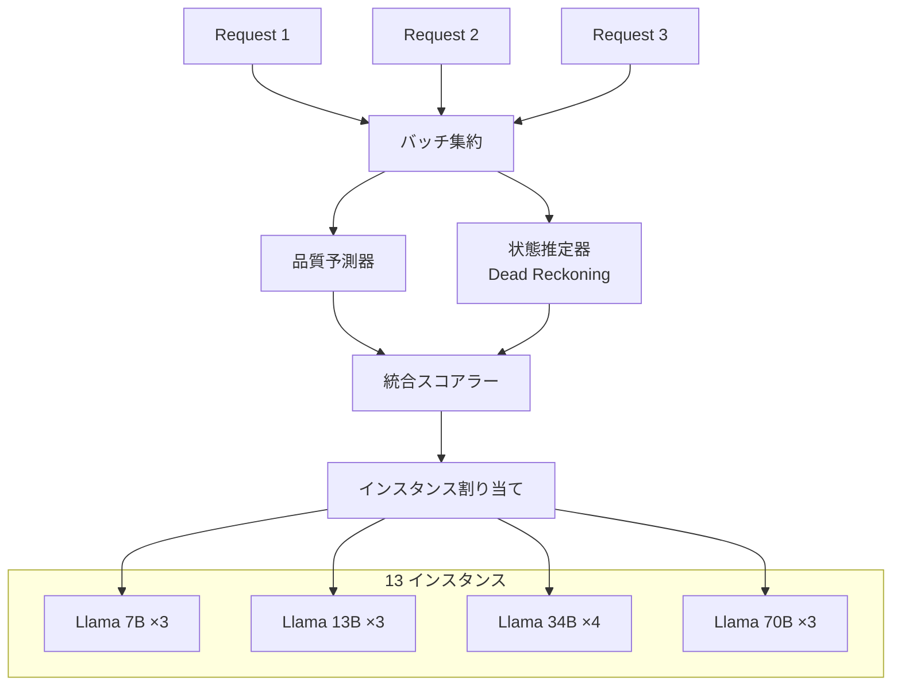

本記事は [RouteBalance: Fused Model Routing and Load Balancing for Heterogeneous LLM Serving（arXiv:2606.17949）](https://arxiv.org/abs/2606.17949) の解説記事です。

## 論文概要（Abstract）

異種LLMサービングスタックでは、モデルルーターとロードバランサーが2層に分離され、それぞれが独立に最適化している。モデルルーターは品質とコストのシグナルに基づいてモデルを選択するがインスタンスの負荷を無視し、ロードバランサーはキュー最適化を行うが品質を無視する。著者のWei DaとEvangelia Kalyvianakiは、両機能を**具体的なモデルインスタンスに対する単一のオンライン割り当て問題**として融合するRouteBalanceを提案している。13インスタンス・28GPUの異種クラスタでの評価において、著者らの報告によると、バランス設定で2.8秒のレイテンシ・30 req/sのスループットを達成し、高負荷時にはベースラインの2.6〜4.1倍のスループット優位性が確認されている。

この記事は [Zenn記事: Nginx×njsでLLMゲートウェイを構築しマルチプロバイダAPI統合とストリーミング制御を実装する](https://zenn.dev/0h_n0/articles/15a8ec3ad38ba2) の深掘りです。

## 情報源

- **arXiv ID**: 2606.17949
- **URL**: [https://arxiv.org/abs/2606.17949](https://arxiv.org/abs/2606.17949)
- **著者**: Wei Da, Evangelia Kalyvianaki
- **発表年**: 2026年（2026年6月16日投稿）
- **分野**: cs.DC（分散・並列・クラスタコンピューティング）

## 背景と動機（Background & Motivation）

大規模なLLMサービング環境では、異なるサイズのモデル（例: 7B、13B、34B、70B）が異なるGPU（A100、H100、T4等）にデプロイされた異種クラスタを運用するのが一般的である。このような環境では、2つの最適化問題が分離して解かれている：

**モデルルーティング（Model Routing）**: リクエストの内容と品質要件に基づいて、どのモデル（例: GPT-4o vs Claude Sonnet vs Llama 70B）を使うかを選択する。品質とコストのトレードオフを最適化する。

**ロードバランシング（Load Balancing）**: 選択されたモデルの複数インスタンス間で、どのインスタンスにリクエストを送るかを決定する。キュー長とレイテンシを最適化する。

問題は、この2層の分離により**情報の断絶**が生じることである。モデルルーターが「品質は高いがコストも高い」モデルAを選択しても、そのモデルの全インスタンスが高負荷であれば、レイテンシが急増する。逆に、品質は少し劣るモデルBのインスタンスが空いている場合、品質とレイテンシのトータルバランスではモデルBの方が良い選択になりうる。

Zenn記事で解説したNginxの設定は、この2層分離の典型例である。njsスクリプトでモデル名ベースのルーティング（= モデルルーティング）を行い、`upstream` ブロックの `least_conn`（= ロードバランシング）で各モデルのインスタンス間の分散を行っている。RouteBalanceの知見は、この分離がどのような非効率を生むかを定量的に示している。

## 主要な貢献（Key Contributions）

- **貢献1**: モデルルーティングとロードバランシングを**具体的なモデルインスタンス**に対する単一のオンライン割り当て問題として定式化。品質・レイテンシ・コストの3次元を同時に最適化
- **貢献2**: **バッチ処理型インプロセス予測器スタック**とデッドレコニング型インスタンス状態の導入により、意思決定のオーバーヘッドを1サイクルあたり約32msに抑制
- **貢献3**: 13インスタンス・28GPUの異種クラスタ（4つのモデルサイズ）での実験評価。品質-コスト-スループットの3次元フロンティアの上位領域をトレース

## 技術的詳細（Technical Details）

### 問題の定式化

RouteBalanceは、各リクエスト $r$ に対して、具体的なモデルインスタンス $i$ を選択する割り当て関数 $\pi$ を学習する：

$$
\pi^* = \arg\max_\pi \sum_{r \in R} \left[ \alpha \cdot Q(r, m_i) - \beta \cdot C(r, m_i) - \gamma \cdot L(r, i) \right]
$$

ここで、
- $R$: リクエスト集合
- $m_i$: インスタンス $i$ が提供するモデル
- $Q(r, m_i)$: リクエスト $r$ をモデル $m_i$ で処理した場合の品質スコア
- $C(r, m_i)$: 推論コスト
- $L(r, i)$: インスタンス $i$ の現在の負荷に基づく推定レイテンシ
- $\alpha, \beta, \gamma$: 品質・コスト・レイテンシの重み係数（プリセットで設定）

従来の2層方式では：
1. モデルルーター: $m^* = \arg\max_m [\alpha \cdot Q(r, m) - \beta \cdot C(r, m)]$ （レイテンシ $L$ を無視）
2. ロードバランサー: $i^* = \arg\min_{i: m_i = m^*} L(r, i)$ （品質とコストを無視）

この分離により、品質・コストの最適化とレイテンシの最適化が独立に行われ、グローバル最適からの乖離が生じる。RouteBalanceは単一の目的関数で3次元を同時に最適化することで、この問題を解消する。

### バッチ処理型予測器スタック

リクエストごとに全インスタンスの状態を評価すると、インスタンス数 $N$ に対して $O(N)$ のオーバーヘッドが発生する。RouteBalanceは以下の手法でこのコストを削減している：

**デッドレコニング（Dead Reckoning）型インスタンス状態**:

各インスタンスの状態を毎回フル取得するのではなく、最後の観測値から時間経過に基づいて推定する。

$$
\hat{S}_i(t) = S_i(t_{\text{last}}) + \Delta(t - t_{\text{last}})
$$

ここで、
- $\hat{S}_i(t)$: 時刻 $t$ におけるインスタンス $i$ の推定状態
- $S_i(t_{\text{last}})$: 最後に観測された実状態
- $\Delta$: 時間経過に基づく状態変化の推定量（キュー内リクエストの処理速度から推定）

**バッチ処理型予測**:

複数の到着リクエストをバッチ化し、予測器の推論を一括で行う。これにより、予測器の推論オーバーヘッドがバッチサイズで均等分割される。

著者らの報告によると、この最適化により、12 req/sの到着レートで1意思決定サイクルあたり約32msのオーバーヘッドに抑制されている。

### レイテンシプライシング

RouteBalanceの中核的な洞察は、**モデル選択の時点でレイテンシをコストに変換する**ことである。

$$
\text{EffectiveCost}(r, i) = C_{\text{token}}(r, m_i) + \lambda \cdot L(r, i)
$$

ここで $\lambda$ はレイテンシの金銭的価値（latency pricing coefficient）である。この定式化により、「高品質だが遅い」選択と「低品質だが速い」選択を同一の尺度で比較できる。

著者らのアブレーション研究によると、このレイテンシプライシングがRouteBalanceの性能向上の主要因であり、レイテンシプライシングなしではベースラインとの差が大幅に縮小するとされている。

## 実装のポイント（Implementation）

### Nginxとの関連

Zenn記事で解説したNginxの構成との対比を整理する：

| 機能 | Nginx + njs | RouteBalance |
|------|-----------|-------------|
| モデルルーティング | njsスクリプト（静的マッピング） | 品質・コスト・負荷の統合スコア |
| ロードバランシング | `upstream` の `least_conn` | デッドレコニング型状態推定 |
| 品質考慮 | なし（モデル名で固定） | 品質予測器による動的評価 |
| コスト考慮 | なし | トークンコスト + レイテンシコスト |
| 融合 | 2層分離 | 単一割り当て問題 |

Nginxの `least_conn` は接続数のみを考慮し、リクエストの特性（入力長、出力長、モデルサイズ）を無視する。RouteBalanceの知見を部分的にNginxに適用するには：

1. **重み付きルーティング**: GPU性能差を `weight` で反映（例: A100は `weight=5`、T4は `weight=1`）
2. **njsでの負荷チェック**: 各バックエンドの `/metrics` エンドポイントを定期取得し、高負荷インスタンスへのルーティングを抑制
3. **フェイルオーバーとしての品質ダウングレード**: プライマリモデル（高品質・高コスト）が高負荷の場合、セカンダリモデル（低品質・低コスト）にフォールバック

ただし、RouteBalanceの完全な3次元最適化はNginx単体では実現困難であり、カスタムのルーティングレイヤー（例: Python/Goで実装したサイドカー）またはKubernetes上の専用ルーターが必要となる。

### コード公開

著者らはRouteBalanceのコードを [https://github.com/AKafakA/route-balance](https://github.com/AKafakA/route-balance) で公開している。

## 実験結果（Results）

### 実験環境

- **クラスタ構成**: 13インスタンス、28 GPU
- **モデルサイズ**: 4種類（7B、13B、34B、70Bパラメータ）
- **ベースライン**: BEST-Route（品質最適化のみ）、least_conn（負荷最適化のみ）、ランダム等

### 品質-コスト-スループットフロンティア

| プリセット | DeepEvalスコア | レイテンシ | スループット | コスト |
|----------|--------------|----------|------------|------|
| 品質優先 | 最高 | 高 | 中 | 高 |
| **バランス** | **0.419** | **2.8秒** | **30 req/s** | 中 |
| コスト優先 | 中 | 低 | 高 | 最低 |

著者らの報告によると、バランスプリセットでのDeepEvalスコアは0.419で、最強ベースラインに対して+0.013の改善（95%信頼区間 [+0.005, +0.022]）が確認されている。

### 高負荷時のスループット優位性

著者らの実験では、高負荷時にRouteBalanceは強化版BEST-Routeベースラインに対して**2.6〜4.1倍のスループット優位性**を示したと報告されている。これは、従来のモデルルーターが負荷を考慮せずに高品質モデルにリクエストを集中させるのに対し、RouteBalanceが負荷分散を品質判断に統合することで、クラスタ全体のリソース利用効率を向上させているためと考えられる。

### アブレーション研究

著者らのアブレーション研究では、RouteBalanceの性能向上の主要因は「モデル選択時のレイテンシプライシング」であることが示されている。レイテンシプライシングを除去すると、品質スコアは維持されるがスループットが大幅に低下し、従来の2層分離方式に近い挙動になるとされている。

## 実運用への応用（Practical Applications）

### マルチモデルゲートウェイへの適用

Zenn記事のNginxゲートウェイ構成では、OpenAI・Anthropic・ローカルモデル（Ollama/vLLM）を単一エンドポイントに統合している。RouteBalanceの知見を適用すると、以下のような動的ルーティングが実現可能である：

- **通常時**: 品質の高いClaude Sonnet（Anthropic）にルーティング
- **Anthropic高負荷時**: 品質をわずかに犠牲にしてGPT-4o-mini（OpenAI）に自動切替
- **両社高負荷/障害時**: ローカルモデル（Llama 3）にフォールバック

この自動判断は、従来のnjsスクリプトでのステータスコードベースのフェイルオーバー（5xxで切替）よりも、負荷の段階的な増加に対してプロアクティブに対応できる。

### コスト最適化の実践

RouteBalanceのコスト優先プリセットは、最安値ベースラインとタイのコストで中程度の品質を維持するとされている。これは実務上、「トークンコストを最小化しつつ、品質をSLA未満にしない」という要件に直接対応する。Nginxの設定に翻訳すると、njsスクリプト内でリクエスト内容の複雑さを簡易判定し、簡易リクエストは低コストモデル、複雑リクエストは高品質モデルに振り分ける、というコストルーティングに該当する。

## 関連研究（Related Work）

- **Intelligent Router** (Jain et al., 2024, arXiv:2408.13510): 単一モデルの複数インスタンス間でのワークロード特性考慮型ルーティング。RouteBalanceは複数モデル・複数インスタンスの統合最適化に拡張している点が異なる
- **PROTEUS** (2025, arXiv:2601.19402): SLA認識型のラグランジュRLを用いたマルチLLMルーティング。RL手法が異なるが、品質とレイテンシの同時最適化という目標は共通
- **Lodestar** (2026, arXiv:2606.00946): オンライン学習型のLLM推論ルーター。RouteBalanceがバッチ処理型予測器を使うのに対し、Lodestarはリクエストごとのオンライン学習を採用

## まとめと今後の展望

RouteBalanceは、モデルルーティングとロードバランシングの「2層分離」が引き起こす非効率を定量的に示し、両者を単一の割り当て問題として融合するアプローチを提案している。13インスタンス・28GPUの異種クラスタでの評価では、品質-コスト-スループットの3次元フロンティアの上位領域をトレースし、高負荷時にベースラインの2.6〜4.1倍のスループットを達成したと報告されている。

Zenn記事で解説したNginx + njsのゲートウェイ構成は、まさにRouteBalanceが問題視する「2層分離」の構造を採用している。NginxのnjsスクリプトでモデルルーティングとRBACを実装し、`upstream` の `least_conn` でロードバランシングを行う、という分離がスケールアップ時に非効率を生むことは、RouteBalanceの分析が示す通りである。小〜中規模ではこの分離で十分だが、大規模な異種クラスタでは融合型のスケジューリングが必要になることを、本論文は実験的に裏付けている。

## 参考文献

- **arXiv**: [https://arxiv.org/abs/2606.17949](https://arxiv.org/abs/2606.17949)
- **Code**: [https://github.com/AKafakA/route-balance](https://github.com/AKafakA/route-balance)
- **Related**: Jain, K. et al. (2024). "Intelligent Router for LLM Workloads." arXiv:2408.13510
- **Related Zenn article**: [Nginx×njsでLLMゲートウェイを構築しマルチプロバイダAPI統合とストリーミング制御を実装する](https://zenn.dev/0h_n0/articles/15a8ec3ad38ba2)
