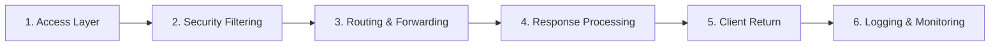

本記事は [AI Gateway Deep Dive (2026): Architecture, Product Comparison, and Production Practices（jimmysong.io、2025年6月29日公開、2025年8月23日更新）](https://jimmysong.io/blog/ai-gateway-in-depth/) の解説記事です。

## ブログ概要（Summary）

クラウドネイティブ領域のエキスパートであるJimmy Song氏が執筆した本記事は、2026年時点のAI Gateway技術を包括的に分析する約8,600語の解説記事である。Envoy AI Gateway、Apache APISIX、Kong AI Gateway、Solo.io Gloo、F5 NGINX AI Gateway、Traefik Hub、MLflow AI Gateway、Portkey AI Gatewayの**8製品を比較**し、AI Gatewayの**6段階処理パイプライン**を定義している。さらに、金融サービスでの適用シナリオを含む**本番運用プラクティス**と、エコシステムの成熟度不足や標準化の遅れなど**8つの本番課題**を指摘している。

この記事は [Zenn記事: Nginx×njsでLLMゲートウェイを構築しマルチプロバイダAPI統合とストリーミング制御を実装する](https://zenn.dev/0h_n0/articles/15a8ec3ad38ba2) の深掘りです。

## 情報源

- **種別**: 個人テックブログ（クラウドネイティブ専門家）
- **URL**: [https://jimmysong.io/blog/ai-gateway-in-depth/](https://jimmysong.io/blog/ai-gateway-in-depth/)
- **著者**: Jimmy Song（クラウドネイティブ・サービスメッシュ専門家）
- **発表日**: 2025年6月29日（2025年8月23日更新）

## 技術的背景（Technical Background）

API Gatewayはマイクロサービスアーキテクチャの普及とともに標準インフラとなった。Kong、Envoy、NGINXなどは従来のREST/gRPC APIのトラフィック管理を担ってきたが、LLMの普及により新たな要件が生まれている。

従来のAPI Gatewayとの主要な違いは以下の3点である：

1. **トークンベースの課金**: HTTPリクエスト数ではなく、入力・出力トークン数に基づく課金。1リクエストのコストが$0.001〜$10以上と数桁異なる
2. **ストリーミングレスポンス**: SSE（Server-Sent Events）による長時間の接続維持。従来のリクエスト-レスポンスモデルと異なる
3. **プロバイダ間のAPI非互換**: OpenAI、Anthropic、Google等でリクエスト・レスポンス形式が異なる

これらの新要件に対し、既存のAPI GatewayにAI機能をプラグインとして追加するアプローチ（Kong、APISIX等）と、AI専用のGatewayをゼロから構築するアプローチ（Portkey、Bifrost等）が競合している。

Song氏は、AI GatewayがAPIGatewayから自然に進化したものであり、マイクロサービス時代にAPI Gatewayが台頭したのと同様のパターンであると分析している。

## 実装アーキテクチャ（Architecture）

### 6段階処理パイプライン

Song氏が定義するAI Gatewayの標準的な処理パイプラインは以下の6段階で構成される。



**1. Access Layer（アクセス層）**:
API Key/JWT検証、リクエストパースを行う。トークンベースのレート制限もこの段階で判定される。

**2. Security Filtering & Enhancement（セキュリティフィルタリング）**:
PII（個人識別情報）マスキング、不適切コンテンツブロック、プロンプト前処理を実行する。プロンプトインジェクション防御もこの段階に含まれる。

**3. Routing & Forwarding（ルーティング・転送）**:
リクエスト特性に基づいて適切なLLMサービスを選択し、プロバイダ認証の付与とプロトコル変換を行う。Zenn記事で解説したnjsベースのモデルルーティングはこの段階に相当する。

**4. Response Processing（レスポンス処理）**:
コンテンツレビュースキャン、結果変換、セマンティックキャッシュへの格納を行う。

**5. Client Return（クライアント返却）**:
SSEストリーミングレスポンスのクライアントへの返却。リアルタイム出力の維持が重要。

**6. Logging & Monitoring（ログ・監視）**:
OpenTelemetry経由でコールログ、メトリクス、監査レコードを監視システムに送信する。

### 8製品の機能比較

Song氏の分析に基づく主要8製品の比較を以下にまとめる。

| 製品 | ライセンス | 言語 | オーバーヘッド | トークンベースレート制限 | セマンティックキャッシュ | プロンプトガード |
|------|----------|------|-------------|---------------------|---------------------|---------------|
| **Envoy AI Gateway** | Apache v2 | Go/C++ | 1-3ms | ネイティブ | なし | なし |
| **Apache APISIX** | Apache v2 | Lua/C | 1-2ms | プラグイン | なし | なし |
| **Kong AI Gateway** | Apache v2 / Enterprise | Go/Lua | 2-5ms | プラグイン | Enterprise版 | Enterprise版 |
| **Solo.io Gloo** | Commercial | Go | 2-4ms | あり | あり | あり |
| **F5 NGINX** | Commercial | C/njs | 1-3ms | OpenResty必要 | なし | 外部WAF |
| **Traefik Hub** | Commercial SaaS | Go | 2-4ms | あり | なし | なし |
| **MLflow AI Gateway** | Apache v2 | Python | 5-10ms | なし | なし | なし |
| **Portkey** | MIT | TypeScript | 2-5ms | あり | あり | あり |

**Zenn記事との関連**: Zenn記事で解説したNginx + njsの構成は、上記のF5 NGINX行に該当する。OSS版のNginxでは、トークンベースのレート制限にOpenResty（Lua）が必要であり、セマンティックキャッシュやプロンプトガードは外部実装が必要となる。

### 4つの必須機能領域

Song氏は、AI Gatewayに不可欠な4つの機能領域を定義している。

**1. 統一マルチモデル統合**:
プロバイダ間のAPI差異を吸収し、アプリケーションが標準化されたゲートウェイインターフェースを呼び出せるようにする。Zenn記事のnjsベースのリクエスト変換がこれに該当する。

**2. トラフィックガバナンス・信頼性**:
リクエスト内容やポリシーに基づくインテリジェントルーティング、動的な重み付けによるマルチモデルロードバランシング、自動リトライ・フェイルオーバー、トークンベースのレート制限・クォータ制御が含まれる。

**3. セキュリティ・コンプライアンス**:
認証・認可統合、プロンプト内のPII検出・マスキング、モデル出力のコンテンツセーフティレビュー、プロンプトテンプレート・デコレータ機構が含まれる。

**4. オブザーバビリティ・ガバナンス**:
アプリケーション/ユーザー単位のリアルタイムトークン消費追跡、リクエスト/レスポンスのアーカイブ付き詳細ログ、OpenTelemetry統合、コンプライアンス向け監査証跡が含まれる。

## パフォーマンス最適化（Performance）

### オーバーヘッド分析

Song氏の調査によると、AI Gatewayのプロキシオーバーヘッドは製品によって1〜10msの範囲にある。LLM推論のレイテンシ（通常数百ミリ秒〜数十秒）と比較すると、ゲートウェイのオーバーヘッドは相対的に小さい。

ただし、以下の処理がオーバーヘッドを増大させる要因として指摘されている：

- **コンテンツスキャン**: PII検出やプロンプトインジェクション検査で10〜100msの追加レイテンシ
- **RAGクエリ**: ベクターデータベースへの検索が100〜500msの追加レイテンシ
- **セマンティックキャッシュ**: エンベディング計算とベクター検索で50〜200msの追加レイテンシ
- **複雑なポリシー評価**: 複合条件のポリシー判定でテールレイテンシが増加

### Envoy AI Gatewayのベンチマーク

Song氏が引用するベンチマークによると、Envoy AI Gatewayの2026年7月のテストでは、実GPU推論バックエンドに対するストリーミングで約2msのオーバーヘッドが計測されており、20msの予算内に収まっているとされている。

## 運用での学び（Production Lessons）

### 金融サービスでの適用シナリオ

Song氏は、金融サービス企業がEnvoy AI Gatewayを導入して企業内Q&Aシステムを管理するシナリオを紹介している：

- **インテリジェントルーティング**: 簡単な質問は低コストのローカルモデルに、複雑な質問はOpenAIに、障害時は自動フェイルオーバー
- **データ匿名化**: 外部モデル呼び出し前にPIIを除去し、機密情報の漏洩を防止
- **コンテンツレビュー**: 出力フィルタリングで機密情報のレスポンスへの含有を防止
- **部署単位ガバナンス**: トークン使用量を部署単位で追跡し、クォータを強制

### 8つの本番課題

Song氏は、AI Gateway導入時の8つの本番課題を指摘している。

| # | 課題 | 詳細 |
|---|------|------|
| 1 | エコシステムの未成熟 | Envoy AI Gateway 0.2など、多くのプロジェクトが本番実績不足 |
| 2 | 標準の断片化 | インターフェース仕様が統一されておらず、ベンダーロックインのリスク |
| 3 | パフォーマンスオーバーヘッド | コンテンツスキャン・RAGクエリがテールレイテンシを増大 |
| 4 | コンテンツセキュリティの複雑さ | 単純なキーワードブロッキングは変種に対して無効 |
| 5 | 運用の複雑さ | ビジネス規模の拡大に伴い設定管理が肥大化 |
| 6 | コスト対効果の定量化困難 | ゲートウェイのメンテナンスコストが便益を上回る可能性 |
| 7 | スキルギャップ | チームにゲートウェイ運用の経験が不足 |
| 8 | ROI計算の困難さ | 小規模デプロイメントではゲートウェイの投資を正当化できない |

**Zenn記事との関連**: Zenn記事で解説したNginx + njsアプローチは、課題1（未成熟なエコシステム）と課題5〜8（運用の複雑さ・コスト）を回避できるが、課題3（パフォーマンスオーバーヘッド）と課題4（コンテンツセキュリティ）は自前での実装が必要となる。

## 学術研究との関連（Academic Connection）

### ルーティングアルゴリズムの発展

Song氏が言及する「リクエスト内容やポリシーに基づくインテリジェントルーティング」は、学術研究で活発に研究されている分野である。

- **Intelligent Router** (Jain et al., 2024, arXiv:2408.13510): LLM推論のワークロード特性を考慮した強化学習ベースのルーティングで、11%のレイテンシ削減を報告
- **RouteBalance** (Da & Kalyvianaki, 2026, arXiv:2606.17949): モデルルーティングとロードバランシングを統合し、品質・レイテンシ・コストの3次元フロンティアを最適化
- **PROTEUS** (2025, arXiv:2601.19402): SLA認識型のラグランジュRL を用いたマルチLLMルーティング

Song氏の分析では、これらの学術的手法はまだ本番ゲートウェイ製品に統合されておらず、実装と研究の間にギャップがあることが示唆されている。

### API変換の形式化

Song氏が「プロバイダ間のAPI差異を吸収する」と述べている機能は、LLM-Rosetta（Ding, 2026, arXiv:2604.09360）が中間表現（IR）として形式化している。Kong AI Gatewayの「AI Request/Response Transformers」やPortkeyの「Multi-provider integration」は、いずれもこの問題の実装である。

## Production Deployment Guide

### AWS実装パターン（コスト最適化重視）

AI Gatewayの推奨AWS構成をトラフィック量別に示す。

| 規模 | 月間リクエスト | 推奨構成 | 月額コスト概算 | 主要サービス |
|------|--------------|---------|--------------|------------|
| **Small** | ~3,000 (100/日) | Serverless | $50-150 | Lambda + API Gateway + DynamoDB |
| **Medium** | ~30,000 (1,000/日) | Container | $400-900 | ECS Fargate (Envoy/NGINX) + ALB + ElastiCache |
| **Large** | 300,000+ (10,000/日) | Kubernetes | $2,500-6,000 | EKS + Envoy AI Gateway + Karpenter |

**Medium構成の詳細**（月額$400-900）:
- **ECS Fargate**: Envoy AI GatewayまたはNGINX + njsコンテナ、1 vCPU / 2GB RAM × 2タスク（$180/月）
- **ALB**: Application Load Balancer + WAF統合（$40/月）
- **ElastiCache Redis**: セマンティックキャッシュ用、cache.t3.small（$30/月）
- **Secrets Manager**: マルチプロバイダAPIキー管理（$10/月）
- **CloudWatch**: Container Insights有効化（$20/月）
- **LLM APIコスト**: プロバイダ利用分（$200-600/月）

**コスト試算の注意事項**:
- 上記は2026年10月時点のAWS ap-northeast-1（東京）リージョン料金に基づく概算値です
- 実際のコストはトラフィックパターン、LLMプロバイダ料金、バースト使用量により変動します
- 最新料金は [AWS料金計算ツール](https://calculator.aws/) で確認してください

### Terraformインフラコード

**Medium構成: ECS Fargate + Envoy AI Gateway**

```hcl
module "vpc" {
  source  = "terraform-aws-modules/vpc/aws"
  version = "~> 5.0"

  name = "ai-gateway-vpc"
  cidr = "10.0.0.0/16"
  azs  = ["ap-northeast-1a", "ap-northeast-1c"]
  public_subnets  = ["10.0.1.0/24", "10.0.2.0/24"]
  private_subnets = ["10.0.10.0/24", "10.0.11.0/24"]

  enable_nat_gateway   = true
  single_nat_gateway   = true
  enable_dns_hostnames = true
}

resource "aws_iam_role" "ecs_task" {
  name = "ai-gateway-task-role"
  assume_role_policy = jsonencode({
    Version = "2012-10-17"
    Statement = [{
      Action = "sts:AssumeRole"
      Effect = "Allow"
      Principal = { Service = "ecs-tasks.amazonaws.com" }
    }]
  })
}

resource "aws_iam_role_policy" "secrets_read" {
  role = aws_iam_role.ecs_task.id
  policy = jsonencode({
    Version = "2012-10-17"
    Statement = [{
      Effect   = "Allow"
      Action   = ["secretsmanager:GetSecretValue"]
      Resource = aws_secretsmanager_secret.api_keys.arn
    }]
  })
}

resource "aws_secretsmanager_secret" "api_keys" {
  name = "ai-gateway/provider-api-keys"
}

resource "aws_ecs_cluster" "main" {
  name = "ai-gateway-cluster"
  setting {
    name  = "containerInsights"
    value = "enabled"
  }
}

resource "aws_ecs_task_definition" "gateway" {
  family                   = "ai-gateway"
  network_mode             = "awsvpc"
  requires_compatibilities = ["FARGATE"]
  cpu                      = "1024"
  memory                   = "2048"
  execution_role_arn       = aws_iam_role.ecs_task.arn
  task_role_arn            = aws_iam_role.ecs_task.arn

  container_definitions = jsonencode([{
    name  = "ai-gateway"
    image = "${var.ecr_repo_url}:latest"
    portMappings = [{ containerPort = 8080, protocol = "tcp" }]
    secrets = [
      { name = "OPENAI_API_KEY",    valueFrom = "${aws_secretsmanager_secret.api_keys.arn}:OPENAI_API_KEY::" },
      { name = "ANTHROPIC_API_KEY", valueFrom = "${aws_secretsmanager_secret.api_keys.arn}:ANTHROPIC_API_KEY::" }
    ]
    logConfiguration = {
      logDriver = "awslogs"
      options = {
        "awslogs-group"         = "/ecs/ai-gateway"
        "awslogs-region"        = "ap-northeast-1"
        "awslogs-stream-prefix" = "gateway"
      }
    }
  }])
}

resource "aws_cloudwatch_metric_alarm" "token_cost_spike" {
  alarm_name          = "ai-gateway-token-cost-spike"
  comparison_operator = "GreaterThanThreshold"
  evaluation_periods  = 1
  metric_name         = "EstimatedTokenCost"
  namespace           = "Custom/AIGateway"
  period              = 3600
  statistic           = "Sum"
  threshold           = 100
  alarm_description   = "AI Gateway: 1時間あたりのトークンコストが$100超過"
}
```

### 運用・監視設定

**CloudWatch Logs Insights クエリ**:

```sql
-- プロバイダ別のリクエスト成功率とレイテンシ
fields @timestamp, provider, status, latency_ms, total_tokens
| stats count(*) as total,
        sum(status >= 200 and status < 300) as success,
        avg(latency_ms) as avg_latency,
        pct(latency_ms, 95) as p95_latency,
        sum(total_tokens) as tokens
  by bin(1h), provider
| sort @timestamp desc

-- フェイルオーバー発生率の分析
fields @timestamp, primary_provider, failover_provider, failover_reason
| filter failover_provider != ""
| stats count(*) as failover_count by bin(1h), failover_reason
```

### コスト最適化チェックリスト

**アーキテクチャ選択**:
- [ ] ~100 req/日 → Serverless（Lambda + API Gateway）: $50-150/月
- [ ] ~1,000 req/日 → Container（ECS Fargate + ALB）: $400-900/月
- [ ] 10,000+ req/日 → Kubernetes（EKS + Envoy AI Gateway）: $2,500-6,000/月

**リソース最適化**:
- [ ] ECS/EKS: Spot Instances優先（最大90%削減）
- [ ] Reserved Instances: 1年コミットで最大72%削減
- [ ] ALB: アイドルタイムのAuto Scaling設定
- [ ] Lambda: メモリサイズとタイムアウト最適化
- [ ] ElastiCache: リザーブドノード検討

**LLMコスト削減**:
- [ ] セマンティックキャッシュ: 同一プロンプトの重複課金防止（ヒット率80%で59-70%削減）
- [ ] コストルーティング: 簡易タスクは低コストモデルへ自動振り分け
- [ ] Batch API: 非リアルタイム処理で50%削減
- [ ] Prompt Caching: システムプロンプト固定で30-90%削減

**監視・アラート**:
- [ ] AWS Budgets: 月額予算設定（80%で警告）
- [ ] CloudWatch: プロバイダ別トークン使用量スパイク検知
- [ ] Cost Anomaly Detection: 自動異常検知有効化
- [ ] 日次コストレポート: SNS/Slackへ自動送信

**リソース管理**:
- [ ] 未使用リソース削除: Trusted Advisor活用
- [ ] タグ戦略: プロバイダ別・チーム別でコスト可視化
- [ ] ログ保持期間: 30日に制限（コスト削減）
- [ ] ECRイメージ: ライフサイクルポリシー設定

## まとめと実践への示唆

Song氏の分析は、AI Gatewayが「需要に駆動された自然な進化」であり、マイクロサービス時代にAPI Gatewayが登場したのと同じパターンであることを示している。Zenn記事で解説したNginx + njsアプローチは、Song氏の分類ではF5 NGINX行に位置し、「既存インフラ活用・低コスト・チームの既存スキル活用」という利点がある。

一方で、プロバイダ数が増加し、トークンベースのレート制限・セマンティックキャッシュ・PII検出などの高度な機能が必要になる場合は、Envoy AI GatewayやKong AI Gatewayへの移行が現実的となる。Song氏の「将来的にはすべてのAPI GatewayがAIトラフィックを自然にサポートし、AI Gatewayが独立カテゴリではなくデフォルトの形態になる」という見通しは、この領域の方向性を端的に示している。

## 参考文献

- **Blog URL**: [AI Gateway Deep Dive (2026)](https://jimmysong.io/blog/ai-gateway-in-depth/)
- **Related**: Envoy AI Gateway — [https://gateway.envoyproxy.io/docs/tasks/ai-gateway/](https://gateway.envoyproxy.io/docs/tasks/ai-gateway/)
- **Related**: Kong AI Gateway — [https://docs.konghq.com/gateway/latest/ai-gateway/](https://docs.konghq.com/gateway/latest/ai-gateway/)
- **Related Zenn article**: [Nginx×njsでLLMゲートウェイを構築しマルチプロバイダAPI統合とストリーミング制御を実装する](https://zenn.dev/0h_n0/articles/15a8ec3ad38ba2)
