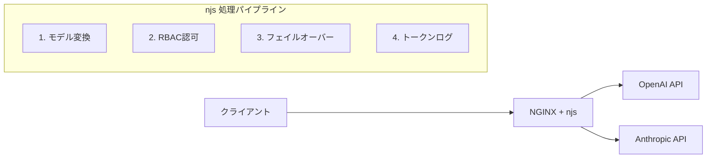

本記事は [Using NGINX as an AI Proxy（NGINX公式ブログ、2025年9月22日公開）](https://blog.nginx.org/blog/using-nginx-as-an-ai-proxy) の解説記事です。

## ブログ概要（Summary）

NGINX公式ブログの本記事は、NGINXとnjs（NGINX JavaScriptモジュール）を組み合わせて**LLMプロバイダへのAIプロキシ**を構築する4つの実装パターンを示している。著者のAlessandro Fael GarciaとMichael Plashakovは、OpenAIとAnthropicという異なるAPI仕様を持つプロバイダ間でリクエスト・レスポンスを変換する「モデル変換」、ユーザーごとにモデルアクセスを制御する「RBAC（ロールベースアクセス制御）」、プライマリモデル障害時に自動で代替モデルへ切り替える「フェイルオーバー」、APIレスポンスからトークン消費量を抽出してNGINXログに記録する「トークンログ」の4機能を、njsスクリプトのみで実現する方法を解説している。

この記事は [Zenn記事: Nginx×njsでLLMゲートウェイを構築しマルチプロバイダAPI統合とストリーミング制御を実装する](https://zenn.dev/0h_n0/articles/15a8ec3ad38ba2) の深掘りです。

## 情報源

- **種別**: 企業テックブログ（NGINX公式）
- **URL**: [https://blog.nginx.org/blog/using-nginx-as-an-ai-proxy](https://blog.nginx.org/blog/using-nginx-as-an-ai-proxy)
- **著者**: Alessandro Fael Garcia, Michael Pleshakov（F5/NGINX Engineering）
- **発表日**: 2025年9月22日

## 技術的背景（Technical Background）

LLMの本番運用では、OpenAI・Anthropic・Google・ローカルモデル（Ollama/vLLM）など複数プロバイダを使い分けるケースが増えている。しかし各プロバイダのAPIフォーマットは異なり、認証方式もバラバラである。アプリケーション側で個別にSDKを統合するとコードが複雑化し、プロバイダ追加時の変更コストが増大する。

NGINXは従来のHTTPリバースプロキシとして広く使われており、多くのインフラチームが運用ノウハウを持っている。njsモジュール（NGINX JavaScript）はNGINX公式が提供するJavaScriptランタイムで、リクエストヘッダ・ボディの加工やサブリクエスト発行が可能である。このnjsを活用すれば、新たなミドルウェアを導入せず既存のNGINXインフラ上にAIプロキシ層を構築できる。

学術的には、LLMプロバイダ間のAPI互換性問題はDing (2026) の LLM-Rosetta（arXiv:2604.09360）で形式化されており、$N$ プロバイダの相互変換には通常 $O(N^2)$ のアダプタが必要になるところを、中間表現（IR）を介したハブ＆スポーク方式で $O(N)$ に削減できることが示されている。NGINX公式ブログの手法は、このIRに相当する役割をnjsスクリプト内のJSON変換関数で担っている。

## 実装アーキテクチャ（Architecture）

ブログでは、4つの機能を段階的に積み上げる構成を採用している。



### 1. モデル変換（Model Transformation）

ブログが示す最初の機能は、クライアントがOpenAI互換のChat Completions形式でリクエストを送信し、njsがAnthropicのMessages API形式に変換するパターンである。

著者らは `transformAnthropicRequest()` 関数でOpenAI形式の `messages` 配列から `role: "system"` のメッセージを抽出し、Anthropicの `system` トップレベルフィールドに移動する処理を実装している。逆方向の `transformAnthropicResponse()` では、Anthropicのレスポンス構造をOpenAI互換の `choices` 配列形式に変換する。

この設計により、クライアントは常にOpenAI互換のAPIを呼ぶだけでよく、バックエンドのプロバイダ切り替えがクライアントコードの変更なしに実現できる。

**実装上の重要ポイント**として、ブログでは以下を指摘している：

- `temperature` パラメータの範囲がプロバイダ間で異なる（OpenAI: 0〜2、Anthropic: 0〜1）ため、njsで `Math.min(temperature, 1.0)` のクランプ処理が必要
- `max_tokens` はAnthropicでは必須パラメータだが、OpenAIではオプション。デフォルト値（例: 4096）の設定が必要
- ストリーミングモードではSSEチャンクのスキーマが異なるため、非ストリーミングモードでの変換を前提としている

### 2. RBAC（ロールベースアクセス制御）

2番目の機能として、ユーザーごとにアクセス可能なモデルを制限するRBACを実装している。ブログでは、JSON設定ファイルからユーザー権限を読み込み、リクエストヘッダの `X-User` フィールドとモデル名を照合する方式を採用している。

```javascript
const RBAC_CONFIG = {
    "user-alice": {
        allowed_models: ["gpt-4o", "claude-3-5-sonnet"],
        failover: "llama3"
    },
    "user-bob": {
        allowed_models: ["gpt-4o-mini", "llama3"],
        failover: "llama3"
    }
};
```

認可チェックはnjsの `access` フェーズで実行され、不正アクセスには HTTP 403 を返す。この設計は、API Keyの共有による無制限アクセスを防ぎ、チーム・部署単位でのモデル利用ガバナンスを実現する。

### 3. フェイルオーバー（Failover）

3番目の機能は、プライマリモデルが5xxエラーやタイムアウトを返した場合に、自動的にフォールバックモデルへリトライする仕組みである。

ブログでは、njsの `subrequest()` コールバック内でレスポンスステータスを判定し、`reply.status >= 500` の場合にRBAC設定の `failover` モデルへ再ルーティングする実装を示している。これにより、OpenAIのレート制限（429）やサービス障害（502/503）発生時にAnthropicやローカルモデルへ自動切り替えが行われる。

**制約として著者らが明記しているのは**、この方式ではフェイルオーバー先のモデルへのリクエスト変換（前述のモデル変換）が自動で適用される必要がある点である。異なるプロバイダへフェイルオーバーする場合、njsスクリプト内でプロバイダ判定とリクエスト変換のロジックを組み合わせる必要がある。

### 4. トークン使用量ログ（Token Usage Logging）

最後の機能は、LLMレスポンスに含まれる `usage` フィールド（`prompt_tokens`、`completion_tokens`、`total_tokens`）を抽出し、NGINXのアクセスログに記録する仕組みである。

```nginx
log_format llm_log '$remote_addr - $request_time '
                   'model=$llm_model '
                   'prompt_tokens=$llm_prompt_tokens '
                   'completion_tokens=$llm_completion_tokens '
                   'status=$status';
```

njsでレスポンスボディをJSONパースし、`usage` オブジェクトからトークン数を抽出してNGINX変数にセットする。この変数をカスタムログフォーマットで出力することで、既存のログ分析基盤（Elasticsearch、Grafana Loki等）でトークン使用量のモニタリングが可能になる。

**著者らが指摘する制約**として、SSEストリーミングレスポンスではトークン使用量が最終チャンク（`[DONE]` イベント直前）にのみ含まれるため、ストリーミング途中で接続が切断された場合にカウント漏れが発生する可能性がある。

## パフォーマンス最適化（Performance）

ブログでは明示的なベンチマーク数値は報告されていないが、以下の設計判断がパフォーマンスに直結する：

- **`keepalive 32`**: upstreamへのTCPコネクションを維持し、TLSハンドシェイクのオーバーヘッドを削減。LLMリクエストは1リクエストあたり数百ミリ秒〜数十秒かかるため、コネクション確立のレイテンシ（通常50〜100ms）の相対的影響は小さいが、高頻度リクエスト時に累積する
- **`proxy_ssl_server_name on`**: SNI（Server Name Indication）を有効化し、api.openai.comやapi.anthropic.comへの正しいTLS接続を保証。これがないと502エラーが発生する
- **`internal` ディレクティブ**: 各プロバイダ用locationを外部アクセスから保護し、njsの`subrequest()`経由でのみ到達可能にする

njsの処理自体はシングルスレッドで実行されるが、JSON変換処理は通常数マイクロ秒〜数十マイクロ秒であり、LLM APIの応答時間（数百ミリ秒〜数十秒）と比較すると無視できるオーバーヘッドである。

## 運用での学び（Production Lessons）

### SSEストリーミングとnjsの制約

ブログの実装は非ストリーミングモード（`stream: false`）を前提としている。これは **njsの `subrequest()` がレスポンス全体をバッファしてからコールバックを呼ぶ** という制約に起因する。SSEストリーミング（`stream: true`）でnjsサブリクエストを使うと、トークンの逐次配信が機能せず、全トークンが一括で返される。

ストリーミング対応には以下の代替手法が必要となる：
- **`js_set` + `internalRedirect`方式**: njsでルーティング先を変数にセットし、直接プロキシさせる（リクエスト変換は可能だがレスポンス変換は困難）
- **OpenResty（Lua）方式**: cosocket（非同期I/O）を使用してチャンクごとの変換が可能

### 設定管理の複雑さ

プロバイダ数やモデル数が増えるにつれ、njsスクリプトのルーティングテーブルとRBAC設定が肥大化する。ブログではJSON設定ファイルの外部化を示唆しているが、設定変更時にNGINXのリロード（`nginx -s reload`）が必要な点は運用上のトレードオフである。

### セキュリティ考慮

ブログでは `env OPENAI_API_KEY;` ディレクティブでAPIキーを環境変数からnjsに渡す方式を採用している。これにより設定ファイルへのハードコードを回避しているが、`ps aux` などでプロセスの環境変数が見える環境では注意が必要である。本番環境ではAWS Secrets ManagerやHashiCorp Vaultとの連携が推奨される。

## 学術研究との関連（Academic Connection）

### LLM-Rosetta との対応

Ding (2026) の LLM-Rosetta（arXiv:2604.09360）は、プロバイダ間のAPI変換をフォーマルに定義し、9種類のコンテントタイプと10種類のストリームイベントスキーマからなる中間表現（IR）を提案している。LLM-Rosettaの報告によると、変換オーバーヘッドは100マイクロ秒未満で、ラウンドトリップの忠実度はロスレスであるとされている。

NGINX公式ブログのnjsベースの変換は、LLM-Rosettaが形式化した問題を、軽量なスクリプトで実用的に解決するアプローチといえる。LLM-Rosettaが汎用フレームワークとしての網羅性を追求しているのに対し、njsアプローチは既存インフラへの最小限の追加で実現できる点が差別化要因である。

### Intelligent Routerとの関連

Jain et al. (2024) の「Intelligent Router for LLM Workloads」（arXiv:2408.13510）は、LLM推論のprefillフェーズとdecodeフェーズの負荷特性の違いを考慮した強化学習ベースのルーティングを提案している。著者らの報告では、ワークロード特性を考慮したルーティングにより、パブリックデータセットで11%のレイテンシ削減が達成されている。

NGINX公式ブログのルーティングは静的なモデル名ベースであり、ワークロード特性を考慮しない。高度なルーティングが必要な場合は、専用のAI GatewayやIntelligent Routerの採用が検討対象となる。

## Production Deployment Guide

### AWS実装パターン（コスト最適化重視）

NGINX AIプロキシをAWS上にデプロイする場合のトラフィック量別推奨構成を示す。

| 規模 | 月間リクエスト | 推奨構成 | 月額コスト概算 | 主要サービス |
|------|--------------|---------|--------------|------------|
| **Small** | ~3,000 (100/日) | Serverless | $50-150 | Lambda + API Gateway + Secrets Manager |
| **Medium** | ~30,000 (1,000/日) | Container | $300-700 | ECS Fargate (NGINX) + ALB + ElastiCache |
| **Large** | 300,000+ (10,000/日) | Container | $1,500-4,000 | EKS + NGINX Ingress + Karpenter |

**Small構成の詳細**（月額$50-150）:
- **Lambda**: NGINXの代わりにLambda@Edgeでヘッダ変換を処理（$20/月）
- **API Gateway**: REST APIエンドポイント（$10/月）
- **Secrets Manager**: APIキー管理（$5/月）
- **CloudWatch**: 基本監視（$5/月）

**Medium構成の詳細**（月額$300-700）:
- **ECS Fargate**: NGINX + njsコンテナ、0.5 vCPU / 1GB RAM × 2タスク（$120/月）
- **ALB**: Application Load Balancer（$20/月）
- **ElastiCache Redis**: プロンプトキャッシュ用、cache.t3.micro（$15/月）
- **Secrets Manager**: APIキーローテーション対応（$5/月）
- **LLM APIコスト**: Bedrock/外部API利用分（$200-500/月）

**Large構成の詳細**（月額$1,500-4,000）:
- **EKS**: コントロールプレーン + NGINX Ingress Controller（$150/月）
- **EC2 Spot**: c6i.xlarge × 2-4台（$200-400/月、Spot利用で最大90%削減）
- **Karpenter**: 自動スケーリング（追加コストなし）
- **LLM APIコスト**: Bedrock Batch API活用で50%削減（$800-2,500/月）

**コスト試算の注意事項**:
- 上記は2026年10月時点のAWS ap-northeast-1（東京）リージョン料金に基づく概算値です
- 実際のコストはトラフィックパターン、LLMプロバイダの料金改定、バースト使用量により変動します
- 最新料金は [AWS料金計算ツール](https://calculator.aws/) で確認してください

### Terraformインフラコード

**Medium構成: ECS Fargate + NGINX AIプロキシ**

```hcl
module "vpc" {
  source  = "terraform-aws-modules/vpc/aws"
  version = "~> 5.0"

  name = "nginx-ai-proxy-vpc"
  cidr = "10.0.0.0/16"
  azs  = ["ap-northeast-1a", "ap-northeast-1c"]
  public_subnets  = ["10.0.1.0/24", "10.0.2.0/24"]
  private_subnets = ["10.0.10.0/24", "10.0.11.0/24"]

  enable_nat_gateway   = true
  single_nat_gateway   = true
  enable_dns_hostnames = true
}

resource "aws_iam_role" "ecs_task" {
  name = "nginx-ai-proxy-task-role"

  assume_role_policy = jsonencode({
    Version = "2012-10-17"
    Statement = [{
      Action = "sts:AssumeRole"
      Effect = "Allow"
      Principal = { Service = "ecs-tasks.amazonaws.com" }
    }]
  })
}

resource "aws_iam_role_policy" "secrets_access" {
  role = aws_iam_role.ecs_task.id
  policy = jsonencode({
    Version = "2012-10-17"
    Statement = [{
      Effect   = "Allow"
      Action   = ["secretsmanager:GetSecretValue"]
      Resource = aws_secretsmanager_secret.llm_api_keys.arn
    }]
  })
}

resource "aws_secretsmanager_secret" "llm_api_keys" {
  name = "nginx-ai-proxy/llm-api-keys"
}

resource "aws_secretsmanager_secret_version" "llm_api_keys" {
  secret_id = aws_secretsmanager_secret.llm_api_keys.id
  secret_string = jsonencode({
    OPENAI_API_KEY    = var.openai_api_key
    ANTHROPIC_API_KEY = var.anthropic_api_key
  })
}

resource "aws_ecs_cluster" "main" {
  name = "nginx-ai-proxy-cluster"

  setting {
    name  = "containerInsights"
    value = "enabled"
  }
}

resource "aws_ecs_task_definition" "nginx_proxy" {
  family                   = "nginx-ai-proxy"
  network_mode             = "awsvpc"
  requires_compatibilities = ["FARGATE"]
  cpu                      = "512"
  memory                   = "1024"
  execution_role_arn       = aws_iam_role.ecs_task.arn
  task_role_arn            = aws_iam_role.ecs_task.arn

  container_definitions = jsonencode([{
    name  = "nginx-ai-proxy"
    image = "${var.ecr_repo_url}:latest"
    portMappings = [{ containerPort = 443, protocol = "tcp" }]
    secrets = [
      { name = "OPENAI_API_KEY",    valueFrom = "${aws_secretsmanager_secret.llm_api_keys.arn}:OPENAI_API_KEY::" },
      { name = "ANTHROPIC_API_KEY", valueFrom = "${aws_secretsmanager_secret.llm_api_keys.arn}:ANTHROPIC_API_KEY::" }
    ]
    logConfiguration = {
      logDriver = "awslogs"
      options = {
        "awslogs-group"         = "/ecs/nginx-ai-proxy"
        "awslogs-region"        = "ap-northeast-1"
        "awslogs-stream-prefix" = "nginx"
      }
    }
  }])
}

resource "aws_cloudwatch_metric_alarm" "high_error_rate" {
  alarm_name          = "nginx-ai-proxy-5xx-rate"
  comparison_operator = "GreaterThanThreshold"
  evaluation_periods  = 2
  metric_name         = "HTTPCode_Target_5XX_Count"
  namespace           = "AWS/ApplicationELB"
  period              = 300
  statistic           = "Sum"
  threshold           = 50
  alarm_description   = "NGINX AIプロキシの5xxエラー率異常"
}
```

**Large構成: EKS + NGINX Ingress**

```hcl
module "eks" {
  source  = "terraform-aws-modules/eks/aws"
  version = "~> 20.0"

  cluster_name    = "nginx-ai-gateway"
  cluster_version = "1.31"
  vpc_id          = module.vpc.vpc_id
  subnet_ids      = module.vpc.private_subnets

  cluster_endpoint_public_access = true
  enable_cluster_creator_admin_permissions = true
}

resource "kubectl_manifest" "karpenter_provisioner" {
  yaml_body = <<-YAML
    apiVersion: karpenter.sh/v1
    kind: NodePool
    metadata:
      name: nginx-proxy-pool
    spec:
      template:
        spec:
          requirements:
            - key: karpenter.sh/capacity-type
              operator: In
              values: ["spot"]
            - key: node.kubernetes.io/instance-type
              operator: In
              values: ["c6i.xlarge", "c6i.2xlarge"]
          limits:
            cpu: "16"
            memory: "32Gi"
          disruption:
            consolidateAfter: 30s
  YAML
}

resource "aws_budgets_budget" "monthly" {
  name         = "nginx-ai-gateway-monthly"
  budget_type  = "COST"
  limit_amount = "4000"
  limit_unit   = "USD"
  time_unit    = "MONTHLY"

  notification {
    comparison_operator       = "GREATER_THAN"
    threshold                 = 80
    threshold_type            = "PERCENTAGE"
    notification_type         = "ACTUAL"
    subscriber_email_addresses = ["ops@example.com"]
  }
}
```

### セキュリティベストプラクティス

1. **ネットワーク**: ECS/EKSはプライベートサブネットに配置。ALB/NLBのみパブリック公開
2. **シークレット管理**: AWS Secrets Managerでローテーション有効化（90日ごと推奨）
3. **IAMロール**: 最小権限。ECSタスクロールにはSecrets Manager読取のみ許可
4. **暗号化**: ALB→NGINX間はTLS 1.2以上、NGINX→LLMプロバイダ間もTLS必須
5. **監査**: CloudTrail全リージョン有効化、VPCフローログでネットワーク監査

### 運用・監視設定

**CloudWatch Logs Insights クエリ**:

```sql
-- NGINX AIプロキシのトークン使用量分析（1時間単位）
fields @timestamp, model, prompt_tokens, completion_tokens
| stats sum(prompt_tokens) as total_prompt, sum(completion_tokens) as total_completion by bin(1h), model
| sort @timestamp desc

-- エラーレート分析（P95レイテンシ付き）
fields @timestamp, status, request_time
| stats count(*) as total, sum(status >= 500) as errors, pct(request_time, 95) as p95_latency by bin(5m)
| filter errors > 0
```

**CloudWatch アラーム（コスト重視）**:

```python
import boto3

cloudwatch = boto3.client('cloudwatch')

cloudwatch.put_metric_alarm(
    AlarmName='nginx-proxy-token-spike',
    ComparisonOperator='GreaterThanThreshold',
    EvaluationPeriods=1,
    MetricName='TotalTokens',
    Namespace='Custom/NginxAIProxy',
    Period=3600,
    Statistic='Sum',
    Threshold=500000,
    ActionsEnabled=True,
    AlarmActions=['arn:aws:sns:ap-northeast-1:123456789:cost-alerts'],
    AlarmDescription='NGINX AIプロキシ: トークン使用量スパイク検知'
)
```

### コスト最適化チェックリスト

**アーキテクチャ選択**:
- [ ] ~100 req/日 → Lambda + API Gateway（$50-150/月）
- [ ] ~1,000 req/日 → ECS Fargate + ALB（$300-700/月）
- [ ] 10,000+ req/日 → EKS + NGINX Ingress + Karpenter（$1,500-4,000/月）

**リソース最適化**:
- [ ] ECS/EKS: Spot Instances優先（最大90%削減）
- [ ] Reserved Instances: 1年コミットで最大72%削減
- [ ] NGINX: worker_connections・keepalive最適化でリソース効率向上
- [ ] Lambda: メモリサイズ最適化（CloudWatch Lambda Insights分析）
- [ ] ECS: アイドルタイムのAuto Scaling設定（夜間0タスク）

**LLMコスト削減**:
- [ ] Bedrock Batch API: 非リアルタイム処理で50%削減
- [ ] Prompt Caching: ElastiCache活用で同一プロンプトの重複課金防止
- [ ] モデル選択ロジック: 簡易タスクはHaiku、複雑タスクはSonnet/Opus
- [ ] max_tokens設定: 過剰生成防止でトークンコスト削減

**監視・アラート**:
- [ ] AWS Budgets: 月額予算設定（80%で警告、100%でアラート）
- [ ] CloudWatch: トークン使用量スパイク検知
- [ ] Cost Anomaly Detection: 自動異常検知有効化
- [ ] 日次コストレポート: SNS/Slackへ自動送信

**リソース管理**:
- [ ] 未使用リソース削除: Trusted Advisor活用
- [ ] タグ戦略: 環境別（dev/staging/prod）でコスト可視化
- [ ] ECRイメージ: ライフサイクルポリシーで古いイメージ自動削除
- [ ] CloudWatch Logs: 保持期間設定（30日推奨）

## まとめと実践への示唆

NGINX公式ブログの本記事は、njsモジュールを用いたAIプロキシ構築の実践的なリファレンスである。モデル変換・RBAC・フェイルオーバー・トークンログの4機能を段階的に実装するアプローチは、既存のNGINXインフラを活用したい組織にとって導入障壁が低い。

一方で、著者らが明示的には強調していない制約として、njsの `subrequest()` がSSEストリーミングをバッファする点は、チャットUIなどリアルタイム応答が求められるユースケースでは設計上の大きな制約となる。この制約を回避するには、ストリーミング対応を `js_set` + `internalRedirect` で実現するか、OpenRestyのcosocketを採用する必要がある。

プロバイダ数が5社以上、モデル数が10以上に成長した場合は、Kong AI GatewayやEnvoy AI Gatewayなど、宣言的な設定ファイルのみでルーティングを管理できる専用ゲートウェイへの移行が現実的な選択肢となる。

## 参考文献

- **Blog URL**: [Using NGINX as an AI Proxy](https://blog.nginx.org/blog/using-nginx-as-an-ai-proxy)
- **Related Papers**: Ding, P. (2026). "LLM-Rosetta: A Hub-and-Spoke Intermediate Representation for Cross-Provider LLM API Translation." arXiv:2604.09360
- **Related Papers**: Jain, K. et al. (2024). "Intelligent Router for LLM Workloads." arXiv:2408.13510
- **Related Zenn article**: [Nginx×njsでLLMゲートウェイを構築しマルチプロバイダAPI統合とストリーミング制御を実装する](https://zenn.dev/0h_n0/articles/15a8ec3ad38ba2)
