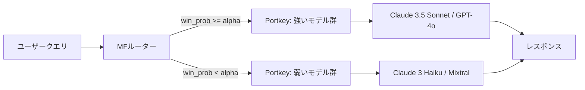

本記事は [https://arxiv.org/abs/2406.18665](https://arxiv.org/abs/2406.18665) の解説記事です。

## 論文概要（Abstract）

RouteLLMは、LLMデプロイメントにおける品質とコストのトレードオフを解決するために、選好データを活用してルーターモデルを学習する手法である。Chatbot Arenaの80K件の対戦データを基に、クエリの難易度に応じて強いモデル（GPT-4クラス）と弱いモデル（Mixtral 8x7Bクラス）を動的に振り分ける4種類のルーターアーキテクチャを提案している。著者らは、MT Benchにおいて品質を95%維持しながら最大3.66倍のコスト削減を達成したと報告している。

この記事は [Zenn記事: OpenAI Agents SDK×Portkey Gatewayで耐障害AIエージェントを構築する](https://zenn.dev/0h_n0/articles/e82e33ac9ce098) の深掘りです。Portkey Gatewayが提供するマルチプロバイダルーティング機能の学術的背景として、RouteLLMの技術的詳細を解説します。

## 情報源

- **会議名**: ICLR 2025（International Conference on Learning Representations）
- **URL**: [https://arxiv.org/abs/2406.18665](https://arxiv.org/abs/2406.18665)
- **著者**: Isaac Ong, Amjad Almahairi, Vincent Wu et al.
- **GitHub**: [https://github.com/lm-sys/RouteLLM](https://github.com/lm-sys/RouteLLM)

## カンファレンス情報

**ICLRについて**: ICLR（International Conference on Learning Representations）は機械学習・深層学習分野のトップカンファレンスの1つであり、表現学習を中心とした研究が発表される。採択率は通常30%前後で、公開査読形式を採用している。

## 背景と動機

LLMの商用デプロイメントでは、GPT-4は100万トークンあたり約$24.7であるのに対し、Mixtral 8x7Bは約$0.24/Mと約100倍の価格差がある（論文Section 5.3より）。しかし全てのクエリが高性能モデルを必要とするわけではない。「東京の天気は？」のような簡単なクエリと高度な推論を要するクエリでは、要求される能力が異なる。

従来は固定的なモデル選択か手動ルールベースルーティングが主流であり、クエリ難易度を自動判定する学習ベースの手法は十分に研究されていなかった。RouteLLMは、Chatbot Arenaの大規模な選好データを活用し、クエリごとに最適なモデルを選択するルーターを学習する枠組みを提案している。

## 主要な貢献

- **貢献1**: 選好データに基づくLLMルーティングの定式化。クエリ難易度に応じた二値ルーティングを勝率予測問題として定式化した
- **貢献2**: 4つのルーターアーキテクチャ（MF, SW, BERT, Causal LLM）の設計と比較評価
- **貢献3**: データ拡張手法（Golden-Labeled / LLM-Judge-Labeled）によるドメイン固有性能の向上
- **貢献4**: 学習時に含まれていないモデルペアへの転移学習能力の実証

## 技術的詳細

### 問題定式化

強いモデル $\mathcal{M}_{\text{strong}}$ と弱いモデル $\mathcal{M}_{\text{weak}}$ の間でクエリを振り分ける。ルーティング関数は以下のように定義される。

$$
R_\alpha(q) = \begin{cases} \mathcal{M}_{\text{weak}} & \text{if } P_\theta(\text{win}_s \mid q) < \alpha \\ \mathcal{M}_{\text{strong}} & \text{if } P_\theta(\text{win}_s \mid q) \geq \alpha \end{cases}
$$

ここで $q$ は入力クエリ、$P_\theta(\text{win}_s \mid q)$ は強いモデルが勝つ確率の推定値、$\alpha \in [0, 1]$ は品質-コストトレードオフの閾値である。学習の目的関数は選好データセット $\mathcal{D}_{\text{pref}}$ に対する対数尤度の最大化である。

$$
\max_\theta \sum_{(q, l_{s,w}) \in \mathcal{D}_{\text{pref}}} \log P_\theta(l_{s,w} \mid q)
$$

### 評価指標

**Performance Gap Recovered（PGR）**: ルーティングで回復される性能ギャップの割合。

$$
\text{PGR}(\mathcal{M}_{R_\alpha}) = \frac{r(\mathcal{M}_{R_\alpha}) - r(\mathcal{M}_w)}{r(\mathcal{M}_s) - r(\mathcal{M}_w)}
$$

PGR=1.0は強いモデル単独と同等、PGR=0.0は弱いモデル単独と同等を意味する。**APGR**は10段階のコストレベルにおけるPGRの平均値、**CPT**は指定PGRを達成するのに必要な強いモデルへの最小呼び出し割合である。

### ルーターアーキテクチャ

#### 1. Matrix Factorization（MF）ルーター

推薦システムの行列分解をLLMルーティングに応用する。隠れスコアリング関数を双線形分解でモデル化する。

$$
\delta(M, q) = \mathbf{w}_2^\top (\mathbf{v}_M \odot (\mathbf{W}_1^\top \mathbf{v}_q + \mathbf{b}))
$$

ここで $\mathbf{v}_M$ はモデル埋め込み、$\mathbf{v}_q$ はクエリ埋め込み（text-embedding-3-small）、$\odot$ は要素積である。2モデルの勝率はBradley-Terryモデルで $P(M_A \succ M_B \mid q) = \sigma(\delta(M_A, q) - \delta(M_B, q))$ と計算される。8GB GPUで約10エポック、バッチサイズ64、学習率$3 \times 10^{-4}$で学習される（論文Appendix Cより）。

#### 2. Similarity-Weighted（SW）Rankingルーター

明示的な学習フェーズを必要としない。クエリ $q$ に対し学習データ中の各クエリ $q'$ とのコサイン類似度 $S(q, q')$ を計算し、$\omega' = \gamma^{(1 + S(q, q'))}$（$\gamma = 10$）で指数的に重み付けする。類似クエリの勝敗情報が強く反映される。GPU不要だが推論時に全学習データとの類似度計算が必要でスループットは2.9 req/sと低い。

#### 3. BERTクラシファイアルーター

BERT$_\text{BASE}$に分類ヘッドを追加する。$P_\theta(\text{win}_s \mid q) = \sigma(\mathbf{W}_h \mathbf{h}_{\text{cls}} + \mathbf{b})$ で、$\mathbf{h}_{\text{cls}}$は[CLS]トークンの隠れ状態。2台のL4 24GB GPUで約2000ステップ、学習率$1 \times 10^{-5}$で学習される。

#### 4. Causal LLMクラシファイアルーター

Llama 3 8Bを指示追従パラダイムでファインチューニングし、ラベルトークンの次トークン予測でルーティングを行う。8台のA100 80GB GPUが必要で最も計算コストが高い。

### 学習データとデータ拡張

Chatbot Arenaの80K件から16文字以下を除外した65Kサンプルを使用する。64モデルを10段階にクラスタリングし、上位2段階を「強い」、第3段階を「弱い」とする。勝敗ラベルのみを使用し応答テキストは含まない。

データ拡張は2種類ある。**$\mathcal{D}_{\text{gold}}$**: MMLU検証セット約1500問で正解照合による勝敗ラベルを導出する。**$\mathcal{D}_{\text{judge}}$**: Nectarデータセットを基にGPT-4をジャッジとして約120Kペアワイズ比較を作成する（コスト約$700 USD、論文Section 4より）。

## 実装のポイント

**閾値$\alpha$のチューニング**: 品質-コストトレードオフを直接制御する唯一のハイパーパラメータである。検証データで目標PGRに応じて設定する。

**ルーターの選択**: 論文Table 7より、MFルーターは155.16 req/sで$3.32/100万リクエストと最もバランスが良い。SWルーターはGPU不要だが2.9 req/sと低スループット。ルーターのデプロイコストはGPT-4生成コストの約0.4%と報告されている。

```python
from dataclasses import dataclass
from enum import Enum


class ModelTier(Enum):
    """ルーティング先のモデル階層."""
    STRONG = "strong"
    WEAK = "weak"


@dataclass(frozen=True)
class RoutingDecision:
    """ルーティング判定の結果.

    Attributes:
        model_tier: 選択されたモデル階層
        win_probability: 強いモデルの勝率推定値
        threshold: 使用された閾値
    """
    model_tier: ModelTier
    win_probability: float
    threshold: float


def route_query(
    win_probability: float,
    threshold: float = 0.5,
) -> RoutingDecision:
    """クエリをルーティングする.

    Args:
        win_probability: 強いモデルの勝率推定値 [0, 1]
        threshold: ルーティング閾値 alpha

    Returns:
        ルーティング判定結果
    """
    tier = ModelTier.STRONG if win_probability >= threshold else ModelTier.WEAK
    return RoutingDecision(
        model_tier=tier,
        win_probability=win_probability,
        threshold=threshold,
    )
```

## Production Deployment Guide

RouteLLMルーターをAWS上で構築するガイドを示す。コスト試算は2026年10月時点のAWS東京リージョン料金の概算値であり、トラフィックパターンにより変動する。最新料金は[AWS料金計算ツール](https://calculator.aws/)で確認を推奨する。

### AWS実装パターン

| 構成 | トラフィック | アーキテクチャ | 月額コスト |
|------|------------|--------------|-----------|
| Small | ~100 req/日 | Lambda + Bedrock + DynamoDB | $50-150 |
| Medium | ~1,000 req/日 | ECS Fargate + Bedrock + ElastiCache | $300-800 |
| Large | 10,000+ req/日 | EKS + Karpenter + Spot | $2,000-5,000 |

**Small構成内訳**: Lambda($0-5) + Bedrock Haiku/Sonnet($20-80) + DynamoDB On-Demand($5-10) + CloudWatch($5-10)。MFルーターはLambda内で推論する。**Large構成内訳**: EKSコントロールプレーン($73) + Spot g5.xlarge($300-500) + ALB($20-30)。MFルーターの155 req/sをGPU Podで活用する。

**コスト削減**: Spot Instances（最大70%削減）、Reserved 1年コミット（最大72%削減）、Bedrock Batch API（50%削減）、Prompt Caching（30-90%削減）。

### Terraformインフラコード

**Small構成（Serverless）**: Lambda + Bedrock + DynamoDB。IAMは最小権限、DynamoDBはKMS暗号化・TTL有効。

```hcl
resource "aws_lambda_function" "router" {
  function_name = "routellm-router"
  role = aws_iam_role.router.arn; runtime = "python3.12"
  handler = "handler.lambda_handler"; memory_size = 512; timeout = 30
  filename = "lambda.zip"
  environment { variables = {
    ROUTING_THRESHOLD = "0.7"  # alpha: 品質重視の閾値
    STRONG_MODEL = "anthropic.claude-3-5-sonnet-20241022-v2:0"
    WEAK_MODEL   = "anthropic.claude-3-haiku-20240307-v1:0"
  }}
  tracing_config { mode = "Active" }  # X-Ray有効化
}

resource "aws_dynamodb_table" "log" {
  name = "routellm-log"; billing_mode = "PAY_PER_REQUEST"
  hash_key = "request_id"; range_key = "timestamp"
  attribute { name = "request_id"; type = "S" }
  attribute { name = "timestamp"; type = "S" }
  server_side_encryption { enabled = true }
}
```

**Large構成（Container）**: EKS + Karpenter（Spot優先g5.xlarge）+ AWS Budgets。クラスタはプライベートエンドポイントのみ、Secrets ManagerでAPIキー管理。

```hcl
module "eks" {
  source = "terraform-aws-modules/eks/aws"; version = "~> 20.0"
  cluster_name = "routellm"; cluster_version = "1.31"
  cluster_endpoint_public_access = false
  vpc_id = module.vpc.vpc_id; subnet_ids = module.vpc.private_subnets
}

resource "aws_budgets_budget" "monthly" {
  name = "routellm"; budget_type = "COST"
  limit_amount = "5000"; limit_unit = "USD"; time_unit = "MONTHLY"
  notification { comparison_operator = "GREATER_THAN"
    threshold = 80; threshold_type = "PERCENTAGE"
    notification_type = "ACTUAL"
    subscriber_email_addresses = ["ops@example.com"] }
}
```

### 運用・監視設定

**CloudWatch Logs Insights**（ルーティング比率監視）:

```
fields @timestamp, model_tier
| stats count() as total, sum(case model_tier='strong' then 1 else 0 end) as strong by bin(1h)
| filter strong / total > 0.5
```

**X-Rayトレーシング**: `aws_xray_sdk`の`patch_all()`でboto3を自動計装し、ルーティング判定ごとに`model_tier`・`threshold`をアノテーションとして記録する。**Cost Explorer日次レポート**: Bedrock/Lambdaサービスのコストを日次で取得し、$100/日超過でSNS通知を送信する。

### コスト最適化チェックリスト

- [ ] **アーキテクチャ**: トラフィック量で構成選択。ルーターはMFルーター推奨（155 req/s, $3.32/100万req）
- [ ] **Spot Instances**: GPU/CPUワーカーをSpot優先（最大70%削減）
- [ ] **Reserved/Savings Plans**: 安定トラフィック分は1年コミット（最大72%削減）
- [ ] **Lambda最適化**: メモリ512MB-1024MBでPower Tuning
- [ ] **Karpenter**: アイドル時自動スケールダウン（consolidateAfter: 60s）
- [ ] **RouteLLM導入**: 強いモデル呼び出しを50-75%削減
- [ ] **Bedrock Batch API**: 非リアルタイム処理に適用（50%削減）
- [ ] **Prompt Caching**: 類似クエリで30-90%削減
- [ ] **max_tokens適正化**: 出力トークン数の上限を用途に応じて設定
- [ ] **AWS Budgets**: 月次予算の80%/100%でアラート設定
- [ ] **CloudWatch**: ルーティング比率・レイテンシの異常検知
- [ ] **Cost Anomaly Detection**: 有効化
- [ ] **日次コストレポート**: $100/日超過で即時通知
- [ ] **未使用リソース**: 定期削除（NAT Gateway、EIP等）
- [ ] **タグ戦略**: Project=routellm, Environment=prod/dev
- [ ] **DynamoDB TTL**: ログの自動削除設定
- [ ] **開発環境**: 夜間・週末の自動停止
- [ ] **ECRライフサイクル**: イメージ保持数制限
- [ ] **セキュリティ**: IAM最小権限、KMS暗号化、Secrets Manager、プライベートエンドポイント
- [ ] **弱いモデル見直し**: 性能向上に追従して定期的に更新

## 実験結果

### MT Bench評価

論文Table 1より、$\mathcal{D}_{\text{arena}}$のみではMFルーターのAPGRは0.580であったが、$\mathcal{D}_{\text{judge}}$を追加すると0.802に向上し60.4%改善している。MFルーター（$\mathcal{D}_{\text{arena}} + \mathcal{D}_{\text{judge}}$）がPGR 50%を達成するのに必要な強いモデルへの呼び出し割合はわずか13.40%であり、PGR 80%でも31.31%である。

### コスト削減効果

論文Table 6より、最良ルーターの削減比率は以下の通りである。

| ベンチマーク | GPT-4品質維持率 | コスト削減倍率 |
|------------|---------------|-------------|
| MT Bench | 95% | 3.66倍 |
| MMLU | 92% | 1.41倍 |
| GSM8K | 87% | 1.49倍 |

MT Benchでの3.66倍の削減は、95%の品質維持でコストを約27%に圧縮できることを意味する。

### ルーターインフラコスト

論文Table 7より、ルーターデプロイコストの比較を示す。

| ルーター | デバイス | スループット | コスト/100万req |
|---------|---------|------------|---------------|
| MF | GPU | 155.16 req/s | $3.32 |
| BERT | GPU | 69.62 req/s | $3.19 |
| Causal LLM | GPU | 42.46 req/s | $5.23 |
| SW | CPU | 2.9 req/s | $39.26 |

### 転移学習

論文Table 4より、学習時に含まれていないClaude 3 Opus/SonnetペアでSWルーターがAPGR 0.772（ランダムから56.6%改善）、Llama 3.1 70B/8BペアでもAPGR 0.767を達成している。ルーターがクエリの本質的な難易度を学習していることを示唆する結果である。Appendix Eでは、商用システム（Unify AI, Martian）と比較して同等性能を最大40%少ないGPT-4呼び出しで達成したと報告されている。

## 実運用への応用

### Portkey Gatewayとの統合

関連Zenn記事で紹介されているPortkey Gatewayは、マルチプロバイダへのリクエストルーティング・フォールバック機能を提供する。RouteLLMの知見は以下の形で統合可能である。

**動的ルーティング**: Portkey Gatewayの静的な重み付けルーティングに対し、MFルーターをミドルウェアとして組み込むことでクエリ難易度に基づく動的モデル選択が可能になる。**フォールバック連携**: RouteLLMの判定を第一段階、Portkey Gatewayのフォールバックを第二段階として組み合わせ、品質・コスト・可用性を同時に最適化できる。**コスト管理**: 論文結果から強いモデルへの呼び出しを50-75%削減でき、Portkey Gatewayのコスト追跡機能と組み合わせてプロバイダ別コスト可視化が実現する。



## 関連研究

- **FrugalGPT**（Chen et al., 2023）: 複数LLMをカスケード方式で逐次呼び出してコスト最適化を図る手法。RouteLLMは単一ルーターで一度に判定する点で異なる
- **AutoMix**（Madaan et al., 2024）: コンテキストと応答の両方を使いモデルを動的に切り替える手法。RouteLLMはクエリのみを入力とする
- **Hybrid LLM**（Ding et al., 2024）: 大規模・小規模モデルのハイブリッドルーティング。選好データの活用がRouteLLMの差別化ポイント
- **Chatbot Arena**（Chiang et al., 2024）: RouteLLMの学習データ基盤となる大規模LLM評価プラットフォーム

## まとめと今後の展望

RouteLLMは選好データを活用してLLMルーターを学習し、品質維持しながらコストを最大3.66倍削減する手法を提案した。MFルーターが最もバランスに優れ、データ拡張との組み合わせで高いAPGRを達成している。転移学習能力により未知のモデルペアにも適用可能であることが実証されている。

今後の方向として、3つ以上のモデルティアへのマルチモデルルーティング、医療・法律など専門分野へのドメイン適応、デプロイ後のフィードバックに基づく継続学習が挙げられる。LLMの性能向上とコスト低下が続く中、ルーティング技術はマルチモデル運用の標準コンポーネントになると考えられる。

## 参考文献

- **arXiv**: [https://arxiv.org/abs/2406.18665](https://arxiv.org/abs/2406.18665)
- **GitHub**: [https://github.com/lm-sys/RouteLLM](https://github.com/lm-sys/RouteLLM)
- **Conference**: ICLR 2025
- **Related Zenn article**: [https://zenn.dev/0h_n0/articles/e82e33ac9ce098](https://zenn.dev/0h_n0/articles/e82e33ac9ce098)
