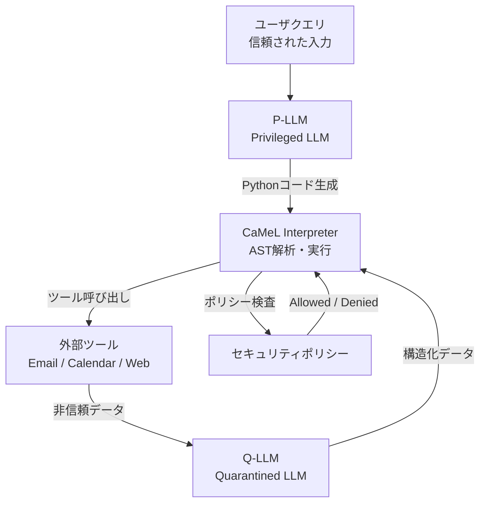
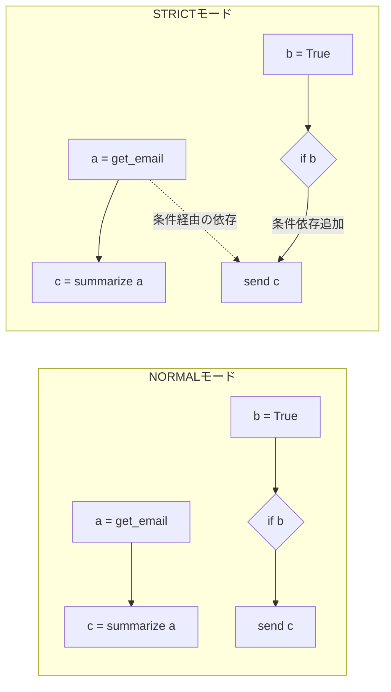

本記事は [Defeating Prompt Injections by Design](https://arxiv.org/abs/2503.18813) の解説記事です。

この記事は [Zenn記事: CaMeL×Spotlighting×LlamaFirewallで実装するプロンプトインジェクション防御2026](https://zenn.dev/0h_n0/articles/675527f0701b0b) の深掘りです。

## 論文概要（Abstract）

CaMeL（CApabilities for MachinE Learning）は、LLMエージェントに対するプロンプトインジェクション攻撃を、モデルの堅牢性に依存せず設計レベルで防御するフレームワークである。著者らは、制御フロー（ユーザの意図）とデータフロー（外部からの入力）を明示的に分離し、Capability（能力）ベースのアクセス制御によりデータの出所追跡と流出防止を実現した。AgentDojoベンチマーク上で949件の攻撃に対し、Gemini 2.5 Proでは攻撃成功数を300件から0件に削減しつつ、ベンチマークタスクの77%を達成したと報告されている。

## 情報源

- **arXiv ID**: 2503.18813
- **URL**: [https://arxiv.org/abs/2503.18813](https://arxiv.org/abs/2503.18813)
- **著者**: Edoardo Debenedetti, Ilia Shumailov, Nicholas Carlini, et al.
- **発表年**: 2025（IEEE SaTML 2026 採択）
- **分野**: cs.CR（暗号・セキュリティ）, cs.AI（人工知能）
- **コード**: [google-research/camel-prompt-injection](https://github.com/google-research/camel-prompt-injection)

## 背景と動機（Background & Motivation）

LLMエージェントが外部ツール（メール送信、カレンダー操作、Webブラウジング等）を呼び出す実用システムでは、プロンプトインジェクションが深刻なセキュリティリスクとなる。攻撃者はメール本文やWebページにLLMへの指示を埋め込み、エージェントに意図しないツール呼び出しを実行させる。

従来の防御手法はいずれもLLMの入力レベルでの対策に留まっていた。Spotlightingはデリミタや特殊エンコーディングでシステムプロンプトとユーザ入力を区別し、Prompt Sandwichingは指示をデータの前後に配置する。しかし、これらは確率的な防御であり、適応的攻撃者に対する保証がない。著者らは、ソフトウェアセキュリティにおけるControl-Flow Integrity（CFI）や情報フロー制御の概念をLLMエージェントに応用し、設計レベルでの安全性保証を目指した。

## 主要な貢献（Key Contributions）

- **Dual-LLMアーキテクチャの設計**: 信頼された入力のみを処理するP-LLM（Privileged LLM）と、非信頼データの構造化のみを行うQ-LLM（Quarantined LLM）を分離し、制御フローとデータフローを構造的に隔離した
- **Capabilityベースのアクセス制御**: 各変数に出所（provenance）と許可読者（allowed readers）のメタデータを付与し、セキュリティポリシーをPython関数として記述する体系を構築した
- **AgentDojoベンチマークでの実証評価**: 949件の攻撃シナリオに対し、複数のLLMモデルで評価を行い、従来手法を大幅に上回る防御性能を実証した

## 技術的詳細（Technical Details）

### Dual-LLMアーキテクチャ

CaMeLの中核は、LLMを2つの役割に分離するDual-LLMパターンである。



**P-LLM（Privileged LLM）** はユーザの初期クエリのみを受け取り、利用可能なツールのPython関数シグネチャを参照してPythonコードを生成する。P-LLMはツール出力や外部データを一切参照しないため、プロンプトインジェクションの影響を受けない。

**Q-LLM（Quarantined LLM）** はツールから返された非構造化データ（メール本文、Webページ等）をあらかじめ定義されたスキーマに従って構造化する。Q-LLMにはツール呼び出し権限がなく、P-LLMへの情報フィードバックも遮断されている。Structured Output機能により出力はスキーマに強制されるため、仮にプロンプトインジェクションを受けても任意のテキスト出力ができない。

著者らは、P-LLMとQ-LLMに異なるモデルを使用する構成も評価している。Claude 3.5 SonnetをP-LLMに、Claude 3.5 HaikuをQ-LLMに使用した場合、コストが約12%削減される一方でUtilityの低下は約1%に留まったと報告されている（論文Section 5.3）。

### CaMeL Interpreter: ASTベースのPython実行

P-LLMが生成したPythonコードは標準のPythonインタプリタではなく、CaMeL独自のインタプリタで実行される。Pythonの`ast`ライブラリでAbstract Syntax Tree（AST）を構築し、各ノードを再帰的に走査（recursive tree traversal）して実行する。

```python
import ast
from dataclasses import dataclass, field
from enum import Enum
from typing import Any


class Provenance(Enum):
    """値の出所を示すメタデータ"""
    USER = "user"       # P-LLMコードのリテラル
    CAMEL = "camel"     # CaMeL内部の変換結果
    TOOL = "tool"       # 外部ツールからの応答データ


@dataclass
class TrackedValue:
    """出所追跡付きの値ラッパー。全変数がこの型で管理される。"""
    value: Any
    sources: set[Provenance] = field(default_factory=set)
    allowed_readers: set[str] = field(default_factory=lambda: {"Public"})

    def merge_dependencies(self, other: "TrackedValue") -> "TrackedValue":
        """c = a + b で両方の依存関係を合成。readersは積集合。"""
        return TrackedValue(
            value=None,
            sources=self.sources | other.sources,
            allowed_readers=self.allowed_readers & other.allowed_readers,
        )
```

このインタプリタは制限されたPythonサブセットのみを実行する。`import`文、`exec`、`eval`等は禁止される。例外発生時はエラーメッセージを最大10回P-LLMにフィードバックして修正を試みるが、非信頼データ由来のメッセージは秘匿される。

### Capabilityベースのアクセス制御

CaMeLにおけるCapabilityとは、各値に付与される出所（provenance）と許可読者（allowed readers）のメタデータである。「データがどこから来たか」と「誰に読まれてよいか」を常に保持する。

形式的には、値$v$に対するCapabilityを以下のように定義する。

$$
\text{Cap}(v) = \langle \text{sources}(v), \text{readers}(v) \rangle
$$

ここで、
- $\text{sources}(v) \subseteq \mathcal{S}$: 値$v$が依存する出所の集合。$\mathcal{S} = \{\text{User}, \text{CaMeL}, \text{tool}_1, \text{tool}_2, \ldots\}$
- $\text{readers}(v) \subseteq \mathcal{R}$: 値$v$の読み取りを許可されたエンティティの集合

二項演算 $c = f(a, b)$ における依存関係の伝播は以下の通りである。

$$
\text{sources}(c) = \text{sources}(a) \cup \text{sources}(b)
$$

$$
\text{readers}(c) = \text{readers}(a) \cap \text{readers}(b)
$$

出所は和集合（union）で伝播し、許可読者は積集合（intersection）で伝播する。これにより、機密データと公開データが混合された場合、結果は自動的に機密レベルに引き上げられる。

### セキュリティポリシー

セキュリティポリシーはPython関数として記述され、ツール呼び出しの可否を判定する。

```python
from dataclasses import dataclass
from typing import Literal


@dataclass
class SecurityPolicyResult:
    """セキュリティポリシーの判定結果"""
    decision: Literal["Allowed", "Denied"]
    reason: str


def email_send_policy(
    tool_name: str,
    args: dict,
    dependencies: dict[str, set[str]],
) -> SecurityPolicyResult:
    """メール送信のセキュリティポリシー

    カレンダーのイベント参加者にのみメール送信を許可する。
    依存関係グラフを検査し、送信先が信頼されたソースかを判定する。
    """
    if tool_name != "send_email":
        return SecurityPolicyResult("Allowed", "対象外ツール")

    recipient = args.get("to", "")
    body_sources = dependencies.get("body", set())

    # メール本文がツール由来のデータを含む場合
    if any(s.startswith("tool:") for s in body_sources):
        if f"tool:calendar:{recipient}" not in body_sources:
            return SecurityPolicyResult(
                "Denied", f"送信先 {recipient} はデータの出所に含まれない"
            )

    return SecurityPolicyResult("Allowed", "ポリシー検査通過")
```

### NORMALモードとSTRICTモード

CaMeLは2つの実行モードを提供する。

**NORMALモード**: 変数は直接のデータソースにのみ依存する。代入文 `x = f(a)` において、$\text{sources}(x) = \text{sources}(a) \cup \{\text{CaMeL}\}$ となる。

**STRICTモード**: 制御フロー依存性を追加で追跡する。`if`文の条件分岐内で代入された変数は、条件式自体にも依存する。

$$
\text{sources}_{\text{STRICT}}(x) = \text{sources}(x) \cup \text{sources}(\text{cond})
$$

ここで$\text{cond}$は`if`文の条件式である。これにより、条件分岐を利用したサイドチャネル攻撃（条件に応じて異なるツールを呼び出すことで1ビットずつ情報を漏洩する攻撃）を防御する。



STRICTモードでは、`if`ブロック内の`send(c)`は条件`b`にも依存するため、`b`が非信頼データ由来の場合にポリシー違反として検出される。

## 実装のポイント（Implementation）

CaMeLを実装する際の要点を以下に整理する。

**P-LLMのプロンプト設計**: P-LLMにはツールのPython関数シグネチャ一覧と、使用可能なPython構文の制約（`for`/`if`/変数代入/関数呼び出しのみ）を提供する。P-LLMが生成するコードはMarkdownのコードブロックで返される。

**Q-LLMのStructured Output**: Q-LLMの出力はJSON Schemaで強制される。スキーマには`have_enough_information`フラグを含め、情報不足時にP-LLMへのフィードバックではなくフラグで通知する。これにより、Q-LLMからP-LLMへの任意テキスト伝達を遮断する。

**依存関係グラフの効率的管理**: 各変数の`TrackedValue`を環境辞書で管理する。二項演算・関数呼び出し時に依存関係をマージし、ツール呼び出し時にのみポリシー検査を実行する。ポリシー検査は$O(|S|)$（$|S|$は出所集合のサイズ）で完了するため、実行時オーバーヘッドは軽微である。

**エラーハンドリングの秘匿**: 非信頼データに起因する例外メッセージはP-LLMにフィードバックしない。例外の型と発生箇所のみを伝え、メッセージ本文は`[REDACTED]`に置換する。

## Production Deployment Guide

CaMeLのDual-LLMパターンは実装セクションが明確であるため、AWS上でのプロダクション環境構築ガイドを示す。

### AWS実装パターン（コスト最適化重視）

CaMeLはP-LLMとQ-LLMの2回のLLM呼び出しに加え、カスタムインタプリタでの実行が必要となる。トラフィック量別の推奨構成を以下に示す。なお、コスト試算は2026年10月時点のAWS ap-northeast-1（東京）リージョン料金に基づく概算値であり、実際のコストはトラフィックパターンやバースト使用量により変動する。最新料金はAWS料金計算ツールでの確認を推奨する。

| 構成 | トラフィック | サービス | 月額概算 |
|------|------------|---------|---------|
| Small | ~100 req/日 | Lambda + Bedrock + DynamoDB | $50-150 |
| Medium | ~1,000 req/日 | ECS Fargate + Bedrock + ElastiCache | $300-800 |
| Large | 10,000+ req/日 | EKS + Karpenter + Spot + Bedrock | $2,000-5,000 |

**Small構成の内訳**: Lambda（P-LLM/Q-LLM呼び出し + CaMeLインタプリタ実行）$5-10、Bedrock API（Claude Sonnet P-LLM + Haiku Q-LLM）$30-100、DynamoDB（セッション・依存関係グラフ保存）$5-15、CloudWatch $5。

**コスト削減テクニック**:
- Q-LLMに安価なモデル（Haiku等）を使用: 約12%のコスト削減（論文Section 5.3）
- Bedrock Prompt Caching: P-LLMのシステムプロンプト（ツールシグネチャ）をキャッシュし30-90%削減
- Bedrock Batch API: 非リアルタイム処理で50%削減
- Spot Instances（Large構成）: 最大90%削減

### Terraformインフラコード

**Small構成（Serverless）**:

```hcl
# CaMeL Dual-LLM Serverless構成: Lambda + Bedrock + DynamoDB

resource "aws_lambda_function" "camel_engine" {
  function_name = "camel-engine"
  runtime       = "python3.12"
  handler       = "handler.lambda_handler"
  role          = aws_iam_role.camel_lambda.arn
  timeout       = 120  # Dual-LLM呼び出しのため長めに設定
  memory_size   = 512  # AST解析に十分なメモリ

  environment {
    variables = {
      PLLM_MODEL_ID  = "anthropic.claude-sonnet-4-20250514-v1:0"
      QLLM_MODEL_ID  = "anthropic.claude-haiku-4-20250514-v1:0"
      EXECUTION_MODE = "STRICT"
      DYNAMODB_TABLE = aws_dynamodb_table.camel_sessions.name
    }
  }
}

# IAMロール: Bedrock InvokeModelのみ許可（最小権限）
resource "aws_iam_role_policy" "bedrock_invoke" {
  name = "bedrock-invoke"
  role = aws_iam_role.camel_lambda.id
  policy = jsonencode({
    Version = "2012-10-17"
    Statement = [{
      Effect   = "Allow"
      Action   = ["bedrock:InvokeModel"]
      Resource = ["arn:aws:bedrock:ap-northeast-1::foundation-model/anthropic.claude-*"]
    }]
  })
}

# セッション・依存関係グラフ保存（On-Demandでコスト最適化）
resource "aws_dynamodb_table" "camel_sessions" {
  name         = "camel-sessions"
  billing_mode = "PAY_PER_REQUEST"
  hash_key     = "session_id"
  attribute { name = "session_id"; type = "S" }
  server_side_encryption { enabled = true }
}
```

**Large構成（Container）**:

```hcl
# EKS + Karpenter + Spot構成
module "eks" {
  source          = "terraform-aws-modules/eks/aws"
  version         = "~> 20.0"
  cluster_name    = "camel-cluster"
  cluster_version = "1.31"
  vpc_id          = module.vpc.vpc_id
  subnet_ids      = module.vpc.private_subnets
  cluster_endpoint_public_access = false
}

# Karpenter: Spot優先で自動スケーリング
resource "kubectl_manifest" "karpenter_nodepool" {
  yaml_body = yamlencode({
    apiVersion = "karpenter.sh/v1"
    kind       = "NodePool"
    metadata   = { name = "camel-pool" }
    spec = {
      template.spec.requirements = [
        { key = "karpenter.sh/capacity-type", operator = "In", values = ["spot", "on-demand"] },
        { key = "node.kubernetes.io/instance-type", operator = "In", values = ["m6i.xlarge", "m6a.xlarge"] }
      ]
      disruption = { consolidationPolicy = "WhenEmptyOrUnderutilized" }
    }
  })
}
```

### 運用・監視設定

**CloudWatch Logs Insights クエリ**:

```
# CaMeLポリシー違反の検知（1時間あたり）
fields @timestamp, tool_name, policy_result, reason
| filter policy_result = "Denied"
| stats count(*) as denied_count by bin(1h)
| sort denied_count desc

# P-LLM / Q-LLM レイテンシ分析
fields @timestamp, llm_role, duration_ms
| filter llm_role in ["P-LLM", "Q-LLM"]
| stats avg(duration_ms) as avg_ms, pct(duration_ms, 95) as p95_ms, pct(duration_ms, 99) as p99_ms by llm_role
```

**X-Rayトレーシング**: `aws_xray_sdk`の`patch_all()`でboto3を自動計装し、P-LLM呼び出しとインタプリタ実行をサブセグメントで分離する。`execution_mode`アノテーションを付与しSTRICT/NORMALの切り替え影響を可視化する。

**Cost Explorer日次レポート**: Cost Explorer APIで`Project=camel`タグのサービス別コストを集計し、$100/日超過時にSNS通知を発行する。

### コスト最適化チェックリスト

**アーキテクチャ選択**:
- [ ] トラフィック量に応じた構成選択（~100 req/日: Serverless、~1,000: Hybrid、10,000+: Container）
- [ ] P-LLMとQ-LLMで異なるモデルサイズを使用（コスト12%削減）

**リソース最適化**:
- [ ] EC2/EKS: Spot Instances優先（最大90%削減）
- [ ] Reserved Instances: 1年コミットで最大72%削減
- [ ] Savings Plans: Compute Savings Plansの検討
- [ ] Lambda: メモリサイズ最適化（512MB推奨、Power Tuningで検証）
- [ ] ECS/EKS: Karpenterでアイドル時自動スケールダウン

**LLMコスト削減**:
- [ ] Bedrock Batch API: 非同期処理で50%削減
- [ ] Prompt Caching: P-LLMシステムプロンプトのキャッシュ有効化（30-90%削減）
- [ ] モデル選択: Q-LLMにHaiku、P-LLMにSonnetの組み合わせ
- [ ] トークン数制限: P-LLM出力を最大2,000トークンに制限
- [ ] 入力トークン最適化: ツールシグネチャの簡潔化

**監視・アラート**:
- [ ] AWS Budgets: 月額上限設定と80%/100%通知
- [ ] CloudWatch アラーム: Bedrockトークン使用量スパイク検知
- [ ] Cost Anomaly Detection: 自動異常検知有効化
- [ ] 日次コストレポート: Cost Explorer APIによる自動集計

**リソース管理**:
- [ ] 未使用リソース削除: 月次確認
- [ ] タグ戦略: `Project=camel`タグの統一適用
- [ ] DynamoDB TTL: セッション自動削除
- [ ] 開発環境夜間停止: EKSスケジュール停止

## 実験結果（Results）

著者らはAgentDojoベンチマークで評価を実施している。AgentDojoは、Workspace（メール・カレンダー・ドライブ）、Slack、Banking、Travelの4スイートから構成され、各タスクに対して攻撃シナリオが付与されている。

### セキュリティ性能

論文の実験結果より、CaMeLは既存手法を大幅に上回る防御性能を示した。Claude 3.5 Sonnetでの比較を以下に示す（論文Table 2相当）。

| 防御手法 | 攻撃成功数（949件中） | Utility |
|---------|---------------------|---------|
| 防御なし | 276 | 84% |
| Spotlighting | 中程度 | 軽微な低下 |
| Prompt Sandwiching | 中程度 | 軽微な低下 |
| Tool Filter | 8 | 低下あり |
| **CaMeL** | **0-2** | **62-84%** |

Gemini 2.5 Proでは攻撃成功数が300件から0件に削減された。Claude 3.5 Sonnetでは2件の攻撃が成功したが、これはポリシー定義の網羅性に起因するものであり、フレームワーク自体の脆弱性ではないと著者らは報告している。

### Utilityとオーバーヘッド

CaMeLのUtility（タスク成功率）はモデルにより62-84%の範囲であった。特にTravelスイートではUtilityが5-25%と低く、これはAPI仕様の文書化不足が原因であると報告されている。

トークンオーバーヘッドについて、ネイティブのツール呼び出しと比較して入力トークンが中央値で2.82倍、出力トークンが2.73倍に増加した（論文Section 5.2）。P-LLMへのシステムプロンプト（ツールシグネチャ）とQ-LLMへのスキーマ定義が主な増加要因である。

## 実運用への応用（Practical Applications）

CaMeLの設計原則は、以下のようなプロダクション環境に適用可能である。

**カスタマーサポートエージェント**: 顧客からの問い合わせメール（非信頼データ）を処理し、社内システムを操作するエージェントにおいて、メール本文中のプロンプトインジェクションによる不正操作を防御する。Q-LLMで顧客メールを構造化し、P-LLMが事前定義されたワークフローに基づいてツールを呼び出す構成が有効である。

**コード生成エージェント**: 外部ドキュメント（非信頼データ）を参照するエージェントで、悪意あるプロンプト埋め込みによる任意コマンド実行を防御する。

**運用上の課題**: トークンオーバーヘッド（約2.8倍）はコスト・レイテンシに直結する。Prompt Cachingや安価なQ-LLMモデルで緩和可能だが、リアルタイムアプリケーションでは逐次呼び出しによるレイテンシ増加が課題となる。セキュリティポリシーの網羅的定義は承認疲れを引き起こす可能性があり、粒度設計が重要である。

## 関連研究（Related Work）

- **Prompt Guard / LlamaFirewall** (Meta, 2024-2025): 入力テキストをファインチューニングされた分類器でスキャンし、プロンプトインジェクションの有無を判定するアプローチ。CaMeLとは異なり確率的な防御であるが、既存システムへの導入が容易である点が利点である。CaMeLと組み合わせてQ-LLMへの入力フィルタリングに使用する構成も考えられる
- **Signed Prompt** (Preamble, 2024): 暗号署名でシステムプロンプトの真正性を検証する手法。制御フロー保護に焦点を当て、CaMeLのデータフロー追跡とは相補的な関係にある
- **Instruction Hierarchy** (OpenAI, 2023): システムプロンプトを高優先度で処理するようLLMをファインチューニングするアプローチ。モデル内部挙動に依存するため適応的攻撃への保証が難しい。CaMeLはモデル非依存の防御を提供する
- **NeuralTrust / Rebuff** (OSS, 2023-2024): 入力検証・出力検証・カナリアトークン等を組み合わせる多層防御OSSフレームワーク。CaMeLとは設計原則が異なるが運用レベルで補完的に使用可能

## まとめと今後の展望

CaMeLは、プロンプトインジェクション防御をモデルの堅牢性から切り離し、ソフトウェアセキュリティの確立された原則（CFI、Capability、情報フロー制御）に基づく設計レベルの防御を実現した。AgentDojoベンチマークにおいて、949件の攻撃に対しGemini 2.5 Proで攻撃成功0件を達成しつつ、77%のUtilityを維持した点は注目に値する。

今後の研究方向として、著者らはデータ依存アクション（非信頼データの内容に基づく分岐処理）への対応、サイドチャネル攻撃のより包括的な防御、セキュリティポリシーの自動生成を挙げている。実務的には、既存のエージェントフレームワーク（LangChain、CrewAI等）へのCaMeL統合と、ポリシー定義の標準化が普及の鍵となるだろう。

## 参考文献

- **arXiv**: [https://arxiv.org/abs/2503.18813](https://arxiv.org/abs/2503.18813)
- **Code**: [https://github.com/google-research/camel-prompt-injection](https://github.com/google-research/camel-prompt-injection)
- **Related Zenn article**: [https://zenn.dev/0h_n0/articles/675527f0701b0b](https://zenn.dev/0h_n0/articles/675527f0701b0b)
