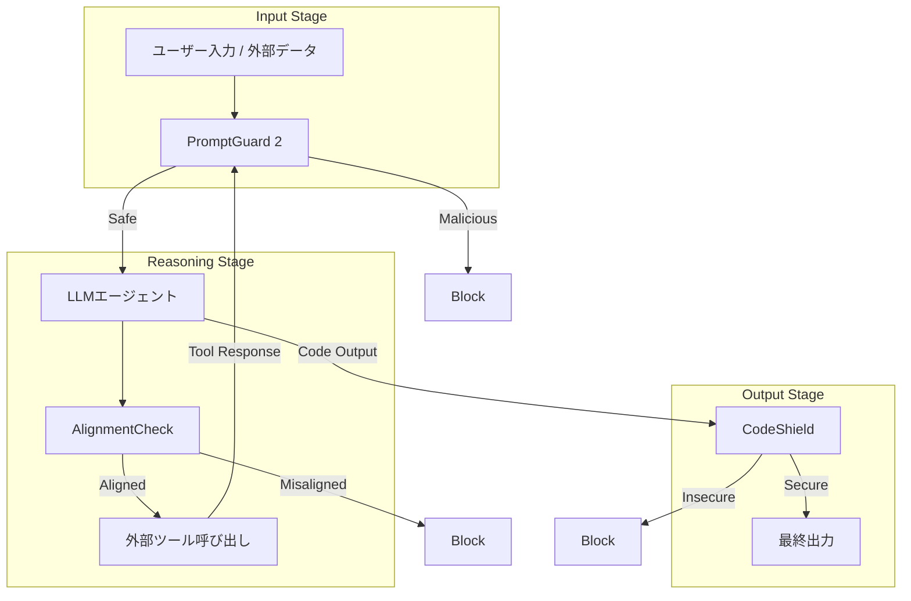
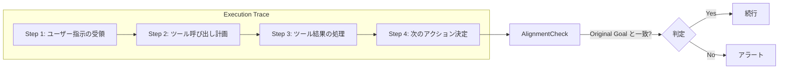

本記事は [LlamaFirewall: An open source guardrail system for building secure AI agents](https://arxiv.org/abs/2505.03574) の解説記事です。

この記事は [Zenn記事: CaMeL×Spotlighting×LlamaFirewallで実装するプロンプトインジェクション防御2026](https://zenn.dev/0h_n0/articles/675527f0701b0b) の深掘りです。

## 論文概要（Abstract）

LLMベースのAIエージェントが外部ツール呼び出しやコード生成を含む複雑なワークフローを自律的に実行するようになり、プロンプトインジェクション、ゴールハイジャック、安全でないコード生成といったセキュリティリスクが深刻化している。著者らは、これらの脅威に対する包括的なオープンソースガードレールシステムLlamaFirewallを提案している。LlamaFirewallは、PromptGuard 2（DeBERTaベースの入力フィルタ）、AlignmentCheck（LLMによる推論過程監査）、CodeShield（静的解析エンジン）の3コンポーネントで構成され、エージェントパイプラインの入力・中間推論・出力の各段階でリアルタイムにセキュリティチェックを実施する。AgentDojoベンチマークにおいて、3コンポーネントの組み合わせにより攻撃成功率（ASR）を90%以上削減したと報告されている。

## 情報源

- **arXiv ID**: 2505.03574
- **URL**: [https://arxiv.org/abs/2505.03574](https://arxiv.org/abs/2505.03574)
- **著者**: Sahana Chennabasappa, Cyrus Nikolaidis, Daniel Song, David Molnar et al.（Meta）
- **発表年**: 2025
- **分野**: cs.CR（暗号とセキュリティ）, cs.AI（人工知能）

## 背景と動機（Background & Motivation）

著者らは、既存のガードレールに3つの構造的課題があると指摘している。第一に、入出力フィルタリングのみでは中間推論過程のゴールドリフト（ツール応答に埋め込まれた間接インジェクションによる目標逸脱）を検出できない。第二に、コーディングエージェントが生成するコードのCWEベース脆弱性をリアルタイム検証する仕組みが不十分である。第三に、組織固有のセーフティポリシーを迅速に定義・展開する手段が限られている。

著者らは、LlamaFirewallをアプリケーション層の防御をすり抜けた攻撃を捕捉する「最終防御層」（last line of defense）として位置付けている。

## 主要な貢献（Key Contributions）

- **PromptGuard 2の開発**: mDeBERTa-baseベースの86Mパラメータモデルで、ジェイルブレイクおよび直接・間接プロンプトインジェクションを高精度に検出する。エネルギーベース損失関数によるOOD（Out-of-Distribution）精度の向上と、トークンフラグメンテーション攻撃への耐性を実現
- **AlignmentCheckの提案**: エージェントのChain-of-Thought推論トレース全体を監査するLLMベースの検査機構。ファインチューニング不要のfew-shotプロンプティングで動作し、ゴールハイジャックと間接プロンプトインジェクションの影響を検出する
- **CodeShieldの統合**: SemgrepとRegexルールを組み合わせた2階層の静的解析エンジン。8言語にわたり50以上のCWEカバレッジを提供する
- **プラグインアーキテクチャ**: 正規表現ベースおよびLLMベースのカスタムスキャナーを開発者が追加可能な拡張フレームワーク

## 技術的詳細（Technical Details）

### 全体アーキテクチャ

LlamaFirewallは、AIエージェントパイプラインの3段階にガードレールを配置するリアルタイム監視フレームワークである。



各コンポーネントは独立して動作し、組み合わせて使用することで防御の深さ（defense in depth）を実現する。

### PromptGuard 2: DeBERTaベースのインジェクション検出

PromptGuard 2は、テキスト分類タスクとしてプロンプトインジェクションおよびジェイルブレイクを検出するモデルである。著者らは2つのモデルバリアントを提供している。

**86Mモデル（mDeBERTa-v3-base）**: 多言語対応、AUC .98、1% FPR時のリコール97.5%、A100でのレイテンシ92.4ms

**22Mモデル（DeBERTa-v3-xsmall）**: 軽量版、AUC .995、1% FPR時のリコール88.7%、レイテンシ19.3ms

#### エネルギーベース損失関数

著者らは、OOD入力に対する精度向上のためにエネルギーベースの損失関数を採用している。標準的なクロスエントロピー損失に加え、エネルギースコアに基づくマージン損失を追加する。

$$
E(\mathbf{x}; f) = -\log \sum_{k=1}^{K} \exp(f_k(\mathbf{x}))
$$

ここで、
- $\mathbf{x}$: 入力テキストの特徴表現
- $f_k(\mathbf{x})$: クラス$k$に対するロジット出力
- $K$: クラス数（benign, injection, jailbreakの3クラス）
- $E(\mathbf{x}; f)$: エネルギースコア（低いほど分布内）

この損失関数により、学習データの分布から外れた入力（未知の攻撃パターンや通常のビジネステキスト）に対して過剰にinjection判定を出すことを抑制し、偽陽性率を低減する。

#### トークンフラグメンテーション耐性

プロンプトインジェクション攻撃の一手法として、悪意あるテキストを特殊文字や空白で分割してトークナイザの認識を回避するフラグメンテーション攻撃がある。著者らは、トークナイザレベルでの正規化処理を強化し、分割されたテキストを結合してから分類する前処理パイプラインを実装している。これにより、`i.g" n o r e`のような断片化入力も正しく検出できると報告されている。

### AlignmentCheck: LLMベースの推論監査

AlignmentCheckは、エージェントの実行トレース全体を分析し、ゴールハイジャックを検出するコンポーネントである。入出力のみを検査する手法とは異なり、Chain-of-Thought推論の各ステップを含む完全な実行コンテキストを監査対象とする。



元のユーザーリクエストと実行トレースを入力として受け取り、エージェントの行動が元の指示と整合しているかをfew-shotプロンプティングで判定する。ファインチューニング不要で、Llama 3.3 70B / Llama 4 Maverickでリコール80%以上、FPR 4%未満を達成したと報告されている。ツール応答に埋め込まれた間接インジェクションによる推論汚染を、トレースの文脈変化から検出できる点が利点である。

### CodeShield: 2階層静的解析エンジン

CodeShieldは、LLMが生成するコードの安全性をリアルタイムで検証する静的解析エンジンである。著者らは2つの解析階層を設計している。

**Tier 1（パターンマッチング）**: 正規表現ベースの高速スキャン。約60msのレイテンシで、明確な脆弱性パターン（SQLインジェクション、ハードコードされた認証情報等）を検出する。

**Tier 2（包括的解析）**: Semgrepルールを用いた詳細な解析。約300msのレイテンシで、データフロー解析を含むより高度な脆弱性パターンを検出する。

8言語（Python, JavaScript, TypeScript, Java, C, C++, Rust, Go）に対応し、50以上のCWEをカバーする。著者らは、精度96%、リコール79%を報告している（論文Table 6より）。

## 実装のポイント（Implementation）

LlamaFirewallはPythonパッケージとして提供されており、`pip install llamafirewall`でインストールできる。以下に基本的な使用方法を示す。

```python
from llamafirewall import LlamaFirewall, ScannerType, UserMessage, Role

def scan_user_input(user_text: str) -> dict[str, bool | str]:
    """ユーザー入力をPromptGuard 2でスキャンする。

    Args:
        user_text: スキャン対象のユーザー入力テキスト

    Returns:
        スキャン結果（is_safe: bool, detail: str）
    """
    firewall = LlamaFirewall(
        scanners={
            ScannerType.PROMPT_GUARD: {
                "model_name": "meta-llama/Prompt-Guard-2-86M",
                "temperature": 1.0,
                "threshold": 0.9,
            }
        }
    )
    message = UserMessage(content=user_text, role=Role.USER)
    result = firewall.scan(message)
    return {
        "is_safe": result.decision.value == "allow",
        "detail": result.reason,
    }
```

3コンポーネントを統合したマルチスキャナー構成と、エージェントの実行トレース監査は以下のようになる。

```python
from llamafirewall import LlamaFirewall, ScannerType, UserMessage, AssistantMessage, Role

def create_multi_scanner_firewall(
    alignment_model: str = "meta-llama/Llama-3.3-70B-Instruct",
) -> LlamaFirewall:
    """3コンポーネント統合のLlamaFirewallインスタンスを作成する。"""
    return LlamaFirewall(scanners={
        ScannerType.PROMPT_GUARD: {"model_name": "meta-llama/Prompt-Guard-2-86M", "threshold": 0.9},
        ScannerType.AGENT_ALIGNMENT: {"model_name": alignment_model, "check_reasoning_trace": True},
        ScannerType.CODE_SHIELD: {"tier": 2, "languages": ["python", "javascript", "typescript"]},
    })

def scan_agent_trace(
    firewall: LlamaFirewall, original_request: str, agent_trace: list[dict[str, str]],
) -> dict[str, str | list[str]]:
    """エージェントの実行トレースをAlignmentCheckでスキャンする。"""
    messages = [UserMessage(content=original_request, role=Role.USER)]
    messages.extend(AssistantMessage(content=s["content"], role=Role.ASSISTANT) for s in agent_trace)
    result = firewall.scan_conversation(messages)
    flagged = [f"Step {i}: {r.reason}" for i, r in enumerate(result.step_results) if r.decision.value != "allow"]
    return {"decision": result.overall_decision.value, "flagged_steps": flagged}
```

注意点: AlignmentCheckは70Bクラス以上が必須（1Bでは偽陽性率が大幅上昇）。PromptGuard 2は日本語入力なら22Mではなく86Mモデルを使用すること。

## Production Deployment Guide

### AWS実装パターン（コスト最適化重視）

LlamaFirewallの各コンポーネントは計算要件が異なるため、トラフィック量に応じた構成選択が重要である。以下にコスト試算を示す（2026年10月時点のap-northeast-1リージョン概算値。実際のコストはトラフィックパターン、リージョン、バースト使用量により変動する。最新料金はAWS料金計算ツールで確認を推奨）。

| 構成 | トラフィック | 主要サービス | 月額概算 |
|------|-------------|-------------|---------|
| Small | ~100 req/日 | Lambda + SageMaker Serverless + DynamoDB | $80-200 |
| Medium | ~1,000 req/日 | ECS Fargate + SageMaker Real-time + ElastiCache | $400-900 |
| Large | 10,000+ req/日 | EKS + Spot Instances + SageMaker Multi-Model | $2,500-5,500 |

**Small**: PromptGuard 2をSageMaker Serverless、AlignmentCheckはBedrock Llama 3.3 70B（$30-80/月）、CodeShieldはLambda内Semgrep実行。**Medium**: SageMaker Real-time（ml.g5.xlarge）+ ECS Fargate + ElastiCacheキャッシュ。**Large**: EKS + Karpenter Spot（最大90%削減）+ SageMaker Multi-Model。Reserved Instances併用で72%削減。

### Terraformインフラコード

**Small構成（Serverless）**:

```hcl
# LlamaFirewall Small構成 - Lambda + SageMaker Serverless
resource "aws_lambda_function" "llamafirewall_scanner" {
  function_name = "llamafirewall-scanner"
  runtime       = "python3.12"
  handler       = "handler.scan"
  role          = aws_iam_role.llamafirewall_lambda.arn
  timeout       = 30
  memory_size   = 512 # CodeShield Semgrep実行に必要
  environment {
    variables = {
      PROMPTGUARD_ENDPOINT = aws_sagemaker_endpoint.promptguard.name
      SCAN_LOG_TABLE       = aws_dynamodb_table.scan_logs.name
      CODESHIELD_TIER      = "2"
    }
  }
}

resource "aws_dynamodb_table" "scan_logs" {
  name         = "llamafirewall-scan-logs"
  billing_mode = "PAY_PER_REQUEST" # On-Demandでコスト最適化
  hash_key     = "request_id"
  range_key    = "timestamp"
  attribute { name = "request_id"; type = "S" }
  attribute { name = "timestamp"; type = "S" }
  server_side_encryption { enabled = true }
  ttl { attribute_name = "ttl"; enabled = true }
}
```

IAMロールは最小権限原則で`sagemaker:InvokeEndpoint`、`bedrock:InvokeModel`、`dynamodb:PutItem/GetItem`のみ付与する。

**Large構成（Container）**: EKS + Karpenter + Spotで構成。`terraform-aws-modules/eks/aws` v20、EKS 1.31、`cluster_endpoint_public_access = false`でプライベートアクセスのみ。KarpenterのNodePoolで`capacity-type: [spot, on-demand]`、GPU（g5.xlarge/g5.2xlarge/g6.xlarge）を指定し、`consolidationPolicy: WhenEmptyOrUnderutilized`でアイドル時自動縮退する。

### 運用・監視設定

**CloudWatch Logs Insightsクエリ（コスト異常検知・レイテンシ分析）**:

```
fields @timestamp, scanner_type, latency_ms, token_count
| filter scanner_type = "alignment_check"
| stats sum(token_count) as total_tokens, avg(latency_ms) as avg_latency by bin(1h)
| sort @timestamp desc
```

```
fields @timestamp, scanner_type, latency_ms
| stats percentile(latency_ms, 95) as p95, percentile(latency_ms, 99) as p99 by scanner_type
```

**X-Rayトレーシング + Cost Explorerレポート**:

```python
import boto3
from aws_xray_sdk.core import xray_recorder, patch_all
from datetime import date, timedelta

patch_all()  # boto3自動計装

@xray_recorder.capture("llamafirewall_scan")
def scan_with_tracing(firewall: "LlamaFirewall", text: str, request_id: str) -> dict[str, str]:
    """X-Rayトレーシング付きスキャン実行。"""
    sub = xray_recorder.current_subsegment()
    sub.put_annotation("request_id", request_id)
    result = firewall.scan(text)
    sub.put_annotation("decision", result.decision.value)
    return {"decision": result.decision.value, "reason": result.reason}

def get_daily_cost_report(threshold_usd: float = 100.0) -> dict[str, float]:
    """日次コストレポート取得、閾値超過時SNS通知。"""
    ce = boto3.client("ce")
    resp = ce.get_cost_and_usage(
        TimePeriod={"Start": str(date.today() - timedelta(days=1)), "End": str(date.today())},
        Granularity="DAILY", Metrics=["BlendedCost"],
        GroupBy=[{"Type": "DIMENSION", "Key": "SERVICE"}],
        Filter={"Tags": {"Key": "project", "Values": ["llamafirewall"]}},
    )
    costs = {g["Keys"][0]: float(g["Metrics"]["BlendedCost"]["Amount"]) for g in resp["ResultsByTime"][0]["Groups"]}
    if (total := sum(costs.values())) > threshold_usd:
        boto3.client("sns").publish(
            TopicArn="arn:aws:sns:ap-northeast-1:ACCOUNT:llamafirewall-alerts",
            Subject=f"LlamaFirewall Cost Alert: ${total:.2f}/day",
            Message=f"Daily cost ${total:.2f} exceeded ${threshold_usd}.",
        )
    return costs
```

### コスト最適化チェックリスト

**アーキテクチャ**: ~100 req/日→Serverless / ~1,000 req/日→Hybrid / 10,000+→Container(EKS+Spot)

**リソース最適化**: Spot Instances優先（最大90%削減）、Reserved Instances（72%削減）、Savings Plans検討、Lambda 512MB、Karpenterアイドル時スケールダウン、SageMaker Serverless（ゼロスケール）

**LLMコスト削減**: Bedrock Batch API（50%削減）、Prompt Caching（30-90%削減）、リスクベースのスキャナー選択（低リスク→PromptGuard 2のみ）、トークン数制限

**監視**: AWS Budgets（80%/100%アラート）、CloudWatchアラーム、Cost Anomaly Detection、日次SNSレポート

**リソース管理**: 未使用エンドポイント削除、タグ戦略（`project=llamafirewall`）、DynamoDB TTL 90日、開発環境夜間停止

## 実験結果（Results）

### AgentDojoベンチマーク

著者らは、AgentDojoベンチマーク（エージェントの安全性を評価するフレームワーク）上でLlamaFirewallの各コンポーネントおよび組み合わせの効果を評価している（論文Table 3より）。

| 構成 | ASR（攻撃成功率） | ASR削減率 | Utility |
|------|-------------------|----------|---------|
| ベースライン（防御なし） | .1763 | -- | .4773 |
| PromptGuard 2のみ | .0753 | 57.3% | .4656 |
| AlignmentCheckのみ | .0289 | 83.6% | .4384 |
| PromptGuard 2 + AlignmentCheck | .0175 | 90.1% | .4268 |

著者らは、PromptGuard 2とAlignmentCheckの組み合わせにより、ASRを.1763から.0175へ90%以上削減したと報告している。一方でUtilityは.4773から.4268へ約10.6%低下しており、セキュリティと利便性のトレードオフが存在する。

### PromptGuard 2のモデル比較

| モデル | パラメータ数 | AUC | リコール@1%FPR | レイテンシ（A100） |
|--------|------------|-----|---------------|-------------------|
| 86M（mDeBERTa-base） | 86M | .980 | 97.5% | 92.4ms |
| 22M（DeBERTa-xsmall） | 22M | .995 | 88.7% | 19.3ms |

22Mモデルは低レイテンシだが、リコールが86Mモデルと比較して8.8ポイント低い。著者らは、22Mモデルの多言語性能が特に劣化すると報告しており、英語以外の入力を扱う場合は86Mモデルの使用を推奨している。

### CodeShield・AlignmentCheckの補足評価

CodeShieldはCyberSecEvalベンチマークで精度96%、リコール79%（論文Table 6より）。コンテキスト依存の脆弱性検出には限界がある。AlignmentCheckは70B以上のモデルでリコール80%以上・FPR 4%未満を達成するが、Llama 3.2 1Bでは偽陽性率が大幅に上昇し実用性能に達しなかったと報告されている。

## 実運用への応用（Practical Applications）

LlamaFirewallは、Zenn記事で紹介されているCaMeLやSpotlightingと相補的に機能する。CaMeLがデータフロー制御でインジェクション影響を隔離し、Spotlightingが入力処理段階で信頼境界を強化するのに対し、LlamaFirewallは独立した監視レイヤーとして動作する。プロダクション環境では、Spotlighting → PromptGuard 2 → CaMeL → AlignmentCheck → CodeShieldの多段防御が構成可能である。

**レイテンシとコストのトレードオフ**: PromptGuard 2の92.4msは許容範囲だが、AlignmentCheckは70Bモデル推論のため数百ms〜数秒を要する。全リクエストへのAlignmentCheck適用は高コストになるため、PromptGuard 2で初期スクリーニングを行い疑わしい入力のみAlignmentCheckに回すカスケード構成が実用的である。

## 関連研究（Related Work）

- **NeMo Guardrails（NVIDIA, 2023）**: Colang対話フロー記述言語による安全性ルール定義。LlamaFirewallが推論トレース全体を監査するのに対し、対話フロー単位の制御に焦点を当てる
- **Lakera Guard（Lakera, 2024）**: プロンプトインジェクション検出特化APIサービス。DeBERTaベース分類モデルを使用する点はPromptGuard 2と共通するが、LlamaFirewallはAlignmentCheck・CodeShieldを含む包括的フレームワークである
- **Rebuff（Protectai, 2023）**: ヒューリスティクス・LLM判定・ベクトル類似度検索を組み合わせた多層検出。ルールベースとモデルベースのハイブリッドアプローチでPromptGuard 2の学習ベース分類器と対照的
- **CaMeL（Google DeepMind, 2025）**: データフローレベルでインジェクション影響を隔離。検出主眼のLlamaFirewallと相補的に機能する

## まとめと今後の展望

LlamaFirewallは3層防御（PromptGuard 2 / AlignmentCheck / CodeShield）でAgentDojoベンチマークのASRを90%以上削減した。課題として、AlignmentCheckの小規模モデル非対応、ガードレール自体へのインジェクション脆弱性、テキストのみのモダリティ制約が挙げられている。実務的にはCaMeL・Spotlightingと組み合わせた多層防御と、リスクベースのカスケードスキャナー選択が有効である。

## 参考文献

- **arXiv**: [https://arxiv.org/abs/2505.03574](https://arxiv.org/abs/2505.03574)
- **Code**: [https://github.com/meta-llama/PurpleLlama/tree/main/LlamaFirewall](https://github.com/meta-llama/PurpleLlama/tree/main/LlamaFirewall)
- **PromptGuard 2 Model**: [https://huggingface.co/meta-llama/Prompt-Guard-2-86M](https://huggingface.co/meta-llama/Prompt-Guard-2-86M)
- **Related Zenn article**: [https://zenn.dev/0h_n0/articles/675527f0701b0b](https://zenn.dev/0h_n0/articles/675527f0701b0b)
