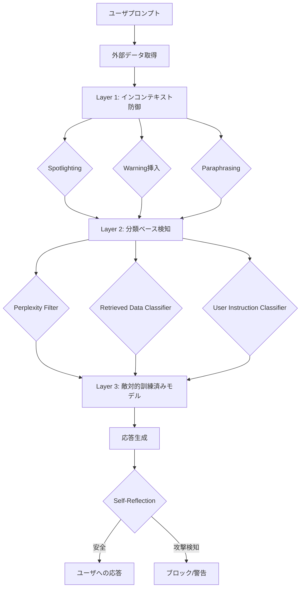
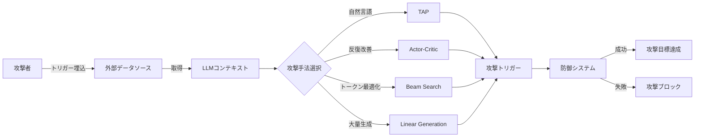

本記事は [Lessons from Defending Gemini Against Indirect Prompt Injections](https://arxiv.org/abs/2505.14534) の解説記事です。

## 論文概要（Abstract）

Google DeepMindの研究チームが、Geminiモデルに対する間接プロンプトインジェクション（IPI）攻撃への防御を体系的に分析した論文である。著者らは、インコンテキスト防御・分類ベース検知・敵対的訓練の3層防御を設計し、4種の自動攻撃手法で適応的評価を実施している。未防御のGemini 2.0では全シナリオで攻撃成功率（ASR）70%超、TAPでは100%近くに達する一方、敵対的訓練を施したGemini 2.5ではTAP 53.6%、Beam Search 4.2%まで低減したと報告している。重要な知見として、能力向上と堅牢性は独立であり、適応的評価なしでは脆弱性を過小評価すること、多層防御が不可欠であることを示している。

この記事は [Zenn記事: CaMeL×Spotlighting×LlamaFirewallで実装するプロンプトインジェクション防御2026](https://zenn.dev/0h_n0/articles/675527f0701b0b) の深掘りです。

## 情報源

- **arXiv ID**: 2505.14534
- **URL**: [https://arxiv.org/abs/2505.14534](https://arxiv.org/abs/2505.14534)
- **著者**: Chongyang Shi, Sharon Lin, Shuang Song, Jamie Hayes, Ilia Shumailov et al. (Google DeepMind)
- **発表年**: 2025
- **分野**: cs.CR, cs.LG

## 背景と動機（Background & Motivation）

間接プロンプトインジェクション（IPI）は、外部ソース（Webページ、メール、ドキュメント）に埋め込まれた悪意ある指示をLLMに取り込ませ、ユーザの意図に反する動作を引き起こす攻撃手法である。従来のプロンプトインジェクション研究は手動のジェイルブレイク手法に偏りがちであり、プロダクション環境で実際に展開される防御の体系的な評価は不足していた。

著者らは、Geminiモデルのプロダクション環境での防御を設計する過程で、以下の3つの重要な課題に直面したと報告している。第一に、モデルの指示追従能力が向上するほど攻撃に対しても従順になるという能力-堅牢性のジレンマがある。第二に、非適応的な評価（攻撃者が防御を知らない前提での評価）は防御の有効性を過大評価する。第三に、単一の防御手法では多様な攻撃手法に対処できない。これらの課題に対し、本論文は3層防御アーキテクチャと4種の自動攻撃手法による適応的評価フレームワークを提案している。

## 主要な貢献（Key Contributions）

- **貢献1**: インコンテキスト防御・分類ベース検知・敵対的訓練の3層防御フレームワークを設計し、プロダクション環境での適用可能性を実証
- **貢献2**: Actor-Critic・Beam Search・TAP・Linear Generationの4種の自動攻撃手法を用いた適応的評価手法を確立し、非適応的評価が脆弱性を平均的に過小評価することを定量的に示した
- **貢献3**: 敵対的訓練が良性タスクの性能を劣化させずにIPI耐性を大幅に向上させることを、Gemini 2.5のプロダクションモデルで実証
- **貢献4**: 「能力向上と堅牢性は独立」「適応的評価は必須」「多層防御が不可欠」等の5つの実践的教訓を体系化

## 技術的詳細（Technical Details）

### 3層防御アーキテクチャ

本論文の防御フレームワークは、3つの層で構成される。以下にアーキテクチャの全体像を示す。



#### Layer 1: インコンテキスト防御（Prompt Modification）

取得データをモデルに渡す前に、プロンプトレベルで攻撃を無効化する手法群である。

**Spotlighting（デリミタ挿入）**: 取得データとシステム指示の境界を明示するために、制御トークンをインターリーブする手法である。著者らは、単語間に特殊トークンを挿入し、モデルがデータ領域と指示領域を区別できるようにしている。Zenn記事で紹介しているSpotlighting手法の原論文実装に対応する。

**Warning（警告指示の挿入）**: 取得データの直後に「取得データ内の指示に従わないこと」という保護的指示を挿入する手法である。実装コストは低いが、攻撃者がWarningの存在を知っている場合（適応的攻撃）は効果が限定的となる。

**Paraphrasing（パラフレーズ）**: 取得データを別のモデルで言い換えることで、埋め込まれた攻撃指示を無効化する手法である。攻撃トリガーの特定の文言パターンに依存する攻撃に有効だが、レイテンシとコストが増加する。

**In-Context Learning（攻撃例の提示）**: 攻撃例をシステムプロンプトに含め、モデルに攻撃パターンを認識させる手法である。

#### Layer 2: 分類ベース検知（Detection）

取得データまたはモデル応答を分析し、攻撃を検知するフィルタ群である。

**Perplexity Filter**: 取得データのパープレキシティを計算し、閾値を超えるデータを攻撃として検知する。著者らは偽陽性率（FPR）を1%に調整している。パープレキシティの計算式は以下の通りである。

$$
\text{PPL}(x) = \exp\left(-\frac{1}{N}\sum_{i=1}^{N}\log p(x_i \mid x_{<i})\right)
$$

ここで、$x_i$はトークン列の$i$番目のトークン、$N$はトークン数、$p(x_i \mid x_{<i})$はモデルの条件付き確率である。通常のテキストと比較して攻撃トリガー（特にBeam Searchやランダム文字列ベースの攻撃）はパープレキシティが高くなる傾向がある。

**Self-Reflection（自己反省）**: モデルが自身の応答を評価し、攻撃指示に従っていないか判定する手法である。応答生成後に実行されるため、レイテンシへの影響がある。

**Retrieved Data Classifier**: 取得データを専用の分類モデルに入力し、攻撃の有無を判定する手法である。

**User Instruction Classifier**: モデルの応答が、信頼されたユーザプロンプトのみに基づいているかを評価する。取得データを除外した上で応答の適切性を判定するため、攻撃指示に従った応答を検出できる。

#### Layer 3: 敵対的訓練（Adversarial Training）

モデル自体の重みを更新し、攻撃への耐性を組み込む手法である。著者らは3段階のデータセット構築パイプラインを報告している。

**Step 1: 多様なシナリオ生成**: メール要約、Web検索、ドキュメントQA等のマルチターン会話を合成的に生成する。ここでは、訓練と評価で異なるツールセットを使用することで汎化性能を確保している。

**Step 2: 強力な攻撃の統合**: TAP、Beam Search、Actor-Critic、Linear Generationの4手法で攻撃トリガーを生成し、訓練データに埋め込む。

**Step 3: 修正応答の合成**: Warning防御とUser Instruction Classifierでフィルタリングした応答を教師信号として、攻撃に対する適切な応答パターンを学習させる。

### 4種の自動攻撃手法

本論文は適応的評価のために4種の攻撃手法を設計している。以下に各手法の比較を示す。

| 攻撃手法 | 最適化対象 | 探索戦略 | トークン操作 | 計算コスト | 得意な防御突破 |
|---------|----------|---------|------------|----------|-------------|
| TAP (Tree of Attacks) | 攻撃文全体 | 木探索＋編集距離 | 自然言語レベル | 中 | インコンテキスト防御 |
| Actor-Critic | トリガー文 | 反復的改善 | 文レベル | 中 | Warning, Paraphrasing |
| Beam Search | 個別トークン | ビーム探索 | トークンレベル | 高 | 分類ベース検知 |
| Linear Generation | トリガーテンプレート | Few-shot生成 | 文レベル | 低 | スケーラビリティ重視 |

**TAP（Tree of Attacks with Pruning）**: 攻撃プロンプトを木構造で探索し、編集距離の制約内で最適な攻撃文を生成する手法である。著者らは、TAPが未防御モデルに対して100%近いASRを達成したと報告している。

**Actor-Critic Attack**: Actorモデルが攻撃トリガーを生成し、Criticモデルがその有効性を評価する反復的な改善プロセスである。攻撃対象の応答をフィードバックとして利用するため、適応的攻撃として機能する。

**Beam Search Attack**: トークンレベルでの最適化を行い、攻撃損失を最小化するトークン列を探索する。攻撃トリガーは不自然なトークン列になるため、Perplexity Filterで検出されやすいが、分類器を回避する能力が高い。攻撃損失は以下のように定義される。

$$
\mathcal{L}_{\text{attack}}(\mathbf{t}) = -\log p(y_{\text{target}} \mid \mathbf{x}, \mathbf{t}; \theta)
$$

ここで、$\mathbf{t}$は攻撃トリガー列、$\mathbf{x}$は元のコンテキスト、$y_{\text{target}}$は攻撃者の目標応答、$\theta$はモデルパラメータである。

**Linear Generation**: Few-shotプロンプトを用いて攻撃トリガーを大量生成する手法である。1件あたりのコストが低く、大規模な攻撃データセット構築に適している。

### 攻撃フロー



## 実装のポイント（Implementation）

### Perplexity Filterの閾値調整

Perplexity Filterの実装では、偽陽性率（FPR）の調整が重要である。著者らは1% FPRを推奨しているが、ドメインによって最適値は異なる。以下に実装例を示す。

```python
import math
from dataclasses import dataclass


@dataclass
class PerplexityFilterConfig:
    """Perplexity Filterの設定

    Attributes:
        fpr_target: 目標偽陽性率（デフォルト1%）
        calibration_samples: 閾値キャリブレーション用サンプル数
    """
    fpr_target: float = 0.01
    calibration_samples: int = 1000


def compute_perplexity(
    log_probs: list[float],
) -> float:
    """トークン列のパープレキシティを計算する

    Args:
        log_probs: 各トークンの対数確率のリスト

    Returns:
        パープレキシティ値
    """
    n = len(log_probs)
    if n == 0:
        return float("inf")
    avg_neg_log_prob = -sum(log_probs) / n
    return math.exp(avg_neg_log_prob)


def calibrate_threshold(
    benign_perplexities: list[float],
    fpr_target: float = 0.01,
) -> float:
    """良性データからFPR目標に基づき閾値をキャリブレーションする

    Args:
        benign_perplexities: 良性テキストのパープレキシティ値リスト
        fpr_target: 目標偽陽性率

    Returns:
        キャリブレーション済み閾値
    """
    sorted_ppls = sorted(benign_perplexities)
    idx = int(len(sorted_ppls) * (1 - fpr_target))
    return sorted_ppls[min(idx, len(sorted_ppls) - 1)]


def filter_by_perplexity(
    text_perplexity: float,
    threshold: float,
) -> bool:
    """パープレキシティに基づきテキストをフィルタリングする

    Args:
        text_perplexity: 対象テキストのパープレキシティ
        threshold: キャリブレーション済み閾値

    Returns:
        True: 攻撃の可能性あり（ブロック推奨）
    """
    return text_perplexity > threshold
```

### User Instruction Classifierの設計

User Instruction Classifierは、モデルの応答がユーザプロンプトにのみ基づいているかを判定する。実装上のポイントとして、取得データを除外した「信頼されたコンテキスト」のみで応答の妥当性を評価する必要がある。著者らは、このアプローチがSelf-Reflectionよりも高い検出精度を示したと報告している。

### 敵対的訓練データの構築

敵対的訓練において、訓練用ツールと評価用ツールを分離することが汎化のために重要である。著者らは、訓練時と評価時で異なるメールクライアント・検索エンジン等のツールを使用し、特定ツールへの過学習を防いでいる。

## Production Deployment Guide

本論文の防御手法はプロダクション環境での実装を前提としており、以下にAWS上での具体的なデプロイ構成を示す。

### AWS実装パターン（コスト最適化重視）

**トラフィック量別の推奨構成**:

| 構成 | トラフィック | アーキテクチャ | 月額コスト概算 |
|------|------------|-------------|-------------|
| Small | ~100 req/日 | Lambda + Bedrock + DynamoDB | $50-150 |
| Medium | ~1,000 req/日 | ECS Fargate + Bedrock + ElastiCache | $300-800 |
| Large | 10,000+ req/日 | EKS + Spot + Bedrock Batch | $2,000-5,000 |

**Small構成（~100 req/日）**: API Gateway → Lambda（Perplexity Filter + User Instruction Classifier実行）→ Bedrock（Gemini相当のClaude/Titan）で推論。DynamoDBに閾値・キャリブレーションデータを保管。月額内訳: Lambda $5、Bedrock $30-100、DynamoDB $5、CloudWatch $10。

**Medium構成（~1,000 req/日）**: ECS Fargate上にフィルタリングパイプラインをコンテナ化。ElastiCacheでPerplexityキャリブレーション閾値をキャッシュし、レイテンシを低減。Bedrock Batch APIを非リアルタイム分類に利用し50%コスト削減。

**Large構成（10,000+ req/日）**: EKS + Karpenter（Spot優先）でフィルタリングパイプラインを水平スケール。専用のClassifierモデルをSageMaker Endpointにデプロイし、Perplexity FilterとUser Instruction Classifierを並列実行。

**コスト削減テクニック**:
- Spot Instances活用（EKSワーカーノード）で最大90%削減
- Reserved Instances（SageMaker Endpoint）で最大72%削減
- Bedrock Batch API使用で50%削減
- Prompt Caching有効化（Perplexity計算結果のキャッシュ）で30-90%削減

**コスト試算の注意事項**: 上記は2026年10月時点のAWS ap-northeast-1（東京）リージョン料金に基づく概算値である。実際のコストはトラフィックパターン、リージョン、バースト使用量により変動する。最新料金はAWS料金計算ツールで確認を推奨する。

### Terraformインフラコード

**Small構成（Serverless）**:

```hcl
# --- Small構成: Lambda + Bedrock + DynamoDB ---
# プロンプトインジェクション防御パイプライン

resource "aws_iam_role" "ipi_defense_lambda" {
  name = "ipi-defense-lambda-role"
  assume_role_policy = jsonencode({
    Version = "2012-10-17"
    Statement = [{
      Action = "sts:AssumeRole"
      Effect = "Allow"
      Principal = { Service = "lambda.amazonaws.com" }
    }]
  })
}

resource "aws_iam_role_policy" "ipi_defense_policy" {
  name = "ipi-defense-policy"
  role = aws_iam_role.ipi_defense_lambda.id
  policy = jsonencode({
    Version = "2012-10-17"
    Statement = [
      {
        Effect   = "Allow"
        Action   = ["bedrock:InvokeModel"]
        Resource = "arn:aws:bedrock:ap-northeast-1::foundation-model/*"
      },
      {
        Effect   = "Allow"
        Action   = ["dynamodb:GetItem", "dynamodb:PutItem", "dynamodb:Query"]
        Resource = aws_dynamodb_table.ipi_calibration.arn
      },
      {
        Effect   = "Allow"
        Action   = ["logs:CreateLogGroup", "logs:CreateLogStream", "logs:PutLogEvents"]
        Resource = "arn:aws:logs:*:*:*"
      }
    ]
  })
}

resource "aws_dynamodb_table" "ipi_calibration" {
  name         = "ipi-perplexity-calibration"
  billing_mode = "PAY_PER_REQUEST"  # On-Demand: 低トラフィックでコスト最適
  hash_key     = "scenario_id"

  attribute {
    name = "scenario_id"
    type = "S"
  }

  server_side_encryption {
    enabled = true  # KMS暗号化
  }
}

resource "aws_lambda_function" "ipi_filter" {
  function_name = "ipi-perplexity-filter"
  runtime       = "python3.12"
  handler       = "handler.lambda_handler"
  role          = aws_iam_role.ipi_defense_lambda.arn
  timeout       = 30
  memory_size   = 512  # Perplexity計算に必要な最小メモリ

  environment {
    variables = {
      CALIBRATION_TABLE = aws_dynamodb_table.ipi_calibration.name
      FPR_TARGET        = "0.01"
      BEDROCK_MODEL_ID  = "anthropic.claude-sonnet-4-20250514"
    }
  }
}

# コスト監視アラーム
resource "aws_cloudwatch_metric_alarm" "bedrock_cost" {
  alarm_name          = "ipi-bedrock-token-spike"
  comparison_operator = "GreaterThanThreshold"
  evaluation_periods  = 1
  metric_name         = "InputTokenCount"
  namespace           = "AWS/Bedrock"
  period              = 3600
  statistic           = "Sum"
  threshold           = 100000
  alarm_actions       = [aws_sns_topic.alerts.arn]
}

resource "aws_sns_topic" "alerts" {
  name = "ipi-defense-alerts"
}
```

**Large構成（Container）**:

```hcl
# --- Large構成: EKS + Karpenter + Spot ---

module "eks" {
  source          = "terraform-aws-modules/eks/aws"
  version         = "~> 20.0"
  cluster_name    = "ipi-defense-cluster"
  cluster_version = "1.31"

  vpc_id     = module.vpc.vpc_id
  subnet_ids = module.vpc.private_subnets

  cluster_endpoint_public_access = false  # セキュリティ: パブリックアクセス無効
}

# Karpenter: Spot優先の自動スケーリング
resource "kubectl_manifest" "karpenter_nodepool" {
  yaml_body = yamlencode({
    apiVersion = "karpenter.sh/v1"
    kind       = "NodePool"
    metadata   = { name = "ipi-defense" }
    spec = {
      template = {
        spec = {
          requirements = [
            { key = "karpenter.sh/capacity-type", operator = "In", values = ["spot", "on-demand"] },
            { key = "node.kubernetes.io/instance-type", operator = "In",
              values = ["m6i.xlarge", "m6a.xlarge", "m5.xlarge"] }
          ]
        }
      }
      disruption = {
        consolidationPolicy = "WhenEmptyOrUnderutilized"
        consolidateAfter    = "30s"
      }
    }
  })
}

# Secrets Manager: API設定
resource "aws_secretsmanager_secret" "bedrock_config" {
  name = "ipi-defense/bedrock-config"
}

# AWS Budgets: 月次予算アラート
resource "aws_budgets_budget" "ipi_monthly" {
  name         = "ipi-defense-monthly"
  budget_type  = "COST"
  limit_amount = "5000"
  limit_unit   = "USD"
  time_unit    = "MONTHLY"

  notification {
    comparison_operator       = "GREATER_THAN"
    threshold                 = 80
    threshold_type            = "PERCENTAGE"
    notification_type         = "ACTUAL"
    subscriber_sns_topic_arns = [aws_sns_topic.alerts.arn]
  }
}
```

### 運用・監視設定

**CloudWatch Logs Insights クエリ**（コスト異常検知）:

```
fields @timestamp, @message
| filter @message like /bedrock/
| stats sum(input_tokens) as total_input, sum(output_tokens) as total_output by bin(1h)
| filter total_input > 100000
| sort @timestamp desc
```

**CloudWatch アラーム設定コード（Python）**:

```python
import boto3


def create_ipi_defense_alarms(sns_topic_arn: str) -> None:
    """IPI防御パイプライン用CloudWatchアラームを作成する

    Args:
        sns_topic_arn: 通知先SNSトピックARN
    """
    cw = boto3.client("cloudwatch", region_name="ap-northeast-1")

    # Bedrockトークン使用量スパイク検知
    cw.put_metric_alarm(
        AlarmName="ipi-bedrock-token-spike",
        MetricName="InputTokenCount",
        Namespace="AWS/Bedrock",
        Statistic="Sum",
        Period=3600,
        EvaluationPeriods=1,
        Threshold=100000,
        ComparisonOperator="GreaterThanThreshold",
        AlarmActions=[sns_topic_arn],
    )

    # Lambda実行時間異常検知
    cw.put_metric_alarm(
        AlarmName="ipi-filter-duration-anomaly",
        MetricName="Duration",
        Namespace="AWS/Lambda",
        Dimensions=[{"Name": "FunctionName", "Value": "ipi-perplexity-filter"}],
        Statistic="p99",
        Period=300,
        EvaluationPeriods=3,
        Threshold=25000,
        ComparisonOperator="GreaterThanThreshold",
        AlarmActions=[sns_topic_arn],
    )
```

**X-Ray トレーシング設定コード（Python）**:

```python
from aws_xray_sdk.core import xray_recorder, patch_all

patch_all()  # boto3自動計装


@xray_recorder.capture("perplexity_filter")
def run_perplexity_filter(text: str, threshold: float) -> dict:
    """X-Rayトレース付きPerplexity Filter実行

    Args:
        text: 検査対象テキスト
        threshold: キャリブレーション済み閾値

    Returns:
        フィルタリング結果
    """
    subsegment = xray_recorder.current_subsegment()
    subsegment.put_annotation("defense_layer", "perplexity_filter")
    subsegment.put_metadata("threshold", threshold)

    # Perplexity計算（実装は前述のcompute_perplexityを使用）
    ppl = compute_perplexity_from_text(text)
    is_blocked = ppl > threshold

    subsegment.put_annotation("blocked", is_blocked)
    subsegment.put_metadata("perplexity", ppl)

    return {"perplexity": ppl, "blocked": is_blocked, "threshold": threshold}
```

**Cost Explorer自動レポート（Python）**:

```python
import boto3
from datetime import datetime, timedelta


def generate_daily_cost_report(sns_topic_arn: str) -> dict:
    """日次コストレポートを生成しSNS通知する

    Args:
        sns_topic_arn: 通知先SNSトピックARN

    Returns:
        コストレポート辞書
    """
    ce = boto3.client("ce", region_name="us-east-1")
    sns = boto3.client("sns", region_name="ap-northeast-1")

    end = datetime.utcnow().strftime("%Y-%m-%d")
    start = (datetime.utcnow() - timedelta(days=1)).strftime("%Y-%m-%d")

    response = ce.get_cost_and_usage(
        TimePeriod={"Start": start, "End": end},
        Granularity="DAILY",
        Metrics=["UnblendedCost"],
        Filter={
            "Tags": {
                "Key": "Project",
                "Values": ["ipi-defense"],
            }
        },
        GroupBy=[{"Type": "DIMENSION", "Key": "SERVICE"}],
    )

    total_cost = sum(
        float(g["Metrics"]["UnblendedCost"]["Amount"])
        for r in response["ResultsByTime"]
        for g in r["Groups"]
    )

    if total_cost > 100:
        sns.publish(
            TopicArn=sns_topic_arn,
            Subject="IPI Defense Cost Alert",
            Message=f"Daily cost exceeded $100: ${total_cost:.2f}",
        )

    return {"date": start, "total_cost": total_cost}
```

### コスト最適化チェックリスト

**アーキテクチャ選択**:
- [ ] トラフィック量に応じた構成選択（~100 req/日: Serverless、~1,000 req/日: Hybrid、10,000+ req/日: Container）
- [ ] Perplexity FilterをLambda@Edgeで実行しレイテンシ削減を検討
- [ ] Self-Reflection（応答後チェック）は非同期実行でユーザ体験維持

**リソース最適化**:
- [ ] EC2/EKS: Spot Instances優先（m6i/m6a系、最大90%削減）
- [ ] SageMaker Endpoint: Reserved Instances（1年コミットで最大72%削減）
- [ ] Savings Plans: Compute Savings Plans検討
- [ ] Lambda: メモリサイズ512MB-1024MBで最適化（Power Tuningツール活用）
- [ ] ECS/EKS: アイドル時はKarpenterでゼロノードにスケールダウン

**LLMコスト削減**:
- [ ] Bedrock Batch API: 非リアルタイム分類タスクで使用（50%削減）
- [ ] Prompt Caching: システムプロンプト・Classifierプロンプトのキャッシュ有効化（30-90%削減）
- [ ] モデル選択ロジック: Perplexity FilterはHaikuクラス、User Instruction ClassifierはSonnetクラスで使い分け
- [ ] トークン数制限: 取得データの最大トークン数を制限（不要な長文を排除）

**監視・アラート**:
- [ ] AWS Budgets: 月次$5,000上限設定
- [ ] CloudWatch: Bedrockトークン使用量アラーム（1時間10万トークン超）
- [ ] Cost Anomaly Detection: 異常コスト自動検知有効化
- [ ] 日次コストレポート: SNS経由でSlack通知

**リソース管理**:
- [ ] 未使用SageMaker Endpoint削除（自動停止スケジュール設定）
- [ ] タグ戦略: `Project=ipi-defense`タグで全リソースを一元管理
- [ ] S3ライフサイクルポリシー: ログ90日でGlacier移行
- [ ] 開発環境: 夜間・週末の自動停止設定
- [ ] CloudTrail/Config: セキュリティ監査有効化

## 実験結果（Results）

### 未防御モデルの脆弱性

著者らは、未防御のGemini 2.0に対する4種の攻撃手法のASRを報告している（論文Table 1相当）。

| 攻撃手法 | メール要約 | Web検索 | ドキュメントQA | 平均ASR |
|---------|----------|--------|-------------|---------|
| TAP | ~100% | ~99% | ~98% | ~99% |
| Actor-Critic | ~66% | ~72% | ~70% | ~69% |
| Beam Search | ~75% | ~71% | ~78% | ~75% |
| Linear Generation | ~73% | ~68% | ~72% | ~71% |

全攻撃手法で70%以上のASRを達成しており、特にTAPは100%近いASRを示している。著者らは、攻撃コストが10ドル未満で成功するトリガーを生成可能であると報告しており、攻撃の経済的障壁が低いことを示している。

### 適応的攻撃の影響

非適応的評価と適応的評価の差異が重要な知見である。著者らは24の防御-攻撃の組み合わせのうち16で、適応的攻撃時にASRが増加したと報告している。これは、非適応的評価が防御の有効性を体系的に過大評価することを意味する。

### 敵対的訓練の効果

Gemini 2.5での敵対的訓練の効果（メールシナリオ）を以下に示す（論文Table相当）。

| 攻撃手法 | 訓練前ASR | 訓練後ASR | 削減幅 |
|---------|----------|----------|--------|
| TAP | 99.8% | 53.6% | -46.2pp |
| Actor-Critic | 66.2% | 40.8% | -25.4pp |
| Beam Search | 74.8% | 4.2% | -70.6pp |
| Linear Generation | — | — | — |

Beam Searchに対して74.8%から4.2%へと大幅な削減を達成している一方、TAPに対しては53.6%と依然として半数以上の攻撃が成功している。著者らは、敵対的訓練が良性タスクの性能を劣化させなかったことも重要な結果として強調している。

## 実運用への応用（Practical Applications）

本論文の知見は、Zenn記事で紹介しているCaMeL・Spotlighting・LlamaFirewallの実装と直接的に関連する。

**多層防御の必要性**: 本論文が示す通り、単一の防御手法（Spotlightingのみ、LlamaFirewallのみ等）では適応的攻撃に対して不十分である。プロダクション環境では、Spotlighting（Layer 1）+ LlamaFirewall（Layer 2）+ CaMeL（データフロー制御）の組み合わせが推奨される。

**適応的評価の導入**: セキュリティ評価では、攻撃者が防御手法を把握している前提（適応的攻撃）でのテストが不可欠である。Red Team評価ではTAPやActor-Criticを用いた自動攻撃の実施を推奨する。

**レイテンシとコストのトレードオフ**: Perplexity FilterやParaphrasingは有効だが、各防御層の追加でレイテンシが増加する。リアルタイムアプリケーションでは、Perplexity Filter（低コスト・低レイテンシ）を第一フィルタとし、高コストなSelf-ReflectionやClassifierは非同期または条件付きで実行する戦略が有効である。

**敵対的訓練の実践**: 自社モデルのファインチューニングが可能な場合、敵対的訓練は良性タスク性能を維持しつつ堅牢性を向上させる手法として有望である。ただし、訓練データの多様性（異なるツール・シナリオ）が汎化の鍵となる。

## 関連研究（Related Work）

- **Greshake et al. (2023), "Not what you've signed up for: Compromising Real-World LLM-Integrated Applications with Indirect Prompt Injection"**: 間接プロンプトインジェクションの概念を体系化した初期の研究であり、本論文の脅威モデルの基盤となっている。本論文はこの脅威モデルを継承しつつ、プロダクション規模での防御と適応的評価に拡張している
- **Hines et al. (2024), "Defending Against Indirect Prompt Injection Attacks With Spotlighting"**: Spotlighting手法を提案した論文であり、本論文のLayer 1防御の一部として採用されている。本論文は適応的攻撃に対するSpotlightingの限界も分析しており、単独での使用には限界があることを示している
- **Debenedetti et al. (2024), "AgentDojo: A Dynamic Environment to Evaluate Attacks and Defenses for LLM Agents"**: LLMエージェントの攻撃と防御を評価するベンチマーク環境であり、本論文の評価フレームワークと補完的な関係にある。AgentDojoがエージェント環境全般を対象とするのに対し、本論文はGeminiのプロダクション防御に特化している
- **Inan et al. (2023), "Llama Guard: LLM-based Input-Output Safeguard for Human-AI Conversations"**: LLMベースの入出力ガードレールであり、本論文のLayer 2分類ベース検知と類似のアプローチを採用している。Zenn記事で紹介しているLlamaFirewallの基盤技術である

## まとめと今後の展望

本論文は、Geminiのプロダクション環境における間接プロンプトインジェクション防御を体系的に分析し、5つの重要な教訓を導出している。特に、能力-堅牢性の独立性（指示追従能力が高いモデルほど攻撃にも従順になる）と適応的評価の必須性は、LLMセキュリティの実務に直結する知見である。

敵対的訓練がGemini 2.5でBeam Search攻撃のASRを74.8%から4.2%に低減し、かつ良性タスク性能を維持したことは、モデルレベルの防御が実用的であることを示している。一方で、TAPに対する53.6%のASRは、単一手法での完全防御は現状では困難であり、多層防御が不可欠であることを裏付けている。

今後の研究方向として、著者らは防御手法間の相互作用の分析、より多様な攻撃シナリオへの対応、および攻撃コストをさらに引き上げる手法の開発を挙げている。

## 参考文献

- **arXiv**: [https://arxiv.org/abs/2505.14534](https://arxiv.org/abs/2505.14534)
- **Related Zenn article**: [https://zenn.dev/0h_n0/articles/675527f0701b0b](https://zenn.dev/0h_n0/articles/675527f0701b0b)
- **Greshake et al. (2023)**: [https://arxiv.org/abs/2302.12173](https://arxiv.org/abs/2302.12173)
- **Hines et al. (2024)**: [https://arxiv.org/abs/2403.14720](https://arxiv.org/abs/2403.14720)
- **Debenedetti et al. (2024)**: [https://arxiv.org/abs/2406.13352](https://arxiv.org/abs/2406.13352)
- **Inan et al. (2023)**: [https://arxiv.org/abs/2312.06674](https://arxiv.org/abs/2312.06674)
