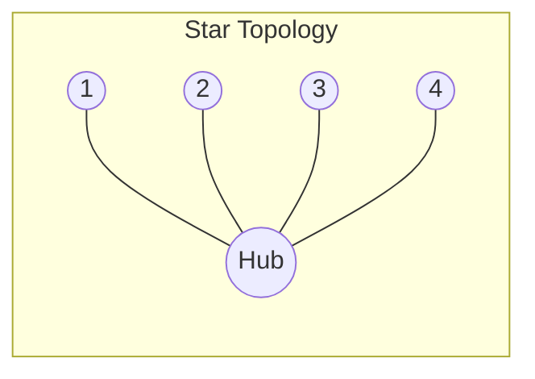
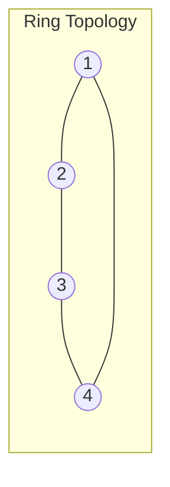
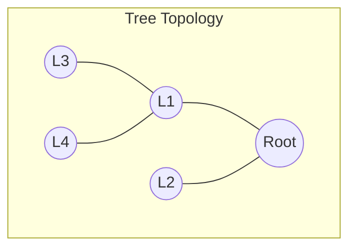
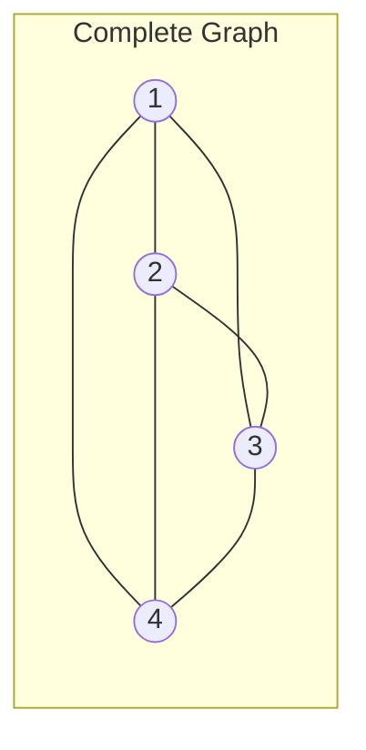

本記事は [Rethinking the Reliability of Multi-agent System: A Perspective from Byzantine Fault Tolerance](https://arxiv.org/abs/2511.10400) の解説記事です。

この記事は [Zenn記事: OpenAI Agents SDK×Portkey Gatewayで耐障害AIエージェントを構築する](https://zenn.dev/0h_n0/articles/e82e33ac9ce098) の深掘りです。

## 論文概要（Abstract）

LLMベースのマルチエージェントシステムが複雑なタスクを協調的に解決する手法として注目を集めるなか、個々のエージェントが誤った応答や悪意ある振る舞いを示した場合にシステム全体の信頼性がどう変化するかは未解明であった。著者らは、分散システムにおけるビザンチン障害耐性（Byzantine Fault Tolerance, BFT）の枠組みを用いてLLMベースマルチエージェントシステムの信頼性を定量的に分析している。主な発見として、LLMベースのエージェントは従来型エージェントと比較して誤ったメッセージフローに対するスケプティシズム（懐疑性）が強く、古典的なBFTの制約 $f < n/3$ を超える障害率（最大85.7%、7ノード中6ノードがビザンチン障害）でも高い精度を維持できると報告されている。さらに著者らは、エージェントの内部信頼度を活用したCP-WBFT（Confidence Probe-based Weighted Byzantine Fault Tolerant）合意メカニズムを提案し、極端な障害条件下でも100%の精度を達成したと報告している。

## 情報源

- **論文タイトル**: Rethinking the Reliability of Multi-agent System: A Perspective from Byzantine Fault Tolerance
- **著者**: Lifan Zheng, Jiawei Chen, Qinghong Yin, Jingyuan Zhang, Xinyi Zeng, Yu Tian
- **arXiv ID**: 2511.10400
- **URL**: [https://arxiv.org/abs/2511.10400](https://arxiv.org/abs/2511.10400)
- **カテゴリ**: cs.MA（Multiagent Systems）, cs.AI, cs.CL
- **初版投稿**: 2025年11月13日
- **最終改訂**: 2025年12月16日（v2）
- **採択**: AAAI 2026
- **コード**: [https://github.com/Z1ivan/Byzantine-Fault-Tolerance-in-LLM-MAS](https://github.com/Z1ivan/Byzantine-Fault-Tolerance-in-LLM-MAS)

## カンファレンス情報: AAAI 2026

AAAI（Association for the Advancement of Artificial Intelligence）は人工知能分野における最大規模の国際会議の一つであり、採択率は例年20%前後である。本論文はAAI 2026に採択されている。

## 背景と動機（Background & Motivation）

マルチエージェントシステムでは、複数のエージェントがネットワークトポロジを介して情報を交換し、協調的に意思決定を行う。しかし個々のエージェントがハルシネーション、プロンプトインジェクション、あるいは意図的な改ざんにより誤った応答を返す場合、その影響がシステム全体に伝播する可能性がある。

著者らは、この問題をビザンチン障害耐性の観点から体系的に分析している。ビザンチン障害（Byzantine fault）とは、Lamportらが1982年に定式化した概念で、分散システム中のノードが任意の（悪意を含む）振る舞いを示す障害モデルである。古典的なBFTでは、$n$ノード中$f$ノードがビザンチン障害を示す場合、安全な合意形成には以下の制約が必要とされる。

$$
f < \frac{n}{3}
$$

すなわち、障害ノード数がネットワーク全体の1/3未満でなければ、正しい合意は保証されない。著者らは「LLMベースのエージェントはこの古典的制約を超える可能性がある」という仮説のもと、様々なネットワークトポロジと障害率で実験を行っている。

## 主要な貢献（Key Contributions）

- **LLMエージェントの懐疑性の定量的検証**: LLMベースのエージェントが従来型エージェントと比較して、誤ったメッセージフローに対して強い懐疑性を示すことを6種類のネットワークトポロジで実証
- **古典的BFT制約の超越**: 85.7%（7ノード中6ノード）の極端な障害率でも、LLMエージェントが高精度を維持することを確認。従来型エージェントはビザンチンノード2-3台で崩壊する
- **CP-WBFTの提案**: プロンプトレベル（PCP）と隠れ層レベル（HCP）の2段階の信頼度プローブを用いた重み付き合意メカニズムの設計と評価
- **複数タスク・トポロジでの汎用性検証**: GSM8K（数学的推論）、XSTest（安全性評価）、CommonsenseQA（常識推論）の3タスクで有効性を確認

## 技術的詳細（Technical Details）

### ビザンチン障害モデルの定式化

著者らは、$n$個のエージェントで構成されるネットワークにおいて、$f$個のビザンチンエージェントが存在する設定を用いている。ビザンチンエージェントは正しいエージェントの応答をランダムに変更し、誤情報をネットワークに注入する。

実験では以下の指標で信頼性を評価している。

- **IAA（Individual Agent Accuracy）**: 各エージェント単体の正答率
- **FAA（Final Aggregated Accuracy）**: 合意メカニズム適用後の最終正答率
- **RA（Round-level Accuracy）**: ビザンチンエージェントの応答一致率（従来型エージェントが100%であることは完全汚染を意味する）
- **BFTI（Byzantine Fault Tolerance Improvement）**: $\text{BFTI} = \text{FAA} - \text{IAA}$、集合知が個別エージェントの信頼性をどれだけ向上させたかを定量化する指標

### ネットワークトポロジ

著者らは6種類のネットワークトポロジでエージェント間通信パターンの影響を分析している（論文Figure 2より）。









各トポロジはビザンチンノードの配置位置（ハブ/リーフ、ルート/内部/末端、先頭/中間/末尾）によって異なる脆弱性を示す。完全グラフ（Complete Graph）は全ノード間に直接通信があるため冗長性が高く、チェーン（Chain）は直線配列のため障害伝播の影響を受けやすい。

### CP-WBFTアルゴリズム

CP-WBFT（Confidence Probe-based Weighted Byzantine Fault Tolerant）は、エージェントの信頼度スコアを重みとして用いる合意メカニズムである。著者らは2種類の信頼度プローブを設計している。

#### プロンプトレベル信頼度プローブ（PCP）

プロンプトに信頼度のキャリブレーション指示を付加し、LLMに回答と信頼度を同時に出力させる方式である。

$$
\mathcal{C}_{\text{PCP}}(\mathbf{x}) = \text{parse}(\mathcal{A}(\mathbf{x} \oplus \mathbf{p}_{\text{conf}}))
$$

ここで、
- $\mathbf{x}$: 入力クエリ
- $\mathbf{p}_{\text{conf}}$: 信頼度キャリブレーションプロンプト（出力フォーマット: `Answer: [number], Confidence: [0.00-1.00]`を強制）
- $\mathcal{A}$: LLMエージェント
- $\oplus$: プロンプト結合演算子

PCPはモデル内部へのアクセスを必要とせず、API経由で利用可能な点が利点である。

#### 隠れ層レベル信頼度プローブ（HCP）

モデルの中間層から内部表現を抽出し、線形分類器で信頼度を推定する方式である。

まず、回答トークンの隠れ状態をプーリングする。

$$
\mathbf{h}_p^{(l)} = \frac{1}{|T_a|} \sum_{t \in T_a} \mathbf{h}_t^{(l)}
$$

ここで、
- $\mathbf{h}_t^{(l)}$: レイヤー$l$におけるトークン$t$の隠れ状態ベクトル
- $T_a$: 回答部分のトークン集合
- $\mathbf{h}_p^{(l)}$: プーリング後の表現ベクトル

次に、PCAで次元削減した後、ロジスティック回帰で信頼度を算出する。

$$
\mathcal{C}_{\text{HCP}}(\mathbf{x}, \mathbf{y}) = \sigma(\mathbf{w}^T \cdot \text{PCA}(\mathbf{h}_p^{(l)}) + b)
$$

ここで、
- $\sigma(\cdot)$: シグモイド活性化関数
- $\mathbf{w}, b$: ロジスティック回帰のパラメータ
- PCA: 4096次元から256次元への次元削減

著者らは、特徴抽出におけるレイヤーの選択が精度に影響すると報告している（論文Table 3より）。LLaMA-3-8Bの場合、GSM8Kではレイヤー16、XSTestではレイヤー17が最適であり、LLaMA-3.1ではレイヤー12が選択されている。

| モデル | データセット | Pooled Acc | Answer Acc | Query Acc |
|--------|------------|-----------|-----------|-----------|
| LLaMA-3.1 | GSM8K | 85.29% | 84.23% | 71.27% |
| LLaMA-3 | GSM8K | 84.31% | 73.01% | 61.71% |
| LLaMA-3.1 | XSTest | 95.24% | 80.16% | 80.95% |

Pooled（回答トークン全体の平均プーリング）がAnswer-final（最終トークンのみ）やQuery-final（クエリ最終トークン）と比較して一貫して高精度であると報告されている。

#### 信頼度ガイド合意プロトコル

CP-WBFTの合意形成は2段階で行われる。

**第1段階 - 個別精緻化（Individual Refinement）**: 各エージェントが隣接ノードの応答と信頼度を比較し、自身の信頼度より高い隣接ノードの応答を採用する。

$$
\text{if } \mathcal{C}_j(\mathbf{x}) > \mathcal{C}_i(\mathbf{x}): \quad \text{agent } i \text{ adopts response of agent } j
$$

**第2段階 - グローバル集約（Global Aggregation）**: 同一回答を支持するエージェント群の平均信頼度で最終回答を決定する。

$$
\mathcal{R} = \arg\max_r \left( \frac{1}{|\mathcal{A}_r|} \sum_{i \in \mathcal{A}_r} \mathcal{C}_i^{\text{final}}(\mathbf{x}), \; |\mathcal{A}_r| \right)
$$

ここで、
- $\mathcal{R}$: 最終合意回答
- $\mathcal{A}_r$: 回答$r$を支持するエージェントの集合
- $\mathcal{C}_i^{\text{final}}$: 第1段階の精緻化後のエージェント$i$の最終信頼度
- タプルの第1要素（平均信頼度）で比較し、同値の場合は第2要素（支持者数$|\mathcal{A}_r|$）で解決

この方式は、古典的な多数決や単純平均とは異なり、信頼度の高いエージェントの判断に大きな重みを付与する。ビザンチンエージェントは一般に誤った回答に対して高い信頼度を示さないため、信頼度による重み付けが効果的に誤情報を排除する。

## 実装のポイント（Implementation）

CP-WBFTの合意メカニズムをPythonで実装する場合の擬似コードを以下に示す。

```python
from dataclasses import dataclass
from collections import defaultdict
import numpy as np


@dataclass(frozen=True)
class AgentResponse:
    """エージェントの応答と信頼度。"""
    agent_id: int
    answer: str
    confidence: float  # 0.0-1.0


def individual_refinement(
    responses: list[AgentResponse],
    adjacency: dict[int, list[int]],
) -> list[AgentResponse]:
    """第1段階: 隣接ノードの信頼度が高い場合に応答を採用。"""
    response_map = {r.agent_id: r for r in responses}
    refined: list[AgentResponse] = []
    for resp in responses:
        best = resp
        for nid in adjacency.get(resp.agent_id, []):
            neighbor = response_map[nid]
            if neighbor.confidence > best.confidence:
                best = AgentResponse(resp.agent_id, neighbor.answer, neighbor.confidence)
        refined.append(best)
    return refined


def global_aggregation(responses: list[AgentResponse]) -> str:
    """第2段階: 平均信頼度と支持者数で最終回答を決定。"""
    groups: dict[str, list[float]] = defaultdict(list)
    for resp in responses:
        groups[resp.answer].append(resp.confidence)
    return max(groups, key=lambda a: (np.mean(groups[a]), len(groups[a])))


def cp_wbft_consensus(
    responses: list[AgentResponse],
    adjacency: dict[int, list[int]],
) -> str:
    """CP-WBFT合意メカニズム。"""
    return global_aggregation(individual_refinement(responses, adjacency))
```

HCPの信頼度推定にはモデルの中間層アクセスが必要であり、プロダクション環境ではPCPのほうが実装が容易である。

## Production Deployment Guide

### AWS実装パターン

CP-WBFTベースのマルチエージェントシステムをAWSに展開する場合、エージェント数とトポロジに応じた構成選択が重要である。以下にコスト試算を示す（2026年10月時点のap-northeast-1リージョン概算値。実際のコストはトラフィックパターンにより変動する。最新料金はAWS料金計算ツールで確認を推奨）。

| 構成 | エージェント数 | 主要サービス | 月額概算 |
|------|--------------|-------------|---------|
| Small | 3-5ノード | Lambda + Bedrock API + SQS | $150-400 |
| Medium | 7-10ノード | ECS Fargate + Bedrock + ElastiCache | $800-2,000 |
| Large | 15+ノード | EKS + SageMaker Endpoints + Step Functions | $3,000-8,000 |

**Small**: 各エージェントをLambda関数として実装し、Bedrock APIでLLM推論を実行する。SQSでエージェント間メッセージを非同期処理する。PCPベースの信頼度取得はAPI経由で完結する。**Medium**: ECS Fargateでエージェントをコンテナ化し、ElastiCacheで信頼度スコアと合意状態をキャッシュする。**Large**: EKSでオーケストレーション、SageMaker Endpointsでカスタムモデル（HCP用の信頼度プローブ）を運用、Step Functionsで合意プロトコルのワークフロー管理を行う。

### Terraformインフラコード

**Small構成（Serverless + Bedrock）**:

```hcl
# CP-WBFT Small構成 - Lambda + Bedrock + SQS
resource "aws_sqs_queue" "agent_messages" {
  name                       = "cpwbft-agent-messages"
  visibility_timeout_seconds = 60
  message_retention_seconds  = 3600
  sqs_managed_sse_enabled    = true
}

resource "aws_lambda_function" "agent_node" {
  function_name = "cpwbft-agent-node"
  runtime       = "python3.12"
  handler       = "handler.process_round"
  role          = aws_iam_role.agent_lambda.arn
  timeout       = 120
  memory_size   = 256
  environment {
    variables = {
      AGENT_QUEUE_URL    = aws_sqs_queue.agent_messages.url
      CONSENSUS_TABLE    = aws_dynamodb_table.consensus_state.name
      BEDROCK_MODEL_ID   = "anthropic.claude-sonnet-4-20250514"
      TOPOLOGY_TYPE      = "star"
      CONFIDENCE_METHOD  = "pcp"
    }
  }
}

resource "aws_dynamodb_table" "consensus_state" {
  name         = "cpwbft-consensus-state"
  billing_mode = "PAY_PER_REQUEST"
  hash_key     = "round_id"
  range_key    = "agent_id"
  attribute { name = "round_id"; type = "S" }
  attribute { name = "agent_id"; type = "S" }
  server_side_encryption { enabled = true }
  ttl { attribute_name = "ttl"; enabled = true }
}
```

IAMロールは最小権限原則で`bedrock:InvokeModel`、`sqs:SendMessage/ReceiveMessage`、`dynamodb:PutItem/GetItem/Query`のみ付与する。

**Large構成（EKS + Step Functions）**: EKS + Karpenterで構成。Step Functionsで合意ラウンドのオーケストレーション、`cluster_endpoint_public_access = false`でプライベートアクセスのみ。

### セキュリティベストプラクティス

- **エージェント間通信の暗号化**: SQSのSSE有効化、TLS 1.2以上を強制
- **ビザンチンエージェントの検出ログ**: 信頼度スコアの異常をCloudWatch Metricsで監視
- **信頼度スコアの改ざん防止**: DynamoDBのコンディション式で範囲（0.0-1.0）を検証
- **合意結果の監査証跡**: 各ラウンドの全応答・信頼度・最終合意をS3に保存

### 運用・監視設定

**CloudWatch Logs Insightsクエリ（合意プロトコル監視）**:

```
fields @timestamp, round_id, agent_id, confidence, answer, is_byzantine_suspected
| filter confidence < 0.3 OR confidence > 0.99
| stats count(*) as anomaly_count by agent_id, bin(1h)
| sort anomaly_count desc
```

**ビザンチンノード疑いの検出アラーム**: 特定エージェントの信頼度が継続的に他エージェントと乖離する場合にSNS通知を送信する。

### コスト最適化チェックリスト

**アーキテクチャ**: 3-5ノード→Serverless / 7-10ノード→Hybrid / 15+→Container(EKS)

**LLMコスト削減**: Bedrock Batch API（50%削減、非リアルタイム合意向け）、Prompt Caching（信頼度プロンプトの共通部分キャッシュで30-90%削減）、PCPとHCPの使い分け（PCPはAPI料金のみ、HCPはGPUインスタンスが必要）

**リソース最適化**: エージェント数の動的調整（低リスクタスクは3ノード、高リスクは7ノード以上）、合意ラウンド数の上限設定、DynamoDB TTL 24時間（合意状態は短命）

**監視**: AWS Budgets（80%/100%アラート）、CloudWatchアラーム（合意レイテンシp95）、Cost Anomaly Detection

## 実験結果（Results）

### 基本設定

著者らは7ノード（うち6ノードがビザンチン障害、障害率85.7%）という極端な設定で実験を行っている。古典的BFTでは$f < n/3 \approx 2.33$、すなわち最大2ノードまでしか安全を保証できない設定である。タスクはGSM8K（数学的推論）、XSTest（安全性評価）、CommonsenseQA（常識推論）の3種類を使用している。

### 従来型エージェント vs LLMエージェント（論文Table 1より）

7ノード・6ビザンチンの条件で、FAA（最終集約精度）を比較した結果を以下に示す。

| トポロジ | 従来型 RA | LLM FAA (GSM8K) | LLM FAA (XSTest) |
|----------|----------|-----------------|------------------|
| Chain | 100% | 70% | 20% |
| Complete Graph | 100% | 90% | 80% |
| Star (leaf malicious) | 100% | 90% | -- |
| Tree | 100% | 70% | 30% |
| Random Graph | 100% | 80% | 30% |

従来型エージェントのRA=100%は、全エージェントがビザンチンノードの誤答に完全に汚染されたことを意味する。一方、LLMエージェントはComplete Graphトポロジで最大90%のFAAを維持しており、LLMの「懐疑性」がビザンチン障害に対する耐性を提供していると著者らは分析している。

### CP-WBFT適用後の精度（論文Table 2より）

CP-WBFTの2方式（PCP/HCP）を適用した結果を以下に示す（6ビザンチンノード条件）。

**GSM8K**:

| トポロジ | PCP FAA | PCP BFTI | HCP FAA | HCP BFTI |
|----------|---------|----------|---------|----------|
| Complete Graph | 90.00% | +20.00 | 100.00% | +85.71 |
| Star (leaf) | 100.00% | +38.57 | 100.00% | +85.71 |
| Chain | 81.43% | +11.43 | 42.86% | +28.57 |

**XSTest**:

| トポロジ | PCP FAA | PCP BFTI | HCP FAA | HCP BFTI |
|----------|---------|----------|---------|----------|
| Complete Graph | 30.00% | +4.29 | 100.00% | +85.71 |
| Star (leaf) | 42.86% | +21.43 | 100.00% | +85.71 |

HCPは隠れ層から直接信頼度を抽出するため、PCPよりも高精度であることが示されている。特にComplete GraphおよびStarトポロジでは、HCPが100%のFAAを達成し、BFTIは+85.71ポイントに達している。一方、Chainトポロジでは直線構造の通信制約によりHCPでも42.86%にとどまっており、トポロジの選択が重要であると報告されている。

### 15ノード極端実験（論文Appendix Dより）

著者らは15ノード・14ビザンチン（障害率93.3%）という設定でも実験を行っている。HCPを用いたComplete GraphトポロジではGSM8K、XSTestともに100%のFAA（BFTI +93.33ポイント）を達成したと報告されている。

### CommonsenseQA

7ノード・6ビザンチンの条件で、Complete Graph + HCPが100%のFAA（BFTI +85.71ポイント）を達成している。複数のタスクドメインにわたってCP-WBFTの有効性が確認されている。

## 実運用への応用（Practical Applications）

本論文の知見は、Zenn記事で紹介されているOpenAI Agents SDK×Portkey Gatewayによる耐障害AIエージェント構築と密接に関連する。

**Portkey Gatewayとの相補性**: Portkey Gatewayはインフラレベルの障害耐性（ネットワーク障害、API障害のフォールバック・サーキットブレーカー）を提供し、CP-WBFTはセマンティックレベルの障害耐性（誤回答、ハルシネーション）に対応する。両者を組み合わせることで多層防御が構成可能である。

**エージェント間の合意形成**: OpenAI Agents SDKで構築されたマルチエージェントシステムにおいて、PCP方式で信頼度を取得しCP-WBFTで合意形成を行うことで、単一エージェントの障害影響を抑制できる。

**トポロジの選択指針**: Complete GraphまたはStarトポロジが障害耐性の観点で有利であり、Handoff構造（Star型）やParallel構造（Complete Graph型）を意識した設計が有効である。

## 関連研究（Related Work）

- **PBFT（Castro & Liskov, 1999）**: 暗号学的検証に基づく古典的BFTプロトコル。CP-WBFTはLLMのセマンティック推論能力を活用する点で異なる
- **HotStuff / Tendermint**: ブロックチェーン向けBFTプロトコル。確定的ファイナリティを提供するが、LLMの信頼度を活用する機構は持たない
- **Raft（Ongaro & Ousterhout, 2014）**: CFT（Crash Fault Tolerance）アルゴリズム。ビザンチン障害には非対応
- **LLMベースマルチエージェント研究**: AutoGen、CrewAI、LangGraph等が提案されているが、ビザンチン障害耐性の観点からの体系的分析は本論文が初めてである

## まとめと今後の展望

本論文は、LLMベースマルチエージェントシステムの信頼性をビザンチン障害耐性の枠組みで初めて体系的に分析した研究である。LLMエージェントが示す「懐疑性」は古典的BFT制約$f < n/3$を超える障害耐性を実現し、CP-WBFTの導入によりComplete Graph・Starトポロジでは障害率85.7%でも100%の精度を達成したと報告されている。

課題として、Chainトポロジでの性能低下、HCPのモデル内部アクセス要件、レイヤー選択のタスク依存性が挙げられる。PCPの導入容易性とHCPの高精度のトレードオフを考慮し、Portkey Gatewayと組み合わせた多層防御が有効である。

## 参考文献

- **arXiv**: [https://arxiv.org/abs/2511.10400](https://arxiv.org/abs/2511.10400)
- **Code**: [https://github.com/Z1ivan/Byzantine-Fault-Tolerance-in-LLM-MAS](https://github.com/Z1ivan/Byzantine-Fault-Tolerance-in-LLM-MAS)
- **AAAI Conference**: [https://aaai.org/conference/aaai/aaai-26/](https://aaai.org/conference/aaai/aaai-26/)
- **Related Zenn article**: [https://zenn.dev/0h_n0/articles/e82e33ac9ce098](https://zenn.dev/0h_n0/articles/e82e33ac9ce098)
