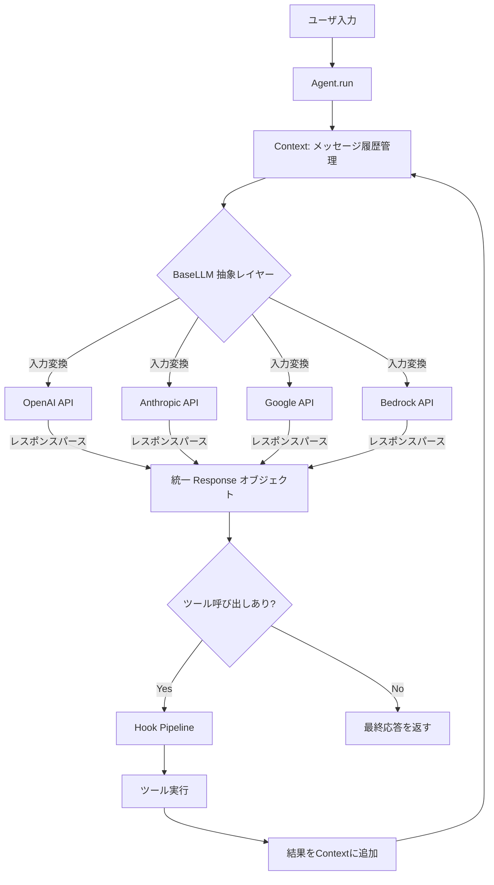

本記事は <https://arxiv.org/abs/2601.02577> の解説記事です。

## 論文概要（Abstract）

Orchestral AIは、複数のLLMプロバイダに対して統一的かつ型安全なインターフェースを提供する軽量Pythonフレームワークである。著者らは、現在のLLMエージェント開発においてプロバイダごとにAPIが断片化している問題を指摘し、メッセージフォーマット・ツールスキーマ・使用量トラッキングを一元化する抽象レイヤーを提案している。同期実行モデルとジェネレータベースのストリーミングを採用することで、決定論的な挙動とデバッグの容易さを両立させている。

この記事は [Zenn記事: OpenAI Agents SDK×Portkey Gatewayで耐障害AIエージェントを構築する](https://zenn.dev/0h_n0/articles/e82e33ac9ce098) の深掘りです。

## 情報源

- **arXiv ID**: 2601.02577
- **URL**: <https://arxiv.org/abs/2601.02577>
- **著者**: Alexander Roman, Jacob Roman
- **発表年**: 2026年1月
- **分野**: cs.AI（Artificial Intelligence）

## 背景と動機（Background & Motivation）

LLMエージェント開発の現場では、OpenAI、Anthropic、Google、Mistral、AWS Bedrockなど複数のプロバイダが独自のAPIを提供している。著者らは、この断片化がもたらす以下の課題を指摘している。

第一に、**ベンダーロックイン問題**がある。特定プロバイダのSDKに依存したコードは、他プロバイダへの移行時に大規模な書き換えが必要となる。メッセージフォーマット、ツール定義スキーマ、レスポンス構造がプロバイダごとに異なるため、抽象化なしでは同一ロジックを複数プロバイダで実行することが困難である。

第二に、**ツール定義の冗長性**がある。各プロバイダが独自のJSON Schemaフォーマットを要求するため、同一のツールであってもプロバイダごとにスキーマを手動で記述する必要がある。

第三に、**非同期実行モデルの複雑さ**がある。多くの既存フレームワークはasync/awaitベースの実行モデルを採用しているが、これはデバッグの難しさ、イベントループの非決定論性、スタックトレースの不明瞭さを招く。

これらの課題に対して、Orchestralはプロバイダ抽象化レイヤー、Pythonの型ヒントからの自動スキーマ生成、同期実行モデルという3つの設計方針で解決を図っている。

## 主要な貢献（Key Contributions）

- **貢献1: プロバイダ非依存な統一インターフェース** — OpenAI、Anthropic、Google、Groq、Mistral、AWS Bedrock、Ollamaを含む主要プロバイダに対し、1行のコード変更でプロバイダを切り替え可能な`BaseLLM`抽象クラスを提供
- **貢献2: Pythonの型ヒントからの自動ツールスキーマ生成** — 関数デコレータまたはクラスベースの定義から、各プロバイダ固有のJSON Schemaを自動生成し、Pydanticによる入力バリデーションを統合
- **貢献3: 同期実行モデルとジェネレータベースのストリーミング** — async/awaitを排除し、決定論的な挙動と完全なスタックトレースによるデバッグ容易性を実現
- **貢献4: セキュリティ・承認フックシステム** — ツール実行の前後にフックを挿入し、危険なコマンドのブロック、ユーザ承認ワークフロー、出力のトランケーションを実現

## 技術的詳細（Technical Details）

### プロバイダ抽象化レイヤーのアーキテクチャ

Orchestralの中核は`Agent`オブジェクトであり、LLM（プロバイダ抽象化）、Tools（型安全な実行）、Context（メッセージ履歴）の3コンポーネントをオーケストレーションする。

著者らは`BaseLLM`抽象クラスを設計し、各プロバイダの実装が以下の4つの責務を担うと述べている。

1. **入力処理**: フレームワークの`Context`をプロバイダ固有のメッセージ形式に変換
2. **API呼び出し**: 同期およびストリーミングAPIの実行
3. **出力パース**: プロバイダ固有のレスポンスを統一`Response`オブジェクトに変換
4. **ツールスキーマ変換**: フレームワーク定義からプロバイダ固有のフォーマットに変換

### メッセージフォーマットの統一化

以下のMermaidダイアグラムは、Orchestralにおけるメッセージフローの概要を示す。



`Context`クラスは以下のフィールドを管理する。

- `messages: list[Message]` — 会話メッセージの履歴
- `total_cost: float` — 全API呼び出しのコスト合計
- `metadata: dict` — 任意のメタデータ

著者らによると、`Context`はプロバイダ非依存なJSON形式でシリアライズ可能であり、異なるプロバイダ間で会話の継続が可能である。また、`undo()`で直前のターンを削除、`copy()`で会話を分岐させる機能も提供している。

### Pythonの型ヒントからの自動ツールスキーマ生成

Orchestralは2つのツール定義方式を提供している。

**デコレータベース（ステートレス）**: `@define_tool()`デコレータにより、通常のPython関数をツールとして登録する。型アノテーションから自動的にJSON Schemaが生成され、Pydanticによる入力バリデーションが適用される。

```python
from orchestral import define_tool

@define_tool()
def search_database(
    query: str,
    max_results: int = 10,
    include_metadata: bool = False
) -> list[dict[str, str]]:
    """データベースを検索して結果を返す。

    Args:
        query: 検索クエリ文字列
        max_results: 最大結果数
        include_metadata: メタデータを含めるかどうか

    Returns:
        検索結果のリスト
    """
    # 実装コード
    results = db.search(query, limit=max_results)
    if include_metadata:
        return [{"title": r.title, "meta": r.metadata} for r in results]
    return [{"title": r.title} for r in results]
```

この関数定義から、Orchestralは以下の処理を自動で行う。

1. **パラメータ抽出**: `query: str`, `max_results: int`, `include_metadata: bool`を型アノテーションから取得
2. **JSON Schema生成**: 各プロバイダ固有のフォーマット（OpenAI形式、Anthropic形式など）に変換
3. **Pydanticバリデーション**: 実行時に入力値の型チェックを実施
4. **エラーハンドリング**: バリデーション失敗時にLLMへフィードバック

**クラスベース（ステートフル）**: `BaseTool`を継承し、`RuntimeField`（LLMに公開するパラメータ）と`StateField`（内部状態）を分離する。

```python
from orchestral import BaseTool, RuntimeField, StateField

class FileEditorTool(BaseTool):
    """ファイル編集ツール（状態管理付き）。

    Attributes:
        file_path: 編集対象のファイルパス（LLMが指定）
        content: 書き込み内容（LLMが指定）
        file_hashes: 読み取り済みファイルのハッシュ（内部状態）
    """
    file_path: str = RuntimeField(description="編集対象のファイルパス")
    content: str = RuntimeField(description="書き込む内容")
    file_hashes: dict[str, str] = StateField(default_factory=dict)

    def execute(self) -> str:
        """ファイルを編集する。未読ファイルの編集を防止する。"""
        if self.file_path not in self.file_hashes:
            return "エラー: 先にファイルを読み取ってください"
        current_hash = compute_hash(self.file_path)
        if current_hash != self.file_hashes[self.file_path]:
            return "警告: ファイルが外部から変更されています"
        write_file(self.file_path, self.content)
        return f"{self.file_path} を更新しました"
```

著者らは、`StateField`をLLMから隠蔽することで、ツールの内部状態をLLMの判断から分離し、安全性を確保していると述べている。

### 同期実行モデル

Orchestralは意図的にasync/awaitを排除し、同期実行モデルを採用している。著者らは、非同期モデルが以下の問題を引き起こすと主張している。

- イベントループによる非決定論的な実行順序
- スタックトレースの分断によるデバッグの困難さ
- asyncコンテキストの伝播に伴うコードの複雑化

ストリーミングはPythonのジェネレータを用いて実現される。フレームワークはストリームチャンクを集約し、インターリーブされた並列ツール呼び出しを適切に処理し、プロバイダ固有の使用量レポート（チャンクごと vs 最終チャンクでの報告）を統一的に扱う。

### マルチターンエージェントループ

`Agent.run()`メソッドは以下の手順でループを実行する。

1. ユーザメッセージをContextに追加し、`fix_orphaned_results()`で孤立したツール結果を修復
2. LLMにContextを送信してレスポンスを取得
3. レスポンスにツール呼び出しがあれば、Pre-hookパイプライン（承認・セキュリティチェック）を通過させた上でツールを実行
4. Post-hookパイプライン（出力変換・トランケーション）を適用し、結果をContextに追加
5. ツール呼び出しがなくなるか、最大イテレーション数に達するまで2-4を繰り返す

著者らは、`fix_orphaned_results()`が重要であると述べている。ツール呼び出しIDと結果IDの不整合は、各プロバイダのAPIで不明瞭なエラーを引き起こすため、ループ開始前に自動的に検出・除去される。

### フックシステム

Orchestralのフックシステムは、ツール実行の前後にインターセプトポイントを提供する。`BaseHook`を継承し、`before_call()`と`after_call()`を実装する。

著者らは以下のビルトインフックを提供している。

| フック名 | 種別 | 機能 |
|---------|------|------|
| `SafeguardHook` | セキュリティ | LLMベースの安全性分析 |
| `UserApprovalHook` | セキュリティ | 3段階分類（SAFE/APPROVE/UNSAFE） |
| `DangerousCommandHook` | セキュリティ | パターンベースの危険コマンドブロック |
| `TruncateHook` | 出力処理 | 出力の長さ制限 |
| `SummarizeHook` | 出力処理 | LLMベースの出力要約 |

`UserApprovalHook`は3段階の分類システムを用いる。SAFEに分類されたツール呼び出しは即座に実行され、APPROVEに分類されたものはユーザの承認を求め、UNSAFEに分類されたものは拒否される。

### MCP統合

Orchestralは Model Context Protocol（MCP）サーバを`BaseTool`インターフェースに適応させることで、MCPエコシステムとの互換性を実現している。著者らによると、MCPツールはOrchestral固有のツールと同じ型安全性・プロバイダ非依存性を維持しながら利用可能であり、既存のMCPサーバ資産を活用できる。

### サブエージェント

`BaseSubagent`は`BaseTool`を拡張し、ツール内部に独自の`Agent`インスタンスを保持する。これにより、階層的なタスク分解と再帰的なエージェント呼び出しが可能となる。著者らは、この設計により「文明は思考せずに実行できる操作を拡張することで進歩する」というAlfred North Whiteheadの原則に従い、複雑さをサブエージェントとフックにカプセル化していると述べている。

## 実装のポイント（Implementation）

### OpenAI SDKとの比較

OpenAI SDKではツールスキーマをJSON形式で手動定義する必要があるのに対し、Orchestralでは型ヒント付き関数をそのまま利用できる。

```python
from orchestral import Agent, define_tool
from orchestral.llm import OpenAILLM, AnthropicLLM

@define_tool()
def search_database(query: str, max_results: int = 10) -> list[dict[str, str]]:
    """データベースを検索して結果を返す。"""
    return db.search(query, limit=max_results)

# OpenAIで実行
agent = Agent(llm=OpenAILLM(model="gpt-4o"), tools=[search_database])
result = agent.run("最新の論文を検索して")

# Anthropicに切り替え（llm引数の変更のみ）
agent = Agent(llm=AnthropicLLM(model="claude-sonnet-4-20250514"), tools=[search_database])
result = agent.run("最新の論文を検索して")
```

OpenAI SDKでは同じツールでもプロバイダごとにJSON Schemaを書き分ける必要があるが、Orchestralではツール定義が1回で済み、プロバイダの切り替えは`llm`引数の変更のみで完結する。

### 実装時の注意点

著者らが述べている実装上の重要なポイントをまとめる。

1. **EditFileTool の read-before-edit 安全機構**: ファイル編集ツールは、未読のファイルに対する編集を拒否する。また、読み取り後にファイルが外部から変更された場合を検出するハッシュベースの検証を実施する。

2. **RunCommandTool の永続シェルセッション**: コマンド実行ツールは作業ディレクトリと環境変数をセッション間で保持する。これはLLMの自然な期待（前のコマンドで`cd`したディレクトリに引き続きいるはず）に沿った設計である。

3. **コンテキストのコスト追跡**: `Context`は全API呼び出しのトークン使用量と課金額を自動追跡する。マルチプロバイダ環境では異なる料金体系の合算が必要となるため、この機能が重要である。

## Production Deployment Guide

OrchestralのようなマルチプロバイダエージェントフレームワークをAWS上に展開する際の実装パターンを示す。

### AWS実装パターン（コスト最適化重視）

| 構成 | トラフィック | サービス構成 | 月額コスト目安 |
|------|------------|------------|--------------|
| Small | ~100 req/日 | Lambda + Bedrock + DynamoDB + API Gateway | $50-150 |
| Medium | ~1,000 req/日 | ECS Fargate + Bedrock + ElastiCache + ALB | $300-800 |
| Large | 10,000+ req/日 | EKS + Karpenter(Spot) + Bedrock + Aurora | $2,000-5,000 |

**注意**: コスト試算は2026年10月時点のAWS ap-northeast-1（東京）リージョンの料金に基づく概算値である。実際のコストはトラフィックパターン、リージョン、バースト使用量により変動するため、最新料金はAWS料金計算ツールで確認することを推奨する。

**Small構成の詳細**:
- Lambda（256MB, 平均実行時間5秒）: ~$3/月
- API Gateway（REST API）: ~$4/月
- DynamoDB（On-Demand、会話履歴保存）: ~$5/月
- Bedrock（Claude Sonnet / GPT-4o 相当、100 req/日）: ~$30-130/月
- CloudWatch Logs: ~$3/月

**コスト削減テクニック**:
- Bedrock Batch APIで非同期リクエストを50%削減
- Prompt Caching有効化でリピートプロンプトのコストを30-90%削減
- DynamoDB On-Demandモードで未使用時の課金をゼロに

### Terraformインフラコード

**Small構成（Serverless）** の主要リソース:

```hcl
# IAMロール（最小権限原則: Bedrock呼び出しのみ許可）
resource "aws_iam_role_policy" "bedrock_invoke" {
  name = "bedrock-invoke-policy"
  role = aws_iam_role.agent_lambda.id
  policy = jsonencode({
    Version = "2012-10-17"
    Statement = [{
      Effect   = "Allow"
      Action   = ["bedrock:InvokeModel", "bedrock:InvokeModelWithResponseStream"]
      Resource = "arn:aws:bedrock:ap-northeast-1::foundation-model/*"
    }]
  })
}

# Lambda関数（エージェントループ実行）
resource "aws_lambda_function" "agent" {
  function_name = "orchestral-agent"
  runtime       = "python3.12"
  handler       = "main.handler"
  role          = aws_iam_role.agent_lambda.arn
  timeout       = 300  # エージェントループの最大実行時間
  memory_size   = 256
  environment {
    variables = {
      DYNAMODB_TABLE   = aws_dynamodb_table.conversations.name
      DEFAULT_PROVIDER = "bedrock"
      MAX_ITERATIONS   = "10"
    }
  }
}

# DynamoDB（会話履歴保存、On-Demandでコスト最適化）
resource "aws_dynamodb_table" "conversations" {
  name         = "orchestral-conversations"
  billing_mode = "PAY_PER_REQUEST"
  hash_key     = "conversation_id"
  range_key    = "timestamp"
  attribute { name = "conversation_id"; type = "S" }
  attribute { name = "timestamp"; type = "N" }
  server_side_encryption { enabled = true }
}
```

**Large構成（Container）** では、EKS + Karpenter（Spot優先）+ Secrets Manager + AWS Budgets を組み合わせる。Karpenter NodePoolで`capacity-type: ["spot", "on-demand"]`を指定し、`consolidationPolicy: WhenEmptyOrUnderutilized`で未使用ノードを自動削除することで最大90%のコスト削減を実現する。

### 運用・監視設定

**CloudWatch Logs Insights クエリ**（コスト異常検知）:

```
fields @timestamp, provider, model, input_tokens, output_tokens
| stats sum(input_tokens) as total_input, sum(output_tokens) as total_output,
        count(*) as request_count by bin(1h) as hour
| filter total_input > 100000
| sort hour desc
```

**監視の主要設定項目**:

- **CloudWatch アラーム**: Bedrockの`InputTokenCount`メトリクスに対し、1時間あたり50,000トークン超過でSNS通知を発火する。Lambda実行時間の異常検知（P95 > 60秒）も設定する
- **X-Ray トレーシング**: `aws_xray_sdk`の`patch_all()`でboto3を自動計装し、プロバイダ名・ツール数をアノテーションとして記録する。エージェントループ全体を1つのセグメントとして追跡可能にする
- **Cost Explorer日次レポート**: Bedrock/Lambda/EKSの日次コストをCost Explorer APIで取得し、$100/日超過時にSNS通知を送信する

### コスト最適化チェックリスト

**アーキテクチャ選択**:
- [ ] トラフィック~100 req/日 → Serverless（Lambda + Bedrock）
- [ ] トラフィック~1,000 req/日 → Hybrid（ECS Fargate + Bedrock）
- [ ] トラフィック10,000+ req/日 → Container（EKS + Spot）

**リソース最適化**:
- [ ] EC2/EKS: Spot Instances優先（最大90%削減）
- [ ] Reserved Instances: 1年コミットで最大72%削減
- [ ] Savings Plans: Compute Savings Plansの検討
- [ ] Lambda: メモリサイズをPower Tuningで最適化
- [ ] ECS/EKS: Karpenterでアイドル時自動スケールダウン

**LLMコスト削減**:
- [ ] Bedrock Batch API: 非同期処理で50%削減
- [ ] Prompt Caching: システムプロンプトの再利用で30-90%削減
- [ ] モデル選択ロジック: タスク複雑度に応じてHaiku/Sonnet/Opusを切り替え
- [ ] トークン数制限: max_tokensパラメータの適切な設定
- [ ] Context Compaction: 長い会話の要約で入力トークン削減

**監視・アラート**:
- [ ] AWS Budgets: 月額予算の80%/100%で通知
- [ ] CloudWatch: トークン使用量・レイテンシのアラーム
- [ ] Cost Anomaly Detection: 自動異常検知の有効化
- [ ] 日次コストレポート: Cost Explorer APIで自動レポート

**リソース管理**:
- [ ] 未使用リソース: 未使用のNAT Gateway・EIP・EBS削除
- [ ] タグ戦略: `project:orchestral`, `env:prod`で全リソースにタグ付与
- [ ] ライフサイクルポリシー: CloudWatch Logsの保持期間を30日に設定
- [ ] 開発環境: 夜間・週末のEKSノード自動停止
- [ ] ECRイメージ: 古いイメージの自動削除ポリシー

## 実験結果（Results）

### 既存フレームワークとの比較

著者らは、Orchestralの設計上の位置づけを既存フレームワークと比較して以下のように整理している。

| 特性 | Orchestral | CrewAI | LangGraph | OpenAI Agents SDK |
|------|-----------|--------|-----------|-------------------|
| プロバイダ非依存 | 全主要プロバイダ対応 | 限定的 | LangChain経由 | OpenAIのみ |
| ツールスキーマ生成 | 型ヒント自動生成 | 手動定義 | 手動定義 | 手動定義 |
| 実行モデル | 同期 | 非同期 | 非同期 | 非同期 |
| フックシステム | Pre/Post hook | なし | コールバック | Guardrails |
| MCP統合 | ネイティブ対応 | なし | なし | ネイティブ対応 |
| コスト追跡 | 組み込み | なし | なし | なし |

著者らによると、Orchestralは「1行のコード変更でプロバイダを切り替え可能」という設計目標を達成している。CrewAIやLangGraphがマルチエージェントの協調パターンに特化しているのに対し、Orchestralは単一エージェントの信頼性とプロバイダ可搬性に注力している。

### 現時点での制限事項

著者らは以下の制限事項を明示している。

- **並列ツール実行の未対応**: ツールは逐次実行されるため、独立した複数ツールの同時実行ができない
- **自動コンテキスト圧縮の未実装**: 長い会話でのコンテキストウィンドウ超過に対する自動対処がない（ツールとして提供予定）
- **マルチエージェント協調の限定性**: サブエージェントは提供されているが、CrewAIのような高度な協調パターン（委任、投票など）は未実装
- **マルチモーダル対応の限定性**: 視覚的入力のネイティブ処理は限定的

## 実運用への応用（Practical Applications）

### Portkey Gatewayとの関連

Zenn記事「OpenAI Agents SDK×Portkey Gatewayで耐障害AIエージェントを構築する」では、Portkey Gatewayを用いたマルチプロバイダフォールバックが紹介されている。Orchestralとの関連を考えると、両者は異なるレイヤーで同じ課題（ベンダーロックインの回避）に取り組んでいる。

**Portkey Gateway**: ネットワークレイヤーでのプロバイダ切り替え。APIゲートウェイとしてリクエストをルーティングし、障害時に別プロバイダへフォールバックする。アプリケーションコードの変更は不要だが、ゲートウェイ自体がSPOF（単一障害点）になりうる。

**Orchestral**: アプリケーションレイヤーでのプロバイダ抽象化。コード内でプロバイダを切り替え可能にし、ツールスキーマの再定義を不要にする。フォールバックロジックはアプリケーション側で制御するため、より柔軟な戦略が取れる。

実運用では、Portkey Gatewayによるネットワークレベルのフォールバックと、Orchestralによるアプリケーションレベルのプロバイダ抽象化を組み合わせることで、多層的な耐障害性を実現できる可能性がある。

### プロダクション適用時の考慮点

- **レイテンシ**: 同期実行モデルのため、並列ツール実行が必要な場面ではスループットが制約となる
- **スケーリング**: ステートレスな設計のため、Lambda/ECSでの水平スケーリングに適している
- **コスト管理**: 組み込みのコスト追跡により、プロバイダ別・モデル別のコスト分析が可能

## 関連研究（Related Work）

- **LangChain / LangGraph**: LLMアプリケーション構築の代表的フレームワーク。LangGraphはDAGベースのワークフロー制御を提供するが、プロバイダ固有のアダプタ実装が必要。Orchestralはより薄い抽象化レイヤーに注力している。
- **CrewAI**: マルチエージェント協調に特化したフレームワーク。役割ベースのエージェント定義と委任パターンを提供する。Orchestralはサブエージェント機能を持つが、協調パターンはCrewAIほど充実していない。
- **OpenAI Agents SDK**: OpenAI純正のエージェント構築SDK。Guardrailsやハンドオフなどの機能を提供するが、OpenAI以外のプロバイダには対応していない。
- **Model Context Protocol (MCP)**: Anthropicが提案したツール連携の標準プロトコル。Orchestralはこのプロトコルをネイティブにサポートし、MCPサーバのツールを透過的に利用可能にしている。

## まとめと今後の展望

Orchestral AIは、LLMエージェント開発におけるプロバイダ断片化の問題に対し、統一的かつ型安全なインターフェースを提供するフレームワークである。著者らは、Pythonの型ヒントからの自動スキーマ生成、同期実行モデルによるデバッグ容易性、フックベースのセキュリティ制御という3つの柱でこの課題に取り組んでいる。

今後の展望として、著者らは自動コンテキスト圧縮、マルチエージェント階層協調の強化、MCPディスカバリの拡充、サーバレス/エッジ環境向けの軽量デプロイ最適化を挙げている。マルチプロバイダ環境でのエージェント構築が一般化する中、この種の抽象化レイヤーの重要性は増していくと考えられる。

## 参考文献

- **arXiv**: <https://arxiv.org/abs/2601.02577>
- **Related Zenn article**: <https://zenn.dev/0h_n0/articles/e82e33ac9ce098>
