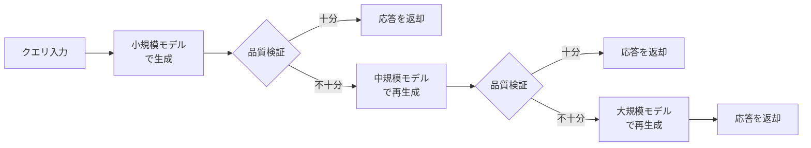

本記事は [https://arxiv.org/abs/2603.04445](https://arxiv.org/abs/2603.04445) の解説記事です。関連するZenn記事「[OpenAI Agents SDK×Portkey Gatewayで耐障害AIエージェントを構築する](https://zenn.dev/0h_n0/articles/e82e33ac9ce098)」もあわせてご参照ください。

## 情報源

| 項目 | 内容 |
|------|------|
| タイトル | Dynamic Model Routing and Cascading for Efficient LLM Inference: A Survey |
| 著者 | Yasmin Moslem, John D. Kelleher |
| 所属 | ADAPT Centre, Trinity College Dublin / Huawei Ireland |
| 掲載 | Transactions on Machine Learning Research (TMLR) 2026 |
| arXiv | [2603.04445](https://arxiv.org/abs/2603.04445) (初版: 2026年2月, v3: 2026年8月) |

## 背景と動機

LLMの商用利用が拡大するにつれ、推論コストの最適化が重要な課題となっている。GPT-4クラスの大規模モデルはあらゆるタスクに高い性能を示す一方、単純な質問にも高額なAPIコストが発生する。著者らはこの問題を「クエリの特性に応じて適応的にモデルを選択する動的ルーティングシステム」で解決できると主張している。

本サーベイが執筆された背景には、以下の3つの要因がある。

1. **モデルの多様化**: 数十のLLMが異なるコスト・性能特性で利用可能になり、タスクごとの最適モデルが異なる状況が一般化した
2. **コストの爆発**: 大規模モデルのAPI呼び出しコストが運用上の制約となり、全クエリを最強モデルに投入する戦略が現実的でなくなった
3. **ルーティング研究の急増**: 2024年以降、ルーティング手法の提案が相次ぎ、体系的な整理が求められていた

著者らは、既存のルーティング手法を網羅的に調査し、統一的な分類体系（タクソノミー）を構築することで、研究者と実務者の双方に見通しを提供することを目指している。

## 主要な貢献

著者らの貢献は以下の3点に整理できる。

1. **7カテゴリのタクソノミー構築**: ルーティング手法をクエリ難易度、人間選好、クラスタリング、不確実性、強化学習、マルチモーダル、カスケーディングの7つのパラダイムに分類した
2. **3次元の概念フレームワーク**: ルーティング決定を「いつ（タイミング）」「何を（情報源）」「どのように（計算手法）」の3軸で分析する枠組みを提示した
3. **コスト品質トレードオフの定量的整理**: 代表的システムの性能を横断的に比較し、30-60%のコスト削減が品質を大きく損なわずに達成可能であることを示した

## 技術的詳細: 7カテゴリのタクソノミー

著者らが提示するルーティング手法の全体像を以下のMermaidダイアグラムに示す。

```mermaid
graph TD
    A[LLMルーティング手法] --> B[クエリ難易度評価]
    A --> C[人間選好ベース]
    A --> D[クラスタリング・表現ベース]
    A --> E[不確実性駆動]
    A --> F[強化学習]
    A --> G[マルチモーダル]
    A --> H[カスケーディング]

    B --> B1[分類器ベース<br/>BEST-Route, vLLM Semantic Router]
    B --> B2[埋め込みベース<br/>EmbedLLM, RouterDC]
    B --> B3[グラフベース<br/>GraphRouter, ICL-Router]
    B --> B4[項目応答理論<br/>IRT-Router]

    C --> C1[アリーナデータ活用<br/>RouteLLM, Eagle]
    C --> C2[合成選好データ<br/>Arch-Router]
    C --> C3[報酬モデル蒸留<br/>Zooter]
    C --> C4[ユーザ履歴活用<br/>GMTRouter, P2L]

    D --> D1[K-meansクラスタリング<br/>UniRoute]
    D --> D2[多段パラダイム<br/>Avengers/Avengers-Pro]
    D --> D3[2段カスケード<br/>CRE-Router]

    F --> F1[方策最適化<br/>Router-R1, R2-Reasoner, SCOPE]
    F --> F2[バンディット手法<br/>MetaLLM, MixLLM, PILOT]
    F --> F3[エネルギー考慮<br/>GreenServ]

    E --> E1[共形予測<br/>CP-Router]
    E --> E2[隠れ状態プローブ]
    E --> E3[自己検証]

    G --> G1[視覚言語<br/>ReLope, VL-RouterBench]
    G --> G2[ベンチマーク<br/>MMR-Bench]

    H --> H1[固定リスト<br/>FrugalGPT]
    H --> H2[適応的選択<br/>Cascade Routing]
    H --> H3[自己検証エスカレーション<br/>AutoMix, Self-REF]
    H --> H4[アンサンブル<br/>LLM-Blender]
    H --> H5[トークンレベル<br/>R2R]
```

### 1. クエリ難易度評価（Difficulty-Aware Routing）

クエリの複雑さを推定し、簡単なクエリを小規模モデルに、困難なクエリを大規模モデルにルーティングする手法群である。

著者らはこのカテゴリに属する代表的システムを以下のように整理している。

| システム | 手法 | 特徴 |
|----------|------|------|
| BEST-Route | DeBERTa-v3-smallルーター + best-of-nn サンプリング | マルチヘッドルーティングとコスト推定 |
| vLLM Semantic Router | ModernBERT分類器 | 複雑さに応じてChain-of-Thoughtを選択的に適用 |
| RouteLMT | モデル内LoRAプローブ | 限界的な性能向上がある場合のみルーティング |
| EmbedLLM | 行列分解による埋め込み | 明示的なラベルなしでクエリ-モデル適合性を予測 |
| RouterDC | 対照学習 | サンプル-LLMおよびサンプル-サンプル間の対照損失 |
| ICL-Router | In-context能力ベクトル | 2段階学習で新規モデルを再学習なしで統合 |
| GraphRouter | グラフニューラルネットワーク | タスク/クエリ/LLM関係をモデル化、新規モデルへの汎化 |
| IRT-Router | 項目応答理論 | LLMの能力とクエリの難易度・識別力をモデル化 |

IRT-Routerの定式化では、モデル$$m$$がクエリ$$q$$に正答する確率を項目応答理論に基づいて以下のようにモデル化する。

$$P(\text{correct}) = f(\text{ability}_m, \text{difficulty}_q, \text{discrimination}_q)$$

ルーティングスコアはこの正答確率からコストを差し引いた値として計算される。

$$\text{routing\_score} = P(\text{correct}) - \beta \cdot \text{cost}_m$$

ここで$$\beta$$はコストと品質のトレードオフを制御するハイパーパラメータである。RouterBenchでの評価では、IRT-Routerは\$0.55/クエリで80.69%の精度を達成し、ベースラインの\$1.15/クエリと比較して約52%のコスト削減を実現したと報告されている。

### 2. 人間選好ベースルーティング（Preference-Aligned Routing）

人間のフィードバックデータやペアワイズ比較を活用してルーティングを行う手法群である。

| システム | 学習データ | アーキテクチャ | 結果 |
|----------|-----------|---------------|------|
| RouteLLM | Chatbot Arena + LLM Judge | 行列分解, BERT, 因果LLM | CPT(50%)=13.40% |
| Arch-Router | 合成選好データ | 1.5Bパラメータルーター | ドメイン-アクションペアのルーティング |
| P2L | タスク固有Bradley-Terry | LLM生成のプロンプト固有係数 | クエリごとのカスタムモデルランキング |
| GMTRouter | ユーザインタラクション履歴 | 異種グラフGNN | 限られたインタラクションからの個人化 |
| Eagle | ELOランキング | グローバル+ローカルELO | 学習不要の選好ランキング |
| Zooter | QwenRM報酬モデル | mDeBERTa-v3-base | 知識蒸留アプローチ |

RouteLLMの評価指標CPT(50%)は「性能ギャップの50%を回復するために強力なモデル（GPT-4）に送る必要があるクエリの最小割合」を意味する。RouteLLMの13.40%という値は、ランダムルーティングと比較して60.4%の改善に相当すると著者らは報告している。

### 3. クラスタリング・表現ベースルーティング（Clustering-Based Routing）

教師なし学習でクエリを類似グループに分類し、各クラスタに適したモデルを割り当てる手法群である。

著者らはUniRouteのコスト調整スコアリングを以下の式で示している。

$$\text{selection} = \arg\min_m \left(\text{error\_rate}_m(\text{cluster}) + \lambda \cdot \text{cost}_m\right)$$

UniRouteはK-meansクラスタリングにより、推論時に新しいLLMを追加でき、タスクラベルが不要という利点がある。LearnedMapスコアは0.711で、ZeroRouterの0.689を上回り、オラクル上限の0.720-0.723に迫る性能を示している。

Avengers/Avengers-Proは「埋め込み→クラスタリング→ランキング→ルーティング」の4段階パラダイムを採用し、プロプライエタリモデルに匹敵する性能を達成したと報告されている。

### 4. 不確実性駆動選択（Uncertainty-Driven Routing）

モデルの出力に対する信頼度スコアやトークン確率を用いてエスカレーション判断を行う手法群である。

| システム | アプローチ | 知見 |
|----------|-----------|------|
| CP-Router | 共形予測（Conformal Prediction） | 高不確実性の多肢選択問題をLRMにルーティング |
| プローブベースUQ | 隠れ状態分類器 | 言語化よりも高精度、重みアクセスが必要 |
| 自己検証 | Few-shotプロンプティングまたはファインチューニング | カスケードで有効、エスカレーション判断に使用 |

CP-Routerは共形予測を用いることで、統計的に保証された不確実性推定を提供する。これにより、高い不確実性を持つクエリのみを大規模推論モデル（LRM）にルーティングし、不要なコストを抑制する。

### 5. 強化学習アプローチ（RL-Based Routing）

著者らは強化学習ベースのルーティングを方策最適化とバンディット手法の2つに分類している。

#### 方策最適化

| システム | アルゴリズム | 特徴 |
|----------|------------|------|
| Router-R1 | PPO | "think"と"route"アクションを交互に実行、最大4ステップ |
| R2-Reasoner | GRPO | タスク分解+サブタスク割当、段階的SFT+RL |
| SCOPE | GRPO | 性能推定器の学習、モデルフィンガープリント活用 |
| xRouter | エンドツーエンドRL | ツールコール定式化、コスト考慮報酬信号 |

Router-R1は「考える（think）」と「ルーティングする（route）」の2種類のアクションを交互に実行し、最大4回のルーティングステップで最適なモデルを選択する。モデル記述子を用いることで、学習時に存在しなかった新規LLMへの汎化も可能であると著者らは述べている。

報酬関数は一般に以下の形式をとる。

$$\text{reward} = \text{accuracy} - \beta \cdot \text{cost}$$

#### バンディット手法

オンライン学習による探索と活用のバランスを取る手法群である。

| システム | フレームワーク | 特徴 |
|----------|--------------|------|
| MetaLLM | 多腕バンディット | 精度-コストトレードオフの最適化 |
| MixLLM | 文脈バンディット+方策勾配 | ドメイン認識タグとオンラインフィードバック |
| PILOT | LinUCB+選好事前分布 | オフライン選好データとオンラインフィードバックの統合 |
| GreenServ | LinUCB+エネルギーメトリクス | GPU消費電力の直接測定、16モデルプール |
| TI-UCB | 時間増加バンディット | 非定常な性能変化への対応、変化検出 |

PILOTはナップサック制約としてコスト制約を定式化している。

$$\min \sum \text{routing\_cost} \quad \text{s.t.} \quad \sum \text{quality} \geq \text{threshold}$$

MixLLMはGPT-4の品質の97.25%をコスト24.18%で達成し、ベースライン（96.39%品質、32.94%コスト）を上回る効率を示したと報告されている。

### 6. マルチモーダルルーティング

視覚言語モデル（VLM）へのルーティング拡張を扱う手法群である。

ReLoPeはAttention ProbeとKL正則化LoRAを用いて、マルチモーダルLLMにおける視覚トークンのノイズ劣化問題に対処している。VL-RouterBenchは14データセット、30,540サンプル、17モデル、50万以上のサンプル-モデルペアから構成される大規模ベンチマークであり、マルチモーダルルーティングの標準的な評価基盤を提供している。

### 7. カスケーディングアーキテクチャ

カスケーディングは、低コストモデルから順に試行し、品質が不十分な場合にのみ高コストモデルにエスカレーションする逐次的アプローチである。

| システム | 設計 | コンポーネント |
|----------|------|---------------|
| FrugalGPT | 2コンポーネント | LLMルーター（固定リスト）+ 品質スコアリング関数（DistilBERT） |
| Cascade Routing | 動的反復 | ステップごとに最適モデルを選択、スキップ/並べ替え可能 |
| AutoMix | 3段階プロセス | 生成→自己検証→POMDP基づくルーターエスカレーション |
| Self-REF | 軽量ファインチューニング | 特殊な信頼度トークンによる連続信頼度スコア抽出 |
| LLM-Blender | アンサンブル | Pair Ranker（ペアワイズ比較）+ Gen Fuser（応答統合） |
| R2R | トークンレベルルーティング | 個別トークンを小規模/大規模モデル間でルーティング |

FrugalGPTのパターンでは、固定されたモデルリストを順に試行し、各ステップで品質スコアリング関数が学習済み閾値と比較して受理判断を行う。Cascade Routingは各ステップでモデルを適応的に選択し、87.24%のAUCを達成している（ベースライン: 84.48%、11モデルプール）。

R2Rはトークンレベルでのルーティングという新しいアプローチを採用し、応答全体ではなく個別トークンの生成を小規模/大規模モデル間で切り替える。これにより、品質が分岐するトークンのみを大規模モデルに委ねることで、さらに細粒度なコスト最適化が可能となる。

## 3次元の概念フレームワーク

著者らはルーティング決定を分析するための3次元フレームワークを提示している。

### 次元1: いつ決定するか（Timing）

| タイミング | 説明 | 代表システム |
|-----------|------|-------------|
| 事前ルーティング | 生成前にクエリのみでモデルを選択 | BEST-Route, RouteLLM, UniRoute |
| 事後ルーティング | 生成後に応答品質でエスカレーション判断 | CP-Router, AutoMix, Self-REF |
| 多段階ルーティング | 事前選択→生成→評価→エスカレーションの逐次実行 | Cascade Routing, FrugalGPT |
| オンライン適応 | デプロイ中のフィードバックでポリシーを更新 | MixLLM, PILOT, GreenServ |

事前ルーティングはレイテンシオーバーヘッドが最小だが応答品質信号を利用できない。事後ルーティングはより豊富な信号（トークン確率、埋め込み）にアクセスできるがエスカレーションごとにレイテンシが増加する。

### 次元2: 何の情報を使うか（Information Sources）

- **クエリレベル信号**: 語彙的特徴（長さ、複雑さ）、意味的埋め込み、タスクカテゴリ
- **モデルメタデータ**: レイテンシ特性、コスト、ドメイン専門性プロファイル
- **応答レベル信号**: トークン確率、パープレキシティ、隠れ状態特徴、自己報告信頼度
- **フィードバック信号**: ユーザ満足度、ペアワイズ選好比較、正解ラベル

### 次元3: どのように計算するか（Computational Methods）

| 手法 | 特徴 | 代表システム |
|------|------|-------------|
| ヒューリスティック | 学習不要、閾値やコストベース | UniRoute, CRE-Router |
| 教師あり分類器 | オフライン学習、BERT/MLP/k-NN等 | BEST-Route, RouteLLM, Zooter |
| バンディット | オンライン学習、探索-活用バランス | PILOT, MixLLM, GreenServ |
| RL方策 | PPO/GRPOによる方策最適化 | Router-R1, R2-Reasoner, SCOPE |

## 主要システムの横断比較

著者らが整理した代表的システムのベンチマーク結果を以下にまとめる。

### MT-Bench評価

| システム | 品質低下 | コスト削減 | 備考 |
|----------|---------|-----------|------|
| BEST-Route | 1.59% | 60% | DeBERTa-v3-smallルーター |
| RouteLLM | CPT(50%)=13.40% | - | ランダム比60.4%改善 |
| Zooter | 7.11/10 | - | BMAベースライン6.72を上回る |
| HybridLLM | ≤1% | 20% | 40%コスト削減時は約4%低下 |

### RouterBench評価

| システム | 精度 | コスト | 指標 |
|----------|------|-------|------|
| IRT-Router | 80.69% | $0.55/クエリ | ベースライン$1.15比52%削減 |
| MixLLM | GPT-4の97.25% | 24.18%コスト | ベースライン(96.39%, 32.94%)を上回る |
| PILOT | GPT-4の93% | 25%コスト | MMLU単体: 86%性能, 27%コスト |
| GreenServ | 71.7%精度 | AIQ=0.607 | ε-greedyの0.637には未達 |
| Cascade Routing | 87.24% AUC | - | ベースライン84.48%、11モデルプール |

### 評価ベンチマーク一覧

著者らはルーティング評価に使用される主要ベンチマークを以下のように整理している。

| ベンチマーク | 規模 | カバレッジ | 特徴 |
|-------------|------|-----------|------|
| RouterBench | 405k出力 | 11 LLM × 7タスク | 事前計算済み、コストメタデータ |
| RouterEval | 200M件 | 8,500+ LLM × 12ベンチマーク | 最大規模、多クラス分類 |
| MixInstruct | 110k例 | 複数の指示データセット | 選好ベース教師あり |
| LLMRouterBench | 400k+件 | 21データセット × 33モデル | 包括的メトリクス |
| RouterArena | オープン | 知識ドメイン+難易度 | 継続的評価 |
| VL-RouterBench | 30,540サンプル | 14データセット × 17 VLM | 500k+サンプル-モデルペア |

評価対象タスクにはMMLU、MT-Bench、MBPP、HellaSwag、WinoGrande、GSM8K、ARC、TruthfulQAが含まれる。

### 評価指標

著者らは以下の指標を体系的に整理している。

- **ルーティング精度**: 最適モデルにルーティングされたクエリの割合
- **AUC**: コスト-品質曲線下面積
- **AIQ（Average Improvement in Quality）**: コスト範囲全体での平均品質改善
- **APGR（Average Performance Gap Recovered）**: 性能ギャップの平均回復率
- **CPT(x%)**: 性能ギャップのx%を回復するために強力なモデルに送る必要があるクエリの最小割合

効率性指標としては、E2EL（エンドツーエンドレイテンシ）、TTFT（最初のトークンまでの時間）、TPOT（トークンあたりの時間）、TPS（トークン/秒）、QPS（クエリ/秒）、エネルギー消費量が挙げられている。

## コスト品質トレードオフ分析

著者らは「適切に設計されたルーティングシステムは、モデル間の専門的な能力を戦略的に活用することで、最も強力な個別モデルさえも上回ることができる」と述べている。

### 典型的なトレードオフパターン

本サーベイで報告されているコスト品質トレードオフの主要な知見は以下の通りである。

1. **強力なモデルのコストの20-27%で、その品質の86-93%を達成可能**（PILOT, MixLLM）
2. **60%のコスト削減で品質低下は1.59%に抑制**（BEST-Route）
3. **40%のコスト削減で品質低下は4-10%**（HybridLLM）

### コスト削減メカニズム

著者らは以下の5つのコスト削減メカニズムを識別している。

| メカニズム | 説明 | 代表例 |
|-----------|------|--------|
| 難易度ベース振り分け | 簡単なクエリを小規模モデルに送る | BEST-Route（60%コスト削減） |
| 不確実性エスカレーション | 不確実な応答のみ上位モデルに送る | FrugalGPTパターン |
| 選択的推論活性化 | 推論が有益な場合のみ有効化 | vLLM Semantic Router |
| トークンレベルルーティング | 分岐するトークンのみ大規模モデルで生成 | R2R |
| エネルギー考慮選択 | GPUエネルギー消費の最適化 | GreenServ |

### パレートフロンティアアプローチ

Avengers-ProやCRE-Routerなど、完全な精度-コストフロンティアをトレースするシステムでは、運用者が単一の最適化目標にコミットするのではなく、自身の制約に合った動作点をフロンティア上で選択できると著者らは指摘している。

## 実運用への応用

### Portkey Gatewayとの関連

関連Zenn記事で扱われているPortkey Gatewayは、マルチプロバイダAPI統合とフェイルオーバーを提供するLLMゲートウェイである。本サーベイで整理されたルーティング手法は、このようなゲートウェイ上での実装と組み合わせることで実用的な価値を持つ。

具体的には、以下のような対応関係がある。

- **プロバイダレベルフェイルオーバー**: カスケーディングアーキテクチャ（FrugalGPT型）の実運用形態に相当する。プロバイダの障害時に別プロバイダへフォールバックする仕組みは、品質ベースのエスカレーションとは異なるが、同じ逐次的試行の枠組みで理解できる
- **コスト最適化ルーティング**: クエリ難易度ベースのルーティングをゲートウェイ層で実装し、簡単なクエリを低コストモデルに振り分ける
- **負荷分散**: バンディット手法（MixLLM, PILOT）のオンライン適応メカニズムは、プロバイダの応答時間やレート制限に応じた動的な負荷分散に応用可能である

### 実装上の課題

著者らは実運用での課題として以下を挙げている。

1. **レイテンシオーバーヘッド**: ルーター自体の推論時間が全体のレイテンシに加算される。事前ルーティングでは軽量分類器（DeBERTa等）のオーバーヘッドは小さいが、カスケーディングでは各段階での生成と検証にコストが発生する
2. **モデルバージョニング**: LLMプロバイダがモデルを更新すると、ルーターの学習済みパラメータが陳腐化する（ルーターの劣化問題）
3. **分布シフト**: 学習データと運用データの分布が異なる場合、ルーティング精度が低下する
4. **ルーティングの崩壊**: コスト制約なしではルーターが高コストモデルを過剰に選択する傾向がある

## 今後の研究方向

著者らは以下の研究方向を提示している。

1. **アーキテクチャの一般化**: 多様なアーキテクチャ、モダリティ、アプリケーションにわたって汎化するルーティングメカニズムの開発と評価が課題として残されている
2. **動的モデルプールへの対応**: モデルプールの変更時に完全な再学習なしでルーターを適応させる手法（ICL-Router, Router-R1のモデル記述子アプローチ）のさらなる発展
3. **不確実性定量化の改善**: マルチモーダル設定でのより良い不確実性定量化
4. **エネルギー考慮ルーティング**: トークンコストを超えたGPUエネルギー消費やCO2排出量を考慮したルーティング（GreenServの方向性）
5. **トークンレベルルーティングのスケーリング**: R2Rアプローチの大規模化
6. **安全性考慮ルーティング**: 安全性とアラインメントを考慮したルーティング（DSCベンチマークの知見）
7. **個人化**: 個々のユーザ選好への適応（GMTRouterの方向性）
8. **構成的システム**: 事前ルーター、検証器、エスカレーションポリシーの3段階パイプラインの統合最適化

## 関連研究

本サーベイは以下の研究領域と関連している。

- **Mixture of Experts (MoE)**: 単一モデル内でのエキスパート選択は、本サーベイが扱うモデル間のルーティングとは異なるが、ゲーティング機構の設計に共通点がある
- **スペキュレーティブデコーディング**: 小規模モデルでドラフト生成し大規模モデルで検証する手法は、カスケーディングと類似の構造を持つ
- **プロンプト圧縮（LLMLingua等）**: クエリの最適化はルーティングの前段として組み合わせ可能
- **モデルマージ**: 複数モデルの重みを統合する手法は、ルーティングとは異なるアプローチだが同じ目的（コスト効率の良い推論）を共有する

## まとめ

本サーベイは、LLMの動的モデルルーティングとカスケーディングに関する包括的な調査を提供している。著者らが構築した7カテゴリのタクソノミーと3次元の概念フレームワークは、急速に発展するこの分野の研究を整理するための有用な枠組みである。

実務的な観点からは、適切なルーティングシステムの導入により30-60%のコスト削減が品質を大きく損なわずに達成可能であることが示されている。BEST-Routeの60%コスト削減時の1.59%品質低下、MixLLMの24.18%コストでGPT-4品質の97.25%達成といった具体的な数値は、ルーティング導入の費用対効果を定量的に裏付けている。

一方で、モデルバージョニングへの対応、分布シフトへの頑健性、ルーティングの崩壊防止といった実運用上の課題も明確に指摘されており、今後の研究と実装の両面での発展が期待される。

## 参考文献

1. Moslem, Y., & Kelleher, J. D. (2026). Dynamic Model Routing and Cascading for Efficient LLM Inference: A Survey. *Transactions on Machine Learning Research (TMLR)*. [arXiv:2603.04445](https://arxiv.org/abs/2603.04445)
2. Ong, I., et al. (2024). RouteLLM: Learning to Route LLMs with Preference Data. [arXiv:2406.18665](https://arxiv.org/abs/2406.18665)
3. Chen, L., et al. (2023). FrugalGPT: How to Use Large Language Models While Reducing Cost and Improving Performance. [arXiv:2305.05176](https://arxiv.org/abs/2305.05176)
4. Ding, D., et al. (2024). Hybrid LLM: Cost-Efficient and Quality-Aware Query Routing. [arXiv:2404.14618](https://arxiv.org/abs/2404.14618)
5. Madaan, A., et al. (2024). AutoMix: Automatically Mixing Language Models. [arXiv:2310.12963](https://arxiv.org/abs/2310.12963)
6. Hu, S., et al. (2025). Router-R1: Learning to Route with Reinforcement Learning. [arXiv:2502.07813](https://arxiv.org/abs/2502.07813)
