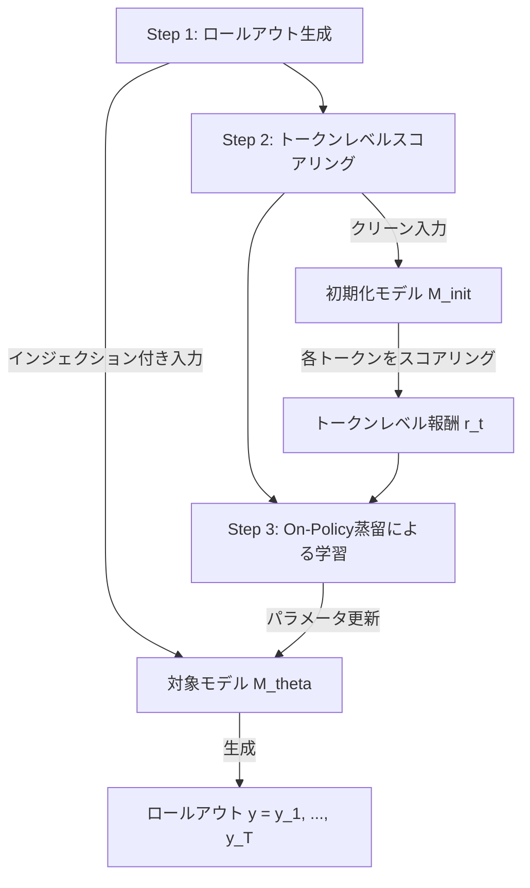
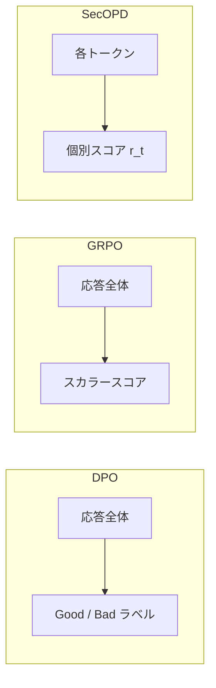

## 論文概要（Abstract）

本記事は [SecOPD: Mitigating Adaptive Prompt Injections by On-Policy Distillation](https://arxiv.org/abs/2608.21500) の解説記事です。

この記事は [Zenn記事: CaMeL×Spotlighting×LlamaFirewallで実装するプロンプトインジェクション防御2026](https://zenn.dev/0h_n0/articles/675527f0701b0b) の深掘りです。

SecOPDは、既存の防御的ファインチューニング手法（DPO、GRPO、SecAlign等）がシーケンスレベルフィードバックに依存し適応的攻撃に脆弱であるという課題に対し、**トークンレベルフィードバック**を導入した防御手法である。著者らは、インジェクションが挿入されたサンプルに対してモデルが生成したロールアウトの各トークンを、クリーン入力（インジェクションなし）を与えた初期化モデルで個別にスコアリングすることで、セキュリティを損なうトークンを精密に特定する仕組みを提案している。Qwen3.6-27Bにおいて、適応的攻撃PISmithに対するAttack Success Rate（ASR）を94.0%から9.0%へ低減したと報告されている。

## 情報源

- **会議名**: EMNLP 2026（Empirical Methods in Natural Language Processing）
- **年**: 2026
- **URL**: [https://arxiv.org/abs/2608.21500](https://arxiv.org/abs/2608.21500)
- **著者**: Yibo Peng, Long Lian, David Wagner, Sizhe Chen
- **発表形式**: Main Conference

## カンファレンス情報

EMNLP（Empirical Methods in Natural Language Processing）はACLが主催するNLP分野の主要国際会議の1つである。ACL、NAACLと並ぶトップ会議であり、採択率は例年20-25%程度と競争率が高い。SecOPDがMain Conferenceとして採択されたことは、LLMセキュリティ分野の重要性を示している。

## 技術的詳細（Technical Details）

### 既存手法の限界：シーケンスレベルフィードバックの問題

既存の防御的ファインチューニング手法（DPO、GRPO、SecAlign等）は、生成された応答全体を「安全」または「危険」としてスコアリングするシーケンスレベルフィードバックを採用している。この方式には根本的な限界がある。

モデルがインジェクション付き入力に対して長い応答を生成した場合、応答の大部分は正常なトークンであり、セキュリティを侵害するトークンはごく一部に限られる。シーケンスレベルでは応答全体に対して一様なフィードバック（良い/悪い）が与えられるため、正常なトークンに対する「意図しないペナルティ」や、危険なトークンに対する「不十分なペナルティ」が発生する。著者らはこの問題を**信用割当問題（credit assignment problem）**と呼んでいる。

適応的攻撃者（PISmith等）はこの信用割当の曖昧さを突いてインジェクションを最適化できるため、シーケンスレベルの防御は容易に回避される。Meta-SecAlignに対するPISmithのASRは94.0%に達したと報告されている。

### SecOPDの全体アーキテクチャ

SecOPDは以下の3つのステップで構成される。



**Step 1: ロールアウト生成**

対象モデル$M_\theta$に、プロンプトインジェクションが挿入された入力$x_{\text{inj}}$を与え、応答（ロールアウト）$y = (y_1, y_2, \ldots, y_T)$を自己回帰的に生成させる。ここで$T$は生成されたトークン数である。

**Step 2: トークンレベルスコアリング**

初期化モデル$M_{\text{init}}$（ファインチューニング前のベースモデル）に、インジェクションを除いたクリーンな入力$x_{\text{clean}}$を与え、Step 1で生成された各トークン$y_t$に対する条件付き対数尤度をスコアとして計算する。

$$
r_t = \log p_{M_{\text{init}}}(y_t \mid x_{\text{clean}}, y_{<t})
$$

ここで、
- $r_t$: トークン$y_t$に対するスコア（報酬信号）
- $p_{M_{\text{init}}}(y_t \mid x_{\text{clean}}, y_{<t})$: 初期化モデルがクリーン入力に基づいて予測する$y_t$の条件付き確率
- $y_{<t}$: トークン$y_t$より前に生成された全トークン列

このスコアリングの直感は明快である。クリーン入力を受け取った初期化モデルにとって「自然な」トークンは高いスコアを得る一方、インジェクションによって誘導された不自然なトークン（攻撃者の意図に沿った出力）は低いスコアとなる。このように、各トークンが「セキュリティを損なうかどうか」を個別に判定できる。

**Step 3: On-Policy蒸留によるファインチューニング**

トークンレベルのスコア$r_t$を用いて、対象モデル$M_\theta$のパラメータを更新する。具体的には、スコアが高い（クリーン入力に沿った安全な）トークンの生成確率を高め、スコアが低い（インジェクションに誘導された危険な）トークンの生成確率を低下させるように学習する。

### 損失関数の定式化

SecOPDの損失関数は以下のように定義される。

$$
\mathcal{L}_{\text{SecOPD}}(\theta) = -\frac{1}{T} \sum_{t=1}^{T} w_t \cdot \log p_{M_\theta}(y_t \mid x_{\text{inj}}, y_{<t})
$$

ここで、重み$w_t$はトークンレベルスコアに基づいて決定される。

$$
w_t = \sigma\bigl(\alpha \cdot (r_t - \bar{r})\bigr)
$$

ここで、
- $\sigma(\cdot)$: シグモイド関数
- $\alpha$: 温度パラメータ（スコアの差異をどの程度強調するかを制御）
- $\bar{r}$: ロールアウト全体のスコアの平均値$\bar{r} = \frac{1}{T}\sum_{t=1}^{T} r_t$

$r_t > \bar{r}$の場合、$w_t$は大きくなり、そのトークンの生成確率を強化する方向に学習が進む。逆に$r_t < \bar{r}$の場合、$w_t$は小さくなり、そのトークンの生成確率を抑制する。これにより、応答内の安全なトークンと危険なトークンを区別した精密な学習が実現される。

### DPO・GRPOとの比較



| 手法 | フィードバック粒度 | 信用割当 | 適応的攻撃耐性 |
|------|-------------------|---------|---------------|
| DPO | シーケンスレベル（ペア比較） | 一様 | 低 |
| GRPO | シーケンスレベル（スカラー報酬） | 一様 | 低 |
| SecAlign | シーケンスレベル（アライメント） | 一様 | 低 |
| **SecOPD** | **トークンレベル** | **トークン個別** | **高** |

DPOは応答全体を良い・悪いに二分し、GRPOは応答全体にスカラー報酬を割り当てる。SecOPDは各トークンにきめ細かなフィードバックを与えることで、信用割当問題を根本的に解決している。

### On-Policyの意義

「On-Policy」の名称は、スコアリング対象のロールアウトが現在のモデル$M_\theta$自身の生成物であることに由来する。Off-Policy手法では**分布シフト**（モデルの現在のポリシーと学習データの乖離）が発生するが、On-Policyでは実際に生成しうる応答に直接フィードバックを与えるため、適応的攻撃者がモデルの弱点を突く余地を縮小できる。

## 実装のポイント（Implementation）

### 学習パイプラインの擬似コード

```python
import torch
from transformers import AutoModelForCausalLM, AutoTokenizer
from typing import List


def compute_token_scores(
    init_model: AutoModelForCausalLM,
    clean_input_ids: torch.Tensor,
    rollout_ids: torch.Tensor,
) -> torch.Tensor:
    """初期化モデルによるトークンレベルスコアリング

    Args:
        init_model: ファインチューニング前の初期化モデル
        clean_input_ids: インジェクションを除いたクリーン入力のトークンID
        rollout_ids: 対象モデルが生成したロールアウトのトークンID

    Returns:
        各トークンのスコア (shape: [seq_len])
    """
    combined = torch.cat([clean_input_ids, rollout_ids], dim=-1)
    with torch.no_grad():
        logits = init_model(combined).logits

    # ロールアウト部分の各トークンに対する対数尤度を計算
    prompt_len = clean_input_ids.shape[-1]
    rollout_logits = logits[:, prompt_len - 1 : -1, :]  # shift by 1
    log_probs = torch.log_softmax(rollout_logits, dim=-1)

    # 実際に生成された各トークンの対数尤度を取得
    token_scores = log_probs.gather(
        dim=-1,
        index=rollout_ids.unsqueeze(-1),
    ).squeeze(-1)

    return token_scores.squeeze(0)  # [seq_len]


def compute_secopd_loss(
    model: AutoModelForCausalLM, injected_input_ids: torch.Tensor,
    rollout_ids: torch.Tensor, token_scores: torch.Tensor, alpha: float = 5.0,
) -> torch.Tensor:
    """SecOPD損失関数: 重み付き負の対数尤度"""
    combined = torch.cat([injected_input_ids, rollout_ids], dim=-1)
    logits = model(combined).logits
    prompt_len = injected_input_ids.shape[-1]
    log_probs = torch.log_softmax(logits[:, prompt_len - 1 : -1, :], dim=-1)
    token_log_probs = log_probs.gather(
        dim=-1, index=rollout_ids.unsqueeze(-1),
    ).squeeze(-1).squeeze(0)
    # w_t = sigmoid(alpha * (r_t - r_mean))
    weights = torch.sigmoid(alpha * (token_scores - token_scores.mean()))
    return -(weights * token_log_probs).mean()
```

### ハイパーパラメータの推奨値

著者らの実験に基づく推奨設定は以下の通りである。

| パラメータ | 推奨値 | 備考 |
|-----------|--------|------|
| 学習率 | 1e-6 ~ 5e-6 | モデルサイズにより調整 |
| 温度パラメータ$\alpha$ | 5.0 | スコア差の強調度合い |
| ロールアウト温度 | 0.7 | 多様性と品質のバランス |
| 最大生成トークン数 | 512 | タスクに応じて調整 |
| バッチサイズ | 4-8 | GPU VRAM に依存 |
| エポック数 | 1-3 | 過学習に注意 |

### 実装時の注意点

1. **初期化モデルの固定**: $M_{\text{init}}$は学習中に一切更新しない。勾配計算を避けるために`torch.no_grad()`で囲むか、`model.eval()`に設定する
2. **クリーン入力の準備**: インジェクション除去のために、学習データにはインジェクション付き入力とクリーン入力のペアが必要
3. **メモリ効率**: 2つのモデルをGPUに載せる必要があるため、初期化モデルは量子化（INT8/INT4）を検討する
4. **ロールアウトの多様性**: ロールアウト生成時にサンプリングを用いることで、攻撃パターンの多様性を確保する

## Production Deployment Guide

### AWS実装パターン（コスト最適化重視）

SecOPDファインチューニング済みモデルの推論構成と再学習パイプラインを示す。コスト試算は2026年10月時点のAWS東京リージョン料金に基づく概算値であり、実際のコストはトラフィックパターン等により変動する。

| 構成 | トラフィック | サービス | 月額目安 |
|------|------------|---------|---------|
| Small | ~100 req/日 | Lambda + Bedrock Custom Model | $80-200 |
| Medium | ~1,000 req/日 | ECS Fargate + SageMaker Endpoint | $400-900 |
| Large | 10,000+ req/日 | EKS + Spot GPU + SageMaker Training | $2,500-6,000 |

**Small構成**: Lambda関数からBedrock Custom Model Import（SecOPDファインチューニング済みモデル）を呼び出す。DynamoDB（On-Demand）でインジェクション検知ログを永続化し、CloudWatch Logsで異常パターンを監視する。Bedrock Batch APIの活用で推論コストを50%削減できる。

**Medium構成**: ECS Fargateでアプリケーションを稼働させ、SageMaker Endpointにファインチューニング済みモデルをデプロイする。Auto Scalingにより負荷に応じたスケーリングを実現する。Prompt Cachingの有効化で30-90%のコスト削減が見込まれる。

**Large構成**: EKSクラスタ上でKarpenterを用いたSpot GPU Instances（g5.xlarge等）の自動スケーリングを構成する。SageMaker Training Jobで定期的なSecOPD再学習パイプラインを稼働させる。Spot Instancesの活用で最大90%のコスト削減、Reserved Instancesの1年コミットで最大72%の削減が可能である。

### Terraformインフラコード

**Small構成（Serverless）**:

```hcl
# SecOPD防御モデル推論 - Serverless構成（2026-10時点）

resource "aws_iam_role" "secopd_lambda" {
  name = "secopd-inference-lambda"
  assume_role_policy = jsonencode({
    Version = "2012-10-17"
    Statement = [{ Action = "sts:AssumeRole", Effect = "Allow",
                    Principal = { Service = "lambda.amazonaws.com" } }]
  })
}

resource "aws_iam_role_policy" "secopd_lambda" {
  name = "secopd-lambda-policy"
  role = aws_iam_role.secopd_lambda.id
  policy = jsonencode({
    Version = "2012-10-17"
    Statement = [
      { Effect = "Allow", Action = ["bedrock:InvokeModel"],
        Resource = "arn:aws:bedrock:ap-northeast-1:*:custom-model/*" },
      { Effect = "Allow", Action = ["dynamodb:PutItem", "dynamodb:Query"],
        Resource = aws_dynamodb_table.injection_logs.arn },
      { Effect = "Allow", Action = ["logs:CreateLogGroup", "logs:CreateLogStream", "logs:PutLogEvents"],
        Resource = "arn:aws:logs:ap-northeast-1:*:*" },
    ]
  })
}

resource "aws_lambda_function" "secopd_inference" {
  function_name = "secopd-inference"
  runtime       = "python3.12"
  handler       = "handler.lambda_handler"
  role          = aws_iam_role.secopd_lambda.arn
  timeout       = 120
  memory_size   = 512
  environment { variables = { MODEL_ID = var.secopd_model_id, DYNAMODB_TABLE = aws_dynamodb_table.injection_logs.name } }
}

resource "aws_dynamodb_table" "injection_logs" {
  name         = "secopd-injection-logs"
  billing_mode = "PAY_PER_REQUEST"
  hash_key     = "request_id"
  range_key    = "timestamp"
  attribute { name = "request_id"; type = "S" }
  attribute { name = "timestamp"; type = "S" }
  server_side_encryption { enabled = true }
}

resource "aws_cloudwatch_metric_alarm" "high_injection_rate" {
  alarm_name          = "secopd-high-injection-rate"
  comparison_operator = "GreaterThanThreshold"
  evaluation_periods  = 3
  metric_name         = "InjectionDetected"
  namespace           = "SecOPD"
  period              = 300
  statistic           = "Sum"
  threshold           = 50
  alarm_actions       = [var.sns_topic_arn]
}
```

**Large構成（Container + GPU）**: EKS v1.31 + Karpenter NodePool（`g5.xlarge`/`g5.2xlarge`、Spot優先、アイドル30秒で縮退）+ AWS Budgets（月額$6,000上限、80%到達でSNS通知）を構成する。`cluster_endpoint_public_access = false`によりプライベートアクセスのみに制限する。

### 運用・監視設定

**CloudWatch Logs Insights クエリ**:

```
fields @timestamp, @message
| filter event = "injection_detected"
| stats count() as detection_count by bin(1h)
| sort @timestamp desc
```

**CloudWatch アラーム設定（Python）**:

```python
import boto3
cw = boto3.client("cloudwatch", region_name="ap-northeast-1")
cw.put_metric_alarm(
    AlarmName="secopd-token-usage-spike",
    MetricName="InputTokenCount", Namespace="AWS/Bedrock",
    Statistic="Sum", Period=3600, EvaluationPeriods=2,
    Threshold=500000, ComparisonOperator="GreaterThanThreshold",
    AlarmActions=["arn:aws:sns:ap-northeast-1:ACCOUNT:secopd-alerts"],
)
```

**X-Ray トレーシング**: `aws_xray_sdk`の`patch_all()`でboto3を自動計装し、`@xray_recorder.capture("secopd_inference")`で推論関数をトレースする。アノテーションに`model_type`、メタデータに`prompt_length`と`output_tokens`を記録することで、インジェクション検知時のレイテンシ分析が可能になる。

**Cost Explorer日次レポート**: `ce.get_cost_and_usage()`で`Project=secopd`タグのリソースコストを日次集計し、$100/日超過時にSNS通知を送信する構成を推奨する。

### コスト最適化チェックリスト

- [ ] トラフィック量に応じた構成選択（Serverless / Hybrid / Container）
- [ ] SecOPD再学習頻度とGPU使用時間の最適化
- [ ] Spot Instances優先（GPU: g5.xlarge Spotで最大90%削減）
- [ ] Reserved Instances 1年コミット（最大72%削減）
- [ ] Lambda メモリサイズ最適化（Power Tuningで検証）
- [ ] EKS Karpenter consolidation（アイドル時30秒で縮退）
- [ ] Bedrock Batch API使用（非リアルタイムで50%削減）
- [ ] Prompt Caching有効化（30-90%削減）
- [ ] モデル選択ロジック（軽量モデルでの事前フィルタリング）
- [ ] max_tokens設定で不要な長文生成を防止
- [ ] AWS Budgets（月額予算の80%でアラート）
- [ ] CloudWatch アラーム（トークン使用量スパイク検知）
- [ ] Cost Anomaly Detection有効化
- [ ] 日次コストレポートのSNS通知
- [ ] 未使用SageMaker Endpointの自動停止
- [ ] Projectタグ戦略（全リソースに`Project=secopd`タグ）
- [ ] S3ライフサイクルポリシー（学習チェックポイントの自動削除）
- [ ] 開発環境の夜間・週末停止スケジュール
- [ ] ECRイメージのライフサイクルポリシー（古いイメージの自動削除）
- [ ] Savings Plans（Compute Savings Plans検討）

## 実験結果（Results）

### 適応的攻撃に対する防御性能

著者らが報告した主要な実験結果を以下に示す（論文Table 1, Table 2より）。評価指標はAttack Success Rate（ASR）であり、低いほど防御性能が高い。

**PISmith適応的攻撃に対するASR（Qwen3.6-27B）**:

| 手法 | ASR (%) | 備考 |
|------|---------|------|
| ベースライン（防御なし） | 98.5 | ほぼ全攻撃が成功 |
| DPO | 72.3 | シーケンスレベルフィードバック |
| GRPO | 65.8 | シーケンスレベルスカラー報酬 |
| SecAlign | 58.2 | 静的アライメントデータ |
| Meta-SecAlign | 94.0 | 適応的攻撃に対して脆弱 |
| **SecOPD** | **9.0** | トークンレベルフィードバック |

SecOPDはASR 9.0%を達成し、次善のSecAlign（58.2%）と比較して49.2ポイントの改善を示している。Meta-SecAlignは静的攻撃には有効だが、適応的攻撃には94.0%まで劣化する。

### ドメイン汎化性能

著者らは、学習時に含まれていなかったツール呼び出しドメインにおける汎化性能も評価している。

| 手法 | 未見ツール呼び出し ASR (%) |
|------|--------------------------|
| Meta-SecAlign | 5.5 |
| **SecOPD** | **4.7** |

SecOPDは未見のドメインにおいてもMeta-SecAlignと同等以上の汎化性能を示しており、トークンレベルフィードバックが特定の攻撃パターンへの過学習を避けつつ一般化された防御能力を獲得していることを示唆している。

### ユーティリティの維持

著者らは、SecOPDが通常タスクの性能を大幅に損なわないことも確認している。ツール呼び出しタスクにおけるTask Completion Rate（TCR）はベースラインと同等水準を維持していると報告されている。

## 実運用への応用（Practical Applications）

### Zenn記事との関連

[Zenn記事](https://zenn.dev/0h_n0/articles/675527f0701b0b)ではCaMeL、Spotlighting、LlamaFirewallといった推論時の防御手法を組み合わせたアーキテクチャを解説している。SecOPDはこれらと異なり、**モデル自体をファインチューニング**して防御能力を内在化させるアプローチである。両者は排他的ではなく、相互補完的に活用できる。

**多層防御アーキテクチャの構成例**:

1. **入力層**: Spotlightingによるデータ境界の明示化
2. **モデル層**: SecOPDでファインチューニングされたモデルによる内在的防御
3. **出力層**: LlamaFirewall / CaMeLによる出力検証

### プロダクション適用時の考慮事項

- **再学習コスト**: 27Bモデルの場合A100 80GB x 4程度のリソースが必要だが、Spot Instancesで抑制可能
- **攻撃パターンの更新**: 新攻撃手法出現時はインジェクション学習データを更新し再学習が必要。CIパイプラインへの組み込みを推奨
- **レイテンシ**: 推論時のアーキテクチャ変更がないため、通常のモデルと同等のレイテンシで動作する

## 関連研究（Related Work）

- **SecAlign（Peng et al., 2025）**: 防御的ファインチューニングの先駆的手法。安全な応答と危険な応答のペアを用いたアライメント学習を行う。SecOPDはSecAlignのシーケンスレベルフィードバックの限界を克服した後続研究として位置づけられる
- **Meta-SecAlign（Peng et al., 2025）**: SecAlignの拡張版。メタ学習によりドメイン汎化性能を向上させたが、適応的攻撃に対しては94.0%のASRを示し脆弱であることがSecOPDの論文で指摘されている
- **DPO（Rafailov et al., 2023）**: Direct Preference Optimization。人間のフィードバックをペア比較で学習する汎用的手法。セキュリティ目的にも適用可能だが、シーケンスレベルの二値フィードバックのため信用割当の精度に限界がある
- **GRPO（Shao et al., 2024）**: Group Relative Policy Optimization。グループ化された応答のランキングを用いた強化学習手法。DPOより柔軟なフィードバックが可能だが、やはりシーケンスレベルの制約を受ける
- **PISmith（Peng et al., 2026）**: 防御モデルに対してインジェクションを反復的に最適化する適応的攻撃手法。SecOPDの主要な評価ベンチマークとして使用されている

## まとめと今後の展望

SecOPDは、防御的ファインチューニングにおけるトークンレベルフィードバックの有効性を実証した研究である。初期化モデルをトークンスコアラーとして活用するOn-Policy蒸留の枠組みにより、適応的攻撃に対するASRを94.0%から9.0%へ低減した。

今後の研究方向として、マルチモーダルモデルへの拡張、効率的なロールアウト戦略、エージェントシステムでの統合評価が著者らにより示唆されている。プロダクションでは、SecOPDによるモデル層の防御とCaMeL・LlamaFirewall等の推論時防御を組み合わせた多層防御が有効である。

## 参考文献

- **arXiv**: [https://arxiv.org/abs/2608.21500](https://arxiv.org/abs/2608.21500)
- **Conference**: EMNLP 2026 Main Conference
- **Related Zenn article**: [https://zenn.dev/0h_n0/articles/675527f0701b0b](https://zenn.dev/0h_n0/articles/675527f0701b0b)
