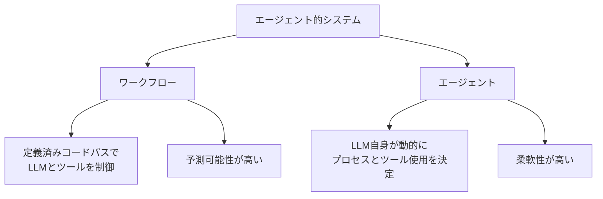
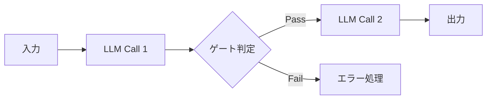
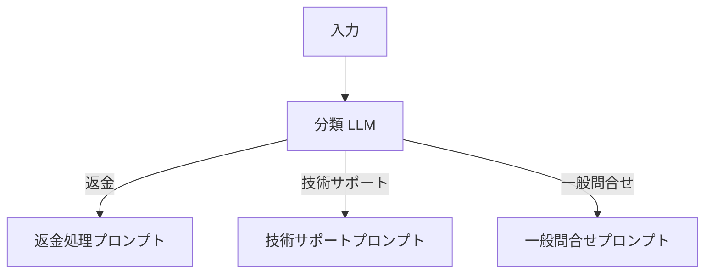
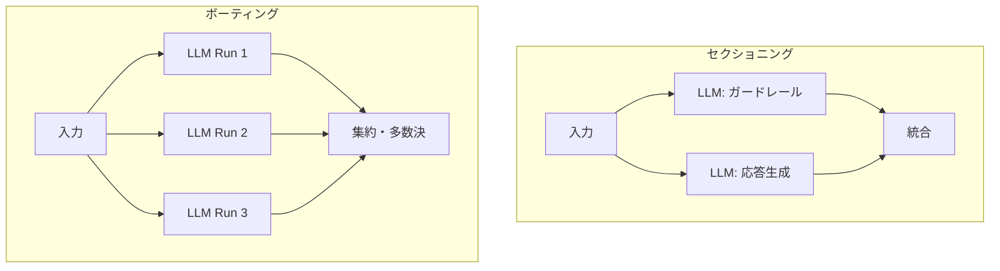
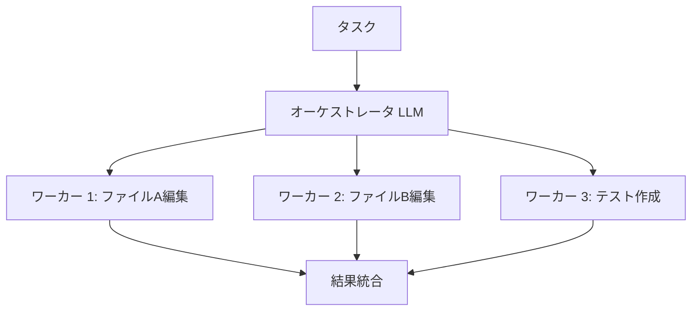
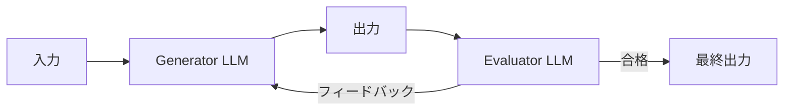

## ブログ概要（Summary）

本記事は [https://www.anthropic.com/engineering/building-effective-agents](https://www.anthropic.com/engineering/building-effective-agents) の解説記事です。

「Building Effective AI Agents」は、AnthropicのErik S.とBarry Zhangが2024年12月に公開した**AIエージェント設計の包括的ガイド**である。数十チームとの協業経験をもとに、LLMシステムを「ワークフロー」と「エージェント」に明確に区分し、5つのワークフローパターンを体系化している。「シンプルに始め、必要性が実証された場合にのみ複雑さを追加する」原則を一貫して強調し、ツール設計やフレームワーク選定の実践的指針を提供している。

この記事は [Zenn記事: OpenAI Agents SDK×Portkey Gatewayで耐障害AIエージェントを構築する](https://zenn.dev/0h_n0/articles/e82e33ac9ce098) の深掘りです。

## 情報源

- **種別**: 企業テックブログ
- **URL**: [https://www.anthropic.com/engineering/building-effective-agents](https://www.anthropic.com/engineering/building-effective-agents)
- **組織**: Anthropic Engineering
- **著者**: Erik S., Barry Zhang
- **発表日**: 2024年12月19日

## 技術的背景（Technical Background）

LLMの能力向上に伴い、「エージェント」と呼ばれるシステムの構築が急速に広まっている。しかしAnthropicは、この用語が曖昧に使われていることを指摘し、まず**設計上の区分を明確にすべき**だと述べている。

Anthropicの観察では、成功しているチームほどシンプルな構成から始めている。このガイドは「いつ構築すべきか」「どのパターンを選択すべきか」「どのようにツールを設計すべきか」に体系的に答える。Zenn記事で扱ったOpenAI Agents SDKやPortkey Gatewayは、本ブログが提示するパターンの具体的な実装例として位置づけられる。

## 実装アーキテクチャ（Architecture）

### ワークフロー vs エージェントの区別

Anthropicはエージェント的システムを2つのカテゴリに分類している。



- **ワークフロー**: LLMとツールが「定義済みコードパス」に沿って動作。開発者が処理フローを設計する
- **エージェント**: LLMが「自身のプロセスとツール使用を動的に指示」する。タスク分解・実行順序・ツール選択を自律的に判断する

この区別のうえで、Anthropicは**5つのワークフローパターン**を提示している。

### パターン1: Prompt Chaining（プロンプト連鎖）

タスクを固定された順序のステップに分解し、各LLM呼び出しが前のステップの出力を処理する。ステップ間にプログラム的なチェックポイント（ゲート）を設けることで、中間結果の品質を保証する。



**適用場面**: サブタスクが固定的で、速度よりも精度が重要なケース。

```python
from anthropic import Anthropic
client = Anthropic()

def prompt_chaining(text: str) -> dict:
    """Prompt Chaining: コピー生成 → ゲート判定 → 翻訳"""
    draft = client.messages.create(
        model="claude-sonnet-4-5-20250514", max_tokens=1024,
        messages=[{"role": "user", "content": f"製品の魅力的なコピーを書いてください:\n{text}"}]
    ).content[0].text

    if len(draft) < 50:  # Gate: 品質チェック
        raise ValueError("生成されたコピーが短すぎます")

    translated = client.messages.create(
        model="claude-sonnet-4-5-20250514", max_tokens=1024,
        messages=[{"role": "user", "content": f"英語に翻訳してください:\n{draft}"}]
    ).content[0].text
    return {"draft": draft, "translated": translated}
```

「アウトライン生成から本文作成」「コード生成からレビュー」といった例が挙げられている。

### パターン2: Routing（ルーティング）

入力を分類し、専門化された下流プロセスに振り分ける。各カテゴリに最適化されたプロンプトを用意することで、関心の分離（Separation of Concerns）を実現する。



**適用場面**: 入力に明確なカテゴリが存在し、カテゴリごとに異なる処理が必要なケース。

```python
import json
from anthropic import Anthropic

client = Anthropic()

ROUTE_HANDLERS = {
    "refund": "あなたは返金処理の専門家です。ポリシーに基づいて対応してください。",
    "technical": "あなたは技術サポートの専門家です。段階的にトラブルシューティングしてください。",
    "general": "あなたはカスタマーサービス担当です。丁寧に回答してください。",
}

def routing(query: str) -> str:
    """Routing: 問い合わせの自動振り分け"""
    # Step 1: 分類
    classification = client.messages.create(
        model="claude-haiku-3-5-20241022",
        max_tokens=64,
        messages=[{"role": "user", "content": (
            f"以下の問い合わせを refund/technical/general に分類してください。"
            f"JSONで {{'category': '...'}} のみ返してください:\n{query}"
        )}]
    ).content[0].text
    category = json.loads(classification)["category"]

    # Step 2: 専門プロンプトで処理
    response = client.messages.create(
        model="claude-sonnet-4-5-20250514",
        max_tokens=2048,
        system=ROUTE_HANDLERS[category],
        messages=[{"role": "user", "content": query}]
    ).content[0].text

    return response
```

Anthropicはモデルレベルのルーティング（簡易質問にHaiku、複雑質問にSonnet）も有効だと述べている。

### パターン3: Parallelization（並列化）

2つのバリエーションで同時処理を実現する。

- **セクショニング**: タスクを独立した並列サブタスクに分割する
- **ボーティング**: 同一タスクを複数回実行し、多様な出力を得る



**適用場面**: レイテンシ削減が必要な場合や、信頼性向上のために複数の視点が必要な場合。

```python
import asyncio
from anthropic import AsyncAnthropic

aclient = AsyncAnthropic()

async def parallelization_sectioning(user_input: str) -> dict:
    """Parallelization (Sectioning): ガードレールと応答生成の並列実行"""
    async def check_guardrail(text: str) -> bool:
        result = await aclient.messages.create(
            model="claude-haiku-3-5-20241022", max_tokens=16,
            messages=[{"role": "user", "content": f"不適切な内容を含むか判定。'safe'/'unsafe'のみ返答:\n{text}"}]
        )
        return result.content[0].text.strip().lower() == "safe"

    async def generate_response(text: str) -> str:
        result = await aclient.messages.create(
            model="claude-sonnet-4-5-20250514", max_tokens=2048,
            messages=[{"role": "user", "content": text}]
        )
        return result.content[0].text

    # asyncio.gatherで並列実行
    is_safe, response = await asyncio.gather(check_guardrail(user_input), generate_response(user_input))
    return {"response": response if is_safe else "不適切な入力が検出されました。", "is_safe": is_safe}
```

Anthropicはコードレビューでの「複数LLMによるボーティング」の有効性を挙げている。

### パターン4: Orchestrator-Workers（オーケストレータ・ワーカー）

中央のLLM（オーケストレータ）がタスクを動的に分解し、ワーカーLLMに委譲してから結果を統合する。Prompt Chainingとの違いは、サブタスクの数や内容が事前に固定されていない点にある。



**適用場面**: 必要なサブタスクが入力に応じて変化する複雑な問題。

```python
import json
from anthropic import Anthropic

client = Anthropic()

def orchestrator_workers(task: str) -> dict:
    """Orchestrator-Workers: 動的タスク分解と委譲"""
    # オーケストレータ: タスクを動的に分解
    plan = client.messages.create(
        model="claude-sonnet-4-5-20250514", max_tokens=1024,
        messages=[{"role": "user", "content": (
            f"タスクを独立サブタスクに分解。JSON [{{'subtask':'...','context':'...'}}] で返答:\n{task}"
        )}]
    ).content[0].text

    # ワーカー: 各サブタスクを並列実行（ここでは逐次で簡略化）
    results = []
    for st in json.loads(plan):
        result = client.messages.create(
            model="claude-sonnet-4-5-20250514", max_tokens=2048,
            messages=[{"role": "user", "content": f"実行:\n{st['subtask']}\n背景: {st['context']}"}]
        ).content[0].text
        results.append({"subtask": st["subtask"], "result": result})

    # オーケストレータ: 結果統合
    synthesis = client.messages.create(
        model="claude-sonnet-4-5-20250514", max_tokens=2048,
        messages=[{"role": "user", "content": f"元タスク: {task}\n結果:\n{json.dumps(results, ensure_ascii=False)}\n統合回答を生成。"}]
    ).content[0].text
    return {"subtasks": results, "synthesis": synthesis}
```

具体例として「複数ファイルにまたがるコード変更」や「複数情報源の横断検索」が挙げられている。

### パターン5: Evaluator-Optimizer（評価者・最適化者）

生成LLM（Generator）が応答を生成し、評価LLM（Evaluator）がフィードバックを返すループを形成する。評価基準が明確で、反復的な改善に価値がある場合に有効である。



**適用場面**: 明確な評価基準があり、反復改善の価値が測定可能なケース。

```python
import json
from anthropic import Anthropic

client = Anthropic()

def evaluator_optimizer(task: str, max_iterations: int = 3) -> dict:
    """Evaluator-Optimizer: 反復的な品質改善ループ"""
    current_output, history = "", []
    for i in range(max_iterations):
        prompt = f"タスク: {task}\n\n" + (
            f"前回出力:\n{current_output}\nフィードバック:\n{history[-1]['feedback']}\n改善してください。"
            if history else "最初の回答を生成してください。"
        )
        current_output = client.messages.create(
            model="claude-sonnet-4-5-20250514", max_tokens=2048,
            messages=[{"role": "user", "content": prompt}]
        ).content[0].text

        evaluation = json.loads(client.messages.create(
            model="claude-sonnet-4-5-20250514", max_tokens=512,
            messages=[{"role": "user", "content": (
                f"評価してください。\nタスク: {task}\n出力:\n{current_output}\n"
                f"JSON {{'pass': true/false, 'feedback': '...'}} で返答。"
            )}]
        ).content[0].text)
        history.append({"iteration": i + 1, **evaluation})
        if evaluation.get("pass"):
            break
    return {"final_output": current_output, "iterations": len(history)}
```

文学翻訳の品質改善や多段検索が具体例として挙げられている。

### ツール設計の原則（Agent-Computer Interface）

Anthropicは、ツール設計においてHCI（Human-Computer Interface）に匹敵する投資が必要だと強調している。

**フォーマット選択の指針**:

| 指針 | 説明 | 例 |
|------|------|-----|
| 十分なトークン | 出力前に推論のための余地を確保する | 構造化出力でも思考フィールドを追加 |
| 自然なフォーマット | インターネット上に自然に存在する形式を使用する | Markdown、JSON |
| 形式的オーバーヘッドの排除 | 行番号カウントや文字列エスケープを不要にする | 絶対パスの強制 |

**ポカヨケ設計の実例**: SWE-benchエージェント開発時、相対パスでの操作失敗が頻発した。**絶対パスの必須化**により「完璧（flawless）」な動作を実現したと報告している。パラメータ名の明確化、使用例の記載、ワークベンチでのテストも推奨されている。

## Production Deployment Guide

Anthropicが提唱する5つのワークフローパターンをAWS上で本番運用するための構成指針を示す。

### AWS実装パターン（コスト最適化重視）

**トラフィック量別の推奨構成**:

| 項目 | Small (~100 req/日) | Medium (~1,000 req/日) | Large (10,000+ req/日) |
|------|-------------------|----------------------|---------------------|
| **コンピュート** | Lambda | ECS Fargate | EKS + Spot Instances |
| **LLM** | Bedrock (Claude) | Bedrock + Prompt Caching | Bedrock Batch + Caching |
| **ルーティング** | API Gateway | ALB + API Gateway | ALB + NLB |
| **状態管理** | DynamoDB | DynamoDB + ElastiCache | Aurora + ElastiCache |
| **キュー** | SQS | SQS + Step Functions | SQS + EventBridge |
| **監視** | CloudWatch | CloudWatch + X-Ray | CloudWatch + X-Ray + Grafana |
| **月額概算** | $50-150 | $300-800 | $2,000-5,000 |

※東京リージョン概算値。実際のコストはトラフィックパターンにより変動。最新料金はAWS料金計算ツールで確認を推奨。

**コスト削減テクニック**: Spot Instances（最大90%削減）、Reserved Instances（最大72%削減）、Bedrock Batch API（50%削減）、Prompt Caching（30-90%削減）を組み合わせる。

### Terraformインフラコード

**Small構成（Serverless）: Lambda + Bedrock + DynamoDB**

```hcl
# IAMロール（最小権限: Bedrock InvokeModelのみ許可）
resource "aws_iam_role_policy" "bedrock_invoke" {
  name = "bedrock-invoke"
  role = aws_iam_role.agent_lambda.id
  policy = jsonencode({
    Version = "2012-10-17"
    Statement = [{
      Effect   = "Allow"
      Action   = ["bedrock:InvokeModel", "bedrock:InvokeModelWithResponseStream"]
      Resource = "arn:aws:bedrock:ap-northeast-1::foundation-model/anthropic.claude-*"
    }]
  })
}

# Lambda関数（ワークフロー実行、タイムアウト300s）
resource "aws_lambda_function" "agent_workflow" {
  function_name = "agent-workflow-handler"
  runtime       = "python3.12"
  handler       = "handler.main"
  role          = aws_iam_role.agent_lambda.arn
  timeout       = 300
  memory_size   = 512
  environment {
    variables = {
      WORKFLOW_TABLE = aws_dynamodb_table.workflow_state.name
    }
  }
}

# DynamoDB（ワークフロー状態管理、TTL付き）
resource "aws_dynamodb_table" "workflow_state" {
  name         = "agent-workflow-state"
  billing_mode = "PAY_PER_REQUEST"
  hash_key     = "workflow_id"
  range_key    = "step_id"
  attribute { name = "workflow_id"; type = "S" }
  attribute { name = "step_id"; type = "S" }
  ttl { attribute_name = "expires_at"; enabled = true }
}
```

### 運用・監視設定

**CloudWatch Logs Insightsクエリ**: ワークフローパターン別レイテンシ分析

```
fields @timestamp, workflow_pattern, duration_ms, token_count
| filter level = "INFO" and event = "workflow_complete"
| stats avg(duration_ms) as avg_latency, p95(duration_ms) as p95_latency,
        sum(token_count) as total_tokens
  by workflow_pattern
| sort avg_latency desc
```

**X-Rayトレーシング**: `aws_xray_sdk`による`boto3`自動計装でBedrock呼び出しのトレーシングを実現する。ワークフローパターン名やトークン数をアノテーションに記録し、パターン別のコスト分析に活用できる。

### コスト最適化チェックリスト

| カテゴリ | チェック項目 |
|---------|------------|
| アーキテクチャ | トラフィック量でServerless/Container選択 |
| LLMコスト | Routingでモデル使い分け、Caching、Batch API |
| 監視 | AWS Budgets、Cost Anomaly Detection |
| リソース | タグ戦略統一、TTL設定、夜間停止 |

## パフォーマンス最適化

Anthropicのガイドから導出される最適化の方向性を整理する。

| 手法 | 適用パターン | 効果 |
|------|------------|------|
| Parallelization（セクショニング） | 独立サブタスク | 直列比で最大N倍高速化 |
| Routing（モデル選択） | 入力の難易度判定 | 簡易入力でHaiku使用時、レイテンシ大幅削減 |
| Prompt Caching | 全パターン共通 | 繰り返しプロンプトのTTFT削減 |

Anthropicが述べる「フォーマットオーバーヘッドの排除」はトークン消費の削減にも直結する。Orchestrator-Workersパターンではワーカー数の動的調整がスループット向上の鍵となるが、Anthropicは過剰なスケーリング設計を戒めている。

## 運用での学び（Operational Insights）

### 「シンプルに始める」原則

Anthropicは「最もシンプルな解決策を見つけ、必要な場合にのみ複雑さを追加する」と主張している。具体的には、(1) エージェント的システムをそもそも構築しない選択肢の検討、(2) 単一LLM呼び出しでの解決、(3) Prompt ChainingやRoutingからの開始、(4) 真に必要な場合のみエージェント導入、という段階的アプローチを推奨している。

Anthropicはこのトレードオフを明確に述べている。「エージェント的システムはしばしば、より良いタスクパフォーマンスと引き換えに、レイテンシとコストを犠牲にする」。

### フレームワークに関する指針

Anthropicは**LLM APIを直接呼び出すことから始める**ことを推奨している。多くのパターンは「数行のコードで実装できる」ためであり、フレームワーク使用時は「内部動作に関する誤った想定が顧客エラーの一般的な原因」だと指摘している。

### 成功の3原則

1. **シンプルさ**: エージェント設計をシンプルに保つ
2. **透明性**: エージェントの計画ステップを明示的に表示する
3. **ツールのドキュメンテーションとテスト**: ACIを入念に作り込む

## 学術研究との関連

Anthropicのガイドが提示するパターン体系は、学術研究における複数の潮流と密接に関連している。

**マルチエージェントシステム**: Orchestrator-WorkersパターンはDAGベースのタスク分解研究と対応し、複雑タスクでマルチエージェントが単一エージェントを上回る結果が報告されている。

**反復的改善**: Evaluator-Optimizerパターンは、Constitutional AIやRLHFにおける生成・評価分離の思想と通底する。

**ツール使用**: ACI設計は、Tool-Augmented LLM（Toolformer等）の「ツール記述がモデルの利用能力に直結する」という知見と一致する。

**実用面との接続**: Zenn記事のOpenAI Agents SDKやPortkey Gatewayは、AnthropicのRoutingパターン（モデル選択）やOrchestrator-Workers（タスク委譲）の具体的実装例として位置づけられる。

## まとめ

Anthropicの「Building Effective AI Agents」は、エージェント的システムの設計に明確な指針を与えるガイドである。

1. **ワークフローとエージェントの区分**を理解し、必要最小限の複雑さで設計する
2. **5つのワークフローパターン**（Prompt Chaining、Routing、Parallelization、Orchestrator-Workers、Evaluator-Optimizer）から適切なものを選択する
3. **ツール設計（ACI）**に十分な投資を行い、ポカヨケ設計でモデルのミスを防ぐ
4. **フレームワークに依存せず**、まずAPIの直接呼び出しから始める
5. **計測と反復**を繰り返し、複雑さは改善が実証された場合にのみ追加する

これらは特定のフレームワークに依存しない普遍的な設計思想であり、あらゆるエージェント実装に適用可能である。

## 参考文献

- **Anthropic Blog**: [Building Effective AI Agents](https://www.anthropic.com/engineering/building-effective-agents)
- **Related Zenn article**: [OpenAI Agents SDK×Portkey Gatewayで耐障害AIエージェントを構築する](https://zenn.dev/0h_n0/articles/e82e33ac9ce098)
- **Claude Agent SDK**: [https://docs.anthropic.com/en/docs/agents](https://docs.anthropic.com/en/docs/agents)
- **Anthropic Cookbook**: [https://github.com/anthropics/anthropic-cookbook](https://github.com/anthropics/anthropic-cookbook)
