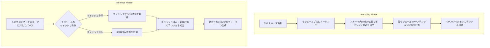

本記事は [Prompt Cache: Modular Attention Reuse for Low-Latency Inference](https://arxiv.org/abs/2311.04934) の解説記事です。

この記事は [Zenn記事: Sonnet 5.5×Prompt Cachingで社内ヘルプデスクAgentのキャッシュヒット率を高める文脈管理](https://zenn.dev/0h_n0/articles/e9d949a174ef8d) の深掘りです。

## 論文概要（Abstract）

LLM推論において、プロンプトの長大化はTime-To-First-Token（TTFT）の増加を招き、対話型アプリケーションのユーザ体験を著しく損なう。著者らは、プロンプト内に繰り返し出現するテキストセグメント（システムプロンプト、Few-shotデモンストレーション、ドキュメントコンテキストなど）のアテンション状態（KVテンソル）をモジュール単位でキャッシュし再利用する推論加速手法「Prompt Cache」を提案している。Prompt Markup Language（PML）と呼ばれるスキーマ言語によりプロンプトの再利用可能な構造を宣言的に記述し、モデルの重みやアーキテクチャを一切改変することなく、GPU環境で最大8倍、CPU環境で最大60倍のTTFT削減を実現したと報告されている。本手法はMLSys 2024で発表された。

## 情報源

- **論文タイトル**: Prompt Cache: Modular Attention Reuse for Low-Latency Inference
- **著者**: In Gim, Guojun Chen, Seung-seob Lee, Nikhil Sarda, Anurag Khandelwal, Lin Zhong
- **arXiv ID**: 2311.04934
- **URL**: [https://arxiv.org/abs/2311.04934](https://arxiv.org/abs/2311.04934)
- **カテゴリ**: cs.CL（Computation and Language）, cs.AI
- **初版投稿**: 2023年11月7日
- **最終改訂**: 2024年4月25日（v2）
- **採択**: MLSys 2024
- **実装**: 約3,000行のPython（HuggingFace Transformers拡張）

## カンファレンス情報: MLSys 2024

MLSys（Conference on Machine Learning and Systems）は、機械学習とシステムの交差領域を対象とする国際会議であり、MLアルゴリズムの効率的な実装やシステムレベルの最適化に関する研究を扱う。Prompt Cacheは推論時のシステムレベル最適化であり、モデル改変不要という実用性の高さからMLSysに採択されている。

## 背景と動機（Background & Motivation）

LLMの推論処理は大きく2つのフェーズに分かれる。プロンプト全体を処理してKVキャッシュを構築するprefillフェーズと、トークンを逐次生成するdecodeフェーズである。プロンプトが長大化するにつれてprefillフェーズの計算コストが支配的になり、TTFTが増大する。

実運用のLLMアプリケーションでは、プロンプト内にリクエスト間で共通するテキストセグメントが大量に存在する。システムプロンプト、Few-shotデモンストレーション、RAGで挿入されるドキュメントチャンク、ツール定義などがその典型である。しかし、従来のKVキャッシュはプロンプト全体を1つの連続したシーケンスとして扱うため、同一テキストでもプロンプト内の位置が変われば位置エンコーディングが異なり、キャッシュを再利用できない。

著者らは、この問題に対して「プロンプトをモジュール単位で分割し、各モジュールにスキーマ内の固定位置を割り当てることで、モジュール単位でのKV状態再利用を可能にする」というアプローチを採用している。重要な知見として、著者らは「LLMは不連続なポジションIDを持つアテンション状態でも精度低下なく動作できる」ことを実験的に確認しており、これがPrompt Cacheの理論的基盤となっている。

## 主要な貢献（Key Contributions）

- **Prompt Markup Language（PML）の設計**: プロンプトの再利用可能な構造を宣言的に記述するスキーマ言語。`<module>`、`<param>`、`<union>`の3つの基本要素により、階層的かつ柔軟なプロンプトテンプレートを定義可能にした
- **位置エンコーディングの不連続耐性の実証**: RoPE（Llama2, Falcon）、ALiBi（MPT）、学習済み埋め込み（BERT, GPT-2）の3種類の位置エンコーディング方式について、不連続なポジションIDでも精度が劣化しないことを実験的に確認
- **モデル非依存のキャッシュ機構**: HuggingFace Transformersの拡張として実装され、モデルアーキテクチャごとに約20行の修正のみで適用可能。モデルの重みやファインチューニングは不要
- **GPU/CPU双方での大幅な高速化**: LongBenchベンチマーク上でGPU環境において最大8倍、CPU環境において最大60倍のTTFT削減を達成

## 技術的詳細（Technical Details）

### Prompt Markup Language（PML）

PMLはプロンプトの再利用可能な構造を記述するためのマークアップ言語である。以下の3つの基本要素で構成される。

**`<module>`要素**: 再利用可能なプロンプトセグメントを定義する。各モジュールは固有のIDを持ち、そのKV状態がキャッシュの単位となる。

**`<param>`要素**: モジュール内の可変部分を定義するプレースホルダー。トークン数の上限を指定でき、スキーマ内の位置計算に使用される。

**`<union>`要素**: 排他的な選択肢を定義する。複数のモジュールのうち1つだけが選択される場合に使用し、最も長いモジュールの長さに合わせて位置空間が確保される。

以下にRAGアプリケーション向けのPMLスキーマ例を示す。

```xml
<schema>
  <module id="system_prompt">
    あなたは企業の社内ヘルプデスクエージェントです。
    以下のルールに従って回答してください：
    1. 正確な情報のみ回答する
    2. 不明な場合は「確認します」と回答する
    3. 個人情報は取り扱わない
  </module>

  <module id="few_shot_examples">
    <module id="example_1">
      Q: VPNの接続方法を教えてください
      A: VPN接続手順は以下の通りです...
    </module>
    <module id="example_2">
      Q: パスワードリセットの方法は？
      A: パスワードリセットは以下から...
    </module>
  </module>

  <module id="retrieved_context">
    <union id="context_selection">
      <module id="context_a">
        <param id="doc_chunk" max_tokens="512" />
      </module>
      <module id="context_b">
        <param id="doc_chunk" max_tokens="512" />
      </module>
    </union>
  </module>

  <module id="user_query">
    <param id="query" max_tokens="256" />
  </module>
</schema>
```

このスキーマでは、`system_prompt`と`few_shot_examples`は全リクエストで共通であるため、一度計算したKV状態を再利用できる。`retrieved_context`はRAGの検索結果に応じて変わるが、`<union>`により位置空間が固定されるため、他のモジュールの位置に影響しない。

### アテンション状態の再利用メカニズム

Prompt Cacheの動作は、エンコーディングフェーズと推論フェーズの2段階に分かれる。



#### エンコーディングフェーズの詳細

各モジュール $m_i$ に対して、スキーマ内での絶対位置 $p_i$ が決定される。モジュールのトークンシーケンス $\mathbf{x}_i = (x_{i,1}, x_{i,2}, \ldots, x_{i,L_i})$ に対し、ポジションIDは $(p_i, p_i+1, \ldots, p_i+L_i-1)$ となる。

アテンションのKey行列とValue行列は以下のように計算される。

$$
\mathbf{K}_i = f_K(\mathbf{x}_i, \mathbf{p}_i), \quad \mathbf{V}_i = f_V(\mathbf{x}_i)
$$

ここで $f_K$ は位置エンコーディングを含むKey射影関数、$f_V$ はValue射影関数である。RoPEの場合、$f_K$ は回転行列 $R_{\theta, p}$ を含む。

$$
f_K^{\text{RoPE}}(\mathbf{x}, p) = R_{\theta, p} \cdot W_K \cdot \mathbf{x}
$$

ここで $R_{\theta, p}$ は位置 $p$ における回転行列であり、$\theta$ は周波数パラメータである。

$$
R_{\theta, p} = \begin{pmatrix}
\cos(p\theta_1) & -\sin(p\theta_1) & 0 & \cdots \\
\sin(p\theta_1) & \cos(p\theta_1) & 0 & \cdots \\
0 & 0 & \cos(p\theta_2) & \cdots \\
\vdots & \vdots & \vdots & \ddots
\end{pmatrix}
$$

#### 推論フェーズの詳細

入力プロンプトがスキーマに対してパースされると、各セグメントがモジュールにマッチングされる。キャッシュヒットしたモジュールのKV状態 $(\mathbf{K}_{\text{cached}}, \mathbf{V}_{\text{cached}})$ と、新規計算が必要なセグメントの状態 $(\mathbf{K}_{\text{new}}, \mathbf{V}_{\text{new}})$ が結合される。

$$
\mathbf{K}_{\text{full}} = \text{concat}(\mathbf{K}_{\text{cached}}, \mathbf{K}_{\text{new}})
$$

$$
\mathbf{V}_{\text{full}} = \text{concat}(\mathbf{V}_{\text{cached}}, \mathbf{V}_{\text{new}})
$$

この結合されたKV状態を用いてアテンション計算が行われる。

$$
\text{Attention}(\mathbf{Q}, \mathbf{K}_{\text{full}}, \mathbf{V}_{\text{full}}) = \text{softmax}\left(\frac{\mathbf{Q} \mathbf{K}_{\text{full}}^T}{\sqrt{d_k}}\right) \mathbf{V}_{\text{full}}
$$

### 位置エンコーディングの不連続耐性

Prompt Cacheの核心的な知見は、LLMが不連続なポジションIDのアテンション状態でも精度を維持できることである。著者らは3種類の位置エンコーディング方式について実験を行っている。

**RoPEベースモデル（Llama2, Falcon）**: 回転行列はポジションIDのみに依存するため、各モジュールの絶対位置が確定していればKV状態を事前計算できる。実装としては回転行列のルックアップテーブルを作成し、スキーマ内の位置に対応する回転行列を適用する。

**ALiBiベースモデル（MPT）**: ALiBi（Attention with Linear Biases）はアテンションスコアに位置依存のバイアス項を加算する方式である。バイアス値は相対位置に依存するため、不連続な位置IDに対応するバイアス行列のルックアップテーブルを構築する。

$$
\text{ALiBi}(q_i, k_j) = q_i \cdot k_j^T - m \cdot |i - j|
$$

ここで $m$ はヘッドごとの固定スロープである。Prompt Cacheでは $|i - j|$ がスキーマ内の絶対位置で計算される。

**埋め込みベースモデル（BERT, GPT-2）**: 学習済みの位置埋め込みテーブルから、スキーマ内の位置に対応する埋め込みベクトルを直接取得する。

著者らは、これら3方式すべてにおいて、LongBenchベンチマーク上で精度劣化が観測されなかったと報告している。

### 計算量分析

従来のprefillフェーズでは、長さ $n$ のプロンプトに対してアテンション計算に $O(n^2)$ の計算量が必要である。Prompt Cacheでは、キャッシュヒットしたセグメントのKV状態をメモリから読み込む操作（memcpy）が $O(n)$ で済むため、キャッシュヒット率が高いほど大きな高速化が得られる。

キャッシュヒット率を $r$ とすると、計算量は概算で以下のように削減される。

$$
O(n^2) \rightarrow O((1-r)^2 \cdot n^2) + O(r \cdot n)
$$

キャッシュヒット率 $r$ が高い場合（例: $r = 0.9$）、計算量は $O(0.01 \cdot n^2) + O(0.9 \cdot n)$ となり、実質的に $O(n)$ に近づく。

## 実装のポイント

### HuggingFace Transformersへの統合

著者らの実装は約3,000行のPythonコードであり、HuggingFace Transformersの拡張として構築されている。モデルアーキテクチャ固有の修正は各モデルタイプごとに約20行程度と報告されている。

以下は、Prompt Cacheの概念を示す擬似コードである（論文の実装方針に基づく簡略化した例）。

```python
from dataclasses import dataclass, field
from typing import Optional
import torch


@dataclass
class PMLModule:
    """PMLスキーマのモジュール定義."""

    module_id: str
    tokens: list[int] = field(default_factory=list)
    position_offset: int = 0
    max_tokens: Optional[int] = None
    children: list["PMLModule"] = field(default_factory=list)


class PromptCacheManager:
    """モジュール単位のKVキャッシュ管理.

    各モジュールのKV状態をスキーマ内の固定位置に基づいて
    事前計算・キャッシュし、推論時に再利用する。
    """

    def __init__(self, model: torch.nn.Module, device: str = "cuda") -> None:
        self.model = model
        self.device = device
        # module_id -> (K_tensor, V_tensor) のキャッシュ
        self._cache: dict[str, tuple[torch.Tensor, torch.Tensor]] = {}

    def encode_module(self, module: PMLModule) -> tuple[torch.Tensor, torch.Tensor]:
        """モジュールのKV状態を計算しキャッシュに格納する.

        Args:
            module: PMLモジュール定義

        Returns:
            (K, V) テンソルのタプル
        """
        if module.module_id in self._cache:
            return self._cache[module.module_id]

        token_ids = torch.tensor(
            [module.tokens], dtype=torch.long, device=self.device
        )
        # スキーマ内の絶対位置に基づくポジションID
        position_ids = torch.arange(
            module.position_offset,
            module.position_offset + len(module.tokens),
            dtype=torch.long,
            device=self.device,
        ).unsqueeze(0)

        with torch.no_grad():
            outputs = self.model(
                input_ids=token_ids,
                position_ids=position_ids,
                use_cache=True,
            )

        kv_state = outputs.past_key_values
        self._cache[module.module_id] = kv_state
        return kv_state

    def assemble_kv(
        self,
        matched_modules: list[str],
        new_tokens: list[int],
        new_position_offset: int,
    ) -> tuple[torch.Tensor, torch.Tensor]:
        """キャッシュ済みKV状態と新規計算分を結合する.

        Args:
            matched_modules: キャッシュヒットしたモジュールIDのリスト
            new_tokens: 新規計算が必要なトークン列
            new_position_offset: 新規トークンの位置オフセット

        Returns:
            結合された (K, V) テンソル
        """
        cached_kvs = [self._cache[mid] for mid in matched_modules]

        if new_tokens:
            new_kv = self._compute_new_kv(new_tokens, new_position_offset)
            cached_kvs.append(new_kv)

        return self._concat_kv_states(cached_kvs)

    def _compute_new_kv(
        self, tokens: list[int], position_offset: int
    ) -> tuple[torch.Tensor, torch.Tensor]:
        """新規トークンのKV状態を計算する."""
        token_ids = torch.tensor([tokens], dtype=torch.long, device=self.device)
        position_ids = torch.arange(
            position_offset,
            position_offset + len(tokens),
            dtype=torch.long,
            device=self.device,
        ).unsqueeze(0)

        with torch.no_grad():
            outputs = self.model(
                input_ids=token_ids,
                position_ids=position_ids,
                use_cache=True,
            )
        return outputs.past_key_values

    def _concat_kv_states(
        self,
        kv_list: list[tuple[torch.Tensor, torch.Tensor]],
    ) -> tuple[torch.Tensor, torch.Tensor]:
        """複数のKV状態をシーケンス次元で結合する."""
        # 各レイヤーごとにK, Vを結合
        num_layers = len(kv_list[0])
        combined = []
        for layer_idx in range(num_layers):
            keys = torch.cat(
                [kv[layer_idx][0] for kv in kv_list], dim=2
            )
            values = torch.cat(
                [kv[layer_idx][1] for kv in kv_list], dim=2
            )
            combined.append((keys, values))
        return tuple(combined)
```

### スキャフォールディング戦略

`<param>`要素のトークン数上限は、メモリ効率とセマンティック一貫性のトレードオフを制御する。上限を大きく設定するとより多様な入力に対応できるが、不連続なポジションIDの間隔が広がる。著者らは、実験において適切なトークン数上限の設定がキャッシュヒット率と精度の双方に影響することを確認している。

### メモリオーバーヘッド

キャッシュのメモリ消費量はモデルサイズに比例する。著者らは16-bit精度での1トークンあたりのメモリ消費を以下のように報告している（論文Table 4より）。

| モデル | パラメータ数 | レイヤー数 | ヘッド数 | 1トークンあたりメモリ |
|--------|------------|-----------|---------|---------------------|
| Falcon 1B | 1.3B | 24 | 71 | 0.18 MB |
| Llama2 7B | 6.7B | 32 | 32 | 0.50 MB |
| Llama2 70B | 70B | 80 | 72 | 2.5 MB |

例えばLlama2 7Bで1,000トークンのシステムプロンプトをキャッシュする場合、約500MBのメモリが必要となる。

## Production Deployment Guide

Prompt Cacheのようなモジュラーなアテンション再利用機構をプロダクション環境に導入する際の設計パターンを示す。

### AWS実装パターン（コスト最適化重視）

| 構成 | ユースケース | サービス構成 | 月額コスト目安 |
|------|------------|------------|--------------|
| Small | 社内チャットbot（~200 req/日） | Lambda + SageMaker Endpoint + ElastiCache(Redis) | $200-500 |
| Medium | RAGアプリ（~2,000 req/日） | ECS Fargate + SageMaker Endpoint + ElastiCache Cluster | $800-2,000 |
| Large | マルチテナントAPI（10,000+ req/日） | EKS + SageMaker Multi-Model Endpoint + MemoryDB | $3,000-8,000 |

**注意**: コスト試算は2026年10月時点のAWS ap-northeast-1（東京）リージョンの料金に基づく概算値である。実際のコストはモデルサイズ、インスタンスタイプ、トラフィックパターンにより大きく変動するため、最新料金はAWS料金計算ツールで確認することを推奨する。

**Small構成の詳細**:
- SageMaker Endpoint（ml.g5.xlarge, Llama2 7B）: ~$150/月
- ElastiCache Redis（cache.r6g.large, KVキャッシュ保持）: ~$120/月
- Lambda（プロンプトパース・キャッシュルックアップ）: ~$5/月
- API Gateway + CloudWatch: ~$10/月

### Terraformインフラコード

**KVキャッシュ管理用ElastiCache設定**:

```hcl
# ElastiCache Redis（KVテンソルキャッシュの永続化層）
resource "aws_elasticache_replication_group" "kv_cache" {
  replication_group_id = "prompt-cache-kv-store"
  description          = "KV attention state cache for Prompt Cache"
  engine               = "redis"
  engine_version       = "7.1"
  node_type            = "cache.r6g.large"  # 13GB RAM
  num_cache_clusters   = 2                   # Primary + Replica
  port                 = 6379

  # Llama2 7B: 0.5MB/token
  # 1000トークン x 100モジュール = 50GB -> Cluster Mode推奨
  parameter_group_name = aws_elasticache_parameter_group.kv_cache.name

  at_rest_encryption_enabled  = true
  transit_encryption_enabled  = true
  auto_minor_version_upgrade  = true

  tags = {
    Service = "prompt-cache"
    Purpose = "kv-attention-state-storage"
  }
}

resource "aws_elasticache_parameter_group" "kv_cache" {
  name   = "prompt-cache-params"
  family = "redis7"

  # maxmemory-policy: KVキャッシュの有効期限制御
  # allkeys-lru: 最も古いキャッシュから自動削除
  parameter {
    name  = "maxmemory-policy"
    value = "allkeys-lru"
  }

  # シリアライズされたテンソルの最大サイズ(512MB)
  parameter {
    name  = "proto-max-bulk-len"
    value = "536870912"
  }
}
```

**SageMaker Endpoint設定**（Prompt Cache統合）:

```hcl
resource "aws_sagemaker_endpoint_configuration" "prompt_cache" {
  name = "prompt-cache-llm-endpoint"

  production_variants {
    variant_name           = "primary"
    model_name             = aws_sagemaker_model.llm.name
    instance_type          = "ml.g5.xlarge"  # A10G 24GB VRAM
    initial_instance_count = 1
    # GPUメモリにKVキャッシュを保持するため
    # モデルロード後の空きVRAMがキャッシュ容量上限
    volume_size_in_gb      = 100
  }
}

resource "aws_sagemaker_endpoint" "prompt_cache" {
  name                 = "prompt-cache-endpoint"
  endpoint_config_name = aws_sagemaker_endpoint_configuration.prompt_cache.name
}
```

### キャッシュ管理サービスの実装

プロンプトのパースとキャッシュルックアップを担うサービスの設計パターンを示す。

```python
"""Prompt Cacheのキャッシュ管理サービス.

PMLスキーマに基づくプロンプトパースと
ElastiCache上のKVテンソル管理を行う。
"""

import hashlib
import json
import logging
from dataclasses import dataclass

import redis
import torch

logger = logging.getLogger(__name__)


@dataclass
class CacheEntry:
    """キャッシュエントリのメタデータ."""

    module_id: str
    token_hash: str
    position_offset: int
    num_tokens: int
    tensor_size_bytes: int


class PromptCacheService:
    """プロダクション向けPrompt Cacheサービス.

    ElastiCacheをバックエンドとしたKVテンソルの
    キャッシュ管理を行う。
    """

    def __init__(
        self,
        redis_url: str,
        ttl_seconds: int = 3600,
        max_cache_size_gb: float = 10.0,
    ) -> None:
        self._redis = redis.Redis.from_url(
            redis_url, decode_responses=False
        )
        self._ttl = ttl_seconds
        self._max_cache_bytes = int(max_cache_size_gb * 1024**3)
        self._metadata_prefix = "meta:"
        self._tensor_prefix = "tensor:"

    def lookup(self, module_id: str, tokens: list[int]) -> torch.Tensor | None:
        """モジュールIDとトークン列からキャッシュを検索する.

        Args:
            module_id: PMLモジュールの識別子
            tokens: トークンIDの配列

        Returns:
            キャッシュヒット時はKVテンソル、ミス時はNone
        """
        token_hash = self._hash_tokens(tokens)
        cache_key = f"{self._tensor_prefix}{module_id}:{token_hash}"

        raw = self._redis.get(cache_key)
        if raw is None:
            logger.info(
                "cache_miss",
                extra={"module_id": module_id, "token_count": len(tokens)},
            )
            return None

        # TTLをリフレッシュ（アクセス頻度に応じた自動延長）
        self._redis.expire(cache_key, self._ttl)
        logger.info(
            "cache_hit",
            extra={"module_id": module_id, "token_count": len(tokens)},
        )
        return self._deserialize_tensor(raw)

    def store(
        self,
        module_id: str,
        tokens: list[int],
        kv_tensor: torch.Tensor,
        position_offset: int,
    ) -> None:
        """KVテンソルをキャッシュに格納する.

        Args:
            module_id: PMLモジュールの識別子
            tokens: トークンIDの配列
            kv_tensor: 格納するKVテンソル
            position_offset: スキーマ内の位置オフセット
        """
        token_hash = self._hash_tokens(tokens)
        serialized = self._serialize_tensor(kv_tensor)

        cache_key = f"{self._tensor_prefix}{module_id}:{token_hash}"
        meta_key = f"{self._metadata_prefix}{module_id}:{token_hash}"

        entry = CacheEntry(
            module_id=module_id,
            token_hash=token_hash,
            position_offset=position_offset,
            num_tokens=len(tokens),
            tensor_size_bytes=len(serialized),
        )

        pipe = self._redis.pipeline()
        pipe.setex(cache_key, self._ttl, serialized)
        pipe.setex(
            meta_key, self._ttl, json.dumps(entry.__dict__).encode()
        )
        pipe.execute()

        logger.info(
            "cache_store",
            extra={
                "module_id": module_id,
                "tensor_size_mb": len(serialized) / (1024**2),
            },
        )

    @staticmethod
    def _hash_tokens(tokens: list[int]) -> str:
        """トークン列のハッシュを計算する."""
        return hashlib.sha256(
            json.dumps(tokens).encode()
        ).hexdigest()[:16]

    @staticmethod
    def _serialize_tensor(tensor: torch.Tensor) -> bytes:
        """テンソルをバイト列にシリアライズする."""
        import io

        buffer = io.BytesIO()
        torch.save(tensor.cpu().half(), buffer)
        return buffer.getvalue()

    @staticmethod
    def _deserialize_tensor(raw: bytes) -> torch.Tensor:
        """バイト列からテンソルをデシリアライズする."""
        import io

        buffer = io.BytesIO(raw)
        return torch.load(buffer, weights_only=True)
```

### 運用・監視設定

**CloudWatch Logs Insights クエリ**（キャッシュヒット率モニタリング）:

```
fields @timestamp, module_id, event
| stats count(*) as total,
        sum(case when event = 'cache_hit' then 1 else 0 end) as hits,
        sum(case when event = 'cache_miss' then 1 else 0 end) as misses
  by bin(1h) as hour
| fields hour, total, hits, misses,
         (hits * 100.0 / total) as hit_rate_pct
| sort hour desc
```

**監視の主要設定項目**:

- **ElastiCache メトリクス**: `CurrItems`（キャッシュエントリ数）、`BytesUsedForCache`（メモリ使用量）、`CacheHitRate`の推移を監視する。`BytesUsedForCache`が設定上限の80%を超過した場合にSNS通知を発火する
- **SageMaker Endpoint メトリクス**: `ModelLatency`（P50/P95/P99）でTTFTの改善度を定量化する。`GPUMemoryUtilization`でVRAM上のKVキャッシュ圧迫を検出する
- **X-Ray トレーシング**: キャッシュルックアップ → テンソル転送 → 推論の各フェーズの所要時間を個別セグメントとして記録し、ボトルネックを特定する

### コスト最適化チェックリスト

**キャッシュ設計**:
- [ ] 高頻度アクセスモジュール（システムプロンプト等）のキャッシュTTLを長めに設定
- [ ] 低頻度モジュールはallkeys-lruで自動退避
- [ ] テンソルの精度をfp16に統一（メモリ半減）
- [ ] RedisのCluster Modeでキャッシュ容量をスケールアウト

**推論コスト削減**:
- [ ] SageMaker Savings Plans（1年コミットで最大64%削減）
- [ ] SageMaker Serverless Inference（低トラフィック時のゼロスケール）
- [ ] Spot Instance（耐障害性確保の上で最大90%削減）
- [ ] Multi-Model Endpoint（複数モデルの同一インスタンス共有）

**モニタリング**:
- [ ] AWS Budgets: 月額予算の80%/100%でアラート
- [ ] CloudWatch: キャッシュヒット率50%未満でアラート（スキーマ再設計の検討トリガー）
- [ ] Cost Anomaly Detection: テンソルキャッシュのメモリコスト急増検知

## 実験結果（Experimental Results）

### GPU性能（LongBench）

著者らはLongBenchベンチマーク上で、Llama2（7B/13B/70B）、Falcon（1B/7B/40B）、MPT（7B/30B）の3アーキテクチャ8モデルを用いて評価を行っている。

**GPUメモリにKVキャッシュを格納した場合**:

| モデル | タスク | TTFT削減倍率 | 精度変化 |
|--------|-------|-------------|---------|
| Llama2 7B | QA | 5.3x | 劣化なし |
| Llama2 7B | 要約 | 3.2x | 劣化なし |
| Llama2 7B | コード補完 | 8.0x | 劣化なし |
| Falcon 7B | QA | 4.1x | 劣化なし |
| MPT 7B | QA | 3.8x | 劣化なし |

著者らによれば、GPUメモリ格納時のTTFT削減倍率は1.5倍から最大10倍の範囲であり、タスクのキャッシュヒット率に大きく依存すると報告されている。

**CPUメモリにKVキャッシュを格納した場合**: CPU-GPU間のデータ転送オーバーヘッドにより削減倍率は1.5-3倍に低下するが、GPUメモリの制約を受けないためより大きなキャッシュを保持できるという利点がある。

### CPU性能

GPUを使用せずCPU上でLlama2 7Bの推論を行った実験では、以下の結果が報告されている。

| CPU | DDR世代 | 最大TTFT削減倍率 |
|-----|---------|-----------------|
| Intel i9-13900K | DDR5 | 60-70x |
| AMD Ryzen 9 7950X | DDR4 | 20x |

CPU環境ではprefillフェーズの計算コストがGPU環境よりも遥かに大きいため、キャッシュヒットによる計算スキップの恩恵が著しく大きくなる。Intel i9-13900KとAMD Ryzen 9 7950Xの差はメモリ帯域幅（DDR5 vs DDR4）に起因すると著者らは分析している。

### 精度評価

著者らはLongBenchの各タスク（QA、要約、コード補完、Few-shot学習、合成タスク）において、Prompt Cacheの有無による精度の比較を行い、すべてのタスクで統計的に有意な精度劣化は観測されなかったと報告している。これは、不連続なポジションIDがモデルの出力品質に影響しないという著者らの仮説を支持する結果である。

### 計算量の実測

アテンション計算は $O(n^2)$ であるのに対し、キャッシュからのmemcpy操作は $O(n)$ であるため、プロンプト長が長いほどPrompt Cacheの恩恵が大きくなる。著者らの実験では、プロンプト長が4,000トークンを超える場合にTTFT削減効果が顕著になると報告されている。

## 実運用への応用

### 適用が効果的なユースケース

Prompt Cacheは以下のようなユースケースで特に高い効果が期待される。

**RAG（Retrieval-Augmented Generation）**: 検索されたドキュメントチャンクが同一ユーザの複数ターンで再利用される場合、そのKV状態をキャッシュすることでTTFTを大幅に削減できる。PMLの`<union>`要素を用いれば、検索結果の差し替えが他のモジュールの位置に影響しない設計が可能である。

**マルチターン対話**: システムプロンプトやFew-shotデモンストレーションは全ターンで共通であるため、初回のみKV状態を計算し、以降はキャッシュから読み込むことでTTFTを一定に保てる。

**バッチ推論**: 同一テンプレートを用いた大量リクエストの処理において、テンプレート部分のKV状態を事前計算しておくことで、各リクエストのprefillコストを変数部分のみに限定できる。

**エッジデバイスでのLLM推論**: CPU環境での60倍高速化はエッジデバイスでの推論に特に有用である。限られた計算リソースでもキャッシュによりTTFTを実用的な水準に抑えられる可能性がある。

### 商用LLMサービスとの関係

Prompt Cacheの発表後、主要なLLMプロバイダがプロンプトキャッシングの商用サービスを展開している。Anthropic Claude APIのPrompt Caching、OpenAI APIのAutomatic Prompt Cachingなどがその例である。これらの商用サービスはPrompt Cacheの学術的知見を踏まえつつ、プロバイダ側でキャッシュ管理を自動化したものと位置づけられる。ただし、商用サービスはプレフィックスベースのキャッシュが主流であり、Prompt CacheのPMLのような柔軟なモジュラー構造をユーザが直接制御できる点は学術提案の独自性である。

### 制約事項

- **スキーマ設計の必要性**: PMLスキーマの設計はユーザの責任であり、プロンプトの構造を事前に分析する必要がある
- **メモリ消費**: Llama2 70Bでは1トークンあたり2.5MBのメモリが必要であり、大規模モデルではキャッシュのメモリ管理が課題となる
- **動的コンテンツ**: 頻繁に変更されるプロンプトセグメントにはキャッシュの恩恵が限定的である

## 関連研究

### KVキャッシュ最適化

KVキャッシュのメモリ効率化に関する研究として、PagedAttention（vLLM）はKVキャッシュをページ単位で管理しメモリの断片化を防ぐ手法である。FlashAttention はアテンション計算のIO効率を改善するGPUカーネル最適化である。これらはPrompt Cacheと直交する技術であり、組み合わせて適用可能である。

### プロンプト圧縮

LLMLingua やAutoCompressor はプロンプトの長さ自体を削減するアプローチである。Prompt Cacheはプロンプトの内容を変えずに計算を省略する点で、これらの圧縮手法とは異なるアプローチを採る。精度への影響が原理的にないという点がPrompt Cacheの利点である。

### 継続バッチング

Orca やSarathiなどのサービングシステムは、デコードフェーズの効率化に焦点を当てている。Prompt Cacheはprefillフェーズの最適化であり、これらのシステムとも組み合わせ可能である。

## まとめ

Prompt Cacheは、プロンプト内の再利用可能なセグメントのアテンション状態をモジュール単位でキャッシュ・再利用することにより、モデル改変なしでTTFTの大幅な削減を実現する手法である。PMLによる宣言的なスキーマ定義、不連続ポジションIDの耐性実証、RoPE/ALiBi/埋め込みベースの3方式への対応が主要な貢献である。GPU環境で最大8倍、CPU環境で最大60倍のTTFT削減が報告されており、精度劣化は観測されていない。

現在の商用LLMサービスで提供されるプロンプトキャッシング機能の学術的基盤の一つとして位置づけられ、自前のLLMサービングスタックを構築する際のアーキテクチャ設計に有用な知見を提供している。

## 参考文献

- Gim, I., Chen, G., Lee, S., Sarda, N., Khandelwal, A., & Zhong, L. (2024). Prompt Cache: Modular Attention Reuse for Low-Latency Inference. *MLSys 2024*. [https://arxiv.org/abs/2311.04934](https://arxiv.org/abs/2311.04934)
- Kwon, W., et al. (2023). Efficient Memory Management for Large Language Model Serving with PagedAttention. *SOSP 2023*.
- Dao, T. (2024). FlashAttention-2: Faster Attention with Better Parallelism and Work Partitioning. *ICLR 2024*.
- Jiang, H., et al. (2023). LLMLingua: Compressing Prompts for Accelerated Inference of Large Language Models. *EMNLP 2023*.
- Yu, G., et al. (2022). Orca: A Distributed Serving System for Transformer-Based Generative Models. *OSDI 2022*.
- Agrawal, A., et al. (2024). Sarathi: Efficient LLM Inference by Piggybacking Decodes with Chunked Prefills. *arXiv:2308.16369*.
- Su, J., et al. (2024). RoFormer: Enhanced Transformer with Rotary Position Embedding. *Neurocomputing*.
- Press, O., Smith, N. A., & Lewis, M. (2022). Train Short, Test Long: Attention with Linear Biases Enables Input Length Extrapolation. *ICLR 2022*.
