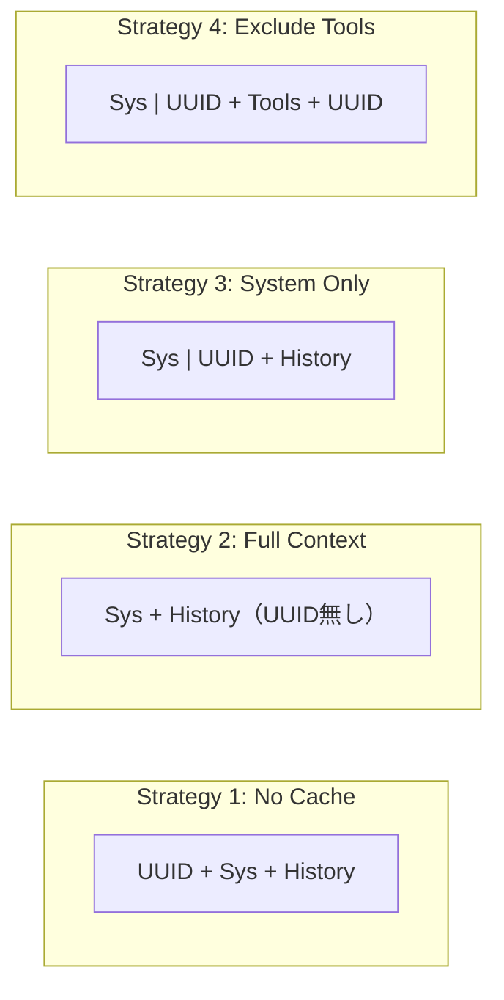

本記事は <https://arxiv.org/abs/2601.06007> の解説記事です。

## 論文概要（Abstract）

Lumerらは、OpenAI・Anthropic・GoogleのプロンプトキャッシュAPIを、マルチターンエージェントタスクにおいて体系的に評価した初の研究を報告している。著者らが開発したDeepResearch Bench（22学術分野、100件のPhDレベル研究タスク）を用いて、GPT-5.2、GPT-4o、Claude Sonnet 4.5、Gemini 2.5 Proの4モデルに対し500以上のセッションで4種のキャッシュ戦略を検証した。APIコスト41-80%削減、TTFT 13-31%改善が報告されている。

この記事は [Zenn記事: Sonnet 5.5×Prompt Cachingで社内ヘルプデスクAgentのキャッシュヒット率を高める文脈管理](https://zenn.dev/0h_n0/articles/e9d949a174ef8d) の深掘りです。

## 情報源

- **arXiv ID**: 2601.06007
- **URL**: <https://arxiv.org/abs/2601.06007>
- **著者**: Elias Lumer, Faheem Nizar, Akshaya Jangiti et al.
- **発表年**: 2026年1月（v2: 2026年1月31日）
- **分野**: cs.CL（Computational Linguistics）

## 背景と動機（Background & Motivation）

LLMベースのエージェントは各ターンでシステムプロンプト・会話履歴・ツール結果を再送信するため、APIコストとレイテンシが累積的に増大する。プロンプトキャッシュはリクエスト間で共通するプレフィックス部分のKVキャッシュを再利用し、入力トークンの処理コストを削減する技術である。

著者らは3つの課題を指摘している。第一に、既存の評価はシングルターン補完に限定されマルチターンエージェントでの検証が欠如していた。第二に、プロバイダー間のキャッシュ粒度の違いが実務に与える影響が未知であった。第三に、動的ツール結果がキャッシュ効率に与える影響が不明であった。

## 主要な貢献（Key Contributions）

- **貢献1**: 3大プロバイダーのプロンプトキャッシュをマルチターンエージェントタスクで横断比較した初の体系的評価
- **貢献2**: 22学術分野・100件のPhDレベル研究タスクで構成されるDeepResearch Benchの構築
- **貢献3**: UUID挿入技法による4つのキャッシュ戦略の厳密な定量比較
- **貢献4**: プロバイダー別の推奨戦略・動的コンテンツ分離原則・MCPとの相互作用に関する実用ガイドラインの提示

## 技術的詳細（Technical Details）

### UUID挿入技法によるキャッシュ境界制御

著者らはプロバイダーの自動キャッシュ機構を制御するためにUUID挿入技法を考案している。特定位置にランダムUUIDを挿入することでプレフィックスマッチを意図的に破壊し、キャッシュの有効範囲を制御する。ターン $t$ のプロンプト $P_t$ は以下で表される。

$$
P_t = [S_{\text{sys}}, M_1, R_1, M_2, R_2, \ldots, M_t]
$$

ここで $S_{\text{sys}}$ はシステムプロンプト（10,000トークン固定）、$M_i$ はターン $i$ のメッセージ、$R_i$ はツール実行結果である。

### 4つのキャッシュ戦略



**戦略1: No Cache** — 先頭にUUID挿入。$P_t^{\text{no}} = [\texttt{UUID}, S_{\text{sys}}, M_1, R_1, \ldots]$

**戦略2: Full Context** — UUID無し。$P_t^{\text{full}} = [S_{\text{sys}}, M_1, R_1, \ldots]$

**戦略3: System Prompt Only** — $S_{\text{sys}}$ 直後にUUID。$P_t^{\text{sys}} = [S_{\text{sys}}, \texttt{UUID}, M_1, R_1, \ldots]$

**戦略4: Exclude Tool Results** — $S_{\text{sys}}$ 後と各 $R_i$ 後にUUID挿入。

### キャッシュコスト計算モデル

$$
C_{\text{cached}} = T_{\text{hit}} \cdot p_{\text{cached}} + T_{\text{miss}} \cdot p_{\text{standard}} + T_{\text{write}} \cdot p_{\text{write}}
$$

- $T_{\text{hit}}$: キャッシュヒットトークン数、$T_{\text{miss}}$: ミストークン数、$T_{\text{write}}$: 書き込みトークン数（Anthropicのみ）
- $p_{\text{cached}}, p_{\text{standard}}, p_{\text{write}}$: 各単価（$/1Mトークン）

コスト削減率: $\Delta C = 1 - C_{\text{cached}} / C_{\text{no\_cache}}$

### プロバイダー別価格構造（論文Table 1より）

| Provider | Model | Standard | Cached | Write |
|----------|-------|----------|--------|-------|
| OpenAI | GPT-5.2 | $1.75/1M | $0.175/1M | --- |
| OpenAI | GPT-4o | $2.50/1M | $1.25/1M | --- |
| Anthropic | Claude Sonnet 4.5 | $3.00/1M | $0.30/1M | $3.75/1M |
| Google | Gemini 2.5 Pro | $1.25/1M | $0.125/1M | --- |

Anthropicのみキャッシュ書き込み料金（標準の1.25倍）を課す点が戦略選択に影響する。

## 実装のポイント（Implementation）

**キャッシュ境界の設計原則**: 安定コンテンツ（システムプロンプト、静的ツール定義）と動的コンテンツ（ツール結果、ユーザ入力）を分離する。

**最小トークン閾値**: 論文Section 5.2のアブレーションで500トークンのシステムプロンプトは全プロバイダーの閾値を下回りキャッシュ効果がなかった。実務では1,024トークン以上を確保する。

**MCP連携時の注意**: 動的ツール発見プロトコルはツール定義変更によりキャッシュを無効化するリスクがある。ツール定義は静的に固定し動的部分はツール結果として扱うことが推奨される。

```python
from dataclasses import dataclass, field
from typing import Any


@dataclass(frozen=True)
class CacheAwarePrompt:
    """キャッシュ境界を意識したプロンプト構築クラス

    Attributes:
        system_prompt: システムプロンプト（キャッシュ対象）
        static_tools: 静的ツール定義（キャッシュ対象）
        conversation_history: 会話履歴
        dynamic_tool_results: 動的ツール結果（キャッシュ除外推奨）
    """
    system_prompt: str
    static_tools: list[dict[str, Any]] = field(default_factory=list)
    conversation_history: list[dict[str, str]] = field(default_factory=list)
    dynamic_tool_results: list[dict[str, Any]] = field(default_factory=list)

    def build_messages(self, strategy: str = "system_only") -> list[dict[str, Any]]:
        """キャッシュ戦略に応じたメッセージリストを構築する

        Args:
            strategy: "system_only" | "full_context" | "exclude_tools"

        Returns:
            APIに送信するメッセージリスト
        """
        messages: list[dict[str, Any]] = []
        system_msg: dict[str, Any] = {
            "role": "system",
            "content": self.system_prompt,
        }
        if strategy in ("system_only", "exclude_tools"):
            system_msg["cache_control"] = {"type": "ephemeral"}
        messages.append(system_msg)
        messages.extend(self.conversation_history)
        return messages
```

## Production Deployment Guide

### AWS実装パターン（コスト最適化重視）

**コスト試算の注意事項**: 2026年10月時点のAWS ap-northeast-1料金に基づく概算値。最新料金はAWS料金計算ツールで確認を推奨。

| 構成 | トラフィック | 主要サービス | 月額目安 |
|------|-------------|-------------|---------|
| Small | ~100 req/日 | Lambda + Bedrock | $50-150 |
| Medium | ~1,000 req/日 | ECS Fargate + Bedrock | $300-800 |
| Large | 10,000+ req/日 | EKS + Karpenter + Spot | $2,000-5,000 |

**Small**: Lambda($5)+DynamoDB($10)+Bedrock($30-130)。**Medium**: Fargate($30)+ElastiCache($15)+Bedrock($250-750)。**Large**: EKS($73)+Spot x3($180)+ALB($25)+API($1,700-4,700)。

**削減テクニック**: Spot(最大90%)、Reserved 1年(72%)、Batch API(50%)、Prompt Caching(41-80%)。

### Terraformインフラコード

#### Small構成: Lambda + Bedrock + DynamoDB

```hcl
# コスト目安: $50-150/月（~100 req/日）
resource "aws_iam_role" "lambda_role" {
  name               = "prompt-cache-agent-lambda"
  assume_role_policy = jsonencode({
    Version = "2012-10-17"
    Statement = [{ Action = "sts:AssumeRole", Effect = "Allow",
      Principal = { Service = "lambda.amazonaws.com" } }]
  })
}

resource "aws_iam_role_policy" "lambda_policy" {
  name = "prompt-cache-agent-policy"
  role = aws_iam_role.lambda_role.id
  policy = jsonencode({
    Version = "2012-10-17"
    Statement = [
      { Effect = "Allow",
        Action = ["bedrock:InvokeModel", "bedrock:InvokeModelWithResponseStream"],
        Resource = "arn:aws:bedrock:ap-northeast-1::foundation-model/anthropic.claude-sonnet-4-5-*" },
      { Effect = "Allow",
        Action = ["dynamodb:GetItem", "dynamodb:PutItem", "dynamodb:UpdateItem", "dynamodb:Query"],
        Resource = aws_dynamodb_table.sessions.arn },
      { Effect = "Allow",
        Action = ["logs:CreateLogGroup", "logs:CreateLogStream", "logs:PutLogEvents"],
        Resource = "arn:aws:logs:ap-northeast-1:*:*" }
    ]
  })
}

resource "aws_dynamodb_table" "sessions" {
  name         = "prompt-cache-sessions"
  billing_mode = "PAY_PER_REQUEST"
  hash_key     = "session_id"
  range_key    = "turn_number"
  attribute { name = "session_id"; type = "S" }
  attribute { name = "turn_number"; type = "N" }
  ttl { attribute_name = "expires_at"; enabled = true }
  server_side_encryption { enabled = true }
}

resource "aws_lambda_function" "agent" {
  function_name    = "prompt-cache-agent"
  role             = aws_iam_role.lambda_role.arn
  handler          = "handler.lambda_handler"
  runtime          = "python3.12"
  timeout          = 120
  memory_size      = 512
  filename         = "lambda.zip"
  source_code_hash = filebase64sha256("lambda.zip")
  environment {
    variables = {
      DYNAMODB_TABLE    = aws_dynamodb_table.sessions.name
      CACHE_STRATEGY    = "system_only"
      SYSTEM_PROMPT_MIN = "1024"
    }
  }
  tracing_config { mode = "Active" }
}
```

#### Large構成: EKS + Karpenter + Spot

```hcl
# コスト目安: $2,000-5,000/月（10,000+ req/日）
module "eks" {
  source          = "terraform-aws-modules/eks/aws"
  version         = "~> 20.24"
  cluster_name    = "prompt-cache-cluster"
  cluster_version = "1.31"
  vpc_id          = module.vpc.vpc_id
  subnet_ids      = module.vpc.private_subnets
  cluster_endpoint_private_access = true
}

resource "kubectl_manifest" "karpenter_nodepool" {
  yaml_body = yamlencode({
    apiVersion = "karpenter.sh/v1"
    kind       = "NodePool"
    metadata   = { name = "prompt-cache-pool" }
    spec = {
      template = { spec = {
        requirements = [
          { key = "karpenter.sh/capacity-type", operator = "In",
            values = ["spot", "on-demand"] },
          { key = "node.kubernetes.io/instance-type", operator = "In",
            values = ["m6i.xlarge", "m6a.xlarge", "m7i.xlarge"] }
        ]
      } }
      limits     = { cpu = "48", memory = "192Gi" }
      disruption = { consolidationPolicy = "WhenEmptyOrUnderutilized",
                     consolidateAfter = "30s" }
    }
  })
}

resource "aws_budgets_budget" "monthly" {
  name         = "prompt-cache-monthly"
  budget_type  = "COST"
  limit_amount = "5000"
  limit_unit   = "USD"
  time_unit    = "MONTHLY"
  notification {
    comparison_operator        = "GREATER_THAN"
    threshold                  = 80
    threshold_type             = "PERCENTAGE"
    notification_type          = "ACTUAL"
    subscriber_email_addresses = ["ops-team@example.com"]
  }
}
```

### 運用・監視設定

**CloudWatch Logs Insights（キャッシュヒット率）**:

```
fields @timestamp | filter @message like /token_usage/
| stats sum(cached_tokens) as cached, sum(standard_tokens) as standard,
  sum(cached_tokens)/(sum(cached_tokens)+sum(standard_tokens))*100 as hit_rate
  by bin(1h) | sort @timestamp desc
```

**X-Rayトレーシング・Cost Explorerレポート（Python）**:

```python
from datetime import date, timedelta
from typing import Any

import boto3
from aws_xray_sdk.core import xray_recorder, patch_all


def configure_tracing(service: str = "prompt-cache-agent") -> None:
    """X-Rayトレーシングを設定しboto3を自動計装する"""
    xray_recorder.configure(service=service)
    patch_all()


def get_daily_cost(sns_arn: str, threshold: float = 100.0) -> dict[str, float]:
    """日次コストを取得し閾値超過時にSNS通知する

    Args:
        sns_arn: 通知先SNSトピックARN
        threshold: アラート閾値（USD/日）

    Returns:
        サービス別コスト辞書
    """
    ce = boto3.client("ce", region_name="us-east-1")
    today = date.today()
    resp = ce.get_cost_and_usage(
        TimePeriod={"Start": (today - timedelta(1)).isoformat(), "End": today.isoformat()},
        Granularity="DAILY", Metrics=["UnblendedCost"],
        GroupBy=[{"Type": "DIMENSION", "Key": "SERVICE"}],
    )
    costs: dict[str, float] = {}
    total = 0.0
    for g in resp["ResultsByTime"][0]["Groups"]:
        amt = float(g["Metrics"]["UnblendedCost"]["Amount"])
        costs[g["Keys"][0]] = amt
        total += amt
    if total > threshold:
        boto3.client("sns", region_name="ap-northeast-1").publish(
            TopicArn=sns_arn,
            Subject=f"Cost Alert: ${total:.2f}/day",
            Message="\n".join(f"  {s}: ${c:.2f}" for s, c in costs.items()),
        )
    return costs
```

### コスト最適化チェックリスト

**アーキテクチャ選択**:
- [ ] ~100 req/日 → Serverless（Lambda + Bedrock）
- [ ] ~1,000 req/日 → Hybrid（ECS Fargate + ElastiCache）
- [ ] 10,000+ req/日 → Container（EKS + Karpenter）

**リソース最適化**:
- [ ] EC2: Spot Instances優先（Karpenter capacity-type設定）
- [ ] Reserved Instances: 1年コミットで最大72%削減
- [ ] Savings Plans: Compute Savings Plans適用検討
- [ ] Lambda: メモリ512MB-1024MBで最適化（Power Tuning）
- [ ] ECS/EKS: アイドル時スケールダウン（最小レプリカ0-1）
- [ ] NAT Gateway: VPCエンドポイントで代替

**LLMコスト削減**:
- [ ] Bedrock Batch API: 非リアルタイム処理を50%削減
- [ ] Prompt Caching: System Prompt Only戦略（本論文推奨）
- [ ] モデル選択: タスク複雑度でHaiku/Sonnet切替
- [ ] max_tokens: 必要最小限に設定
- [ ] システムプロンプト: 1,024トークン以上を維持

**監視・アラート**:
- [ ] AWS Budgets: 月額予算80%/100%閾値
- [ ] CloudWatch: トークン使用量スパイク検知
- [ ] Cost Anomaly Detection: 自動異常検知有効化
- [ ] 日次コストレポート: Cost Explorer API自動取得
- [ ] キャッシュヒット率: 目標80%以上

**リソース管理**:
- [ ] 未使用リソース: 月次Cleanup実施
- [ ] タグ戦略: Project/Environment/CostCenterの3タグ必須
- [ ] DynamoDB TTL・S3ライフサイクル設定
- [ ] 開発環境: 夜間・休日自動停止（EventBridge Scheduler）
- [ ] CloudTrail: 監査ログ有効化

## 実験結果（Results）

### プロバイダー別コスト削減効果

著者らは各条件40セッションの実験結果を報告している（論文Table 2より）。

| Model | Strategy | Cost Reduction | TTFT Improvement |
|-------|----------|---------------|-----------------|
| GPT-5.2 | Full Context | 78.1% | 30.8% |
| GPT-5.2 | System Prompt | 76.3% | 28.5% |
| GPT-5.2 | Exclude Tools | **79.6%** | 27.2% |
| GPT-4o | Full Context | 39.8% | **-8.8%** |
| GPT-4o | System Prompt | 37.2% | 12.6% |
| Claude Sonnet 4.5 | Full Context | 72.1% | 19.4% |
| Claude Sonnet 4.5 | System Prompt | **78.5%** | **22.9%** |
| Claude Sonnet 4.5 | Exclude Tools | 65.3% | 18.1% |
| Gemini 2.5 Pro | Full Context | 38.7% | 15.2% |
| Gemini 2.5 Pro | System Prompt | **41.4%** | **16.8%** |

GPT-4oのFull Context CachingでTTFTが8.8%悪化した点が注目される。著者らは、キャッシュの書き込み・検索オーバーヘッドが頻繁に変化するコンテキストでは読み取り効果を上回る可能性があると分析している。Claude Sonnet 4.5ではSystem Prompt OnlyがFull Contextを上回っており（78.5% vs 72.1%）、書き込み料金（$3.75/1M）が動的コンテンツのキャッシュ効果を相殺するためと説明されている。

### アブレーション結果

**システムプロンプトサイズ**（論文Section 5.2より）: 500-50,000トークンの範囲でコスト削減は概ね線形にスケールする。50,000トークン時にGPT-5.2で89%、Claude Sonnet 4.5で88%の削減が報告されている。500トークンでは全プロバイダーで有意なキャッシュ効果がなかった。

**ツール呼び出し数**（論文Section 5.3より）: 3-50回の範囲でキャッシュ効果は安定しており、キャッシュ可能プレフィックス長が支配的であるためと説明されている。

## 実運用への応用（Practical Applications）

本論文の知見は、Zenn記事「Sonnet 5.5×Prompt Cachingで社内ヘルプデスクAgentのキャッシュヒット率を高める文脈管理」のエージェント実装に直接応用できる。

**文脈管理戦略の選択**: 社内ヘルプデスクエージェントのように固定的なシステムプロンプト（ナレッジベース、対応マニュアル）を持つユースケースでは、戦略3（System Prompt Only）が最適である。Anthropicモデルで78.5%のコスト削減が見込める。

**動的コンテンツの分離設計**: ツール実行結果はキャッシュプレフィックスを破壊する要因となる。安定コンテンツを先頭、動的コンテンツを末尾に集約するプロンプト構造が推奨される。

**マルチプロバイダー運用**: コスト最優先ならGPT-5.2 Exclude Tool Results（79.6%）、レイテンシ重視ならGPT-5.2 Full Context（30.8% TTFT改善）、バランス重視ならClaude Sonnet 4.5 System Prompt Only（78.5%削減+22.9% TTFT改善）が適する。

## 関連研究（Related Work）

- **KV Cache Compression（Ge et al., 2024）**: モデル内部のKVキャッシュ圧縮を扱う研究群。本論文はAPIレベルのプロンプトキャッシュに焦点を当てており、異なるレイヤーで相補的な関係にある。
- **SWE-bench（Jimenez et al., 2024）**: ソフトウェアエンジニアリングタスクのエージェント評価ベンチマーク。DeepResearch Benchは学術研究タスクに特化し、より長いツール呼び出しチェーンを要求する点で差別化される。
- **ReAct（Yao et al., 2023）**: Reasoning and Acting交互実行フレームワーク。本論文はReActパターンにおけるキャッシュの適用方法と効果を定量化した実装面での貢献がある。

## まとめと今後の展望

本論文は、プロンプトキャッシュをマルチターンエージェントタスクで初めて体系的に評価し、41-80%のコスト削減と13-31%のTTFT改善を実証した。安定コンテンツと動的コンテンツの分離がキャッシュ効率の鍵であるという知見は、エージェントシステムのプロンプト設計に直接活用できる。

著者らはマルチモーダル入力でのキャッシュ評価、有効期間の動的最適化、クロスセッションでのキャッシュ共有を今後の方向に挙げている。キャッシュ効果がプロンプト長に線形依存する結果は、知識のシステムプロンプト事前埋め込みを正当化する根拠となり得る。

## 参考文献

- **arXiv**: <https://arxiv.org/abs/2601.06007>
- **Related Zenn article**: <https://zenn.dev/0h_n0/articles/e9d949a174ef8d>
- **OpenAI Prompt Caching**: <https://platform.openai.com/docs/guides/prompt-caching>
- **Anthropic Prompt Caching**: <https://docs.anthropic.com/en/docs/build-with-claude/prompt-caching>
