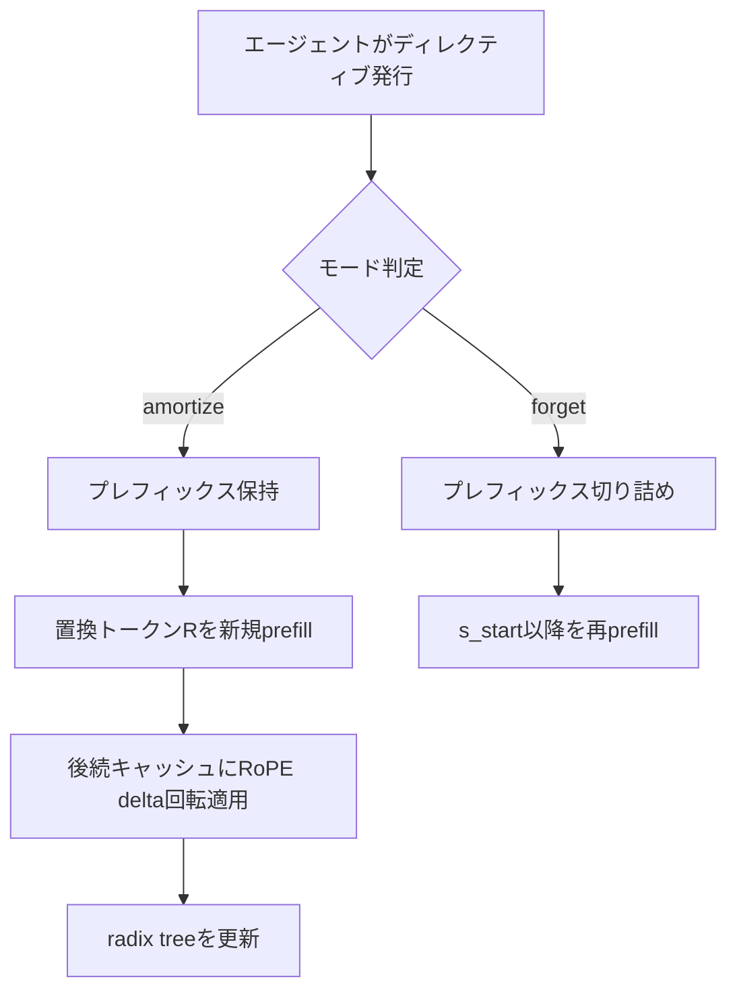
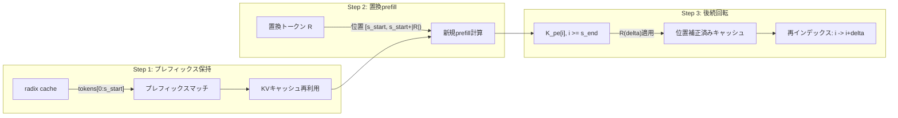

本記事は [https://arxiv.org/abs/2606.01065](https://arxiv.org/abs/2606.01065) の解説記事です。関連するZenn記事「[Sonnet 5.5×Prompt Cachingで社内ヘルプデスクAgentのキャッシュヒット率を高める文脈管理](https://zenn.dev/0h_n0/articles/e9d949a174ef8d)」もあわせてご参照ください。

## 論文概要

従来のLLMサービングはチャットボットの対話履歴のようにappend-onlyでプロンプトが成長する前提で設計されている。しかしエージェントシステムでは、失敗したツールコールのリトライ、古い出力の削除、軌道のピボットといったポリシー駆動のプロンプト編集が頻繁に発生する。この編集によりKVキャッシュのプレフィックスが無効化され、再計算コストが増大する問題がある。

Leylineは、この問題を**宣言的ディレクティブ4-tuple**と**RoPEの閉形式位置補正**で解決するサービングサイド手法である。著者らは、キャッシュヒット率+11.2pp、エージェントタスク解決率+14.3ppの改善を報告している。

## 情報源

| 項目 | 内容 |
|------|------|
| タイトル | Leyline: KV Cache Directives for Agentic Inference |
| 著者 | Bole Ma, Jan Eitzinger, Harald Koestler |
| arXiv | [2606.01065](https://arxiv.org/abs/2606.01065)（2026年5月31日） |
| 分野 | cs.DC, cs.AI, cs.LG |
| ライセンス | CC-BY 4.0 |

## 背景と動機

LLMのKVキャッシュは、推論時にKey/Valueテンソルを保持することで同一プレフィックスの再計算を回避する仕組みである。チャットボットのように対話が一方向に成長する場合、新しいターンのトークンだけをprefillすればよく、radix treeによるプレフィックスマッチが効率的に機能する。

エージェントシステムではこの前提が崩れる。著者らは2つのサブ問題を指摘している。

1. **位置シフトによるプレフィックスキャッシュ無効化**: プロンプト中間部のトークンを削除・置換すると、後続トークンの絶対位置が変わり、RoPEの位置エンコーディングが一致しなくなる。radix treeのプレフィックスマッチが途切れ、後続すべてを再計算する必要が生じる
2. **選択的キャッシュ除去の欠如**: 古いツール出力など意味的に不要になった情報をキャッシュから除去したい場合、現行のサービングフレームワークは全再計算を要求する

関連するZenn記事では、Anthropic Prompt Cachingを活用したキャッシュヒット率向上の文脈管理を解説しているが、Leylineはさらにサービングフレームワーク側からこの課題に取り組むアプローチである。

## 主要な貢献

著者らの貢献は以下の4点に整理できる。

1. **宣言的ディレクティブ4-tuple**: プロンプト編集の意図をサービングフレームワークに伝える統一インターフェース `D = (s_start, s_end, R, m)` を定義。編集の決定（エージェント側）と位置保存（サービング側）を分離した
2. **閉形式RoPE位置補正**: RoPEのユニタリ閉包性を利用し、後続キャッシュの位置エンコーディングを$O(1)$回転で補正するカーネルを実装。再prefillを回避しつつ数学的正確性を維持する
3. **アーキテクチャ非依存設計**: MHA（Multi-Head Attention）、GQA、MLA（Multi-Latent Attention）の3アーキテクチャに対応し、4モデル（DeepSeek-V2-Lite, JoyAI-LLM Flash, GLM-4.7-Flash, Moonlight-16B-A3B）で検証
4. **クロステナント発見メカニズム**: JSONマニフェストによるウォームスタートで、テナント間のキャッシュ共有を実現。spliced chunksが2から16へ8倍向上

## 技術的詳細

### ディレクティブ4-tuple形式

Leylineの中核はディレクティブ4-tupleである。

$$
D = (s_{\text{start}}, s_{\text{end}}, R, m)
$$

ここで、
- $s_{\text{start}}$: 置換開始トークンインデックス（inclusive）
- $s_{\text{end}}$: 置換終了トークンインデックス（exclusive）
- $R$: 置換トークンシーケンス（$\|R\| = 0$で削除、$\|R\| > s_{\text{end}} - s_{\text{start}}$で挿入を兼ねる）
- $m \in \{\text{amortize}, \text{forget}\}$: セマンティックモード

**amortizeモード**は、後続のキャッシュを位置補正により再利用する。失敗したツールコールを修正後のコールに差し替えるケースに適している。後続トークンの意味的内容は変わらないため、位置のみ修正すればよい。

**forgetモード**は、標準的なプレフィックス切り詰め再prefillをトリガーする。古い出力を意味的に「忘れる」必要がある場合（例: truncate_older_than(n)ポリシー）に使用する。



### RoPE位置補正メカニズム

RoPE（Rotary Position Embedding）は位置$p$のトークンに対して回転行列$R(p)$を適用する。Key行列の位置エンコード済みスライスは以下のように表される。

$$
K_{\text{pe}}[i] = R(p_i) \cdot K_{\text{raw}}[i]
$$

ここで、
- $K_{\text{pe}}[i]$: 位置$p_i$でエンコード済みのKeyベクトル
- $R(p_i)$: 位置$p_i$の回転行列（2次元ブロック対角のユニタリ行列）
- $K_{\text{raw}}[i]$: 位置エンコード前のKeyベクトル

RoPEの核心的性質はユニタリ閉包（unitary closure）である。

$$
R(a) \cdot R(b) = R(a + b)
$$

この性質により、位置$p_i$のKeyを新しい位置$p_i + \Delta$に変換する操作は、$R(\Delta)$を左から乗じるだけで実現できる。

$$
K_{\text{pe}}^{\text{new}}[i] = R(\Delta) \cdot K_{\text{pe}}[i] = R(\Delta) \cdot R(p_i) \cdot K_{\text{raw}}[i] = R(p_i + \Delta) \cdot K_{\text{raw}}[i]
$$

ここで位置シフト量$\Delta$は以下のように定義される。

$$
\Delta = |R| - (s_{\text{end}} - s_{\text{start}})
$$

- $\|R\|$: 置換トークン列の長さ
- $s_{\text{end}} - s_{\text{start}}$: 元のトークン列の長さ
- $\Delta > 0$: 挿入（後続トークンが右にシフト）
- $\Delta < 0$: 削除（後続トークンが左にシフト）
- $\Delta = 0$: 同長置換（位置変化なし）

重要な点として、この補正は位置エンコード済みの$K_{\text{pe}}$スライスにのみ適用される。MLA（Multi-Latent Attention）アーキテクチャにおける$K_{\text{nope}}$（位置エンコードなし）およびValueキャッシュ$V$は、元のチャンクのアテンション内容を反映しているため修正不要である。

以下に、RoPE delta回転の実装例を示す。

```python
import torch
from torch import Tensor


def build_rotation_matrix(delta: int, dim: int, base: float = 10000.0) -> Tensor:
    """RoPE delta回転行列を構築する。

    Args:
        delta: 位置シフト量
        dim: ヘッド次元（偶数であること）
        base: RoPEの基底周波数

    Returns:
        cos, sin テンソルのペア（各shape: (dim // 2,)）
    """
    freqs = 1.0 / (base ** (torch.arange(0, dim, 2, dtype=torch.float32) / dim))
    angles = delta * freqs  # shape: (dim // 2,)
    cos_vals = torch.cos(angles)
    sin_vals = torch.sin(angles)
    return cos_vals, sin_vals


def apply_rope_delta(
    k_pe: Tensor,
    delta: int,
    base: float = 10000.0,
    neox_style: bool = True,
) -> Tensor:
    """キャッシュ済みK_peにdelta回転を適用する。

    Args:
        k_pe: 位置エンコード済みKeyテンソル (num_tokens, num_heads, head_dim)
        delta: 位置シフト量（正: 右シフト、負: 左シフト）
        base: RoPEの基底周波数
        neox_style: True=half-split配置、False=interleaved配置

    Returns:
        位置補正後のKeyテンソル（同shape）
    """
    if delta == 0:
        return k_pe

    head_dim = k_pe.shape[-1]
    cos_vals, sin_vals = build_rotation_matrix(delta, head_dim, base)
    cos_vals = cos_vals.to(k_pe.device, dtype=k_pe.dtype)
    sin_vals = sin_vals.to(k_pe.device, dtype=k_pe.dtype)

    if neox_style:
        # half-split: [x0..x_{d/2-1}, x_{d/2}..x_{d-1}]
        x1 = k_pe[..., : head_dim // 2]
        x2 = k_pe[..., head_dim // 2 :]
        rotated = torch.cat(
            [x1 * cos_vals - x2 * sin_vals, x2 * cos_vals + x1 * sin_vals],
            dim=-1,
        )
    else:
        # interleaved: [x0, x1, x2, x3, ...] -> pairs (x0,x1), (x2,x3), ...
        x_even = k_pe[..., 0::2]
        x_odd = k_pe[..., 1::2]
        r_even = x_even * cos_vals - x_odd * sin_vals
        r_odd = x_even * sin_vals + x_odd * cos_vals
        rotated = torch.stack([r_even, r_odd], dim=-1).flatten(-2)

    return rotated
```

### 3ステップサービングパイプライン

Leylineのサービングパイプラインは、ディレクティブ$D = (s_{\text{start}}, s_{\text{end}}, R, m)$を受け取り、以下の3ステップで処理する。



**Step 1: 編集されていないプレフィックスをradix cacheからマッチ**

$[0, s_{\text{start}})$の範囲のトークンは変更されていないため、radix treeの標準的なプレフィックスマッチでKVキャッシュを再利用する。この部分は完全にキャッシュヒットとなる。

**Step 2: 置換トークン$R$を新規prefillで計算**

置換トークン列$R$を位置$[s_{\text{start}}, s_{\text{start}} + |R|)$に配置し、通常のprefill処理でKVキャッシュを計算する。$|R|$トークン分のみの計算で済む。

**Step 3: 後続キャッシュの位置補正**

$i \geq s_{\text{end}}$のすべてのキャッシュ済み$K_{\text{pe}}$に対して$R(\Delta)$を乗じ、インデックスを$i + \Delta$に再マッピングする。このステップはGPUカーネルで効率的に実行され、再prefillと比較して大幅な計算量削減を実現する。

著者らはこの3ステップパイプラインをradix treeへの挿入操作としても実装している。`tree_cache.insert(InsertParams(key=token_ids[:cur_end], value=concat(orig_indices, dst_slots)))`によって、補正済みキャッシュを将来のリクエストで自然に発見できるようにしている。

### RoPEペアリング規約の検出

RoPEの実装にはhalf-split（neox style）とinterleaved（GPT-J style）の2種類のペアリング規約が存在する。Leylineのカーネルはレイヤーごとに`rotary_is_neox_style`を検出し、適切なペアリングを適用する。著者らは、全位置範囲でfull prefillと比較してbit-exactな一致を確認したと報告している。

## 実装のポイント

### 精度管理

bf16精度での運用において、著者らは以下の数値特性を報告している（論文Appendix Q）。

- 1回のdelta回転あたりの相対L2ドリフト: $4.7 \times 10^{-3}$（bf16）
- bf16のK格納による構造的誤差: エントリあたり約1-3%（$\Delta$に依存しない）
- 100回連鎖回転後の累積ドリフト: $2.6 \times 10^{-2}$（1回あたりの5.5倍）

連鎖回転による累積誤差が懸念される場合、環境変数`AKASHA_PIC_ROTATION_FP32=1`を設定することでfp32精度での回転計算が可能である。

### amortize vs forget の選択基準

```python
from enum import Enum
from dataclasses import dataclass


class DirectiveMode(Enum):
    """ディレクティブのセマンティックモード。"""
    AMORTIZE = "amortize"
    FORGET = "forget"


@dataclass(frozen=True)
class Directive:
    """Leylineディレクティブ4-tuple。

    Attributes:
        s_start: 置換開始トークンインデックス（inclusive）
        s_end: 置換終了トークンインデックス（exclusive）
        replacement: 置換トークンシーケンス
        mode: セマンティックモード
    """
    s_start: int
    s_end: int
    replacement: list[int]
    mode: DirectiveMode

    @property
    def delta(self) -> int:
        """位置シフト量を計算する。"""
        return len(self.replacement) - (self.s_end - self.s_start)


def select_mode(
    original_content: str,
    replacement_content: str,
    is_semantic_deletion: bool,
) -> DirectiveMode:
    """ディレクティブモードを選択する。

    Args:
        original_content: 元のコンテンツ
        replacement_content: 置換コンテンツ
        is_semantic_deletion: 意味的な削除が必要か

    Returns:
        適切なDirectiveMode
    """
    if is_semantic_deletion:
        # 古い情報を「忘れる」必要がある場合
        # 例: truncate_older_than(n) ポリシー
        return DirectiveMode.FORGET
    # 後続コンテキストを保持したまま部分置換する場合
    # 例: ツールコールのリトライ、パラメータ修正
    return DirectiveMode.AMORTIZE
```

### アーキテクチャ別の適用範囲

delta回転の適用対象はアーキテクチャによって異なる。

| アーキテクチャ | 回転対象 | 非回転対象 | 備考 |
|--------------|---------|-----------|------|
| MHA | 全K | V | 標準的なMulti-Head Attention |
| GQA | 全K（グループ共有） | V | グループ単位で回転適用 |
| MLA | $K_{\text{pe}}$のみ | $K_{\text{nope}}$, V | DeepSeek-V2系のMulti-Latent Attention |

MLAアーキテクチャでは$K_{\text{pe}}$（位置エンコード済みスライス）のみを回転し、$K_{\text{nope}}$（位置非依存のlatent圧縮部分）とVはそのまま再利用する。

## Production Deployment Guide

### AWS実装パターン（コスト最適化重視）

Leylineのディレクティブ機構をAWS上のエージェントサービングに組み込む場合のトラフィック量別推奨構成を示す。

| 規模 | 月間リクエスト | 推奨構成 | 月額コスト概算 | 主要サービス |
|------|--------------|---------|--------------|------------|
| **Small** | ~3,000 (100/日) | Serverless | $80-200 | Lambda + Bedrock + DynamoDB |
| **Medium** | ~30,000 (1,000/日) | Container | $400-1,000 | ECS Fargate + ElastiCache + Bedrock |
| **Large** | 300,000+ (10,000/日) | Self-hosted | $3,000-8,000 | EKS + vLLM (Leyline対応) + Spot |

**Small構成の詳細**（月額$80-200）:
- **Lambda**: エージェントオーケストレーション、512MB RAM、30秒タイムアウト（$15/月）
- **Bedrock**: Claude/Titan等のLLM推論、Prompt Caching有効化で30-90%削減（$40-150/月）
- **DynamoDB**: ディレクティブ履歴・キャッシュメタデータ、On-Demandモード（$5/月）
- **CloudWatch**: 基本監視（$5/月）

**Medium構成の詳細**（月額$400-1,000）:
- **ECS Fargate**: vLLMサービング、2 vCPU / 8GB RAM × 2タスク（$200/月）
- **ElastiCache Redis**: ディレクティブキュー・radix treeメタデータ、cache.r6g.large（$100/月）
- **Bedrock**: Batch API活用で50%削減（$200-600/月）
- **ALB**: ヘルスチェック付きロードバランサ（$20/月）

**Large構成の詳細**（月額$3,000-8,000）:
- **EKS**: コントロールプレーン + Karpenter自動スケーリング（$150/月）
- **EC2 Spot**: g5.xlarge × 2-4台、vLLM + Leyline spliceカーネル搭載（$400-800/月、Spot利用で最大90%削減）
- **自社モデル推論**: DeepSeek-V2-Lite等のMLAモデルをセルフホスト（GPU費用に含む）
- **LLM APIコスト**: Bedrock Batch API併用（$1,500-5,000/月）

**コスト試算の注意事項**:
- 上記は2026年10月時点のAWS ap-northeast-1（東京）リージョン料金に基づく概算値です
- 実際のコストはトラフィックパターン、モデルサイズ、エージェントのステップ数により変動します
- 最新料金は [AWS料金計算ツール](https://calculator.aws/) で確認してください

### Terraformインフラコード

**Small構成: Serverless（Lambda + Bedrock + DynamoDB）**

```hcl
# --- VPC基盤（NAT Gateway不使用でコスト削減） ---
module "vpc" {
  source  = "terraform-aws-modules/vpc/aws"
  version = "~> 5.0"

  name = "leyline-agent-vpc"
  cidr = "10.0.0.0/16"
  azs  = ["ap-northeast-1a", "ap-northeast-1c"]
  public_subnets  = ["10.0.1.0/24", "10.0.2.0/24"]
  private_subnets = ["10.0.10.0/24", "10.0.11.0/24"]

  enable_dns_hostnames = true
  enable_dns_support   = true
  # NAT Gateway不使用: Lambda VPC不要構成でコスト削減
}

# --- IAMロール（最小権限） ---
resource "aws_iam_role" "lambda_agent" {
  name = "leyline-agent-lambda-role"
  assume_role_policy = jsonencode({
    Version = "2012-10-17"
    Statement = [{
      Action    = "sts:AssumeRole"
      Effect    = "Allow"
      Principal = { Service = "lambda.amazonaws.com" }
    }]
  })
}

resource "aws_iam_role_policy" "lambda_permissions" {
  role = aws_iam_role.lambda_agent.id
  policy = jsonencode({
    Version = "2012-10-17"
    Statement = [
      {
        Effect   = "Allow"
        Action   = ["bedrock:InvokeModel", "bedrock:InvokeModelWithResponseStream"]
        Resource = "arn:aws:bedrock:ap-northeast-1::foundation-model/*"
      },
      {
        Effect   = "Allow"
        Action   = ["dynamodb:GetItem", "dynamodb:PutItem", "dynamodb:Query", "dynamodb:UpdateItem"]
        Resource = aws_dynamodb_table.directive_history.arn
      },
      {
        Effect   = "Allow"
        Action   = ["logs:CreateLogGroup", "logs:CreateLogStream", "logs:PutLogEvents"]
        Resource = "arn:aws:logs:*:*:*"
      }
    ]
  })
}

# --- DynamoDB（ディレクティブ履歴、On-Demand） ---
resource "aws_dynamodb_table" "directive_history" {
  name         = "leyline-directive-history"
  billing_mode = "PAY_PER_REQUEST"
  hash_key     = "session_id"
  range_key    = "directive_seq"

  attribute {
    name = "session_id"
    type = "S"
  }
  attribute {
    name = "directive_seq"
    type = "N"
  }

  server_side_encryption { enabled = true }
  point_in_time_recovery { enabled = true }

  tags = { Project = "leyline-agent", CostCenter = "ml-inference" }
}

# --- Lambda関数 ---
resource "aws_lambda_function" "agent_orchestrator" {
  function_name = "leyline-agent-orchestrator"
  role          = aws_iam_role.lambda_agent.arn
  handler       = "main.handler"
  runtime       = "python3.12"
  timeout       = 30
  memory_size   = 512

  filename         = "lambda_package.zip"
  source_code_hash = filebase64sha256("lambda_package.zip")

  environment {
    variables = {
      DIRECTIVE_TABLE = aws_dynamodb_table.directive_history.name
      MODEL_ID        = "anthropic.claude-sonnet-4-20250514"
      ENABLE_CACHING  = "true"
    }
  }

  tracing_config { mode = "Active" }  # X-Ray有効化

  tags = { Project = "leyline-agent", CostCenter = "ml-inference" }
}

# --- CloudWatchアラーム（コスト監視） ---
resource "aws_cloudwatch_metric_alarm" "lambda_duration" {
  alarm_name          = "leyline-lambda-high-duration"
  comparison_operator = "GreaterThanThreshold"
  evaluation_periods  = 3
  metric_name         = "Duration"
  namespace           = "AWS/Lambda"
  period              = 300
  statistic           = "Average"
  threshold           = 25000  # 25秒
  alarm_actions       = [var.sns_topic_arn]

  dimensions = {
    FunctionName = aws_lambda_function.agent_orchestrator.function_name
  }
}
```

**Large構成: EKS + Karpenter + Spot Instances**

```hcl
# --- EKSクラスタ ---
module "eks" {
  source  = "terraform-aws-modules/eks/aws"
  version = "~> 20.0"

  cluster_name    = "leyline-serving-cluster"
  cluster_version = "1.31"

  vpc_id     = module.vpc.vpc_id
  subnet_ids = module.vpc.private_subnets

  # コントロールプレーンのみ（ワーカーはKarpenter管理）
  cluster_endpoint_public_access = false
  enable_irsa                    = true
}

# --- Karpenter Provisioner（Spot優先） ---
resource "kubectl_manifest" "karpenter_provisioner" {
  yaml_body = yamlencode({
    apiVersion = "karpenter.sh/v1"
    kind       = "NodePool"
    metadata   = { name = "leyline-gpu-pool" }
    spec = {
      template = {
        spec = {
          requirements = [
            { key = "karpenter.sh/capacity-type", operator = "In", values = ["spot", "on-demand"] },
            { key = "node.kubernetes.io/instance-type", operator = "In", values = ["g5.xlarge", "g5.2xlarge"] },
          ]
          nodeClassRef = { name = "default" }
        }
      }
      limits   = { cpu = "32", "nvidia.com/gpu" = "8" }
      disruption = { consolidationPolicy = "WhenEmptyOrUnderutilized" }
    }
  })
}

# --- Secrets Manager（Bedrock設定） ---
resource "aws_secretsmanager_secret" "model_config" {
  name = "leyline-serving/model-config"
}

resource "aws_secretsmanager_secret_version" "model_config" {
  secret_id = aws_secretsmanager_secret.model_config.id
  secret_string = jsonencode({
    vllm_model             = var.model_name
    leyline_splice_enabled = "true"
    rotation_fp32          = "false"
  })
}

# --- AWS Budgets（予算アラート） ---
resource "aws_budgets_budget" "monthly" {
  name         = "leyline-monthly-budget"
  budget_type  = "COST"
  limit_amount = "5000"
  limit_unit   = "USD"
  time_unit    = "MONTHLY"

  notification {
    comparison_operator       = "GREATER_THAN"
    threshold                 = 80
    threshold_type            = "PERCENTAGE"
    notification_type         = "ACTUAL"
    subscriber_email_addresses = [var.alert_email]
  }
}
```

### 運用・監視設定

**CloudWatch Logs Insights クエリ: キャッシュヒット率監視**

```
fields @timestamp, @message
| filter @message like /cache_hit|splice/
| stats avg(cache_hit_ratio) as avg_hit,
        count(*) as total_requests,
        sum(splice_applied) as splice_count
  by bin(1h)
| sort @timestamp desc
```

**CloudWatch アラーム設定（Python）**

```python
import boto3


def create_cache_hit_alarm(
    cloudwatch: boto3.client,
    function_name: str,
    sns_topic_arn: str,
) -> dict:
    """キャッシュヒット率低下のアラームを作成する。

    Args:
        cloudwatch: CloudWatchクライアント
        function_name: 監視対象Lambda関数名
        sns_topic_arn: 通知先SNSトピックARN

    Returns:
        作成されたアラームのレスポンス
    """
    return cloudwatch.put_metric_alarm(
        AlarmName=f"{function_name}-low-cache-hit",
        ComparisonOperator="LessThanThreshold",
        EvaluationPeriods=3,
        MetricName="CacheHitRatio",
        Namespace="Leyline/Serving",
        Period=300,
        Statistic="Average",
        Threshold=0.3,  # 30%未満で警告
        ActionsEnabled=True,
        AlarmActions=[sns_topic_arn],
        AlarmDescription="Cache hit ratio dropped below 30%",
    )
```

**X-Ray トレーシング設定（Python）**

```python
from aws_xray_sdk.core import xray_recorder, patch_all

# boto3自動計装
patch_all()


def trace_directive_processing(directive: dict) -> None:
    """ディレクティブ処理をX-Rayでトレースする。

    Args:
        directive: Leylineディレクティブ情報
    """
    segment = xray_recorder.current_segment()
    segment.put_annotation("directive_mode", directive["mode"])
    segment.put_annotation("delta", directive["delta"])
    segment.put_metadata("directive", directive, "leyline")
```

**Cost Explorer自動レポート（Python）**

```python
import boto3
from datetime import datetime, timedelta


def get_daily_cost_report(ce_client: boto3.client) -> dict:
    """日次コストレポートを取得する。

    Args:
        ce_client: Cost Explorerクライアント

    Returns:
        サービス別コスト内訳
    """
    end = datetime.utcnow().strftime("%Y-%m-%d")
    start = (datetime.utcnow() - timedelta(days=1)).strftime("%Y-%m-%d")

    response = ce_client.get_cost_and_usage(
        TimePeriod={"Start": start, "End": end},
        Granularity="DAILY",
        Metrics=["UnblendedCost"],
        Filter={
            "Tags": {
                "Key": "Project",
                "Values": ["leyline-agent"],
            }
        },
        GroupBy=[{"Type": "DIMENSION", "Key": "SERVICE"}],
    )

    costs = {}
    for group in response["ResultsByTime"][0]["Groups"]:
        service = group["Keys"][0]
        amount = float(group["Metrics"]["UnblendedCost"]["Amount"])
        if amount > 0:
            costs[service] = amount

    total = sum(costs.values())
    if total > 100:
        # $100/日超過でSNS通知
        sns = boto3.client("sns")
        sns.publish(
            TopicArn="arn:aws:sns:ap-northeast-1:ACCOUNT:leyline-cost-alert",
            Subject="Leyline Daily Cost Alert",
            Message=f"Daily cost exceeded $100: ${total:.2f}",
        )

    return costs
```

### コスト最適化チェックリスト

**アーキテクチャ選択**:
- [ ] トラフィック量でServerless/Container/Self-hostedを判断
- [ ] Leyline spliceカーネルが必要な場合はSelf-hosted（vLLM）を選択

**リソース最適化**:
- [ ] EC2: GPU Spot Instances優先（g5.xlarge、最大90%削減）
- [ ] Reserved Instances: 1年コミットで最大72%削減
- [ ] Savings Plans: コンピューティング全体の割引を検討
- [ ] Lambda: メモリサイズ512MB-1024MBで最適化（Power Tuning）
- [ ] ECS/EKS: Karpenterでアイドル時自動スケールダウン

**LLMコスト削減**:
- [ ] Bedrock Prompt Caching有効化（キャッシュヒット時30-90%削減）
- [ ] Bedrock Batch API使用（非リアルタイム処理で50%削減）
- [ ] Leyline amortizeモードでprefill再計算を最小化
- [ ] トークン数制限: max_tokensとtruncate_older_thanポリシー併用

**監視・アラート**:
- [ ] AWS Budgets: 月額予算アラート設定
- [ ] CloudWatch: キャッシュヒット率30%未満で警告
- [ ] Cost Anomaly Detection: 異常コスト自動検知
- [ ] 日次コストレポート: SNS通知で$100/日超過を検知

**リソース管理**:
- [ ] 未使用GPU Instancesの自動削除（Karpenter consolidation）
- [ ] タグ戦略: Project/CostCenter/Environmentで全リソースにタグ付け
- [ ] EBSスナップショット・ECRイメージのライフサイクルポリシー
- [ ] 開発環境: 夜間・週末のGPUインスタンス自動停止
- [ ] S3: Intelligent-Tieringでモデルアーティファクト保管コスト削減

## 実験結果

### メカニズム検証（Three-Arm Microbenchmark）

著者らは3群マイクロベンチマーク（Appendix B）でspliceカーネルの有効性を検証している。

| 指標 | 結果 | 条件 |
|------|------|------|
| キャッシュヒット改善 | +11.2pp | splice群、$C \in \{1, 4, 8, 16\}$で均一 |
| End-to-endレイテンシ削減 | 最大-241ms (-4.4%) | $C = 8$時 |
| 初回トークンargmax一致率 | 100% / 97.7% / 98.4% / 94.5% | 4バッチ across |

キャッシュヒット改善が並行度$C$に依存しない点は注目に値する。これはspliceカーネルがradix treeのプレフィックス保持を確実に行うためであると著者らは説明している。

### ポリシーデプロイメント（debug-gym）

debug-gymベンチマーク（8タスク$\times$4シード）での結果を示す。

| 条件 | 解決率 | 差分 |
|------|--------|------|
| ベースライン（ディレクティブなし） | 31.2% | - |
| truncate_older_than(n=2)ポリシー | 45.5% | +14.3pp |

特に顕著な改善を示したタスクは以下の2つである。
- **shopping_cart**: 0% → 75%（+75pp）
- **sum_tree**: 25% → 50%（+25pp）

著者らは、古いデバッグ出力をtruncateポリシーで除去することで、エージェントが最新の情報に集中できるようになった結果だと分析している。

### クロステナント発見

JSONマニフェストによるウォームスタートメカニズムの効果を示す。

| 指標 | ウォームスタートなし | ウォームスタートあり | 改善倍率 |
|------|-------------------|-------------------|---------|
| cand_total | 6 | 96 | 16倍 |
| chunks_spliced | 2 | 16 | 8倍 |
| Tenant-1 p50レイテンシ | 1.016s | 0.953s | -6.2% |

122回のsplice呼び出しにわたる測定結果であり、マニフェストウォームスタートによってテナント間のキャッシュチャンク発見が大幅に改善されている。

### 精度評価

| 条件 | 相対L2ドリフト | 備考 |
|------|---------------|------|
| 1回のdelta回転（bf16） | $4.7 \times 10^{-3}$ | bf16格納の構造的誤差1-3%に比べて十分小さい |
| 100回連鎖回転（bf16） | $2.6 \times 10^{-2}$ | 1回あたりの5.5倍、線形蓄積を確認 |
| fp32回転計算 | 大幅に低減 | `AKASHA_PIC_ROTATION_FP32=1`で有効化 |

### 長文コンテキスト・エージェントリプレイ

50ステップのエージェント軌道での評価結果を示す。

| 指標 | Leyline | ベースライン | 差分 |
|------|---------|-----------|------|
| End-to-end時間 | 49.85s | 52.65s | -5.3% |
| キャッシュヒット率 | 27.8% | 27.6% | +0.2pp |
| 初回トークンargmax一致 | 48/50 | - | 96% |
| インクリメンタルKV再利用 | 52.5 MB | - | 軌道全体 |

## 実運用への応用

Leylineの実運用上の価値は、エージェントシステムのサービングコスト削減とタスク成功率向上の両立にある。

**ツールコールリトライの最適化**: エージェントがAPI呼び出しに失敗した際、失敗したツールコール部分のみをamortizeモードで差し替えることで、プロンプト全体の再計算を回避できる。関連するZenn記事で解説されているPrompt Cachingの文脈管理と組み合わせることで、キャッシュヒット率をさらに向上させられる。

**長時間エージェントセッションの管理**: truncate_older_than(n)ポリシーをforgetモードで適用することで、コンテキストウィンドウの肥大化を防ぎつつ、最新の情報にエージェントを集中させることができる。debug-gymでの+14.3ppの解決率改善は、この管理戦略の有効性を示している。

**マルチテナントサービングの効率化**: クロステナント発見メカニズムにより、異なるユーザーセッション間でキャッシュチャンクを共有できる。特に、同じシステムプロンプトやツール定義を共有するエージェントが多数稼働する環境では、spliced chunksの8倍向上（2→16）が運用コストに直接反映される。

**MLA対応モデルの活用**: DeepSeek-V2系のMLA（Multi-Latent Attention）モデルでは、$K_{\text{pe}}$のみを回転対象とするため、キャッシュ修正のオーバーヘッドがMHA/GQAと比較して小さい。コスト効率の高いMLAモデルとLeylineの組み合わせは、エージェントサービングの有力な選択肢となる。

## 関連研究

著者らは以下の関連研究との位置づけを議論している。

- **Irminsul**: コンテンツハッシュ+delta回転による位置非依存キャッシュ再利用を提案。Leylineの「位置シフトによるキャッシュ無効化」問題と同じサブ問題を扱うが、Leylineはさらにポリシー駆動のキャッシュ変異（mutation）をディレクティブとして抽象化している点が異なる
- **SideQuest**: エージェント文脈における古いコンテンツの検出メカニズム。Leylineのforgetモードと相補的に機能する可能性がある
- **LoopGuard**: デコーダ側の退化検出。エージェントのループ検出において、Leylineのtruncateポリシーと組み合わせて使用できる
- **CacheBlend / EPIC**: MHA/GQAにおける境界トークン再計算によるキャッシュ再利用手法。Leylineは閉形式回転で再計算を回避するアプローチを採る

## まとめ

Leylineは、エージェントLLMにおけるKVキャッシュの無効化問題に対して、宣言的ディレクティブ4-tupleとRoPE閉形式位置補正という明確な解決策を提示した。主要な成果として、spliceカーネルによるキャッシュヒット+11.2pp、debug-gymでのエージェント解決率+14.3pp、クロステナント発見による6.2%レイテンシ削減が報告されている。

エージェントシステムの実運用では、プロンプト編集が避けられない以上、キャッシュ管理の効率化は推論コストに直結する。Leylineの設計はアーキテクチャ非依存であり、MHA/GQA/MLAの3アーキテクチャで検証されている点も実用上の価値が高い。今後、vLLM等のサービングフレームワークへの統合が進めば、エージェントサービングのデファクト手法となる可能性がある。

## 参考文献

- **arXiv**: [https://arxiv.org/abs/2606.01065](https://arxiv.org/abs/2606.01065)
- **Related Zenn article**: [https://zenn.dev/0h_n0/articles/e9d949a174ef8d](https://zenn.dev/0h_n0/articles/e9d949a174ef8d)
