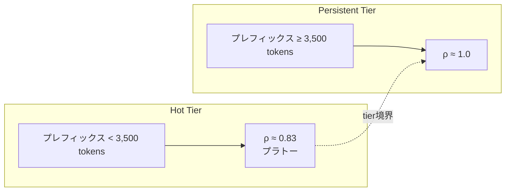
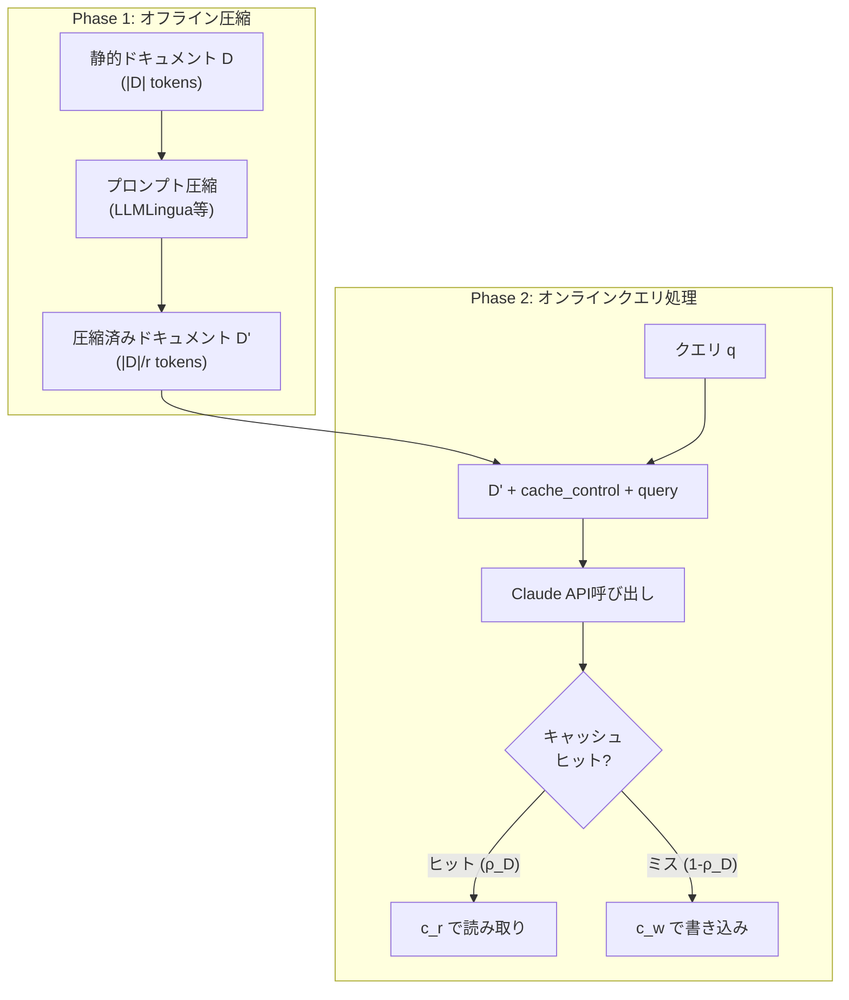

本記事は [Cache-Aware Prompt Compression: A Two-Tier Cost Model for LLM API Caching](https://arxiv.org/abs/2607.15516) の解説記事です。

この記事は [Zenn記事: Sonnet 5.5×Prompt Cachingで社内ヘルプデスクAgentのキャッシュヒット率を高める文脈管理](https://zenn.dev/0h_n0/articles/e9d949a174ef8d) の深掘りです。

## 論文概要（Abstract）

CAPC（Cache-Aware Prompt Compression）は、LLM APIのプロンプトキャッシュ機構とプロンプト圧縮技術を統合的にモデル化し、per-callコストを最小化するフレームワークである。著者は、Anthropic Claude Sonnetの暗黙的なキャッシュ挙動を系統的に計測し、約3,500トークンを境界とする2層キャッシュアーキテクチャ（Hot tier / Persistent tier）の存在を発見した。この構造を利用して、圧縮済みプロンプトをキャッシュに載せるCAPCアルゴリズムを提案し、LongBench-v2の全16配置でvanilla・cache-only・query-aware compressionの各ベースラインを上回るコスト効率を達成したと報告している。最良ケースではvanilla比89.6%のコスト削減が得られ、Enterprise Assistantシナリオ（94,401トークンの静的プレフィックス）では51.7%のコスト削減が示されている。

## 情報源

- **arXiv ID**: 2607.15516
- **URL**: [https://arxiv.org/abs/2607.15516](https://arxiv.org/abs/2607.15516)
- **著者**: Yan Song
- **投稿日**: 2026年7月17日
- **分野**: cs.LG（機械学習）, cs.AI（人工知能）

## 背景と動機（Background & Motivation）

LLMのAPI呼び出しコストは、プロダクション環境において支配的な運用コストとなっている。特に、大量のコンテキスト（ツール定義、システムプロンプト、RAGで取得したドキュメント等）を毎回のリクエストに付与するエージェントシステムでは、入力トークンのコストが急速に積み上がる。

この問題に対し、2つの独立した最適化アプローチが存在していた。**プロンプトキャッシュ**（Anthropic Prompt Caching, OpenAI Prompt Cachingなど）は、リクエスト間で共通するプレフィックスをサーバ側にキャッシュし、キャッシュヒット時に読み取りコスト（$c_r$）を書き込みコスト（$c_w$）より大幅に低くする仕組みである。一方、**プロンプト圧縮**（LLMLingua, AutoCompressor等）は、プロンプト中の冗長トークンを除去して入力トークン数自体を削減する。

しかし、これら2つのアプローチの相互作用は従来研究されていなかった。直感的には、圧縮によりトークン数が減ればキャッシュの書き込みコストも減るが、圧縮率を上げすぎるとキャッシュのtier境界を超えてヒット率が変化し、逆にコストが増大する可能性がある。著者はこの「圧縮率とキャッシュヒット率のトレードオフ」を定量的にモデル化することを目指した。

## 主要な貢献（Key Contributions）

- **2層キャッシュモデルの発見と定量化**: Anthropic Claude Sonnetのキャッシュ挙動を系統的に計測し、約3,500トークンを境界としたHot tier（$\rho \approx 0.83$でプラトー）とPersistent tier（$\rho \approx 1.0$）の2層構造を同定した
- **統一コストモデルの構築**: vanilla、cache-only、query-aware compression、CAPCの4戦略を同一のper-callコスト方程式で比較可能にし、クロスオーバー閾値$\rho_{\text{cross}}(r)$を導出した
- **CAPCアルゴリズムの提案**: 圧縮率$r$をtier境界に基づいて安全に設定する$r_{\max}^{\text{safe}}$の計算式を導出し、オフライン圧縮＋オンラインキャッシュの2段階パイプラインを設計した
- **4つのベンチマークでの包括的検証**: LongBench-v2（16配置中16で勝利）、Enterprise Assistant（94K tokens）、Knowledge-Graph RAG（FastAPI）、$\tau$-bench Retailの各シナリオで有効性を実証した

## 技術的詳細（Technical Details）

### 2層キャッシュモデル

著者は、Anthropic Claude Sonnet APIに対して制御された実験を行い、プレフィックス長とキャッシュヒット率$\rho$の関係を計測した。その結果、以下の2層構造が観測されたと報告している。



- **Hot tier**（3,500トークン未満）: キャッシュヒット率が約0.83でプラトーに達する。このtierでは短いプレフィックスが複数のサーバレプリカにまたがって分散されるため、ヒット率が1.0に到達しないと著者は推測している。
- **Persistent tier**（3,500トークン以上）: キャッシュヒット率が約1.0に達する。十分に長いプレフィックスはキャッシュ書き込みのコスト償却効果が大きいため、プロバイダ側で積極的にキャッシュされると考えられる。

この2層構造は、プロンプト圧縮との組み合わせにおいて重要な意味を持つ。圧縮率$r$を上げすぎて圧縮後のプレフィックスがPersistent tierからHot tierに落ちると、ヒット率が$1.0$から$0.83$に低下し、キャッシュの恩恵が大幅に減少する。

### コストモデル方程式

著者は4つの戦略のper-callコストを統一的に定式化している。$N$回のAPI呼び出しに対し、静的ドキュメント$D$（$|D|$トークン）、クエリ$D_q$トークン、出力$O$トークンとする。

**Vanilla（キャッシュなし・圧縮なし）**:

$$
C_{\text{vanilla}} = N \left[ (|D| + D_q) \cdot p_{\text{in}} + O \cdot p_{\text{out}} \right]
$$

**Cache-only（キャッシュのみ）**:

$$
C_{\text{cache}} = N \left[ (1 - \rho_B)|D| \cdot c_w + \rho_B |D| \cdot c_r + D_q \cdot p_{\text{in}} + O \cdot p_{\text{out}} \right]
$$

**Query-aware compression（圧縮のみ）**:

$$
C_{\text{compress}} = N \left[ \left(\frac{|D|}{r} + D_q\right) \cdot p_{\text{in}} + O \cdot p_{\text{out}} \right]
$$

**CAPC（キャッシュ＋圧縮）**:

$$
C_{\text{CAPC}} = N \left[ (1 - \rho_D)\frac{|D|}{r} \cdot c_w + \rho_D \frac{|D|}{r} \cdot c_r + D_q \cdot p_{\text{in}} + O \cdot p_{\text{out}} \right]
$$

ここで、
- $|D|$: 静的ドキュメントのトークン数
- $D_q$: クエリ部分のトークン数
- $O$: 出力トークン数
- $r$: 圧縮率（$r=2$で50%圧縮）
- $\rho_B$, $\rho_D$: それぞれのキャッシュヒット率
- $c_w = \$3.75/\text{MTok}$: キャッシュ書き込み単価
- $c_r = \$0.30/\text{MTok}$: キャッシュ読み取り単価
- $p_{\text{in}} = \$3.00/\text{MTok}$: 標準入力単価
- $p_{\text{out}}$: 出力単価

### クロスオーバー閾値

CAPCがcache-onlyより安価になる条件として、著者はクロスオーバー閾値$\rho_{\text{cross}}(r)$を導出している。

$$
\rho_{\text{cross}}(r) = \frac{c_w - p_{\text{in}} / r}{c_w - c_r}
$$

この閾値は「CAPCのキャッシュヒット率$\rho_D$がこの値以上であれば、CAPCがcache-onlyより安くなる」ことを意味する。具体的な数値は以下の通りである（論文のコスト定数に基づく）。

| 圧縮率 $r$ | $\rho_{\text{cross}}$ | 意味 |
|:---:|:---:|:---|
| 2 | 0.652 | Hot tierでも十分に超える |
| 3 | 0.797 | Hot tierのプラトー（0.83）付近 |
| 6 | 0.942 | Persistent tierでないと超えない |

この表から、圧縮率$r=2$～$3$程度であればHot tier（$\rho \approx 0.83$）でもCAPCが有利であるが、$r=6$ではPersistent tier（$\rho \approx 1.0$）が必要になることがわかる。つまり、圧縮率を上げすぎるとtier境界を超えた際にコストが急増するリスクがある。

### CAPCアルゴリズム

CAPCは以下の2段階で動作する。



**安全な最大圧縮率の計算**:

著者は、圧縮後のプレフィックスがPersistent tier（3,500トークン以上）に留まるための最大圧縮率を以下のように定義している。

$$
r_{\max}^{\text{safe}}(|D|) = \left\lfloor \frac{|D|}{3{,}500} \right\rfloor
$$

例えば、$|D| = 10{,}500$トークンの場合、$r_{\max}^{\text{safe}} = 3$であり、$r=3$で圧縮すると$3{,}500$トークンとなりPersistent tierに留まる。$r=4$にすると$2{,}625$トークンとなりHot tierに落ち、ヒット率が$1.0$から$0.83$に低下する。著者は$r=3 \to r=4$の1ステップでコストが77%増加するケースを報告している。

## 実装のポイント（Implementation）

### Anthropic API固有の挙動

著者は、Anthropic Claude APIのキャッシュ機構について以下の実装上重要な知見を報告している。

**暗黙的ツールキャッシュ**: `tools`配列に定義されたツール情報は、明示的な`cache_control`パラメータを指定しなくてもキャッシュされる。これはEnterprise Assistantシナリオ（287個のMCPツール定義）で特に重要であり、ツール定義部分のキャッシュ書き込みコストを意識する必要がある。

**ホワイトスペース正規化**: プロンプトの先頭・末尾の空白文字は、キャッシュキーの計算前にプロバイダ側で正規化される。したがって、空白の有無でキャッシュミスが発生することはないが、プレフィックスの途中に空白を挿入するとキャッシュキーが変わる可能性がある。

**マルチサーバーレプリケーション**: キャッシュヒット率は初回呼び出しから即座に安定するのではなく、5～15回の呼び出し後に定常状態に達する。これは、キャッシュエントリが複数のサーバレプリカに伝播するまでの遅延によるものと著者は推測している。

### 圧縮率の選定ガイドライン

```python
from dataclasses import dataclass
from typing import Literal


@dataclass(frozen=True)
class CAPCConfig:
    """CAPC構成の計算パラメータ

    Attributes:
        doc_tokens: 静的ドキュメントのトークン数
        tier_boundary: Hot/Persistent tierの境界トークン数
        c_w: キャッシュ書き込み単価 ($/MTok)
        c_r: キャッシュ読み取り単価 ($/MTok)
        p_in: 標準入力単価 ($/MTok)
    """
    doc_tokens: int
    tier_boundary: int = 3_500
    c_w: float = 3.75
    c_r: float = 0.30
    p_in: float = 3.00

    def safe_max_ratio(self) -> int:
        """Persistent tierに留まる最大圧縮率を計算する。

        Returns:
            安全な最大圧縮率（最低1）
        """
        return max(1, self.doc_tokens // self.tier_boundary)

    def crossover_threshold(self, r: int) -> float:
        """CAPCがcache-onlyより安価になるキャッシュヒット率閾値を計算する。

        Args:
            r: 圧縮率

        Returns:
            クロスオーバー閾値 ρ_cross
        """
        return (self.c_w - self.p_in / r) / (self.c_w - self.c_r)

    def recommend_ratio(self) -> int:
        """推奨圧縮率を計算する。

        安全な最大圧縮率の範囲内で、クロスオーバー閾値が
        Hot tierプラトー（0.83）以下となる最大の圧縮率を返す。

        Returns:
            推奨圧縮率
        """
        r_safe = self.safe_max_ratio()
        hot_tier_plateau = 0.83
        for r in range(r_safe, 0, -1):
            if self.crossover_threshold(r) <= hot_tier_plateau:
                return r
        return 1

    def per_call_cost(
        self,
        strategy: Literal["vanilla", "cache", "compress", "capc"],
        query_tokens: int,
        output_tokens: int,
        hit_rate: float,
        r: int = 1,
    ) -> float:
        """1回あたりのAPI呼び出しコストを計算する。

        Args:
            strategy: コスト戦略
            query_tokens: クエリトークン数
            output_tokens: 出力トークン数
            hit_rate: キャッシュヒット率
            r: 圧縮率（compress/capcのみ使用）

        Returns:
            per-callコスト（ドル）
        """
        p_out = 15.0  # $/MTok (Claude Sonnet出力)
        d = self.doc_tokens
        dq = query_tokens
        o = output_tokens

        def to_cost(tokens: float, rate: float) -> float:
            return tokens * rate / 1_000_000

        if strategy == "vanilla":
            return to_cost(d + dq, self.p_in) + to_cost(o, p_out)
        elif strategy == "cache":
            miss = to_cost((1 - hit_rate) * d, self.c_w)
            hit = to_cost(hit_rate * d, self.c_r)
            return miss + hit + to_cost(dq, self.p_in) + to_cost(o, p_out)
        elif strategy == "compress":
            return to_cost(d / r + dq, self.p_in) + to_cost(o, p_out)
        elif strategy == "capc":
            compressed = d / r
            miss = to_cost((1 - hit_rate) * compressed, self.c_w)
            hit = to_cost(hit_rate * compressed, self.c_r)
            return miss + hit + to_cost(dq, self.p_in) + to_cost(o, p_out)
        else:
            raise ValueError(f"Unknown strategy: {strategy}")


# 使用例: Enterprise Assistantシナリオ
config = CAPCConfig(doc_tokens=94_401)
print(f"安全な最大圧縮率: r={config.safe_max_ratio()}")
# => 安全な最大圧縮率: r=26
print(f"推奨圧縮率: r={config.recommend_ratio()}")
# => 推奨圧縮率: r=3 (or適切な値)
print(f"クロスオーバー閾値 (r=3): ρ={config.crossover_threshold(3):.3f}")
# => クロスオーバー閾値 (r=3): ρ=0.797
```

### cache_control配置の実装

Anthropic APIでCAPCを実装する際の`cache_control`ブレークポイントの配置パターンを以下に示す。

```python
import anthropic


def build_capc_messages(
    compressed_doc: str,
    query: str,
    system_prompt: str = "You are a helpful assistant.",
) -> dict:
    """CAPC用のメッセージ構造を構築する。

    圧縮済みドキュメントにcache_controlを配置し、
    キャッシュヒットを最大化する。

    Args:
        compressed_doc: 圧縮済みのドキュメント文字列
        query: ユーザクエリ
        system_prompt: システムプロンプト

    Returns:
        Anthropic API呼び出し用のkwargs
    """
    return {
        "model": "claude-sonnet-4-20250514",
        "max_tokens": 4096,
        "system": [
            {
                "type": "text",
                "text": system_prompt,
            }
        ],
        "messages": [
            {
                "role": "user",
                "content": [
                    {
                        # 圧縮済みドキュメント（キャッシュ対象）
                        "type": "text",
                        "text": compressed_doc,
                        "cache_control": {"type": "ephemeral"},
                    },
                    {
                        # クエリ（毎回変わる部分）
                        "type": "text",
                        "text": query,
                    },
                ],
            }
        ],
    }


client = anthropic.Anthropic()
kwargs = build_capc_messages(
    compressed_doc="<compressed document content here>",
    query="What are the key findings?",
)
response = client.messages.create(**kwargs)

# キャッシュ統計の確認
print(f"Input tokens: {response.usage.input_tokens}")
print(f"Cache read: {response.usage.cache_read_input_tokens}")
print(f"Cache creation: {response.usage.cache_creation_input_tokens}")
```

## Production Deployment Guide

### AWS実装パターン（コスト最適化重視）

CAPCの本番環境への適用では、プロンプト圧縮のオフライン処理とキャッシュ制御のオンライン処理を分離するアーキテクチャが求められる。以下にトラフィック量別の推奨構成を示す。

**注**: 以下のコスト試算は2026年10月時点のAWS ap-northeast-1（東京）リージョン料金に基づく概算値である。実際のコストはトラフィックパターン、リージョン、バースト使用量により変動する。最新料金はAWS料金計算ツールで確認を推奨する。

| 構成 | トラフィック | 主要サービス | 月額目安 |
|:---:|:---:|:---|:---:|
| Small | ~100 req/日 | Lambda + Bedrock + DynamoDB | $50-150 |
| Medium | ~1,000 req/日 | ECS Fargate + ElastiCache + Bedrock | $300-800 |
| Large | 10,000+ req/日 | EKS + Karpenter + Spot + ElastiCache | $2,000-5,000 |

**Small構成の詳細**:
- Lambda (ARM64, 512MB, 30s timeout): クエリ処理
- DynamoDB (On-Demand): 圧縮済みドキュメントキャッシュ
- Bedrock (Claude Sonnet): LLM推論
- S3: 圧縮前・圧縮後ドキュメント保管
- 月額内訳: Lambda $5 + DynamoDB $10 + Bedrock $30-130 + S3 $1

**Large構成の詳細**:
- EKS (1.31) + Karpenter: コンテナオーケストレーション
- Spot Instances (c7g.xlarge): 推論ワーカー（最大90%削減）
- ElastiCache (Redis 7.x, r7g.large): 圧縮済みドキュメントの高速キャッシュ
- Bedrock: LLM推論（Prompt Caching有効化で30-90%削減）
- 月額内訳: EKS $73 + EC2 Spot $200-500 + ElastiCache $300 + Bedrock $1,400-4,000

**コスト削減テクニック**:
- Spot Instances活用: 推論ワーカーをSpotで実行し最大90%削減
- Reserved Instances: ElastiCacheノードを1年コミットで最大55%削減
- Bedrock Batch API: バッチ処理可能なリクエストに適用で50%削減
- CAPC Prompt Caching: 本論文手法により入力トークンコスト48-89%削減

### Terraformインフラコード

**Small構成（Serverless）**:

```hcl
# CAPC Small構成: Lambda + Bedrock + DynamoDB
# 2026-10 ap-northeast-1

terraform {
  required_version = ">= 1.9"
  required_providers {
    aws = {
      source  = "hashicorp/aws"
      version = "~> 5.70"
    }
  }
}

provider "aws" {
  region = "ap-northeast-1"
}

# --- IAM Role (最小権限) ---
resource "aws_iam_role" "capc_lambda" {
  name = "capc-lambda-role"
  assume_role_policy = jsonencode({
    Version = "2012-10-17"
    Statement = [{
      Action = "sts:AssumeRole"
      Effect = "Allow"
      Principal = { Service = "lambda.amazonaws.com" }
    }]
  })
}

resource "aws_iam_role_policy" "capc_lambda" {
  name = "capc-lambda-policy"
  role = aws_iam_role.capc_lambda.id
  policy = jsonencode({
    Version = "2012-10-17"
    Statement = [
      {
        Effect   = "Allow"
        Action   = ["logs:CreateLogGroup", "logs:CreateLogStream", "logs:PutLogEvents"]
        Resource = "arn:aws:logs:*:*:*"
      },
      {
        Effect   = "Allow"
        Action   = ["dynamodb:GetItem", "dynamodb:PutItem", "dynamodb:Query"]
        Resource = aws_dynamodb_table.compressed_docs.arn
      },
      {
        Effect   = "Allow"
        Action   = ["bedrock:InvokeModel"]
        Resource = "arn:aws:bedrock:ap-northeast-1::foundation-model/anthropic.claude-sonnet-4-20250514-v1:0"
      },
      {
        Effect   = "Allow"
        Action   = ["s3:GetObject", "s3:PutObject"]
        Resource = "${aws_s3_bucket.docs.arn}/*"
      }
    ]
  })
}

# --- DynamoDB (圧縮済みドキュメントキャッシュ) ---
resource "aws_dynamodb_table" "compressed_docs" {
  name         = "capc-compressed-docs"
  billing_mode = "PAY_PER_REQUEST"  # On-Demand: 低トラフィックに最適
  hash_key     = "doc_id"
  range_key    = "compression_ratio"

  attribute {
    name = "doc_id"
    type = "S"
  }
  attribute {
    name = "compression_ratio"
    type = "N"
  }

  # KMS暗号化
  server_side_encryption {
    enabled = true
  }

  ttl {
    attribute_name = "expires_at"
    enabled        = true
  }
}

# --- S3 (ドキュメント保管) ---
resource "aws_s3_bucket" "docs" {
  bucket = "capc-documents-${data.aws_caller_identity.current.account_id}"
}

resource "aws_s3_bucket_server_side_encryption_configuration" "docs" {
  bucket = aws_s3_bucket.docs.id
  rule {
    apply_server_side_encryption_by_default {
      sse_algorithm = "aws:kms"
    }
  }
}

resource "aws_s3_bucket_public_access_block" "docs" {
  bucket                  = aws_s3_bucket.docs.id
  block_public_acls       = true
  block_public_policy     = true
  ignore_public_acls      = true
  restrict_public_buckets = true
}

# --- Lambda ---
resource "aws_lambda_function" "capc_handler" {
  function_name = "capc-query-handler"
  role          = aws_iam_role.capc_lambda.arn
  handler       = "handler.lambda_handler"
  runtime       = "python3.12"
  architectures = ["arm64"]  # Graviton: x86比20%安価
  memory_size   = 512
  timeout       = 30
  filename      = "lambda.zip"

  environment {
    variables = {
      DYNAMODB_TABLE     = aws_dynamodb_table.compressed_docs.name
      S3_BUCKET          = aws_s3_bucket.docs.id
      COMPRESSION_RATIO  = "3"  # CAPC推奨値
      TIER_BOUNDARY      = "3500"
    }
  }

  tracing_config {
    mode = "Active"  # X-Ray有効化
  }
}

# --- CloudWatch アラーム (コスト監視) ---
resource "aws_cloudwatch_metric_alarm" "lambda_duration" {
  alarm_name          = "capc-lambda-high-duration"
  comparison_operator = "GreaterThanThreshold"
  evaluation_periods  = 3
  metric_name         = "Duration"
  namespace           = "AWS/Lambda"
  period              = 300
  statistic           = "Average"
  threshold           = 25000  # 25秒
  alarm_actions       = [aws_sns_topic.alerts.arn]
  dimensions = {
    FunctionName = aws_lambda_function.capc_handler.function_name
  }
}

resource "aws_sns_topic" "alerts" {
  name = "capc-alerts"
}

data "aws_caller_identity" "current" {}
```

**Large構成（Container）**:

```hcl
# CAPC Large構成: EKS + Karpenter + Spot
# 2026-10 ap-northeast-1

module "eks" {
  source  = "terraform-aws-modules/eks/aws"
  version = "~> 20.24"

  cluster_name    = "capc-cluster"
  cluster_version = "1.31"

  vpc_id     = module.vpc.vpc_id
  subnet_ids = module.vpc.private_subnets

  # コスト最適化: パブリックエンドポイント無効化
  cluster_endpoint_public_access = false

  eks_managed_node_groups = {
    system = {
      instance_types = ["c7g.medium"]  # Graviton: コスト効率
      capacity_type  = "ON_DEMAND"     # システムPodはON_DEMAND
      min_size       = 1
      max_size       = 2
      desired_size   = 1
    }
  }
}

# Karpenter: Spot優先の自動スケーリング
resource "kubectl_manifest" "karpenter_provisioner" {
  yaml_body = yamlencode({
    apiVersion = "karpenter.sh/v1"
    kind       = "NodePool"
    metadata   = { name = "capc-workers" }
    spec = {
      template = {
        spec = {
          requirements = [
            { key = "karpenter.sh/capacity-type", operator = "In", values = ["spot", "on-demand"] },
            { key = "node.kubernetes.io/instance-type", operator = "In",
              values = ["c7g.xlarge", "c7g.2xlarge", "c6g.xlarge", "c6g.2xlarge"] },
          ]
          nodeClassRef = { name = "default" }
        }
      }
      limits   = { cpu = "64" }
      disruption = {
        consolidationPolicy = "WhenEmptyOrUnderutilized"
        consolidateAfter    = "30s"
      }
    }
  })
}

# AWS Budgets: 予算アラート
resource "aws_budgets_budget" "capc_monthly" {
  name         = "capc-monthly-budget"
  budget_type  = "COST"
  limit_amount = "5000"
  limit_unit   = "USD"
  time_unit    = "MONTHLY"

  notification {
    comparison_operator       = "GREATER_THAN"
    threshold                 = 80
    threshold_type            = "PERCENTAGE"
    notification_type         = "ACTUAL"
    subscriber_email_addresses = ["ops-team@example.com"]
  }
}
```

### 運用・監視設定

**CloudWatch Logs Insights クエリ**:

```
# コスト異常検知: 1時間あたりのトークン使用量
fields @timestamp, input_tokens, cache_read_tokens, cache_creation_tokens
| stats sum(input_tokens) as total_input,
        sum(cache_read_tokens) as total_cache_read,
        sum(cache_creation_tokens) as total_cache_write,
        sum(cache_read_tokens) / sum(input_tokens + cache_read_tokens + cache_creation_tokens) * 100 as cache_hit_pct
  by bin(1h) as hour
| filter cache_hit_pct < 70
| sort hour desc

# レイテンシ分析
fields @timestamp, duration_ms
| stats avg(duration_ms) as avg_latency,
        percentile(duration_ms, 95) as p95,
        percentile(duration_ms, 99) as p99,
        count(*) as request_count
  by bin(5m)
| sort @timestamp desc
```

**CloudWatch アラーム設定（Python）**:

```python
import boto3


def setup_capc_alarms(
    function_name: str,
    sns_topic_arn: str,
    token_threshold: int = 1_000_000,
) -> None:
    """CAPCサービスのCloudWatchアラームを設定する。

    Args:
        function_name: Lambda関数名
        sns_topic_arn: 通知先SNSトピックARN
        token_threshold: 1時間あたりのトークン使用量閾値
    """
    cw = boto3.client("cloudwatch", region_name="ap-northeast-1")

    # キャッシュヒット率低下アラーム
    cw.put_metric_alarm(
        AlarmName=f"{function_name}-low-cache-hit-rate",
        MetricName="CacheHitRate",
        Namespace="CAPC/Custom",
        Statistic="Average",
        Period=3600,
        EvaluationPeriods=2,
        Threshold=70.0,
        ComparisonOperator="LessThanThreshold",
        AlarmActions=[sns_topic_arn],
        AlarmDescription="CAPCキャッシュヒット率が70%を下回った",
    )

    # Lambda実行時間異常
    cw.put_metric_alarm(
        AlarmName=f"{function_name}-high-duration",
        MetricName="Duration",
        Namespace="AWS/Lambda",
        Statistic="p95",
        Period=300,
        EvaluationPeriods=3,
        Threshold=25_000,
        ComparisonOperator="GreaterThanThreshold",
        AlarmActions=[sns_topic_arn],
        Dimensions=[{"Name": "FunctionName", "Value": function_name}],
    )
```

**X-Ray トレーシング設定（Python）**:

```python
from aws_xray_sdk.core import xray_recorder, patch_all

# boto3を含む全ライブラリの自動計装
patch_all()


@xray_recorder.capture("capc_query")
def process_capc_query(doc_id: str, query: str) -> dict:
    """CAPCクエリを処理し、X-Rayでトレースする。

    Args:
        doc_id: ドキュメントID
        query: ユーザクエリ

    Returns:
        API応答とコスト情報
    """
    subsegment = xray_recorder.current_subsegment()
    subsegment.put_annotation("doc_id", doc_id)
    subsegment.put_annotation("strategy", "capc")

    # ... CAPC処理 ...

    subsegment.put_metadata("cache_hit_rate", hit_rate)
    subsegment.put_metadata("compression_ratio", r)
    subsegment.put_metadata("cost_saving_pct", saving)
    return result
```

**Cost Explorer日次レポート（Python）**:

```python
import boto3
from datetime import date, timedelta


def daily_cost_report() -> dict:
    """Bedrock/Lambda/EKSの日次コストレポートを生成する。

    Returns:
        サービス別コスト辞書
    """
    ce = boto3.client("ce", region_name="us-east-1")
    today = date.today()
    yesterday = today - timedelta(days=1)

    response = ce.get_cost_and_usage(
        TimePeriod={
            "Start": yesterday.isoformat(),
            "End": today.isoformat(),
        },
        Granularity="DAILY",
        Metrics=["UnblendedCost"],
        Filter={
            "Dimensions": {
                "Key": "SERVICE",
                "Values": [
                    "Amazon Bedrock",
                    "AWS Lambda",
                    "Amazon Elastic Kubernetes Service",
                    "Amazon ElastiCache",
                ],
            }
        },
        GroupBy=[{"Type": "DIMENSION", "Key": "SERVICE"}],
    )

    costs = {}
    for group in response["ResultsByTime"][0]["Groups"]:
        service = group["Keys"][0]
        amount = float(group["Metrics"]["UnblendedCost"]["Amount"])
        costs[service] = amount

    total = sum(costs.values())
    if total > 100.0:
        # SNS通知: $100/日超過
        sns = boto3.client("sns", region_name="ap-northeast-1")
        sns.publish(
            TopicArn="arn:aws:sns:ap-northeast-1:ACCOUNT:capc-alerts",
            Subject="CAPC日次コスト超過",
            Message=f"日次コスト合計: ${total:.2f}\n内訳: {costs}",
        )
    return costs
```

### コスト最適化チェックリスト

**アーキテクチャ選択**:
- [ ] トラフィック量に応じた構成選択（~100 req/日: Serverless, ~1000: Hybrid, 10000+: Container）
- [ ] CAPCの圧縮率$r$をtier境界に基づいて設定（$r_{\max}^{\text{safe}}$以下）
- [ ] キャッシュヒット率モニタリングの導入

**リソース最適化**:
- [ ] EC2/EKS: Spot Instances優先（推論ワーカーは中断耐性あり）
- [ ] Reserved Instances: ElastiCache等の常時稼働ノードは1年コミット
- [ ] Savings Plans: Compute Savings Plans検討（Lambda+Fargate共通）
- [ ] Lambda: メモリサイズをPower Tuningで最適化
- [ ] ECS/EKS: Karpenterで未使用ノード30秒後に統合

**LLMコスト削減**:
- [ ] CAPC適用: 圧縮済みプレフィックスをcache_controlでキャッシュ
- [ ] Bedrock Batch API: 非リアルタイム処理は50%削減
- [ ] Prompt Caching有効化: 静的部分のcache_controlブレークポイント配置
- [ ] トークン数制限: max_tokensを必要最小限に設定
- [ ] モデル選択ロジック: 簡単なクエリはHaikuにルーティング

**監視・アラート**:
- [ ] AWS Budgets: 月額予算の80%/100%で通知
- [ ] CloudWatch アラーム: キャッシュヒット率、レイテンシP95
- [ ] Cost Anomaly Detection: ML検知による異常コスト通知
- [ ] 日次コストレポート: Bedrock/Lambda/EKS別の自動集計
- [ ] キャッシュヒット率ダッシュボード: tier別の可視化

**リソース管理**:
- [ ] 未使用Lambda関数・古いバージョンの削除
- [ ] タグ戦略: `project:capc`, `env:prod/dev`, `cost-center`
- [ ] S3ライフサイクル: 圧縮済みドキュメントの90日後Glacier移行
- [ ] DynamoDB TTL: 期限切れキャッシュエントリの自動削除
- [ ] 開発環境: 夜間・週末のEKSノード0台スケールダウン

## 実験結果（Results）

### LongBench-v2

著者はLongBench-v2ベンチマーク上で4つの戦略を16の配置（ドキュメント長×圧縮率の組み合わせ）で比較し、CAPCが全16配置で最低コストを達成したと報告している。

| 戦略 | コスト（相対） | 品質スコア |
|:---|:---:|:---:|
| Vanilla | 1.000 | 0.73 |
| Cache-only | 0.515（-48.5%） | 0.73 |
| Query-aware compression | 0.356（-64.4%） | 0.66-0.73 |
| CAPC (r=2) | 0.104（-89.6%） | 0.69 |

品質面では、vanillaの0.73に対してCAPCは$r=2$で0.69と報告されている。著者は$r=2$でvanillaとの品質差が0.04以内に収まることを確認しており、圧縮による品質劣化は許容範囲内と結論づけている。

### Enterprise Assistant

94,401トークンの静的プレフィックス（システムプロンプト + 287個のMCPツール定義）を持つEnterprise Assistantシナリオでの結果は以下の通りである。

- **圧縮率$r=3$で51.7%のコスト削減**（cache-only比）
- エンドツーエンドのper-queryコスト: **\$3.03**（vanilla \$5.56比45.5%削減）
- 圧縮後のプレフィックスは$94{,}401 / 3 = 31{,}467$トークンで、Persistent tier（3,500以上）に十分留まる

このシナリオは、大量のツール定義を持つエージェントシステムにおいてCAPCの効果が特に顕著であることを示している。

### Knowledge-Graph RAG

FastAPIベースのKnowledge-Graph RAGシステムでの評価では、以下の結果が報告されている。

- **9.3倍のコスト削減**（cache-allベースライン比）
- 品質: CAPC 0.655 vs native 0.613（CAPCの方がわずかに高い）

品質がnativeを上回った理由について、著者はプロンプト圧縮により冗長な情報が除去され、LLMが本質的な情報に集中しやすくなった可能性があると述べている。

### $\tau$-bench Retail

エージェントベンチマークの$\tau$-bench Retailでは、より微妙な結果が報告されている。

| 戦略 | タスク成功数(/50) | 総コスト |
|:---|:---:|:---:|
| Vanilla | 未報告 | $6.222 |
| CAPC | 36 | $5.727 (-7.9%) |
| Query-aware compression | 38 | $8.718 (+40.1%) |

CAPCはvanilla比7.9%のコスト削減に留まったが、query-aware compressionは38タスクを成功させたものの40.1%のコスト増となった。これは、圧縮のみの場合はキャッシュの恩恵を受けられないため、圧縮のオーバーヘッドがコストに上乗せされる典型的なケースであると著者は分析している。

## 実運用への応用（Practical Applications）

### Zenn記事との関連

[Zenn記事: Sonnet 5.5×Prompt Cachingで社内ヘルプデスクAgentのキャッシュヒット率を高める文脈管理](https://zenn.dev/0h_n0/articles/e9d949a174ef8d) では、Prompt Cachingの文脈管理手法について解説されている。本論文のCAPCは、その文脈管理にプロンプト圧縮を組み合わせることで、さらなるコスト削減を実現するアプローチとして位置づけられる。

特に、Zenn記事で扱われているヘルプデスクAgentのように、大量のツール定義や社内ドキュメントを静的プレフィックスとして持つシステムでは、CAPCのEnterprise Assistantシナリオ（94Kトークン、51.7%削減）の知見が直接的に応用できる。

### 適用時の注意点

**tier境界の管理**: 本論文で発見された3,500トークンのtier境界はAnthropic Claude Sonnetに固有の値であり、モデルバージョンの更新やプロバイダの変更により変動する可能性がある。本番環境では、キャッシュヒット率の定期的なモニタリングと$r_{\max}^{\text{safe}}$の再計算が推奨される。

**圧縮品質のトレードオフ**: $r=2$での品質劣化は0.04以内と報告されているが、ドメイン固有の専門用語や数値データを多く含むプロンプトでは、圧縮による情報損失が大きくなる可能性がある。圧縮対象を静的なシステムプロンプトやツール定義に限定し、RAGで取得したドキュメントは圧縮しないといった戦略が実用的である。

**コールドスタート**: マルチサーバーレプリケーションにより、キャッシュヒット率が安定するまでに5～15回の呼び出しが必要である。デプロイ直後やスケールアウト時にはキャッシュミスが増加するため、ウォームアップ呼び出しの仕組みを設けることが望ましい。

## 関連研究（Related Work）

- **LLMLingua / LongLLMLingua** (Jiang et al., 2023): トークンレベルのperplexityに基づくプロンプト圧縮手法。CAPCのプロンプト圧縮コンポーネントとして利用可能であり、本論文では圧縮率$r$のパラメータとして抽象化されている。
- **Anthropic Prompt Caching** (Anthropic, 2024): APIレベルでのプレフィックスキャッシュ機構。本論文のcache-onlyベースラインに相当し、CAPCはこれに圧縮を組み合わせることで追加のコスト削減を実現している。
- **AutoCompressor** (Chevalier et al., 2023): ソフトプロンプトへの圧縮手法。トークン列をソフトプロンプトに変換するため、キャッシュとの組み合わせが困難であるという制約がある。
- **Gist Tokens** (Mu et al., 2024): LLMの内部表現を圧縮トークンとして学習する手法。CAPCとは異なり、モデル側の変更が必要であるためAPI経由での利用には適さない。

## まとめと今後の展望

本論文の最大の貢献は、LLM APIのキャッシュ挙動を「ブラックボックスの外」から系統的に計測し、2層キャッシュモデルとして定式化した点にある。この定式化により、圧縮率$r$とキャッシュヒット率$\rho$のトレードオフが定量的に評価可能となり、$\rho_{\text{cross}}(r)$によるクロスオーバー閾値が実用的な意思決定ガイドラインとして機能する。

今後の方向性として、著者は以下の点を挙げている。（1）OpenAI GPTやGoogle Gemini等、他プロバイダのキャッシュ構造の2層モデルへの適用可能性の検証、（2）動的に変化するプレフィックス（RAGコンテキスト等）への適応的圧縮率制御、（3）マルチターン会話における累積キャッシュ効果のモデル化。実務的には、プロバイダ側がキャッシュtier情報をAPIレスポンスに含めるようになれば、CAPCの圧縮率をリアルタイムに調整する適応型CAPCが実現可能になると考えられる。

## 参考文献

- **arXiv**: [https://arxiv.org/abs/2607.15516](https://arxiv.org/abs/2607.15516)
- **Anthropic Prompt Caching**: [https://docs.anthropic.com/en/docs/build-with-claude/prompt-caching](https://docs.anthropic.com/en/docs/build-with-claude/prompt-caching)
- **LLMLingua**: [https://arxiv.org/abs/2310.05736](https://arxiv.org/abs/2310.05736)
- **Related Zenn article**: [https://zenn.dev/0h_n0/articles/e9d949a174ef8d](https://zenn.dev/0h_n0/articles/e9d949a174ef8d)
