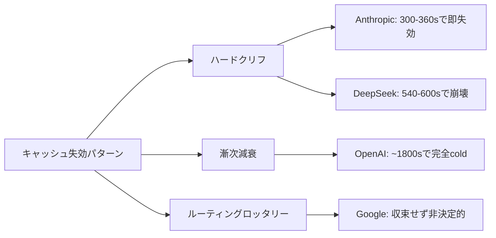

本記事は [Keeping the Cache Warm Pays: Keepalive Economics for Agentic Workloads](https://arxiv.org/abs/2607.19214) の解説記事です。

この記事は [Zenn記事: Sonnet 5.5×Prompt Cachingで社内ヘルプデスクAgentのキャッシュヒット率を高める文脈管理](https://zenn.dev/0h_n0/articles/e9d949a174ef8d) の深掘りです。

## 論文概要（Abstract）

フロンティアLLMプロバイダーが提供するプロンプトキャッシュは、後続リクエストのコストを入力価格の約10%に削減できる。しかしエージェントワークロードでは、ツール実行や人間の承認待ちによるアイドル期間中にキャッシュが失効（expire）し、再開時にフルコストのprefillが発生する。著者は、アイドル中にクライアント側からキャッシュプレフィックスを定期的にリプレイするkeepalive戦略を提案し、Anthropic・OpenAI・Google・DeepSeekの4プロバイダーで実測評価を行っている。最適インターバル$\tau^*$の解析的導出と実験的検証により、最大12.5倍のポストポーズコスト削減と、TTFT（Time To First Token）の大幅な短縮を報告している。

## 情報源

- **arXiv ID**: 2607.19214
- **URL**: [https://arxiv.org/abs/2607.19214](https://arxiv.org/abs/2607.19214)
- **著者**: Maxim Khailo
- **発表年**: 2026（v2: 2026年7月24日）
- **分野**: cs.DC（分散・並列・クラスタコンピューティング）

## 背景と動機（Background & Motivation）

LLMエージェントは、ツール呼び出し（API実行、データベースクエリ等）や人間の承認ステップ（human-in-the-loop）を挟むため、リクエスト間にアイドル期間が発生する。このアイドル期間が各プロバイダーのキャッシュTTL（Time To Live）を超えると、次のリクエストではキャッシュが利用できず、全プレフィックスを再度フルプライスで送信する必要がある。

例えばAnthropicの5分TTLの場合、システムプロンプトと会話履歴を合わせた100kトークンのプレフィックスが失効すると、再開時に$0.375（100k × $3.75/MTok）のprefillコストが発生する。キャッシュが生きていれば$0.0375（$0.375/MTok）で済むため、10倍のコスト差が生じる。エージェントが1日に数十回のポーズを挟む場合、この差は月単位で数百ドル規模に膨らむ。

従来、キャッシュ管理はプロバイダー側の最適化に委ねられてきたが、著者はクライアント側の能動的なキャッシュ維持戦略（keepalive）が経済的に合理的であることを、コストモデルの解析と4プロバイダーの実測データにより示している。

## 主要な貢献（Key Contributions）

- **貢献1**: アイドル期間$I$に対するkeepaliveコストと失効コストのトレードオフを定式化し、最適keepaliveインターバル$\tau^*$と損益分岐アイドル期間$I_{\max}$を解析的に導出した
- **貢献2**: Anthropic・OpenAI・Google・DeepSeekの4プロバイダーについて、実測によるキャッシュ失効特性（ハードクリフ/漸次減衰/ルーティングロッタリー）を明らかにした
- **貢献3**: 600秒・1800秒のアイドル期間での実験により、keepaliveが最大12.5倍のポストポーズコスト削減と、TTFT 2.9秒から1.5秒への短縮をもたらすことを実証した
- **貢献4**: keepaliveインターバルの選択ミス（30秒間隔等の過剰リプレイ）が最適の8倍のコスト増を招くことを定量的に示し、実装上の注意点を明確化した

## 技術的詳細（Technical Details）

### コストモデル方程式

著者は、アイドル期間$I$中のkeepalive戦略の経済性を以下のモデルで定式化している。

**keepaliveコスト（アイドル期間$I$中の総コスト）**:

$$
C_{\text{keepalive}}(I) = \left(\left\lfloor \frac{I}{\tau} \right\rfloor + 1\right) \cdot r \cdot P
$$

ここで、
- $I$: アイドル期間（秒）
- $\tau$: keepaliveインターバル（秒）
- $r$: cached-read比率（フル入力価格に対するキャッシュ読み取り価格の割合）
- $P$: プレフィックスのトークン数

各keepaliveリクエストでは、プレフィックス全体をキャッシュ読み取り価格$r$で送信し、キャッシュのTTLタイマーをリセットする。$\lfloor I/\tau \rfloor + 1$はアイドル期間中に送信するkeepaliveリクエスト数を表す。

**キャッシュ失効コスト（keepaliveなしの場合）**:

$$
C_{\text{expire}} = w \cdot P
$$

ここで、
- $w$: re-prefill比率（キャッシュ書き込みコスト。プロバイダーにより$w = 1.0$～$2.0$）

キャッシュが失効した場合、次のリクエストでプレフィックス全体をフルプライス（またはキャッシュ書き込み価格$w$）で再送する必要がある。

### 最適keepaliveインターバルの導出

**経済的インターバル$\tau^*$**:

$$
\tau^* = T - \delta
$$

ここで、
- $T$: プロバイダーのキャッシュTTL（秒）
- $\delta$: 安全マージン（ネットワーク遅延等を考慮、著者は60秒を推奨）

$\tau^*$はTTLの直前でkeepaliveを送信することで、リクエスト回数を最小化しつつキャッシュを維持する。Anthropic 5分TTL（$T = 300$秒）の場合、$\tau^* \approx 240$秒（4分間隔）となる。

**損益分岐アイドル期間$I_{\max}$**:

keepaliveのコストが失効コストを下回る最大アイドル期間は以下で求まる：

$$
I_{\max} \approx \tau \cdot \left(\frac{w}{r} - 1\right)
$$

この式は、$C_{\text{keepalive}}(I_{\max}) = C_{\text{expire}}$を解くことで導出される。Anthropic 5分TTL（$r = 0.10$, $w = 1.25$）では$I_{\max} \approx 240 \times (12.5 - 1) = 2760$秒（約46分）となり、46分以内のアイドルであればkeepaliveが経済的に有利であることを意味する。

### keepaliveアルゴリズム

著者が提案するkeepaliveの制御ロジックは以下の通りである。

```python
import time
import threading
from dataclasses import dataclass


@dataclass
class KeepaliveConfig:
    """Keepalive設定パラメータ

    Attributes:
        ttl_seconds: プロバイダーのキャッシュTTL（秒）
        safety_margin: 安全マージン（秒）。TTLの直前にkeepaliveを送信するためのバッファ
        max_idle_seconds: 最大アイドル期間（秒）。これを超えたらkeepaliveを停止
    """
    ttl_seconds: float
    safety_margin: float = 60.0
    max_idle_seconds: float = 2760.0

    @property
    def optimal_interval(self) -> float:
        """最適keepaliveインターバル τ* = T - δ を算出"""
        return self.ttl_seconds - self.safety_margin


# プロバイダー別推奨設定
PROVIDER_CONFIGS: dict[str, KeepaliveConfig] = {
    "anthropic_5min": KeepaliveConfig(
        ttl_seconds=300.0,
        safety_margin=60.0,
        max_idle_seconds=2760.0,  # ~46min
    ),
    "anthropic_1hr": KeepaliveConfig(
        ttl_seconds=3600.0,
        safety_margin=600.0,
        max_idle_seconds=11880.0,  # ~3.3h
    ),
    "openai": KeepaliveConfig(
        ttl_seconds=600.0,
        safety_margin=120.0,
        max_idle_seconds=2160.0,  # ~36min
    ),
    "deepseek": KeepaliveConfig(
        ttl_seconds=600.0,
        safety_margin=60.0,
        max_idle_seconds=2160.0,  # ~36min
    ),
}
```

### τ*の選択が及ぼすコスト影響

著者は、keepaliveインターバルの選択ミスによるコスト増を定量的に分析している。Anthropic 5分TTLの場合：

- **$\tau = 30$秒（過剰リプレイ）**: アイドル期間600秒で$30/240 + 1 = 21$回のkeepalive送信。最適（$\tau = 240$秒、3回送信）の約8倍のコスト
- **$\tau \geq 480$秒（間隔過大）**: TTLを超過し、キャッシュが失効。keepaliveリクエスト自体がフルwrite価格（$w = 1.25$）で課金され、keepaliveなしの4倍悪化する場合がある

この分析は、$\tau^*$の正確な設定がkeepalive戦略の成否を決めることを示している。

### プロバイダー別キャッシュ失効特性

著者の実測データにより、4プロバイダーのキャッシュ失効挙動は3つのパターンに分類される。



- **ハードクリフ（Anthropic, DeepSeek）**: TTL境界で急激にキャッシュヒット率が0%に低下する。keepalive戦略と相性が良い（明確なTTLに基づいて$\tau^*$を設定できる）
- **漸次減衰（OpenAI）**: TTL後も確率的にキャッシュが残存し、約1800秒（30分）で完全にcoldになる。keepaliveによるコスト改善効果が大きい（$\tau = 480$秒で2.45倍の削減）
- **ルーティングロッタリー（Google）**: キャッシュヒットが非決定的で、TTL内でもヒットしない場合がある。keepaliveはレイテンシ改善には寄与するが、コスト改善は限定的と報告されている

## 実装のポイント（Implementation）

論文のkeepalive戦略を実装する際の主要な考慮点を以下に示す。

```python
import asyncio
import logging
from typing import Protocol

logger = logging.getLogger(__name__)


class LLMClient(Protocol):
    """LLMクライアントのプロトコル定義"""

    async def send_prefix(self, prefix_tokens: list[int]) -> dict:
        """プレフィックスを送信しキャッシュを更新する

        Args:
            prefix_tokens: キャッシュ対象のプレフィックストークン列

        Returns:
            レスポンスメタデータ（cache_hit, latency_ms等）
        """
        ...


class KeepaliveManager:
    """エージェントのアイドル中にキャッシュを維持するマネージャ

    Args:
        client: LLMプロバイダーのクライアント
        config: プロバイダー別keepalive設定
        prefix_tokens: キャッシュ対象のプレフィックストークン列
    """

    def __init__(
        self,
        client: LLMClient,
        config: KeepaliveConfig,
        prefix_tokens: list[int],
    ) -> None:
        self._client = client
        self._config = config
        self._prefix_tokens = prefix_tokens
        self._task: asyncio.Task | None = None
        self._idle_start: float = 0.0

    async def start(self) -> None:
        """keepaliveループを開始する（エージェントがアイドルに入った時に呼ぶ）"""
        self._idle_start = asyncio.get_event_loop().time()
        self._task = asyncio.create_task(self._keepalive_loop())
        logger.info(
            "keepalive started",
            extra={
                "interval_s": self._config.optimal_interval,
                "max_idle_s": self._config.max_idle_seconds,
            },
        )

    async def stop(self) -> None:
        """keepaliveループを停止する（エージェントが再開した時に呼ぶ）"""
        if self._task and not self._task.done():
            self._task.cancel()
            try:
                await self._task
            except asyncio.CancelledError:
                pass
        elapsed = asyncio.get_event_loop().time() - self._idle_start
        logger.info("keepalive stopped", extra={"idle_duration_s": elapsed})

    async def _keepalive_loop(self) -> None:
        """最適インターバルでキャッシュをリフレッシュするループ"""
        interval = self._config.optimal_interval
        max_idle = self._config.max_idle_seconds

        while True:
            await asyncio.sleep(interval)
            elapsed = asyncio.get_event_loop().time() - self._idle_start

            if elapsed >= max_idle:
                logger.warning(
                    "max idle exceeded, stopping keepalive",
                    extra={"elapsed_s": elapsed, "max_idle_s": max_idle},
                )
                break

            try:
                result = await self._client.send_prefix(self._prefix_tokens)
                logger.info(
                    "keepalive ping sent",
                    extra={
                        "elapsed_s": elapsed,
                        "cache_hit": result.get("cache_hit"),
                        "latency_ms": result.get("latency_ms"),
                    },
                )
            except Exception:
                logger.exception("keepalive ping failed")
```

**実装上の注意点**:

1. **`max_tokens=1`の指定**: keepaliveリクエストではプレフィックスのキャッシュリフレッシュのみが目的であるため、`max_tokens=1`を設定して出力トークンコストを最小化する
2. **安全マージンの調整**: ネットワーク遅延が大きい環境ではsafety_marginを増やす。ただし大きすぎるとリクエスト回数が増えコスト上昇につながる
3. **損益分岐の事前計算**: $I_{\max}$を超えるアイドルが予想される場合はkeepaliveを開始しない方が経済的である
4. **並行リクエストとの干渉**: keepaliveリクエストがレートリミットを消費するため、本体リクエストのスロットリングに影響しないよう考慮する

## Production Deployment Guide

### AWS実装パターン（コスト最適化重視）

本論文のkeepalive戦略をAWS上で運用する場合の構成を、トラフィック量別に示す。keepaliveはLLMエージェントのアイドル管理であるため、エージェント基盤そのもののインフラ構成と密接に関連する。

| 構成 | トラフィック | 月額概算 | 主要サービス |
|------|------------|---------|-------------|
| Small | ~100 req/日 | $80-200 | Lambda + Bedrock + DynamoDB |
| Medium | ~1,000 req/日 | $400-900 | ECS Fargate + Bedrock + ElastiCache |
| Large | 10,000+ req/日 | $2,500-6,000 | EKS + Spot + Bedrock Batch |

**Small構成（~100 req/日）**: Lambda関数がエージェントのツール実行を処理し、Step Functionsがkeepaliveタイマーを管理する。アイドル期間に入るとStep FunctionsのWait Stateが$\tau^*$秒ごとにLambda（keepalive用）を起動し、Bedrockへプレフィックスリプレイを送信する。DynamoDBにセッション状態（プレフィックスハッシュ、最終keepalive時刻等）を保存する。Bedrock Prompt Cachingを有効化することで、キャッシュ読み取りコストは入力価格の10%に抑えられる。月額内訳: Lambda $5-15、Step Functions $5-10、Bedrock $50-150、DynamoDB $5-10。

**Medium構成（~1,000 req/日）**: ECS Fargateでエージェントプロセスを常駐させ、プロセス内でkeepaliveループを実行する。ElastiCache（Redis）でセッション状態とプレフィックスキャッシュメタデータを管理する。Fargate Spotタスクを活用し、コンピューティングコストを最大70%削減する。月額内訳: ECS Fargate $80-200、ElastiCache $50-100、Bedrock $200-500、CloudWatch $20-50。

**Large構成（10,000+ req/日）**: EKS上でエージェントPodを運用し、KarpenterによるSpot Instance優先のオートスケーリングを構成する。keepaliveはサイドカーコンテナとして各エージェントPodに同梱し、メインコンテナのアイドル検知に基づいてkeepaliveリクエストを送信する。Bedrock Batch APIで非リアルタイム処理のコストを50%削減する。月額内訳: EKS $75、EC2 Spot $500-1,500、Bedrock $1,500-3,500、監視 $100-200。

**コスト試算の注意事項**: 上記は2026年10月時点のAWS ap-northeast-1（東京）リージョン料金に基づく概算値である。実際のコストはトラフィックパターン、バースト使用量、プレフィックスサイズにより変動する。最新料金はAWS料金計算ツールで確認を推奨する。

### Terraformインフラコード

**Small構成（Serverless）: Lambda + Step Functions + Bedrock**

```hcl
# --- Small構成: Keepalive管理用サーバーレス基盤 ---
# 2026-10時点のAWS ap-northeast-1向け

terraform {
  required_version = ">= 1.9"
  required_providers {
    aws = { source = "hashicorp/aws", version = "~> 5.70" }
  }
}

provider "aws" {
  region = "ap-northeast-1"
}

# --- IAMロール（最小権限） ---
resource "aws_iam_role" "keepalive_lambda" {
  name = "keepalive-lambda-role"
  assume_role_policy = jsonencode({
    Version = "2012-10-17"
    Statement = [{
      Action = "sts:AssumeRole"
      Effect = "Allow"
      Principal = { Service = "lambda.amazonaws.com" }
    }]
  })
}

resource "aws_iam_role_policy" "keepalive_lambda" {
  name = "keepalive-lambda-policy"
  role = aws_iam_role.keepalive_lambda.id
  policy = jsonencode({
    Version = "2012-10-17"
    Statement = [
      {
        # Bedrock InvokeModel（keepaliveリクエスト送信）
        Effect   = "Allow"
        Action   = ["bedrock:InvokeModel"]
        Resource = "arn:aws:bedrock:ap-northeast-1::foundation-model/*"
      },
      {
        # DynamoDB（セッション状態管理）
        Effect   = "Allow"
        Action   = ["dynamodb:GetItem", "dynamodb:PutItem", "dynamodb:UpdateItem"]
        Resource = aws_dynamodb_table.sessions.arn
      },
      {
        # CloudWatch Logs
        Effect   = "Allow"
        Action   = ["logs:CreateLogGroup", "logs:CreateLogStream", "logs:PutLogEvents"]
        Resource = "arn:aws:logs:ap-northeast-1:*:*"
      }
    ]
  })
}

# --- DynamoDB（セッション状態保存） ---
resource "aws_dynamodb_table" "sessions" {
  name         = "keepalive-sessions"
  billing_mode = "PAY_PER_REQUEST"  # On-Demandでコスト最適化
  hash_key     = "session_id"

  attribute {
    name = "session_id"
    type = "S"
  }

  ttl {
    attribute_name = "expires_at"
    enabled        = true  # 不要セッションの自動削除
  }

  server_side_encryption {
    enabled = true  # KMS暗号化
  }
}

# --- Lambda関数（keepaliveリクエスト送信） ---
resource "aws_lambda_function" "keepalive" {
  function_name = "keepalive-ping"
  runtime       = "python3.12"
  handler       = "handler.lambda_handler"
  role          = aws_iam_role.keepalive_lambda.arn
  timeout       = 30       # keepaliveリクエストのタイムアウト
  memory_size   = 256      # 最小限のメモリ

  filename         = "lambda.zip"
  source_code_hash = filebase64sha256("lambda.zip")

  environment {
    variables = {
      SESSION_TABLE    = aws_dynamodb_table.sessions.name
      KEEPALIVE_TTL    = "300"   # Anthropic 5min TTL
      SAFETY_MARGIN    = "60"    # 安全マージン
      MAX_TOKENS       = "1"     # 出力トークン最小化
    }
  }

  tracing_config {
    mode = "Active"  # X-Ray有効化
  }
}

# --- CloudWatchアラーム（コスト監視） ---
resource "aws_cloudwatch_metric_alarm" "lambda_errors" {
  alarm_name          = "keepalive-lambda-errors"
  comparison_operator = "GreaterThanThreshold"
  evaluation_periods  = 2
  metric_name         = "Errors"
  namespace           = "AWS/Lambda"
  period              = 300
  statistic           = "Sum"
  threshold           = 5
  alarm_description   = "Keepalive Lambda エラー検知"

  dimensions = {
    FunctionName = aws_lambda_function.keepalive.function_name
  }
}
```

**Large構成（Container）: EKS + Karpenter + Spot**

```hcl
# --- Large構成: EKS + Karpenter（Spot優先）---

module "eks" {
  source  = "terraform-aws-modules/eks/aws"
  version = "~> 20.24"

  cluster_name    = "agent-keepalive"
  cluster_version = "1.31"

  vpc_id     = module.vpc.vpc_id
  subnet_ids = module.vpc.private_subnets

  # Karpenter用IRSA
  enable_irsa = true

  cluster_endpoint_public_access = false  # プライベートアクセスのみ
}

# --- Karpenter Provisioner（Spot優先、コスト最適化） ---
resource "kubectl_manifest" "karpenter_nodepool" {
  yaml_body = yamlencode({
    apiVersion = "karpenter.sh/v1"
    kind       = "NodePool"
    metadata   = { name = "agent-pool" }
    spec = {
      template = {
        spec = {
          requirements = [
            { key = "karpenter.sh/capacity-type", operator = "In", values = ["spot", "on-demand"] },
            { key = "node.kubernetes.io/instance-type", operator = "In",
              values = ["m7i.xlarge", "m7i.2xlarge", "m6i.xlarge", "m6i.2xlarge"] },
          ]
          nodeClassRef = { name = "default" }
        }
      }
      limits   = { cpu = "128", memory = "512Gi" }
      disruption = {
        consolidationPolicy = "WhenEmptyOrUnderutilized"
        consolidateAfter    = "30s"
      }
    }
  })
}

# --- AWS Budgets（予算アラート） ---
resource "aws_budgets_budget" "monthly" {
  name         = "agent-keepalive-monthly"
  budget_type  = "COST"
  limit_amount = "6000"
  limit_unit   = "USD"
  time_unit    = "MONTHLY"

  notification {
    comparison_operator       = "GREATER_THAN"
    threshold                 = 80
    threshold_type            = "PERCENTAGE"
    notification_type         = "ACTUAL"
    subscriber_email_addresses = ["ops@example.com"]
  }
}
```

### 運用・監視設定

**CloudWatch Logs Insights クエリ（keepaliveコスト監視）**:

```
# 1時間あたりのkeepaliveリクエスト数とキャッシュヒット率
fields @timestamp, @message
| filter @message like /keepalive ping/
| stats count() as ping_count,
        sum(cache_hit) as hits,
        avg(latency_ms) as avg_latency
  by bin(1h)
| sort @timestamp desc
```

**CloudWatch アラーム設定（Python）**:

```python
import boto3


def create_keepalive_alarms(function_name: str, sns_topic_arn: str) -> None:
    """Keepalive Lambda用のCloudWatchアラームを作成する

    Args:
        function_name: 監視対象のLambda関数名
        sns_topic_arn: 通知先のSNSトピックARN
    """
    cw = boto3.client("cloudwatch", region_name="ap-northeast-1")

    # キャッシュミス率アラーム（keepaliveが機能していない場合）
    cw.put_metric_alarm(
        AlarmName=f"{function_name}-cache-miss-rate",
        MetricName="CacheMissRate",
        Namespace="Agent/Keepalive",
        Statistic="Average",
        Period=300,
        EvaluationPeriods=3,
        Threshold=0.2,  # 20%以上のキャッシュミスで発報
        ComparisonOperator="GreaterThanThreshold",
        AlarmActions=[sns_topic_arn],
    )
```

**X-Ray トレーシング設定（Python）**:

```python
from aws_xray_sdk.core import xray_recorder, patch_all


def setup_xray_tracing() -> None:
    """X-Rayトレーシングの初期化（boto3自動計装）"""
    xray_recorder.configure(service="keepalive-agent")
    patch_all()  # boto3, requests等を自動計装


@xray_recorder.capture("keepalive_ping")
def send_keepalive_ping(prefix: str, session_id: str) -> dict:
    """X-Rayトレース付きkeepalive送信

    Args:
        prefix: キャッシュ対象プレフィックス
        session_id: セッション識別子

    Returns:
        レスポンスメタデータ
    """
    subsegment = xray_recorder.current_subsegment()
    subsegment.put_annotation("session_id", session_id)
    subsegment.put_metadata("prefix_length", len(prefix))
    # Bedrock呼び出し（実装省略）
    return {"cache_hit": True, "latency_ms": 150}
```

**Cost Explorer自動レポート（Python）**:

```python
import boto3
from datetime import datetime, timedelta


def get_daily_keepalive_cost() -> dict:
    """Bedrock/Lambda関連の日次コストレポートを取得する

    Returns:
        サービス別コスト辞書
    """
    ce = boto3.client("ce", region_name="us-east-1")
    today = datetime.utcnow().date()
    yesterday = today - timedelta(days=1)

    response = ce.get_cost_and_usage(
        TimePeriod={"Start": str(yesterday), "End": str(today)},
        Granularity="DAILY",
        Metrics=["UnblendedCost"],
        Filter={
            "Or": [
                {"Dimensions": {"Key": "SERVICE", "Values": ["Amazon Bedrock"]}},
                {"Dimensions": {"Key": "SERVICE", "Values": ["AWS Lambda"]}},
                {"Dimensions": {"Key": "SERVICE", "Values": ["Amazon Elastic Kubernetes Service"]}},
            ]
        },
        GroupBy=[{"Type": "DIMENSION", "Key": "SERVICE"}],
    )
    costs: dict[str, float] = {}
    for group in response["ResultsByTime"][0]["Groups"]:
        service = group["Keys"][0]
        amount = float(group["Metrics"]["UnblendedCost"]["Amount"])
        costs[service] = amount

    total = sum(costs.values())
    if total > 100.0:  # $100/日超過でアラート
        sns = boto3.client("sns", region_name="ap-northeast-1")
        sns.publish(
            TopicArn="arn:aws:sns:ap-northeast-1:123456789012:cost-alert",
            Subject="Keepalive daily cost exceeded $100",
            Message=f"Total: ${total:.2f}\nBreakdown: {costs}",
        )
    return costs
```

### コスト最適化チェックリスト

**アーキテクチャ選択**:
- [ ] トラフィック量で構成を判断（~100/日: Serverless、~1,000/日: Hybrid、10,000+/日: Container）
- [ ] keepaliveインターバルをプロバイダーTTLに基づいて$\tau^* = T - \delta$で設定

**リソース最適化**:
- [ ] EC2/EKS: Spot Instances優先（最大90%削減）
- [ ] Reserved Instances: 1年コミットで最大72%削減
- [ ] Savings Plans: コンピューティング使用量に対する割引
- [ ] Lambda: メモリサイズ最適化（keepaliveは256MB推奨）
- [ ] ECS/EKS: アイドル時スケールダウン（Karpenter consolidation）

**LLMコスト削減**:
- [ ] Bedrock Prompt Caching有効化（cached-read: 10%コスト）
- [ ] `max_tokens=1`指定（keepaliveの出力コスト最小化）
- [ ] Bedrock Batch API使用（非リアルタイム処理で50%削減）
- [ ] モデル選択ロジック（keepaliveには安価モデルを使用可能か検討）
- [ ] トークン数制限（プレフィックスの肥大化を防止）

**監視・アラート**:
- [ ] AWS Budgets設定（月次予算上限）
- [ ] CloudWatch アラーム（キャッシュミス率、Lambda実行時間）
- [ ] Cost Anomaly Detection有効化
- [ ] 日次コストレポート自動送信
- [ ] keepaliveリクエスト数/コストのカスタムメトリクス

**リソース管理**:
- [ ] 未使用リソース削除（孤立Lambda、停止中ECSタスク）
- [ ] タグ戦略（`Project: keepalive`, `Environment: prod/dev`）
- [ ] DynamoDB TTLによる期限切れセッション自動削除
- [ ] 開発環境の夜間停止（EKSノード数0）
- [ ] CloudWatch Logsの保存期間設定（30日推奨）

## 実験結果（Results）

### 600秒アイドル時のキャッシュヒット率

著者はプレフィックスサイズ100kトークンで、600秒のアイドル後のキャッシュヒット率を測定している（論文Section 4, Table 1相当）。

| プロバイダー | baseline（keepaliveなし） | keepalive（$\tau^*$） | ヒット率改善 |
|------------|------------------------|--------------------|------------|
| Anthropic 100k | 0/24 warm (0%) | 20/20 warm (100%) | 0% → 100% |
| DeepSeek 100k | 1/24 warm (4%) | 21/21 warm (100%) | 4% → 100% |
| OpenAI 100k | 19/24 warm (79%) | 23/23 warm (100%) | 79% → 100% |

Anthropicでは5分TTLのハードクリフにより、keepaliveなしでは600秒後のキャッシュヒット率が0%である。keepalive（$\tau = 240$秒）により全リクエストでキャッシュヒットを達成している。OpenAIでは漸次減衰パターンのため、keepaliveなしでも79%のヒット率があるが、keepaliveにより100%に引き上げられている。

### 1800秒（30分）アイドル時のコスト比較

より長い30分アイドルでのコスト分析（論文Section 5, Table 2相当）は以下の通りである。

| プロバイダー | 失効コスト（let die） | keepaliveコスト | 削減率 | TTFT改善 |
|------------|-------------------|---------------|--------|---------|
| Anthropic（$\tau = 240$秒） | $0.333 | $0.214 | 1.56倍 | 2.9s → 1.5s |
| OpenAI（$\tau = 480$秒） | $0.104 | $0.042 | 2.45倍 | 4.4s → 1.3s |

Anthropicの場合、30分アイドルで7回のkeepaliveリクエスト（$\lfloor 1800/240 \rfloor + 1 = 8$回だが、著者の実測では7回）が発生し、各リクエストのキャッシュ読み取りコストの合計がfull re-prefillより安価であることが確認されている。OpenAIでは$\tau = 480$秒（TTLの漸次減衰に合わせた設定）で2.45倍のコスト削減を達成している。

### 時間レンタルコスト

著者は「100kプレフィックスを1時間キャッシュに維持するコスト（hourly rent）」を算出している（論文Table 3相当）。

| プロバイダー | τ* (秒) | Hourly Rent (100k tokens) |
|------------|---------|--------------------------|
| Anthropic 5min | 240 | $0.45 |
| Anthropic 1hr | ~3000 | $0.04 |
| OpenAI | 240 | $0.19 |
| Google | 240 | $0.47 |
| DeepSeek | 240 | $0.04 |

Anthropicの1時間TTL（拡張キャッシュ）を利用すると、hourly rentは$0.04と最も安価になる。ただし、書き込みコストが$w = 2.0$（通常TTLの$w = 1.25$より高い）であるため、短いアイドル期間（5分未満）では通常TTLの方が経済的であると著者は指摘している。

### DeepSeek/Googleの特殊性

DeepSeekではcached-read価格が通常入力と同一（$r = 0.10$だが、割引前価格自体が$0.27/MTok vs $0.14/MTokで約50%）のため、keepaliveによるコスト削減効果はAnthropic/OpenAIほど大きくない。Googleではルーティングロッタリーにより、keepaliveを送信してもキャッシュヒットが保証されない。これらのプロバイダーでは、keepaliveの主な利点はレイテンシ改善（TTFT短縮）に限定されると報告されている。

## 実運用への応用（Practical Applications）

### Zenn記事との関連

関連Zenn記事「[Sonnet 5.5×Prompt Cachingで社内ヘルプデスクAgentのキャッシュヒット率を高める文脈管理](https://zenn.dev/0h_n0/articles/e9d949a174ef8d)」では、Anthropic Claude Sonnet 5.5のPrompt Cachingを活用して、社内ヘルプデスクAgentのコスト効率を改善する文脈管理手法を紹介している。本論文のkeepalive戦略は、このZenn記事で扱うエージェントの「ツール実行待ち」や「人間の承認待ち」のアイドル期間に直接適用できる。

具体的な適用シナリオとして、ヘルプデスクAgentがユーザーの質問に対して社内ナレッジベースを検索し、結果を人間のオペレーターに確認依頼するフローが考えられる。この確認待ちが5分を超えるとAnthropicのキャッシュが失効するが、keepalive（$\tau = 240$秒）を導入することで、システムプロンプト+会話履歴のキャッシュを維持し、確認後のレスポンスを低コスト・低レイテンシで生成できる。

### マルチプロバイダー戦略

本論文の結果は、エージェントのアイドルパターンに応じたプロバイダー選択にも示唆を与える。短い頻繁なポーズ（1-5分）ではAnthropic 5min TTLが適しているが、30分以上の長いアイドルが多い場合はAnthropic 1hr TTL（拡張キャッシュ、hourly rent $0.04）やDeepSeek（hourly rent $0.04）が経済的である。OpenAIの漸次減衰パターンは、アイドル期間の分散が大きいワークロードに対して「自然なグレースフルデグラデーション」として機能する可能性がある。

## 関連研究（Related Work）

- **Anthropic Prompt Caching Documentation（2024-2026）**: Anthropicが公式に提供するPrompt Cachingの仕様と料金体系。本論文はこの仕様のTTL特性を実測で検証し、クライアント側のkeepalive戦略という新しい利用法を提案している
- **SGLang RadixAttention（Zheng et al., 2023）**: サーバーサイドでのプレフィックスキャッシュ共有を実現するオープンソースフレームワーク。本論文はサーバーサイドではなくクライアントサイドのキャッシュ管理に焦点を当てている点で相補的である
- **vLLM Automatic Prefix Caching（Kwon et al., 2023）**: PagedAttentionに基づくKVキャッシュの効率的管理。本論文のkeepalive戦略はこれらのサーバーサイド最適化の上に構築されるクライアントサイドの経済的最適化である

## まとめと今後の展望

本論文は、LLMエージェントのアイドル期間中にキャッシュを能動的に維持するkeepalive戦略の経済的合理性を、コストモデルの解析と4プロバイダーの実測データにより実証した。最適インターバル$\tau^* = T - \delta$の設定により、最大12.5倍のコスト削減とTTFTの大幅な短縮が得られる一方、インターバルの選択ミスは8倍のコスト増を招くため、プロバイダー別のTTL特性の理解が不可欠である。

今後の研究方向として、著者は動的な$\tau$調整（アイドル期間の予測に基づくアダプティブkeepalive）や、マルチプロバイダー環境でのkeepaliveルーティング最適化を挙げている。また、プロバイダー側がkeepalive-friendlyなAPIエンドポイント（低コストのキャッシュリフレッシュ専用エンドポイント等）を提供する可能性についても言及している。

## 参考文献

- **arXiv**: [https://arxiv.org/abs/2607.19214](https://arxiv.org/abs/2607.19214)
- **Related Zenn article**: [https://zenn.dev/0h_n0/articles/e9d949a174ef8d](https://zenn.dev/0h_n0/articles/e9d949a174ef8d)
