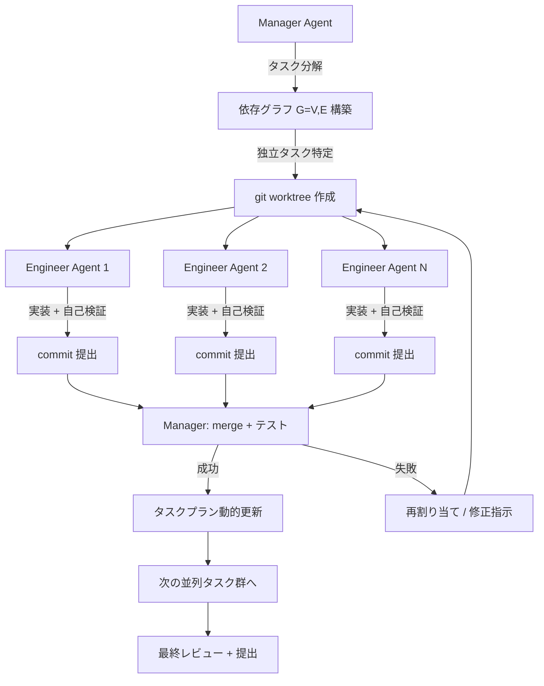

本記事は [Effective Strategies for Asynchronous Software Engineering Agents](https://arxiv.org/abs/2603.21489) の解説記事です。

この記事は [Zenn記事: Claude Code Hooks×Subagents×git worktreeで社内モノレポのコードレビューを並列化する](https://zenn.dev/0h_n0/articles/fd70a29e6b9d6d) の深掘りです。

## 論文概要（Abstract）

LLMベースのソフトウェアエンジニアリングエージェントは、GitHubのIssue解決などの単一タスクでは高い性能を示すようになったが、複数の相互依存するサブタスクを含む長期的（long-horizon）な開発タスクでは依然として課題がある。著者らは、ソフトウェアエンジニアリングの基本プリミティブ（git worktree、git merge、テストスイート）に基づくマルチエージェント協調フレームワーク「CAID（Centralized Asynchronous Isolated Delegation）」を提案している。CAIDは、中央のManagerエージェントが依存関係グラフに基づいてタスクを分解し、複数のEngineerエージェントが隔離されたgit worktreeで非同期に実装・検証を行う。論文の実験では、研究論文再現タスク（PaperBench）で最大25.6ポイント、Pythonライブラリ実装タスク（Commit0-Lite）で最大14.7ポイントの精度向上が報告されている。

## 情報源

- **arXiv ID**: 2603.21489
- **URL**: [https://arxiv.org/abs/2603.21489](https://arxiv.org/abs/2603.21489)
- **著者**: Jiayi Geng, Graham Neubig（Carnegie Mellon University）
- **発表年**: 2026（v1: 2026年3月23日、v2: 2026年7月8日）
- **分野**: cs.CL（計算言語学）, cs.AI（人工知能）
- **コード**: [https://github.com/JiayiGeng/CAID](https://github.com/JiayiGeng/CAID)

## 背景と動機（Background & Motivation）

単一のLLMエージェントに複雑なソフトウェア開発タスクを任せると、追加のイテレーションを重ねても性能が頭打ちになる問題がある。エージェントは過去の決定を再検討したり、修正済みのバグを再導入したりする傾向があり、直列的な処理のボトルネックが本質的に存在する。

マルチエージェントによる並列実行はこの問題への自然な解決策だが、複数のエージェントが同一のコードベースを同時に編集すると、あるエージェントが関数名を変更している間に別のエージェントが旧名で呼び出すといった破壊的な干渉が発生する。この「ワークスペース衝突」問題に対して、著者らはソフトウェアエンジニアリングの既存プラクティスであるgit worktreeによるブランチ分離を、マルチエージェント協調の基盤として採用している。

また、人間のソフトウェア開発チームが日常的に行っている「ブランチを切る → 並列で作業 → マージする」というワークフローをLLMエージェントに適用する際の具体的な設計選択肢と、その効果を体系的に検証した点が本研究の動機である。

## 主要な貢献（Key Contributions）

- **貢献1（SWEプリミティブの定式化）**: ソフトウェアエンジニアリングの3つの基本操作 -- Workspace Isolation（git worktree）、Structured Integration（git merge）、Executable Verification（テストスイート）-- をマルチエージェント協調の構成要素として定式化した
- **貢献2（CAIDフレームワーク）**: 上記プリミティブに基づく具体的なマルチエージェントアーキテクチャ「CAID」を設計・実装し、OpenHands上で動作する実装を公開した
- **貢献3（体系的なアブレーション）**: ワークスペース分離戦略（なし / ソフト分離 / worktree分離）、検証戦略（Manager検証 / Engineer自己検証 / 効率優先）、エンジニア数のスケーリングなど、多角的なアブレーション実験を通じて各設計選択の効果を定量的に評価した
- **貢献4（モデル非依存性の実証）**: Claude Sonnet 4.5、MiniMax 2.5、GLM 4.7の3モデルでCAIDの有効性を検証し、特定のモデルに依存しない汎用性を示した

## 技術的詳細（Technical Details）

### CAIDアーキテクチャ

CAIDは、1つのManagerエージェントと複数のEngineerエージェントで構成される。Managerがタスク全体を俯瞰し、Engineerが実際のコーディングを担当するという役割分離は、人間のテックリードとエンジニアの関係に対応する。



### タスク依存管理

Managerはタスクを有向非巡回グラフ（DAG）$G = (V, E)$としてモデル化する。

$$
G = (V, E), \quad V = \{v_1, v_2, \ldots, v_n\}, \quad E \subseteq V \times V
$$

ここで、
- $V$: 作業単位（サブタスク）の集合
- $E$: 依存関係の集合。$(v_i, v_j) \in E$は「$v_i$が完了しないと$v_j$を開始できない」ことを意味する
- $C_t$: 時刻$t$までに完了したタスクの集合

タスク$v_j$が実行可能（Ready）となる条件は以下で定義される。

$$
\text{Ready}_t(v_j) \iff \forall (v_i, v_j) \in E, \; v_i \in C_t
$$

この条件は、$v_j$の全ての先行タスクが完了していることを要求する。Managerは各ラウンドで$\text{Ready}_t$を満たすタスクを特定し、利用可能なEngineerエージェントに割り当てる。

### 非同期実行モデル

CAIDの非同期ループは以下の手順で進行する。

1. **探索フェーズ**: Managerがリポジトリ構造とタスク仕様を分析し、依存グラフ$G$を構築する
2. **Worktree作成**: Ready状態のタスクごとに、メインブランチから`git worktree add`で隔離されたワークスペースを作成する
3. **委任**: 各Engineerに対して、JSON構造化プロトコルでタスク仕様を送信する。仕様にはタスク説明、受け入れ条件、関連ファイルパスが含まれる
4. **並列実行**: 各Engineerが独立したworktreeで実装を行い、ローカルテストで自己検証した後、`git commit`で成果物を提出する
5. **統合**: Managerが各Engineerのブランチをメインブランチにマージし、テストスイートで統合検証を行う
6. **動的更新**: マージ結果に基づいてタスクプランを更新し、次のReady状態タスクを特定する
7. **最終レビュー**: 全タスク完了後、Managerが全体の整合性を確認して提出する

### 通信プロトコル

ManagerとEngineer間の通信はJSON構造化メッセージで行われる。これにより、自由形式の対話と比較して指示の曖昧さが低減される。

```python
from dataclasses import dataclass, field


@dataclass
class TaskAssignment:
    """ManagerからEngineerへのタスク割り当てメッセージ

    Attributes:
        task_id: タスクの一意識別子
        description: タスクの詳細説明
        acceptance_criteria: 受け入れ条件のリスト
        relevant_files: 関連するファイルパスのリスト
        dependencies_completed: 完了済み依存タスクのIDリスト
        worktree_path: 割り当てられたgit worktreeのパス
    """
    task_id: str
    description: str
    acceptance_criteria: list[str]
    relevant_files: list[str]
    dependencies_completed: list[str] = field(default_factory=list)
    worktree_path: str = ""


@dataclass
class TaskResult:
    """EngineerからManagerへのタスク完了報告

    Attributes:
        task_id: 完了したタスクのID
        status: 完了ステータス（success / failure / partial）
        commit_hash: 提出コミットのハッシュ
        test_results: テスト実行結果の要約
        notes: 実装時の注意点や問題点
    """
    task_id: str
    status: str  # "success" | "failure" | "partial"
    commit_hash: str
    test_results: dict[str, bool] = field(default_factory=dict)
    notes: str = ""
```

### 自己検証とマージ統合

CAIDでは2段階の検証メカニズムを採用している。

**Engineer自己検証**: 各Engineerは実装後にローカルでテストを実行し、パスしたことを確認してからcommitを提出する。これにより、明らかなバグがManagerに届く前にフィルタリングされる。

**Managerマージ検証**: Managerはマージ後にテストスイート全体を実行し、統合レベルのリグレッションを検出する。マージコンフリクトやテスト失敗が発生した場合、Managerはタスクプランを動的に更新し、修正タスクを新たに作成して再割り当てする。

### LLMSummarizingCondenser によるコンテキスト管理

長期的なタスクでは、エージェントのコンテキストウィンドウが会話履歴で飽和する問題がある。CAIDはOpenHandsのLLMSummarizingCondenserを活用し、古いイベントを要約してコンテキストを圧縮する。これにより、限られたコンテキストウィンドウ内で最も関連性の高い情報を保持しつつ、長期的なタスクの遂行を可能にしている。

## 実装のポイント（Implementation）

CAIDの実装はOpenHands（旧OpenDevin）プラットフォーム上に構築されており、Python 3.12+とDockerを要件とする。以下に実装時の重要なポイントを示す。

**git worktree分離の実装**: 各Engineerに対して`git worktree add`で独立したワーキングディレクトリを作成する。Dockerコンテナ内で実行される場合、各worktreeは独立したコンテナファイルシステム上に配置される。worktreeはメインブランチからの分岐点を共有するため、`.git`ディレクトリの重複を避けつつ完全な分離を実現する。

```bash
# Manager が各 Engineer 用の worktree を作成する例
git worktree add /workspace/engineer-1 -b task/implement-parser
git worktree add /workspace/engineer-2 -b task/implement-evaluator
git worktree add /workspace/engineer-3 -b task/implement-cli

# Engineer 完了後の Manager によるマージ
git checkout main
git merge task/implement-parser --no-ff
# テスト実行で統合検証
pytest tests/ -q
git merge task/implement-evaluator --no-ff
pytest tests/ -q
```

**エージェント数の選択**: 論文の実験では、Commit0-Liteで4エンジニア、PaperBenchで2エンジニアが最適と報告されている。タスクの粒度と依存関係の密度に応じて調整する必要がある。エンジニア数を増やしすぎると、タスク分解のオーバーヘッドと通信コストが増大し、逆効果になる場合がある。

**コンテキスト圧縮**: LLMSummarizingCondenserの圧縮率はタスクの複雑さに依存する。過度な圧縮は重要な文脈情報の喪失を招くため、圧縮パラメータのチューニングが必要である。

## Production Deployment Guide

### AWS実装パターン（コスト最適化重視）

CAIDフレームワークをAWS上で運用する場合の構成を、トラフィック量別に示す。CAIDはManagerとEngineerの2種類のエージェントを動的に起動・管理するため、コンテナオーケストレーションとAPIゲートウェイが主要コンポーネントとなる。

| 構成 | トラフィック | 月額概算 | 主要サービス |
|------|------------|---------|-------------|
| Small | ~100 req/日 | $100-250 | Lambda + Step Functions + Bedrock |
| Medium | ~1,000 req/日 | $500-1,200 | ECS Fargate + Bedrock + SQS |
| Large | 10,000+ req/日 | $3,000-7,000 | EKS + Spot + Bedrock Batch |

**Small構成（~100 req/日）**: Step Functionsが全体のワークフローを制御する。Managerロジック用Lambda関数がタスク分解と依存グラフ構築を担当し、各EngineerタスクをStep FunctionsのMap Stateで並列実行する。EngineerはLambda（最大15分タイムアウト）またはECS Fargate Spotタスク（長時間タスク用）で起動する。CodeCommitまたはCodeBuildでgit worktreeを管理し、Bedrockでモデル推論を行う。DynamoDBにタスク状態と依存グラフを保存する。月額内訳: Lambda $10-20、Step Functions $10-25、Bedrock $60-180、DynamoDB $5-10、ECS Fargate Spot $10-15。

**Medium構成（~1,000 req/日）**: ECS Fargate上でManager常駐プロセスを実行し、SQSキューを通じてEngineerタスクを配信する。各Engineerは独立したFargateタスクとして起動され、EFSマウントされたgit worktreeで作業する。Fargate Spotタスクを活用し、コンピューティングコストを最大70%削減する。ElastiCache（Redis）でタスクキューの状態と依存グラフをキャッシュする。月額内訳: ECS Fargate $100-300、SQS $5-15、Bedrock $300-700、ElastiCache $50-100、CloudWatch $30-60。

**Large構成（10,000+ req/日）**: EKS上でManagerとEngineerをPodとして運用する。KarpenterによるSpot Instance優先のオートスケーリングでEngineer Podを動的にスケールする。各Engineer Podにはgit worktree用のemptyDirまたはEBSボリュームがマウントされる。Bedrock Batch APIで非リアルタイム処理のコストを50%削減する。Istio Service Meshでエージェント間通信を管理する。月額内訳: EKS $75、EC2 Spot $800-2,000、Bedrock $1,500-4,000、EBS $100-300、監視 $150-300。

**コスト試算の注意事項**: 上記は2026年10月時点のAWS ap-northeast-1（東京）リージョン料金に基づく概算値である。実際のコストはタスクの複雑さ、モデル選択、エンジニア数、コンテキスト長により変動する。最新料金はAWS料金計算ツールで確認を推奨する。

### Terraformインフラコード

**Small構成（Serverless）: Lambda + Step Functions + Bedrock**

```hcl
# --- Small構成: CAIDマルチエージェント基盤 ---
# 2026-10時点のAWS ap-northeast-1向け

terraform {
  required_version = ">= 1.9"
  required_providers {
    aws = { source = "hashicorp/aws", version = "~> 5.70" }
  }
}

provider "aws" {
  region = "ap-northeast-1"
}

# --- IAMロール（最小権限） ---
resource "aws_iam_role" "caid_manager_lambda" {
  name = "caid-manager-lambda-role"
  assume_role_policy = jsonencode({
    Version = "2012-10-17"
    Statement = [{
      Action    = "sts:AssumeRole"
      Effect    = "Allow"
      Principal = { Service = "lambda.amazonaws.com" }
    }]
  })
}

resource "aws_iam_role_policy" "caid_manager_policy" {
  name = "caid-manager-policy"
  role = aws_iam_role.caid_manager_lambda.id
  policy = jsonencode({
    Version = "2012-10-17"
    Statement = [
      {
        # Bedrock InvokeModel（Manager/Engineer推論）
        Effect   = "Allow"
        Action   = ["bedrock:InvokeModel"]
        Resource = "arn:aws:bedrock:ap-northeast-1::foundation-model/*"
      },
      {
        # DynamoDB（タスク状態・依存グラフ管理）
        Effect = "Allow"
        Action = [
          "dynamodb:GetItem", "dynamodb:PutItem",
          "dynamodb:UpdateItem", "dynamodb:Query"
        ]
        Resource = aws_dynamodb_table.task_graph.arn
      },
      {
        # Step Functions（Engineerタスク並列起動）
        Effect   = "Allow"
        Action   = ["states:StartExecution", "states:DescribeExecution"]
        Resource = "*"
      },
      {
        # CloudWatch Logs
        Effect   = "Allow"
        Action   = ["logs:CreateLogGroup", "logs:CreateLogStream", "logs:PutLogEvents"]
        Resource = "arn:aws:logs:ap-northeast-1:*:*"
      }
    ]
  })
}

# --- DynamoDB（タスク依存グラフ + 状態管理） ---
resource "aws_dynamodb_table" "task_graph" {
  name         = "caid-task-graph"
  billing_mode = "PAY_PER_REQUEST"  # On-Demandでコスト最適化
  hash_key     = "session_id"
  range_key    = "task_id"

  attribute {
    name = "session_id"
    type = "S"
  }
  attribute {
    name = "task_id"
    type = "S"
  }

  ttl {
    attribute_name = "expires_at"
    enabled        = true  # 完了セッションの自動削除
  }

  server_side_encryption {
    enabled = true  # KMS暗号化
  }
}

# --- Lambda関数（Manager Agent） ---
resource "aws_lambda_function" "caid_manager" {
  function_name = "caid-manager"
  runtime       = "python3.12"
  handler       = "manager.lambda_handler"
  role          = aws_iam_role.caid_manager_lambda.arn
  timeout       = 900       # 15分（最大）
  memory_size   = 1024      # タスク分解・依存グラフ構築用

  filename         = "manager.zip"
  source_code_hash = filebase64sha256("manager.zip")

  environment {
    variables = {
      TASK_TABLE     = aws_dynamodb_table.task_graph.name
      MAX_ENGINEERS  = "4"
      MODEL_ID       = "anthropic.claude-sonnet-4-5-20260514-v1:0"
    }
  }

  tracing_config {
    mode = "Active"  # X-Ray有効化
  }
}

# --- CloudWatchアラーム（コスト・エラー監視） ---
resource "aws_cloudwatch_metric_alarm" "manager_errors" {
  alarm_name          = "caid-manager-errors"
  comparison_operator = "GreaterThanThreshold"
  evaluation_periods  = 2
  metric_name         = "Errors"
  namespace           = "AWS/Lambda"
  period              = 300
  statistic           = "Sum"
  threshold           = 3
  alarm_description   = "CAID Manager Lambda エラー検知"

  dimensions = {
    FunctionName = aws_lambda_function.caid_manager.function_name
  }
}
```

**Large構成（Container）: EKS + Karpenter + Spot**

```hcl
# --- Large構成: EKS + Karpenter（Spot優先）---

module "eks" {
  source  = "terraform-aws-modules/eks/aws"
  version = "~> 20.24"

  cluster_name    = "caid-multi-agent"
  cluster_version = "1.31"

  vpc_id     = module.vpc.vpc_id
  subnet_ids = module.vpc.private_subnets

  enable_irsa = true

  cluster_endpoint_public_access = false  # プライベートアクセスのみ
}

# --- Karpenter NodePool（Spot優先、コスト最適化） ---
resource "kubectl_manifest" "karpenter_nodepool" {
  yaml_body = yamlencode({
    apiVersion = "karpenter.sh/v1"
    kind       = "NodePool"
    metadata   = { name = "engineer-pool" }
    spec = {
      template = {
        spec = {
          requirements = [
            { key = "karpenter.sh/capacity-type", operator = "In",
              values = ["spot", "on-demand"] },
            { key = "node.kubernetes.io/instance-type", operator = "In",
              values = ["m7i.xlarge", "m7i.2xlarge", "c7i.xlarge", "c7i.2xlarge"] },
          ]
          nodeClassRef = { name = "default" }
        }
      }
      limits = { cpu = "256", memory = "1024Gi" }
      disruption = {
        consolidationPolicy = "WhenEmptyOrUnderutilized"
        consolidateAfter    = "60s"  # Engineer Pod終了後すぐにノード回収
      }
    }
  })
}

# --- AWS Budgets（予算アラート） ---
resource "aws_budgets_budget" "monthly" {
  name         = "caid-multi-agent-monthly"
  budget_type  = "COST"
  limit_amount = "7000"
  limit_unit   = "USD"
  time_unit    = "MONTHLY"

  notification {
    comparison_operator        = "GREATER_THAN"
    threshold                  = 80
    threshold_type             = "PERCENTAGE"
    notification_type          = "ACTUAL"
    subscriber_email_addresses = ["ops@example.com"]
  }
}
```

### 運用・監視設定

**CloudWatch Logs Insights クエリ（マルチエージェント監視）**:

```
# Engineer別のタスク完了率とマージ成功率
fields @timestamp, @message
| filter @message like /task_result/
| stats count() as total,
        sum(status = "success") as successes,
        sum(status = "failure") as failures,
        avg(duration_ms) as avg_duration
  by engineer_id, bin(1h)
| sort @timestamp desc
```

**CloudWatch アラーム設定（Python）**:

```python
import boto3


def create_caid_alarms(cluster_name: str, sns_topic_arn: str) -> None:
    """CAID マルチエージェント基盤用のCloudWatchアラームを作成する

    Args:
        cluster_name: EKSクラスタ名またはLambda関数プレフィックス
        sns_topic_arn: 通知先のSNSトピックARN
    """
    cw = boto3.client("cloudwatch", region_name="ap-northeast-1")

    # マージ失敗率アラーム（worktree統合の異常検知）
    cw.put_metric_alarm(
        AlarmName=f"{cluster_name}-merge-failure-rate",
        MetricName="MergeFailureRate",
        Namespace="CAID/MultiAgent",
        Statistic="Average",
        Period=300,
        EvaluationPeriods=3,
        Threshold=0.3,  # 30%以上のマージ失敗で発報
        ComparisonOperator="GreaterThanThreshold",
        AlarmActions=[sns_topic_arn],
    )

    # Bedrockトークン使用量スパイク検知
    cw.put_metric_alarm(
        AlarmName=f"{cluster_name}-bedrock-token-spike",
        MetricName="InputTokenCount",
        Namespace="AWS/Bedrock",
        Statistic="Sum",
        Period=3600,
        EvaluationPeriods=1,
        Threshold=5_000_000,  # 1時間で500万トークン超過
        ComparisonOperator="GreaterThanThreshold",
        AlarmActions=[sns_topic_arn],
    )
```

**X-Ray トレーシング設定（Python）**:

```python
from aws_xray_sdk.core import xray_recorder, patch_all


def setup_caid_tracing() -> None:
    """X-Rayトレーシングの初期化（Manager-Engineer間の呼び出しチェーン追跡）"""
    xray_recorder.configure(service="caid-multi-agent")
    patch_all()


@xray_recorder.capture("engineer_task_execution")
def execute_engineer_task(task: dict, worktree_path: str, session_id: str) -> dict:
    """X-Rayトレース付きEngineerタスク実行

    Args:
        task: タスク割り当て情報
        worktree_path: git worktreeのパス
        session_id: セッション識別子

    Returns:
        タスク実行結果メタデータ
    """
    subsegment = xray_recorder.current_subsegment()
    subsegment.put_annotation("session_id", session_id)
    subsegment.put_annotation("task_id", task["task_id"])
    subsegment.put_metadata("worktree_path", worktree_path)
    # Engineer実行ロジック（実装省略）
    return {"status": "success", "commit_hash": "abc123"}
```

**Cost Explorer自動レポート（Python）**:

```python
import boto3
from datetime import datetime, timedelta


def get_daily_caid_cost() -> dict:
    """CAID関連サービスの日次コストレポートを取得する

    Returns:
        サービス別コスト辞書
    """
    ce = boto3.client("ce", region_name="us-east-1")
    today = datetime.utcnow().date()
    yesterday = today - timedelta(days=1)

    response = ce.get_cost_and_usage(
        TimePeriod={"Start": str(yesterday), "End": str(today)},
        Granularity="DAILY",
        Metrics=["UnblendedCost"],
        Filter={
            "Or": [
                {"Dimensions": {"Key": "SERVICE", "Values": ["Amazon Bedrock"]}},
                {"Dimensions": {"Key": "SERVICE", "Values": ["AWS Lambda"]}},
                {"Dimensions": {"Key": "SERVICE", "Values": ["Amazon Elastic Kubernetes Service"]}},
                {"Dimensions": {"Key": "SERVICE", "Values": ["AWS Step Functions"]}},
            ]
        },
        GroupBy=[{"Type": "DIMENSION", "Key": "SERVICE"}],
    )
    costs: dict[str, float] = {}
    for group in response["ResultsByTime"][0]["Groups"]:
        service = group["Keys"][0]
        amount = float(group["Metrics"]["UnblendedCost"]["Amount"])
        costs[service] = amount

    total = sum(costs.values())
    if total > 100.0:
        sns = boto3.client("sns", region_name="ap-northeast-1")
        sns.publish(
            TopicArn="arn:aws:sns:ap-northeast-1:123456789012:cost-alert",
            Subject="CAID daily cost exceeded $100",
            Message=f"Total: ${total:.2f}\nBreakdown: {costs}",
        )
    return costs
```

### コスト最適化チェックリスト

**アーキテクチャ選択**:
- [ ] トラフィック量で構成を判断（~100/日: Serverless、~1,000/日: Hybrid、10,000+/日: Container）
- [ ] Engineer数をタスクの並列度に応じて動的調整（過剰なエージェント起動を防止）

**リソース最適化**:
- [ ] EC2/EKS: Spot Instances優先（最大90%削減）
- [ ] Reserved Instances: 常駐Managerプロセス用に1年コミットで最大72%削減
- [ ] Savings Plans: コンピューティング使用量に対する割引
- [ ] Lambda: メモリサイズ最適化（Manager: 1024MB、Engineer: 512MB推奨）
- [ ] ECS/EKS: Engineer Pod終了後の即座なノード回収（Karpenter consolidation）
- [ ] EBS: git worktree用ボリュームのライフサイクル管理（タスク完了後に削除）

**LLMコスト削減**:
- [ ] Bedrock Prompt Caching有効化（システムプロンプトのキャッシュ）
- [ ] Bedrock Batch API使用（非リアルタイム処理で50%削減）
- [ ] モデル選択ロジック（Manager: 高性能モデル、Engineer: コスト効率モデルの使い分け）
- [ ] トークン数制限（Engineer への指示を簡潔に、不要な文脈を除去）
- [ ] LLMSummarizingCondenser によるコンテキスト圧縮の活用

**監視・アラート**:
- [ ] AWS Budgets設定（月次予算上限、80%到達で通知）
- [ ] CloudWatch アラーム（マージ失敗率、Lambda/EKS実行時間、Bedrockトークン使用量）
- [ ] Cost Anomaly Detection有効化
- [ ] 日次コストレポート自動送信（Bedrock、Lambda、EKS、Step Functions別）
- [ ] Engineer別のタスク完了率・実行時間のカスタムメトリクス

**リソース管理**:
- [ ] 未使用リソース削除（孤立worktree、停止中Fargateタスク、未回収EBSボリューム）
- [ ] タグ戦略（`Project: caid`, `Role: manager/engineer`, `Environment: prod/dev`）
- [ ] DynamoDB TTLによる完了セッションの自動削除
- [ ] 開発環境の夜間停止（EKSノード数0、Step Functions無効化）
- [ ] CloudWatch Logsの保存期間設定（30日推奨）

## 実験結果（Results）

### Commit0-Lite（Pythonライブラリ実装）

著者らはCommit0-Liteベンチマーク（Pythonライブラリのスクラッチ実装、pytestによる評価）で、3モデルにおけるCAIDの効果を検証している（論文Table 1相当）。

| モデル | Single-Agent | CAID（4 Engineers） | 改善幅 |
|-------|-------------|-------------------|--------|
| Claude Sonnet 4.5 | 53.1% | 59.1% | +6.0pp |
| MiniMax 2.5 | 42.3% | 57.0% | +14.7pp |
| GLM 4.7 | 42.9% | 46.5% | +3.6pp |

全モデルで一貫した改善が見られるが、改善幅はモデルによって異なる。著者らは、MiniMax 2.5での大幅な改善（+14.7pp）について、単一エージェントの性能が低いモデルほどタスク分解と並列化の恩恵が大きいと分析している。

### PaperBench（研究論文再現）

PaperBenchベンチマーク（研究論文のコード再現、LLMベース評価）での結果は以下の通りである（論文Table 1相当）。

| モデル | Single-Agent | CAID（2 Engineers） | 改善幅 |
|-------|-------------|-------------------|--------|
| Claude Sonnet 4.5 | 57.2% | 63.3% | +6.1pp |
| MiniMax 2.5 | 10.5% | 36.1% | +25.6pp |
| GLM 4.7 | 38.0% | 45.4% | +7.4pp |

MiniMax 2.5ではSingle-Agentの10.5%からCAIDの36.1%へと25.6ポイントの大幅な向上が報告されている。これは、複雑な論文再現タスクにおいて、単一エージェントでは実質的に機能しないモデルでも、適切なタスク分解と並列実行により実用的な水準に到達できることを示唆している。

### ワークスペース分離戦略の比較

著者らは3つの分離戦略を比較するアブレーション実験を実施している（論文Table 2相当）。

| アプローチ | PaperBench | Commit0 |
|----------|-----------|---------|
| Single-Agent | 57.2% | 53.1% |
| Soft Isolation（共有ワークスペース） | 55.5% | 56.1% |
| Worktree Isolation（CAID） | 63.3% | 59.1% |

Soft Isolation（ファイルレベルの分担指示のみで物理的な分離なし）では、PaperBenchでSingle-Agentを下回る55.5%に低下している。これは、共有ワークスペースでの破壊的な編集干渉（関数リネームの衝突、同一ファイルへの同時書き込み等）が原因であると著者らは分析している。git worktreeによる物理的な分離がマルチエージェント協調の成否を決定する要因であることを示す結果である。

### 検証戦略の比較

著者らは3つの検証戦略の効果も比較している（論文Table 3相当）。

| 検証戦略 | Pass Rate | 実行時間 |
|---------|-----------|---------|
| Round-Manager Review | 60.2% | 3689.1秒 |
| Engineer Self-Verification | 55.1% | 2243.9秒 |
| Efficiency-Prioritized | 54.0% | 1908.6秒 |

Round-Manager Review（Managerが各ラウンドで全Engineerの成果物をレビュー）が最高精度だが、実行時間が約1.9倍に増加する。著者らは、精度と効率のトレードオフに基づいて検証戦略を選択すべきと提言している。

## 実運用への応用（Practical Applications）

### Zenn記事との関連

関連Zenn記事「[Claude Code Hooks×Subagents×git worktreeで社内モノレポのコードレビューを並列化する](https://zenn.dev/0h_n0/articles/fd70a29e6b9d6d)」では、Claude CodeのHooksとSubagents機能を活用し、git worktreeで複数のレビューエージェントを並列実行するアプローチを紹介している。本論文のCAIDフレームワークは、このZenn記事の手法に対して理論的・実験的な裏付けを提供するものである。

具体的には、以下の対応関係がある。

- **CAID Manager Agent** -- Zenn記事のメインClaude Codeプロセス（レビュータスクの分配役）
- **CAID Engineer Agents** -- Zenn記事のSubagents（各worktreeで独立にレビューを実行）
- **Worktree Isolation** -- 両者とも`git worktree`による物理的なワークスペース分離を採用
- **Structured Integration** -- CAID のgit merge -- Zenn記事のレビュー結果統合

CAIDの実験結果が示すように、Soft Isolation（共有ワークスペース）はWorktree Isolationに対してPaperBenchで7.8ポイント劣る。この知見は、Zenn記事で採用しているgit worktreeベースの分離戦略の有効性を定量的に支持している。

### モノレポでのスケーリング

CAIDのタスク依存グラフ（DAG）による管理は、モノレポ内の複数パッケージにまたがるコードレビューに応用できる。パッケージ間の依存関係をDAGとして表現し、独立なパッケージのレビューを並列化することで、レビューのスループットを向上させることが期待される。ただし、論文で報告されているように、マルチエージェント実行はAPIコストの増加を伴うため、コスト対効果の事前評価が必要である。

## 関連研究（Related Work）

- **Commit0（Zhao et al., 2024, arXiv:2412.01769）**: Pythonライブラリをスクラッチから実装するベンチマーク。54のPythonライブラリをpytestで評価する。CAIDはこのベンチマークのLite版（Commit0-Lite）で評価を行っている
- **PaperBench（OpenAI, 2025, arXiv:2504.01848）**: ICML 2024のSpotlight/Oral論文20本の再現を評価するベンチマーク。8,316のサブタスクに分解された階層的ルーブリックで評価する。CAIDはこのベンチマークで最大25.6ポイントの改善を達成した
- **Coordination Mode as First-Class Citizen（Ren et al., 2026, arXiv:2607.27877）**: マルチエージェントコーディングにおける10種類の組織トポロジーを比較した実証研究。組織トポロジーがモデル能力と同等に速度・コスト・品質のトレードオフに影響することを示しており、CAIDの中央集権型トポロジーを相対化する研究として位置づけられる
- **OpenHands（Wang et al., 2025）**: CAIDの実装基盤であるオープンソースのSWEエージェントプラットフォーム。CodeActエージェントによるコード実行・テスト・修正の自動化を提供する

## まとめと今後の展望

本論文は、ソフトウェアエンジニアリングの基本プリミティブ（git worktree、git merge、テストスイート）に基づくマルチエージェント協調フレームワークCAIDを提案し、Commit0-LiteとPaperBenchの2ベンチマークで一貫した精度向上を実証した。特に、git worktreeによるワークスペースの物理的分離が、マルチエージェント協調の成否を分ける決定的要因であることをアブレーション実験で明確に示した点が重要である。

一方で、著者らはCAIDの制約として、逐次的なmergeとtest-gatingによるエンドツーエンド高速化の限界、Managerのタスク分解がプロンプトエンジニアリングに依存する点、マルチエージェント実行に伴うAPIコスト増加を挙げている。今後の研究方向としては、SWEドメイン以外への汎化、動的なエンジニア数調整、マージコンフリクトの自動解決の高度化が考えられる。

## 参考文献

- **arXiv**: [https://arxiv.org/abs/2603.21489](https://arxiv.org/abs/2603.21489)
- **Code**: [https://github.com/JiayiGeng/CAID](https://github.com/JiayiGeng/CAID)
- **OpenHands Blog**: [https://www.openhands.dev/blog/asynchronous-software-engineering-agents](https://www.openhands.dev/blog/asynchronous-software-engineering-agents)
- **Related Zenn article**: [https://zenn.dev/0h_n0/articles/fd70a29e6b9d6d](https://zenn.dev/0h_n0/articles/fd70a29e6b9d6d)
