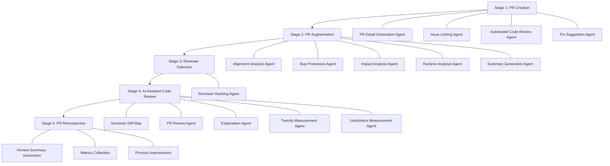

## 論文概要（Abstract）

本記事は [https://arxiv.org/abs/2605.17548](https://arxiv.org/abs/2605.17548) の解説記事です。

AIコーディングアシスタントがコード生産を加速させる一方で、コードレビューがボトルネックになりつつある現状に対し、著者らは5段階のエージェンティック・コードレビュー・フレームワークを提案している。このフレームワークはPR作成からレトロスペクティブまでの全ワークフローを対象とし、レビュアーの役割を「手動でコードを検査する者」から「エージェント群を監督するオペレータ」へと移行させるビジョンを描く。個別タスクの自動化ではなく、ステージ間でコンテキストを引き継ぐ統合的なアプローチを採用している点が特徴である。

この記事は [Zenn記事: Claude Code Hooks×Subagents×git worktreeで社内モノレポのコードレビューを並列化する](https://zenn.dev/0h_n0/articles/fd70a29e6b9d6d) の深掘りです。

## 情報源

- **arXiv ID**: 2605.17548
- **URL**: [https://arxiv.org/abs/2605.17548](https://arxiv.org/abs/2605.17548)
- **著者**: Kamali, H.O., Tuna, E., Haratian, V., Tuzun, E.
- **発表年**: 2026年
- **分野**: cs.SE, cs.AI
- **発表会議**: ICSE-JAWs 2026（Rio de Janeiro）、ACM TOSEM投稿中

## 背景と動機（Background & Motivation）

2025年時点で開発者の84%がAIを開発プロセスに使用し、生成コードの約41%がAIによるものだとする調査がある。AIコーディングアシスタントの普及によりコード生産の速度は向上したが、レビュー側の処理能力は追いついていない。AIツールを使う開発者はPRマージ数が98%増加する一方、PRレビュー時間は91%増加したという報告もある。

著者らはこの非対称性を「生産とレビューのギャップ」として問題提起している。従来のAIコードレビュー研究は、コメント生成やバグ検出など個別タスクの自動化に注力してきた。しかし、PR作成からマージ後の振り返りまでの全プロセスを統合的にカバーするフレームワークは提案されていなかった。本論文は、コードレビューの全ライフサイクルを対象とするエージェンティックなアプローチを初めて体系化したビジョン論文である。

## 主要な貢献（Key Contributions）

- **5段階エージェンティック・コードレビュー・フレームワーク**: PR Creation、PR Augmentation、Reviewer Selection、AI-Assisted Code Review、PR Retrospectiveの5ステージを定義し、各ステージに専門化されたエージェント群を配置
- **Human-AI協調モデル**: レビュアーを「手動検査者」から「エージェント監督オペレータ」へ再定義。全ステージにヒューマン判断ゲートを設置し、自律的パッチ適用を禁止するガバナンス設計
- **Semantic Diff-Map**: コード変更を逐次的なdiffではなく、関数・クラス単位の論理的変更として整理する概念を提案
- **ガバナンスとリスク軽減戦略**: ハルシネーション対策（ソースコードへのアンカリング）、Automation Bias Prevention（必須ヒューマン検証ゲート）、マルチエージェントのエラー蓄積への対処を明示

## 技術的詳細（Technical Details）

### 5段階パイプラインの全体像

著者らが提案するフレームワークは、PRのライフサイクルを5段階に分割し、各段階に専門エージェントを配置する。以下のダイアグラムで全体像を示す。



### Stage 1: PR Creation — 著者支援と初期品質保証

Stage 1では4つのエージェントがPR作成を支援する。

**PR Detail Generation Agent** は、diffからPRのタイトルと説明を自動生成する。著者はこの出力に対して自然言語で対話的に修正を加えることができる。単なるテンプレート埋めではなく、変更の意図と影響を構造化して記述する点がポイントである。

**Issue Linking Agent** は、RAG（Retrieval-Augmented Generation）を用いて既存のIssueリポジトリから関連Issueを検索する。類似度が閾値を超えるIssueが見つからない場合は、新規Issueの作成を提案する。著者らはこのエージェントにより、PRとIssueの整合性を事前に確保できると述べている。

**Automated Code Review Agent** は、構文エラー、スタイル違反、セキュリティポリシー違反などを検出し、コード内の具体的な位置に紐付けたフィードバックを生成する。従来のリンター・SAST（Static Application Security Testing）ツールとの違いは、LLMによるコンテキスト理解を活用して、単純なパターンマッチでは検出できない意味的な問題も捕捉する点にある。

**Fix Suggestion Agent** は、検出された問題に対する具体的なパッチを生成する。「何を変更し、何を残すか」を明示することで、著者が変更の意図を理解した上で承認・拒否の判断を行える設計になっている。

Stage 1の最後には**Interactive Revision**と呼ばれる必須ヒューマンゲートが配置される。著者がエージェント群の全出力を自然言語対話で検証し、承認して初めてStage 2に進む。

### Stage 2: PR Augmentation — 並列分析エージェント群

Stage 2は5つの分析エージェントが**並列に動作**し、PRにメタデータを付与する段階である。

**Alignment Analysis Agent** は、PR-Issue間の整合性を4つのカテゴリに分類する。

$$
\text{Alignment} \in \{\text{exact},\ \text{tangling},\ \text{missing},\ \text{missing-and-tangling}\}
$$

ここで、
- $\text{exact}$: PRが対応するIssueの要件を過不足なく実装している
- $\text{tangling}$: PRに対応Issue以外の変更が混入している
- $\text{missing}$: PRが対応Issueの要件を部分的にしか実装していない
- $\text{missing-and-tangling}$: 上記2つが同時に発生している

この分類により、レビュアーは「このPRで本当に見るべき変更はどこか」を迅速に判断できる。

**Bug Proneness Analysis Agent** は、歴史的な欠陥密度、コードチャーン（変更頻度）、ホットスポット分析を組み合わせてリスクスコアを算出する。著者らは具体的なスコアリング関数の定義は示していないが、リポジトリの変更履歴から統計的にリスクの高いファイル・モジュールを特定する手法を想定している。

**Impact Analysis Agent** は、モジュール横断の依存関係とAPI影響を評価する。変更が他のモジュールに波及する範囲を静的解析で特定し、レビュアーが確認すべきスコープを明示する。

**Runtime Analysis Agent** は、サンドボックス環境でコードを実行し、実行ログとトレースを収集する。テストの実行結果だけでなく、実行時の振る舞い（メモリ使用量、例外発生パターンなど）を分析対象とする。

**Summary Generation Agent** は、上記4エージェントの分析結果を統合し、検証可能なクレーム付きの構造化サマリを生成する。「検証可能なクレーム」とは、ソースコード内の具体的な位置にアンカリングされた主張であり、レビュアーが直接確認できる形で提示される。

### Stage 3: Reviewer Selection — 定量的レビュアー推薦

Stage 3では、以下の定量的要因に基づいてレビュアー候補をランキングする。

- **専門性**: 変更対象のコード領域に関する過去のコミット・レビュー実績
- **コード親和性**: 該当ファイル・モジュールへの過去の関与度
- **ワークロード**: 現在のレビュー割り当て状況
- **過去の経験**: 類似パターンの変更に対するレビュー品質の実績

PR著者が推薦リストから最終的にレビュアーを選択する設計であり、完全自動割り当てではない。

### Stage 4: AI-Assisted Code Review — Semantic Diff-MapとReview Agent

Stage 4が本フレームワークの核心である。

**Semantic Diff-Map** は、著者らが提案する概念で、コード変更を逐次的な行差分（line-by-line diff）ではなく、関数・クラス・モジュール単位の論理的変更として整理する。従来のUnified Diffでは、コードの移動が「削除+追加」として表示され、実際に変更された1行が大量の移動ノイズに埋もれる問題があった。Semantic Diff-Mapはこの問題に対処し、レビュアーが論理的な変更単位でコードを理解できるようにする。

**PR Review Agent** は、複数の専門化エージェントをオーケストレーションする上位エージェントである。セキュリティ、パフォーマンス、正確性などの観点ごとに専門エージェントを呼び出し、結果を統合する。

**Explanation Agent** は、レビュアーからの質問にリアルタイムで回答する対話型エージェントである。コードの意図や変更理由について、ソースコードと変更履歴に基づいた説明を生成する。

**Toxicity Measurement Agent** と **Usefulness Measurement Agent** は、レビューコメント自体の品質を評価する。前者はレビューのトーンを評価し、攻撃的・非建設的なコメントを検出する。後者は表面的な指摘（bikeshedding -- 例: 変数名やインデントの好みに関する議論）を識別し、レビュアーがより重要な問題に集中できるよう支援する。

### Stage 5: PR Retrospective — 組織学習のための記録

Stage 5はPRマージ後の振り返りを自動化する。

**Review Summary Generation** は、レビューの詳細と実装サマリをリポジトリメモリに記録する。この蓄積されたメモリは、将来のStage 2（Bug Proneness Analysis）やStage 3（Reviewer Selection）の精度向上に活用される。

**Metrics Collection** は、ワークフロー全体の社会技術的データ（レビュー時間、往復回数、解決された問題の種類など）を収集する。

**Process Improvement** は、収集されたメトリクスに基づいて、PRライフサイクル全体の改善提案を行う。

## 実装のポイント（Implementation）

本論文はビジョン論文であり、具体的な実装やベンチマーク結果は含まれていない。ただし、著者らはエージェント群の設計において以下の実装上の留意点を議論している。

**エージェント出力のアンカリング**: 全てのエージェント出力はソースコード内の具体的な位置（ファイル名、行番号、関数名）に紐付ける必要がある。これにより、ハルシネーション（根拠のない指摘の生成）のリスクを軽減し、レビュアーが即座に検証可能な形で情報を提示する。

**並列実行アーキテクチャ**: Stage 2の5つの分析エージェントは相互に独立しており、並列実行が可能である。ただし、著者らは並列実行時のエラー蓄積リスクを指摘している。1つのエージェントの誤った出力が後段のエージェント（例: Summary Generation Agent）に伝播する可能性があるため、各エージェントの出力に信頼度スコアを付与する仕組みが必要になる。

**ヒューマンゲートの配置**: Stage 1のInteractive Revision、Stage 3のレビュアー選択、Stage 4のレビュー承認の3箇所に必須のヒューマンゲートが設置されている。著者らは、これらのゲートを省略して完全自動化することは推奨していない。Automation Bias（AIの出力を無批判に受け入れる傾向）を防ぐため、人間が判断を介在させるポイントを明確に定義している。

## Production Deployment Guide

本論文はビジョン論文であるが、各エージェントの役割と相互作用が詳細に定義されているため、AWS上でマルチエージェント・コードレビューシステムを構築する際の参考構成を示す。以下は論文のフレームワークを実装する場合の設計パターンである。

### AWS実装パターン（コスト最適化重視）

論文の5段階フレームワークをAWS上に実装する場合、トラフィック量（1日あたりのPR数）に応じて3つの構成を推奨する。コスト試算は2026年10月時点のap-northeast-1（東京）リージョン料金に基づく概算値であり、実際のコストはPRサイズ、エージェント呼び出し回数、LLMトークン消費量により変動する。最新料金はAWS料金計算ツールで確認を推奨する。

**Small構成（~10 PR/日）: Serverless** -- 月額$200-500

| サービス | 用途 | 月額概算 |
|---------|------|---------|
| Lambda | エージェントオーケストレータ、各分析エージェント | $5-15 |
| Step Functions | 5段階パイプライン制御 | $10-25 |
| Bedrock (Claude Sonnet) | LLM推論（PR分析・コメント生成） | $150-350 |
| DynamoDB | リポジトリメモリ（Stage 5）、メトリクス | $5-15 |
| SQS | エージェント間メッセージング | $1-5 |
| CloudWatch | ログ・監視 | $10-20 |

**Medium構成（~50 PR/日）: Hybrid** -- 月額$800-2,000

| サービス | 用途 | 月額概算 |
|---------|------|---------|
| ECS Fargate | エージェントオーケストレータ（常駐） | $80-150 |
| Lambda | 個別分析エージェント（並列実行） | $20-50 |
| Step Functions | パイプライン制御 | $25-60 |
| Bedrock (Claude Sonnet) | LLM推論 | $500-1,200 |
| ElastiCache (Redis) | Semantic Diff-Mapキャッシュ | $50-100 |
| DynamoDB | リポジトリメモリ | $15-40 |
| CloudWatch | ログ・監視・アラーム | $20-40 |

**Large構成（200+ PR/日）: Container** -- 月額$3,000-8,000

| サービス | 用途 | 月額概算 |
|---------|------|---------|
| EKS + Karpenter | エージェント群のコンテナオーケストレーション | $300-600 |
| Spot Instances (m6i.xlarge) | 分析エージェント実行ノード | $100-300 |
| Bedrock (Claude Sonnet) | LLM推論 | $2,000-5,500 |
| ElastiCache (Redis Cluster) | Semantic Diff-Map・メトリクスキャッシュ | $150-300 |
| Aurora Serverless v2 | リポジトリメモリ・履歴データ | $100-250 |
| OpenSearch Serverless | Issue検索（Stage 1 RAG） | $200-400 |
| CloudWatch + X-Ray | 監視・トレーシング | $50-100 |

**コスト削減テクニック**:
- Bedrock Batch APIの利用: 非同期分析（Stage 2, 5）をバッチ処理化し、推論コストを50%削減
- Prompt Caching: 同一リポジトリの繰り返し分析でキャッシュを活用し、30-90%のトークンコスト削減
- Spot Instances: Stage 2の並列分析ノードをSpotで実行し、最大90%のコンピューティングコスト削減
- Reserved Instances: EKSワーカーノードの常駐分を1年コミットで最大72%削減

### Terraformインフラコード

**Small構成（Serverless）**: Step Functions + Lambda + DynamoDB

```hcl
# --- Provider & Variables ---
terraform {
  required_version = ">= 1.9"
  required_providers {
    aws = { source = "hashicorp/aws", version = "~> 5.70" }
  }
}

variable "project" { default = "agentic-cr" }
variable "env"     { default = "prod" }

# --- IAM Role for Lambda ---
resource "aws_iam_role" "agent_lambda" {
  name = "${var.project}-agent-lambda-${var.env}"
  assume_role_policy = jsonencode({
    Version = "2012-10-17"
    Statement = [{
      Action = "sts:AssumeRole"
      Effect = "Allow"
      Principal = { Service = "lambda.amazonaws.com" }
    }]
  })
}

resource "aws_iam_role_policy" "agent_lambda" {
  name = "${var.project}-agent-lambda-policy"
  role = aws_iam_role.agent_lambda.id
  policy = jsonencode({
    Version = "2012-10-17"
    Statement = [
      {
        # Bedrock invoke (最小権限: 特定モデルのみ)
        Effect   = "Allow"
        Action   = ["bedrock:InvokeModel"]
        Resource = "arn:aws:bedrock:ap-northeast-1::foundation-model/anthropic.claude-sonnet-*"
      },
      {
        # DynamoDB (リポジトリメモリ読み書き)
        Effect   = "Allow"
        Action   = ["dynamodb:GetItem", "dynamodb:PutItem", "dynamodb:Query", "dynamodb:UpdateItem"]
        Resource = aws_dynamodb_table.repo_memory.arn
      },
      {
        # CloudWatch Logs
        Effect   = "Allow"
        Action   = ["logs:CreateLogGroup", "logs:CreateLogStream", "logs:PutLogEvents"]
        Resource = "arn:aws:logs:*:*:*"
      }
    ]
  })
}

# --- Lambda: Agent Orchestrator ---
resource "aws_lambda_function" "orchestrator" {
  function_name = "${var.project}-orchestrator-${var.env}"
  role          = aws_iam_role.agent_lambda.arn
  handler       = "orchestrator.handler"
  runtime       = "python3.12"
  timeout       = 300           # Stage 1-2 の処理に十分な時間
  memory_size   = 512           # コスト最適化: 512MB で十分
  filename      = "lambda/orchestrator.zip"

  environment {
    variables = {
      REPO_MEMORY_TABLE = aws_dynamodb_table.repo_memory.name
      BEDROCK_MODEL_ID  = "anthropic.claude-sonnet-4-6-20260610"
    }
  }

  tracing_config {
    mode = "Active"  # X-Ray トレーシング有効
  }
}

# --- DynamoDB: Repository Memory (Stage 5) ---
resource "aws_dynamodb_table" "repo_memory" {
  name         = "${var.project}-repo-memory-${var.env}"
  billing_mode = "PAY_PER_REQUEST"  # On-Demand でコスト最適化
  hash_key     = "repo_id"
  range_key    = "pr_id"

  attribute {
    name = "repo_id"
    type = "S"
  }
  attribute {
    name = "pr_id"
    type = "S"
  }

  # KMS暗号化
  server_side_encryption {
    enabled = true
  }

  point_in_time_recovery {
    enabled = true
  }
}

# --- CloudWatch Alarm: Bedrock Token Usage Spike ---
resource "aws_cloudwatch_metric_alarm" "bedrock_token_spike" {
  alarm_name          = "${var.project}-bedrock-token-spike"
  comparison_operator = "GreaterThanThreshold"
  evaluation_periods  = 2
  metric_name         = "InputTokenCount"
  namespace           = "AWS/Bedrock"
  period              = 3600  # 1時間
  statistic           = "Sum"
  threshold           = 500000  # 50万トークン/時間
  alarm_description   = "Bedrock input token usage exceeds 500K/hour"
  alarm_actions       = []  # SNS topic ARN を設定
}
```

**Large構成（Container）**: EKS + Karpenter + Spot

```hcl
# --- EKS Cluster ---
module "eks" {
  source  = "terraform-aws-modules/eks/aws"
  version = "~> 20.31"

  cluster_name    = "${var.project}-cluster-${var.env}"
  cluster_version = "1.31"

  vpc_id     = module.vpc.vpc_id
  subnet_ids = module.vpc.private_subnets

  # コスト最適化: Fargate プロファイルでコントロールプレーンのみ
  cluster_endpoint_public_access = false

  eks_managed_node_groups = {
    # 常駐ノード (Orchestrator, Redis等)
    baseline = {
      instance_types = ["m6i.large"]
      min_size       = 1
      max_size       = 3
      desired_size   = 2
      capacity_type  = "ON_DEMAND"
    }
  }
}

# --- Karpenter: Spot優先の分析エージェントノード ---
resource "kubectl_manifest" "karpenter_nodepool" {
  yaml_body = yamlencode({
    apiVersion = "karpenter.sh/v1"
    kind       = "NodePool"
    metadata   = { name = "analysis-agents" }
    spec = {
      template = {
        spec = {
          requirements = [
            { key = "karpenter.sh/capacity-type", operator = "In", values = ["spot", "on-demand"] },
            { key = "node.kubernetes.io/instance-type", operator = "In",
              values = ["m6i.xlarge", "m6i.2xlarge", "m7i.xlarge", "m7i.2xlarge"] },
          ]
          nodeClassRef = { group = "karpenter.k8s.aws", kind = "EC2NodeClass", name = "default" }
        }
      }
      limits   = { cpu = "64", memory = "256Gi" }
      disruption = {
        consolidationPolicy = "WhenEmptyOrUnderutilized"
        consolidateAfter    = "30s"
      }
    }
  })
}

# --- AWS Budgets: 月額コストアラート ---
resource "aws_budgets_budget" "monthly" {
  name         = "${var.project}-monthly-budget"
  budget_type  = "COST"
  limit_amount = "5000"
  limit_unit   = "USD"
  time_unit    = "MONTHLY"

  notification {
    comparison_operator       = "GREATER_THAN"
    threshold                 = 80
    threshold_type            = "PERCENTAGE"
    notification_type         = "ACTUAL"
    subscriber_email_addresses = ["team-lead@example.com"]
  }
}
```

### 運用・監視設定

**CloudWatch Logs Insights: エージェント実行コスト分析**

```
# 1時間あたりのエージェント別トークン消費量
fields @timestamp, agent_name, input_tokens, output_tokens
| filter @logGroup like /agentic-cr/
| stats sum(input_tokens) as total_input,
        sum(output_tokens) as total_output,
        count(*) as invocations
  by bin(1h), agent_name
| sort total_input desc
```

**CloudWatch Logs Insights: レイテンシ分析**

```
# Stage 別 P95 / P99 レイテンシ
fields @timestamp, stage, duration_ms
| filter @logGroup like /agentic-cr/
| stats percentile(duration_ms, 95) as p95,
        percentile(duration_ms, 99) as p99,
        avg(duration_ms) as avg_ms
  by stage
| sort p95 desc
```

**CloudWatch Alarm: Lambda実行時間異常検知（Python）**

```python
import boto3

cloudwatch = boto3.client("cloudwatch", region_name="ap-northeast-1")

cloudwatch.put_metric_alarm(
    AlarmName="agentic-cr-lambda-duration-anomaly",
    ComparisonOperator="GreaterThanThreshold",
    EvaluationPeriods=3,
    MetricName="Duration",
    Namespace="AWS/Lambda",
    Period=300,  # 5分
    Statistic="p99",
    Threshold=280000,  # 280秒 (Lambda上限300秒の93%)
    AlarmDescription="Agent Lambda P99 duration approaching timeout",
    Dimensions=[
        {"Name": "FunctionName", "Value": "agentic-cr-orchestrator-prod"},
    ],
    AlarmActions=["arn:aws:sns:ap-northeast-1:123456789012:agentic-cr-alerts"],
)
```

**X-Ray トレーシング設定（Python）**

```python
from aws_xray_sdk.core import xray_recorder, patch_all
import boto3

# boto3 自動計装
patch_all()

xray_recorder.configure(service="agentic-cr-orchestrator")

def invoke_analysis_agent(agent_name: str, pr_data: dict) -> dict:
    """Stage 2 分析エージェントの呼び出し（X-Ray サブセグメント付き）"""
    with xray_recorder.in_subsegment(agent_name) as subseg:
        subseg.put_annotation("agent_name", agent_name)
        subseg.put_annotation("pr_number", pr_data["pr_number"])
        subseg.put_metadata("pr_files", pr_data.get("changed_files", []))

        bedrock = boto3.client("bedrock-runtime")
        response = bedrock.invoke_model(
            modelId="anthropic.claude-sonnet-4-6-20260610",
            body=build_agent_prompt(agent_name, pr_data),
        )

        subseg.put_metadata("token_usage", {
            "input": response["usage"]["input_tokens"],
            "output": response["usage"]["output_tokens"],
        })
        return response
```

**Cost Explorer 日次レポート（Python）**

```python
import boto3
from datetime import datetime, timedelta

ce = boto3.client("ce", region_name="us-east-1")
sns = boto3.client("sns", region_name="ap-northeast-1")

DAILY_THRESHOLD_USD = 100

def daily_cost_report() -> dict:
    """日次コストレポートを取得し、閾値超過時にSNS通知"""
    today = datetime.utcnow().strftime("%Y-%m-%d")
    yesterday = (datetime.utcnow() - timedelta(days=1)).strftime("%Y-%m-%d")

    result = ce.get_cost_and_usage(
        TimePeriod={"Start": yesterday, "End": today},
        Granularity="DAILY",
        Metrics=["UnblendedCost"],
        Filter={
            "Tags": {
                "Key": "Project",
                "Values": ["agentic-cr"],
            }
        },
        GroupBy=[{"Type": "DIMENSION", "Key": "SERVICE"}],
    )

    total = sum(
        float(g["Metrics"]["UnblendedCost"]["Amount"])
        for group in result["ResultsByTime"]
        for g in group["Groups"]
    )

    if total > DAILY_THRESHOLD_USD:
        sns.publish(
            TopicArn="arn:aws:sns:ap-northeast-1:123456789012:agentic-cr-cost-alert",
            Subject=f"[ALERT] Agentic CR daily cost: ${total:.2f}",
            Message=f"Daily cost ${total:.2f} exceeded ${DAILY_THRESHOLD_USD} threshold.",
        )

    return {"date": yesterday, "total_usd": total, "details": result}
```

### コスト最適化チェックリスト

**アーキテクチャ選択**
- [ ] PR数10件/日以下: Serverless構成（Step Functions + Lambda）を選択
- [ ] PR数10-100件/日: Hybrid構成（ECS Fargate + Lambda）を選択
- [ ] PR数100件/日超: Container構成（EKS + Karpenter）を選択

**リソース最適化**
- [ ] Stage 2並列分析ノード: Spot Instances優先（m6i/m7iファミリー複数指定でAvailability向上）
- [ ] 常駐コンポーネント: Reserved Instances 1年コミットで最大72%削減
- [ ] Savings Plans: Compute Savings Plansで柔軟なコミット
- [ ] Lambda: メモリサイズをPower Tuningで最適化（512MB推奨）
- [ ] ECS/EKS: Karpenter consolidationPolicyでアイドルノード自動削除

**LLMコスト削減**
- [ ] Bedrock Batch API: 非同期処理（Stage 2分析、Stage 5振り返り）をバッチ化で50%削減
- [ ] Prompt Caching: 同一リポジトリのシステムプロンプトをキャッシュし30-90%削減
- [ ] モデル選択ロジック: 単純チェック（構文・スタイル）はHaiku、複雑な分析はSonnetを使い分け
- [ ] トークン数制限: 各エージェントの出力トークン上限を設定（分析結果: 2000トークン、サマリ: 4000トークン）

**監視・アラート**
- [ ] AWS Budgets: 月額予算アラート設定（80%/100%閾値）
- [ ] CloudWatch Alarm: Bedrockトークン使用量スパイク検知（50万トークン/時間）
- [ ] Cost Anomaly Detection: 自動異常検知の有効化
- [ ] 日次コストレポート: Cost Explorer APIで$100/日超過時SNS通知
- [ ] X-Rayトレーシング: エージェント呼び出しチェーンの可視化

**リソース管理**
- [ ] 未使用リソース: Lambda関数の未使用バージョン削除（$latestのみ保持）
- [ ] タグ戦略: `Project=agentic-cr`、`Environment=prod/dev`、`Stage=1-5` でコスト按分
- [ ] ライフサイクルポリシー: DynamoDBのTTLで90日超のメトリクスデータ自動削除
- [ ] 開発環境: 営業時間外のECS/EKSスケールダウン（EventBridge Scheduler）

## 実運用への応用（Practical Applications）

本論文のフレームワークは、Zenn記事で紹介されているClaude Code Hooks + Subagents + git worktreeの構成と対応関係がある。

- **Hooks = ヒューマンゲート**: 論文のInteractive Revision（Stage 1）やレビュー承認（Stage 4）に相当するゲートを、Claude CodeのHooks（PreToolUse、SubagentStop）で実装できる。Hooksはexit codeで強制力を持つため、論文が求める「省略不可能なヒューマンチェックポイント」を技術的に実現する手段となる
- **Subagents = 専門エージェント群**: 論文のStage 2で並列動作する5つの分析エージェントは、Claude Codeの`.claude/agents/`に定義するサブエージェントに直接対応する。セキュリティ、パフォーマンス、テスト品質などの観点別エージェントとして実装可能である
- **git worktree = 分離実行環境**: 論文のRuntime Analysis Agent（Stage 2）が想定するサンドボックス環境は、git worktreeによるファイルシステムレベルの分離で近似できる。各サブエージェントが独立したworktreeで動作することで、書き込み衝突を防止する

ただし、論文のフレームワークとZenn記事の実装には差異もある。論文はStage 5のRetrospective（振り返り）を重視し、組織学習のためのリポジトリメモリを蓄積する設計だが、Zenn記事の構成ではこの長期的なフィードバックループは対象外である。プロダクション環境で本フレームワークを完全に実装する場合、メトリクス収集と改善サイクルの仕組みを別途設計する必要がある。

## 関連研究（Related Work）

- **Khan et al. (2025)**: 「A Survey of Code Review Benchmarks and Evaluation Practices in Pre-LLM and LLM Era」（[arXiv:2602.13377](https://arxiv.org/abs/2602.13377)）。99本のコードレビュー研究を分析し、Pre-LLM時代とLLM時代の評価手法を体系化したサーベイ。本論文が提案するフレームワークの評価手法を設計する際に、このサーベイが定義する18のタスク分類が参考になる
- **Dorner et al. (2025)**: 「Quo Vadis, Code Review?」（[arXiv:2508.06879](https://arxiv.org/abs/2508.06879)、EASE 2026採択）。100人の開発者を対象とした調査で、今後5年間のコードレビューの進化を予測。AIによるレビューの自動化が進む中でもレビューの重要性は維持されるとの知見は、本論文のHuman-AI協調モデルの妥当性を裏付ける
- **Zhang et al. (2026)**: 「Code Review Agent Benchmark」（[arXiv:2603.23448](https://arxiv.org/abs/2603.23448)）。AIコードレビューエージェントのベンチマークc-CRABを提案。人間のレビューフィードバックを実行可能なテストに変換し、エージェントの検出能力を評価する手法を導入。本論文のStage 4で動作するPR Review Agentの性能測定に活用できる

## まとめと今後の展望

著者らは、AIがコード生産を加速する時代において、コードレビューを個別タスクの自動化ではなくワークフロー全体のエージェンティック化として再構築するビジョンを提示した。5段階フレームワークにおけるヒューマンゲートの明示的な配置は、完全自動化ではなくHuman-AI協調を前提としたガバナンス設計として参考になる。

ただし、本論文はビジョン論文であり、実装とベンチマーク評価は今後の課題として残されている。著者ら自身も、LLM予測のバイアスと不正確性、多様なプロジェクトへの汎化限界、マルチエージェントオーケストレーションにおけるエラーの蓄積をリスクとして挙げている。このビジョンの有効性を検証するには、c-CRAB（Zhang et al., 2026）のようなベンチマークを用いた定量的な評価が不可欠である。

## 参考文献

- **arXiv**: [https://arxiv.org/abs/2605.17548](https://arxiv.org/abs/2605.17548)
- **Related Zenn article**: [https://zenn.dev/0h_n0/articles/fd70a29e6b9d6d](https://zenn.dev/0h_n0/articles/fd70a29e6b9d6d)
- **Survey (Khan et al.)**: [https://arxiv.org/abs/2602.13377](https://arxiv.org/abs/2602.13377)
- **Quo Vadis (Dorner et al.)**: [https://arxiv.org/abs/2508.06879](https://arxiv.org/abs/2508.06879)
- **c-CRAB Benchmark (Zhang et al.)**: [https://arxiv.org/abs/2603.23448](https://arxiv.org/abs/2603.23448)
