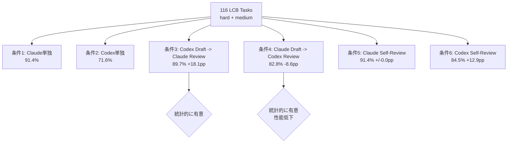

本記事は [Cross-Model LLM Code Review: Should you use Claude to review Codex or vice versa?](https://arxiv.org/abs/2607.21656) の解説記事です。

この記事は [Zenn記事: Claude Code Hooks×Subagents×git worktreeで社内モノレポのコードレビューを並列化する](https://zenn.dev/0h_n0/articles/fd70a29e6b9d6d) の深掘りです。

## 論文概要（Abstract）

LLMを用いたコード生成において、あるモデルがコードを書き、別のモデルがレビューするクロスモデルレビューの有効性を検証した研究である。著者らは116件のLiveCodeBench（LCB）タスクを用いて、Claude Opus 4.7とCodex GPT-5.5を対象に6つの実験条件（各モデル単独、クロスモデルレビュー2方向、セルフレビュー2方向）を設定し、合格率の変化をMcNemar検定とBenjamini-Hochberg補正で統計的に評価している。その結果、Claude Opus 4.7がCodex GPT-5.5のドラフトをレビューすると合格率が71.6%から89.7%に改善する一方（$p_{\text{BH}} = .001$）、逆方向ではClaude Opus 4.7の合格率が91.4%から82.8%に低下する（$p_{\text{BH}} = .046$）という非対称性を報告している。

## 情報源

- **arXiv ID**: 2607.21656
- **URL**: [https://arxiv.org/abs/2607.21656](https://arxiv.org/abs/2607.21656)
- **著者**: Zuodong Xiang, Yike Zhang, YueMing Zhang, Hailu Xu
- **発表年**: 2026（2026年7月22日投稿）
- **分野**: cs.SE（ソフトウェア工学）、cs.AI（人工知能）
- **発表**: Accepted at Agentic SE @ KDD'26

## 背景と動機（Background & Motivation）

LLMを活用したコード生成は急速に進化しており、Claude Code、Codex CLI、Copilotなどのツールが実務で広く利用されている。しかし、LLMが生成するコードの品質保証は依然として課題であり、特にエッジケースの処理漏れやロジックの誤りが残存する。

従来の研究では、LLMの自己修正（Self-Repair）能力が検証されてきた。Olaussonら（ICLR 2024）は「自己修正の効果はモデルの強さに依存し、弱いモデルは自己修正で性能が低下する場合がある」と報告している。しかし、異なるモデル間でのクロスモデルレビューの効果、特にレビュー方向（どちらがドラフトを書き、どちらがレビューするか）が結果に与える影響は十分に検証されていなかった。

本論文は、ソフトウェア実務者がコードレビューで行う「ドラフト作成 -> レビュー -> 修正」のワークフローをLLMで模倣し、モデルの組み合わせ方向が成果に対称的でないことを実験的に明らかにしている。

## 主要な貢献（Key Contributions）

- **貢献1**: Claude Opus 4.7とCodex GPT-5.5の6条件（単独2、クロスモデル2、セルフレビュー2）での制御実験を設計し、合格率・コスト・レイテンシを網羅的に測定した
- **貢献2**: クロスモデルレビューの非対称性を統計的に実証した。Claude -> Codexレビューは+18.1ppの改善を達成する一方、Codex -> Claudeレビューは-8.6ppの低下を引き起こす
- **貢献3**: 非対称性の要因として「ベースライン性能差」「内部検証仮説」「レビュースタイルの違い（修正 vs. 書き直し）」の3つを提示し、回帰率データで裏付けた
- **貢献4**: コストパフォーマンス分析により、実務でのモデル選択に関する具体的な推奨事項を提示した（Claude -> Codexレビューでは1修正あたり約$1.40のコスト）

## 技術的詳細（Technical Details）

### 実験設計（6条件）

著者らはLiveCodeBench（LCB）からhard + mediumの116タスクを選択している。LCBは時系列メタデータを持ち、モデルの学習データカットオフ以降に公開された問題のみを使用することで、データ汚染を回避する設計となっている。

使用モデルは以下の2つであり、いずれも「high」推論設定で実行されている。

- **Claude Opus 4.7**: Anthropic製、Claude Code 2.1.50経由
- **Codex GPT-5.5**: OpenAI製、Codex CLI経由

レビューのプロセスでは、レビュアーには問題文・スターターコード・ドラフトコードが提示されるが、テスト実行は許可されない（静的レビュー）。レビュアーはコードを検査し、バグや欠落ケースを特定した上で、最終的な実行可能プログラムを出力する。



### 統計的検定手法

著者らはMcNemar正確検定を用いて、ペア化された二値アウトカム（各タスクの合格/不合格）を比較している。

$$
X \sim \text{Binomial}(n_{10} + n_{01}, \; 0.5)
$$

ここで、
- $n_{10}$: 条件Aで合格し条件Bで不合格のタスク数
- $n_{01}$: 条件Aで不合格し条件Bで合格のタスク数

帰無仮説のもとでは、不一致タスクの合格方向は等確率（0.5）であり、$n_{10}$と$n_{01}$の偏りが有意かどうかを検定する。

多重比較の補正にはBenjamini-Hochberg（BH）法を採用し、False Discovery Rate（FDR）を制御している。BH法では、p値を昇順に並べ、以下の閾値と比較する。

$$
p_{(i)} \leq \frac{i}{m} \cdot \alpha
$$

ここで、
- $p_{(i)}$: $i$番目に小さいp値
- $m$: 検定の総数
- $\alpha$: FDRの許容水準（通常0.05）

著者らは調整後のp値（$p_{\text{BH}}$）を単調性補正（最大のp値から順に調整）により算出し、すべての結果で報告している。

### 結果の分析（非対称性の要因）

著者らは非対称性の原因について3つの仮説を提示している。

**1. ベースライン性能差仮説**: Claude Opus 4.7のベースライン合格率（91.4%）はCodex GPT-5.5（71.6%）を大きく上回る。Olaussonらの知見「修正パスの効果は修正者がドラフト作成者より強いかどうかに依存する」と整合する。より強いモデルがより弱いモデルのドラフトをレビューする場合（OA条件）は成功するが、逆方向（AO条件）では失敗する。

**2. 内部検証仮説**: Claude Opus 4.7は長い処理時間（86.2秒 vs. Codex 38.5秒）の中で広範な内部検証を実行しており、セルフレビューで改善の余地がほとんど残らない。一方、Codex GPT-5.5はより多くの「捕捉可能な残存エラー」を残す傾向がある。

**3. レビュースタイルの違い**: 6件の代表的ケースの分析から、Codexレビュアーは「不確かな場合にドラフトのデータ構造を破棄してゼロから書き直す」傾向がある一方、Claudeレビュアーは「ドラフトのインターフェースを維持して局所的な不変量を修正する」傾向があると報告されている。この「書き直し vs. 修正」の違いが回帰率に反映されている（AO条件: 11.2% vs. OA条件: 4.3%）。

## 実装のポイント（Implementation）

本論文の知見をプロダクションのコードレビューパイプラインに組み込む際、以下のポイントが重要となる。

**モデル選択戦略**: Codexで生成したコードに対してはClaude Opus 4.7によるレビューが最も効果的である（OA条件: 89.7%）。一方、Claude Opus 4.7で生成したコードについてはレビュー自体をスキップし、そのまま採用するのが最適解となる（91.4%がパレート最適）。

**介入判定の導入**: 本論文ではレビュアーが常にコードを出力する設計だが、著者らは「介入すべきか？」の判定ステップを追加することで、AO条件の回帰を抑制できる可能性があると示唆している。

**静的レビューの制約**: 本論文の実験ではレビュアーにテスト実行を許可していない。ツール使用やサンドボックスを備えたエージェント環境では、より高い改善率が期待できるが、本論文の数値はそうした環境を前提としていない点に留意が必要である。

```python
from dataclasses import dataclass
from enum import Enum


class ReviewAction(Enum):
    """レビュー後のアクション決定"""
    ACCEPT = "accept"       # ドラフトをそのまま採用
    REVISE = "revise"       # 局所的な修正を適用
    SKIP_REVIEW = "skip"    # レビュー自体をスキップ


@dataclass
class ReviewDecision:
    """クロスモデルレビューの判定結果

    Attributes:
        action: 推奨アクション
        drafter: ドラフト作成モデル
        reviewer: レビューモデル
        confidence: 判定の確信度
    """
    action: ReviewAction
    drafter: str
    reviewer: str
    confidence: float


def decide_review_strategy(
    drafter_model: str,
    reviewer_model: str,
) -> ReviewDecision:
    """論文の知見に基づくレビュー戦略の決定

    Args:
        drafter_model: ドラフト作成に使用するモデル名
        reviewer_model: レビューに使用するモデル名

    Returns:
        レビュー判定結果
    """
    # Claude系モデルがドラフト -> レビュー不要（パレート最適）
    if "claude" in drafter_model.lower() and "opus" in drafter_model.lower():
        return ReviewDecision(
            action=ReviewAction.SKIP_REVIEW,
            drafter=drafter_model,
            reviewer=reviewer_model,
            confidence=0.914,  # 論文のClaude単独合格率
        )

    # Codex系モデルがドラフト -> Claude系でレビュー推奨
    if "codex" in drafter_model.lower() and "claude" in reviewer_model.lower():
        return ReviewDecision(
            action=ReviewAction.REVISE,
            drafter=drafter_model,
            reviewer=reviewer_model,
            confidence=0.897,  # 論文のOA条件合格率
        )

    # Codex系モデルがドラフト -> Codexセルフレビュー（次善策）
    if "codex" in drafter_model.lower() and "codex" in reviewer_model.lower():
        return ReviewDecision(
            action=ReviewAction.REVISE,
            drafter=drafter_model,
            reviewer=reviewer_model,
            confidence=0.845,  # 論文のOO条件合格率
        )

    # Claude系モデルがドラフト + Codex系がレビュー -> 回避推奨
    if "claude" in drafter_model.lower() and "codex" in reviewer_model.lower():
        return ReviewDecision(
            action=ReviewAction.ACCEPT,  # ドラフトをそのまま採用
            drafter=drafter_model,
            reviewer=reviewer_model,
            confidence=0.914,  # レビューせずClaude単独を採用
        )

    # 未知の組み合わせ -> デフォルトでレビュー実施
    return ReviewDecision(
        action=ReviewAction.REVISE,
        drafter=drafter_model,
        reviewer=reviewer_model,
        confidence=0.5,
    )
```

## Production Deployment Guide

### AWS実装パターン（コスト最適化重視）

本論文のクロスモデルレビューパイプラインをAWS上で構築する場合の構成を、レビュー処理量別に示す。コードレビューはCI/CDパイプラインに組み込むユースケースを想定している。

| 構成 | レビュー量 | 月額概算 | 主要サービス |
|------|-----------|---------|-------------|
| Small | ~100 PR/日 | $100-300 | Lambda + Bedrock + SQS |
| Medium | ~500 PR/日 | $500-1,200 | ECS Fargate + Bedrock + ElastiCache |
| Large | 2,000+ PR/日 | $3,000-7,000 | EKS + Spot + Bedrock Batch |

**Small構成（~100 PR/日）**: GitHub WebhookをAPI Gateway経由でLambda関数が受信し、SQSキューにレビューリクエストを投入する。ワーカーLambdaがキューからタスクを取得し、Bedrockに対してドラフトコードのレビューリクエストを送信する。論文の知見に基づき、ドラフト作成モデルに応じてレビューを実行するかスキップするかを判定する（Claude Opus生成コードはレビュースキップ）。DynamoDBにレビュー履歴と合格率メトリクスを保存する。月額内訳: Lambda $10-20、SQS $5、Bedrock $60-220、DynamoDB $5-15、API Gateway $5-10。

**Medium構成（~500 PR/日）**: ECS Fargateでレビューワーカーを常駐させ、ElastiCache（Redis）でレビュー済みファイルのハッシュキャッシュを管理する。同一ファイルの再レビューを回避し、Bedrockのトークン消費を削減する。Fargate Spotタスクでコンピューティングコストを最大70%削減する。CodePipelineとの統合により、PR作成時に自動レビューを起動する。月額内訳: ECS Fargate $100-250、ElastiCache $50-100、Bedrock $250-700、監視 $30-60。

**Large構成（2,000+ PR/日）**: EKS上でレビューPodを運用し、Karpenterによるオートスケーリングを構成する。Bedrock Batch APIで非同期レビューのコストを50%削減する。複数リポジトリのモノレポレビューに対応し、Podごとにリポジトリの言語・フレームワーク固有のプロンプトを適用する。月額内訳: EKS $75、EC2 Spot $600-1,800、Bedrock $1,800-4,500、監視 $150-300。

**コスト試算の注意事項**: 上記は2026年10月時点のAWS ap-northeast-1（東京）リージョン料金に基づく概算値である。Bedrockのトークン単価はモデル・リージョンにより変動する。レビュー対象コードのサイズ（平均トークン数）により実コストは大きく変わるため、最新料金はAWS料金計算ツールで確認を推奨する。

### Terraformインフラコード

**Small構成（Serverless）: Lambda + SQS + Bedrock**

```hcl
# --- Small構成: クロスモデルレビュー用サーバーレス基盤 ---
# 2026-10時点のAWS ap-northeast-1向け

terraform {
  required_version = ">= 1.9"
  required_providers {
    aws = { source = "hashicorp/aws", version = "~> 5.70" }
  }
}

provider "aws" {
  region = "ap-northeast-1"
}

# --- IAMロール（最小権限） ---
resource "aws_iam_role" "review_lambda" {
  name = "cross-model-review-lambda-role"
  assume_role_policy = jsonencode({
    Version = "2012-10-17"
    Statement = [{
      Action    = "sts:AssumeRole"
      Effect    = "Allow"
      Principal = { Service = "lambda.amazonaws.com" }
    }]
  })
}

resource "aws_iam_role_policy" "review_lambda" {
  name = "cross-model-review-lambda-policy"
  role = aws_iam_role.review_lambda.id
  policy = jsonencode({
    Version = "2012-10-17"
    Statement = [
      {
        # Bedrock InvokeModel（レビューリクエスト送信）
        Effect   = "Allow"
        Action   = ["bedrock:InvokeModel"]
        Resource = "arn:aws:bedrock:ap-northeast-1::foundation-model/*"
      },
      {
        # SQS（レビューキュー操作）
        Effect   = "Allow"
        Action   = ["sqs:ReceiveMessage", "sqs:DeleteMessage", "sqs:GetQueueAttributes"]
        Resource = aws_sqs_queue.review_queue.arn
      },
      {
        # DynamoDB（レビュー履歴保存）
        Effect   = "Allow"
        Action   = ["dynamodb:GetItem", "dynamodb:PutItem", "dynamodb:UpdateItem", "dynamodb:Query"]
        Resource = aws_dynamodb_table.review_history.arn
      },
      {
        # CloudWatch Logs
        Effect   = "Allow"
        Action   = ["logs:CreateLogGroup", "logs:CreateLogStream", "logs:PutLogEvents"]
        Resource = "arn:aws:logs:ap-northeast-1:*:*"
      }
    ]
  })
}

# --- SQSキュー（レビューリクエスト） ---
resource "aws_sqs_queue" "review_queue" {
  name                       = "cross-model-review-queue"
  visibility_timeout_seconds = 300  # レビュー処理のタイムアウト
  message_retention_seconds  = 86400
  receive_wait_time_seconds  = 20   # ロングポーリング

  redrive_policy = jsonencode({
    deadLetterTargetArn = aws_sqs_queue.review_dlq.arn
    maxReceiveCount     = 3  # 3回失敗でDLQへ
  })

  sqs_managed_sse_enabled = true  # SSE-SQS暗号化
}

resource "aws_sqs_queue" "review_dlq" {
  name                    = "cross-model-review-dlq"
  message_retention_seconds = 1209600  # 14日間保持
  sqs_managed_sse_enabled = true
}

# --- DynamoDB（レビュー履歴） ---
resource "aws_dynamodb_table" "review_history" {
  name         = "cross-model-review-history"
  billing_mode = "PAY_PER_REQUEST"
  hash_key     = "pr_id"
  range_key    = "file_path"

  attribute {
    name = "pr_id"
    type = "S"
  }

  attribute {
    name = "file_path"
    type = "S"
  }

  ttl {
    attribute_name = "expires_at"
    enabled        = true  # 90日後に自動削除
  }

  server_side_encryption {
    enabled = true
  }
}

# --- Lambda関数（レビューワーカー） ---
resource "aws_lambda_function" "reviewer" {
  function_name = "cross-model-reviewer"
  runtime       = "python3.12"
  handler       = "handler.lambda_handler"
  role          = aws_iam_role.review_lambda.arn
  timeout       = 120      # レビュー処理に十分な時間
  memory_size   = 512

  filename         = "reviewer_lambda.zip"
  source_code_hash = filebase64sha256("reviewer_lambda.zip")

  environment {
    variables = {
      REVIEW_TABLE       = aws_dynamodb_table.review_history.name
      SKIP_CLAUDE_REVIEW = "true"   # Claude生成コードはレビュースキップ
      REVIEWER_MODEL     = "anthropic.claude-opus-4-7"
    }
  }

  tracing_config {
    mode = "Active"
  }
}

# --- SQSトリガー ---
resource "aws_lambda_event_source_mapping" "review_trigger" {
  event_source_arn = aws_sqs_queue.review_queue.arn
  function_name    = aws_lambda_function.reviewer.arn
  batch_size       = 1  # レビューは1件ずつ処理
}

# --- CloudWatchアラーム ---
resource "aws_cloudwatch_metric_alarm" "review_errors" {
  alarm_name          = "cross-model-review-errors"
  comparison_operator = "GreaterThanThreshold"
  evaluation_periods  = 2
  metric_name         = "Errors"
  namespace           = "AWS/Lambda"
  period              = 300
  statistic           = "Sum"
  threshold           = 5
  alarm_description   = "Cross-model review Lambda error detection"

  dimensions = {
    FunctionName = aws_lambda_function.reviewer.function_name
  }
}

resource "aws_cloudwatch_metric_alarm" "dlq_messages" {
  alarm_name          = "cross-model-review-dlq-alert"
  comparison_operator = "GreaterThanThreshold"
  evaluation_periods  = 1
  metric_name         = "ApproximateNumberOfMessagesVisible"
  namespace           = "AWS/SQS"
  period              = 300
  statistic           = "Sum"
  threshold           = 0
  alarm_description   = "DLQ has unprocessed review requests"

  dimensions = {
    QueueName = aws_sqs_queue.review_dlq.name
  }
}
```

**Large構成（Container）: EKS + Karpenter + Spot**

```hcl
# --- Large構成: EKS + Karpenter（Spot優先）---

module "eks" {
  source  = "terraform-aws-modules/eks/aws"
  version = "~> 20.24"

  cluster_name    = "cross-model-review"
  cluster_version = "1.31"

  vpc_id     = module.vpc.vpc_id
  subnet_ids = module.vpc.private_subnets

  enable_irsa = true

  cluster_endpoint_public_access = false
}

# --- Karpenter NodePool（Spot優先） ---
resource "kubectl_manifest" "karpenter_nodepool" {
  yaml_body = yamlencode({
    apiVersion = "karpenter.sh/v1"
    kind       = "NodePool"
    metadata   = { name = "review-pool" }
    spec = {
      template = {
        spec = {
          requirements = [
            { key = "karpenter.sh/capacity-type", operator = "In", values = ["spot", "on-demand"] },
            { key = "node.kubernetes.io/instance-type", operator = "In",
              values = ["m7i.xlarge", "m7i.2xlarge", "c7i.xlarge", "c7i.2xlarge"] },
          ]
          nodeClassRef = { name = "default" }
        }
      }
      limits = { cpu = "64", memory = "256Gi" }
      disruption = {
        consolidationPolicy = "WhenEmptyOrUnderutilized"
        consolidateAfter    = "60s"
      }
    }
  })
}

# --- Secrets Manager（APIキー管理） ---
resource "aws_secretsmanager_secret" "bedrock_config" {
  name        = "cross-model-review/bedrock-config"
  description = "Bedrock model configuration for cross-model review"
}

# --- AWS Budgets（予算アラート） ---
resource "aws_budgets_budget" "monthly" {
  name         = "cross-model-review-monthly"
  budget_type  = "COST"
  limit_amount = "7000"
  limit_unit   = "USD"
  time_unit    = "MONTHLY"

  notification {
    comparison_operator       = "GREATER_THAN"
    threshold                 = 80
    threshold_type            = "PERCENTAGE"
    notification_type         = "ACTUAL"
    subscriber_email_addresses = ["ops@example.com"]
  }
}
```

### 運用・監視設定

**CloudWatch Logs Insights クエリ（レビュー効果の監視）**:

```
# レビュー実行回数と結果種別（1時間あたり）
fields @timestamp, @message
| filter @message like /review_completed/
| stats count() as total_reviews,
        sum(action = "revise") as revised,
        sum(action = "skip") as skipped,
        sum(action = "accept") as accepted
  by bin(1h)
| sort @timestamp desc
```

**CloudWatch アラーム設定（Python）**:

```python
import boto3


def create_review_alarms(function_name: str, sns_topic_arn: str) -> None:
    """クロスモデルレビューLambda用のCloudWatchアラームを作成する

    Args:
        function_name: 監視対象のLambda関数名
        sns_topic_arn: 通知先のSNSトピックARN
    """
    cw = boto3.client("cloudwatch", region_name="ap-northeast-1")

    # レビュー処理時間の異常検知
    cw.put_metric_alarm(
        AlarmName=f"{function_name}-review-duration",
        MetricName="Duration",
        Namespace="AWS/Lambda",
        Statistic="p95",
        Period=300,
        EvaluationPeriods=3,
        Threshold=100000,  # 100秒超過でアラート
        ComparisonOperator="GreaterThanThreshold",
        AlarmActions=[sns_topic_arn],
    )

    # Bedrockトークン使用量スパイク検知
    cw.put_metric_alarm(
        AlarmName=f"{function_name}-token-spike",
        MetricName="InputTokenCount",
        Namespace="AWS/Bedrock",
        Statistic="Sum",
        Period=3600,
        EvaluationPeriods=2,
        Threshold=500000,  # 1時間あたり50万トークン超過
        ComparisonOperator="GreaterThanThreshold",
        AlarmActions=[sns_topic_arn],
    )
```

**X-Ray トレーシング設定（Python）**:

```python
from aws_xray_sdk.core import xray_recorder, patch_all


def setup_xray_tracing() -> None:
    """X-Rayトレーシングの初期化"""
    xray_recorder.configure(service="cross-model-review")
    patch_all()


@xray_recorder.capture("cross_model_review")
def execute_review(
    draft_code: str,
    drafter_model: str,
    reviewer_model: str,
    pr_id: str,
) -> dict:
    """X-Rayトレース付きクロスモデルレビュー実行

    Args:
        draft_code: レビュー対象のドラフトコード
        drafter_model: ドラフト作成モデル名
        reviewer_model: レビューモデル名
        pr_id: プルリクエスト識別子

    Returns:
        レビュー結果メタデータ
    """
    subsegment = xray_recorder.current_subsegment()
    subsegment.put_annotation("pr_id", pr_id)
    subsegment.put_annotation("drafter", drafter_model)
    subsegment.put_annotation("reviewer", reviewer_model)
    subsegment.put_metadata("code_length", len(draft_code))
    # Bedrock呼び出し（実装省略）
    return {"action": "revise", "tokens_used": 12500}
```

**Cost Explorer自動レポート（Python）**:

```python
import boto3
from datetime import datetime, timedelta


def get_daily_review_cost() -> dict:
    """Bedrock/Lambda関連の日次コストレポートを取得する

    Returns:
        サービス別コスト辞書
    """
    ce = boto3.client("ce", region_name="us-east-1")
    today = datetime.utcnow().date()
    yesterday = today - timedelta(days=1)

    response = ce.get_cost_and_usage(
        TimePeriod={"Start": str(yesterday), "End": str(today)},
        Granularity="DAILY",
        Metrics=["UnblendedCost"],
        Filter={
            "Or": [
                {"Dimensions": {"Key": "SERVICE", "Values": ["Amazon Bedrock"]}},
                {"Dimensions": {"Key": "SERVICE", "Values": ["AWS Lambda"]}},
                {"Dimensions": {"Key": "SERVICE", "Values": ["Amazon Simple Queue Service"]}},
            ]
        },
        GroupBy=[{"Type": "DIMENSION", "Key": "SERVICE"}],
    )
    costs: dict[str, float] = {}
    for group in response["ResultsByTime"][0]["Groups"]:
        service = group["Keys"][0]
        amount = float(group["Metrics"]["UnblendedCost"]["Amount"])
        costs[service] = amount

    total = sum(costs.values())
    if total > 200.0:
        sns = boto3.client("sns", region_name="ap-northeast-1")
        sns.publish(
            TopicArn="arn:aws:sns:ap-northeast-1:123456789012:review-cost-alert",
            Subject="Cross-model review daily cost exceeded $200",
            Message=f"Total: ${total:.2f}\nBreakdown: {costs}",
        )
    return costs
```

### コスト最適化チェックリスト

**アーキテクチャ選択**:
- [ ] レビュー量で構成を判断（~100 PR/日: Serverless、~500 PR/日: Hybrid、2,000+/日: Container）
- [ ] Claude生成コードのレビュースキップを実装（論文の知見: 91.4%がパレート最適）

**リソース最適化**:
- [ ] EC2/EKS: Spot Instances優先（最大90%削減）
- [ ] Reserved Instances: 1年コミットで最大72%削減
- [ ] Savings Plans: コンピューティング使用量に対する割引
- [ ] Lambda: メモリサイズ最適化（レビュー処理は512MB推奨）
- [ ] ECS/EKS: 夜間・週末のスケールダウン（Karpenter consolidation）

**LLMコスト削減**:
- [ ] Bedrock Prompt Caching有効化（レビュープロンプトのキャッシュで30-90%削減）
- [ ] レビュースキップ戦略（Claude生成コードはレビュー不要）
- [ ] Bedrock Batch API使用（非同期レビューで50%削減）
- [ ] モデル選択ロジック（コスト効率重視ならCodex自己レビュー: $0.12/タスク追加、精度重視ならClaude -> Codex: $0.25/タスク追加）
- [ ] 差分レビュー（変更部分のみレビュー対象にしてトークン数削減）

**監視・アラート**:
- [ ] AWS Budgets設定（月次予算上限）
- [ ] CloudWatch アラーム（DLQメッセージ数、Lambda実行時間、Bedrockトークン数）
- [ ] Cost Anomaly Detection有効化
- [ ] 日次コストレポート自動送信
- [ ] レビュー結果メトリクス（修正率、スキップ率、回帰率）

**リソース管理**:
- [ ] 未使用リソース削除（孤立Lambda、停止中ECSタスク）
- [ ] タグ戦略（`Project: cross-model-review`, `Environment: prod/dev`）
- [ ] DynamoDB TTLによるレビュー履歴の自動削除（90日）
- [ ] 開発環境の夜間停止（EKSノード数0）
- [ ] CloudWatch Logsの保存期間設定（30日推奨）
- [ ] SQS DLQの定期的なドレイン・分析

## 実験結果（Results）

### 全6条件の合格率と統計的有意性

著者らが報告している全6条件の結果を以下に示す（論文Table 2, Table 4相当）。

| 条件 | 合格率 | 95% CI | 差分 (pp) | $p_{\text{BH}}$ | 判定 |
|------|--------|--------|-----------|---------|------|
| Claude単独 (A) | 91.4% | [.862, .957] | -- | -- | ベースライン |
| Codex単独 (O) | 71.6% | [.629, .793] | -- | -- | ベースライン |
| Codex Draft -> Claude Review (OA) | 89.7% | [.836, .948] | +18.1 | .0010 | 有意な改善 |
| Codex Self-Review (OO) | 84.5% | [.776, .905] | +12.9 | .0222 | 有意な改善 |
| Claude Self-Review (AA) | 91.4% | [.862, .957] | +0.0 | 1.000 | 変化なし |
| Claude Draft -> Codex Review (AO) | 82.8% | [.759, .897] | -8.6 | .0456 | 有意な低下 |

### 修正数と回帰数

| 条件 | 修正数 | 回帰数 | 純増 | 回帰率 |
|------|--------|--------|------|--------|
| OA (Codex -> Claude) | 26 | 5 | +21 | 4.3% |
| OO (Codex -> Codex) | 21 | 6 | +15 | 5.2% |
| AA (Claude -> Claude) | 3 | 3 | 0 | 2.6% |
| AO (Claude -> Codex) | 3 | 13 | -10 | 11.2% |

AO条件の回帰率11.2%は他条件と比較して突出して高い。これは前述のCodexレビュアーの「書き直し」傾向と整合する結果であると著者らは分析している。

### コストとレイテンシ

| 条件 | タスクあたりコスト | タスクあたりレイテンシ |
|------|-------------------|-----------------------|
| Claude単独 | $0.226 | 86.2秒 |
| Codex単独 | $0.190 | 38.5秒 |
| OA (Codex -> Claude) | $0.443 | 112.4秒 |
| OO (Codex -> Codex) | $0.312 | 67.9秒 |
| AA (Claude -> Claude) | $0.389 | 135.8秒 |
| AO (Claude -> Codex) | $0.382 | 118.0秒 |

OA条件は最も高コスト（$0.443/タスク）だが、1修正あたりのコストはOA: 約$1.40/修正、OO: 約$0.95/修正であると算出されている。精度を最大化する場合はOA、コスト効率を重視する場合はOOが適切な選択肢となる。

## 実運用への応用（Practical Applications）

### Zenn記事との関連

関連Zenn記事「[Claude Code Hooks×Subagents×git worktreeで社内モノレポのコードレビューを並列化する](https://zenn.dev/0h_n0/articles/fd70a29e6b9d6d)」では、Claude Codeのhooksとsubagentsを活用して、モノレポ内の複数ディレクトリを並列にレビューするアーキテクチャを紹介している。本論文の知見は、このパイプラインにおけるモデル選択の指針として直接応用できる。

具体的には、Claude Code（Opus系）で生成したコードに対してはレビューを省略し（論文の知見: セルフレビューで改善なし）、Codex CLI等の外部ツールで生成したコードに対してはClaude Opusによるレビューを適用することで、コスト効率を最大化しつつ合格率を向上させる戦略が考えられる。

### モデル選択への示唆（opus vs. sonnet の使い分け）

本論文はClaude Opus 4.7とCodex GPT-5.5の組み合わせのみを検証しており、Claude内のバリアント間（例: Opus vs. Sonnet）の比較は含まれていない点に留意が必要である。ただし、論文の「ベースライン性能差仮説」を敷衍すると、Sonnetで生成したコードをOpusでレビューする構成は有効である可能性がある一方、その逆（OpusドラフトのSonnetレビュー）は回帰リスクがあると推測できる。この仮説は、著者らが今後の課題として挙げている「追加モデルファミリーでの検証」で明らかになると期待される。

## 関連研究（Related Work）

- **Olausson et al., "Is Self-Repair a Silver Bullet for Code Generation?" (ICLR 2024)**: 自己修正の効果はモデルの強さに依存し、弱いモデルでは自己修正で性能が低下し得ることを報告した。本論文はこの知見をクロスモデル設定に拡張し、非対称性の説明に援用している
- **Reflexion (Shinn et al., NeurIPS 2023)**: LLMエージェントに言語的な自己反省メカニズムを導入し、タスク失敗後に自然言語フィードバックを生成して次の試行を改善する手法。本論文との違いは、Reflexionがテスト実行フィードバックを利用するのに対し、本論文は静的レビュー（テスト実行なし）でクロスモデル効果を検証している点にある
- **LiveCodeBench (Jain et al., ICLR 2025)**: データ汚染を回避するために時系列メタデータを持つコーディングベンチマーク。LeetCode・AtCoder・CodeForcesから継続的に問題を収集する設計で、本論文の実験基盤として採用されている
- **BitsAI-CR (ByteDance, FSE 2025)**: LLMを用いた実用的なコードレビューシステム。本論文がベンチマークタスクでの合格率を評価するのに対し、BitsAI-CRは実際のPRレビューにおけるコメント品質に焦点を当てている

## まとめと今後の展望

本論文は、LLMのクロスモデルコードレビューにおいて方向性が重要であることを統計的に実証した。Claude Opus 4.7がCodex GPT-5.5をレビューすると合格率が18.1pp改善する一方、逆方向では8.6pp低下するという非対称性は、実務でのモデル組み合わせ戦略に直接的な示唆を与える。

ただし、著者ら自身が認めるように、本研究は116タスク・2モデルペア・Python限定・静的レビューという制約のもとでの探索的研究である。今後はGemini・DeepSeek・Qwenを含む多モデル比較、リポジトリ規模のレビュー、セキュリティ・保守性といった非正確性次元での評価、および「介入すべきか？」の判定ステップの追加が研究課題として挙げられている。

## 参考文献

- **arXiv**: [https://arxiv.org/abs/2607.21656](https://arxiv.org/abs/2607.21656)
- **LiveCodeBench**: [https://livecodebench.github.io/](https://livecodebench.github.io/)
- **Olausson et al. (ICLR 2024)**: [https://proceedings.iclr.cc/paper_files/paper/2024/file/9ddc141bdbf9d1db510cefff56c586ad-Paper-Conference.pdf](https://proceedings.iclr.cc/paper_files/paper/2024/file/9ddc141bdbf9d1db510cefff56c586ad-Paper-Conference.pdf)
- **Related Zenn article**: [https://zenn.dev/0h_n0/articles/fd70a29e6b9d6d](https://zenn.dev/0h_n0/articles/fd70a29e6b9d6d)
