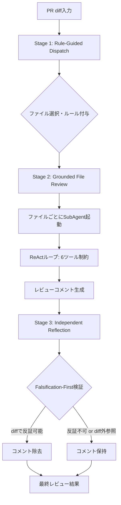
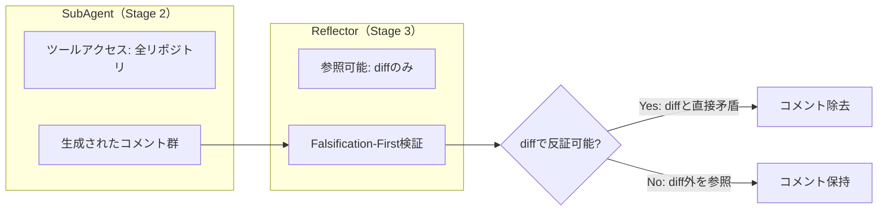

## 論文概要（Abstract）

本記事は [https://arxiv.org/abs/2608.09290](https://arxiv.org/abs/2608.09290) の解説記事です。

LLMベースのコードレビューエージェントはスケーラブルな常時レビューを実現する可能性を持つが、既存のシステムは**非決定性（non-determinism）**と**コンテキスト局所性（context locality）**という2つの根本的な問題を抱えている。OpenCodeReviewはこれらの課題に対し、「不確実なエージェントのための決定論的エンジニアリング」というアプローチで対処する。AACR-Bench（200件の実PRs、10言語、1,505件の専門家検証コメント）での評価において、同一LLMバックエンドで既存のコーディングエージェントと比較して最大2.17倍のSEM-F1を達成しつつ、トークン消費を5-15倍削減したと著者らは報告している。

この記事は [Zenn記事: Claude Code Hooks×Subagents×git worktreeで社内モノレポのコードレビューを並列化する](https://zenn.dev/0h_n0/articles/fd70a29e6b9d6d) の深掘りです。

## 情報源

- **arXiv ID**: 2608.09290
- **URL**: [https://arxiv.org/abs/2608.09290](https://arxiv.org/abs/2608.09290)
- **著者**: Zhengfeng Li, Lei Zhang, Xianwei Wu et al.（Alibaba Group）
- **発表年**: 2026
- **分野**: cs.SE（Software Engineering）
- **ライセンス**: CC BY 4.0
- **実装**: [https://github.com/alibaba/open-code-review](https://github.com/alibaba/open-code-review)（Apache-2.0）

## 背景と動機（Background & Motivation）

LLMをコードレビューに適用する試みは急速に広がっているが、2つの根本的な課題がプロダクション適用を妨げている。

第一に**非決定性**の問題がある。汎用コーディングエージェント（Claude Code、Codex等）にコードレビューを依頼すると、エージェントは自由にツールを呼び出してリポジトリを探索する。この無制約な探索は、同じPRに対しても実行ごとに異なる結果を返し、レビュー品質の安定性を損なう。さらに、ツール呼び出しの連鎖が「トークン雪だるま効果」を生じ、コンテキストウィンドウを急速に消費する。

第二に**コンテキスト局所性**の問題がある。diffベースのレビューではコードの変更差分のみが参照可能であり、変更が依存する関数定義やインターフェース仕様など、リポジトリ全体のコンテキストを把握できない。一方でリポジトリ全体をコンテキストに投入するとトークンコストが爆発する。

OpenCodeReviewは、エージェントの自律性を最大化するのではなく、検証済みのタスク軸に沿って行動空間を制約することで、この二律背反に対処する。

## 主要な貢献（Key Contributions）

- **3段階決定論的パイプライン**: Rule-Guided Dispatch、Grounded File Review、Independent Reflectionの3段階で構成され、エージェントの行動空間に決定論的な制約を注入する
- **AACR-Bench**: 50リポジトリ・200PR・10言語・1,505件の専門家検証コメントからなるコードレビューベンチマーク。80名以上のシニアエンジニアによる3ラウンドのクロスバリデーションで品質を担保
- **コスト効率の実証**: 6種類のLLMバックエンドすべてにおいて、汎用エージェント対比で一貫してSEM-F1を改善しつつトークン消費を大幅に削減
- **オープンソース**: Alibaba社内で実運用されているコードレビューシステムをApache-2.0ライセンスで公開（GitHub Stars: 43.7k、2026年10月時点）

## 技術的詳細（Technical Details）

### パイプライン全体像

OpenCodeReviewの3段階パイプラインは、以下の通り構成される。



### Stage 1: Rule-Guided Dispatch

Rule-Guided Dispatchは、レビュー対象ファイルの選択とレビュー基準の決定を**決定論的に**行うステージである。エージェントにファイルトリアージを任せる方式では、実行ごとに異なるファイルが選択されてしまう。本ステージではこの非決定性を排除する。

ルール解決は4段階の優先度チェーンで行われる。

| 優先度 | ルール種別 | スコープ | 用途例 |
|--------|-----------|---------|--------|
| Tier 1（最高） | アドホックルール | 実行単位 | 特定PRへの一時的なレビュー指示 |
| Tier 2 | プロジェクトレベルルール | リポジトリ単位 | `.codereview.yml`等のプロジェクト設定 |
| Tier 3 | ユーザーグローバルルール | ユーザー単位 | ホームディレクトリの個人設定 |
| Tier 4（最低） | ビルトインルール | 言語/ファイル種別 | 言語固有のデフォルトルール（NPE検出、XSS検出等） |

パスマッチングには再帰的globパターン（ブレース展開・大小文字無視）が使用され、**first-match-wins**のセマンティクスで評価される。これはClaude Code Hooksの`matcher`フィールドがglobパターンでイベントをフィルタリングする仕組みと構造的に類似しており、Zenn記事で紹介した`"review-.*"`のようなパターンマッチングと同じ設計思想に基づく。

ファイルフィルタリングの前処理は6段階で実行される。

1. バイナリファイルの除外
2. ユーザー定義除外パターンの適用
3. ユーザー定義包含パターンのフィルタリング
4. 拡張子アローリストの適用
5. テストフィクスチャ・自動生成コードのデフォルト除外
6. **コンテキストウィンドウの80%を超えるファイルの除外**

最後の閾値制御は、単一ファイルでコンテキストウィンドウが飽和することを防ぐための設計判断である。

### Stage 2: Grounded File Review

Grounded File Reviewは、Dispatchで選択された各ファイルに対して**ファイル単位のSubAgent**を起動し、**制約付きReActループ**でレビューを実行するステージである。

#### ReActループの制御パラメータ

| パラメータ | 値 | 設計根拠 |
|-----------|------|---------|
| 最大イテレーション数 | 30 | 実用的なトレードオフ |
| 空ラウンド検出 | 3連続で終了プロンプト | エージェントのスタック防止 |
| コンテキスト圧縮閾値（非同期） | 60%使用率 | バックグラウンドで事前圧縮 |
| コンテキスト圧縮閾値（同期） | 80%使用率 | 3リージョン戦略で強制圧縮 |

80%で発動する強制圧縮では、コンテキストを3つのリージョンに分割する。

$$
\text{Context} = \underbrace{C_{\text{frozen}}}_{\text{システムプロンプト}} \cup \underbrace{C_{\text{compress}}}_{\text{要約対象}} \cup \underbrace{C_{\text{active}}}_{\text{最新のやりとり}}
$$

ここで、$C_{\text{frozen}}$は圧縮対象外のシステムプロンプト、$C_{\text{compress}}$は要約によって圧縮される中間のやりとり、$C_{\text{active}}$は直近のやりとりであり、これによりレビューの文脈を保ちつつコンテキストウィンドウの枯渇を防止する。

#### 6つのキュレーションツール

汎用エージェントが任意のツールを自由に呼び出す方式と異なり、OpenCodeReviewでは6つの専用ツールに行動空間を限定する。各ツールには出力上限が設定されており、トークン消費を抑制する。

| ツール名 | 目的 | 出力制限 |
|---------|------|---------|
| `file_read` | ファイル内容の読み取り | 最大500行/呼び出し |
| `file_find` | ファイル名キーワード検索 | 最大100結果 |
| `code_search` | テキストパターン検索 | 最大100マッチ、10秒タイムアウト |
| `file_read_diff` | 変更ファイルのdiff確認 | 事前計算されたdiffを返却 |
| `code_comment` | レビューコメントの送信 | 非同期で収集 |
| `task_done` | 完了シグナル | ループを終了 |

この「ツールの出力制限」は、トークン消費を抑える上で決定的に重要である。著者らの報告によれば、汎用エージェントでは無制約なツール呼び出しの連鎖が「トークン雪だるま効果」を引き起こし、5-15倍のトークン消費につながる（論文Table 3）。

#### コメント行解決の3段階フォールバック

レビューコメントを正確なコード行に紐づけるため、3段階のフォールバック機構が実装されている。

1. `existing_code`をdiffのnew-sideハンクと照合し、正確なアンカーを特定
2. Stage 1が失敗した場合、ファイル全体のコンテンツを検索
3. 両方が失敗した場合、LLMによる再配置（LLM-assisted relocation）

### Stage 3: Independent Reflection

Independent Reflectionは、Grounded File Reviewが生成したコメントから**ハルシネーション（幻覚的な指摘）を除去**するフィルタリングステージである。本ステージの核心は**非対称情報境界（Asymmetric Information Boundary）**にある。



SubAgentはツールを通じてリポジトリ全体にアクセスできるが、Reflectorは**diffのみ**を参照する。この意図的な情報制約により、「同一LLMでも、制限されたコンテキストが内在的な自己批判より優れる」（論文より）という洞察を活用する。

**Falsification-First原則**は3つのルールで構成される。

1. **Fact Check（拒否権ルール）**: diffに直接矛盾するコメントをフラグする。例えば「nullチェックがない」というコメントに対し、diffにnullチェックが含まれている場合に除去する
2. **Issue Classification（課題分類）**: diffで誤りが証明されたコメントのみを除去する。「推測」ではなく「反証」に基づく判断
3. **Recall Preservation（リコール保持）**: diff可視範囲外のコンテキストを参照するコメントは保持する。SubAgentがツール探索で得た正当な根拠に基づく可能性があるため

Reflectorは**フィルタ専用設計**であり、新規コメントの生成は不可能である。パースエラー時にはフェイルオープン（全コメント保持）で動作する。この制約により、Reflectorが新たなハルシネーションを導入するリスクを排除している。

## 実装のポイント（Implementation）

OpenCodeReviewの実装上の重要なポイントを整理する。

**ツール出力の上限設定**: `file_read`の500行制限は、LLMのコンテキストウィンドウを保護するための実用的な閾値である。大規模ファイル（数千行のモジュール等）では、エージェントが複数回の`file_read`を行い段階的にファイルを読み取る。この分割読み取り戦略は、一度に全ファイルを投入する方式と比較してトークン効率を維持しつつ、必要な文脈のみを取得する利点がある。

**コンテキスト圧縮の2段階戦略**: 60%閾値での非同期圧縮は、レビュー処理のレイテンシに影響を与えずにコンテキストを事前整理する。80%閾値での同期圧縮は、3リージョン分割によりシステムプロンプトと直近のやりとりを保持しつつ中間部分を要約する。この設計により、長いレビューセッションでもコンテキストの枯渇を回避できる。

**first-match-winsセマンティクス**: ルールの評価順序が重要であり、より具体的なルールを上位に配置する必要がある。例えば、`src/auth/**/*.ts`に対するセキュリティルールは、`**/*.ts`に対する汎用ルールよりも先に評価されるべきである。この設計はnginxのlocation設定やgitignoreのパターンマッチングと同様の原則に基づく。

**パース失敗時のフェイルオープン**: Reflectorのパースエラー時に全コメントを保持する設計は、Precision低下のリスクよりRecall低下のリスクを重視する判断である。コードレビューでは、偽陽性（不要な指摘）よりも偽陰性（見落とし）のコストが高いため、この設計判断は実務的に妥当と考えられる。

## Production Deployment Guide

OpenCodeReviewのパイプラインをAWS上にデプロイする場合の構成パターンを示す。コードレビューは非同期かつバッチ的なワークロードであり、リアルタイム性よりもコスト効率とスケーラビリティが重視される。

### AWS実装パターン（コスト最適化重視）

**トラフィック量別の推奨構成**

| 構成 | 想定規模 | アーキテクチャ | 月額目安（2026年10月時点、ap-northeast-1） |
|------|---------|-------------|------------|
| Small | ~100 PR/月 | Lambda + Bedrock + DynamoDB | $80-200 |
| Medium | ~500 PR/月 | ECS Fargate + Bedrock + ElastiCache | $400-1,000 |
| Large | 2,000+ PR/月 | EKS + Karpenter + Spot + Bedrock Batch | $2,500-6,000 |

**Small構成の内訳（~100 PR/月）**:
- Lambda: PR webhook受信 + ルールディスパッチ（256MB、最大15分） --- $5-10/月
- Bedrock Claude Sonnet 4.6: レビュー生成（$3/1M入力、$15/1M出力） --- $50-150/月（PR平均385Kトークン = 約$1.2/PR）
- DynamoDB On-Demand: ルール・レビュー結果の保存 --- $5-10/月
- S3: diffキャッシュ・レビューログ --- $1-5/月
- EventBridge + SQS: 非同期レビューキュー --- $1-5/月

**コスト削減テクニック**:
- **Bedrock Batch API**: 非リアルタイムのレビューに50%割引を適用（夜間バッチ実行）
- **Prompt Caching**: システムプロンプト + ルール定義のキャッシュで入力トークン最大90%削減（Claude 4.5以降対応）
- **モデル選択ロジック**: ルールマッチ段階で「セキュリティ関連 = Opus、スタイル関連 = Haiku」と動的にモデルを切り替え
- **Spot Instances**: EKS構成ではKarpenter経由でSpot Instancesを優先割り当て（最大90%削減）
- **Reserved Instances**: ECS/EKS構成で1年コミットにより最大72%削減

**コスト試算の注意事項**: 上記は2026年10月時点のAWS ap-northeast-1（東京）リージョン料金に基づく概算値である。実際のコストはPRのサイズ分布、レビュー対象言語の複雑さ、Reflectionステージでのフィルタリング率により変動する。最新料金は[AWS料金計算ツール](https://calculator.aws/)で確認を推奨する。

### Terraformインフラコード

#### Small構成（Serverless）

```hcl
# OpenCodeReview Serverless構成: Lambda + Bedrock + DynamoDB
terraform {
  required_version = ">= 1.9"
  required_providers {
    aws = { source = "hashicorp/aws", version = "~> 5.70" }
  }
}

provider "aws" { region = "ap-northeast-1" }

# IAM Role（最小権限: Bedrock + DynamoDB + SQS + Logs のみ）
resource "aws_iam_role" "ocr_lambda" {
  name = "ocr-lambda-role"
  assume_role_policy = jsonencode({
    Version = "2012-10-17"
    Statement = [{ Action = "sts:AssumeRole", Effect = "Allow",
                    Principal = { Service = "lambda.amazonaws.com" } }]
  })
}

resource "aws_iam_role_policy" "ocr_lambda_policy" {
  name = "ocr-lambda-policy"
  role = aws_iam_role.ocr_lambda.id
  policy = jsonencode({
    Version = "2012-10-17"
    Statement = [
      { Effect = "Allow",
        Action = ["bedrock:InvokeModel", "bedrock:InvokeModelWithResponseStream"],
        Resource = "arn:aws:bedrock:ap-northeast-1::foundation-model/anthropic.*" },
      { Effect = "Allow",
        Action = ["dynamodb:PutItem", "dynamodb:GetItem", "dynamodb:Query"],
        Resource = aws_dynamodb_table.ocr_reviews.arn },
      { Effect = "Allow",
        Action = ["logs:CreateLogGroup", "logs:CreateLogStream", "logs:PutLogEvents"],
        Resource = "arn:aws:logs:ap-northeast-1:*:*" },
      { Effect = "Allow",
        Action = ["sqs:ReceiveMessage", "sqs:DeleteMessage", "sqs:GetQueueAttributes"],
        Resource = aws_sqs_queue.ocr_review_queue.arn }
    ]
  })
}

# DynamoDB（On-Demand + KMS暗号化 + PITR）
resource "aws_dynamodb_table" "ocr_reviews" {
  name         = "ocr-review-results"
  billing_mode = "PAY_PER_REQUEST"
  hash_key     = "pr_id"
  range_key    = "review_timestamp"
  attribute { name = "pr_id"; type = "S" }
  attribute { name = "review_timestamp"; type = "S" }
  server_side_encryption { enabled = true }
  point_in_time_recovery { enabled = true }
}

# SQS（レビューキュー、KMS暗号化）
resource "aws_sqs_queue" "ocr_review_queue" {
  name                       = "ocr-review-queue"
  visibility_timeout_seconds = 900
  message_retention_seconds  = 86400
  kms_master_key_id         = "alias/aws/sqs"
}

# Lambda関数（ルールディスパッチ + レビュー実行）
resource "aws_lambda_function" "ocr_dispatcher" {
  function_name = "ocr-rule-dispatcher"
  role          = aws_iam_role.ocr_lambda.arn
  handler       = "handler.dispatch"
  runtime       = "python3.12"
  timeout       = 900
  memory_size   = 256
  environment {
    variables = {
      REVIEW_TABLE               = aws_dynamodb_table.ocr_reviews.name
      REVIEW_QUEUE               = aws_sqs_queue.ocr_review_queue.url
      BEDROCK_MODEL              = "anthropic.claude-sonnet-4-6-20260910-v1:0"
      MAX_FILE_LINES             = "500"
      CONTEXT_COMPRESS_THRESHOLD = "0.6"
    }
  }
}

# CloudWatchアラーム（トークン使用量スパイク検知）
resource "aws_cloudwatch_metric_alarm" "ocr_cost_alarm" {
  alarm_name          = "ocr-bedrock-token-spike"
  comparison_operator = "GreaterThanThreshold"
  evaluation_periods  = 1
  metric_name         = "InvocationCount"
  namespace           = "AWS/Bedrock"
  period              = 3600
  statistic           = "Sum"
  threshold           = 500
  alarm_actions       = []  # SNSトピックARNを設定
}
```

#### Large構成（Container）

```hcl
# OpenCodeReview Container構成: EKS + Karpenter + Spot
module "eks" {
  source          = "terraform-aws-modules/eks/aws"
  version         = "~> 20.31"
  cluster_name    = "ocr-cluster"
  cluster_version = "1.31"
  vpc_id          = module.vpc.vpc_id
  subnet_ids      = module.vpc.private_subnets
  enable_cluster_creator_admin_permissions = true
}

# Karpenter NodePool（Spot優先、自動統合）
resource "kubectl_manifest" "karpenter_nodepool" {
  yaml_body = yamlencode({
    apiVersion = "karpenter.sh/v1"
    kind       = "NodePool"
    metadata   = { name = "ocr-reviewers" }
    spec = {
      template = { spec = {
        requirements = [
          { key = "karpenter.sh/capacity-type", operator = "In",
            values = ["spot", "on-demand"] },
          { key = "node.kubernetes.io/instance-type", operator = "In",
            values = ["m7i.xlarge", "m7a.xlarge", "m6i.xlarge"] }
        ]
        nodeClassRef = { name = "default" }
      }}
      limits     = { cpu = "64", memory = "256Gi" }
      disruption = { consolidationPolicy = "WhenEmptyOrUnderutilized",
                     consolidateAfter = "30s" }
    }
  })
}

# AWS Budgets（月額$5,000でアラート）
resource "aws_budgets_budget" "ocr_monthly" {
  name         = "ocr-monthly-budget"
  budget_type  = "COST"
  limit_amount = "5000"
  limit_unit   = "USD"
  time_unit    = "MONTHLY"
  notification {
    comparison_operator        = "GREATER_THAN"
    threshold                  = 80
    threshold_type             = "PERCENTAGE"
    notification_type          = "ACTUAL"
    subscriber_email_addresses = ["ops-team@example.com"]
  }
}
```

### 運用・監視設定

#### CloudWatch Logs Insights クエリ

```
# コスト異常検知: 1時間あたりのトークン使用量
fields @timestamp, @message
| filter @message like /token_count/
| stats sum(input_tokens) as total_input, sum(output_tokens) as total_output by bin(1h)
| sort @timestamp desc
| limit 24
```

```
# レイテンシ分析: P95, P99
fields @timestamp, duration_ms
| filter event = "review_complete"
| stats percentile(duration_ms, 95) as p95, percentile(duration_ms, 99) as p99,
        avg(duration_ms) as avg_ms by bin(1h)
```

#### CloudWatch アラーム + X-Ray トレーシング（Python）

```python
import boto3
from aws_xray_sdk.core import xray_recorder, patch_all
from typing import Any

patch_all()  # boto3自動計装
cloudwatch = boto3.client("cloudwatch", region_name="ap-northeast-1")


def create_token_spike_alarm(threshold: int = 1_000_000) -> dict[str, Any]:
    """Bedrockトークン使用量のスパイク検知アラームを作成する。"""
    return cloudwatch.put_metric_alarm(
        AlarmName="ocr-bedrock-token-spike",
        MetricName="InputTokenCount",
        Namespace="AWS/Bedrock",
        Statistic="Sum",
        Period=3600,
        EvaluationPeriods=1,
        Threshold=threshold,
        ComparisonOperator="GreaterThanThreshold",
        AlarmActions=["arn:aws:sns:ap-northeast-1:ACCOUNT:ocr-alerts"],
        Dimensions=[{"Name": "ModelId", "Value": "anthropic.claude-sonnet-4-6-*"}],
    )


def trace_review_stage(stage_name: str, pr_id: str) -> Any:
    """レビューステージのX-Rayトレーシングを開始する。"""
    subsegment = xray_recorder.begin_subsegment(f"ocr-{stage_name}")
    subsegment.put_annotation("stage", stage_name)
    subsegment.put_annotation("pr_id", pr_id)
    subsegment.put_metadata("config", {
        "max_iterations": 30, "compress_threshold": 0.6, "max_file_lines": 500,
    })
    return subsegment
```

#### Cost Explorer自動レポート（Python）

```python
import boto3
from datetime import datetime, timedelta
from typing import Any

ce = boto3.client("ce", region_name="us-east-1")
sns = boto3.client("sns", region_name="ap-northeast-1")
DAILY_COST_THRESHOLD = 100.0


def get_daily_cost_report() -> dict[str, Any]:
    """日次コストレポートを取得し、$100/日超過時にSNS通知する。"""
    today = datetime.utcnow().strftime("%Y-%m-%d")
    yesterday = (datetime.utcnow() - timedelta(days=1)).strftime("%Y-%m-%d")
    response = ce.get_cost_and_usage(
        TimePeriod={"Start": yesterday, "End": today},
        Granularity="DAILY", Metrics=["UnblendedCost"],
        GroupBy=[{"Type": "DIMENSION", "Key": "SERVICE"}],
        Filter={"Tags": {"Key": "Project", "Values": ["OpenCodeReview"]}},
    )
    total_cost = sum(
        float(g["Metrics"]["UnblendedCost"]["Amount"])
        for r in response["ResultsByTime"] for g in r["Groups"]
    )
    if total_cost > DAILY_COST_THRESHOLD:
        sns.publish(
            TopicArn="arn:aws:sns:ap-northeast-1:ACCOUNT:ocr-cost-alert",
            Subject=f"OCR Daily Cost Alert: ${total_cost:.2f}",
            Message=f"OpenCodeReview daily cost exceeds ${DAILY_COST_THRESHOLD}",
        )
    return {"date": yesterday, "total_cost": total_cost}
```

### コスト最適化チェックリスト

**アーキテクチャ選択**
- [ ] PRボリュームに応じた構成選択（~100/月: Serverless、~500/月: Hybrid、2,000+/月: Container）
- [ ] レビューの緊急度に応じたバッチ/リアルタイム比率の設計

**リソース最適化**
- [ ] EC2/EKS: Spot Instances優先（Karpenter `spot` > `on-demand`）
- [ ] Reserved Instances: 1年コミットで最大72%削減
- [ ] Savings Plans: Compute Savings Plansの検討
- [ ] Lambda: メモリサイズ最適化（256MBでPower Tuning実施）
- [ ] ECS/EKS: レビュー待ちキュー空時のスケールダウン（0ノードまで）

**LLMコスト削減**
- [ ] Bedrock Batch API: 夜間バッチで50%割引
- [ ] Prompt Caching: システムプロンプト + ルール定義のキャッシュ（最大90%削減）
- [ ] モデル選択ロジック: セキュリティ=Opus、スタイル=Haiku の動的切り替え
- [ ] トークン数制限: `file_read` 500行、`code_search` 100マッチ上限
- [ ] コンテキスト圧縮: 60%/80%の2段階戦略で不要なトークン消費を抑制

**監視・アラート**
- [ ] AWS Budgets: 月額上限設定（80%到達で通知）
- [ ] CloudWatch アラーム: Bedrockトークン使用量スパイク
- [ ] Cost Anomaly Detection: 自動異常検知の有効化
- [ ] 日次コストレポート: Cost Explorer APIで自動取得・SNS通知
- [ ] X-Ray: ステージ別レイテンシのトレーシング

**リソース管理**
- [ ] 未使用リソース削除: Trusted Advisorで定期チェック
- [ ] タグ戦略: `Project=OpenCodeReview` タグの一貫適用
- [ ] ライフサイクルポリシー: S3 diffキャッシュの30日自動削除
- [ ] DynamoDB TTL: レビュー結果の90日自動期限切れ
- [ ] 開発環境の夜間停止: EKS開発クラスタの平日夜間・休日スケールダウン

## 実験結果（Results）

### AACR-Benchの評価結果

著者らは、AACR-Bench（50リポジトリ、200 PR、10言語、1,505件の専門家検証コメント）上で、6種類のLLMバックエンドについてOpenCodeReviewと既存のコーディングエージェントを比較している。主要な結果を論文Table 3より引用する。

| モデル | システム | SEM-F1 | Precision | Recall | 平均トークン | 平均時間 |
|--------|---------|--------|-----------|--------|------------|---------|
| Claude-4.6-Opus | OpenCodeReview | **25.10%** | 33.90% | 20.00% | 385K | 1m23s |
| Claude-4.6-Opus | Claude Code | 11.57% | 7.23% | 28.90% | 5,664K | 13m06s |
| Qwen3.7-Max | OpenCodeReview | **21.20%** | 25.20% | 18.30% | 625K | 4m41s |
| GPT-5.5 | OpenCodeReview | **21.00%** | 32.10% | 15.50% | 422K | 2m51s |
| GPT-5.5 | Codex | 8.36% | 27.82% | 4.92% | 525K | 2m58s |
| Deepseek-V4-Pro | OpenCodeReview | **17.90%** | 30.60% | 12.70% | 394K | 6m28s |
| GLM-5.1 | OpenCodeReview | **20.40%** | 28.90% | 15.70% | 743K | 4m11s |

**SEM-F1**はSemantic F1の略で、LLMジャッジ（Qwen3-235B-A22B-Instruct）によりコメントの意味的一致を判定し、PrecisionとRecallの調和平均として算出される（論文Section 4.2）。

注目すべき知見は以下の通りである。

**Precision vs Recall のトレードオフ**: OpenCodeReviewは全モデルにおいてPrecisionが大幅に高い一方、Recallは低い傾向にある。例えばClaude-4.6-Opusでは、Precisionが33.90% vs 7.23%と4.7倍の差がある一方、Recallは20.00% vs 28.90%とClaude Codeが上回る。著者らは、実務ではノイジーな指摘の多さがレビュー疲れを引き起こすため、Precision重視の設計が望ましいと主張している。

**トークン効率**: OpenCodeReview（385K）はClaude Code（5,664K）の約1/15のトークンで動作する。これはRule-Guided Dispatchによるファイル選択の決定論化と、6ツールの出力制限によるものである。

**一貫性**: 6種類の異なるLLMバックエンドすべてで、OpenCodeReviewが対応する汎用エージェントを上回っている。この結果は、パフォーマンス改善がモデル固有の特性ではなくパイプラインの構造に起因することを示唆している。

## 実運用への応用（Practical Applications）

OpenCodeReviewの設計原則は、Zenn記事で紹介したClaude Code Hooks + Subagents + git worktree構成と複数の接点を持つ。

**Rule-Guided Dispatch = Hooksによる品質ゲート**: OpenCodeReviewの4段階優先度チェーンは、Zenn記事のHooks設定における`PreToolUse`のmatcher設定と構造的に類似している。具体的には、`"matcher": "Bash"` + `"if": "Bash(git push *)"` による条件付きフィルタリングは、OpenCodeReviewのfirst-match-wins glob パターンと同じ設計思想に基づく。組織全体のレビュールールをTier 3（グローバル設定）に定義し、プロジェクト固有のルールをTier 2（`.claude/settings.json`）に定義する運用が可能である。

**ファイル単位SubAgent = Subagentsによる並列レビュー**: OpenCodeReviewがファイルごとにSubAgentを起動する設計は、Zenn記事のパッケージ別サブエージェント（`review-security`、`review-performance`等）と同じ分業パターンである。ただし、OpenCodeReviewは観点別ではなくファイル別に分割する点が異なり、モノレポのパッケージ境界とファイル境界のどちらで分割するかは、コードベースの構造に応じて選択すべきである。

**Independent Reflection = SubagentStopフックでの品質フィルタ**: Zenn記事のSubagentStopフック（`collect-review-result.sh`）を拡張し、Reflectionステージと同様のフィルタリングロジックを実装することで、サブエージェントの出力品質を向上させる余地がある。diffとの突合による自動フィルタリングは、人間のレビュアーが確認すべきポイントをさらに絞り込む効果が期待できる。

## 関連研究（Related Work）

- **CodeAgent**（Tang et al., EMNLP 2024, arXiv:2402.02172）: マルチエージェント構成でコードレビューを自律的に実行するシステム。著者役・レビュアー役・意思決定者役のエージェントを設け、QA-Checker監督エージェントが発言の妥当性を管理する。OpenCodeReviewとの違いは、CodeAgentがエージェント間のコミュニケーションを重視するのに対し、OpenCodeReviewは決定論的パイプラインで行動空間を制約する点にある
- **AACR-Bench**（Alibaba, arXiv:2601.19494）: OpenCodeReviewの評価に用いられたベンチマーク。200 PRs、10言語、1,505件の専門家検証コメントからなり、リポジトリレベルのコンテキストを含む点で既存のdiffベースベンチマークと差別化される。80名以上のシニアエンジニアによる3ラウンドのクロスバリデーションで品質を担保
- **LLMコードレビューサーベイ**（arXiv:2602.13377）: Pre-LLM期61本、LLM期45本の計106本の論文を体系的に整理した包括的サーベイ。コードレビュー生成、レビューコメント分類、自動修正提案の3つのタスク軸でLLMの適用可能性を評価している
- **SWE-Review**（arXiv:2607.06065）: Issue解決のループにエージェント型コードレビューを組み込むフレームワーク。OpenCodeReviewが「レビュー専用」であるのに対し、SWE-Reviewはレビューと修正のサイクルを統合する点が特徴

## まとめと今後の展望

OpenCodeReviewは、LLMベースのコードレビューにおいて「エージェントの自律性を最大化する」のではなく「決定論的な制約を注入する」というアプローチにより、品質とコスト効率の両立を実現した。3段階パイプライン（Rule-Guided Dispatch、Grounded File Review、Independent Reflection）は、それぞれ異なるレベルで非決定性を排除し、全6種類のLLMバックエンドで一貫した改善を達成している。

論文のThreats to Validityセクション（Section 6）では、SEM-F1がコメントの実行可能性・明瞭さ・重要度を測定しない点を制限として認めている。また、比較対象がClaude CodeとCodexの2システムのみである点も留意すべきである。今後は、Reflectionステージの多段化やRAGとの統合による関連コード検索の強化が研究方向として考えられる。

## 参考文献

- **arXiv**: [https://arxiv.org/abs/2608.09290](https://arxiv.org/abs/2608.09290)
- **Code**: [https://github.com/alibaba/open-code-review](https://github.com/alibaba/open-code-review)（Apache-2.0）
- **AACR-Bench**: [https://github.com/alibaba/aacr-bench](https://github.com/alibaba/aacr-bench)
- **CodeAgent**: [https://arxiv.org/abs/2402.02172](https://arxiv.org/abs/2402.02172)
- **Code Review Survey**: [https://arxiv.org/abs/2602.13377](https://arxiv.org/abs/2602.13377)
- **SWE-Review**: [https://arxiv.org/abs/2607.06065](https://arxiv.org/abs/2607.06065)
- **Related Zenn article**: [https://zenn.dev/0h_n0/articles/fd70a29e6b9d6d](https://zenn.dev/0h_n0/articles/fd70a29e6b9d6d)

---

*この記事はAI（Claude Code）により自動生成されました。内容は論文の正確な引用に基づいていますが、最新の情報は原論文をご確認ください。*
