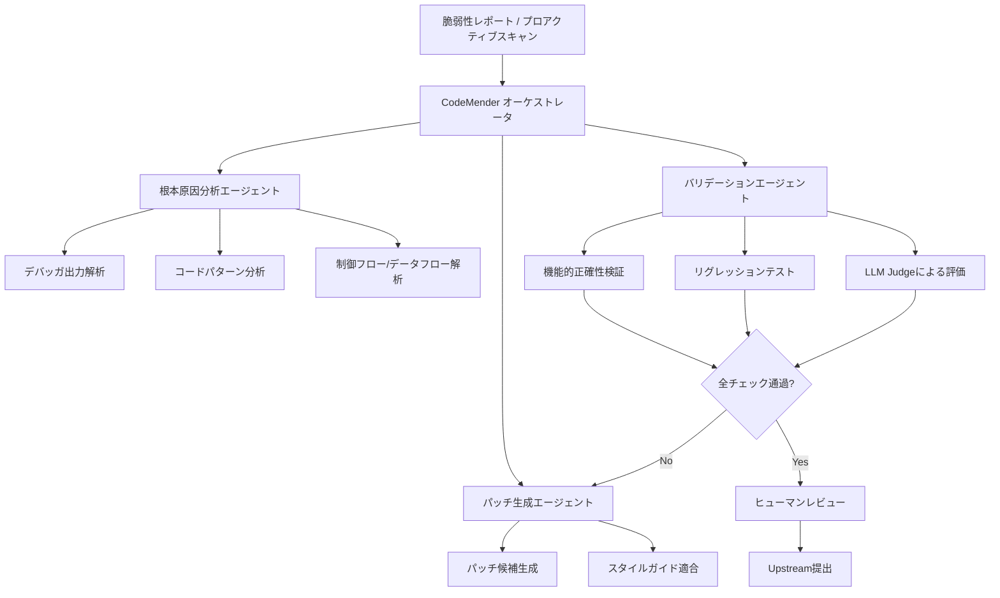

本記事は [Introducing CodeMender: an AI agent for code security](https://deepmind.google/blog/introducing-codemender-an-ai-agent-for-code-security/) の解説記事です。

この記事は [Zenn記事: Claude Code Hooks×Subagents×git worktreeで社内モノレポのコードレビューを並列化する](https://zenn.dev/0h_n0/articles/fd70a29e6b9d6d) の深掘りです。

## ブログ概要（Summary）

Google DeepMindが2025年10月に公開したCodeMenderは、Gemini Deep Thinkモデルを基盤とする自律型コードセキュリティエージェントである。ブログによると、CodeMenderは6ヶ月間で72件のセキュリティ修正をオープンソースプロジェクトにupstreamし、450万行以上のコードベースに対してパッチを適用した実績を持つ。従来のリアクティブな脆弱性修正に加え、既存コードを安全なAPIやデータ構造に書き換えるプロアクティブなアプローチを併用する点が特徴的である。すべてのパッチはヒューマンレビューを経てからupstreamに提出される段階的なロールアウト方針を採っている。

## 情報源

- **種別**: 企業テックブログ
- **URL**: [https://deepmind.google/blog/introducing-codemender-an-ai-agent-for-code-security/](https://deepmind.google/blog/introducing-codemender-an-ai-agent-for-code-security/)
- **組織**: Google DeepMind
- **発表日**: 2025年10月6日

## 技術的背景（Technical Background）

ソフトウェアの脆弱性は、規模の拡大とともに手動対応の限界に直面している。従来の静的解析ツール（SAST）はルールベースで既知のパターンを検出するが、文脈依存の脆弱性や複雑な制御フロー・データフローの問題を見逃すことがある。動的解析やファジングも、テストカバレッジの限界から全ての脆弱性を発見することは困難である。

Google DeepMindは、この課題に対して2つの先行プロジェクトで実績を積んできた。2024年11月には、LLMを活用した脆弱性発見フレームワーク「Big Sleep」（旧称Project Naptime）がSQLiteのゼロデイ脆弱性（スタックバッファアンダーフロー）を発見した。また、OSS-FuzzにLLMを統合したAI支援ファジングでは、272のC/C++プロジェクトにおいて26件の脆弱性を特定し、37万行以上の新規テストコードを生成したとGoogle Security Blogが報告している。CodeMenderは、これらの知見を統合し、脆弱性の「発見」から「修正」までを自律的に実行するエージェントとして開発されたものである。

## 実装アーキテクチャ（Architecture）

### マルチエージェントアーキテクチャ

CodeMenderの中核は、専門化されたエージェントが協調して問題を解決するマルチエージェントアーキテクチャである。ブログによると、CodeMenderは「special-purpose agents」を活用し、各エージェントが問題の特定の側面を担当する設計となっている。



### Gemini Deep Thinkモデルの活用

CodeMenderの推論基盤であるGemini Deep Thinkモデルは、複数の仮説を並行して検討する「拡張思考」能力を持つ。最大100万入力トークンと19.2万出力トークンを処理でき、大規模コードベースの文脈を保持したまま脆弱性の根本原因を分析できる。Google DeepMindの発表によると、このモデルは2025年国際数学オリンピック（IMO）で金メダル水準を達成し、競技プログラミングベンチマーク（LiveCodeBench）でもトップレベルの成績を記録している。CodeMenderでは、この高度な推論能力を脆弱性のデバッグと修正パッチの生成に応用している。

### リアクティブ vs プロアクティブの二重アプローチ

ブログでは、CodeMenderが2つの動作モードを持つことが説明されている。

**リアクティブモード（Reactive）**: 新たに発見された脆弱性に対して、デバッガ出力とソースコードブラウザを用いて根本原因を特定し、修正パッチを生成する。ファジングやSMTソルバーで発見されたクラッシュバグに対して、即座に修正案を提示する運用を想定している。

**プロアクティブモード（Proactive）**: 既存コードをスキャンし、安全でないAPIやデータ構造を、より安全な代替手段に書き換える。具体例として、ブログではlibwebp（画像圧縮ライブラリ）への`-fbounds-safety`コンパイラアノテーション適用が挙げられている。このアノテーションにより、CVE-2023-4863（ヒープバッファオーバーフローを利用したiOSゼロクリックエクスプロイト）と同種の脆弱性を「永久に悪用不可能（unexploitable forever）」にできるとブログは報告している。

### プログラム解析ツール群

CodeMenderは、LLMの推論だけでなく、従来のプログラム解析技術を組み合わせたハイブリッドアプローチを採用している。

| 解析手法 | 用途 | CodeMenderでの役割 |
|---|---|---|
| **静的解析** | コードパターン・制御フロー・データフロー分析 | 脆弱性候補の絞り込みとコード構造理解 |
| **動的解析** | 実行時のメモリ・バッファ挙動の観測 | バッファオーバーフロー等のランタイム脆弱性検出 |
| **ファジング** | ランダム/構造化入力によるクラッシュ発見 | OSS-Fuzzとの連携による未知脆弱性の発見 |
| **SMTソルバー** | 制約充足問題による到達可能性検証 | パッチの正当性を数学的に検証 |
| **差分テスト** | パッチ前後の挙動比較 | 機能リグレッションの検出 |
| **LLM Judge** | 変更の品質評価 | パッチがスタイルガイドに準拠し、機能を保持しているかを評価 |

## Production Deployment Guide

CodeMenderのマルチエージェントアーキテクチャは、企業内のコードセキュリティパイプラインにも応用できる。ここでは、類似のマルチエージェント型脆弱性検出・修復システムをAWS上に構築する場合の実装パターンを示す。

### AWS実装パターン（コスト最適化重視）

CodeMenderと同様の脆弱性検出・修復パイプラインを自社で構築する場合、トラフィック量に応じて3つの構成を推奨する。以下のコスト試算は2026年10月時点のAWS ap-northeast-1（東京）リージョン料金に基づく概算値であり、実際のコストはトラフィックパターン、リージョン、バースト使用量により変動する。最新料金はAWS料金計算ツールでの確認を推奨する。

**Small構成（~100スキャン/日）: Serverless**

| AWSサービス | 用途 | 月額概算 |
|---|---|---|
| Lambda (x86, 1024MB, 300s) | エージェントオーケストレータ | $15-30 |
| Bedrock (Claude Sonnet) | 脆弱性分析・パッチ生成 | $30-80 |
| DynamoDB (On-Demand) | スキャン結果・パッチ履歴 | $5-10 |
| S3 | ソースコード一時保管 | $1-3 |
| Step Functions | マルチエージェント制御 | $5-10 |
| **合計** | | **$56-133** |

**Medium構成（~1000スキャン/日）: Hybrid**

| AWSサービス | 用途 | 月額概算 |
|---|---|---|
| ECS Fargate (2vCPU, 4GB x 3タスク) | 並列エージェント実行 | $150-250 |
| Bedrock (Claude Sonnet + Haiku) | 分析: Sonnet、フィルタ: Haiku | $150-350 |
| Aurora Serverless v2 (0.5-4 ACU) | スキャン結果・コード解析キャッシュ | $50-100 |
| SQS | エージェント間メッセージング | $5-10 |
| CodeBuild | 差分テスト・ビルド検証 | $30-60 |
| **合計** | | **$385-770** |

**Large構成（10000+スキャン/日）: Container**

| AWSサービス | 用途 | 月額概算 |
|---|---|---|
| EKS + Karpenter (Spot優先) | エージェントクラスタ | $800-1,500 |
| Bedrock Batch API | 大量バッチ分析（50%コスト削減） | $500-1,200 |
| Aurora PostgreSQL (db.r6g.xlarge) | メタデータ・結果DB | $300-500 |
| ElastiCache Redis | コード解析キャッシュ | $100-200 |
| CodePipeline + CodeBuild | CI/CDパイプライン統合 | $100-200 |
| **合計** | | **$1,800-3,600** |

**コスト削減テクニック**:
- Spot Instances活用: EKSワーカーノードをSpot優先で起動し、分析ワークロードのコストを最大90%削減
- Reserved Instances: Aurora等の常時稼働リソースに1年コミットで最大72%削減
- Bedrock Batch API: 即時応答不要なバッチ分析で50%削減
- Prompt Caching: 同一リポジトリの繰り返しスキャンでプレフィックスキャッシュを活用し30-90%削減

### Terraformインフラコード

**Small構成（Serverless）: Lambda + Step Functions + Bedrock**

```hcl
# --- VPC基盤（NAT Gateway不使用でコスト削減） ---
resource "aws_vpc" "security_scanner" {
  cidr_block           = "10.0.0.0/16"
  enable_dns_hostnames = true
  tags = { Name = "security-scanner-vpc" }
}

resource "aws_subnet" "private" {
  count             = 2
  vpc_id            = aws_vpc.security_scanner.id
  cidr_block        = cidrsubnet("10.0.0.0/16", 8, count.index)
  availability_zone = data.aws_availability_zones.available.names[count.index]
  tags = { Name = "security-scanner-private-${count.index}" }
}

# --- IAMロール（最小権限） ---
resource "aws_iam_role" "scanner_lambda" {
  name = "security-scanner-lambda-role"
  assume_role_policy = jsonencode({
    Version = "2012-10-17"
    Statement = [{
      Action = "sts:AssumeRole"
      Effect = "Allow"
      Principal = { Service = "lambda.amazonaws.com" }
    }]
  })
}

resource "aws_iam_role_policy" "scanner_permissions" {
  name = "scanner-permissions"
  role = aws_iam_role.scanner_lambda.id
  policy = jsonencode({
    Version = "2012-10-17"
    Statement = [
      {
        Effect   = "Allow"
        Action   = ["bedrock:InvokeModel"]
        Resource = "arn:aws:bedrock:ap-northeast-1::foundation-model/anthropic.claude-*"
      },
      {
        Effect   = "Allow"
        Action   = ["dynamodb:PutItem", "dynamodb:GetItem", "dynamodb:Query"]
        Resource = aws_dynamodb_table.scan_results.arn
      },
      {
        Effect   = "Allow"
        Action   = ["s3:GetObject", "s3:PutObject"]
        Resource = "${aws_s3_bucket.source_code.arn}/*"
      }
    ]
  })
}

# --- Lambda関数（脆弱性分析エージェント） ---
resource "aws_lambda_function" "vulnerability_analyzer" {
  function_name = "vulnerability-analyzer"
  runtime       = "python3.12"
  handler       = "analyzer.handler"
  role          = aws_iam_role.scanner_lambda.arn
  timeout       = 300
  memory_size   = 1024

  environment {
    variables = {
      SCAN_TABLE    = aws_dynamodb_table.scan_results.name
      SOURCE_BUCKET = aws_s3_bucket.source_code.id
      MODEL_ID      = "anthropic.claude-sonnet-4-20250514"
    }
  }

  tracing_config { mode = "Active" }  # X-Ray有効化
}

# --- DynamoDB（On-Demand、KMS暗号化） ---
resource "aws_dynamodb_table" "scan_results" {
  name         = "security-scan-results"
  billing_mode = "PAY_PER_REQUEST"
  hash_key     = "scan_id"
  range_key    = "finding_id"

  attribute {
    name = "scan_id"
    type = "S"
  }
  attribute {
    name = "finding_id"
    type = "S"
  }

  server_side_encryption { enabled = true }
  point_in_time_recovery { enabled = true }
}

# --- CloudWatchアラーム（コスト監視） ---
resource "aws_cloudwatch_metric_alarm" "lambda_cost_alert" {
  alarm_name          = "scanner-lambda-invocations-high"
  comparison_operator = "GreaterThanThreshold"
  evaluation_periods  = 1
  metric_name         = "Invocations"
  namespace           = "AWS/Lambda"
  period              = 3600
  statistic           = "Sum"
  threshold           = 500
  alarm_description   = "Lambda invocations exceed 500/hour"
  dimensions = {
    FunctionName = aws_lambda_function.vulnerability_analyzer.function_name
  }
}
```

**Large構成（Container）: EKS + Karpenter + Spot**

```hcl
# --- EKSクラスタ ---
module "eks" {
  source          = "terraform-aws-modules/eks/aws"
  version         = "~> 20.0"
  cluster_name    = "security-scanner-cluster"
  cluster_version = "1.31"
  vpc_id          = aws_vpc.security_scanner.id
  subnet_ids      = aws_subnet.private[*].id

  cluster_endpoint_public_access = false  # プライベートアクセスのみ
  enable_irsa                    = true

  eks_managed_node_groups = {
    system = {
      instance_types = ["m7g.medium"]
      min_size       = 1
      max_size       = 2
      desired_size   = 1
      labels         = { role = "system" }
    }
  }
}

# --- Karpenter Provisioner（Spot優先、自動スケーリング） ---
resource "kubectl_manifest" "karpenter_nodepool" {
  yaml_body = yamlencode({
    apiVersion = "karpenter.sh/v1"
    kind       = "NodePool"
    metadata   = { name = "scanner-agents" }
    spec = {
      template = {
        spec = {
          requirements = [
            { key = "karpenter.sh/capacity-type", operator = "In", values = ["spot", "on-demand"] },
            { key = "node.kubernetes.io/instance-type", operator = "In",
              values = ["m7g.xlarge", "m7g.2xlarge", "c7g.xlarge", "c7g.2xlarge"] }
          ]
          nodeClassRef = { group = "karpenter.k8s.aws", kind = "EC2NodeClass", name = "default" }
        }
      }
      limits   = { cpu = "64", memory = "128Gi" }
      disruption = {
        consolidationPolicy = "WhenEmptyOrUnderutilized"
        consolidateAfter    = "30s"
      }
    }
  })
}

# --- Secrets Manager（Bedrock設定） ---
resource "aws_secretsmanager_secret" "scanner_config" {
  name                    = "security-scanner/config"
  recovery_window_in_days = 7
}

# --- AWS Budgets（予算アラート） ---
resource "aws_budgets_budget" "scanner_monthly" {
  name         = "security-scanner-monthly"
  budget_type  = "COST"
  limit_amount = "5000"
  limit_unit   = "USD"
  time_unit    = "MONTHLY"

  notification {
    comparison_operator       = "GREATER_THAN"
    threshold                 = 80
    threshold_type            = "PERCENTAGE"
    notification_type         = "ACTUAL"
    subscriber_email_addresses = ["security-team@example.com"]
  }
}
```

### 運用・監視設定

**CloudWatch Logs Insights クエリ（コスト異常検知）**

```
# 1時間あたりのBedrock呼び出し回数とトークン使用量
fields @timestamp, @message
| filter @message like /bedrock/
| stats count() as invocations,
        sum(input_tokens) as total_input_tokens,
        sum(output_tokens) as total_output_tokens
  by bin(1h)
| sort @timestamp desc
```

```
# P95/P99レイテンシ分析
fields @timestamp, duration_ms
| filter event = "vulnerability_scan_complete"
| stats percentile(duration_ms, 95) as p95,
        percentile(duration_ms, 99) as p99,
        avg(duration_ms) as avg_ms
  by bin(1h)
```

**CloudWatch アラーム設定（Python）**

```python
import boto3

cloudwatch = boto3.client("cloudwatch", region_name="ap-northeast-1")

def create_bedrock_token_alarm() -> None:
    """Bedrockトークン使用量スパイク検知アラーム"""
    cloudwatch.put_metric_alarm(
        AlarmName="bedrock-token-spike",
        MetricName="InputTokenCount",
        Namespace="AWS/Bedrock",
        Statistic="Sum",
        Period=3600,
        EvaluationPeriods=1,
        Threshold=500000,
        ComparisonOperator="GreaterThanThreshold",
        AlarmActions=["arn:aws:sns:ap-northeast-1:123456789012:security-alerts"],
        Dimensions=[
            {"Name": "ModelId", "Value": "anthropic.claude-sonnet-4-20250514"}
        ],
    )

def create_lambda_duration_alarm() -> None:
    """Lambda実行時間異常検知アラーム"""
    cloudwatch.put_metric_alarm(
        AlarmName="scanner-lambda-duration-high",
        MetricName="Duration",
        Namespace="AWS/Lambda",
        Statistic="p99",
        Period=300,
        EvaluationPeriods=3,
        Threshold=280000,  # 280秒（タイムアウト300秒の93%）
        ComparisonOperator="GreaterThanThreshold",
        AlarmActions=["arn:aws:sns:ap-northeast-1:123456789012:security-alerts"],
        Dimensions=[
            {"Name": "FunctionName", "Value": "vulnerability-analyzer"}
        ],
    )
```

**X-Ray トレーシング設定（Python）**

```python
from aws_xray_sdk.core import xray_recorder, patch_all
import boto3

# boto3自動計装
patch_all()

xray_recorder.configure(
    sampling=True,
    context_missing="LOG_ERROR",
    daemon_address="127.0.0.1:2000",
)

def analyze_vulnerability(scan_id: str, source_path: str) -> dict:
    """脆弱性分析のトレーシング付き実行

    Args:
        scan_id: スキャン識別子
        source_path: S3上のソースコードパス

    Returns:
        分析結果を含む辞書
    """
    subsegment = xray_recorder.begin_subsegment("vulnerability_analysis")
    subsegment.put_annotation("scan_id", scan_id)
    subsegment.put_metadata("source_path", source_path, "scanner")

    try:
        bedrock = boto3.client("bedrock-runtime")
        # Bedrock呼び出し（X-Rayで自動追跡）
        response = bedrock.invoke_model(
            modelId="anthropic.claude-sonnet-4-20250514",
            body=b'{"prompt": "Analyze..."}',
        )
        subsegment.put_metadata("response_tokens", len(response["body"].read()), "scanner")
        return {"status": "complete", "scan_id": scan_id}
    finally:
        xray_recorder.end_subsegment()
```

**Cost Explorer自動レポート（Python）**

```python
import boto3
from datetime import datetime, timedelta

ce = boto3.client("ce", region_name="us-east-1")
sns = boto3.client("sns", region_name="ap-northeast-1")

def daily_cost_report() -> dict:
    """日次コストレポートを取得しSNS通知

    Returns:
        サービス別コスト情報の辞書
    """
    today = datetime.utcnow().strftime("%Y-%m-%d")
    yesterday = (datetime.utcnow() - timedelta(days=1)).strftime("%Y-%m-%d")

    response = ce.get_cost_and_usage(
        TimePeriod={"Start": yesterday, "End": today},
        Granularity="DAILY",
        Metrics=["BlendedCost"],
        GroupBy=[{"Type": "DIMENSION", "Key": "SERVICE"}],
        Filter={
            "Tags": {
                "Key": "Project",
                "Values": ["security-scanner"],
            }
        },
    )

    costs = {}
    total = 0.0
    for group in response["ResultsByTime"][0]["Groups"]:
        service = group["Keys"][0]
        amount = float(group["Metrics"]["BlendedCost"]["Amount"])
        costs[service] = amount
        total += amount

    # $100/日超過でSNS通知
    if total > 100:
        sns.publish(
            TopicArn="arn:aws:sns:ap-northeast-1:123456789012:cost-alerts",
            Subject=f"Security Scanner Cost Alert: ${total:.2f}/day",
            Message=f"日次コスト: ${total:.2f}\n内訳: {costs}",
        )

    return costs
```

### コスト最適化チェックリスト

**アーキテクチャ選択**:
- [ ] トラフィック量に応じた構成選択（Small: Serverless / Medium: Hybrid / Large: Container）
- [ ] スキャン頻度に応じたバッチ/リアルタイム判断
- [ ] マルチリージョン要否の確認

**リソース最適化**:
- [ ] EC2/EKS: Spot Instances優先（分析は中断耐性あり）
- [ ] Aurora/RDS: Reserved Instances 1年コミット
- [ ] Savings Plans: Compute Savings Plans検討
- [ ] Lambda: メモリサイズのPower Tuningによる最適化
- [ ] ECS/EKS: 夜間・週末のスケールダウン設定

**LLMコスト削減**:
- [ ] Bedrock Batch API: 非同期分析で50%削減
- [ ] Prompt Caching: 同一リポジトリの繰り返しスキャンで30-90%削減
- [ ] モデル選択ロジック: 初期フィルタはHaiku、詳細分析はSonnet/Opus
- [ ] トークン数制限: 入力の最大トークン数を設定しコスト上限を管理
- [ ] コード要約: 大規模ファイルは事前に要約してからLLMに渡す

**監視・アラート**:
- [ ] AWS Budgets: 月額予算アラート設定
- [ ] CloudWatch アラーム: Bedrock呼び出し数・トークン量の異常検知
- [ ] Cost Anomaly Detection: 自動異常検知の有効化
- [ ] 日次コストレポート: Cost Explorer APIで自動取得・SNS通知

**リソース管理**:
- [ ] 未使用リソース削除: 定期的なリソース棚卸し
- [ ] タグ戦略: Project/Environment/Teamタグで精密なコスト追跡
- [ ] ライフサイクルポリシー: S3/ECRの古いオブジェクト自動削除
- [ ] 開発環境: 夜間・週末のリソース自動停止
- [ ] NAT Gateway: VPCエンドポイントで代替しNAT Gateway費用を削減

## パフォーマンス最適化（Performance）

ブログによると、CodeMenderは以下の実績を報告している。

| 指標 | 値 | 備考 |
|---|---|---|
| セキュリティ修正件数 | 72件 | 6ヶ月間の累計 |
| 対応コードベース規模 | 450万行以上 | 最大プロジェクト |
| 運用モード | リアクティブ + プロアクティブ | 二重アプローチ |
| バリデーション方式 | 自動 + ヒューマンレビュー | 全パッチが対象 |

特筆すべき事例として、ブログではlibwebpへの`-fbounds-safety`アノテーション適用を挙げている。libwebpはGoogle ChromeやiOS Safariなどのブラウザで広く使用される画像圧縮ライブラリであり、CVE-2023-4863はこのライブラリのヒープバッファオーバーフロー脆弱性を悪用したiOSゼロクリックエクスプロイトとして知られる。CodeMenderのプロアクティブアプローチによるコンパイラアノテーション適用で、このクラスの脆弱性を構造的に防止できるとブログは主張している。

## 運用での学び（Production Lessons）

CodeMenderの展開から得られる運用上の知見は、AIエージェントを実運用に投入する際の参考になる。

**段階的ロールアウト**: ブログによると、CodeMenderは全パッチ提出前にヒューマンリサーチャーのレビューを必須としている。これは、AIが生成したパッチが意図しない副作用やリグレッションを引き起こすリスクを軽減するためである。「慎重なロールアウト」という方針のもと、重要なオープンソースメンテナーへの段階的なアウトリーチを実施し、フィードバックを反復的に取り入れている。

**メンテナーとの信頼構築**: オープンソースプロジェクトのメンテナーは、外部からのPRに対して慎重な姿勢を取ることが多い。AIが生成したパッチであればなおさらである。CodeMenderチームは、パッチの品質を担保する自動バリデーションメカニズム（機能的正確性の検証、リグレッションテスト、スタイルガイド準拠）を整備することで、メンテナーの審査負担を軽減し、信頼を獲得する戦略を採っている。

**バリデーションの多層化**: パッチが根本原因を修正していること、機能的正確性を維持していること、リグレッションを引き起こさないこと、スタイルガイドに準拠していることを、自動チェックとLLM Judgeの組み合わせで検証する。この多層バリデーションは、関連Zenn記事で紹介されているClaude Code HooksのSubagentStopイベントでのレビュー品質ゲートと設計思想が共通している。

## 学術研究との関連（Academic Connection）

CodeMenderの技術は、自動脆弱性修復（AVR: Automated Vulnerability Repair）の学術研究と密接に関連している。

- **SoK: Automated Vulnerability Repair（USENIX Security 2025, arXiv: 2506.11697）**: Hu et al.による体系的サーベイで、脆弱性分析・パッチ生成・パッチバリデーションの3ステップワークフローを整理している。CodeMenderのマルチエージェントアーキテクチャは、このワークフローの各ステップを専門エージェントに分担させた実装と位置付けられる。

- **Strategic Heterogeneous Multi-Agent Architecture for Code Vulnerability Detection（AAMAS 2026 Workshop, arXiv: 2604.21282）**: Wang et al.が提案した「3+1」アーキテクチャ（3つのクラウドベースエキスパート + 1つのローカル検証器）は、CodeMenderの専門エージェント群とLLM Judgeの構成と類似する設計パターンである。262サンプルで77.2% F1スコア、$0.002/サンプルのコスト効率を報告している。

- **Big Sleep / OSS-Fuzz（Google, 2024）**: CodeMenderの直接的な先行プロジェクトとして、Big SleepがSQLiteのゼロデイ脆弱性を発見し、OSS-FuzzのAI統合が272プロジェクトで26件の脆弱性を特定した実績がある。CodeMenderは、これらの「発見」技術に「修正」能力を追加したものと位置付けられる。

## まとめと実践への示唆

CodeMenderは、マルチエージェントアーキテクチャ、高度な推論モデル、従来のプログラム解析技術を統合した自律型コードセキュリティエージェントである。6ヶ月で72件のセキュリティ修正をupstreamした実績は、AIによるコードセキュリティ自動化の実用性を示している。

関連Zenn記事「Claude Code Hooks x Subagents x git worktreeで社内モノレポのコードレビューを並列化する」で紹介されている、観点別サブエージェント（セキュリティ・パフォーマンス・テスト品質）による並列レビューの設計パターンは、CodeMenderのマルチエージェント構成と共通する思想を持つ。特に、セキュリティレビュー専用エージェント（`review-security.md`）の設計は、CodeMenderの脆弱性分析エージェントと同じ「専門化による精度向上」のアプローチを採用している。CodeMenderの段階的ロールアウトとヒューマンレビュー必須の方針は、AIレビューを導入する際の運用設計として参考にすべきポイントである。

## 参考文献

- **Blog URL**: [Introducing CodeMender: an AI agent for code security](https://deepmind.google/blog/introducing-codemender-an-ai-agent-for-code-security/)
- **Related Coverage**: [Google DeepMind unveils CodeMender (SiliconANGLE)](https://siliconangle.com/2025/10/06/google-deepmind-unveils-codemender-ai-agent-autonomously-patches-software-vulnerabilities/)
- **SoK: Automated Vulnerability Repair (USENIX Security 2025)**: [arXiv:2506.11697](https://arxiv.org/abs/2506.11697)
- **Multi-Agent Architecture for Vulnerability Detection (AAMAS 2026)**: [arXiv:2604.21282](https://arxiv.org/abs/2604.21282)
- **Big Sleep (Google, 2024)**: [Google's AI Tool Big Sleep Finds Zero-Day Vulnerability in SQLite](https://thehackernews.com/2024/11/googles-ai-tool-big-sleep-finds-zero.html)
- **OSS-Fuzz AI (Google, 2024)**: [Google's AI-Powered OSS-Fuzz Tool Finds 26 Vulnerabilities](https://thehackernews.com/2024/11/googles-ai-powered-oss-fuzz-tool-finds.html)
- **Gemini Deep Think**: [Gemini 2.5 Deep Think Model Card](https://storage.googleapis.com/deepmind-media/Model-Cards/Gemini-2-5-Deep-Think-Model-Card.pdf)
- **Related Zenn article**: [Claude Code Hooks x Subagents x git worktreeで社内モノレポのコードレビューを並列化する](https://zenn.dev/0h_n0/articles/fd70a29e6b9d6d)
