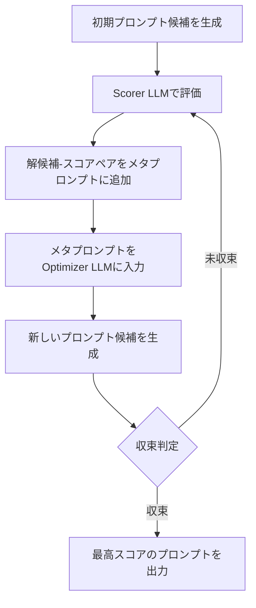

本記事は [Large Language Models as Optimizers](https://arxiv.org/abs/2309.03409) の解説記事です。

この記事は [Zenn記事: 構造化プロンプト設計パターン：CO-STAR×XMLタグ×推論モデル対応の実装手法](https://zenn.dev/0h_n0/articles/78ab36484a8edd) の深掘りです。

## 論文概要（Abstract）

プロンプトの最適化は依然として人手による試行錯誤に大きく依存しており、タスクやモデルが変わるたびに再設計が必要になる。著者らは、LLM自体を最適化エンジンとして活用するフレームワーク「OPRO（Optimization by PROmpting）」を提案している。OPROは、過去に生成した解候補とそのスコアを「メタプロンプト」としてLLMに入力し、より高スコアの新しい解候補を繰り返し生成させる反復的最適化手法である。プロンプト最適化タスクにおいて、GSM8Kで最大8%、Big-Bench Hardの複数タスクで最大50%の精度改善が報告されている（論文Table 2, Table 3より）。

## 情報源

- **arXiv ID**: 2309.03409
- **URL**: [https://arxiv.org/abs/2309.03409](https://arxiv.org/abs/2309.03409)
- **著者**: Chengrun Yang, Xuezhi Wang, Xinyun Chen, et al.（Google DeepMind）
- **発表年**: 2023（ICLR 2024採択）
- **分野**: cs.LG（機械学習）, cs.AI（人工知能）, cs.CL（計算言語学）
- **コード**: [https://github.com/google-deepmind/opro](https://github.com/google-deepmind/opro)

## 背景と動機（Background & Motivation）

LLMの性能はプロンプトの設計に大きく依存する。「Let's think step by step」のような一文の追加がChain-of-Thought推論を誘発し、数十%の精度向上をもたらすことが知られている。しかし、従来のプロンプト設計には以下の問題がある。

第一に、人手による設計は労力がかかり、体系的でない。エンジニアが勘と経験に基づいて試行錯誤を繰り返す必要があり、最適解に到達する保証がない。第二に、モデルやタスクが変わると、以前有効だったプロンプトが機能しなくなる場合がある。第三に、プロンプト空間は離散的で勾配ベースの最適化が直接適用できないため、自動探索が困難である。

著者らは、LLM自体が自然言語で記述された最適化問題を解く能力を持つことに着目し、勾配や連続空間に依存しないプロンプト最適化手法を構築した。この着想は、LLMが「解の生成」と「フィードバックの解釈」の両方を行える唯一の最適化ツールであるという点に基づいている。

## 主要な貢献（Key Contributions）

- **貢献1（LLMによる汎用最適化フレームワーク）**: LLMを最適化エンジンとして活用するOPROフレームワークを提案し、線形回帰や巡回セールスマン問題といった古典的最適化問題でも適用可能であることを示した
- **貢献2（メタプロンプトによる反復最適化）**: 過去の解候補とスコアのペアを時系列順にメタプロンプトに組み込み、LLMに「スコアが改善される方向」の推論を促す仕組みを設計した
- **貢献3（プロンプト最適化への応用と大規模実験）**: GSM8K（数学推論）およびBig-Bench Hard（23タスク）で体系的な実験を行い、人手設計のプロンプトを上回る性能を達成した。特にGSM8KではPaLM 2-Lで80.2%の精度を達成し、人手設計プロンプトの72.4%を大きく上回った（論文Table 2より）

## 技術的詳細（Technical Details）

### OPROの最適化ループ

OPROの最適化プロセスは、optimizer LLM（最適化器）とscorer LLM（評価器）の2つのLLMで構成される。最適化は以下の反復ステップで進行する。

各ステップ$t$において、optimizer LLMはメタプロンプト$M_t$を入力として受け取り、新しい解候補$s_t$を生成する。

$$
s_t = \text{OptimizerLLM}(M_t)
$$

生成された解候補は評価関数$f$によってスコアリングされる。

$$
\text{score}_t = f(s_t, \mathcal{D}_{\text{eval}})
$$

ここで、
- $s_t$: ステップ$t$で生成された解候補（プロンプト最適化の場合はプロンプト文字列）
- $M_t$: ステップ$t$のメタプロンプト（過去の解候補・スコア履歴を含む）
- $f$: 評価関数（プロンプト最適化の場合はタスクの正答率）
- $\mathcal{D}_{\text{eval}}$: 評価用データセット

メタプロンプト$M_t$は以下の要素で構成される。

$$
M_t = [\text{TaskDesc}, \; \{(s_i, \text{score}_i)\}_{i < t}, \; \text{GenInstr}]
$$

ここで、
- $\text{TaskDesc}$: 最適化対象のタスク説明
- $\{(s_i, \text{score}_i)\}_{i < t}$: 過去の解候補とスコアのペア（スコア昇順にソート）
- $\text{GenInstr}$: 「スコアが高くなる新しい解を生成せよ」という指示

著者らは、解候補-スコアのペアをスコア昇順に並べることで、LLMがスコア改善の方向を推論しやすくなると報告している。

### 最適化フロー



### メタプロンプトの構造

メタプロンプトは大きく3つのセクションから成る。以下に、プロンプト最適化タスクにおけるメタプロンプトの構造を示す。

```
[タスク説明]
以下の質問に正しく回答できるような指示文を生成してください。

[入出力例]
Q: ジャネットのアヒルは1日に16個の卵を産む...
A: 56

[過去の解候補とスコア（スコア昇順）]
指示文: "Answer the question."        スコア: 42.5
指示文: "Think carefully."             スコア: 58.3
指示文: "Let's solve step by step."    スコア: 71.2

[生成指示]
上記の指示文とスコアを参考に、より高いスコアを達成できる
新しい指示文を生成してください。
```

著者らは、各ステップで複数の候補（論文では8候補）を生成し、温度パラメータを0.6-1.0に設定することで探索の多様性を確保している。

### Python実装例

以下に、OPROの最適化ループの簡易実装を示す。

```python
from dataclasses import dataclass, field
from typing import Callable


@dataclass
class ScoredPrompt:
    """スコア付きプロンプト候補

    Attributes:
        prompt: プロンプト文字列
        score: 評価スコア（0.0-100.0）
    """
    prompt: str
    score: float


@dataclass
class OPROOptimizer:
    """OPROによるプロンプト最適化器

    Attributes:
        optimizer_llm: 新しいプロンプト候補を生成するLLM呼び出し関数
        scorer: プロンプトを評価してスコアを返す関数
        max_steps: 最大最適化ステップ数
        candidates_per_step: 各ステップで生成する候補数
        history: 過去の解候補とスコアの履歴
    """
    optimizer_llm: Callable[[str], list[str]]
    scorer: Callable[[str], float]
    max_steps: int = 20
    candidates_per_step: int = 8
    history: list[ScoredPrompt] = field(default_factory=list)

    def build_meta_prompt(self, task_description: str) -> str:
        """メタプロンプトを構築する

        Args:
            task_description: 最適化対象のタスク説明

        Returns:
            メタプロンプト文字列
        """
        sorted_history = sorted(self.history, key=lambda x: x.score)

        history_section = "\n".join(
            f"指示文: \"{sp.prompt}\"  スコア: {sp.score:.1f}"
            for sp in sorted_history[-20:]  # 直近20件に制限
        )

        return (
            f"{task_description}\n\n"
            f"[過去の指示文とスコア（スコア昇順）]\n"
            f"{history_section}\n\n"
            f"上記を参考に、より高いスコアを達成する新しい指示文を生成してください。"
        )

    def optimize(self, task_description: str) -> ScoredPrompt:
        """プロンプト最適化を実行する

        Args:
            task_description: 最適化対象のタスク説明

        Returns:
            最高スコアのプロンプト候補
        """
        best = ScoredPrompt(prompt="", score=0.0)

        for step in range(self.max_steps):
            meta_prompt = self.build_meta_prompt(task_description)
            candidates = self.optimizer_llm(meta_prompt)

            for candidate in candidates[:self.candidates_per_step]:
                score = self.scorer(candidate)
                scored = ScoredPrompt(prompt=candidate, score=score)
                self.history.append(scored)

                if score > best.score:
                    best = scored

            # 3ステップ連続でスコアが改善しなければ早期終了
            recent_scores = [sp.score for sp in self.history[-3 * self.candidates_per_step:]]
            if len(recent_scores) >= 3 * self.candidates_per_step:
                if max(recent_scores) <= best.score and step >= 5:
                    break

        return best
```

## 実装のポイント（Implementation）

OPROを実際に運用する際の注意点を以下にまとめる。

**メタプロンプトの履歴サイズ**: 全履歴を含めるとコンテキスト長を超過するため、著者らは直近の上位20件程度に制限している。古いが高スコアの解候補を残すか、直近の解候補を優先するかはタスクに依存する。

**OptimizerとScorerの分離**: 著者らは、optimizer LLMとscorer LLMを別のモデルにすることで、最適化バイアスを軽減できると指摘している。論文の実験では、PaLM 2-LやGPT-4をoptimizer、PaLM 2-Lやtext-bison、GPT-3.5-Turboをscorerとして使用している。

**温度パラメータの設定**: 探索序盤は高温（1.0）で多様な候補を生成し、収束に近づくにつれて低温（0.6）にする戦略が有効である。ただし論文では固定温度での実験が主である。

**評価データの選択**: メタプロンプトに含める入出力例は、全学習データからサンプリングする。著者らは、サンプルサイズが小さすぎるとスコアのばらつきが大きくなり、最適化が不安定になると述べている。

## Production Deployment Guide

OPROのプロンプト最適化パイプラインをAWS上で本番運用する際の構成パターンを示す。なお、以下のコスト試算は2026年10月時点のAWS ap-northeast-1（東京）リージョン料金に基づく概算値であり、実際のコストはトラフィックパターンやバースト使用量により変動する。最新料金はAWS料金計算ツールで確認を推奨する。

### AWS実装パターン（コスト最適化重視）

| 項目 | Small (~100 req/日) | Medium (~1000 req/日) | Large (10000+ req/日) |
|------|---------------------|----------------------|----------------------|
| **構成** | Lambda + Bedrock | ECS Fargate + Bedrock | EKS + Karpenter + Spot |
| **コンピュート** | Lambda 256MB | Fargate 1vCPU/2GB | m5.xlarge Spot |
| **ストレージ** | DynamoDB On-Demand | DynamoDB Provisioned | Aurora Serverless v2 |
| **キャッシュ** | Lambda内メモリ | ElastiCache t3.micro | ElastiCache r6g.large |
| **月額概算** | $50-150 | $300-800 | $2,000-5,000 |

**Small構成の内訳**: Lambda実行（$5-15）、Bedrock API（$30-100）、DynamoDB（$5-15）、CloudWatch（$5-10）、NAT Gateway不使用でコスト削減。

**コスト削減テクニック**:
- **Bedrock Batch API**: 非同期バッチ処理で50%コスト削減。プロンプト最適化は即時応答不要のため最適
- **Prompt Caching**: メタプロンプトの固定部分（タスク説明、入出力例）をキャッシュし30-90%削減
- **Spot Instances**: Large構成でm5.xlarge Spotを使用し最大90%削減（中断時はFargate Spotにフォールバック）
- **Reserved Instances**: 1年コミットで最大72%削減（Medium以上の安定ワークロード向け）

### Terraformインフラコード

**Small構成（Serverless）**:

```hcl
# VPC基盤（NAT Gateway不使用でコスト削減）
module "vpc" {
  source  = "terraform-aws-modules/vpc/aws"
  version = "~> 5.0"

  name = "opro-optimizer-vpc"
  cidr = "10.0.0.0/16"

  azs             = ["ap-northeast-1a", "ap-northeast-1c"]
  private_subnets = ["10.0.1.0/24", "10.0.2.0/24"]
  public_subnets  = ["10.0.101.0/24", "10.0.102.0/24"]

  enable_nat_gateway = false  # コスト削減: VPCエンドポイント使用
}

# IAMロール（最小権限）
resource "aws_iam_role" "opro_lambda" {
  name = "opro-optimizer-lambda-role"

  assume_role_policy = jsonencode({
    Version = "2012-10-17"
    Statement = [{
      Action = "sts:AssumeRole"
      Effect = "Allow"
      Principal = { Service = "lambda.amazonaws.com" }
    }]
  })
}

resource "aws_iam_role_policy" "bedrock_invoke" {
  name = "bedrock-invoke"
  role = aws_iam_role.opro_lambda.id

  policy = jsonencode({
    Version = "2012-10-17"
    Statement = [{
      Effect   = "Allow"
      Action   = ["bedrock:InvokeModel", "bedrock:InvokeModelWithResponseStream"]
      Resource = "arn:aws:bedrock:ap-northeast-1::foundation-model/*"
    }]
  })
}

# Lambda関数
resource "aws_lambda_function" "opro_optimizer" {
  function_name = "opro-prompt-optimizer"
  runtime       = "python3.12"
  handler       = "handler.lambda_handler"
  memory_size   = 256
  timeout       = 900  # 最適化ループは最大15分

  role = aws_iam_role.opro_lambda.arn

  environment {
    variables = {
      DYNAMODB_TABLE     = aws_dynamodb_table.opro_history.name
      MAX_STEPS          = "20"
      CANDIDATES_PER_STEP = "8"
    }
  }
}

# DynamoDB（On-Demand: 低トラフィック向け）
resource "aws_dynamodb_table" "opro_history" {
  name         = "opro-optimization-history"
  billing_mode = "PAY_PER_REQUEST"
  hash_key     = "task_id"
  range_key    = "step_candidate"

  attribute {
    name = "task_id"
    type = "S"
  }

  attribute {
    name = "step_candidate"
    type = "S"
  }

  server_side_encryption { enabled = true }  # KMS暗号化
}

# CloudWatchアラーム（コスト監視）
resource "aws_cloudwatch_metric_alarm" "bedrock_cost" {
  alarm_name          = "opro-bedrock-token-spike"
  comparison_operator = "GreaterThanThreshold"
  evaluation_periods  = 1
  metric_name         = "InputTokenCount"
  namespace           = "AWS/Bedrock"
  period              = 3600
  statistic           = "Sum"
  threshold           = 100000
  alarm_actions       = [aws_sns_topic.alerts.arn]
}

resource "aws_sns_topic" "alerts" {
  name = "opro-cost-alerts"
}
```

**Large構成（Container）**:

```hcl
# EKSクラスタ
module "eks" {
  source  = "terraform-aws-modules/eks/aws"
  version = "~> 20.0"

  cluster_name    = "opro-optimizer-cluster"
  cluster_version = "1.31"

  vpc_id     = module.vpc.vpc_id
  subnet_ids = module.vpc.private_subnets

  cluster_endpoint_public_access = false  # セキュリティ: プライベートのみ
}

# Karpenter Provisioner（Spot優先）
resource "kubectl_manifest" "karpenter_nodepool" {
  yaml_body = yamlencode({
    apiVersion = "karpenter.sh/v1"
    kind       = "NodePool"
    metadata   = { name = "opro-spot-pool" }
    spec = {
      template = {
        spec = {
          requirements = [
            { key = "karpenter.sh/capacity-type", operator = "In", values = ["spot", "on-demand"] },
            { key = "node.kubernetes.io/instance-type", operator = "In",
              values = ["m5.xlarge", "m5a.xlarge", "m6i.xlarge"] }
          ]
        }
      }
      limits   = { cpu = "64", memory = "256Gi" }
      disruption = { consolidationPolicy = "WhenEmptyOrUnderutilized" }
    }
  })
}

# Secrets Manager（Bedrock設定）
resource "aws_secretsmanager_secret" "bedrock_config" {
  name = "opro/bedrock-config"
  kms_key_id = aws_kms_key.opro.id
}

# AWS Budgets（予算アラート）
resource "aws_budgets_budget" "opro_monthly" {
  name         = "opro-monthly-budget"
  budget_type  = "COST"
  limit_amount = "5000"
  limit_unit   = "USD"
  time_unit    = "MONTHLY"

  notification {
    comparison_operator = "GREATER_THAN"
    threshold           = 80
    threshold_type      = "PERCENTAGE"
    notification_type   = "ACTUAL"
    subscriber_email_addresses = ["alerts@example.com"]
  }
}
```

### 運用・監視設定

**CloudWatch Logs Insightsクエリ**（コスト異常検知）:

```
fields @timestamp, @message
| filter @message like /token/
| stats sum(input_tokens) as total_input, sum(output_tokens) as total_output by bin(1h)
| sort @timestamp desc
| limit 24
```

**CloudWatchアラーム設定（Python）**:

```python
import boto3


def create_opro_alarms(sns_topic_arn: str) -> None:
    """OPROパイプライン用のCloudWatchアラームを作成する

    Args:
        sns_topic_arn: 通知先SNSトピックのARN
    """
    cw = boto3.client("cloudwatch", region_name="ap-northeast-1")

    cw.put_metric_alarm(
        AlarmName="opro-lambda-duration-p95",
        MetricName="Duration",
        Namespace="AWS/Lambda",
        Dimensions=[{"Name": "FunctionName", "Value": "opro-prompt-optimizer"}],
        Statistic="p95",
        Period=300,
        EvaluationPeriods=2,
        Threshold=600000,  # 10分超過で警告
        ComparisonOperator="GreaterThanThreshold",
        AlarmActions=[sns_topic_arn],
    )
```

**X-Rayトレーシング設定（Python）**:

```python
from aws_xray_sdk.core import xray_recorder, patch_all


def init_xray_tracing() -> None:
    """X-Rayトレーシングを初期化する"""
    xray_recorder.configure(service="opro-optimizer")
    patch_all()  # boto3を自動計装


def trace_optimization_step(step: int, candidates_count: int, best_score: float) -> None:
    """最適化ステップのトレースを記録する

    Args:
        step: 現在のステップ番号
        candidates_count: 生成した候補数
        best_score: 現時点の最高スコア
    """
    segment = xray_recorder.current_segment()
    segment.put_annotation("optimization_step", step)
    segment.put_metadata("candidates_count", candidates_count)
    segment.put_metadata("best_score", best_score)
```

**Cost Explorer自動レポート（Python）**:

```python
import boto3
from datetime import datetime, timedelta


def get_daily_opro_cost() -> dict[str, float]:
    """OPROパイプラインの日次コストを取得する

    Returns:
        サービス別コストの辞書
    """
    ce = boto3.client("ce", region_name="us-east-1")
    today = datetime.utcnow().strftime("%Y-%m-%d")
    yesterday = (datetime.utcnow() - timedelta(days=1)).strftime("%Y-%m-%d")

    response = ce.get_cost_and_usage(
        TimePeriod={"Start": yesterday, "End": today},
        Granularity="DAILY",
        Metrics=["UnblendedCost"],
        Filter={
            "Tags": {"Key": "Project", "Values": ["opro-optimizer"]}
        },
        GroupBy=[{"Type": "DIMENSION", "Key": "SERVICE"}],
    )

    costs: dict[str, float] = {}
    for group in response["ResultsByTime"][0]["Groups"]:
        service = group["Keys"][0]
        amount = float(group["Metrics"]["UnblendedCost"]["Amount"])
        costs[service] = amount

    total = sum(costs.values())
    if total > 100.0:  # $100/日超過でSNS通知
        sns = boto3.client("sns", region_name="ap-northeast-1")
        sns.publish(
            TopicArn="arn:aws:sns:ap-northeast-1:123456789012:opro-cost-alerts",
            Subject=f"OPRO日次コスト超過: ${total:.2f}",
            Message=f"詳細: {costs}",
        )

    return costs
```

### コスト最適化チェックリスト

**アーキテクチャ選択**:
- [ ] トラフィック量に応じた構成選択（~100 req/日: Serverless、~1000: Hybrid、10000+: Container）
- [ ] プロンプト最適化の実行頻度に基づくバッチ/リアルタイム判断

**リソース最適化**:
- [ ] EC2/EKS: Spot Instances優先（m5/m5a/m6iのマルチAZフリート）
- [ ] Reserved Instances: 1年コミットで安定ワークロードを割引
- [ ] Savings Plans: コンピュート使用量の70%をカバー
- [ ] Lambda: メモリサイズ最適化（Power Tuningで検証）
- [ ] ECS/EKS: アイドル時のスケールダウン（Karpenter consolidation）
- [ ] NAT Gateway不使用: VPCエンドポイントで代替

**LLMコスト削減**:
- [ ] Bedrock Batch API: 非同期最適化ジョブで50%削減
- [ ] Prompt Caching: メタプロンプトの固定部分をキャッシュ（30-90%削減）
- [ ] モデル選択ロジック: scorer LLMに小型モデル（Claude Haiku等）を使用
- [ ] トークン数制限: 履歴を直近20件に制限しコンテキスト長を管理
- [ ] 早期終了: 3ステップ連続で改善なしなら停止

**監視・アラート**:
- [ ] AWS Budgets: 月次予算アラート（80%/100%閾値）
- [ ] CloudWatch: トークン使用量スパイク検知（1時間ごと）
- [ ] Cost Anomaly Detection: 異常支出の自動検知
- [ ] 日次コストレポート: Cost Explorer + SNS通知

**リソース管理**:
- [ ] 未使用リソース削除: 不要なLambdaバージョン/レイヤーの自動削除
- [ ] タグ戦略: `Project=opro-optimizer` タグで全リソースを管理
- [ ] ライフサイクルポリシー: DynamoDBのTTLで古い最適化履歴を自動削除
- [ ] 開発環境夜間停止: EventBridgeスケジュールで非稼働時間のリソース停止
- [ ] S3ライフサイクル: 最適化ログの30日後Glacier移行

## 実験結果（Results）

### GSM8Kでの結果

著者らは、GSM8K（小学校レベルの数学文章題、8,792問）でプロンプト最適化の効果を検証している。論文Table 2より、主要な結果は以下の通りである。

| Scorer Model | 人手設計プロンプト | OPRO最適化プロンプト | 改善幅 |
|-------------|------------------|-------------------|--------|
| PaLM 2-L | 72.4% | 80.2% | +7.8% |
| text-bison | 58.4% | 65.8% | +7.4% |
| GPT-3.5-Turbo | 78.0% | 80.2% | +2.2% |
| GPT-4 | 92.0% | 92.3% | +0.3% |

PaLM 2-Lをscorer、PaLM 2-Lをoptimizerとした場合に最も大きな改善（+7.8ポイント）が得られている。著者らは、すでに高い性能を示すGPT-4では改善幅が小さいが、これはベースラインの精度が92%と高いためであると分析している。

OPROが発見した最良のプロンプトの一つは「Take a deep breath and work on this problem step-by-step.」であり、人手設計の「Let's think step by step.」を上回る性能を示した。

### Big-Bench Hardでの結果

Big-Bench Hard（BBH）の23タスクに対する実験結果（論文Table 3より）では、多くのタスクでOPROが人手設計プロンプトを上回っている。特に改善幅が大きいタスクとして以下が報告されている。

| タスク | ベースライン | OPRO | 改善幅 |
|--------|------------|------|--------|
| Ruin Names | 34% | 84% | +50% |
| Snarks | 52% | 76% | +24% |
| Temporal Sequences | 28% | 52% | +24% |

著者らは、改善幅がタスクの性質に強く依存し、特にベースライン精度が低いタスクで大幅な改善が得られる傾向があると報告している。一方、Object Countingなどの単純なタスクではベースラインが既に高く、改善は限定的であった。

## 実運用への応用（Practical Applications）

Zenn記事「構造化プロンプト設計パターン」で紹介されているCO-STARフレームワークやXMLタグによるプロンプト構造化は、人手による設計パターンの体系化である。OPROはこれを補完する自動最適化アプローチとして位置づけられる。

**具体的な活用シナリオ**: CO-STARフレームワークで構造化されたプロンプトのテンプレート内で、具体的な指示文（Instruction部分）をOPROで最適化する。たとえば、構造は人手で設計し「Context」「Objective」「Style」等の枠組みは固定しつつ、各セクション内の表現をOPROで探索する二段階アプローチが考えられる。

**スケーリングの課題**: OPROの各ステップではoptimizer LLMとscorer LLMの両方を呼び出すため、APIコストが線形に増加する。20ステップ×8候補×評価データ100件で計16,000回のAPI呼び出しが必要となるため、scorer LLMには小型モデルを使用するコスト管理が重要である。

**レイテンシ**: 1回の最適化ループ全体で数分から数十分かかるため、リアルタイム用途には適さない。バッチ処理やオフライン最適化での利用が現実的である。

## 関連研究（Related Work）

- **APE（Automatic Prompt Engineer）**: Zhou et al., 2023。LLMにプロンプトを生成させ、評価関数で選択する手法。OPROとの違いは、APEが1ラウンドの生成・選択であるのに対し、OPROは反復的に履歴を活用して改善を続ける点にある
- **EvoPrompt**: Guo et al., 2024。進化的アルゴリズム（遺伝的アルゴリズム、差分進化）をプロンプト最適化に適用。交叉や突然変異をLLMで実行する。OPROがスコア履歴を直接LLMに与えるのに対し、EvoPromptは進化的操作を明示的に定義する点が異なる
- **DSPy**: Khattab et al., 2023。プロンプトをプログラム的に構成・最適化するフレームワーク。モジュール化されたプロンプトパイプラインの各ステップを自動チューニングする。OPROが単一のプロンプト文字列を最適化するのに対し、DSPyは複数モジュールからなるパイプライン全体を最適化対象とする

## まとめと今後の展望

OPROは、LLM自体を最適化エンジンとして活用することで、人手設計プロンプトを上回る性能を自動的に達成できることを示した。メタプロンプトに過去の解候補とスコアを組み込む仕組みはシンプルながら効果的であり、GSM8Kで最大8%、Big-Bench Hardで最大50%の改善が報告されている。

今後の研究方向として、著者らは複数のタスクを同時に最適化するマルチタスクプロンプト最適化や、プロンプトの構造（CoTの推論ステップ数など）の自動決定を挙げている。また、OPROの反復的最適化アプローチは、プロンプト以外の自然言語で記述可能な最適化問題にも応用可能であり、コード最適化やハイパーパラメータ探索への展開が期待される。

## 参考文献

- **arXiv**: [https://arxiv.org/abs/2309.03409](https://arxiv.org/abs/2309.03409)
- **Code**: [https://github.com/google-deepmind/opro](https://github.com/google-deepmind/opro)
- **Related Zenn article**: [https://zenn.dev/0h_n0/articles/78ab36484a8edd](https://zenn.dev/0h_n0/articles/78ab36484a8edd)
