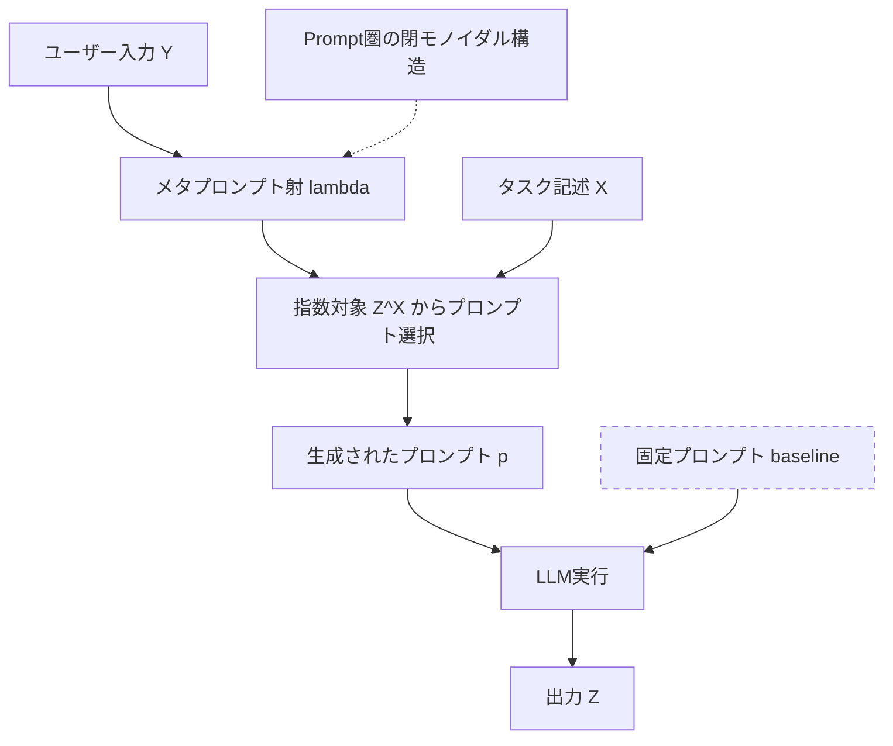

本記事は [On Meta-Prompting](https://arxiv.org/abs/2312.06562) の解説記事です。

この記事は [Zenn記事: 構造化プロンプト設計パターン：CO-STAR×XMLタグ×推論モデル対応の実装手法](https://zenn.dev/0h_n0/articles/78ab36484a8edd) の深掘りです。

## 論文概要（Abstract）

LLMはバックプロパゲーションを使用できず、タスク遂行能力はIn-Context Learning（ICL）に依存する。著者らは圏論に基づく理論フレームワークを構築し、ICLとメタプロンプティング（prompting to obtain prompts）を形式的に定義した。タスク非依存性（task agnosticity）の定理により、単一のメタプロンプトが異なるタスク間で機能することを証明している。GPT-4ユーザー評価でp < 0.01の有意差でメタプロンプティングの優位性が確認されている。

## 情報源

- **arXiv ID**: 2312.06562
- **URL**: [https://arxiv.org/abs/2312.06562](https://arxiv.org/abs/2312.06562)
- **著者**: Adrian de Wynter, Xun Wang, Qilong Gu, Si-Qing Chen
- **発表年**: 2023（v1: 2023年12月、v4: 2026年3月）
- **分野**: cs.CL（計算言語学）, cs.AI（人工知能）, cs.LG（機械学習）, math.CT（圏論）

## 背景と動機（Background & Motivation）

LLMはICLにより新タスクを学習できるが、プロンプトの言い回しに対する高い感度が問題となる。従来のAutoPromptやSelf-Instructはプロンプト自動探索を行うが、「なぜメタプロンプティングが機能するのか」という問いに理論的に答えていない。

著者らは、この理論的空白を圏論で埋めることを目指している。圏論はプログラミング言語の意味論や自然言語処理のcompositionality（合成的意味論）で既に活用されており、プロンプト空間を数学的構造として捉えるのに適している。本研究は、LLMの応用を圏論で形式的に記述した最初の試みであると著者らは報告している。

## 主要な貢献（Key Contributions）

- **貢献1（Prompt圏の定義）**: プロンプトと出力の空間をモノイダル閉圏として形式化し、ICLを圏論の言語で厳密に記述した
- **貢献2（タスク非依存性の定理）**: メタプロンプト射が異なるタスク圏間でファンクタが存在しない場合でも機能すること（task agnosticity）を定理として証明した
- **貢献3（メタプロンプトの同値性）**: 任意の2つのメタプロンプト射の間に射が存在すること（Corollary 3）を示し、メタプロンプティング手法間の等価性を理論的に保証した
- **貢献4（実験的検証）**: GPT-4のユーザー評価でメタ生成プロンプトの有意な優位性（Wilcoxon検定、p < 0.01）を確認した

## 技術的詳細（Technical Details）

### Prompt圏の構成

著者らはPrompt圏 $\mathbf{Prompt}$ を定義している。対象は語彙 $\Sigma$ 上の系列長 $k$ 以下のトークン列の部分集合、射はプロンプト（入力集合から出力集合への変換指示）、恒等射は "Return \{X\}" 形式のプロンプトである。テンソル積 $\otimes$ は文字列連結に対応し、単位元は空文字列 $\varepsilon$ である。

### 閉モノイダル構造と指数対象

Prompt圏が**右閉（right-closed）**であることが本フレームワークの核心である。指数対象 $Z^X$ が定義される。

$$
\mathrm{Hom}_{\mathbf{Prompt}}(X \otimes Y, Z) \cong \mathrm{Hom}_{\mathbf{Prompt}}(Y, Z^X)
$$

ここで、
- $X$: システムプロンプト（タスク記述）の集合
- $Y$: ユーザーコンテンツの集合
- $Z$: 出力テキストの集合
- $Z^X$: $X$から$Z$への変換を実現するプロンプトの集合（指数対象）
- $\mathrm{Hom}(A, B)$: $A$から$B$への射の集合

この同型は、「タスク記述$X$とユーザー入力$Y$を連結して出力$Z$を得る操作」と「ユーザー入力$Y$からタスクに適したプロンプト$Z^X$を選択する操作」が本質的に等価であることを示している。後者がまさにメタプロンプティングの形式化に対応する。

### タスク圏とメタプロンプト射

**タスク圏** $\mathbf{Task}$ はPrompt圏のモノイダル部分圏であり、包含関手 $T: \mathbf{Task} \hookrightarrow \mathbf{Prompt}$ で位置づけられる。自然言語タスク記述（Definition 4）は $\mathbf{Task}$ 内の指数対象 $Z^X$（$Z$ は終対象でない）として定義される。

**メタプロンプト射** $\lambda$ は以下で定式化される。

$$
\lambda: Y \to Z^X
$$

これはユーザーコンテンツ $Y$ からタスク記述空間 $Z^X$ 内の適切なプロンプトを返す操作であり、タスクの逐語的記述に限定されずコンテキスト適応的な指示を生成する点がメタプロンプティングの本質である。

### タスク非依存性定理

**Theorem 2（Task-Agnosticity）**: タスク圏 $\mathbf{Task}_1$ と $\mathbf{Task}_2$ 間にファンクタ $F: \mathbf{Task}_1 \to \mathbf{Task}_2$ が存在しなくても、メタプロンプト射 $\lambda$ は存在する。

$$
\exists \lambda: Y \to Z^X, \quad \forall X_i, Y_i, Z_i \in \mathbf{Task}_i \; (i = 1, 2)
$$

2つのタスクが圏論的に無関係でも単一のメタプロンプト射で対応可能であり、タスク非依存性が理論的に保証される。

**Corollary 3（メタプロンプトの同値性）**: 任意のメタプロンプト射 $\lambda, \lambda'$ 間に射 $f: \lambda \to \lambda'$ が存在する。APEとOPROのような異なる手法が本質的に同等の能力を持つことを示唆している。

### メタプロンプティングのプロセス



メタプロンプト射 $\lambda$ がユーザー入力 $Y$ とタスク記述 $X$ から指数対象 $Z^X$ 内のプロンプトを選択する流れを示している。

### 実装例：メタプロンプティングパイプライン

以下は、論文の理論フレームワークに基づくメタプロンプティングの実装例である。

```python
from dataclasses import dataclass
from openai import OpenAI


@dataclass(frozen=True)
class MetaPromptResult:
    """メタプロンプティングの結果"""
    generated_prompt: str
    final_output: str
    task_description: str


def meta_prompt(
    client: OpenAI,
    user_content: str,
    task_description: str,
    model: str = "gpt-4",
    num_candidates: int = 3,
) -> list[MetaPromptResult]:
    """メタプロンプティングパイプラインを実行する

    Args:
        client: OpenAI APIクライアント
        user_content: ユーザー入力テキスト（圏論上のY）
        task_description: タスクの記述（圏論上のX）
        model: 使用するモデル名
        num_candidates: 生成するプロンプト候補数

    Returns:
        MetaPromptResultのリスト（候補数分）
    """
    # Step 1: メタプロンプト射 λ: Y → Z^X の適用
    meta_system = (
        "You are a prompt engineer. Given a task description and user content, "
        "generate an optimized prompt contextualized to the content."
    )
    meta_user = (
        f"Task: {task_description}\nContent: {user_content}\n"
        f"Generate {num_candidates} prompts, each prefixed with 'PROMPT:'"
    )
    meta_resp = client.chat.completions.create(
        model=model,
        messages=[
            {"role": "system", "content": meta_system},
            {"role": "user", "content": meta_user},
        ],
        temperature=0.9,
    )

    # Step 2: 候補パース → Step 3: 各候補で最終出力生成
    raw = meta_resp.choices[0].message.content or ""
    candidates = [
        l.removeprefix("PROMPT:").strip()
        for l in raw.splitlines() if l.strip().startswith("PROMPT:")
    ][:num_candidates]

    results: list[MetaPromptResult] = []
    for prompt in candidates:
        resp = client.chat.completions.create(
            model=model,
            messages=[
                {"role": "system", "content": prompt},
                {"role": "user", "content": user_content},
            ],
            temperature=0.7,
        )
        results.append(MetaPromptResult(
            generated_prompt=prompt,
            final_output=resp.choices[0].message.content or "",
            task_description=task_description,
        ))
    return results
```

## 実装のポイント（Implementation）

メタプロンプティングを実運用に適用する際の注意点を以下に整理する。

**temperature設定**: プロンプト生成段階では高temperature（0.8-1.0）で多様な候補を生成し、最終出力では低temperature（0.3-0.7）で精度を確保する。

**候補数とコスト**: 論文では3候補を使用。候補増加はAPIコストと線形に増加するため、DynamoDBキャッシュと組み合わせて同一タスクの再生成を回避する設計が必要である。

**タスク記述の粒度**: 逐語的記述よりも、目的・制約・出力形式を含む構造化記述が有効であり、Zenn記事のCO-STARフレームワークと整合する。

**評価自動化**: LLM-as-a-Judgeによる自動評価パイプラインでメタ生成プロンプトの品質をモニタリングする。

## Production Deployment Guide

メタプロンプティングは2段階のLLM呼び出しが発生するため、コスト管理が特に重要である。

### AWS実装パターン（コスト最適化重視）

**トラフィック量別の推奨構成**（記事生成時点の東京リージョン概算。実コストはトラフィックパターンやバースト量により変動するため、最新料金はAWS料金計算ツールで確認を推奨）:

| 規模 | 構成 | 月額概算 | 主要サービス |
|------|------|---------|-------------|
| Small (~100 req/日) | Serverless | $80-200 | Lambda + Bedrock + DynamoDB |
| Medium (~1,000 req/日) | Hybrid | $500-1,200 | ECS Fargate + Bedrock + ElastiCache |
| Large (10,000+ req/日) | Container | $3,000-7,000 | EKS + Spot + Bedrock Batch API |

**Small構成の内訳**: Lambda $5/月、Bedrock Sonnetトークン $60-150/月、DynamoDB On-Demand $5/月、CloudWatch $10/月。

**コスト削減テクニック**:
- Prompt Caching: 同一タスク記述のメタプロンプト結果をDynamoDBにキャッシュし、Bedrock呼び出しを50-70%削減
- Bedrock Batch API: 非同期許容のワークロードで50%のコスト削減
- モデル選択ロジック: メタプロンプト生成にはClaude Sonnet、最終出力にはHaikuを使い分けることでコスト最適化
- Spot Instances: Large構成でEKSノードにSpotを活用し最大90%削減

### Terraformインフラコード

**Small構成（Serverless）**:

```hcl
# Lambda + Bedrock + DynamoDB（最小権限IAM）
resource "aws_iam_role" "meta_prompt_lambda" {
  name = "meta-prompt-lambda-role"
  assume_role_policy = jsonencode({
    Version = "2012-10-17"
    Statement = [{ Action = "sts:AssumeRole", Effect = "Allow",
      Principal = { Service = "lambda.amazonaws.com" } }]
  })
}

resource "aws_iam_role_policy" "bedrock_invoke" {
  name   = "bedrock-invoke"
  role   = aws_iam_role.meta_prompt_lambda.id
  policy = jsonencode({
    Version = "2012-10-17"
    Statement = [{ Effect = "Allow", Action = ["bedrock:InvokeModel"],
      Resource = "arn:aws:bedrock:ap-northeast-1::foundation-model/anthropic.claude-*" }]
  })
}

resource "aws_dynamodb_table" "prompt_cache" {
  name         = "meta-prompt-cache"
  billing_mode = "PAY_PER_REQUEST"
  hash_key     = "task_hash"
  range_key    = "created_at"
  attribute { name = "task_hash"; type = "S" }
  attribute { name = "created_at"; type = "N" }
  ttl { attribute_name = "expires_at"; enabled = true }
  server_side_encryption { enabled = true }
}

resource "aws_lambda_function" "meta_prompt" {
  function_name = "meta-prompt-generator"
  runtime       = "python3.12"
  handler       = "handler.lambda_handler"
  role          = aws_iam_role.meta_prompt_lambda.arn
  timeout       = 60
  memory_size   = 256
  environment {
    variables = {
      CACHE_TABLE = aws_dynamodb_table.prompt_cache.name
      BEDROCK_MODEL = "anthropic.claude-sonnet-4-20250514"
      NUM_CANDIDATES = "3"
    }
  }
}
```

**Large構成（Container）**:

```hcl
# EKS + Karpenter + Spot Instances
module "eks" {
  source          = "terraform-aws-modules/eks/aws"
  version         = "~> 20.0"
  cluster_name    = "meta-prompt-cluster"
  cluster_version = "1.31"
  vpc_id          = module.vpc.vpc_id
  subnet_ids      = module.vpc.private_subnets
  cluster_endpoint_public_access = false
}

resource "kubectl_manifest" "karpenter_provisioner" {
  yaml_body = yamlencode({
    apiVersion = "karpenter.sh/v1"
    kind       = "NodePool"
    metadata   = { name = "meta-prompt-pool" }
    spec = {
      template.spec.requirements = [
        { key = "karpenter.sh/capacity-type", operator = "In",
          values = ["spot", "on-demand"] },
        { key = "node.kubernetes.io/instance-type", operator = "In",
          values = ["m6i.xlarge", "m6a.xlarge", "m7i.xlarge"] },
      ]
      limits     = { cpu = "100", memory = "400Gi" }
      disruption = { consolidationPolicy = "WhenEmptyOrUnderutilized" }
    }
  })
}

resource "aws_budgets_budget" "monthly" {
  name         = "meta-prompt-monthly"
  budget_type  = "COST"
  limit_amount = "5000"
  limit_unit   = "USD"
  time_unit    = "MONTHLY"
  notification {
    comparison_operator       = "GREATER_THAN"
    threshold                 = 80
    threshold_type            = "PERCENTAGE"
    notification_type         = "ACTUAL"
    subscriber_sns_topic_arns = [aws_sns_topic.alerts.arn]
  }
}
```

### 運用・監視設定

**CloudWatch Logs Insights クエリ**（トークン使用量の異常検知）:

```
fields @timestamp, @message
| filter @message like /token_usage/
| stats sum(input_tokens) as total_input, sum(output_tokens) as total_output,
        count(*) as request_count by bin(1h)
| filter total_input > 500000
| sort @timestamp desc
```

**CloudWatch アラーム・X-Ray設定**:

```python
import boto3
from aws_xray_sdk.core import xray_recorder, patch_all
from datetime import date, timedelta


def create_meta_prompt_alarms(sns_topic_arn: str) -> None:
    """メタプロンプティング用CloudWatchアラームを作成する

    Args:
        sns_topic_arn: 通知先SNSトピックARN
    """
    cw = boto3.client("cloudwatch", region_name="ap-northeast-1")
    cw.put_metric_alarm(
        AlarmName="meta-prompt-invocation-spike",
        MetricName="InvocationCount",
        Namespace="AWS/Bedrock",
        Statistic="Sum",
        Period=3600,
        EvaluationPeriods=1,
        Threshold=1000,
        ComparisonOperator="GreaterThanThreshold",
        AlarmActions=[sns_topic_arn],
    )


def init_tracing() -> None:
    """X-Rayトレーシングを初期化する"""
    xray_recorder.configure(service="meta-prompt-service")
    patch_all()


def daily_cost_report() -> dict[str, float]:
    """日次コストをサービス別に取得する

    Returns:
        サービス別コストの辞書
    """
    ce = boto3.client("ce", region_name="us-east-1")
    today = date.today()
    resp = ce.get_cost_and_usage(
        TimePeriod={"Start": str(today - timedelta(days=1)), "End": str(today)},
        Granularity="DAILY",
        Metrics=["UnblendedCost"],
        GroupBy=[{"Type": "DIMENSION", "Key": "SERVICE"}],
    )
    return {
        g["Keys"][0]: float(g["Metrics"]["UnblendedCost"]["Amount"])
        for g in resp["ResultsByTime"][0]["Groups"]
        if float(g["Metrics"]["UnblendedCost"]["Amount"]) > 0
    }
```

### コスト最適化チェックリスト

**アーキテクチャ選択**: トラフィック量で判断（Serverless / Hybrid / Container）。2段階LLM呼び出しのコスト増を試算に含める。

**リソース最適化**: Spot Instances優先（最大90%削減）、Reserved Instances 1年コミット（最大72%削減）、Savings Plans検討、Lambda PowerTuningで256MB基準最適化、ECS/EKS夜間スケールダウン。

**LLMコスト削減**: Bedrock Batch APIで50%削減、DynamoDBプロンプトキャッシュ、メタ生成にSonnet・最終出力にHaikuの使い分け、max_tokens制限、キャッシュヒット時の再生成スキップ。

**監視・アラート**: AWS Budgets月額80%アラート、CloudWatch InvocationCountスパイク検知、Cost Anomaly Detection、日次Cost Explorerレポート+SNS通知。

**リソース管理**: 未使用NAT Gateway削除、Environment/Service/Ownerタグ必須、DynamoDB TTLキャッシュ自動削除、開発環境夜間停止（EventBridge）、CloudWatch Logs保持30日制限。

## 実験結果（Results）

著者らはGPT-4（gpt-4-0613）を用いたユーザー評価実験を実施している。Creativity（文章補完）とIdeation（テキスト改善提案）の2タスクについて、WikiText-103・TOEFL11・CNN/DailyMailから各300サンプルを使用。3名のプロフェッショナルアノテーターがメタ生成プロンプト3件とベースライン3件のランキングを付与した。

**結果**（論文Figure 1, 2より）:

| タスク | 評価対象 | メタ生成がTop-3にランク | 統計的検定 |
|--------|---------|----------------------|-----------|
| Creativity | プロンプト適切性 | 70% | p < 0.01 (Wilcoxon) |
| Creativity | 出力品質 | 61% | p < 0.01 (Wilcoxon) |
| Ideation | プロンプト適切性 | 70% | p < 0.01 (Wilcoxon) |
| Ideation | 出力品質 | 61% | p < 0.01 (Wilcoxon) |

著者らは、ベースラインの固定タスク記述が一貫して最低ランキングに集中すると報告している。メタプロンプティングの有効性は、コンテキストに適応した指示生成から得られ、プロンプト品質と出力品質の双方で有意差が確認されている。

## 実運用への応用（Practical Applications）

本論文のフレームワークは、Zenn記事で解説しているCO-STARフレームワークやXMLタグを使った構造化プロンプト設計と密接に関連する。

CO-STARの各要素は圏論的にはタスク記述 $X$ の構造化された分解に対応する。Corollary 3は、CO-STAR形式と他の構造化フォーマットが理論的に等価であることを示唆しており、フォーマットよりもコンテキスト適応が重要であるという実務的知見を裏付けている。

プロダクション環境では、ユーザー入力特性に応じた動的プロンプト生成、メタ生成候補のA/Bテスト自動化、タスク非依存性に基づくマルチタスク対応（要約・翻訳・分類を単一システムで処理）といったパターンが有効である。コスト面では2段階LLM呼び出しにより2-3倍のトークン消費となるため、キャッシュとモデル使い分けが鍵となる。

## 関連研究（Related Work）

- **OPRO（Yang et al., 2023）**: LLMをオプティマイザとしてプロンプトを反復改善する手法。本論文のフレームワークではメタプロンプト射の一種として包含される
- **APE（Zhou et al., 2023）**: LLMにプロンプト候補を生成・評価させる手法。Corollary 3はAPEとOPROが理論的に同等であり、違いは候補探索戦略にあることを示唆する
- **DSPy（Khattab et al., 2023）**: プロンプトを宣言的プログラムとして記述しコンパイラで最適化するフレームワーク。圏論とは異なる抽象化レベルで同様の問題に取り組んでいる
- **Self-Instruct（Wang et al., 2023）**: 自己生成した指示でfine-tuningデータを作成する手法。ICL内で完結するメタプロンプティングとはパラメータ更新の有無で本質的に異なる

## まとめと今後の展望

本論文はメタプロンプティングを圏論で初めて形式化し、タスク非依存性と同値性を定理として証明した。GPT-4ユーザー評価でp < 0.01の有意差を確認している。実務的には、プロンプト設計をコンテキスト適応的な生成へ移行させる理論的根拠を提供し、CO-STARやXMLタグ設計パターンの有効性を支持している。

著者らは今後の方向性として、Markov圏による確率的モデル化、FinVectによるトークン埋め込みの形式化、Chain-of-Thought推論への拡張を挙げている。

## 参考文献

- **arXiv**: [https://arxiv.org/abs/2312.06562](https://arxiv.org/abs/2312.06562)
- **Related Zenn article**: [https://zenn.dev/0h_n0/articles/78ab36484a8edd](https://zenn.dev/0h_n0/articles/78ab36484a8edd)
- Yang, C. et al. (2023). "Large Language Models as Optimizers." arXiv:2309.03409
- Zhou, Y. et al. (2023). "Large Language Models Are Human-Level Prompt Engineers." ICLR 2023
- Khattab, O. et al. (2023). "DSPy: Compiling Declarative Language Model Calls into Self-Improving Pipelines." arXiv:2310.03714
- Wang, Y. et al. (2023). "Self-Instruct: Aligning Language Models with Self-Generated Instructions." ACL 2023
