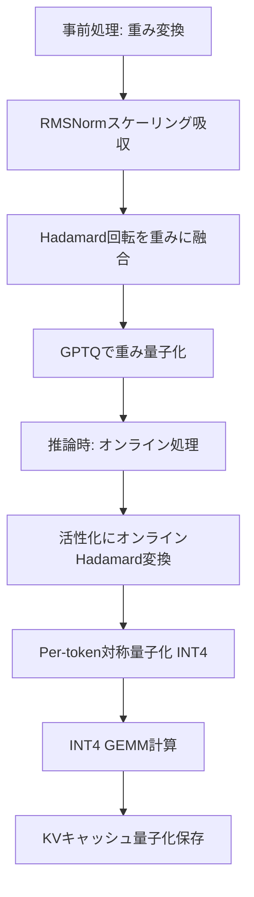

## 論文概要（Abstract）

本記事は [arXiv:2404.00456](https://arxiv.org/abs/2404.00456) の解説記事です。

LLMの推論効率化において量子化は重要な手法であるが、活性化値に出現する**アウトライア（外れ値）**が低ビット量子化の精度劣化の主因となっている。QuaRotは直交回転変換（randomized Hadamard変換）を用いて隠れ状態からアウトライアを除去し、モデル出力を保存したまま**重み・活性化・KVキャッシュの全テンソルを4ビットで量子化**する手法である。著者らはLLaMa2-70Bにおいて、WikiText-2パープレキシティの劣化を最大0.47に抑えつつゼロショット性能の99%を維持したと報告している。さらに、キャリブレーションデータなしのround-to-nearest（RTN）量子化でも6/8ビットでロスレスな量子化を実現する。

この記事は [Zenn記事: Ollama v0.35×エアギャップ環境で構築するデータ主権対応オンプレLLM推論基盤](https://zenn.dev/0h_n0/articles/88a1c8d7becfce) の深掘りです。

## 情報源

- **arXiv ID**: 2404.00456
- **URL**: [https://arxiv.org/abs/2404.00456](https://arxiv.org/abs/2404.00456)
- **著者**: Saleh Ashkboos, Amirkeivan Mohtashami, Maximilian L. Croci et al.（ETH Zurich, IST Austria）
- **発表年**: 2024（2024年3月投稿、2024年10月改訂）
- **分野**: cs.LG（Machine Learning）
- **実装**: [https://github.com/spcl/QuaRot](https://github.com/spcl/QuaRot)

## 背景と動機（Background & Motivation）

LLMの推論において、メモリ帯域幅とVRAM容量がボトルネックとなる。70Bパラメータモデルをfloat16で保持するには約140GBのVRAMが必要であり、コンシューマGPUでの実行は現実的ではない。量子化はパラメータのビット幅を削減することで、VRAM使用量を4分の1（4ビット）に圧縮し、メモリ帯域幅も削減できる。

しかし、LLMの活性化値（hidden states）には**アウトライアチャネル**が出現する。特定のチャネルで他のチャネルの数十倍〜数百倍の大きさの値が現れ、この分布の偏りが均一な低ビット量子化を困難にしている。SmoothQuantはこのアウトライアを重みと活性化の間で「なめらかに」分散させる手法であるが、完全な除去は達成できない。AWQやGPTQは重み側の量子化精度を改善するが、活性化の量子化には対応していない。QUIK-4BやAtomはアウトライアチャネルを高精度（FP16）で保持する混合精度方式を採用するが、実装の複雑さと全チャネル均一処理ができない制約を持つ。

QuaRotは、**直交回転によってアウトライアそのものを除去する**というアプローチでこの問題を根本的に解決する。回転変換後の活性化値は均一な分布を持つため、混合精度を必要とせず全チャネルを同一の4ビットで量子化できる。

## 主要な貢献（Key Contributions）

- **回転によるアウトライア除去**: Hadamard変換を用いてLLMの隠れ状態からアウトライアを除去し、出力を変えずに活性化分布を均一化する手法を提案
- **完全4ビット推論（W4A4KV4）**: 重み、活性化、KVキャッシュの全テンソルを4ビットで量子化する初の手法。アウトライアチャネルのFP16保持が不要
- **ロスレス6/8ビット量子化**: キャリブレーションデータなしのRTN量子化で、6ビット以上では実質的にロスレスな量子化を達成
- **効率的な実装**: CUTLASS INT4 GEMMカーネルとFlashInfer KV量子化を組み合わせ、プリフィル段階で最大3.33倍の高速化、デコーディング段階で最大3.89倍のメモリ削減を実現

## 技術的詳細（Technical Details）

### 計算不変性（Computational Invariance）

QuaRotの数学的基盤は、RMSNormの**回転不変性**にある。直交行列 $\mathbf{Q}$（$\mathbf{Q}^T\mathbf{Q} = \mathbf{I}$）に対し、以下の性質が成立する。

$$
\text{RMSNorm}(\mathbf{X}) = \text{RMSNorm}(\mathbf{X}\mathbf{Q}^T)\mathbf{Q}
$$

ここで、
- $\mathbf{X}$: 入力テンソル（形状: `(batch_size, seq_len, d_model)`）
- $\mathbf{Q}$: 直交行列（$d_\text{model} \times d_\text{model}$）
- $\mathbf{I}$: 単位行列

この性質により、Transformer層間の重みに $\mathbf{Q}$ を融合させることで、推論時の出力を一切変えずに隠れ状態の分布を変換できる。具体的には、ある層の出力重み $\mathbf{W}_\text{out}$ に $\mathbf{Q}$ を右から乗じ、次の層の入力重み $\mathbf{W}_\text{in}$ に $\mathbf{Q}^T$ を左から乗じれば、$\mathbf{Q}$ と $\mathbf{Q}^T$ が打ち消し合い、最終出力は不変となる。

$$
\mathbf{W}_\text{out} \leftarrow \mathbf{W}_\text{out} \cdot \mathbf{Q}, \quad \mathbf{W}_\text{in} \leftarrow \mathbf{Q}^T \cdot \text{diag}(\boldsymbol{\alpha}) \cdot \mathbf{W}_\text{in}
$$

ここで $\boldsymbol{\alpha}$ はRMSNormのスケーリングパラメータであり、隣接する重みに吸収される。

### Hadamard回転行列

QuaRotは直交行列として**Walsh-Hadamard行列**を使用する。2次元の基本Hadamard行列は以下の通りである。

$$
\mathbf{H}_2 = \frac{1}{\sqrt{2}}\begin{pmatrix} 1 & 1 \\ 1 & -1 \end{pmatrix}
$$

$d = 2^n$ の場合、再帰的にKronecker積で構成する。

$$
\mathbf{H}_{2^n} = \mathbf{H}_2 \otimes \mathbf{H}_{2^{n-1}}
$$

$d$ が2のべき乗でない場合は、$d = 2^n \cdot m$ と分解し $\mathbf{H}_d = \mathbf{H}_{2^n} \otimes \mathbf{H}_m$ とする（$\mathbf{H}_m$ は既知のHadamard行列）。

Hadamard行列の重要な性質は以下の2点である。

1. **直交性**: $\mathbf{H}^T\mathbf{H} = \mathbf{I}$（回転は可逆）
2. **高速計算**: Fast Walsh-Hadamard Transform（FWHT）により $O(d \log d)$ で計算可能（密行列積の $O(d^2)$ より高速）

さらに、**randomized Hadamard行列** $\tilde{\mathbf{H}} = \mathbf{H} \cdot \text{diag}(\mathbf{s})$（$\mathbf{s} \in \{+1, -1\}^d$）を使用することで、アウトライアの均一分散をより確実にする。直感的には、アウトライアを持つベクトル $\mathbf{x}$ に $\tilde{\mathbf{H}}$ を乗じると、大きな値が全次元に均等に分散される。

### QuaRotパイプライン

QuaRotの処理は2段階に分かれる。



#### Stage 1: 重み変換（オフライン）

1. **RMSNormスケーリング吸収**: 各RMSNorm層のスケーリングパラメータ $\text{diag}(\boldsymbol{\alpha})$ を隣接する重み行列に吸収する
2. **Hadamard回転融合**: 入力重みに $\mathbf{Q}^T$ を、出力重みに $\mathbf{Q}$ を乗じて回転を融合する
3. **FFN Down-projection融合**: FFNのdown-projection重みにHadamard行列を融合する: $\mathbf{W}_\text{down} \leftarrow \mathbf{H} \cdot \mathbf{W}_\text{down}$
4. **Attention head-wise回転**: Value投影とOutput投影にhead-wiseのHadamard行列を融合する:

$$
\mathbf{W}_v^{(h)} \leftarrow \mathbf{W}_v^{(h)} \cdot \mathbf{H}_{d_h}, \quad \mathbf{W}_o^{(h)} \leftarrow \mathbf{H}_{d_h} \cdot \mathbf{W}_o^{(h)}
$$

ここで $d_h$ はヘッドごとの次元数である。

5. **GPTQ重み量子化**: 変換後の重みにGPTQを適用して4ビットに量子化する

#### Stage 2: オンライン推論

推論時には、融合できなかったHadamard変換を**オンラインで適用**する。

1. **FFN活性化**: SiLU関数の出力にHadamard変換を適用してからdown-projectionに入力する
2. **Key/Query回転**: RoPE（Rotary Position Embedding）適用後にhead-wiseのHadamard変換を適用する: $\mathbf{Q} \leftarrow \text{Pos}(\mathbf{X}\mathbf{W}_q) \cdot (\mathbf{I} \otimes \mathbf{H}_{d_h})$
3. **活性化量子化**: per-token対称量子化でINT4に変換する

### 量子化方式の詳細

**重み量子化**にはGPTQを使用する。per-column対称量子化で、クリッピング比率は二乗誤差の線形探索で決定する。128サンプルのキャリブレーションデータ（WikiText-2、2048トークン）を使用し、A100 GPUで約2時間で完了する。

**活性化量子化**はper-token対称量子化を採用する。

$$
\text{scale} = \frac{\max(|\mathbf{x}|) \cdot r}{2^{b-1} - 1}
$$

ここで $\mathbf{x}$ はトークンごとの活性化ベクトル、$r = 0.9$ はクリッピング比率、$b = 4$ はビット数である。

**KVキャッシュ量子化**にはグループ単位の非対称量子化を使用する。グループサイズ128、クリッピング比率0.95で、デコーディング時にキャッシュされたkey/valueを脱量子化してからattention計算を行う。

### SmoothQuant・AWQとの比較

| 手法 | 重み量子化 | 活性化量子化 | KVキャッシュ | アウトライア処理 |
|------|-----------|-------------|-------------|---------------|
| SmoothQuant | RTN | 対応 | 非対応 | スケーリング分散 |
| AWQ | 重み保護 | 非対応 | 非対応 | 重要チャネル保護 |
| QUIK-4B | GPTQ | 対応 | 非対応 | FP16保持（256ch） |
| Atom | GPTQ | 対応 | 非対応 | FP16保持（128ch） |
| **QuaRot** | **GPTQ** | **対応** | **対応** | **回転で除去（0ch）** |

QuaRotの決定的な優位点は、アウトライアチャネルをFP16で保持する必要がなく、**全チャネルを均一にINT4で処理**できることである。これにより、混合精度GEMMカーネルの複雑さを回避し、純粋なINT4 GEMMで高い演算効率を達成する。

### 擬似コード実装

```python
import torch
import torch.nn.functional as F


def hadamard_transform(x: torch.Tensor, scale: float = 1.0) -> torch.Tensor:
    """Fast Walsh-Hadamard Transform (FWHT)

    Args:
        x: 入力テンソル、最終次元が2のべき乗 (batch, ..., d)
        scale: スケーリング係数（正規化用）

    Returns:
        Hadamard変換後のテンソル (batch, ..., d)
    """
    d = x.shape[-1]
    h = 1
    while h < d:
        # バタフライ演算: 隣接ペアの加算と減算
        x_even = x[..., 0::2*h, :]  # 偶数インデックス
        x_odd = x[..., 1::2*h, :]   # 奇数インデックス
        x = torch.cat([x_even + x_odd, x_even - x_odd], dim=-1)
        h *= 2
    return x * (scale / d**0.5)


def quarot_quantize_activation(
    x: torch.Tensor,
    bits: int = 4,
    clip_ratio: float = 0.9,
) -> tuple[torch.Tensor, torch.Tensor]:
    """QuaRot式per-token対称量子化

    Args:
        x: 活性化テンソル (batch, seq_len, d_model)
        bits: 量子化ビット数
        clip_ratio: クリッピング比率

    Returns:
        量子化値と逆量子化用スケール
    """
    qmax = 2 ** (bits - 1) - 1  # INT4: 7
    # per-tokenスケール計算
    abs_max = x.abs().amax(dim=-1, keepdim=True)  # (batch, seq, 1)
    scale = (abs_max * clip_ratio) / qmax
    scale = scale.clamp(min=1e-8)
    # 量子化 & クランプ
    x_q = torch.round(x / scale).clamp(-qmax, qmax).to(torch.int8)
    return x_q, scale


def quarot_rotate_and_quantize(
    x: torch.Tensor,
    sign_vector: torch.Tensor,
    bits: int = 4,
) -> tuple[torch.Tensor, torch.Tensor]:
    """Hadamard回転 + 量子化のパイプライン

    Args:
        x: 活性化テンソル (batch, seq_len, d_model)
        sign_vector: randomized Hadamard用の符号ベクトル (d_model,)
        bits: 量子化ビット数

    Returns:
        量子化された活性化値とスケール
    """
    # Step 1: Randomized Hadamard変換
    x_rotated = x * sign_vector  # diag(s)を適用
    x_rotated = hadamard_transform(x_rotated)

    # Step 2: Per-token対称量子化
    x_q, scale = quarot_quantize_activation(x_rotated, bits=bits)
    return x_q, scale
```

## 実装のポイント（Implementation）

QuaRotを既存フレームワークに統合する際の実践的な注意点を示す。

**重み変換の前処理**: モデル変換（Stage 1）はオフラインで5分程度で完了する。Hadamard回転の融合は重みの書き換えのみであり、モデルアーキテクチャの変更は不要である。著者らの公開実装（[github.com/spcl/QuaRot](https://github.com/spcl/QuaRot)）では、HuggingFace Transformersのモデルに対して直接適用できる。

**FP16 Hadamard変換の許容性**: オンラインHadamard変換をFP32ではなくFP16で実行しても、パープレキシティの劣化は0.1未満であると著者らは報告している。これにより、追加の型変換オーバーヘッドを回避できる。

**オンラインHadamardのオーバーヘッド**: FWHTの計算量は $O(d \log d)$ であり、FFN層のdown-projectionに対するオーバーヘッドは最大7%である。プリフィル段階では行列積が支配的なため影響は軽微であるが、デコーディング段階（バッチサイズ1）ではHadamard変換のレイテンシが相対的に大きくなる。

**GPTQキャリブレーション**: WikiText-2から128サンプル（2048トークン長）を使用する。著者らの実験では、キャリブレーションデータの選択による精度差は小さいと報告されている。

**KVキャッシュのグループサイズ選択**: グループサイズ128がアクセスパターンとメモリ効率のバランスに適している。グループサイズ32に縮小すると精度は改善するが、スケール保存のオーバーヘッドとカーネル複雑度が増加する。

## Production Deployment Guide

### AWS実装パターン（コスト最適化重視）

QuaRotによる4ビット量子化はVRAM使用量を約4分の1に削減するため、GPU選択の自由度が大幅に向上する。以下にトラフィック量別の推奨構成を示す。

**コスト試算の注意事項**: 以下は2026年10月時点のAWS ap-northeast-1（東京）リージョンの概算値であり、実際のコストはトラフィックパターン・リージョン・Spot価格変動により変動する。最新料金はAWS料金計算ツールで確認を推奨する。

| 構成 | トラフィック | GPU | VRAM | 月額概算 |
|------|-----------|-----|------|---------|
| Small | ~100 req/日 | g5.xlarge (A10G 24GB) | Q4: 7B収容可 | $150-300 |
| Medium | ~1000 req/日 | g5.2xlarge×2 | Q4: 13B収容可 | $600-1,200 |
| Large | 10000+ req/日 | p4d.24xlarge (A100×8) | Q4: 70B収容可 | $3,000-6,000 |

4ビット量子化により、従来FP16でp4d.24xlarge（A100 80GB×8）が必要だった70Bモデルを、g5.12xlarge（A10G 24GB×4、合計96GB）で収容できる可能性がある。Spot Instancesの活用でオンデマンド対比最大90%のコスト削減が見込める。

### Terraformインフラコード

**Small構成（Serverless + GPU推論）**:

```hcl
# QuaRot量子化モデル推論 - Small構成
# Lambda + SageMaker Serverless Endpoint

resource "aws_iam_role" "quarot_inference" {
  name = "quarot-inference-role"
  assume_role_policy = jsonencode({
    Version = "2012-10-17"
    Statement = [{
      Action = "sts:AssumeRole"
      Effect = "Allow"
      Principal = { Service = ["lambda.amazonaws.com", "sagemaker.amazonaws.com"] }
    }]
  })
}

resource "aws_iam_role_policy" "quarot_minimal" {
  name = "quarot-minimal-access"
  role = aws_iam_role.quarot_inference.id
  policy = jsonencode({
    Version = "2012-10-17"
    Statement = [
      {
        Effect   = "Allow"
        Action   = ["sagemaker:InvokeEndpoint"]
        Resource = aws_sagemaker_endpoint.quarot.arn
      },
      {
        Effect   = "Allow"
        Action   = ["dynamodb:PutItem", "dynamodb:GetItem"]
        Resource = aws_dynamodb_table.inference_cache.arn
      },
      {
        Effect   = "Allow"
        Action   = ["logs:CreateLogGroup", "logs:CreateLogStream", "logs:PutLogEvents"]
        Resource = "arn:aws:logs:*:*:*"
      }
    ]
  })
}

resource "aws_dynamodb_table" "inference_cache" {
  name         = "quarot-inference-cache"
  billing_mode = "PAY_PER_REQUEST" # On-Demandでコスト最適化
  hash_key     = "request_id"
  attribute { name = "request_id"; type = "S" }
  server_side_encryption { enabled = true } # KMS暗号化
  ttl { attribute_name = "ttl"; enabled = true }
}

resource "aws_lambda_function" "quarot_gateway" {
  function_name = "quarot-inference-gateway"
  runtime       = "python3.12"
  handler       = "handler.lambda_handler"
  role          = aws_iam_role.quarot_inference.arn
  memory_size   = 256
  timeout       = 60
  environment {
    variables = {
      SAGEMAKER_ENDPOINT = aws_sagemaker_endpoint.quarot.name
      CACHE_TABLE        = aws_dynamodb_table.inference_cache.name
    }
  }
}

resource "aws_cloudwatch_metric_alarm" "lambda_cost" {
  alarm_name          = "quarot-lambda-invocation-spike"
  comparison_operator = "GreaterThanThreshold"
  evaluation_periods  = 1
  metric_name         = "Invocations"
  namespace           = "AWS/Lambda"
  period              = 3600
  statistic           = "Sum"
  threshold           = 500 # 1時間500回超でアラート
  dimensions          = { FunctionName = aws_lambda_function.quarot_gateway.function_name }
}
```

**Large構成（EKS + Karpenter + Spot GPU）**:

```hcl
# QuaRot量子化モデル推論 - Large構成
# EKS + Karpenter (Spot優先) + GPU Nodes

module "eks" {
  source          = "terraform-aws-modules/eks/aws"
  version         = "~> 20.0"
  cluster_name    = "quarot-inference"
  cluster_version = "1.31"
  vpc_id          = module.vpc.vpc_id
  subnet_ids      = module.vpc.private_subnets
  cluster_endpoint_public_access = false # プライベートアクセスのみ
}

# Karpenter: Spot GPU優先でコスト最適化
resource "kubectl_manifest" "karpenter_nodepool" {
  yaml_body = yamlencode({
    apiVersion = "karpenter.sh/v1"
    kind       = "NodePool"
    metadata   = { name = "quarot-gpu" }
    spec = {
      template = {
        spec = {
          requirements = [
            { key = "karpenter.sh/capacity-type", operator = "In", values = ["spot", "on-demand"] },
            { key = "node.kubernetes.io/instance-type", operator = "In",
              values = ["g5.xlarge", "g5.2xlarge", "g5.4xlarge", "g5.12xlarge"] },
          ]
          nodeClassRef = { name = "default" }
        }
      }
      limits   = { cpu = "128", memory = "512Gi" }
      disruption = {
        consolidationPolicy = "WhenEmptyOrUnderutilized"
        consolidateAfter    = "30s"
      }
    }
  })
}

resource "aws_secretsmanager_secret" "model_config" {
  name       = "quarot/model-config"
  kms_key_id = aws_kms_key.quarot.arn
}

resource "aws_budgets_budget" "quarot_monthly" {
  name         = "quarot-monthly-budget"
  budget_type  = "COST"
  limit_amount = "5000"
  limit_unit   = "USD"
  time_unit    = "MONTHLY"
  notification {
    comparison_operator       = "GREATER_THAN"
    threshold                 = 80
    threshold_type            = "PERCENTAGE"
    notification_type         = "ACTUAL"
    subscriber_sns_topic_arns = [aws_sns_topic.cost_alert.arn]
  }
}
```

### 運用・監視設定

**CloudWatch Logs Insights クエリ**（量子化モデルのパフォーマンス監視）:

```
# 量子化モデル推論のレイテンシ分析（P95/P99）
fields @timestamp, @message
| filter @message like /inference_latency/
| stats percentile(latency_ms, 95) as p95,
        percentile(latency_ms, 99) as p99,
        avg(latency_ms) as avg_latency
  by bin(1h)

# VRAM使用量の異常検知（Q4モデル想定上限の90%超過）
fields @timestamp, gpu_memory_used_mb, gpu_memory_total_mb
| filter gpu_memory_used_mb / gpu_memory_total_mb > 0.9
| stats count(*) as oom_risk_count by bin(15m)
```

**CloudWatch アラーム設定**:

```python
import boto3

cloudwatch = boto3.client("cloudwatch", region_name="ap-northeast-1")

cloudwatch.put_metric_alarm(
    AlarmName="quarot-gpu-utilization-low",
    MetricName="GPUUtilization",
    Namespace="Custom/QuaRot",
    Statistic="Average",
    Period=300,
    EvaluationPeriods=3,
    Threshold=10.0,  # GPU使用率10%以下が15分継続
    ComparisonOperator="LessThanThreshold",
    AlarmActions=["arn:aws:sns:ap-northeast-1:ACCOUNT:quarot-alerts"],
    AlarmDescription="GPU utilization too low - consider scaling down or using smaller instance",
)
```

**X-Ray トレーシング設定**:

```python
from aws_xray_sdk.core import xray_recorder, patch_all

patch_all()  # boto3自動計装

@xray_recorder.capture("quarot_inference")
def run_inference(prompt: str, model_endpoint: str) -> dict:
    """量子化モデル推論のX-Rayトレース"""
    subsegment = xray_recorder.current_subsegment()
    subsegment.put_annotation("model_type", "quarot_w4a4kv4")
    subsegment.put_annotation("quantization_bits", 4)
    subsegment.put_metadata("prompt_tokens", len(prompt.split()))
    # ... 推論処理 ...
    return result
```

**Cost Explorer日次レポート**:

```python
import boto3
from datetime import datetime, timedelta

ce = boto3.client("ce", region_name="us-east-1")

def get_daily_gpu_cost() -> dict:
    """GPU推論コストの日次取得"""
    end = datetime.utcnow().strftime("%Y-%m-%d")
    start = (datetime.utcnow() - timedelta(days=1)).strftime("%Y-%m-%d")
    response = ce.get_cost_and_usage(
        TimePeriod={"Start": start, "End": end},
        Granularity="DAILY",
        Metrics=["UnblendedCost"],
        Filter={"Tags": {"Key": "Project", "Values": ["quarot-inference"]}},
        GroupBy=[{"Type": "DIMENSION", "Key": "SERVICE"}],
    )
    total = sum(
        float(g["Metrics"]["UnblendedCost"]["Amount"])
        for r in response["ResultsByTime"]
        for g in r["Groups"]
    )
    if total > 100:
        sns = boto3.client("sns", region_name="ap-northeast-1")
        sns.publish(
            TopicArn="arn:aws:sns:ap-northeast-1:ACCOUNT:cost-alert",
            Message=f"QuaRot daily cost exceeded $100: ${total:.2f}",
        )
    return response
```

### コスト最適化チェックリスト

**アーキテクチャ選択**:
- [ ] トラフィック量に応じた構成選択（Small: Serverless / Medium: ECS / Large: EKS）
- [ ] 4ビット量子化による1ランク下のGPUインスタンス選択

**リソース最適化**:
- [ ] Spot Instances優先（g5系で最大70%削減）
- [ ] Reserved Instances: 1年コミットで最大40%削減
- [ ] Savings Plans: Compute Savings Plansの検討
- [ ] GPUメモリ使用率に基づくインスタンスサイズ最適化
- [ ] Karpenterによるアイドル時自動スケールダウン（30秒consolidation）
- [ ] 開発環境の夜間・週末自動停止

**量子化固有のコスト削減**:
- [ ] W4A4KV4でVRAM 1/4 → 低コストGPU（A10G）への移行
- [ ] KVキャッシュ4ビット化による長コンテキスト対応（メモリ不足回避）
- [ ] バッチ推論時のINT4 GEMMスループット改善活用
- [ ] 6/8ビットRTN（キャリブレーション不要）による運用簡素化

**監視・アラート**:
- [ ] AWS Budgets: 月次予算アラート（80%/100%閾値）
- [ ] CloudWatch: GPU使用率・VRAM使用量アラーム
- [ ] Cost Anomaly Detection有効化
- [ ] 日次コストレポートのSNS通知

**リソース管理**:
- [ ] 未使用GPUインスタンスの自動削除（Karpenter TTL）
- [ ] タグ戦略: `Project:quarot-inference` / `Environment:prod`
- [ ] EBSスナップショットのライフサイクルポリシー（30日保持）
- [ ] ECRイメージのライフサイクルポリシー（最新5世代保持）
- [ ] CloudWatch Logsの保持期間設定（90日）

## 実験結果（Results）

### WikiText-2パープレキシティ

著者らが報告している4ビットGPTQ量子化の結果を以下に示す（論文Table 1より）。

| モデル | FP16ベースライン | QuaRot (4bit) | QuaRot-128G (4bit) | 劣化 |
|--------|----------------|---------------|--------------------|----|
| LLaMa2-7B | 5.47 | 6.10 | 5.93 | 0.63 / 0.46 |
| LLaMa2-13B | 4.88 | 5.40 | 5.26 | 0.52 / 0.38 |
| LLaMa2-70B | 3.32 | 3.79 | 3.61 | 0.47 / 0.29 |

「128G」はグループサイズ128のグループ単位量子化を示す。モデルサイズが大きいほど劣化が小さく、70Bモデルでは128G使用時にわずか0.29ポイントの劣化に収まっている。

### ベースライン手法との比較

4ビットweight+activation量子化での比較（論文Table 1より）。

| 手法 | アウトライアFP16保持 | 7B PPL | 13B PPL | 70B PPL |
|------|-----------------|--------|---------|---------|
| SmoothQuant (RTN) | 0チャネル | 83.12 | 35.88 | -- |
| OmniQuant (RTN) | 0チャネル | 14.26 | 12.30 | -- |
| QUIK-4B (GPTQ) | 256チャネル | 8.87 | 7.78 | 6.91 |
| Atom-128G (GPTQ) | 128チャネル | 6.03 | 5.26 | -- |
| **QuaRot (GPTQ)** | **0チャネル** | **6.10** | **5.40** | **3.79** |
| **QuaRot-128G** | **0チャネル** | **5.93** | **5.26** | **3.61** |

QuaRotはアウトライアチャネルを一切FP16で保持せずに、FP16保持を行うQUIK-4BやAtomと同等以上の精度を達成している。SmoothQuantやOmniQuantの4ビット活性化量子化が大幅に精度劣化するのに対し、QuaRotは回転変換によりこの問題を根本的に解決している。

### KVキャッシュ量子化の精度

KVキャッシュのビット幅を変化させた場合のパープレキシティ（論文Table 3より）。

| K bits | V bits | 7B PPL | 70B PPL |
|--------|--------|--------|---------|
| 16 | 16 | 5.47 | 3.32 |
| 4 | 4 | 5.51 | 3.33 |
| 3 | 3 | 5.68 | 3.39 |
| 3 | 2 | 5.93 | 3.48 |

KVキャッシュを4ビットに量子化しても、パープレキシティの劣化は7Bモデルで0.04、70Bモデルで0.01と実質的にロスレスである。著者らはKeyがValueより量子化に敏感であると報告している。

### 推論性能

RTX 3090での計測結果（論文Figure 4より）。

- **プリフィル高速化**: LLaMa2-7Bで1.97-2.16倍、LLaMa2-70Bで最大3.33倍
- **デコーディングメモリ削減**: LLaMa2-7Bで3.63-3.75倍、LLaMa2-70Bで3.89倍

### RTN量子化（キャリブレーション不要）

キャリブレーションデータなしのRTN量子化結果（論文Table 2より）。

| ビット数 | 7B PPL | 70B PPL |
|---------|--------|---------|
| 4-bit RTN | 8.37 | 4.14 |
| 6-bit RTN | 5.56 | 3.36 |
| 8-bit RTN | 5.50 | 3.33 |
| FP16 | 5.47 | 3.32 |

6ビットRTNでパープレキシティ劣化は7Bモデルで0.09、70Bモデルで0.04であり、キャリブレーションデータなしでロスレスに近い量子化を達成している。

## 実運用への応用（Practical Applications）

Zenn記事「Ollama v0.35×エアギャップ環境で構築するデータ主権対応オンプレLLM推論基盤」では、Q4_K_M（4ビット混合量子化）とQ8_0（8ビット量子化）の選択が議論されている。QuaRotの知見は、この量子化方式選択に対して以下の示唆を与える。

**Q4_K_Mとの関連**: OllamaのQ4_K_Mはk-quants方式で重みのみを4ビット化するが、QuaRotは活性化とKVキャッシュも含む完全4ビット化を実現する。論文の結果から、70Bクラスのモデルであればパープレキシティの劣化は0.47以内に収まる。オンプレ環境でVRAMが限られる場合、4ビット量子化による恩恵は直接的である。

**VRAM見積り**: QuaRotによるW4A4KV4量子化では、70Bモデルのパラメータ保存に約35GB、KVキャッシュは4ビット化により従来の1/4で済む。長コンテキスト推論（8K-32Kトークン）でKVキャッシュがVRAMを圧迫するシナリオでは、KVキャッシュの4ビット化による恩恵が大きい。Zenn記事で議論されているRTX 3090（24GB VRAM）環境では、7B-13Bモデルの4ビット推論が現実的な選択肢となる。

**エアギャップ環境での利点**: QuaRotの6/8ビットRTN量子化はキャリブレーションデータを必要としないため、外部データへのアクセスが制限されるエアギャップ環境でも適用可能である。事前にモデル変換のみを行えば、デプロイ後にキャリブレーション処理は不要である。

## 関連研究（Related Work）

- **GPTQ** (Frantar et al., 2022): 2次近似によるpost-training重み量子化手法。QuaRotはGPTQを重み量子化の内部コンポーネントとして使用しており、回転変換後の重みに対してGPTQを適用することで、回転なしのGPTQ単体と比較して7Bモデルで2.65ポイントのパープレキシティ改善を達成している
- **AWQ** (Lin et al., 2023): 活性化の重要度に基づいて重み量子化を保護する手法。重みのみの量子化に特化しており、活性化やKVキャッシュの量子化には対応していない
- **SmoothQuant** (Xiao et al., 2023): 活性化のアウトライアを重みに移すことで活性化量子化を容易にする手法。8ビットでは有効だが、4ビットでは依然としてアウトライアの影響が大きく、LLaMa2-7Bで83.12という高いパープレキシティを示す
- **SpinQuant** (Liu et al., 2024): QuaRotと同様に回転変換を用いるが、Cayleyパラメータ化による学習可能な回転行列を導入する。キャリブレーションデータを用いた最適化が必要であるが、QuaRotのHadamard行列より高い精度を達成する場合がある

## まとめと今後の展望

QuaRotは、Hadamard回転変換によってLLMの活性化アウトライアを除去し、重み・活性化・KVキャッシュの全テンソルを4ビットで量子化する手法である。LLaMa2-70Bで0.47のパープレキシティ劣化に抑えつつ、プリフィル3.33倍高速化・デコーディングメモリ3.89倍削減を達成している。

今後の研究方向として、著者らはより小さいモデル（7B）での精度改善（現状0.63ポイント劣化）、2/3ビットへのさらなる低ビット化、およびLlama-3系列への対応（Llama-3はLlama-2より量子化に敏感であることが報告されている）が挙げられる。SpinQuantのような学習可能な回転行列との組み合わせにより、キャリブレーション不要の利便性と高精度を両立する手法が期待される。

## 参考文献

- **arXiv**: [https://arxiv.org/abs/2404.00456](https://arxiv.org/abs/2404.00456)
- **Code**: [https://github.com/spcl/QuaRot](https://github.com/spcl/QuaRot)
- **Related Zenn article**: [https://zenn.dev/0h_n0/articles/88a1c8d7becfce](https://zenn.dev/0h_n0/articles/88a1c8d7becfce)
- **GPTQ**: Frantar et al., "GPTQ: Accurate Post-Training Quantization for Generative Pre-trained Transformers," ICLR 2023
- **SmoothQuant**: Xiao et al., "SmoothQuant: Accurate and Efficient Post-Training Quantization for Large Language Models," ICML 2023
- **AWQ**: Lin et al., "AWQ: Activation-aware Weight Quantization for LLM Compression and Acceleration," MLSys 2024
- **SpinQuant**: Liu et al., "SpinQuant: LLM quantization with learned rotations," arXiv 2024
