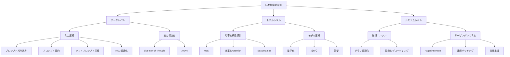

## 論文概要（Abstract）

本記事は [arXiv:2404.14294](https://arxiv.org/abs/2404.14294) の解説記事です。

大規模言語モデル（LLM）は自然言語処理の多くのタスクで高い性能を示す一方、推論時の計算コスト・メモリ消費が実用展開の障壁となっている。本論文は、LLM推論の非効率性を「巨大なモデルサイズ」「二次計算量のAttention機構」「自己回帰デコーディングの逐次性」の3つに分類し、データレベル・モデルレベル・システムレベルの3階層で最適化手法を体系的に整理したサーベイである。量子化（GPTQ, AWQ）、枝刈り（SparseGPT）、効率的Attention設計（GQA, MQA）、投機的デコーディング、PagedAttentionによるKVキャッシュ管理など、2023-2024年の手法を網羅的にカバーしている。

この記事は [Zenn記事: Ollama v0.35×エアギャップ環境で構築するデータ主権対応オンプレLLM推論基盤](https://zenn.dev/0h_n0/articles/88a1c8d7becfce) の深掘りです。

## 情報源

- **arXiv ID**: 2404.14294
- **URL**: [https://arxiv.org/abs/2404.14294](https://arxiv.org/abs/2404.14294)
- **著者**: Zixuan Zhou, Xuefei Ning, Ke Hong, et al.（Yu Wang研究室、清華大学）
- **発表年**: 2024（v3: 2024年7月19日改訂）
- **分野**: cs.CL, cs.AI

## 背景と動機（Background & Motivation）

GPT-4やLLaMA-2-70Bに代表されるLLMは、FP16精度でモデルパラメータを保持するだけでも膨大なメモリを消費する。例えばLLaMA-2-70Bは70Bパラメータを持ち、FP16で140GBのVRAMを要する。これにKVキャッシュやアクティベーションのメモリが加わるため、消費者向けGPUでの推論は困難である。

さらに、Transformer のSelf-Attention機構は入力長 $n$ に対して $O(n^2)$ の計算量を持ち、長文コンテキスト処理がボトルネックとなる。加えて自己回帰デコーディングはトークンを1つずつ逐次生成するため、GPU の並列計算能力を十分に活用できない。著者らは、LLaMA-2-70BをA100 GPU 2枚で推論した場合、1トークンあたり約100msの遅延が生じると報告している。

これらの課題に対して個別の最適化手法を提案する研究は多いが、データ・モデル・システムの全レベルを統一的に整理し、かつ実験的な検証を含むサーベイは存在しなかった。本論文はこのギャップを埋めることを目的としている。

## 主要な貢献（Key Contributions）

- **貢献1**: LLM推論の非効率性を3つの根本原因（モデルサイズ、Attention計算量、自己回帰デコーディング）に分類し、それぞれに対応するデータ・モデル・システムレベルの最適化手法を体系的に整理した分類体系を提案
- **貢献2**: 量子化手法についてW4A16設定でのスピードアップを実測し（Table IV）、TensorRT-LLMおよびLMDeployフレームワークでの定量的な比較を提示
- **貢献3**: State Space Model（Mamba等）やSpeculative Decodingなど、Transformerの代替・補完アーキテクチャを含む2023-2024年の最新手法を網羅的にカバー
- **貢献4**: 従来のサーベイ（Table I）が単一の最適化レベルに留まっていたのに対し、3レベルを横断した実践的な設計指針を提供

## 技術的詳細（Technical Details）

### LLM推論の2段階プロセス

LLM推論は**Prefilling（事前計算）** と **Decoding（デコーディング）** の2段階で構成される。

- **Prefilling**: 入力トークン列全体に対してKVキャッシュを計算・保存し、最初の出力トークンを生成する。GEMM（General Matrix Multiply）がボトルネックとなり、**計算律速**の段階である。
- **Decoding**: KVキャッシュを参照しながらトークンを1つずつ逐次生成する。GEMV（General Matrix-Vector Multiply）がボトルネックとなり、**メモリアクセス律速**の段階である。

この2段階の特性の違いが、最適化手法の選択に直接影響する。

### 分類体系の全体像



### データレベル最適化

データレベルの最適化はモデルの再学習を必要としない点が利点である。

**プロンプト刈り込み**: LLMLinguaは粗粒度（デモンストレーション選択）から細粒度（トークンレベル）への段階的な刈り込みを行い、パープレキシティに基づいて不要なトークンを除去する。バジェットコントローラと分布アラインメントにより、圧縮後もLLMの性能を維持する。

**出力構造化**: Skeleton-of-Thought（SoT）は2段階アプローチを採用する。第1段階で回答の骨格（構造）を生成し、第2段階で各ポイントを並列に展開する。著者らは12のLLMで最大2.39倍のスピードアップを達成したと報告している。APARはLLMが動的に`[fork]`制御トークンを生成し、1.4-2.0倍の高速化を実現する。

### モデルレベル最適化: 量子化

量子化はLLM推論効率化の中核技術である。量子化の基本式は以下の通り。

$$
X_{\text{INT}} = \left\lfloor \frac{X_{\text{FP16}} - Z}{S} \right\rfloor
$$

$$
S = \frac{\max(X_{\text{FP16}}) - \min(X_{\text{FP16}})}{2^N - 2}
$$

ここで、
- $X_{\text{FP16}}$: 元のFP16重み/アクティベーション
- $X_{\text{INT}}$: 量子化後の整数値
- $S$: スケーリングファクタ
- $Z$: ゼロポイント
- $N$: ビット幅

**重みのみ量子化（Weight-Only）** はデコーディング段階のメモリアクセスボトルネックに対処する。オフラインで重みを低ビットに量子化し、推論時にFP16にデクォンタイズして計算する。代表的手法として以下がある。

- **GPTQ**: Optimal Brain Quantization（OBQ）を拡張し、均一な左から右への量子化順序を採用。行ごとにヘシアンを1回計算するだけで効率的に量子化を実行する
- **AWQ**: アクティベーションの外れ値に対応する重みチャネルを優先的に保護する再パラメータ化手法。グリッドサーチでスケーリングファクタを決定する
- **SqueezeLLM**: 外れ値をFP精度のスパース行列で保持し、残りの重みに非一様量子化を適用。量子化感度に基づく適応的な量子化を実現する

**重み-アクティベーション量子化（Weight-Activation）** はPrefilling段階の計算ボトルネックに対処する。

- **SmoothQuant**: スケーリングファクタを導入してアクティベーションの値域を縮小し、重みの値域を拡大する再パラメータ化を行う。これによりアクティベーション側の外れ値問題を緩和し、INT8テンソルコアの効率的な利用を可能にする
- **LLM.int8()**: 外れ値分布に基づいてチャネルを分割し、外れ値チャネルをFP16、それ以外をINT8で計算する混合精度手法

**KVキャッシュ量子化** も注目されている。KVQuantは非一様量子化でKVキャッシュを圧縮し、KIVIはチューニング不要の2ビットKVキャッシュ量子化を実現する。

### モデルレベル最適化: 効率的Attention設計

Self-Attentionの計算量削減は長文処理に不可欠である。標準的なMulti-Head Attention（MHA）の計算式は以下の通り。

$$
Z_i = \text{Attention}(Q_i, K_i, V_i) = \text{softmax}\left(\frac{Q_i K_i^T}{\sqrt{d_k}}\right) V_i
$$

ここで、$Q_i, K_i, V_i$ はそれぞれ $i$ 番目のヘッドのQuery, Key, Value行列、$d_k$ はKeyの次元数である。

- **Multi-Query Attention（MQA）**: 全ヘッドでK, Vキャッシュを共有する。メモリアクセスコストとKVキャッシュサイズを大幅に削減する
- **Grouped-Query Attention（GQA）**: MHAとMQAの中間に位置し、ヘッドをグループ化して各グループで1つのK/Vを共有する。速度改善と出力品質のバランスを取る
- **カーネルベースAttention**: $\text{softmax}(QK^T)$ を $\phi(Q)\phi(K)^T$ で近似し、計算量を $O(n^2 d)$ から $O(nd^2)$ に削減する。Linear Transformerは $\phi(x) = \text{elu}(x) + 1$ を使用する

### モデルレベル最適化: Transformerの代替アーキテクチャ

**State Space Model（SSM）** はTransformerの代替として注目されている。基本的な状態空間方程式は以下の通り。

$$
x_k = \bar{A} x_{k-1} + \bar{B} u_k
$$

$$
y_k = \bar{C} x_k
$$

ここで、$x_k$ は隠れ状態、$u_k$ は入力、$y_k$ は出力、$\bar{A}, \bar{B}, \bar{C}$ は離散化されたシステム行列である。

**Mamba** は入力依存の遷移行列を導入し、並列スキャン技法を用いる。Table IIによると、計算量はPrefilling $O(nd^2)$、デコーディング $O(d^2)$（Transformerのデコーディング $O(nd)$ と比較してKVキャッシュ不要）である。Jamba、MambaFormerなどTransformerとSSMのハイブリッドアーキテクチャも提案されている。

### モデルレベル最適化: 枝刈りと蒸留

**SparseGPT** はOptimal Brain Surgeon（OBS）を拡張し、再構成誤差を最小化しながら重みを削除する。**Wanda** は重みの大きさとアクティベーションの大きさの積に基づいてプルーニングマスクを決定する。ただし著者らは、現代のGPUが密行列計算に最適化されているため、スパース化による実際のスピードアップは限定的であると指摘している。

知識蒸留は大規模な教師モデルの出力を小規模な生徒モデルに転移する手法で、**QLoRA** は4ビット量子化された重みにLoRAをBF16で追加し、65Bパラメータモデルのファインチューニングを30GB GPUで実現する。

### システムレベル最適化

システムレベルの最適化は推論エンジンやサービングシステムの改善であり、一般に性能劣化なし（ロスレス）で適用できる。

**PagedAttention**: OSの仮想メモリ管理に着想を得て、KVキャッシュを固定サイズの「ページ」で管理する。従来の連続メモリ割り当てによるフラグメンテーションを解消し、リクエスト間でのキャッシュ共有を可能にする。vLLMフレームワークの中核技術である。

**連続バッチング（Continuous Batching）**: 静的バッチングではリクエストの完了タイミングのずれにより無駄が生じる。連続バッチングは完了したリクエストを動的に除去し、新しいリクエストを追加することで、ハードウェア利用率を向上させる。

**投機的デコーディング（Speculative Decoding）**: 軽量なドラフトモデルが候補トークン列を生成し、ターゲットモデルが並列に検証する「draft-then-verify」パラダイムである。ドラフトの精度と受理率に依存するが、自己回帰デコーディングの逐次性を大幅に緩和する。

**分散推論**: テンソル並列（重み行列をGPU間で分割）、パイプライン並列（Transformerレイヤーを段階的に分散）、シーケンス並列（入力系列をデバイス間で分割）の3戦略がある。

## 実装のポイント（Implementation）

量子化手法の選択は推論段階に依存する。以下にPyTorchでの重みのみ量子化の実装パターンを示す。

```python
import torch
import torch.nn as nn


class WeightOnlyQuantizedLinear(nn.Module):
    """Weight-only INT4 quantized linear layer.

    重みをINT4で保持し、推論時にFP16にデクォンタイズして計算する。
    デコーディング段階のメモリアクセスボトルネックを緩和する。

    Args:
        in_features: 入力次元数
        out_features: 出力次元数
        group_size: 量子化グループサイズ（チャネル方向の粒度）
    """

    def __init__(
        self, in_features: int, out_features: int, group_size: int = 128
    ) -> None:
        super().__init__()
        self.in_features = in_features
        self.out_features = out_features
        self.group_size = group_size
        num_groups = (in_features + group_size - 1) // group_size

        # INT4 packed weights (2 values per byte)
        self.register_buffer(
            "weight_packed",
            torch.zeros(out_features, in_features // 2, dtype=torch.uint8),
        )
        # Per-group scale and zero-point
        self.register_buffer(
            "scales", torch.zeros(out_features, num_groups, dtype=torch.float16)
        )
        self.register_buffer(
            "zeros", torch.zeros(out_features, num_groups, dtype=torch.float16)
        )

    def dequantize(self) -> torch.Tensor:
        """INT4重みをFP16にデクォンタイズする。

        Returns:
            FP16の重み行列 (out_features, in_features)
        """
        # Unpack INT4 from packed uint8
        low = self.weight_packed & 0x0F
        high = (self.weight_packed >> 4) & 0x0F
        weight_int = torch.stack([low, high], dim=-1).reshape(
            self.out_features, self.in_features
        )

        # Apply per-group dequantization: X_FP16 = X_INT * S + Z
        weight_fp = torch.zeros_like(weight_int, dtype=torch.float16)
        for g in range(self.scales.shape[1]):
            start = g * self.group_size
            end = min(start + self.group_size, self.in_features)
            weight_fp[:, start:end] = (
                weight_int[:, start:end].to(torch.float16)
                * self.scales[:, g : g + 1]
                + self.zeros[:, g : g + 1]
            )
        return weight_fp

    def forward(self, x: torch.Tensor) -> torch.Tensor:
        """量子化重みを用いた線形変換。

        Args:
            x: 入力テンソル (batch_size, seq_len, in_features)

        Returns:
            出力テンソル (batch_size, seq_len, out_features)
        """
        weight = self.dequantize()
        return torch.nn.functional.linear(x, weight)
```

**実装上の注意点**:

- **Prefilling vs Decoding の使い分け**: Prefilling段階は計算律速のため重み-アクティベーション量子化（INT8テンソルコア活用）が有効。Decoding段階はメモリアクセス律速のため重みのみ量子化（INT4）が有効
- **バッチサイズの影響**: Table IVの実験結果から、量子化のスピードアップはバッチサイズの増加とともに減少する。バッチサイズ16・コンテキスト長2048では、デコーディングのスピードアップが1.16-1.28倍に低下する
- **外れ値の処理**: アクティベーションの外れ値はSmoothQuantの再パラメータ化やLLM.int8()のチャネル分離で対処する。処理を怠るとINT8量子化で大幅な精度劣化が生じる
- **KVキャッシュ管理**: PagedAttentionの導入でメモリフラグメンテーションを解消し、長文推論の安定性を向上させる

## Production Deployment Guide

本セクションでは、LLM推論効率化技術をAWS上で実運用する際の構成パターンを示す。サーベイで取り上げられた量子化・KVキャッシュ最適化・バッチング戦略をプロダクション環境に適用する。

### AWS実装パターン（コスト最適化重視）

| 構成 | トラフィック | アーキテクチャ | 月額概算 |
|------|------------|--------------|---------|
| Small | ~100 req/日 | Lambda + Bedrock + DynamoDB | $50-150 |
| Medium | ~1,000 req/日 | ECS Fargate + vLLM + ElastiCache | $300-800 |
| Large | 10,000+ req/日 | EKS + Karpenter + Spot (GPU) | $2,000-5,000 |

**Small構成**: Lambda関数からBedrock APIを呼び出し、DynamoDBにKVキャッシュのメタデータを保存する。Bedrockの量子化済みモデル（Claude 3 Haiku等）を利用することで、推論基盤の管理が不要になる。Prompt Cachingを有効化すれば、繰り返しの系統的プロンプトで30-90%のコスト削減が見込める。

**Medium構成**: ECS Fargate上でvLLMコンテナを稼働させ、PagedAttentionによるKVキャッシュ管理と連続バッチングを活用する。ElastiCacheでプロンプトキャッシュを管理し、重複リクエストのレイテンシを削減する。GPU不要のCPU推論（GGUF量子化モデル）であれば月額$300程度に抑えられる。

**Large構成**: EKS上でKarpenterによるGPUノードの自動スケーリングを実施し、Spot Instancesで最大90%のコスト削減を図る。テンソル並列を用いて70B級モデルを複数GPU（g5.12xlarge: 4x A10G）に分散配置する。W4A16量子化を適用し、Table IVの結果に基づきデコーディングで2.0-2.5倍のスループット向上を実現する。

**コスト試算の注意**: 上記はAWS ap-northeast-1（東京）リージョンの2026年10月時点の概算値。実際のコストはトラフィックパターンやバースト使用量により変動する。最新料金はAWS料金計算ツールで確認を推奨する。

### Terraformインフラコード

**Small構成（Serverless）**:

```hcl
# Small: Lambda + Bedrock + DynamoDB
# 月額 $50-150 / ~100 req/日

resource "aws_iam_role" "llm_inference" {
  name = "llm-inference-role"
  assume_role_policy = jsonencode({
    Version = "2012-10-17"
    Statement = [{
      Action = "sts:AssumeRole"
      Effect = "Allow"
      Principal = { Service = "lambda.amazonaws.com" }
    }]
  })
}

resource "aws_iam_role_policy" "bedrock_access" {
  name = "bedrock-minimal-access"
  role = aws_iam_role.llm_inference.id
  policy = jsonencode({
    Version = "2012-10-17"
    Statement = [
      {
        Effect   = "Allow"
        Action   = ["bedrock:InvokeModel", "bedrock:InvokeModelWithResponseStream"]
        Resource = "arn:aws:bedrock:ap-northeast-1::foundation-model/*"
      },
      {
        Effect   = "Allow"
        Action   = ["dynamodb:PutItem", "dynamodb:GetItem", "dynamodb:Query"]
        Resource = aws_dynamodb_table.prompt_cache.arn
      }
    ]
  })
}

resource "aws_lambda_function" "inference" {
  function_name = "llm-inference"
  runtime       = "python3.12"
  handler       = "handler.main"
  role          = aws_iam_role.llm_inference.arn
  memory_size   = 512   # Prompt処理に十分なメモリ
  timeout       = 120   # 長文生成のタイムアウト
  filename      = "lambda.zip"

  environment {
    variables = {
      DYNAMODB_TABLE     = aws_dynamodb_table.prompt_cache.name
      ENABLE_CACHING     = "true"   # Prompt Caching有効化
      MAX_TOKENS         = "4096"
    }
  }

  tracing_config {
    mode = "Active"  # X-Ray有効化
  }
}

resource "aws_dynamodb_table" "prompt_cache" {
  name         = "llm-prompt-cache"
  billing_mode = "PAY_PER_REQUEST"  # On-Demandでコスト最適化
  hash_key     = "prompt_hash"
  range_key    = "created_at"

  attribute {
    name = "prompt_hash"
    type = "S"
  }
  attribute {
    name = "created_at"
    type = "N"
  }

  ttl {
    attribute_name = "expires_at"
    enabled        = true
  }

  server_side_encryption {
    enabled = true  # KMS暗号化
  }
}

resource "aws_cloudwatch_metric_alarm" "cost_alert" {
  alarm_name          = "llm-daily-cost-alert"
  comparison_operator = "GreaterThanThreshold"
  evaluation_periods  = 1
  metric_name         = "EstimatedCharges"
  namespace           = "AWS/Billing"
  period              = 86400
  statistic           = "Maximum"
  threshold           = 10  # $10/日超過でアラート
  alarm_actions       = [aws_sns_topic.alerts.arn]
}

resource "aws_sns_topic" "alerts" {
  name = "llm-cost-alerts"
}
```

**Large構成（Container）**:

```hcl
# Large: EKS + Karpenter + Spot GPU Instances
# 月額 $2,000-5,000 / 10,000+ req/日

module "eks" {
  source          = "terraform-aws-modules/eks/aws"
  version         = "~> 20.0"
  cluster_name    = "llm-inference-cluster"
  cluster_version = "1.31"
  vpc_id          = module.vpc.vpc_id
  subnet_ids      = module.vpc.private_subnets

  cluster_endpoint_public_access = false  # プライベートアクセスのみ
}

# Karpenter: Spot GPU優先の自動スケーリング
resource "kubectl_manifest" "karpenter_nodepool" {
  yaml_body = yamlencode({
    apiVersion = "karpenter.sh/v1"
    kind       = "NodePool"
    metadata   = { name = "gpu-inference" }
    spec = {
      template = {
        spec = {
          requirements = [
            { key = "karpenter.sh/capacity-type", operator = "In", values = ["spot", "on-demand"] },
            { key = "node.kubernetes.io/instance-type", operator = "In",
              values = ["g5.xlarge", "g5.2xlarge", "g5.12xlarge"] },  # A10G GPU
          ]
          nodeClassRef = { name = "default" }
        }
      }
      limits   = { cpu = "128", memory = "512Gi", "nvidia.com/gpu" = "16" }
      disruption = {
        consolidationPolicy = "WhenEmptyOrUnderutilized"
        consolidateAfter    = "30s"  # アイドルノード早期回収
      }
    }
  })
}

resource "aws_budgets_budget" "monthly" {
  name         = "llm-inference-monthly"
  budget_type  = "COST"
  limit_amount = "5000"
  limit_unit   = "USD"
  time_unit    = "MONTHLY"

  notification {
    comparison_operator       = "GREATER_THAN"
    threshold                 = 80  # 80%到達で通知
    threshold_type            = "PERCENTAGE"
    notification_type         = "ACTUAL"
    subscriber_sns_topic_arns = [aws_sns_topic.alerts.arn]
  }
}
```

### 運用・監視設定

**CloudWatch Logs Insights クエリ**:

```
# トークン使用量のコスト異常検知（1時間単位）
fields @timestamp, @message
| filter @message like /token_usage/
| stats sum(input_tokens) as total_input, sum(output_tokens) as total_output by bin(1h)
| filter total_input > 100000 or total_output > 50000

# レイテンシ分析（P95, P99）
fields @timestamp, duration_ms
| stats percentile(duration_ms, 95) as p95, percentile(duration_ms, 99) as p99 by bin(5m)
| filter p99 > 5000
```

**CloudWatch アラーム設定**:

```python
import boto3


def setup_inference_alarms(sns_topic_arn: str) -> None:
    """LLM推論の監視アラームを設定する。

    Args:
        sns_topic_arn: 通知先SNSトピックのARN
    """
    cw = boto3.client("cloudwatch", region_name="ap-northeast-1")

    # Bedrockトークン使用量スパイク検知
    cw.put_metric_alarm(
        AlarmName="bedrock-token-spike",
        MetricName="InputTokenCount",
        Namespace="AWS/Bedrock",
        Statistic="Sum",
        Period=3600,
        EvaluationPeriods=1,
        Threshold=500000,
        ComparisonOperator="GreaterThanThreshold",
        AlarmActions=[sns_topic_arn],
    )
```

**X-Ray トレーシング設定**:

```python
from aws_xray_sdk.core import xray_recorder, patch_all


def configure_xray_tracing() -> None:
    """X-Rayトレーシングを設定し、LLM推論のレイテンシを計測する。"""
    xray_recorder.configure(service="llm-inference")
    patch_all()  # boto3自動計装


@xray_recorder.capture("llm_inference")
def invoke_model(prompt: str, model_id: str) -> dict:
    """Bedrockモデルを呼び出し、X-Rayにメタデータを記録する。

    Args:
        prompt: 入力プロンプト
        model_id: BedrockモデルID

    Returns:
        モデルの応答辞書
    """
    subsegment = xray_recorder.current_subsegment()
    subsegment.put_annotation("model_id", model_id)
    subsegment.put_metadata("prompt_length", len(prompt))
    # ... Bedrock呼び出し処理
    return {}
```

**Cost Explorer自動レポート**:

```python
import boto3
from datetime import datetime, timedelta


def daily_cost_report(sns_topic_arn: str) -> None:
    """日次コストレポートを取得し、閾値超過時にSNS通知する。

    Args:
        sns_topic_arn: 通知先SNSトピックのARN
    """
    ce = boto3.client("ce", region_name="us-east-1")
    today = datetime.utcnow().strftime("%Y-%m-%d")
    yesterday = (datetime.utcnow() - timedelta(days=1)).strftime("%Y-%m-%d")

    response = ce.get_cost_and_usage(
        TimePeriod={"Start": yesterday, "End": today},
        Granularity="DAILY",
        Metrics=["UnblendedCost"],
        Filter={
            "Or": [
                {"Dimensions": {"Key": "SERVICE", "Values": ["Amazon Bedrock"]}},
                {"Dimensions": {"Key": "SERVICE", "Values": ["AWS Lambda"]}},
                {"Dimensions": {"Key": "SERVICE", "Values": ["Amazon EKS"]}},
            ]
        },
    )

    total = sum(
        float(r["Total"]["UnblendedCost"]["Amount"])
        for r in response["ResultsByTime"]
    )

    if total > 100:  # $100/日超過で通知
        sns = boto3.client("sns", region_name="ap-northeast-1")
        sns.publish(
            TopicArn=sns_topic_arn,
            Subject="LLM推論コストアラート",
            Message=f"日次コスト: ${total:.2f} (閾値: $100)",
        )
```

### コスト最適化チェックリスト

**アーキテクチャ選択**:
- [ ] トラフィック量に応じた構成選択（Small: Serverless / Medium: Hybrid / Large: Container）
- [ ] GPU要否の判断（量子化モデルのCPU推論 vs GPU推論のトレードオフ）

**リソース最適化**:
- [ ] EC2/EKS: Spot Instances優先（最大90%削減）
- [ ] Reserved Instances: 1年コミットで最大72%削減
- [ ] Savings Plans: Compute Savings Plansの検討
- [ ] Lambda: メモリサイズ最適化（Power Tuning）
- [ ] ECS/EKS: Karpenterでアイドル時スケールダウン

**LLMコスト削減**:
- [ ] Bedrock Batch API使用（50%削減、非同期処理に適用）
- [ ] Prompt Caching有効化（繰り返しプロンプトで30-90%削減）
- [ ] W4A16量子化適用（メモリ使用量75%削減、デコーディング2倍高速化）
- [ ] トークン数制限（max_tokens設定で無駄な生成を抑止）
- [ ] モデル選択ロジック（複雑度に応じてHaiku/Sonnet/Opus切替）

**監視・アラート**:
- [ ] AWS Budgets設定（月次予算の80%到達で通知）
- [ ] CloudWatch アラーム（トークン使用量スパイク検知）
- [ ] Cost Anomaly Detection有効化
- [ ] 日次コストレポート自動送信

**リソース管理**:
- [ ] 未使用リソース定期削除（停止インスタンス、未接続EBS）
- [ ] タグ戦略（Environment, Service, Owner タグ必須）
- [ ] S3ライフサイクルポリシー（ログ90日でGlacier移行）
- [ ] 開発環境夜間停止（EventBridgeスケジュール）

## 実験結果（Results）

著者らはW4A16（重み4ビット、アクティベーション16ビット）量子化のスピードアップをLLaMA-2モデルで実測している（Table IV）。以下は主要な結果である。

| モデル | フレームワーク | バッチ | コンテキスト | Prefilling | Decoding | End-to-End |
|--------|--------------|--------|------------|------------|----------|------------|
| LLaMA-2-7B | TensorRT-LLM | 1 | 128 | 1.06x | 2.40x | 2.37x |
| LLaMA-2-7B | LMDeploy | 1 | 128 | 1.30x | 2.11x | 2.09x |
| LLaMA-2-7B | TensorRT-LLM | 16 | 2048 | 0.78x | 1.16x | 1.14x |
| LLaMA-2-7B | LMDeploy | 16 | 2048 | 0.94x | 1.28x | 1.26x |

**分析ポイント**:

著者らの実験から以下の知見が得られている。

1. **デコーディング段階で顕著な高速化**: バッチサイズ1・コンテキスト長128では2.0-2.4倍のスピードアップが確認された。これはデコーディングがメモリアクセス律速であるため、重み量子化によるメモリ帯域の削減が直接的に効く
2. **Prefilling段階では効果が限定的**: デクォンタイズのオーバーヘッドにより、Prefillingでは加速が限定的か、むしろ減速する場合がある（0.78倍）。Prefilling段階は計算律速のため、重みのみ量子化の恩恵が薄い
3. **バッチサイズ増加でスピードアップが減衰**: バッチサイズ16では計算量が支配的になり、メモリアクセスの削減効果が相対的に低下する
4. **モデルサイズが大きいほど効果が大きい**: 大規模モデルほどメモリアクセスのオーバーヘッドが大きく、量子化の恩恵を受けやすい

また、BiLLMは1.08ビットでの量子化を実現しており、サーベイで報告されている中で最も低ビットの手法である。Mixtral 8x7BはMoEアーキテクチャにより13Bの活性パラメータでLLaMA-2-70Bを上回る性能を示したと報告されている。

## 実運用への応用（Practical Applications）

本サーベイの知見は、[Zenn記事で紹介したOllama v0.35によるエアギャップ環境でのオンプレLLM推論基盤](https://zenn.dev/0h_n0/articles/88a1c8d7becfce)と直接的に関連する。

**量子化手法の選択**: Zenn記事ではQ4_K_MとQ8_0の比較を行っているが、これは本サーベイの重みのみ量子化（Weight-Only Quantization）に該当する。Q4_K_MはGGML独自のk-quant形式であり、AWQのようなチャネル重要度に基づく非一様量子化の考え方を取り入れている。デコーディング段階ではTable IVが示すように2倍以上の高速化が期待できる。

**VRAM最適化**: サーベイで議論されているGQA（Grouped-Query Attention）はLLaMA-2以降のモデルで標準的に採用されており、Ollama上でもKVキャッシュサイズの削減に寄与している。エアギャップ環境で限られたGPUメモリを効率的に使う際、GQAとW4量子化の組み合わせが有効である。

**サービング戦略**: Ollama内部ではllama.cppを推論バックエンドとして使用しており、連続バッチングやKVキャッシュ管理の仕組みが組み込まれている。本サーベイのPagedAttentionやSpeculative Decodingの知見は、vLLMやTGI（Text Generation Inference）ベースのサービング基盤への移行を検討する際の判断材料となる。

**セキュリティとの両立**: エアギャップ環境ではモデルのダウンロードと更新が制限されるため、量子化モデルの事前準備が重要である。本サーベイのGPTQやAWQ手法でオフラインに量子化済みモデルを用意し、Caddy認証ゲートウェイとPrometheus監視を組み合わせることで、セキュリティと推論効率の両立が可能になる。

## 関連研究（Related Work）

- **FlexGen (Sheng et al., 2023)**: INT4量子化とオフロードを組み合わせた大バッチ推論手法。単一GPU上で175BパラメータモデルのスループットをOoM（桁違い）レベルで改善する。本サーベイのシステムレベル最適化（メモリ管理）に位置づけられる
- **RWKV (Peng et al., 2023)**: 位置バイアスの再パラメータ化により、Transformerの学習並列性とRNNの推論効率を両立するアーキテクチャ。本サーベイでは再帰的Attention操作の代表例として取り上げられている
- **Mixtral 8x7B (Jiang et al., 2024)**: MoEアーキテクチャを採用し、8つのFFNエキスパートのうち2つを選択して活性化する。13Bの活性パラメータでLLaMA-2-70Bを上回り、効率的構造設計の成功例として位置づけられている
- **QLoRA (Dettmers et al., 2023)**: 4ビットNormalFloat量子化とLoRAの組み合わせにより、65Bモデルを30GB GPU上でファインチューニング可能にした手法。量子化とPEFTの交差領域の先駆的研究である

## まとめと今後の展望

本サーベイは、LLM推論の非効率性をデータ・モデル・システムの3レベルで体系化し、各レベルの最適化手法を網羅的に整理した。量子化のスピードアップ実測（Table IV）は、理論的な議論だけでなく実践的な設計指針を提供している点で価値がある。

今後の研究方向として、著者らはサブ2ビット量子化のさらなる探索、枝刈り・量子化・蒸留を組み合わせたハイブリッド圧縮、SSMとTransformerのハイブリッドアーキテクチャの発展を挙げている。また、エージェントフレームワークやTree-of-Thoughtなどの構造化推論がデータレベル最適化と統合される方向性も示唆されている。

実務的には、推論段階（Prefilling vs Decoding）の特性を理解した上で、量子化手法・バッチ戦略・メモリ管理を組み合わせることが重要である。特にエアギャップ環境やエッジデバイスでのLLMデプロイにおいて、本サーベイの分類体系は最適化手法の選択指針として有用である。

## 参考文献

- **arXiv**: [https://arxiv.org/abs/2404.14294](https://arxiv.org/abs/2404.14294)
- **Related Zenn article**: [https://zenn.dev/0h_n0/articles/88a1c8d7becfce](https://zenn.dev/0h_n0/articles/88a1c8d7becfce)
- **FlexGen**: Sheng et al., "FlexGen: High-Throughput Generative Inference of Large Language Models with a Single GPU," ICML 2023
- **RWKV**: Peng et al., "RWKV: Reinventing RNNs for the Transformer Era," EMNLP 2023
- **Mixtral**: Jiang et al., "Mixtral of Experts," arXiv:2401.04088, 2024
- **QLoRA**: Dettmers et al., "QLoRA: Efficient Finetuning of Quantized Large Language Models," NeurIPS 2023
