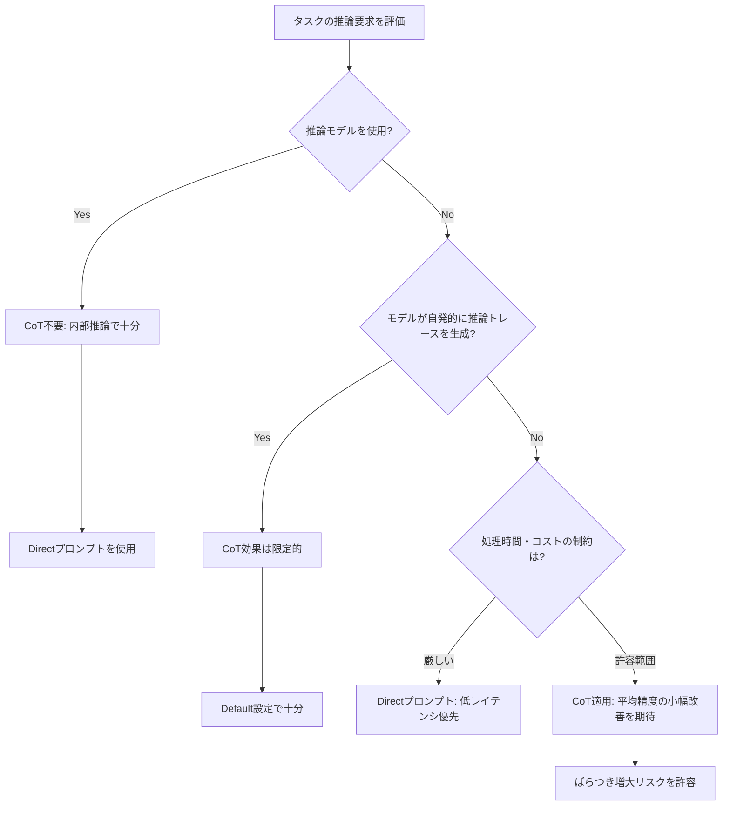

本記事は [Prompting Science Report 2: The Decreasing Value of Chain of Thought in Prompting](https://arxiv.org/abs/2506.07142) の解説記事です。

この記事は [Zenn記事: 構造化プロンプト設計パターン：CO-STAR×XMLタグ×推論モデル対応の実装手法](https://zenn.dev/0h_n0/articles/78ab36484a8edd) の深掘りです。

## 論文概要（Abstract）

Chain-of-Thought（CoT）プロンプティングは、LLMに「ステップバイステップで考えよ」と指示することで推論精度を向上させる手法として広く採用されてきた。しかし著者らは、CoTの有効性がモデルの種類とタスク特性に大きく依存し、従来考えられていたほど普遍的ではないことを実証的に示している。非推論モデルでは平均精度の改善は小幅にとどまり、CoTが回答のばらつきを増大させて本来正解できる問題で誤答を引き起こす場合がある。推論モデルに対しては、明示的なCoTプロンプトは精度向上がほぼ見られず、処理時間とトークン消費量を大幅に増加させるのみであると報告されている。

## 情報源

- **arXiv ID**: 2506.07142
- **URL**: [https://arxiv.org/abs/2506.07142](https://arxiv.org/abs/2506.07142)
- **著者**: Lennart Meincke, Ethan Mollick, Lilach Mollick, Dan Shapiro（Generative AI Labs, The Wharton School of Business, University of Pennsylvania; WHU-Otto Beisheim School of Management; Glowforge）
- **発表年**: 2025
- **分野**: cs.CL, cs.AI

## 背景と動機（Background & Motivation）

CoTプロンプティングは、Wei et al.（2022）がNeurIPSで発表した "Chain-of-thought prompting elicits reasoning in large language models" に端を発する。この研究では、数段階の推論例をプロンプトに含めることで、算術・常識推論・記号操作といったタスクでLLMの精度が大幅に向上することが示された。さらにKojima et al.（2022）は "Let's think step by step" という一文を付加するだけで同様の効果が得られるZero-shot CoTを提案し、CoTはプロンプトエンジニアリングの基本技法として定着した。

しかし、2024年以降のLLMには2つの大きな変化がある。第一に、GPT-4o、Claude Sonnet 3.5、Gemini 2.0 Flashなどの非推論モデルが、明示的な指示がなくても短い推論トレースを自発的に生成するようになった。第二に、o1、o3、o4-miniなどの推論モデル（reasoning model）が登場し、内部で拡張された思考プロセスを実行するようになった。これらの進化により、外部から与えるCoTプロンプトの価値が根本的に変化した可能性がある。著者らは、この仮説をGPQA Diamondベンチマークを用いた大規模実験で検証している。

## 主要な貢献（Key Contributions）

- **貢献1（非推論モデルでのCoT効果の定量化）**: 5種類の非推論モデル（Sonnet 3.5、Gemini 2.0 Flash、GPT-4o-mini、GPT-4o、Gemini Pro 1.5）に対し、CoTプロンプトの平均精度改善は統計的に有意だが小幅であること、かつ「100% Correct」指標では3モデルで有意な低下が生じることを示した
- **貢献2（推論モデルでのCoT冗長性の実証）**: 3種類の推論モデル（o3-mini、o4-mini、Gemini Flash 2.5）で、明示的CoTが精度に対してほぼ無効であり、処理時間を20-80%増加させることを報告した
- **貢献3（暗黙的CoTの発見）**: 多くの非推論モデルが、Defaultプロンプト（特段の指示なし）条件でも自発的にCoT的な推論トレースを出力しており、明示的CoT指示の追加効果が限定的であることを明らかにした
- **貢献4（トレードオフの定式化）**: CoTは平均精度をわずかに向上させる一方、回答のばらつき増大・処理時間35-600%増加・トークンコスト増大というトレードオフを伴うことを定量的に示した

## 技術的詳細（Technical Details）

### 実験設計

著者らはGPQA Diamond（Graduate-Level Google-Proof Q&A Benchmark; Rein et al., 2024）を使用している。GPQA Diamondは生物学・物理学・化学にわたる198問の博士レベル多肢選択問題で構成される。該当分野の博士が回答しても正答率は65%（事後に明らかな誤りを除外すると74%）、高スキルの非専門家がウェブ検索を30分以上行っても正答率は34%にとどまる、いわゆる"Google-proof"な問題群である。

各質問に対し、各プロンプト条件で25回のトライアルを実施している（温度パラメータ $t = 0$）。合計で1モデルあたり4,950回（198問 $\times$ 25回）の推論を実行し、以下の4つの指標で評価している。

$$
\text{100\% Correct}: \frac{|\{q \mid \text{correct}(q) = 25/25\}|}{|Q|}
$$

$$
\text{90\% Correct}: \frac{|\{q \mid \text{correct}(q) \geq 23/25\}|}{|Q|}
$$

$$
\text{51\% Correct}: \frac{|\{q \mid \text{correct}(q) \geq 13/25\}|}{|Q|}
$$

$$
\text{Average Rating}: \frac{1}{N}\sum_{i=1}^{N} \mathbb{1}[\text{correct}(q_i, t_i)]
$$

ここで、$Q$ は全198問の集合、$q$ は個別の質問、$\text{correct}(q)$ は質問 $q$ に対する25回中の正答数、$N = 4{,}950$（全トライアル数）、$\mathbb{1}[\cdot]$ は指示関数である。

### プロンプト条件

著者らは3つのプロンプト条件を比較している。

1. **Direct**: 「説明や思考なしに直接回答せよ」と指示し、推論トレースの生成を抑制する
2. **Step by Step**: 「回答する前にステップバイステップで考えよ」と指示する（標準的なCoT）
3. **Default**: 特段のプロンプト接尾辞を付加せず、フォーマット制約も除去し、モデルの自然な応答を観察する

### 非推論モデルにおけるCoTのメカニズム

非推論モデルでCoTが機能する理論的背景は、LLMのAutoregressive生成特性にある。モデルが次のトークン $x_{t+1}$ を予測する際、既に生成されたトークン列 $x_{1:t}$ がコンテキストとして利用される。

$$
p(x_{t+1} \mid x_{1:t}) = \text{softmax}(\mathbf{W}_o \cdot h_t)
$$

ここで、$h_t$ は位置 $t$ における隠れ状態、$\mathbf{W}_o$ は出力射影行列である。CoTでは中間推論ステップが $x_{1:t}$ に含まれるため、最終回答生成時のコンテキストが豊かになり、推論精度が向上するというメカニズムが想定されている。

しかし著者らの実験では、多くの非推論モデルがDefault条件（CoT指示なし）でも自発的にCoT的な推論トレースを生成していることが確認されている。これは、最近のモデルのファインチューニングやRLHFの過程で、ステップバイステップの推論パターンがモデルに内在化されたためと考えられる。その結果、外部からCoTを明示的に指示しても追加効果は限定的になる。

### 推論モデルにおける外部CoTの冗長性

o3-mini、o4-mini、Gemini Flash 2.5などの推論モデルは、ユーザーのプロンプトを受け取った後、回答を生成する前に内部で拡張された思考プロセス（extended thinking / internal chain-of-thought）を実行する。このとき、外部からCoTプロンプトを追加すると、モデルは以下の二重処理を行うことになる。

1. **外部CoT**: プロンプト指示に従い、出力トークンとして推論ステップを生成
2. **内部CoT**: モデル固有の思考プロセスとして、内部トークンで推論を実行

著者らの実験結果は、この二重処理が精度向上にほぼ寄与しない一方、処理時間とトークン消費を大幅に増加させることを示している。推論モデルは既に内部で十分な推論を行っているため、外部CoTは冗長な計算リソースの消費に過ぎない。

### CoT適用判断のフローチャート

### トークン消費と処理時間の分析

著者らは、非推論モデルにおいてCoTリクエストがDirectリクエストと比較して35-600%（5-15秒）長い処理時間を要すると報告している（論文Figure S1より）。具体的な処理時間（1問あたり平均、論文Supplementary Figure S1より）は以下の通りである。

| モデル | Direct（秒） | Step by Step（秒） | 増加率 |
|--------|-------------|-------------------|--------|
| GPT-4o | 2.45 | 17.90 | 約630% |
| GPT-4o-mini | 3.52 | 14.26 | 約305% |
| Gemini 2.0 Flash | 17.81 | 24.59 | 約38% |
| Gemini Pro 1.5 | 16.24 | 22.02 | 約36% |
| Sonnet 3.5 | 2.55 | 7.84 | 約207% |

推論モデルでは、CoTリクエストがDirectリクエストと比較して20-80%（10-20秒）長い処理時間を要すると報告されている。

## 実装のポイント（Implementation）

本論文はサーベイ・分析論文であり、特定のシステム実装を提案するものではない。ただし、著者らの知見をプロンプト設計に反映する際のポイントを以下に整理する。

**モデル選定時のCoT戦略**:
- 推論モデル（o3-mini、o4-miniなど）を使用する場合、「Think step by step」の付加は避ける。内部推論が既に十分であり、外部CoTはトークンコストの増大のみを招く
- 非推論モデルを使用する場合でも、まずDefault条件（CoT指示なし）でモデルが自発的に推論トレースを生成するか確認する。自発的に生成する場合、明示的CoTの追加効果は統計的に有意でないことが多い

**精度要求に応じた判断**:
- 「100% Correct」（全試行で正解）を要求するタスクでは、CoTは3/5の非推論モデルで有意に性能を低下させた（論文Figure 1より）。高信頼性が求められるシステムでは、CoTが逆効果となる可能性を考慮する必要がある
- 一方、平均精度（Average Rating）の改善が目的であれば、CoTは非推論モデルで小幅な改善をもたらす場合がある

**コスト効率の考慮**:
- CoTはトークン消費量を増大させるため、API呼び出しコストに直結する。大量のリクエストを処理するバッチ処理では、CoTの有無によるコスト差が積み重なる。著者らの実験では、GPT-4oで処理時間が約630%増加しており、コスト面の影響は無視できない

## 実験結果（Results）

### 非推論モデル: Direct vs Step by Step

著者らの実験（論文Figure 1、Table S3より）では、以下の結果が報告されている。

**Average Rating（平均精度）**: CoT（Step by Step）はDirect条件と比較して、Gemini 2.0 Flash（RD = 0.135, $p < .001$）およびSonnet 3.5（RD = 0.117, $p < .001$）で統計的に有意な改善を示した。一方、GPT-4o-mini（RD = 0.044, $p = .067$）では改善が有意でなかった。

**100% Correct（全25回正解）**: Sonnet 3.5は有意な改善を示した（RD = 0.101, $p = .001$）一方、Gemini 2.0 Flash（RD = -0.131, $p < .001$）およびGemini Pro 1.5（RD = -0.172, $p < .001$）では有意な低下が報告されている。GPT-4o-miniも有意な低下を示した（RD = -0.066, $p = .033$）。

この結果は、CoTが平均的な精度を改善する一方で、回答の一貫性（ばらつき）を悪化させることを示唆している。CoTによって「本来正解できる簡単な問題」でのエラーが増加し、代わりに「より難しい問題」での正答率が向上するというトレードオフが存在する。

### 非推論モデル: Default vs Step by Step

Default条件との比較では、CoTの追加効果はさらに限定的であった（論文Figure 2、Table S4より）。平均精度で統計的に有意な改善が見られたのはGemini 2.0 Flash（RD = 0.062, $p < .001$）とGPT-4o（RD = 0.069, $p = .003$）のみで、Sonnet 3.5（RD = -0.019, $p = .189$）およびGPT-4o-mini（RD = 0.004, $p = .728$）では有意差がなかった。これは、Default条件でモデルが自発的にCoTを実行しているため、明示的な指示の追加効果が限定的であることを裏付けている。

### 推論モデル: Direct vs Step by Step

推論モデルに対するCoTの効果はさらに限定的であった（論文Figure 3、Table S5より）。o3-mini（RD = 0.029, $p = .024$）およびo4-mini（RD = 0.031, $p = .003$）では平均精度で統計的に有意だが極めて小幅な改善が見られた一方、Gemini Flash 2.5では有意な低下（RD = -0.033, $p = .005$）が報告されている。

100% Correct指標では、Gemini Flash 2.5が有意な低下を示した（RD = -0.131, $p < .001$）。処理時間は20-80%増加しており、精度向上が実質的にゼロに近いことを考慮すると、推論モデルへのCoT適用は計算リソースの浪費に等しいと著者らは結論づけている。

## 実運用への応用（Practical Applications）

### プロンプト設計戦略の再考

本論文の知見は、実運用におけるプロンプト設計戦略に直接的な影響を持つ。関連するZenn記事「[構造化プロンプト設計パターン：CO-STAR×XMLタグ×推論モデル対応の実装手法](https://zenn.dev/0h_n0/articles/78ab36484a8edd)」では、推論モデルに対してCoTが逆効果となる可能性が指摘されているが、本論文はその主張を実証的に裏付ける根拠を提供している。

**モデルタイプ別のプロンプト戦略**:

1. **推論モデル（o3-mini, o4-mini等）**: CoTプロンプトを除去し、Directプロンプトまたはタスク固有の構造化プロンプト（CO-STARフレームワーク等）に注力する。Zenn記事で紹介されているXMLタグによる構造化は、CoTに依存しない明確なタスク定義として有効である
2. **最新の非推論モデル**: Default条件で十分な推論トレースが得られるか検証した上で、CoTの追加投資を判断する。モデルが自発的にCoTを実行している場合、明示的指示のコスト対効果は低い
3. **旧世代・小規模モデル**: CoTが最も効果的なカテゴリである。ただし、100% Correctを要求するクリティカルなタスクでは、ばらつき増大リスクを評価する

**コスト最適化の観点**: 処理時間が最大630%（GPT-4oの場合）増加することを考慮すると、大量のリクエストを処理するプロダクション環境では、CoTの除去がレイテンシとコストの両面で顕著な改善をもたらす。特にリアルタイム応答が求められるチャットボットやAPI呼び出しでは、CoTの有無が応答体験に直結する。

## 関連研究（Related Work）

- **Chain-of-Thought Prompting（Wei et al., 2022）**: LLMに少数の推論例を示すFew-shot CoTを提案し、算術推論タスクで大幅な精度向上を実証した。本論文の検証対象であり、著者らはCoTの価値が時間の経過とともに低下していると報告している
- **Zero-shot CoT（Kojima et al., 2022）**: 「Let's think step by step」という一文をプロンプトに追加するだけで、Few-shot CoTに匹敵する性能向上を実現した。本論文では同様の「Think step by step」プロンプトを使用しており、その効果の減衰を検証している
- **Self-Consistency（Wang et al., 2023）**: 複数の推論パスをサンプリングし多数決で最終回答を決定する手法で、CoTの拡張として提案された。本論文は単一パスのCoTを対象としているが、CoTの基本的な価値が低下しているという知見は、Self-Consistencyのような拡張手法のコスト効率にも影響を及ぼす
- **Prompting Science Report 1（Meincke et al., 2025）**: 同著者らによる前報で、プロンプトエンジニアリングの効果が複雑かつ条件依存的であることを示した。本論文はその続編としてCoTに焦点を当てている

## まとめと今後の展望

著者らは、CoTプロンプティングが普遍的に有効な戦略ではないことを実証的に示した。非推論モデルでは平均精度の小幅な改善が期待できるものの、回答の一貫性低下と処理時間の大幅増加というトレードオフが存在する。推論モデルでは、明示的CoTの追加効果はほぼゼロであり、計算リソースの浪費に等しいと報告されている。

本研究の限界として、GPQA Diamondという単一ベンチマークのみを使用している点、および単純なCoTプロンプト（「Think step by step」）のみを検証している点が著者ら自身により指摘されている。タスク固有に高度にカスタマイズされたCoTプロンプトは、汎用的なCoTよりも大きな効果をもたらす可能性がある。今後は、タスクの種類・難易度・モデルアーキテクチャの三要素を交差させた包括的な評価と、CoTに代わる効率的な推論促進手法の探索が求められる。

## 参考文献

- **arXiv**: [https://arxiv.org/abs/2506.07142](https://arxiv.org/abs/2506.07142)
- **Wei et al. (2022)**: Chain-of-thought prompting elicits reasoning in large language models. *NeurIPS 2022*. pp. 24824-24837.
- **Kojima et al. (2022)**: Large language models are zero-shot reasoners. *NeurIPS 2022*.
- **Wang et al. (2023)**: Self-consistency improves chain of thought reasoning in language models. *ICLR 2023*.
- **Rein et al. (2024)**: GPQA: A Graduate-Level Google-Proof Q&A Benchmark. *First Conference on Language Modeling*.
- **Meincke et al. (2025)**: Prompting Science Report 1: Prompt Engineering is Complicated and Contingent. SSRN.
- **Related Zenn article**: [https://zenn.dev/0h_n0/articles/78ab36484a8edd](https://zenn.dev/0h_n0/articles/78ab36484a8edd)
