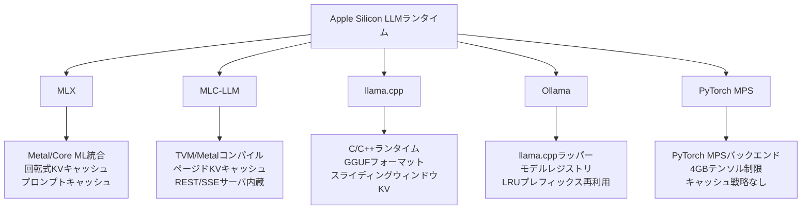

## 論文概要（Abstract）

本記事は [arXiv:2511.05502](https://arxiv.org/abs/2511.05502) の解説記事です。

著者らは、Apple Silicon（Mac Studio M2 Ultra, 192GB統合メモリ）上の5つのローカルLLMランタイム — MLX、MLC-LLM、Ollama、llama.cpp、PyTorch MPS — を体系的に比較評価している。Qwen-2.5モデルファミリーを用いてTTFT、定常状態スループット、レイテンシパーセンタイル、長コンテキスト挙動、量子化、ストリーミング、デプロイ複雑性を測定した。MLXが定常状態スループットで最高性能を達成し、MLC-LLMが中程度のプロンプトでより低いTTFTを実現している。

この記事は [Zenn記事: Ollama v0.35×エアギャップ環境で構築するデータ主権対応オンプレLLM推論基盤](https://zenn.dev/0h_n0/articles/88a1c8d7becfce) の深掘りです。

## 情報源

- **arXiv ID**: 2511.05502
- **URL**: [https://arxiv.org/abs/2511.05502](https://arxiv.org/abs/2511.05502)
- **著者**: Varun Rajesh, Om Jodhpurkar, Pooja Anbuselvan, et al.（Persistent System所属）
- **発表年**: 2025
- **分野**: cs.AR（ハードウェアアーキテクチャ）, cs.AI（人工知能）
- **ライセンス**: CC-BY-SA 4.0

## 背景と動機（Background & Motivation）

ローカルLLM推論がプライバシー、コスト制御、低レイテンシの観点から注目を集めている。クラウドベースの推論サービスでは機密データの外部送信リスクが避けられない。一方、NVIDIA GPU向けの推論スタック（vLLM on A100等）はApple Silicon環境に直接適用できない。

Apple Silicon向けに独自のトレードオフを持つ複数のフレームワークが登場しているが、統一的な方法論での横断比較は存在しなかった。従来のベンチマークは単一ショットのスループット測定に留まるが、プロダクション環境ではコンテキストがターンごとに蓄積し、TTFT、トークン間レイテンシ、KVキャッシュ設計が同等に重要となる。本研究はこの「プロダクショングレード」の定義を明確にし、5つのフレームワークを網羅的に評価している。

## 主要な貢献（Key Contributions）

- **貢献1**: Apple Silicon上の5つのLLMランタイムを統一方法論で横断比較した初の体系的実証研究。TTFT、スループット、レイテンシ、長コンテキスト、量子化、ストリーミング、API互換性、デプロイ複雑性の全次元を網羅
- **貢献2**: 「プロダクショングレード」の定義を明確化 — KVキャッシュ処理、高速TTFT、スムーズストリーミング、バッチ処理、OpenAI互換API、容易なデプロイの5要件を提示
- **貢献3**: シナリオ別推奨を提供 — スループット重視はMLX、レイテンシ重視はMLC-LLM、プロトタイピングはOllama
- **貢献4**: 再現性のためスクリプト、ログ、プロットコード、環境マニフェストを公開

## 技術的詳細（Technical Details）

### 評価環境と方法論

**ハードウェア**: Mac Studio, Apple M2 Ultra, 24 CPUコア, 76 GPUコア, 192GB統合メモリ。Spotlight索引、Time Machine、iCloudの同期を無効化し、バックグラウンドGPUワークロードを排除した環境で測定している。

**フレームワークバージョン**: MLX v0.26、MLC-LLM（commit 3d42929）、llama.cpp（commit b5963）、Ollama v0.10.1、PyTorch 2.7.1（MPSバックエンド）。

**モデル**: Qwen-2.5-Coder 3B（主評価対象）およびQwen-2.5-7B-Instruct（スケーリング検証用）。

**量子化**: FP16/bf16ベースライン、int8およびint4バリアント。MLXは混合ビット（3/4/6/8）、MLC-LLMはAWQ/GPTQ、llama.cppはGGUF 4/5/8/16、OllamaはGGUFレジストリ形式。

**ワークロード設計**: 著者らは3種類のプロンプトパターン（ユニークトークン、プレフィックス重複、コード支配型）を設計し、プロンプト長1k〜100kトークンで評価している。各組み合わせでN=10回の試行を実施し、サンプリングパラメータを固定している。

### 評価メトリクス

著者らは以下のメトリクスを定義している。

- **TTFT（Time-to-First-Token）**: クライアント側でリクエスト受付から最初のトークンが利用可能になるまでの壁時計時間。ウォームパス初期化後の測定（トークナイゼーションはクライアント側で除外）
- **スループット**: (a) デコードスループット = 生成トークン数 / TTFT後のデコード時間、(b) エンドツーエンドスループット = 生成トークン数 / (プリフィル + デコード)時間
- **レイテンシパーセンタイル**: エンドツーエンドレイテンシおよびトークン間レイテンシのp50、p90、p99
- **コールドスタート時間**: モデルロード + 初期化レイテンシ（ウォームスタートと区別）
- **メモリフットプリント**: vm_stat経由のRSSおよびフレームワーク報告のデバイスアロケーション（Metalメトリクス）

### フレームワークアーキテクチャの比較

各フレームワークの設計思想は根本的に異なっている。



**MLX**: Apple Metal/Neural Engineと統合されたApple-native最適化エンジン。回転式KVキャッシュ（デフォルト4kトークン）とディスク上のプロンプトキャッシュにより安定したレイテンシを維持する。GPU利用率90%以上、CPU使用率3%未満。

**MLC-LLM**: TVM（Apache TVM）ベースのコンパイラ/ランタイム。ページドKVキャッシュ（vLLMに類似）により32k〜128kトークンの長コンテキストで効率的な再利用を実現する。組み込みマルチワーカーHTTP/SSEサーバを持つ。

**llama.cpp**: 軽量C/C++ランタイム、Metal対応のGGUF量子化推論特化。セッション内スライディングウィンドウKVキャッシュのみで、32kトークン以上ではアテンションが二次的にスケールし性能が急落する。

**Ollama**: llama.cppラッパー。ワンコマンドインストールとOpenAI互換API提供。LRUプレフィックス再利用で約23%のレイテンシ削減を達成するが、ページドアテンション非対応のため32k以上で急激に劣化する。

**PyTorch MPS**: 4GBテンソルサイズ制限があり、3B以上のモデルで頻繁にOOM。量子化パイプラインの成熟度が低く、プロダクション用途には不向き。

### 量子化フォーマット比較

著者らはTable 1で各フレームワークの量子化サポートを比較している。

| フレームワーク | サポートする量子化形式 | 特記事項 |
|:---|:---|:---|
| MLX | 混合ビット 3/4/6/8, GPTQ | Apple-tuned、プリ量子化モデル提供 |
| MLC-LLM | AWQ, GPTQ, FP16/FP8, 混合精度 | HuggingFace取り込み + TVMコンパイル |
| llama.cpp | GGUF 4/5/8/16-bit | 組み込み量子化器、GGUF固定 |
| Ollama | GGUFレジストリのみ | 一貫性あるがGPTQ/Core ML非対応 |
| PyTorch MPS | 実験的INT4/INT8, bf16 | Core ML非対応、大規模モデルで不安定 |

著者らのアブレーション実験では、AWQ 4-bitモデルがFP16比でメモリ使用量を削減（3Bモデルで約1.6GB）しつつ、スループットを若干向上（約210 tok/s vs. FP16で約190 tok/s）させたと報告されている（MLC-LLMでの測定結果）。

## 実装のポイント（Implementation）

### フレームワーク選定基準

著者らの知見に基づくフレームワーク選定の判断基準を整理する。

**スループット最優先**: MLXを選択。Metal/Neural Engineとの統合で約230 tok/sを達成する。`pip install mlx-lm`で導入でき、プリビルトMetalカーネルで数分で推論開始可能。HTTPサーバは`mlx-openai-server`等のラッパーが必要。

**レイテンシ重視チャット**: MLC-LLMを選択。16kトークン以下でMLXより高速なTTFTを実現する。組み込みREST/SSEサーバと公式SDK（JS/iOS/Android）を持つ。TVMコンパイルに20〜30分の初期コストが必要。

**プロトタイピング**: Ollamaを選択。ワンコマンドでOpenAI互換APIが立ち上がるが、スループットは20〜40 tok/sでプロダクション用途には不向き。

**シングルユーザー**: llama.cppを選択。短コンテキスト（32k以下）で約150 tok/sを提供するが、長コンテキストで急激に劣化する。

```python
def select_framework(use_case: str, max_context: int, concurrent: int) -> str:
    """Apple Siliconローカル推論フレームワーク選定ロジック"""
    if use_case == "throughput":
        return "MLX"           # ~230 tok/s, Metal最適化
    if use_case == "latency":
        return "MLC-LLM"      # 低TTFT, Paged KV(128kまで)
    if use_case == "prototype":
        return "Ollama"        # ワンコマンド, OpenAI互換
    if use_case == "embedded" and max_context <= 32_000:
        return "llama.cpp"     # 軽量C/C++, ~150 tok/s
    return "MLC-LLM" if concurrent > 3 else "MLX"
```

## Production Deployment Guide

### AWS実装パターン（コスト最適化重視）

本論文はApple Siliconでのローカル推論に焦点を当てているが、実運用ではクラウドとのハイブリッド構成が現実的である。以下にローカルLLM推論をAWS環境と組み合わせたパターンを示す。

**トラフィック量別の推奨構成**:

| 構成 | トラフィック | アーキテクチャ | 月額概算 |
|:---|:---|:---|:---|
| Small | ~100 req/日 | Mac mini M4 + Lambda（フォールバック）+ Bedrock | $50-150 |
| Medium | ~1000 req/日 | Mac Studio M2 Ultra + ECS Fargate（オーバーフロー）| $300-800 |
| Large | 10000+ req/日 | Mac Studio fleet + EKS + Spot（バースト対応）| $2,000-5,000 |

Small構成ではローカルMac miniでMLX推論を実行し、障害時にLambda + Bedrockへフォールバックする。Medium構成ではMac Studio M2 UltraをプライマリにECS Fargateでオーバーフロー対応する。Large構成では複数Mac Studioクラスタ + EKS Spotでバースト対応する。

**コスト削減テクニック**: Spot Instances活用で最大90%削減、Reserved Instances（1年）で最大72%削減、Bedrock Batch APIで50%削減、Prompt Cachingで30-90%削減。

**注意**: 上記は2026年10月時点のAWS ap-northeast-1料金に基づく概算値。最新料金はAWS料金計算ツールで確認を推奨する。

### Terraformインフラコード

**Small構成（Serverless + ローカル推論フォールバック）**:

```hcl
# Lambda + Bedrock + DynamoDB（NAT Gateway不使用でコスト削減）
terraform {
  required_version = ">= 1.9"
  required_providers {
    aws = { source = "hashicorp/aws", version = "~> 5.70" }
  }
}
provider "aws" { region = "ap-northeast-1" }

resource "aws_iam_role" "llm_fallback" {
  name = "llm-fallback-role"
  assume_role_policy = jsonencode({
    Version = "2012-10-17"
    Statement = [{ Action = "sts:AssumeRole", Effect = "Allow",
      Principal = { Service = "lambda.amazonaws.com" } }]
  })
}

resource "aws_iam_role_policy" "llm_fallback" {
  name = "llm-fallback-policy"
  role = aws_iam_role.llm_fallback.id
  policy = jsonencode({
    Version = "2012-10-17"
    Statement = [
      { Effect = "Allow", Action = ["bedrock:InvokeModel",
        "bedrock:InvokeModelWithResponseStream"],
        Resource = "arn:aws:bedrock:ap-northeast-1::foundation-model/*" },
      { Effect = "Allow", Action = ["dynamodb:PutItem", "dynamodb:GetItem"],
        Resource = aws_dynamodb_table.request_log.arn },
      { Effect = "Allow", Action = ["logs:CreateLogGroup", "logs:CreateLogStream",
        "logs:PutLogEvents"], Resource = "arn:aws:logs:*:*:*" }
    ]
  })
}

resource "aws_dynamodb_table" "request_log" {
  name = "llm-request-log"
  billing_mode = "PAY_PER_REQUEST"
  hash_key = "request_id"
  attribute { name = "request_id"; type = "S" }
  server_side_encryption { enabled = true }
}

resource "aws_lambda_function" "llm_fallback" {
  function_name = "llm-inference-fallback"
  runtime = "python3.12"; handler = "handler.lambda_handler"
  role = aws_iam_role.llm_fallback.arn
  timeout = 120; memory_size = 512
  filename = "lambda_package.zip"
  environment { variables = { DYNAMODB_TABLE = aws_dynamodb_table.request_log.name } }
  tracing_config { mode = "Active" }
}
```

**Large構成（EKS + Karpenter + Spot）**:

```hcl
module "eks" {
  source  = "terraform-aws-modules/eks/aws"
  version = "~> 20.24"
  cluster_name = "llm-inference-cluster"; cluster_version = "1.31"
  vpc_id = module.vpc.vpc_id; subnet_ids = module.vpc.private_subnets
  enable_cluster_creator_admin_permissions = true
}

resource "kubectl_manifest" "karpenter_nodepool" {
  yaml_body = yamlencode({
    apiVersion = "karpenter.sh/v1"; kind = "NodePool"
    metadata = { name = "gpu-inference" }
    spec = { template = { spec = {
      requirements = [
        { key = "karpenter.sh/capacity-type", operator = "In", values = ["spot", "on-demand"] },
        { key = "node.kubernetes.io/instance-type", operator = "In",
          values = ["g5.xlarge", "g5.2xlarge", "g6.xlarge"] } ]
      nodeClassRef = { name = "default" } } }
      limits = { cpu = "64", memory = "256Gi" }
      disruption = { consolidationPolicy = "WhenEmpty", consolidateAfter = "60s" } }
  })
}

resource "aws_budgets_budget" "llm_monthly" {
  name = "llm-inference-monthly"; budget_type = "COST"
  limit_amount = "5000"; limit_unit = "USD"; time_unit = "MONTHLY"
  notification {
    comparison_operator = "GREATER_THAN"; threshold = 80
    threshold_type = "PERCENTAGE"; notification_type = "ACTUAL"
    subscriber_email_addresses = ["ops-team@example.com"]
  }
}
```

### 運用・監視設定

**CloudWatch Logs Insights クエリ**:

```
# コスト異常検知: 1時間あたりの推論リクエスト数とトークン使用量
fields @timestamp, @message
| filter @message like /inference/
| stats count() as request_count, sum(total_tokens) as total_tokens,
        avg(duration_ms) as avg_duration by bin(1h)

# レイテンシ分析: P95/P99
fields @timestamp, duration_ms, ttft_ms | filter @message like /inference/
| stats percentile(duration_ms, 95) as p95, percentile(ttft_ms, 99) as p99_ttft by bin(1h)
```

**X-Ray トレーシング設定**:

```python
from aws_xray_sdk.core import xray_recorder, patch_all

patch_all()  # boto3自動計装
xray_recorder.configure(sampling=False, context_missing="LOG_ERROR",
                         plugins=("EC2Plugin", "ECSPlugin"))
```

**Cost Explorer自動レポート**: boto3の`ce.get_cost_and_usage()`でBedrock/Lambda/EKS別の日次コストを取得し、$100/日超過時にSNS通知を発行する構成が推奨される。

### コスト最適化チェックリスト

**アーキテクチャ選択**:
- [ ] トラフィック量に応じた構成選択（~100 req/日: Serverless、~1000: Hybrid、10000+: Container）
- [ ] ローカルApple Silicon推論をプライマリ、AWSをフォールバックに設計

**リソース最適化**:
- [ ] EC2/EKS: Spot Instances優先（最大90%削減）
- [ ] Reserved Instances: 常時稼働ノードに1年コミット（最大72%削減）
- [ ] Savings Plans: コンピュートリソース全体の割引検討
- [ ] Lambda: メモリサイズ最適化（Power Tuning実施）
- [ ] ECS/EKS: Karpenterでアイドル時スケールダウン（consolidateAfter: 60s）

**LLMコスト削減**:
- [ ] Bedrock Batch API使用（非リアルタイム処理を50%削減）
- [ ] Prompt Caching有効化（繰り返しプレフィックスで30-90%削減）
- [ ] モデル選択ロジック（軽量タスクはHaikuクラス、重要タスクのみ高性能モデル）
- [ ] トークン数制限（max_tokensの適切な設定）
- [ ] ローカル推論活用（Apple Silicon上のMLXで外部API費用を回避）

**監視・アラート**:
- [ ] AWS Budgets設定（月額上限の80%で通知）
- [ ] CloudWatchアラーム（Lambda実行時間、Bedrockトークン使用量）
- [ ] Cost Anomaly Detection有効化
- [ ] 日次コストレポート（Cost Explorer API + SNS通知）

**リソース管理**:
- [ ] 未使用リソース定期削除（EBS、スナップショット）
- [ ] タグ戦略（Environment/Service/Owner統一）
- [ ] ライフサイクルポリシー（S3、ECR）
- [ ] 開発環境夜間停止（EventBridge Scheduler）

## 実験結果（Results）

### スループット比較

著者らはFigure 1で各フレームワークのスループット（tokens/sec）を報告している。Qwen-2.5ファミリー、同一プロンプト条件での測定結果は以下の通りである。

| フレームワーク | スループット（tok/s） | トークン間レイテンシ | P99レイテンシ |
|:---|:---|:---|:---|
| MLX | ~230 | 5-7ms | ~12ms |
| MLC-LLM | ~190 | - | ~13ms |
| llama.cpp | ~150（短コンテキスト） | - | - |
| Ollama | 20-40 | 9-14ms | - |
| PyTorch MPS | 7-9 | - | - |

MLXのトークン間レイテンシは全フレームワーク中で最も安定している（11-12ms）。

### コールドスタート時間

Figure 2ではコールドスタート（モデルロード + 初期化）の差が報告されている。llama.cpp（~0.5s）とOllama（~0.6s）が高速な初期化を示す一方、MLXは~31s、MLC-LLMは~11s（初回TVMコンパイル20-30分は別途必要）を要する。PyTorch MPSは小規模モデルで~3sだが大規模では不安定である。著者らはウォーム状態ではこの差はプロダクションで問題にならないと述べている。

### 長コンテキスト挙動

Table 2で報告されているKV/プロンプトキャッシュの比較では、フレームワーク間の設計差が顕著に現れている。MLC-LLMはページドKVキャッシュにより128kトークンを約3分で処理し、メモリ断片化4%未満を達成する（絶対メモリは70-85GB）。MLXは回転式KVキャッシュで4k〜32kコンテキストの安定性に優れるが、ページドアテンション未実装のためMLC-LLMの長コンテキスト処理能力には及ばない。Ollamaは32k以上で急激に劣化（100kで約56GBメモリ）、llama.cppは32k以上でスループットが約1.2 tok/sまで低下する。PyTorch MPSは4GBテンソル制限により長コンテキスト不適である。

### ストリーミングとAPI互換性

ストリーミングではOllamaが最もターンキー（組み込みSSEサーバ、9-14msトークン間隔）、MLXが最も安定したトークン間レイテンシ（11-12ms）を提供する（Table 3）。OpenAI API互換性ではOllamaが開発者フレンドリー（`/chat/completions`完全カバー、多言語SDK）、MLC-LLMが最も広範なAPI表面（`/embeddings`含む、JS/iOS/Android SDK）を提供する（Table 4）。

## 実運用への応用（Practical Applications）

### Zenn記事との関連

関連するZenn記事ではOllama v0.35をエアギャップ環境で運用するアーキテクチャを解説しており、RTX 4090上で95-135 tok/sのスループット（実測QPS上限10-50）を報告している。本論文の結果は、Apple Silicon環境ではOllamaが20-40 tok/sに留まり、NVIDIA GPU環境との差が約3-5倍に開くことを定量的に示している。

Ollamaの強みはデプロイの容易さとOpenAI互換APIにあるが、スループットが要求される環境ではMLX（Apple Silicon）やvLLM（NVIDIA GPU）への移行が合理的である。

### フレームワーク使い分けの判断

実運用環境での選択は以下のように整理できる。

**Ollama**: プロトタイピングとエアギャップ環境での単一ノードデプロイに適する。Zenn記事のDocker/Kubernetes連携設計はそのまま有効だが、3ユーザー以上の並行処理では性能が急激に劣化する。

**vLLM（NVIDIA GPU）**: NVIDIA A100 + vLLMはApple Siliconの5-10倍のスループットを維持し、マルチテナント環境では依然として優位である。

**MLX + MLC-LLM**: プライバシー要件が厳しい環境でのオンデバイス推論に適する。MLXをバッチ処理に、MLC-LLMをインタラクティブチャットに使い分けるハイブリッド構成が著者らの推奨である。

## 関連研究（Related Work）

- **FlashAttention-2**: アテンションI/O削減によるスループット向上。MLC-LLMとMLXがこの技術を部分的に採用している（Dao, 2023, arXiv:2307.08691）
- **vLLM / PagedAttention**: KVキャッシュページングと連続バッチ処理。MLC-LLMのページドKVキャッシュはこの手法に類似する（Kwon et al., 2023, arXiv:2309.06171）
- **GPTQ / AWQ / SmoothQuant**: ポストトレーニング量子化手法群。MLXとMLC-LLMが実装しApple GPU上での実用性を検証（Frantar et al., 2022; Lin et al., 2023）

## まとめと今後の展望

著者らは、Apple Silicon上のプロダクションLLM推論において、MLXとMLC-LLMが唯一の実用的な選択肢であると結論付けている。MLXはスループット・効率性・Apple統合で最高の総合性能を提供し、MLC-LLMはレイテンシ感度の高いチャットワークロードと100k以上の長コンテキスト処理でMLXを補完する。Ollamaはプロトタイピングに適するがスループットは1桁低く、llama.cppは短コンテキストのシングルユーザー向け、PyTorch MPSはメモリ・性能制約から実用外と評価されている。

今後の研究方向として、14Bモデルへの評価拡大、NVIDIA GPU推論との直接比較、chunked prefillの実装による長コンテキストTTFT改善が挙げられている。Apple Siliconフレームワークは絶対性能ではNVIDIA GPUに及ばないものの、オンデバイス推論の実用的ソリューションとして急速に成熟していると著者らは総括している。

## 参考文献

- **arXiv**: [https://arxiv.org/abs/2511.05502](https://arxiv.org/abs/2511.05502)
- **MLX**: [https://machinelearning.apple.com/research/mlx](https://machinelearning.apple.com/research/mlx)
- **MLC-LLM**: [https://github.com/mlc-ai/mlc-llm](https://github.com/mlc-ai/mlc-llm)
- **llama.cpp**: [https://github.com/ggerganov/llama.cpp](https://github.com/ggerganov/llama.cpp)
- **Ollama**: [https://github.com/ollama/ollama](https://github.com/ollama/ollama)
- **Related Zenn article**: [https://zenn.dev/0h_n0/articles/88a1c8d7becfce](https://zenn.dev/0h_n0/articles/88a1c8d7becfce)
