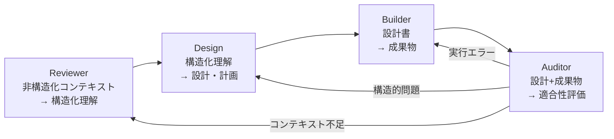

## 論文概要（Abstract）

本記事は [Context Engineering: A Practitioner Methodology for Structured Human-AI Collaboration](https://arxiv.org/abs/2604.04258) の解説記事です。

本論文は、LLMとの協働において「プロンプトの巧みさ」よりも「コンテキストの完全性」が出力品質に強く関連するという仮説を、200件の実験的インタラクションで検証した実践的方法論を提示している。著者は5つの役割（Authority, Exemplar, Constraint, Rubric, Metadata）で構成されるコンテキストパッケージと、4段階のパイプライン（Reviewer, Design, Builder, Auditor）を定義し、反復回数を平均3.8回から2.0回に削減、初回受理率を32%から55%に改善したと報告している。

この記事は [Zenn記事: 構造化プロンプト設計パターン：CO-STAR×XMLタグ×推論モデル対応の実装手法](https://zenn.dev/0h_n0/articles/78ab36484a8edd) の深掘りです。

## 情報源

- **arXiv ID**: 2604.04258
- **URL**: [arXiv:2604.04258](https://arxiv.org/abs/2604.04258)
- **著者**: Elias Calboreanu
- **発表年**: 2026年4月
- **分野**: cs.AI（人工知能）、cs.HC（ヒューマンコンピュータインタラクション）

## 背景と動機（Background & Motivation）

Andrej Karpathyは「context engineering（not prompt engineering）が全ての本格的なLLMアプリケーションのコアスキルである」と述べ、Shopify CEOのTobi Lutkeも同概念を支持している。しかし既存研究は単一プロンプトの最適化（zero-shot, few-shot, chain-of-thought等）に集中しており、プロンプトに付随するコンテキスト全体の構造化を体系的に扱った研究は限られていた。著者は200件の観察分析から、不完全なコンテキストが反復サイクルの72%の原因であることを特定している。

## 主要な貢献（Key Contributions）

- **5役割コンテキストパッケージ**: Authority, Exemplar, Constraint, Rubric, Metadataの5つの役割を優先度付きで定義し、コンテキストの構造化フレームワークを確立
- **4段階パイプライン**: Reviewer, Design, Builder, Auditorの4フェーズで段階的にコンテキストを処理する実行パイプラインを定義
- **定量的検証**: 200件のインタラクション（Claude 102件、ChatGPT 98件）で反復回数の削減（3.8→2.0）、初回受理率の改善（32%→55%）、最終成功率91.5%を実証
- **信頼性工学・情報理論モデルの適用**: Capture-Recapture推定やInformation Bottleneck原理を事後的な解釈レンズとして適用

## 技術的詳細（Technical Details）

### 5役割コンテキストパッケージ

LLMに送信するコンテキストを5つの役割に分類し、優先度による衝突解決ルールを定義している。

| 優先度 | 役割 | 機能 | 具体例 |
|--------|------|------|--------|
| 1（最高） | **Authority** | 権限の付与、境界の設定、成功基準の定義 | operator_authority_v1.0.md |
| 2 | **Exemplar** | 望ましい出力フォーマットのパターン提示 | 過去の成功出力例 |
| 3 | **Constraint** | 制限事項、禁止パス、技術要件の指定 | 「AIバズワード禁止」等 |
| 4 | **Rubric** | 評価基準と品質標準の定義 | 4段階品質ルーブリック |
| 5（最低） | **Metadata** | リクエストとリクエスタに関する補足情報 | プロジェクト背景、期限 |

著者は**Metadata Paradox**を強調する。ユーザーのプロンプト（Metadata）はインタラクションを開始するが出力を統制しない。統制権はDesignフェーズで生成されるAuthority文書に属する。論文Table 5より、Authority文書の形態による影響は顕著である。

| Authority形態 | 初回受理率 | 監査却下数 |
|---------------|-----------|-----------|
| ファイルベース | 89%（84/94） | 2件 |
| 口頭指示 | 64%（50/78） | 8件 |
| なし | 29%（8/28） | 12件 |

ファイルベースと不在で初回受理率に60ポイントの差が生じている。

### 4段階パイプライン



Reviewerは非構造化入力を構造化理解に変換し、Designがアーキテクチャ（＝Authority文書）を生成、Builderが設計に従い成果物を生成し、Auditorが適合性を判定する。Auditorの検出結果は実行エラー→Builder、構造的問題→Design、コンテキスト不足→Reviewerの3経路で差し戻される。論文Table 6より、フェーズスキップ時の欠陥数は以下の通りである。

| スキップフェーズ | 欠陥数 | うちCritical | Major |
|-----------------|--------|-------------|-------|
| Reviewerスキップ | 34 | 18 | 12 |
| Designスキップ | 28 | 8 | 15 |
| Auditorなし | 45 | 7 | 28 |

### 信頼性工学モデル

Capture-Recapture欠陥推定（Eick et al., 1992）のChapman補正推定量は以下の通りである。

$$
\hat{N} = \frac{(n_1 + 1)(n_2 + 1)}{m + 1} - 1
$$

ここで、
- $n_1$: 第1レビュアー（Builder）が発見した欠陥数
- $n_2$: 第2レビュアー（Auditor）が発見した欠陥数
- $m$: 両者が共通に発見した欠陥数（重複）
- $\hat{N}$: 推定総欠陥数

論文の事例では $n_1=0, n_2=12, m=0$ であり、$\hat{N}=12$ となった。$m=0$（重複ゼロ）はAuditorが発見した欠陥の100%がBuilderには不可視であったことを意味する。

また、N-Version検出確率（Avizienis, 1985）を複数ツール活用の根拠として示している。

$$
P(\text{detect}) = 1 - \prod_{i=1}^{n}(1 - p_i)
$$

ここで $p_i$ は各ツール $i$ の単独検出確率である。$p \approx 0.55$ の2ツールでは $P = 1 - (1-0.55)^2 = 0.798$ となり、単一ツールに対して45%の改善が得られる。

### 情報理論モデル

Information Bottleneck原理（Tishby et al., 2000）をコンテキスト圧縮の解釈に適用している。

$$
\min_{p(t|x)} I(X;T) - \beta \cdot I(T;Y)
$$

ここで、
- $X$: 生の入力コンテキスト
- $T$: 圧縮された表現（コンテキストパッケージ）
- $Y$: 目標出力
- $\beta$: 圧縮と関連性のトレードオフ制御パラメータ
- $I(\cdot;\cdot)$: 相互情報量

役割宣言付きの2ファイルパッケージ（低い$I(X;T)$、高い$I(T;Y)$）がAuthority宣言のない4ファイルパッケージを上回り、「量より構造」の原則を情報理論的に裏付けている。

### コンテキストパッケージ組み立ての実装例

```python
from dataclasses import dataclass, field
from enum import IntEnum
from pathlib import Path


class RolePriority(IntEnum):
    """コンテキスト役割の優先度（低い値ほど高優先度）。"""
    AUTHORITY = 1
    EXEMPLAR = 2
    CONSTRAINT = 3
    RUBRIC = 4
    METADATA = 5


@dataclass(frozen=True)
class ContextRole:
    """コンテキストパッケージの1要素。"""
    role: RolePriority
    content: str
    source: Path | None = None


@dataclass
class ContextPackage:
    """5役割コンテキストパッケージの組み立てと優先度解決。"""
    roles: list[ContextRole] = field(default_factory=list)

    def add_role(self, role: ContextRole) -> None:
        self.roles.append(role)

    def resolve(self) -> str:
        """優先度順にソートし結合したコンテキスト文字列を返す。"""
        sorted_roles = sorted(self.roles, key=lambda r: r.role.value)
        return "\n\n".join(
            f"## [{r.role.name}] (Priority {r.role.value})\n{r.content}"
            for r in sorted_roles
        )

    def completeness_score(self) -> float:
        """5役割のうち何割が充足されているかを返す（0.0-1.0）。"""
        return len({r.role for r in self.roles}) / len(RolePriority)


# 使用例
package = ContextPackage()
package.add_role(ContextRole(RolePriority.AUTHORITY,
    "出力はMarkdown形式。AIバズワード禁止。分析→引用の順序で記述。",
    Path("operator_authority_v1.0.md")))
package.add_role(ContextRole(RolePriority.EXEMPLAR, "[過去の成功出力をここに挿入]"))
package.add_role(ContextRole(RolePriority.CONSTRAINT, "文字数: 3000-5000字。外部URL禁止。"))
package.add_role(ContextRole(RolePriority.RUBRIC, "SUCCESS / PARTIAL / FAILED の3段階評価。"))
package.add_role(ContextRole(RolePriority.METADATA, "プロジェクト: 技術ブログ。対象: エンジニア。"))

print(f"Completeness: {package.completeness_score():.0%}")  # 100%
print(package.resolve())
```

## 実装のポイント（Implementation）

**Authority文書の外部化**: 直近10件のインタラクションから再発する修正パターンを抽出し、バージョン管理されたAuthority文書（例: `operator_authority_v1.0.md`）として外部化する。

**テンプレート再利用**: 論文Finding 9より、テンプレート化されたパッケージは2.3倍のコスト削減をもたらし、後半の使用ほど初回受理率が向上すると報告されている。

**Exemplarの効果**: 論文Finding 4より、Exemplar（出力例）が含まれる場合、明確化リクエストが34%減少する。

**Constraint役割の明示化**: 論文Finding 11より、修正が必要な出力の68%は未記述の制約に違反していた。暗黙の前提をConstraintとして明示することで手戻りを防止できる。

## Production Deployment Guide

Context Engineeringパイプラインをプロダクション環境で運用するためのAWSデプロイメント構成を示す。

### AWS実装パターン（コスト最適化重視）

トラフィック量別の構成を整理する。コスト試算は2026年10月時点のap-northeast-1料金に基づく概算値であり、実際のコストはトラフィックパターンにより変動する。

| 項目 | Small (~100 req/日) | Medium (~1,000 req/日) | Large (10,000+ req/日) |
|------|---------------------|------------------------|------------------------|
| コンピュート | Lambda (512MB, 30s) | ECS Fargate (1vCPU, 2GB) | EKS + Karpenter (Spot) |
| LLM | Bedrock (Claude Sonnet) | Bedrock (Batch API) | Bedrock + Prompt Caching |
| ストレージ | DynamoDB On-Demand | DynamoDB Provisioned | DynamoDB DAX + S3 |
| キュー | - | SQS Standard | SQS FIFO + EventBridge |
| 月額目安 | $50-150 | $300-800 | $2,000-5,000 |

**コスト削減テクニック**:
- Spot Instances活用で最大90%のコンピュートコスト削減
- Reserved Instances（1年コミット）で最大72%削減
- Bedrock Batch API使用でLLM推論コスト50%削減
- Prompt Caching有効化でトークンコスト30-90%削減

### Terraformインフラコード

**Small構成（Serverless）**: Lambda + Bedrock + DynamoDB

```hcl
# Context Engineering Pipeline - Small Serverless (2026-10)
terraform {
  required_version = ">= 1.9"
  required_providers {
    aws = { source = "hashicorp/aws", version = "~> 5.70" }
  }
}

provider "aws" { region = "ap-northeast-1" }

# IAM: 最小権限（Bedrock + DynamoDB + CloudWatch Logs）
resource "aws_iam_role" "context_pipeline" {
  name               = "context-pipeline-lambda"
  assume_role_policy  = jsonencode({
    Version = "2012-10-17"
    Statement = [{ Action = "sts:AssumeRole", Effect = "Allow",
                    Principal = { Service = "lambda.amazonaws.com" } }]
  })
}

resource "aws_iam_role_policy" "bedrock_invoke" {
  name = "bedrock-invoke"
  role = aws_iam_role.context_pipeline.id
  policy = jsonencode({
    Version = "2012-10-17"
    Statement = [
      { Effect = "Allow", Action = ["bedrock:InvokeModel"],
        Resource = "arn:aws:bedrock:ap-northeast-1::foundation-model/anthropic.claude-*" },
      { Effect = "Allow", Action = ["dynamodb:PutItem","dynamodb:GetItem","dynamodb:Query"],
        Resource = aws_dynamodb_table.context_store.arn },
      { Effect = "Allow", Action = ["logs:CreateLogGroup","logs:CreateLogStream","logs:PutLogEvents"],
        Resource = "arn:aws:logs:ap-northeast-1:*:*" }
    ]
  })
}

# DynamoDB: コンテキストパッケージ保存（On-Demand + KMS暗号化）
resource "aws_dynamodb_table" "context_store" {
  name         = "context-packages"
  billing_mode = "PAY_PER_REQUEST"
  hash_key     = "package_id"
  range_key    = "created_at"
  attribute { name = "package_id"; type = "S" }
  attribute { name = "created_at"; type = "S" }
  server_side_encryption { enabled = true }
  point_in_time_recovery { enabled = true }
}

# Lambda: パイプライン実行（X-Ray有効）
resource "aws_lambda_function" "pipeline" {
  function_name = "context-engineering-pipeline"
  runtime       = "python3.12"
  handler       = "pipeline.handler"
  role          = aws_iam_role.context_pipeline.arn
  timeout       = 30
  memory_size   = 512
  filename      = "lambda.zip"
  environment {
    variables = { CONTEXT_TABLE = aws_dynamodb_table.context_store.name,
                  MODEL_ID = "anthropic.claude-sonnet-4-20250514" }
  }
  tracing_config { mode = "Active" }
}
```

**Large構成（Container）**: EKS + Karpenter + Spot

```hcl
# Context Engineering Pipeline - Large Container (2026-10)
module "eks" {
  source          = "terraform-aws-modules/eks/aws"
  version         = "~> 20.24"
  cluster_name    = "context-eng-cluster"
  cluster_version = "1.31"
  vpc_id          = module.vpc.vpc_id
  subnet_ids      = module.vpc.private_subnets
  cluster_endpoint_public_access = false
}

# Karpenter: Spot優先（m7i/m6i/m5.xlarge、64CPU/128GiB上限）
resource "kubectl_manifest" "karpenter_nodepool" {
  yaml_body = yamlencode({
    apiVersion = "karpenter.sh/v1", kind = "NodePool"
    metadata = { name = "context-pipeline" }
    spec = {
      template = { spec = { requirements = [
        { key = "karpenter.sh/capacity-type", operator = "In", values = ["spot","on-demand"] },
        { key = "node.kubernetes.io/instance-type", operator = "In",
          values = ["m7i.xlarge","m6i.xlarge","m5.xlarge"] }
      ]}}
      limits = { cpu = "64", memory = "128Gi" }
      disruption = { consolidationPolicy = "WhenEmptyOrUnderutilized", consolidateAfter = "30s" }
    }
  })
}
```

### 運用・監視設定

**CloudWatch Logs Insights クエリ**: コスト異常検知

```
fields @timestamp, @message
| filter @message like /InvokeModel/
| stats sum(inputTokens) as total_input, sum(outputTokens) as total_output by bin(1h)
| sort @timestamp desc
```

**CloudWatch アラーム + X-Ray トレーシング**:

```python
import boto3
from aws_xray_sdk.core import xray_recorder, patch_all

patch_all()  # boto3自動計装
cloudwatch = boto3.client("cloudwatch", region_name="ap-northeast-1")


def create_token_alarm(function_name: str, threshold: int = 100000) -> dict:
    """Bedrockトークン使用量のスパイク検知アラームを作成する。

    Args:
        function_name: 監視対象Lambda関数名
        threshold: 1時間あたりのトークン閾値

    Returns:
        CloudWatch APIレスポンス
    """
    return cloudwatch.put_metric_alarm(
        AlarmName=f"{function_name}-token-spike",
        MetricName="InputTokenCount", Namespace="AWS/Bedrock",
        Statistic="Sum", Period=3600, EvaluationPeriods=1,
        Threshold=threshold, ComparisonOperator="GreaterThanThreshold",
        AlarmActions=["arn:aws:sns:ap-northeast-1:ACCOUNT:cost-alert"],
    )


@xray_recorder.capture("context_pipeline")
def run_pipeline(package_id: str) -> dict:
    """パイプライン実行をX-Rayでトレースする。

    Args:
        package_id: コンテキストパッケージID

    Returns:
        パイプライン実行結果
    """
    subsegment = xray_recorder.current_subsegment()
    subsegment.put_annotation("package_id", package_id)
    subsegment.put_metadata("pipeline", {"phase": "reviewer"})
    return {"status": "success", "package_id": package_id}
```

**Cost Explorer日次レポート**: `get_cost_and_usage`でBedrock/Lambda/EKS別の日次コストを集計し、$100/日超過でSNS通知を発信する。

### コスト最適化チェックリスト

**アーキテクチャ**: トラフィック量で構成を選択（~100/日: Serverless、~1000/日: Hybrid、10000+/日: Container）

**リソース最適化**: Spot Instances優先（最大90%削減）、Reserved Instances 1年コミット（72%削減）、Savings Plans検討、Lambda Power Tuning、Karpenter consolidateAfter: 30s

**LLMコスト削減**: Bedrock Batch API（50%削減）、Prompt Caching（Authority文書キャッシュ30-90%削減）、フェーズ別モデル選択（Reviewer/AuditorはHaiku、BuilderはSonnet）、最大トークン数制限

**監視**: AWS Budgets月次アラート、CloudWatchトークン/レイテンシ監視、Cost Anomaly Detection、日次SNSレポート

**リソース管理**: 未使用リソース定期削除、タグ戦略（`project:context-eng`）、S3ログ90日→Glacier、開発環境夜間停止

## 実験結果（Results）

著者は200件の構造化インタラクション（Claude 102件、ChatGPT 98件）と50件のベースライン（非構造化）インタラクションを比較している。論文Table 4より、品質結果は以下の通りである。

| 結果 | Claude | ChatGPT | 合計（構造化） | ベースライン |
|------|--------|---------|---------------|-------------|
| 初回受理 | 59 (57.8%) | 51 (52.0%) | 110 (55.0%) | 16 (32%) |
| 反復後受理 | 35 (34.3%) | 38 (38.8%) | 73 (36.5%) | 15 (30%) |
| 部分的成功 | 5 (4.9%) | 6 (6.1%) | 11 (5.5%) | 10 (20%) |
| 失敗 | 3 (2.9%) | 3 (3.1%) | 6 (3.0%) | 9 (18%) |
| **最終成功率** | **92.2%** | **90.8%** | **91.5%** | **62%** |

コンテキスト完全性はClaude 86%、ChatGPT 81%（合計83.5%）に対し、ベースラインは45%であった。平均反復回数は構造化2.0回に対しベースライン3.8回である。

コンテキストサイズと品質の関係について、論文の分析より以下が報告されている。

| コンテキスト規模 | トークン数 | 平均反復回数 | 初回受理率 |
|-----------------|-----------|-------------|-----------|
| Minimal | <500 | 3.4 | 21% |
| Moderate | 500-2,000 | 2.1 | 72% |
| Comprehensive | >2,000 | 1.3 | 89% |

ただし、著者は「量より構造が重要」と強調している。なお、本研究は単一オペレーターによる観察研究であり、統制実験ではない点に留意が必要である。

## 実運用への応用（Practical Applications）

本論文の5役割コンテキストパッケージは、Zenn記事「構造化プロンプト設計パターン」で紹介されているCO-STARフレームワーク（Context, Objective, Style, Tone, Audience, Response）と相補的に活用できる。CO-STARが単一プロンプト内の構造化に焦点を当てるのに対し、本論文のアプローチはプロンプトの「外側」にあるコンテキスト全体の構造化を扱う。

プロダクション環境での活用例として、論文の本番検証では11の自動化レーンで2,132件のチケットを分類している。Authority文書で分類基準を定義しExemplarで分類例を提示することで人手介入を削減できる。コードレビュー自動化では4段階パイプラインをそのまま適用し、Auditorフェーズで偽陽性を除去するパイプラインが構築できる。

## 関連研究（Related Work）

- **Hua et al. (2025)**: コンテキストエンジニアリングを「送信者の意図と受信者の理解を橋渡しするコンテキストの体系的設計プロセス」と定義。本論文はこの定義を5役割フレームワークに具体化
- **Eick et al. (1992)**: Capture-Recapture欠陥推定法。本論文ではAuditorフェーズの有効性定量化に適用
- **Tishby et al. (2000)**: Information Bottleneck原理。「量より構造」原則の理論的裏付けとして使用

## まとめと今後の展望

本論文は、LLMとの協働において「何を聞くか」（プロンプト）よりも「何を与えるか」（コンテキスト）の構造化が品質を左右するという知見を、200件のインタラクションで実証した。5役割コンテキストパッケージと4段階パイプラインは、プロンプトエンジニアリングの実践を体系化する有用なフレームワークである。

今後の課題として、複数オペレーターによる統制実験やドメイン横断の一般化検証、コンテキスト完全性の自動測定手法の確立が挙げられる。

## 参考文献

- **arXiv**: [https://arxiv.org/abs/2604.04258](https://arxiv.org/abs/2604.04258)
- **Related Zenn article**: [構造化プロンプト設計パターン：CO-STAR×XMLタグ×推論モデル対応の実装手法](https://zenn.dev/0h_n0/articles/78ab36484a8edd)
- Eick et al. (1992), Tishby et al. (2000), Avizienis (1985)
