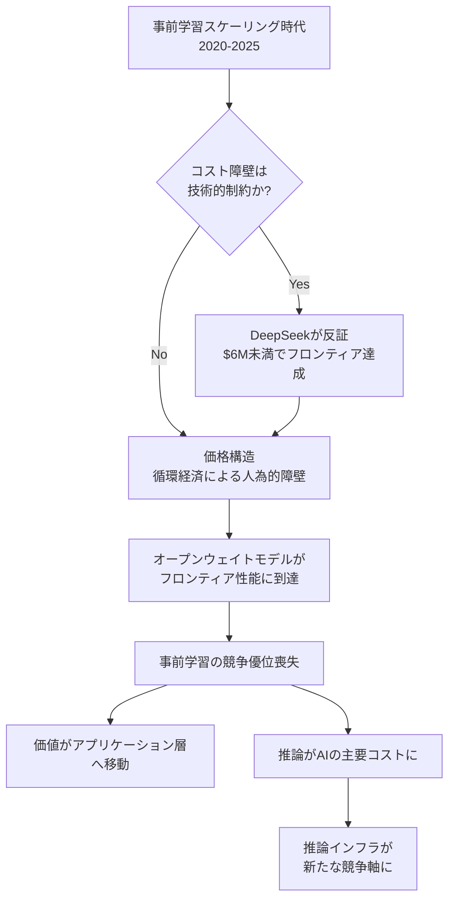

## 論文概要（Abstract）

本記事は [arXiv:2604.06217](https://arxiv.org/abs/2604.06217) の解説記事です。

著者のJared James Grogan（Universitas AI）は、基盤モデル時代（2020年-2025年）が終焉を迎えたと主張している。オープンソースモデルがフロンティア性能に到達し、推論コストがゼロに近づく中で、大規模事前学習が持続的な競争優位ではないことが構造的に明らかになったと論じている。論文は経済・技術・商業・政治の4軸で同時に進行する再編を分析し、オープンウェイトモデルが政府による主権的AI統制の手段となるという逆説的な議論を展開する。44ページ、75の参考文献を含む分析論文である。

この記事は [Zenn記事: Ollama v0.35×エアギャップ環境で構築するデータ主権対応オンプレLLM推論基盤](https://zenn.dev/0h_n0/articles/88a1c8d7becfce) の深掘りです。

## 情報源

- **arXiv ID**: 2604.06217
- **URL**: [arXiv:2604.06217](https://arxiv.org/abs/2604.06217)
- **著者**: Jared James Grogan（Universitas AI）
- **発表日**: 2026年3月18日（Version 1.0、2026年3月9日時点のイベントを対象）
- **分野**: cs.CY（Computers and Society）, cs.AI（Artificial Intelligence）
- **キーワード**: AI Political Economy, National Security, Foundation Models, scaling laws, open-weight models, agentic systems, dual-use technology, supply chain risk

## 背景と動機（Background & Motivation）

2020年から2025年にかけて、AI業界は「基盤モデル時代」と呼べる構造の中で発展した。GPT-2からGPT-4に至る各世代で、モデルの規模拡大とともに性能が向上し、事前学習のスケーリングが競争優位の源泉と信じられてきた。Kaplan et al. [3]やHoffmann et al. [4]のスケーリング則がこの信念に定量的な根拠を与えた。

しかし著者は、この前提を支えていた力学が2025年後半から2026年初頭にかけて逆転したと主張している。その転換点として、2026年2月の米国政府によるAnthropicのサプライチェーンリスク指定（10 U.S.C. Section 3252および41 U.S.C. Section 1323に基づく）を挙げるが、この政府行動は既に進行中の構造変化を「加速」したのであり「原因」ではないと明確に区別している。

本論文が取り組む中心的課題は、基盤モデル企業の競争優位の構造的脆弱性と、それに代わるAI産業の新たな構造を明らかにすることである。

## 主要な貢献（Key Contributions）

- **4軸再編フレームワーク**: AI産業が経済・技術・商業・政治の4つの次元で同時に構造転換していることを統合的に分析
- **循環経済構造の解明**: ハイパースケーラーと基盤モデル企業間の投資-コンピュート支出の自己強化ループが、基盤モデルの評価額を実態以上に膨張させていた構造を明示的に記述
- **Sovereign AI論**: オープンウェイトモデルが政府のAI主権にとって最適なアーキテクチャであるという逆説的命題の提示
- **二分岐予測**: 商業AIと国家安全保障AIが構造的に不可逆な分岐を遂げるという分析

## 技術的詳細（Technical Details）

### 事前学習コストの逓減する限界収益

著者は、世代ごとの訓練コスト上昇と性能向上の非対称性を具体的なデータで示している。

| モデル | リリース年 | パラメータ数 | 推定訓練コスト | 主要ベンチマーク改善 |
|--------|---------|-----------|-------------|------------------|
| GPT-2 | 2019 | 15億 | 約$43,000 | - |
| GPT-3 | 2020 | 1750億 | $4-5M | 20-60pp向上（言語タスク） |
| GPT-4 | 2023 | 非公開 | $60-100M | MMLU: 70%→86.4%, HumanEval: 48%→67% |
| GPT-4.5 | 2025前半 | 非公開 | 約$500M | GPT-4比で限定的改善 |

（論文Section II, p.4-5のデータに基づく。訓練コストは論文中の公開情報・推定値）

著者は「4世代にわたり訓練コストは$43,000から$500Mへと約4桁上昇したが、性能曲線は平坦化し、コスト曲線は急峻化している」（Section II, p.4）と指摘している。Dario Amodeiが2024年4月に「フロンティアモデルの訓練コストは2025-2026年までに$5-10Bに達する」と述べた[8]のに対し、DeepSeek-R1は$6M未満の訓練コストでOpenAI o1と同等の推論能力を実現した[14]。これは予測コストの約1000分の1であり、著者は「コスト物語の構造的反証」と位置づけている。

### オープンウェイトモデルの性能収束

著者は、オープンソースモデルのフロンティア性能到達が段階的に進行した経緯を以下のように整理している。

1. **LLaMA-1**（2023年2月）: Metaがオープンウェイトで競争力のある性能を実現可能であることを実証[11]
2. **Llama 3ファミリー**（2024年）: 大半の実用アプリケーションでGPT-4クラスの性能を達成[12][13]
3. **DeepSeek-R1**（2025年1月）: フロンティアラボが数十億ドルを要すると予測していた推論能力を、GPT-3時代の支出水準で実現[14]

DeepSeek-V3の基盤モデルは、総パラメータあたり約22トークンで訓練されており、これはChinchillaの計算最適比率（約20）にほぼ一致する[4][19]。671Bの総パラメータに対し、Mixture-of-Experts（MoE）アーキテクチャにより順方向パスで活性化されるのは37Bのみであり、トークンあたりの実効計算量を1桁削減している。FP8精度学習がハードウェア要件をさらに圧縮した。著者は「これらの手法はいずれも独自技術ではなく、公開技術レポートに文書化されている」と強調している。

### ハイパースケーラー循環経済の構造

著者が最も詳細に分析しているのが、基盤モデル企業の評価額を支えてきた循環的投資構造である（Section II, p.8-10）。

この構造の要点は以下の通りである。

1. ハイパースケーラー（Microsoft, Amazon, Google）が基盤モデル企業に出資する
2. 基盤モデル企業はその資金を出資元のクラウドインフラに支出する
3. 高額の訓練コストが次回ラウンドの高評価額を正当化する
4. 次のラウンドで同じサイクルが繰り返される

著者はAmazon-Anthropicの関係を具体例として詳述している。Amazonは2回のトランシェで計$8Bを投資[22][23]。Anthropicの評価額は設立時（2021年）の約$1Bから、Series E（2025年3月, $61.5B）、Series F（2025年9月, $183B）、Series G（2026年2月, $380B）へと上昇した[25][26][27]。著者は「約5年で380倍の評価額上昇であり、Amazonが最大投資家・主要インフラベンダー・転換社債の評価者を同時に務めていた期間に最も急激な上昇が生じた」と指摘している。

Amazonはこの持分を「Level 3」資産（SEC開示において「観察不能なインプット」に基づく評価）として計上しており[24]、2026年2月時点での報告価値は$60.6Bであった。著者は「評価額は購入価格を設定したのと同じ主体の前提に基づいている」と述べている。

### 推論コストの低下と推論インフラの戦略的重要性

著者は事前学習と推論の経済的非対称性を強調している（Section II, p.6）。事前学習は大規模な一回限りの資本支出であるのに対し、推論はモデルの全ライフサイクルにわたる継続的な運用支出である。

AWSがTrainium（学習用）とInferentia（推論用）という異なるアーキテクチャのチップを提供していること自体が、これら2つのワークロードの計算要件が根本的に異なることを反映していると著者は指摘する。NVIDIAの学習用GPU（H100, B200）における優位性は、推論時のスループット/ドル/トークンが重要となる推論市場では異なる競争環境に直面する。

NVIDIAのGroqとの取引（2025年12月、報道では約$20B規模[62][63]）は、この推論シフトの象徴的事例として分析されている。GroqのLanguage Processing Unit（LPU）はTransformer推論のスループットに特化した設計であり、学習用GPUとは根本的に異なるアーキテクチャである。著者は「学習が商品化しモデルウェイトが自由に流通する中で、推論経済学 -- 日々数十億クエリに対するドルあたり・トークンあたりのスループット -- がAIハードウェア競争の主要変数となる」と述べている。

### 事前学習スケールからの分離: 3つの技術シフト

著者は、事前学習スケールとフロンティア性能の結合が3つの並行する技術的発展により切断されたと分析している（Section II, p.7）。

**1. ポストトレーニング最適化**: RLHF、instruction fine-tuning、preference learningにより、事前学習コストの一部で実質的な性能改善を実現。著者は「ユーザーが『モデル能力』として体験するものの多くは、事前学習スケールではなくポストトレーニングの成果である」と述べている。

**2. テスト時計算スケーリング**: DeepSeek-R1およびOpenAI o1に代表される手法で、計算予算を学習から推論へ再配置する。より小さく安価なモデルが十分な推論時計算予算で、より大きく高価なモデルを推論タスクで上回ることが可能になった。

**3. エージェンティック合成**: 単一の大規模密モデルがすべてのタスクを端から端まで処理する代わりに、基盤モデルを検索システム・ツール使用フレームワーク・オーケストレーション層と組み合わせてシステムを構築する。MoEアーキテクチャも同じ原理をモデル内部で適用している。

著者はGPT-5（2025年8月リリース）をこの分離の具体例として挙げている。GPT-5はGPT-4.5より少ない事前学習計算量で訓練されたが、スケールされたポストトレーニングにより能力差を事前学習ではなくポストトレーニングに置いた[18]。「GPT-5の経路の存在が、フロンティア能力が大規模事前学習を必要としないことを証明している」と著者は主張している。

### Sovereign AI: 政府によるAI統制の構造的必然性

論文のSection IIIは、政府がAIに対する統制を主張する構造的必然性を歴史的比較から論じている。著者は核技術、インターネット、宇宙開発、暗号技術の事例を分析し、「国家権力の計算を実質的に変える全てのデュアルユース技術は、国家安全保障上の応用において政府の権限下に置かれてきた」と述べている（Section III, p.13）。

著者はAnthropicの指定において3つの構造的失格要因を特定している。

**1. 政治経済の失敗**: Anthropicの戦略は、民間企業が米国政府のAI使用の倫理的条件を定義し、その条件を政府契約者に拘束条件として課すことができるという前提に依存していた。著者は「政府は国家安全保障技術市場に買い手として参加するのではなく、主権的権威としてどのベンダーが市場で操業を許可されるかを決定する」と述べている。

**2. 経済的不安定性**: 継続的な外部資本注入を必要とするベンダーは、技術力に関わらずミッションクリティカルなアプリケーションにとってシステミックリスクである。

**3. 人事・クリアランスの不適合**: 商業AI開発のエコシステムは国際的に流動性の高い人材で構成されており、機密環境が要求する人事規範と構造的に両立しない。

### オープンウェイトモデルと主権的統制の逆説

論文の核心的議論は、オープンウェイトモデルが主権的統制の手段であるという逆説的命題である（Section III, p.19, Section VII, p.32）。

著者の論理は以下の通りである。

- クローズドモデルはベンダーの一方的判断で修正・撤回が可能であり、主権的展開にとってサプライチェーンリスクとなる
- 独立監査不可能な内部ルールセットで振る舞いが統治されるモデルは、主権国家が検証できないものに依存することを意味する
- オープンウェイトモデルはベンダーの使用ポリシーを持たず、ベンダーへの金融的依存を生まず、エアギャップ環境でベンダーの関与なしにfine-tuneおよび展開が可能

著者は「ウェイトを保持する政府は、ベンダーポリシー・金融的継続性・人事クリアランスへの依存なしに、自己の条件で能力を行使する」と述べ、「分散されたモデルウェイトの見かけ上の開放性は、展開する政府の主権の観点からは最も統治しやすいアーキテクチャである -- ベンダーのAPIポリシーで撤回できないものは取り上げられないからだ」と結論づけている。

## 実装のポイント（Implementation）

本論文は理論・分析論文であり実装セクションはないが、Sovereign AIの原則を実務に適用する際の要点を論文の主張に基づいて整理する。

### エアギャップ展開の設計原則

著者の主張を実装レベルに落とすと、以下の設計原則が導かれる。

1. **ベンダー非依存性**: モデルウェイトのローカル保持が前提。APIアクセスに依存するアーキテクチャは、ベンダーのポリシー変更や事業継続リスクに晒される
2. **検査可能性**: クローズドモデルの内部ロジックは外部から検証不可能。オープンウェイトモデルでは、ウェイトの完全性検証やfine-tuningの監査が可能
3. **推論インフラの自己管理**: 著者が「推論はインフラストラクチャである」と述べる通り、推論環境の制御が主権的AI運用の核心

### ポストトレーニング最適化の活用

著者の分析によれば、実用的なAI能力の差別化は事前学習スケールではなくポストトレーニングにある。これは実装面で以下を意味する。

- **ドメイン特化fine-tuning**: 汎用モデルの事前学習ではなく、組織固有のデータによるfine-tuningが価値を生む
- **RLHF/DPO**: ポストトレーニング最適化技術により、小規模モデルでも特定タスクで大規模モデルを上回ることが可能
- **エージェンティックシステム**: 単一モデルの能力に依存するのではなく、検索・ツール使用・オーケストレーションを組み合わせたシステム構築が重要

## 実運用への応用（Practical Applications）

### Zenn記事との直接的関連

関連するZenn記事「[Ollama v0.35×エアギャップ環境で構築するデータ主権対応オンプレLLM推論基盤](https://zenn.dev/0h_n0/articles/88a1c8d7becfce)」は、本論文のSovereign AI論を実装レベルで具現化したものと位置づけられる。

本論文の著者が「政府は、ベンダーの関与なしにエアギャップ環境で機密データに対してfine-tuneし、展開のためにウェイトを直接制御できるオープンウェイトモデルへの主権的アクセスを必要とする」（Section III, p.19）と述べている要件は、Zenn記事が解説するOllamaによるエアギャップLLM推論基盤の構築と正確に対応している。

具体的な対応関係は以下の通りである。

| 論文の主張 | Zenn記事の実装 |
|----------|-----------|
| ベンダーのAPIポリシーへの非依存 | Ollamaによるローカル推論、外部API不要 |
| エアギャップ環境での展開 | Docker + エアギャップ構成でのオフライン運用 |
| モデルウェイトの主権的保持 | GGUFフォーマットでのモデルローカル管理 |
| 推論インフラの自己管理 | オンプレミスインフラ上でのOllama運用 |
| データ主権の確保 | ネットワーク隔離による外部データ流出防止 |

### 産業界への示唆

著者は、基盤モデル企業がユーティリティ経済学へと収束する中で、価値がアプリケーション・統合層へ移動していると主張している。実務的には以下が重要となる。

1. **アーキテクチャのモデル非依存化**: 基盤モデルは交換可能なインフラとして扱い、特定ベンダーへの依存を設計上排除する
2. **固有データと運用知識の蓄積**: 著者が「ポスト基盤モデル経済で最も耐久性のある優位性はモデル品質ではなく、固有の運用知識・ワークフロー統合・制度的信頼である」と述べている通り、差別化の源泉はモデルではなくデータと統合にある
3. **推論コスト最適化**: 学習コストが一度限りの埋没費用に対し、推論コストが継続的な運用コストの主体となるため、推論効率の最適化が経済的に重要

## 関連研究（Related Work）

- **Kaplan et al. "Scaling laws for neural language models" (arXiv:2001.08361, 2020)**: 事前学習のスケーリング則を定量化した基礎的研究。本論文はこのスケーリング則が競争優位の持続性を保証しないことを主要な論点としている[3]

- **Hoffmann et al. "Training compute-optimal large language models" (arXiv:2203.15556, 2022)**: Chinchillaスケーリングにより、計算最適な訓練比率を示した。DeepSeek-V3がこの比率に忠実に従いながらフロンティア性能を達成したことが、本論文のコスト障壁反証の根拠の一つとなっている[4]

- **NSCAI "Final Report" (2021)**: 米国国家安全保障AI委員会が、AIは政府の監督・投資・管理を必要とする戦略的技術であると結論づけた報告書。本論文は「この報告書は投機的ではなく、来るべきものの政策宣言であった」と位置づけている[32]

- **Cottier et al. "The rising costs of training frontier AI models" (arXiv:2405.21015, 2024)**: フロンティアモデルの訓練コストが年間約2.4倍で拡大していることを示した独立研究。本論文はこのデータを事前学習投資の限界収益逓減の傍証として引用している[9]

- **DeepSeek-V3 technical report (arXiv:2412.19437, 2024)**: MoEアーキテクチャ・FP8精度・計算最適訓練により、フロンティア性能をGPT-3時代のコスト水準で達成した技術レポート。本論文はこれを「コスト物語の構造的反証」の中心的証拠として位置づけている[19]

## まとめと今後の展望

本論文は、基盤モデル時代の終焉を経済・技術・商業・政治の4軸から構造的に分析した包括的な議論を展開している。著者の中心的主張は、事前学習スケールに基づく競争優位は循環的投資構造による価格構造であって技術的障壁ではなかったというものであり、DeepSeekの実証がその反証を決定的にしたと論じている。

著者が提示する「オープンウェイトモデルは主権的統制の手段である」という逆説は、AI安全性の議論においてオープンモデルが拡散リスクとして捉えられがちな通念に対する構造的な反論であり、政府の視点からはクローズドモデルこそがサプライチェーンリスクであるという論理は注目に値する。

今後の展望として、著者は商業AIと国家安全保障AIの二分岐が不可逆的に進行すると予測している。商業トラックはオープンソース・公開ベンチマーク・競争的市場で進化し、国家安全保障トラックは機密データ・エアギャップ環境・セキュリティクリアランスの下で独自に発展する。著者は「今後10年で最も重大なAI開発は国家安全保障トラックで行われ、それは公的言説からは不可視となる」と述べている。

本論文はポジション・分析論文であり実験的検証を含まないため、その主張は論理的一貫性と引用される事実関係の正確性に依存している。基盤モデル企業の財務データは非公開企業のものであり報道ベースの数値であること、また政策の帰結については現在進行形の事象であることに留意が必要である。

## 参考文献

- **arXiv**: [https://arxiv.org/abs/2604.06217](https://arxiv.org/abs/2604.06217)
- **Related Zenn article**: [https://zenn.dev/0h_n0/articles/88a1c8d7becfce](https://zenn.dev/0h_n0/articles/88a1c8d7becfce)
- **Kaplan et al. (2020)**: Scaling laws for neural language models. [arXiv:2001.08361](https://arxiv.org/abs/2001.08361)
- **Hoffmann et al. (2022)**: Training compute-optimal large language models. [arXiv:2203.15556](https://arxiv.org/abs/2203.15556)
- **DeepSeek-V3 (2024)**: Technical report. [arXiv:2412.19437](https://arxiv.org/abs/2412.19437)
- **DeepSeek-R1 (2025)**: Incentivizing reasoning capability in LLMs via reinforcement learning. [arXiv:2501.12948](https://arxiv.org/abs/2501.12948)
- **NSCAI Final Report (2021)**: National Security Commission on Artificial Intelligence
- **Cottier et al. (2024)**: The rising costs of training frontier AI models. [arXiv:2405.21015](https://arxiv.org/abs/2405.21015)
