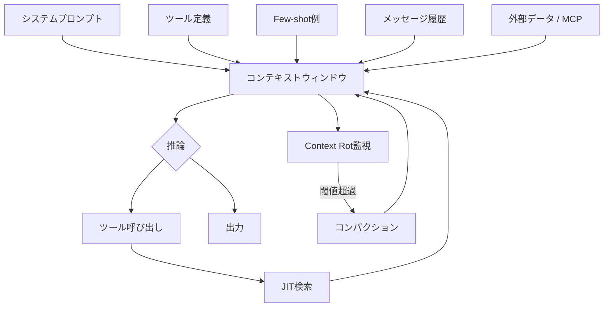
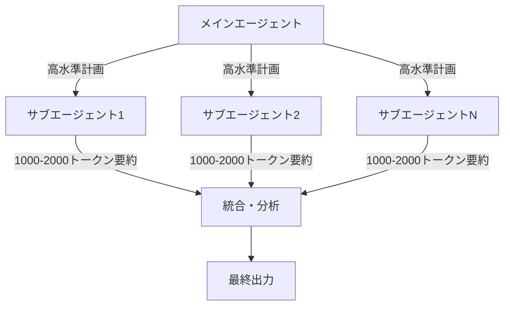

## ブログ概要（Summary）

本記事は [Effective Context Engineering for AI Agents](https://www.anthropic.com/engineering/effective-context-engineering-for-ai-agents) の解説記事です。

AnthropicのApplied AIチーム（Prithvi Rajasekaran、Ethan Dixon、Carly Ryan、Jeremy Hadfield）が2025年9月に公開したこのブログ記事は、LLMベースのAIエージェント構築において「コンテキストエンジニアリング」がなぜ重要か、そしてどのように実践するかを体系的に解説している。従来のプロンプトエンジニアリングが単一プロンプトの最適化に焦点を当てていたのに対し、コンテキストエンジニアリングはシステムプロンプト、ツール定義、MCP、外部データ、メッセージ履歴を含む推論時のトークン全体を最適化する戦略である。

この記事は [Zenn記事: 構造化プロンプト設計パターン：CO-STAR×XMLタグ×推論モデル対応の実装手法](https://zenn.dev/0h_n0/articles/78ab36484a8edd) の深掘りです。

## 情報源

- **種別**: 企業テックブログ
- **URL**: [https://www.anthropic.com/engineering/effective-context-engineering-for-ai-agents](https://www.anthropic.com/engineering/effective-context-engineering-for-ai-agents)
- **組織**: Anthropic Applied AIチーム
- **発表日**: 2025年9月29日
- **著者**: Prithvi Rajasekaran, Ethan Dixon, Carly Ryan, Jeremy Hadfield（コントリビュータ: Rafi Ayub, Hannah Moran, Cal Rueb, Connor Jennings）

## 技術的背景（Technical Background）

### コンテキストエンジニアリングとプロンプトエンジニアリングの区別

Anthropicのチームは、プロンプトエンジニアリングを「LLMの指示を記述・構成する手法」と定義し、コンテキストエンジニアリングを「LLM推論時に最適なトークン集合をキュレーション・維持する戦略」と定義している。両者の違いは対象範囲にある。プロンプトエンジニアリングが単一プロンプトの書き方に注力するのに対し、コンテキストエンジニアリングはシステム命令、ツール定義、Model Context Protocol（MCP）、外部データ、会話履歴など、推論時にモデルに渡されるすべてのトークンを管理する。

Anthropicのチームはこの概念を「プロンプトエンジニアリングの自然な発展」と位置づけている。Andrej Karpathyが提唱した用語でもあり、LLMアプリケーションが単純なQ&Aから自律的エージェントへと進化する中で、推論時にモデルが「見る」情報の全体像を設計する必要性が高まっている。

### なぜコンテキストの最適化が重要か

Anthropicのチームは指導原則として「望ましい結果の尤度を最大化する、最小限の高シグナルなトークン集合を見つけること」を掲げている。これは情報の過不足を避けるバランスが求められることを意味する。情報が多すぎればモデルの注意が分散し、少なすぎれば判断材料が不足する。エージェントが自律的にツールをループ内で使用する場面では、コンテキストの状態が推論品質に直結するため、この最適化は単発の対話以上に重要となる。

## 実装アーキテクチャ（Architecture）

### Context Rotとアテンション機構の制約

Anthropicのチームは、コンテキストウィンドウ内のトークン数が増加するにつれて、情報の正確な想起能力が低下する現象を「Context Rot」と呼んでいる。この背景にはTransformerアーキテクチャの構造的制約がある。

Self-Attentionでは、$n$ トークンに対して $n^2$ 個のペアワイズ関係が生成される。

$$
\text{Attention}(Q, K, V) = \text{softmax}\left(\frac{QK^T}{\sqrt{d_k}}\right)V
$$

ここで、
- $Q$: クエリ行列（形状: `(batch_size, seq_len, d_k)`）
- $K$: キー行列（同形状）
- $V$: バリュー行列（形状: `(batch_size, seq_len, d_v)`）
- $d_k$: キーの次元数

コンテキストが長くなると、ペアワイズ関係の捕捉能力が「薄く引き伸ばされる」とAnthropicのチームは述べている。さらに、訓練データでは短い系列が長い系列よりも一般的であるため、モデルは長距離依存関係の処理に特化したパラメータが少ない。位置エンコーディングの補間（Position Encoding Interpolation）により長い系列の処理は可能だが、トークン位置の理解精度に劣化が生じる。

Anthropicのチームは、これを「性能の崖」ではなく「性能の勾配」として捉え、人間の作業記憶容量になぞらえて「アテンション・バジェット」という概念を提示している。新しいトークンが追加されるたびにこのバジェットが消費される。

### システムプロンプトの「高度」設計

Anthropicのチームは、システムプロンプト設計における2つの失敗モードを特定している。

1. **過剰指定**: 複雑で脆いif-elseロジックをプロンプトに埋め込む。脆弱性が増し、保守コストが上昇する
2. **過少指定**: 曖昧で高水準すぎるガイダンス。具体的なシグナルが不足し、共有コンテキストを誤って前提とする

最適な「高度」は、行動を効果的に導くのに十分な具体性と、ヒューリスティクスとして機能する柔軟性のバランスにある。構造的には、XMLタグ（`<background_information>`、`<instructions>`等）やMarkdownヘッダーでセクションを区切り、期待する行動を完全に概説する最小限の情報に絞ることが推奨されている。

### ツール設計の原則

Anthropicのチームは、エージェント向けツール設計で以下を原則として挙げている。

- **自己完結性**: ツールは単体で動作し、エラーに堅牢であること
- **明確な用途**: 使用目的が一意に判定できること
- **トークン効率**: 戻り値が簡潔であること
- **最小限のツールセット**: 機能が重複するツールや曖昧な選択肢を排除する

Anthropicのチームは「人間のエンジニアがどのツールを使うべきか断定できない状況では、AIエージェントにも同じことは期待できない」と述べている。

### コンテキストアーキテクチャの全体像



### Few-shot例の設計

Anthropicのチームは、網羅的なエッジケースの列挙ではなく「多様で正規的な例のセットをキュレーションする」ことを推奨している。LLMにとって例は「千の言葉に値する写真」であり、期待される行動を効果的に描写する少数の代表的な例が、大量のルール記述よりも有効である。

## Production Deployment Guide

### AWS実装パターン（コスト最適化重視）

コンテキストエンジニアリングを適用したLLMエージェントシステムをAWS上に構築する際の推奨構成を示す。

**トラフィック量別の推奨構成**:

| 構成 | トラフィック | アーキテクチャ | 月額コスト概算 |
|------|-------------|---------------|---------------|
| Small | ~100 req/日 | Lambda + Bedrock + DynamoDB | $50-150 |
| Medium | ~1,000 req/日 | ECS Fargate + Bedrock + ElastiCache | $300-800 |
| Large | 10,000+ req/日 | EKS + Spot + Bedrock Batch | $2,000-5,000 |

**Small構成の内訳**: Lambda（コンテキスト組立・推論呼び出し、512MB、30秒タイムアウト）、Bedrock Claude Sonnet（Prompt Caching有効）、DynamoDB On-Demand（会話履歴・構造化メモ保存）、S3（ツール定義・Few-shot例のJIT取得用）。

**Large構成の内訳**: EKSクラスタ（Karpenterによる自動スケーリング）、Spot Instances優先（c6i.xlarge / m6i.xlarge）、ElastiCache Redis（コンパクション済みコンテキストキャッシュ）、Bedrock Batch API（非同期処理で50%コスト削減）、Step Functions（サブエージェントオーケストレーション）。

**コスト削減テクニック**:
- Spot Instances活用で最大90%削減
- Reserved Instances（1年コミット）で最大72%削減
- Bedrock Batch API使用で50%削減
- Prompt Caching有効化で30-90%削減（Anthropic公式値）

**コスト試算の注意事項**: 上記は2026年10月時点のAWS ap-northeast-1（東京）リージョン料金に基づく概算値である。実際のコストはトラフィックパターン、リージョン、バースト使用量により変動する。最新料金は[AWS料金計算ツール](https://calculator.aws/)で確認を推奨する。

### Terraformインフラコード

**Small構成（Serverless）**:

```hcl
# コンテキストエンジニアリング基盤 - Small構成
# Lambda + Bedrock + DynamoDB

resource "aws_iam_role" "context_agent_lambda" {
  name               = "context-agent-lambda-role"
  assume_role_policy  = data.aws_iam_policy_document.lambda_assume.json
}

# IAMポリシー: Bedrock, DynamoDB, S3への最小権限アクセス
resource "aws_iam_role_policy" "bedrock_invoke" {
  name   = "bedrock-invoke"
  role   = aws_iam_role.context_agent_lambda.id
  policy = data.aws_iam_policy_document.agent_permissions.json
  # bedrock:InvokeModel, dynamodb:GetItem/PutItem/Query, s3:GetObject
}

resource "aws_lambda_function" "context_agent" {
  function_name = "context-agent"
  runtime       = "python3.12"
  handler       = "handler.lambda_handler"
  role          = aws_iam_role.context_agent_lambda.arn
  timeout       = 30
  memory_size   = 512 # コンテキスト組立に十分なメモリ

  environment {
    variables = {
      CONTEXT_TABLE   = aws_dynamodb_table.context_store.name
      TOOL_BUCKET     = aws_s3_bucket.tool_definitions.id
      BEDROCK_MODEL   = "anthropic.claude-sonnet-4-20250514"
      MAX_CONTEXT_TOKENS = "100000"
    }
  }
}

# 会話履歴・構造化メモの永続化（On-Demandでコスト最適化）
resource "aws_dynamodb_table" "context_store" {
  name         = "context-store"
  billing_mode = "PAY_PER_REQUEST"
  hash_key     = "session_id"
  range_key    = "timestamp"

  attribute {
    name = "session_id"
    type = "S"
  }
  attribute {
    name = "timestamp"
    type = "N"
  }

  # KMS暗号化
  server_side_encryption { enabled = true }
  point_in_time_recovery { enabled = true }
}

resource "aws_s3_bucket" "tool_definitions" {
  bucket = "context-agent-tools-${data.aws_caller_identity.current.account_id}"
}

resource "aws_cloudwatch_metric_alarm" "bedrock_cost_spike" {
  alarm_name          = "bedrock-token-spike"
  comparison_operator = "GreaterThanThreshold"
  evaluation_periods  = 1
  metric_name         = "InputTokenCount"
  namespace           = "AWS/Bedrock"
  period              = 3600
  statistic           = "Sum"
  threshold           = 500000
  alarm_actions       = [aws_sns_topic.alerts.arn]
}
```

**Large構成（Container）**:

```hcl
# コンテキストエンジニアリング基盤 - Large構成
# EKS + Karpenter + Spot Instances

module "eks" {
  source          = "terraform-aws-modules/eks/aws"
  version         = "~> 20.0"
  cluster_name    = "context-agent-cluster"
  cluster_version = "1.31"
  vpc_id          = module.vpc.vpc_id
  subnet_ids      = module.vpc.private_subnets
  cluster_endpoint_public_access = false
}

# Karpenter: Spot優先で自動スケーリング
resource "kubectl_manifest" "karpenter_nodepool" {
  yaml_body = yamlencode({
    apiVersion = "karpenter.sh/v1"
    kind       = "NodePool"
    metadata   = { name = "context-agents" }
    spec = {
      template.spec.requirements = [
        { key = "karpenter.sh/capacity-type", operator = "In",
          values = ["spot", "on-demand"] },
        { key = "node.kubernetes.io/instance-type", operator = "In",
          values = ["c6i.xlarge", "m6i.xlarge"] }
      ]
      limits     = { cpu = "64", memory = "128Gi" }
      disruption = { consolidationPolicy = "WhenEmptyOrUnderutilized" }
    }
  })
}

resource "aws_budgets_budget" "monthly" {
  name         = "context-agent-monthly"
  budget_type  = "COST"
  limit_amount = "5000"
  limit_unit   = "USD"
  time_unit    = "MONTHLY"

  notification {
    comparison_operator       = "GREATER_THAN"
    threshold                 = 80
    threshold_type            = "PERCENTAGE"
    notification_type         = "ACTUAL"
    subscriber_sns_topic_arns = [aws_sns_topic.alerts.arn]
  }
}
```

### 運用・監視設定

**CloudWatch Logs Insights クエリ**:

```
# コンテキストトークン使用量の異常検知（1時間単位）
fields @timestamp, @message
| filter @message like /input_tokens/
| stats sum(input_tokens) as total_tokens, count() as req_count by bin(1h)
| filter total_tokens > 500000
| sort @timestamp desc

# レイテンシ分析（P95, P99）
fields @timestamp, duration_ms
| stats percentile(duration_ms, 95) as p95,
        percentile(duration_ms, 99) as p99,
        avg(duration_ms) as avg_ms
  by bin(5m)
```

**X-Ray トレーシング**: `aws_xray_sdk`の`patch_all()`でboto3を自動計装し、`session_id`・`compaction`フラグ・`context_tokens`をアノテーション/メタデータとして記録する。

**Cost Explorer自動レポート**: Cost Explorer APIで日次コストを取得し、Bedrock/Lambda/EKSのコストを抽出する。$100/日超過時にSNS通知を送信する。

### コスト最適化チェックリスト

**アーキテクチャ選択**:
- [ ] トラフィック ~100 req/日 → Serverless（Lambda + Bedrock）
- [ ] トラフィック ~1,000 req/日 → Hybrid（ECS Fargate + Bedrock）
- [ ] トラフィック 10,000+ req/日 → Container（EKS + Spot + Batch API）

**リソース最適化**:
- [ ] EC2/EKS: Spot Instances優先（最大90%削減）
- [ ] Reserved Instances: 1年コミット（最大72%削減）
- [ ] Savings Plans: Compute Savings Plans検討
- [ ] Lambda: メモリサイズをPower Tuningで最適化
- [ ] ECS/EKS: Karpenterでアイドル時スケールダウン
- [ ] NAT Gateway: VPCエンドポイントで通信料削減

**LLMコスト削減**:
- [ ] Bedrock Batch API: 非同期処理可能なタスクに適用（50%削減）
- [ ] Prompt Caching: システムプロンプト・ツール定義をキャッシュ（30-90%削減）
- [ ] モデル選択ロジック: タスク複雑度に応じてSonnet/Haikuを自動切替
- [ ] トークン数制限: max_tokensで出力長を制御
- [ ] コンパクション: 不要なツール結果を早期にクリア

**監視・アラート**:
- [ ] AWS Budgets: 月次予算アラート設定
- [ ] CloudWatch アラーム: Bedrockトークンスパイク検知
- [ ] Cost Anomaly Detection: ML自動異常検知有効化
- [ ] 日次コストレポート: Cost Explorer API + SNS通知

**リソース管理**:
- [ ] 未使用リソース: Trusted Advisorで定期チェック
- [ ] タグ戦略: `project`, `environment`, `cost-center`タグ必須
- [ ] ライフサイクルポリシー: S3/CloudWatch Logsの保持期間設定
- [ ] 開発環境: 夜間・週末のEKSノード自動停止
- [ ] DynamoDB: TTL設定で古いセッションデータを自動削除

## パフォーマンス最適化（Performance）

### JIT検索 vs プリロードの比較

Anthropicのチームは、コンテキスト取得戦略として「Just-In-Time（JIT）検索」を推奨している。従来の埋め込みベースの事前検索から、軽量な識別子（ファイルパス、クエリ、URLなど）を保持し、実行時にツールを使って動的にデータをロードする方式への移行である。

この手法は人間の認知に類似する。人間は情報をすべて暗記するのではなく、ファイルシステムやブックマークのような外部索引システムを用いてオンデマンドで検索する。フォルダ階層、命名規則、タイムスタンプはすべて重要なシグナルであり、情報の活用方法とタイミングの判断を助ける。

Claude Codeでの実装例として、大規模データベースの分析時に`head`や`tail`コマンドで対象を絞り込み、全データをコンテキストに読み込まない手法が挙げられている。`glob`や`grep`でファイルをJIT取得し、CLAUDE.mdファイルのみを事前にコンテキストへ投入するハイブリッドアプローチが採用されている。

**段階的開示パターン**: エージェントは探索的にコンテキストを発見する。各インタラクションが次の判断に影響するコンテキストを生み出す。ファイルサイズは複雑度を示唆し、命名規則は目的を示し、タイムスタンプは関連性の代理指標となる。

**トレードオフ**: JIT検索は事前計算データの取得より遅い。そのためAnthropicのチームは「速度のために一部のデータを事前に取得し、さらなる自律探索はエージェントの裁量に委ねる」ハイブリッド戦略が最も効果的だと述べている。

## 運用での学び（Production Lessons）

### コンパクション戦略

コンパクションは、コンテキストウィンドウの限界に近づいた会話を要約し、新しいコンテキストウィンドウで再開する手法である。Anthropicのチームはこれを「長期的な一貫性を向上させる最初のレバー」と位置づけている。

Claude Codeでの実装では、メッセージ履歴をモデルに渡して要約を生成する。モデルはアーキテクチャ上の決定、未解決のバグ、実装詳細を保持し、冗長なツール出力やメッセージを破棄する。その後、圧縮コンテキストと直近5つのアクセスファイルで処理を継続する。

Anthropicのチームはコンパクションの要点を以下のように述べている。

- **再現率の最大化から開始**: 複雑なエージェントトレースで関連情報を漏れなく捕捉するプロンプトを作成
- **精度の反復改善**: 不要な内容を段階的に除去
- **安全な軽量手法**: ツール結果のクリアリング。深いメッセージ履歴中のツール呼び出し結果は、再度参照される可能性が低いため最も安全なコンパクション手法

### 構造化ノートテイキング

エージェントが定期的にコンテキストウィンドウの外部に永続化されたメモを記録する手法である。Claude Codeではto-doリストの作成、カスタムエージェントではNOTES.mdファイルの維持が例として挙げられている。

Anthropicのチームは、Claude Playing Pokemon（Twitchストリーム）の例を紹介している。エージェントは数千ステップにわたる正確な集計を維持し、探索マップや戦闘戦略のメモを記録することで、コンテキストリセットをまたいだ長時間の自律行動が可能になった。

### サブエージェントアーキテクチャ



Anthropicのチームは、1つのエージェントがプロジェクト全体の状態を維持するのではなく、専門化されたサブエージェントがクリーンなコンテキストウィンドウで集中的にタスクを処理する設計を提案している。

- **メインエージェント**: 高水準の計画で調整を行う
- **サブエージェント**: 深い技術的作業や情報検索を実行する。数万トークン以上を使用する場合もあるが、返すのは1,000-2,000トークンの凝縮された要約のみ
- **関心の分離**: 詳細な検索コンテキストはサブエージェント内に隔離され、メインエージェントは結果の統合と分析に専念する

Anthropicのチームは、マルチエージェント研究システムの構築に関する別の記事で、単一エージェントシステムに対する大幅な改善を示したと報告している。

### 手法の選択指針

Anthropicのチームは、タスクの性質に応じた手法選択を提案している。

- **コンパクション**: 広範なやり取りを必要とするタスクで会話の流れを維持
- **ノートテイキング**: 明確なマイルストーンを持つ反復開発に適合
- **マルチエージェント**: 並列探索が効果を発揮する複雑な調査・分析

## 学術研究との関連（Academic Connection）

Anthropicのブログ記事で言及されている研究基盤には、Transformerの原論文（Vaswani et al., 2017, arXiv:1706.03762）がある。Self-Attention機構の $n^2$ 計算量がContext Rotの直接的原因である。位置エンコーディング補間（Chen et al., 2023, arXiv:2306.15595）はコンテキスト長拡張の手法として参照されている。

Context Rotに関する実証研究（Chroma Research）は、Needle-in-a-Haystack型ベンチマークでこの現象を定量的に示した。人間の作業記憶に関する認知科学研究（Cowan, 2010）もアテンション・バジェットの概念の背景として引用されている。

コンテキストエンジニアリングの学術的体系化として、Agarwal et al.（2025, arXiv:2604.04258）の"Context Engineering for AI Agents"がある。この論文はAnthropicの実践知見と並行して、エージェント向けコンテキスト最適化の理論的フレームワークを構築している。また、OPRO（Yang et al., 2023）などのプロンプト最適化研究は、プロンプトエンジニアリングからコンテキストエンジニアリングへの発展の学術的基盤を成している。

## まとめと実践への示唆

Anthropicのチームは、コンテキストエンジニアリングを「LLMでの構築方法における根本的な変化」と位置づけている。モデルの能力が向上しても、限られたアテンション・バジェットにどの情報を入れるかを慎重にキュレーションする課題は残る。

実践上の示唆として、以下の3点が重要である。

1. **最小限主義**: コンテキストに含めるトークンは「最小限の高シグナルなトークン」に絞る。情報が多いほど良いという直感に反するが、アテンション機構の制約上、不要なトークンはノイズとなる
2. **動的管理**: 静的なプロンプト設計ではなく、JIT検索・コンパクション・構造化ノートテイキングによるコンテキストの動的な管理が長期タスクの成功を左右する
3. **分離と委譲**: サブエージェントアーキテクチャにより、各エージェントがクリーンなコンテキストで専門タスクを処理し、要約のみを返す設計がスケーラブルなエージェントシステムの鍵となる

Anthropicのチームは今後の展望として「モデルが賢くなるにつれ、より処方的でないエンジニアリングが可能になり、エージェントはより自律的に動作する方向に向かう」と述べつつ、「コンテキストを貴重で有限なリソースとして扱うことは、信頼性の高い効果的なエージェント構築の中心であり続ける」と結論づけている。

## 参考文献

- **Blog URL**: [Effective Context Engineering for AI Agents](https://www.anthropic.com/engineering/effective-context-engineering-for-ai-agents)
- **Transformer原論文**: [Attention Is All You Need (arXiv:1706.03762)](https://arxiv.org/abs/1706.03762)
- **位置エンコーディング補間**: [arXiv:2306.15595](https://arxiv.org/abs/2306.15595)
- **Context Rot研究**: [Chroma Research](https://research.trychroma.com/context-rot)
- **コンテキストエンジニアリング論文**: [arXiv:2604.04258](https://arxiv.org/abs/2604.04258)
- **MCP仕様**: [Model Context Protocol](https://modelcontextprotocol.io/docs/getting-started/intro)
- **Related Zenn article**: [構造化プロンプト設計パターン：CO-STAR×XMLタグ×推論モデル対応の実装手法](https://zenn.dev/0h_n0/articles/78ab36484a8edd)
