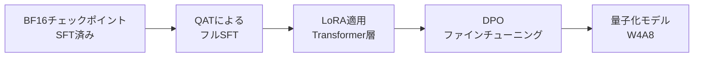
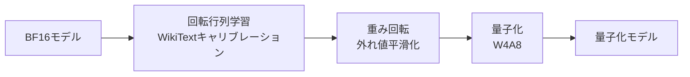
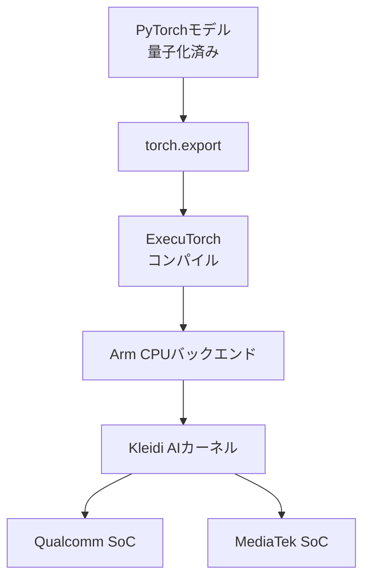

本記事は [Meta AI公式ブログ](https://ai.meta.com/blog/meta-llama-quantized-lightweight-models/) の解説記事です。

この記事は [Zenn記事: Ollama v0.35×エアギャップ環境で構築するデータ主権対応オンプレLLM推論基盤](https://zenn.dev/0h_n0/articles/88a1c8d7becfce) の深掘りです。

## ブログ概要（Summary）

Meta AIは2024年10月にLlama 3.2の1Bおよび3Bモデルの量子化版を公開した。ブログによると、2つの量子化手法 -- QAT（Quantization-Aware Training）with LoRAとSpinQuant（ポストトレーニング量子化）-- を用いて、モデルサイズを平均56%削減し、メモリ使用量を平均41%削減しつつ、デコードレイテンシを2.5倍、プリフィルレイテンシを4.2倍高速化したと報告している。量子化モデルはPyTorch ExecuTorchフレームワークを通じてArm CPUバックエンド上で動作し、QualcommおよびMediaTek SoC上のモバイルデバイスに展開可能である。

## 情報源

- **種別**: 企業テックブログ
- **URL**: [https://ai.meta.com/blog/meta-llama-quantized-lightweight-models/](https://ai.meta.com/blog/meta-llama-quantized-lightweight-models/)
- **組織**: Meta AI
- **発表日**: 2024年10月24日

## 技術的背景（Technical Background）

大規模言語モデル（LLM）のデプロイにおいて、推論コストとレイテンシは実用上の主要な課題である。クラウドGPU上での推論は高性能だが、データプライバシー、レイテンシ、通信コストの観点からエッジデバイスでのオンデバイス推論の需要が高まっている。しかし、BF16/FP16精度のモデルはモバイルデバイスのメモリ・計算リソースに収まらない場合が多い。

量子化はこの課題に対する主要なアプローチであり、モデルの重みやアクティベーションをより低いビット幅で表現することでモデルサイズと計算量を削減する。しかし、量子化には精度劣化というトレードオフが伴う。特に4ビット以下の低ビット量子化では、重みの分布に含まれる外れ値（outlier）が量子化誤差を増大させ、モデル性能を大きく損なうことがある。

Metaは、この精度劣化を最小化するために2つの異なるアプローチ -- 訓練時に量子化を考慮するQATと、訓練後に回転行列で外れ値を平滑化するSpinQuant -- を提案し、それぞれの特性に応じた使い分けを提示している。関連Zenn記事で扱うOllamaのQ4_K_MやQ8_0量子化フォーマットも同様の課題に取り組んでおり、本ブログの知見はオンプレミスLLM推論基盤の量子化戦略選択に直接的な示唆を与える。

## 実装アーキテクチャ（Architecture）

### 量子化スキーム: W4A8構成

Metaが採用した量子化スキームは、モデルの各コンポーネントに対して異なるビット幅を適用する混合精度構成である。

| コンポーネント | 重み量子化 | アクティベーション量子化 |
|---|---|---|
| Transformerブロックの線形層 | 4ビットグループワイズ（グループサイズ32） | 8ビットper-tokenダイナミック |
| 分類層（Classification layer） | 8ビットper-channel | 8ビットper-tokenダイナミック |
| Embedding層 | 8ビットper-channel | -- |

グループワイズ量子化では、重みテンソルを$g$個の要素からなるグループに分割し、各グループ内で独立にスケールファクタとゼロポイントを計算する。4ビットグループワイズ量子化の数式は以下の通りである。

$$
W_q = \text{clamp}\left(\left\lfloor \frac{W - z}{s} \right\rceil, 0, 2^b - 1\right)
$$

ここで、

- $W$: 元の重み（BF16）
- $W_q$: 量子化後の重み（4ビット整数）
- $b$: ビット幅（$b = 4$）
- $s$: グループ内のスケールファクタ $s = \frac{\max(W_g) - \min(W_g)}{2^b - 1}$
- $z$: ゼロポイント $z = \min(W_g)$
- $W_g$: グループサイズ$g = 32$の重みサブセット
- $\lfloor \cdot \rceil$: 最近接整数への丸め

逆量子化（推論時）は以下で行う。

$$
\hat{W} = s \cdot W_q + z
$$

グループサイズ32は精度とメモリオーバーヘッドのバランスとして選択されている。グループサイズが小さいほど量子化精度は向上するが、スケールファクタとゼロポイントの格納に必要なメモリが増加する。

### QAT with LoRA パイプライン

QAT（Quantization-Aware Training）は、訓練中に量子化の効果をシミュレーションすることで、量子化後の精度劣化を最小化する手法である。Metaが報告しているQATパイプラインは以下の4段階で構成される。



**ステージ1: BF16チェックポイント（SFT済み）**

Llama 3.2のSFT（Supervised Fine-Tuning）済みBF16チェックポイントを開始点とする。

**ステージ2: QATによるフルSFT**

量子化ノイズをシミュレーションしながらフルパラメータのSFTを実行する。Forward passで量子化・逆量子化を挿入し、Backward passではSTE（Straight-Through Estimator）で勾配を近似する。

$$
\frac{\partial \mathcal{L}}{\partial W} \approx \frac{\partial \mathcal{L}}{\partial \hat{W}}
$$

ここで、$\mathcal{L}$は損失関数、$\hat{W}$は量子化シミュレーション後の重みである。STEは量子化関数の勾配がゼロになる問題を回避するために、量子化操作を恒等関数として扱い勾配をそのまま伝播させる近似手法である。MetaはtorchaoのAPIを用いてQATを実装していると報告している。

**ステージ3: LoRA適用**

QAT後のバックボーンを凍結し、各Transformer層にLoRA（Low-Rank Adaptation）アダプタを適用する。LoRAの重みはBF16精度で保持される。

$$
h = (W_q + \Delta W)x = W_q x + BAx
$$

ここで、$W_q$は量子化された重み、$B \in \mathbb{R}^{d \times r}$と$A \in \mathbb{R}^{r \times d}$はLoRAの低ランク行列、$r$はランク（$r \ll d$）である。

**ステージ4: DPO（Direct Preference Optimization）**

LoRA適用後、DPOでヒューマンプリファレンスに合わせたファインチューニングを実施する。DPOは報酬モデルを明示的に学習せず、好ましい応答と好ましくない応答のペアから直接方策を最適化する。

### SpinQuant パイプライン

SpinQuantは、ポストトレーニング量子化（PTQ）手法であり、訓練データへのアクセスなしに量子化を実行できる点が特徴である。Metaはこれを「ポータビリティを優先する」手法と位置付けている。



SpinQuantの核心は、量子化前に回転行列$R$を用いて重み分布を変換し、外れ値の影響を軽減する点にある。

$$
W' = R \cdot W \cdot R^T
$$

ここで、

- $W$: 元の重み行列
- $R$: 直交回転行列（$R^T R = I$）
- $W'$: 回転後の重み行列

回転行列$R$は直交行列であるため、回転操作は重みの情報を保存しつつ分布形状を変換する。外れ値が特定のチャネルに集中している場合、回転によって外れ値のエネルギーが複数のチャネルに分散され、量子化誤差が低減される。

MetaはWikiTextデータセットをキャリブレーションデータとして使用し、回転行列を学習している。キャリブレーションデータの選択は量子化精度に影響するが、SpinQuantは比較的少量のデータで効果的に動作するとされている。

### ExecuTorchによるデプロイメント

量子化モデルのモバイルデバイスへの展開には、PyTorchのExecuTorchフレームワークが使用される。ExecuTorchはPyTorchモデルをモバイル・エッジデバイス向けに最適化するランタイムである。



Arm CPUバックエンド上では、Kleidi AIカーネルが4ビット量子化された重みと8ビットアクティベーションの効率的な行列積を実行する。Kleidi AIはArmが提供するAI推論向けの最適化カーネルライブラリであり、Arm Neon/SVE命令セットを活用してモバイルCPU上での推論を高速化する。

## Production Deployment Guide

### AWS実装パターン（コスト最適化重視）

量子化LLMモデルのデプロイでは、モデルサイズの削減により従来のGPUインスタンスが不要になるケースがある。以下にトラフィック量別の推奨構成を示す。

| 構成 | トラフィック | AWSサービス | 月額概算 |
|---|---|---|---|
| Small | ~100 req/日 | Lambda + S3 + DynamoDB | $50-120 |
| Medium | ~1000 req/日 | ECS Fargate (ARM) + ALB | $300-700 |
| Large | 10000+ req/日 | EKS + Graviton Spot + Karpenter | $1,500-4,000 |

**注意**: コスト試算は2026年10月時点のAWS ap-northeast-1（東京）リージョン料金に基づく概算値である。実際のコストはトラフィックパターン、リージョン、バースト使用量により変動する。最新料金はAWS料金計算ツールで確認を推奨する。

**Small構成（~100 req/日）**: Lambda上でExecuTorchランタイムを実行する。量子化により1Bモデルが約1.3GBに収まるため、Lambda の10GB一時ストレージに格納可能である。Graviton（ARM）Lambda関数を使用することでKleidi AIカーネルの恩恵を受けられる。月額内訳: Lambda $15-30、S3 $5-10、DynamoDB $10-20、CloudWatch $5-10。

**Large構成（10000+ req/日）**: EKS上でGraviton3（ARM）インスタンスをKarpenterで自動スケーリングする。Spot Instancesを優先利用することで最大90%のコスト削減が可能。月額内訳: EKS コントロールプレーン $73、Graviton Spot Instances $400-1,500、ALB $50-100、CloudWatch/X-Ray $50-100。

**コスト削減テクニック**:
- Spot Instances活用で最大90%削減（Graviton3 Spot: ~$0.03/時間）
- Reserved Instances 1年コミットで最大40%削減
- Savings Plans検討で最大72%削減
- ARM（Graviton）インスタンス使用で同等x86比20%削減

### Terraformインフラコード

**Small構成（Serverless: Lambda + S3）**

```hcl
# Small構成: 量子化LLM推論 (Lambda ARM + S3)
# 月額 $50-120 想定

terraform {
  required_version = ">= 1.9"
  required_providers {
    aws = {
      source  = "hashicorp/aws"
      version = "~> 5.70"
    }
  }
}

provider "aws" {
  region = "ap-northeast-1"
}

# S3: 量子化モデル格納
resource "aws_s3_bucket" "model_store" {
  bucket = "quantized-llm-models-${data.aws_caller_identity.current.account_id}"
}

resource "aws_s3_bucket_server_side_encryption_configuration" "model_store" {
  bucket = aws_s3_bucket.model_store.id
  rule {
    apply_server_side_encryption_by_default {
      sse_algorithm = "aws:kms"
    }
  }
}

data "aws_caller_identity" "current" {}

# IAM: Lambda実行ロール（最小権限）
resource "aws_iam_role" "lambda_exec" {
  name = "quantized-llm-lambda-role"
  assume_role_policy = jsonencode({
    Version = "2012-10-17"
    Statement = [{
      Action = "sts:AssumeRole"
      Effect = "Allow"
      Principal = { Service = "lambda.amazonaws.com" }
    }]
  })
}

resource "aws_iam_role_policy" "lambda_s3_read" {
  name = "s3-model-read"
  role = aws_iam_role.lambda_exec.id
  policy = jsonencode({
    Version = "2012-10-17"
    Statement = [{
      Effect   = "Allow"
      Action   = ["s3:GetObject"]
      Resource = "${aws_s3_bucket.model_store.arn}/models/*"
    }]
  })
}

# Lambda: ARM (Graviton) で量子化モデル推論
resource "aws_lambda_function" "inference" {
  function_name = "quantized-llm-inference"
  role          = aws_iam_role.lambda_exec.arn
  handler       = "handler.lambda_handler"
  runtime       = "python3.12"
  architectures = ["arm64"]  # Graviton: Kleidi AIカーネル互換
  memory_size   = 3008       # 量子化1Bモデル用
  timeout       = 300
  ephemeral_storage { size = 5120 }  # 5GB: モデルキャッシュ

  environment {
    variables = {
      MODEL_BUCKET = aws_s3_bucket.model_store.id
      MODEL_KEY    = "models/llama-3.2-1b-quantized.pte"
    }
  }
}

# CloudWatch: コスト監視アラーム
resource "aws_cloudwatch_metric_alarm" "lambda_cost" {
  alarm_name          = "quantized-llm-lambda-cost-spike"
  comparison_operator = "GreaterThanThreshold"
  evaluation_periods  = 1
  metric_name         = "Invocations"
  namespace           = "AWS/Lambda"
  period              = 3600
  statistic           = "Sum"
  threshold           = 500  # 1時間500回超で警告
  alarm_actions       = []   # SNSトピックARNを設定
  dimensions = {
    FunctionName = aws_lambda_function.inference.function_name
  }
}
```

**Large構成（Container: EKS + Graviton Spot）**

```hcl
# Large構成: EKS + Karpenter + Graviton Spot
# 月額 $1,500-4,000 想定

module "eks" {
  source  = "terraform-aws-modules/eks/aws"
  version = "~> 20.24"

  cluster_name    = "quantized-llm-cluster"
  cluster_version = "1.31"

  vpc_id     = module.vpc.vpc_id
  subnet_ids = module.vpc.private_subnets

  cluster_endpoint_public_access = false  # プライベートアクセスのみ

  eks_managed_node_groups = {
    system = {
      instance_types = ["m7g.medium"]  # Graviton3 ARM
      capacity_type  = "ON_DEMAND"
      min_size       = 2
      max_size       = 3
      desired_size   = 2
    }
  }
}

# Karpenter: Spot優先の自動スケーリング
resource "kubectl_manifest" "karpenter_nodepool" {
  yaml_body = yamlencode({
    apiVersion = "karpenter.sh/v1"
    kind       = "NodePool"
    metadata   = { name = "quantized-llm-pool" }
    spec = {
      template = {
        spec = {
          requirements = [
            { key = "kubernetes.io/arch", operator = "In", values = ["arm64"] },
            { key = "karpenter.sh/capacity-type", operator = "In",
              values = ["spot", "on-demand"] },
            { key = "node.kubernetes.io/instance-type", operator = "In",
              values = ["m7g.xlarge", "m7g.2xlarge", "c7g.xlarge", "c7g.2xlarge"] }
          ]
          nodeClassRef = {
            group = "karpenter.k8s.aws"
            kind  = "EC2NodeClass"
            name  = "default"
          }
        }
      }
      limits   = { cpu = "64", memory = "256Gi" }
      disruption = {
        consolidationPolicy = "WhenEmptyOrUnderutilized"
        consolidateAfter    = "30s"
      }
    }
  })
}

# AWS Budgets: 月額予算アラート
resource "aws_budgets_budget" "monthly" {
  name         = "quantized-llm-monthly-budget"
  budget_type  = "COST"
  limit_amount = "4000"
  limit_unit   = "USD"
  time_unit    = "MONTHLY"

  notification {
    comparison_operator       = "GREATER_THAN"
    threshold                 = 80
    threshold_type            = "PERCENTAGE"
    notification_type         = "ACTUAL"
    subscriber_email_addresses = ["ops-team@example.com"]
  }
}
```

### 運用・監視設定

**CloudWatch Logs Insights: 推論レイテンシ分析**

```
fields @timestamp, @message
| filter @message like /inference_latency/
| stats avg(latency_ms) as avg_latency,
        pct(latency_ms, 95) as p95_latency,
        pct(latency_ms, 99) as p99_latency,
        count(*) as request_count
  by bin(1h)
| sort @timestamp desc
```

**CloudWatch アラーム設定（Python）**

```python
import boto3

cloudwatch = boto3.client("cloudwatch", region_name="ap-northeast-1")

def create_latency_alarm(function_name: str, threshold_ms: float = 5000) -> None:
    """Lambda推論レイテンシ異常検知アラームを作成する。

    Args:
        function_name: 監視対象のLambda関数名
        threshold_ms: アラーム閾値（ミリ秒）
    """
    cloudwatch.put_metric_alarm(
        AlarmName=f"{function_name}-latency-p95",
        MetricName="Duration",
        Namespace="AWS/Lambda",
        Statistic="p95",
        Period=300,
        EvaluationPeriods=3,
        Threshold=threshold_ms,
        ComparisonOperator="GreaterThanThreshold",
        Dimensions=[{"Name": "FunctionName", "Value": function_name}],
        AlarmActions=[],  # SNSトピックARNを設定
    )
```

**X-Ray トレーシング設定（Python）**

```python
from aws_xray_sdk.core import xray_recorder, patch_all

patch_all()  # boto3等の自動計装

@xray_recorder.capture("llm_inference")
def run_inference(prompt: str, model_path: str) -> str:
    """量子化モデルで推論を実行し、X-Rayでトレースする。

    Args:
        prompt: 入力プロンプト
        model_path: 量子化モデルのパス

    Returns:
        生成されたテキスト
    """
    segment = xray_recorder.current_subsegment()
    segment.put_annotation("model_type", "llama-3.2-1b-quantized")
    segment.put_metadata("prompt_length", len(prompt))
    # 推論処理
    result = execute_model(prompt, model_path)
    segment.put_metadata("output_length", len(result))
    return result
```

**Cost Explorer日次レポート（Python）**

```python
import boto3
from datetime import datetime, timedelta

def get_daily_cost_report() -> dict:
    """日次コストレポートを取得し、閾値超過時にSNS通知する。

    Returns:
        サービス別コスト辞書
    """
    ce = boto3.client("ce", region_name="us-east-1")
    today = datetime.utcnow().strftime("%Y-%m-%d")
    yesterday = (datetime.utcnow() - timedelta(days=1)).strftime("%Y-%m-%d")

    response = ce.get_cost_and_usage(
        TimePeriod={"Start": yesterday, "End": today},
        Granularity="DAILY",
        Metrics=["UnblendedCost"],
        GroupBy=[{"Type": "DIMENSION", "Key": "SERVICE"}],
    )

    costs = {}
    for group in response["ResultsByTime"][0]["Groups"]:
        service = group["Keys"][0]
        amount = float(group["Metrics"]["UnblendedCost"]["Amount"])
        if amount > 0:
            costs[service] = amount

    total = sum(costs.values())
    if total > 100:  # $100/日超過でアラート
        sns = boto3.client("sns", region_name="ap-northeast-1")
        sns.publish(
            TopicArn="arn:aws:sns:ap-northeast-1:ACCOUNT:cost-alert",
            Message=f"Daily cost alert: ${total:.2f}",
        )
    return costs
```

### コスト最適化チェックリスト

**アーキテクチャ選択**
- [ ] トラフィック量に基づく構成選択（Small: Serverless / Medium: Hybrid / Large: Container）
- [ ] ARM（Graviton）インスタンスでKleidi AIカーネルの恩恵を最大化

**リソース最適化**
- [ ] EC2/EKS: Graviton Spot Instances優先（最大90%削減）
- [ ] Reserved Instances: 安定ワークロードに1年コミット（最大40%削減）
- [ ] Savings Plans: Compute Savings Plans検討（最大72%削減）
- [ ] Lambda: メモリサイズ最適化（量子化1Bモデルは3GB、3Bモデルは6GB目安）
- [ ] ECS/EKS: Karpenterでアイドル時スケールダウン（consolidateAfter: 30s）

**LLMコスト削減**
- [ ] 量子化モデル使用でGPU不要化（Graviton CPUのみで推論可能）
- [ ] モデル選択ロジック: 軽量タスクは1B、複雑なタスクは3Bに振り分け
- [ ] トークン数制限: 8Kコンテキスト上限を活用した入力トランケーション
- [ ] バッチ処理: 非リアルタイム処理はSQS+Lambdaでバッチ化

**監視・アラート**
- [ ] AWS Budgets: 月額予算アラート（80%/100%閾値）
- [ ] CloudWatch アラーム: 推論レイテンシP95監視
- [ ] Cost Anomaly Detection: ML検出による異常コスト通知
- [ ] 日次コストレポート: Cost Explorer APIで自動取得

**リソース管理**
- [ ] 未使用S3モデルバージョン削除（ライフサイクルポリシー）
- [ ] タグ戦略: Environment/Service/Modelタグで按分
- [ ] ECRイメージライフサイクルポリシー（30日以上の未使用イメージ削除）
- [ ] 開発環境: 夜間・休日のEKSノード停止（Karpenter TTL設定）
- [ ] CloudWatch Logs: 保持期間設定（本番30日、開発7日）

## パフォーマンス最適化（Performance）

### ベンチマーク結果

Metaは量子化モデルのパフォーマンスをAndroid OnePlus 12上で計測している。以下はブログで報告されている主要な指標である。

| 指標 | 改善率 | 備考 |
|---|---|---|
| デコードレイテンシ | 2.5倍高速化（平均） | Token生成速度 |
| プリフィルレイテンシ | 4.2倍高速化（平均） | プロンプト処理速度 |
| モデルサイズ | 56%削減（平均） | ディスク/メモリフットプリント |
| メモリ使用量 | 41%削減（平均） | ランタイムメモリ |
| 推論速度 | 2-4倍高速化 | 総合 |

Samsung Galaxy S24+（1B/3B）およびSamsung Galaxy S22（1Bのみ）でも動作確認済みである。iOS環境では同等の精度が確認されているが、パフォーマンス評価は未実施とMetaは報告している。

### QAT vs SpinQuant の精度比較

Metaはブログにおいて、QATがSpinQuantよりも精度面で優れる傾向があると報告している。これは、QATが訓練時に量子化ノイズへの適応を学習するためである。一方、SpinQuantは訓練データへのアクセスが不要であるため、ポータビリティに優れる。

| 特性 | QAT with LoRA | SpinQuant |
|---|---|---|
| 精度 | 高い（量子化ノイズに適応） | やや低い（PTQの限界） |
| 訓練データ必要性 | 必要（SFT + DPOデータ） | 不要（WikiTextキャリブレーションのみ） |
| 計算コスト | 高い（フルSFT + LoRA + DPO） | 低い（回転行列学習のみ） |
| ポータビリティ | 低い（訓練パイプライン依存） | 高い（任意のモデルに適用可能） |
| 適用シーン | 精度重視のプロダクション | 迅速なプロトタイピング |

この精度とポータビリティのトレードオフは、OllamaにおけるQ4_K_M（Mixed precision, 精度重視）とQ4_0（一律4ビット, 速度重視）の選択に類似している。

### コンテキストウィンドウの制約

量子化モデルは8Kトークンのコンテキストウィンドウに制限されている。Metaは「short-context applications up to 8K」と明記しており、長文処理やRAGのような大量コンテキストを必要とするユースケースには非量子化モデルの使用が推奨される。

## 運用での学び（Production Lessons）

### モバイルデプロイメントの課題

Metaのブログから読み取れるモバイルデプロイメントの主要な課題は以下の通りである。

**SoC間の互換性**: QualcommおよびMediaTek SoC上のArm CPUをサポートしているが、SoCごとのパフォーマンス特性は異なる。ExecuTorchのArm CPUバックエンドとKleidi AIカーネルがこの差異を吸収する役割を担っているが、デバイス固有の最適化が必要な場合がある。

**コンテキストウィンドウの制限**: 8Kトークンの制約はモバイルユースケースでは多くの場合十分だが、ドキュメント要約や長文対話には制限となる。アプリケーション設計時にこの制約を考慮したプロンプト設計が必要である。

**精度と速度のトレードオフ選択**: QATとSpinQuantのどちらを選択するかは、デプロイメントの要件に依存する。Metaは両方の手法を提供することで、ユーザーが要件に応じて選択できるようにしている。精度が重要なプロダクション環境ではQAT、迅速な実験やプロトタイプにはSpinQuantが適している。

**iOS対応の課題**: Metaはブログにおいて、iOS環境では「comparable accuracy」が確認されているがパフォーマンス評価は未実施であると報告している。これはiOSのArm実装（Apple Silicon）とAndroidデバイスのArm SoC（Qualcomm/MediaTek）でのカーネル最適化の差異を示唆している。

## 学術研究との関連（Academic Connection）

Metaの量子化手法は、以下の学術研究の流れの上に構築されている。

**GPTQ**（Frantar et al., 2023）: 重みのみの量子化手法であり、ヘッセ行列の近似を用いて各重みの量子化順序を決定する。Metaの4ビットグループワイズ量子化はGPTQの成果を踏まえつつ、アクティベーション量子化を組み合わせている。

**AWQ**（Lin et al., 2024）: Activation-Aware Weight Quantizationは、アクティベーションの分布に基づいて重みの重要度を評価し、重要な重みには高精度を割り当てる手法である。Metaのグループワイズ量子化もチャネルごとの重要度の違いをグループ分割で対処している。

**QuaRot**（Ashkboos et al., 2024）: 回転行列を用いた量子化手法であり、SpinQuantはこの研究を発展させたものである。QuaRotがランダム直交行列を使用するのに対し、SpinQuantはキャリブレーションデータから最適な回転行列を学習する点が改善点である。

**SmoothQuant**（Xiao et al., 2023）: アクティベーションの外れ値を重みに転移させることで、重みとアクティベーション両方の量子化を容易にする手法である。SpinQuantの外れ値平滑化は、SmoothQuantのアプローチと概念的に類似しているが、回転行列による変換でより汎用的な平滑化を実現している。

## まとめと実践への示唆

Metaが公開したLlama 3.2量子化モデルは、QATとSpinQuantという2つの手法を通じて、モバイルデバイスでのLLM推論を実用的な水準に引き上げた。モデルサイズ56%削減、メモリ使用量41%削減、推論速度2-4倍高速化という成果は、エッジデバイスでのLLMデプロイの障壁を低減する。

関連Zenn記事で扱うOllamaの量子化フォーマット選択に対して、本ブログの知見は直接的に応用可能である。OllamaのQ4_K_MはMetaのQATアプローチに対応し（グループワイズ混合精度で精度を維持）、Q4_0はSpinQuantのようなシンプルな一律量子化に近い。VRAM制約のあるオンプレミス環境では、Metaが示したW4A8構成（4ビット重み + 8ビットアクティベーション）のような混合精度戦略が精度とメモリ効率のバランスとして有効である。

8Kコンテキストウィンドウの制約は、エアギャップ環境でのRAGパイプライン設計において考慮すべき点であり、チャンク分割戦略やプロンプト圧縮との組み合わせが必要となる。

## 参考文献

- **Blog URL**: [https://ai.meta.com/blog/meta-llama-quantized-lightweight-models/](https://ai.meta.com/blog/meta-llama-quantized-lightweight-models/)
- **ExecuTorch**: [https://github.com/pytorch/executorch](https://github.com/pytorch/executorch)
- **torchao（QAT実装）**: [https://github.com/pytorch/ao](https://github.com/pytorch/ao)
- **SpinQuant論文**: Liu et al., "SpinQuant: LLM Quantization with Learned Rotations," arXiv:2405.16406, 2024
- **GPTQ論文**: Frantar et al., "GPTQ: Accurate Post-Training Quantization for Generative Pre-trained Transformers," arXiv:2210.17323, 2023
- **AWQ論文**: Lin et al., "AWQ: Activation-aware Weight Quantization for LLM Compression and Acceleration," arXiv:2306.00978, 2024
- **QuaRot論文**: Ashkboos et al., "QuaRot: Outlier-Free 4-Bit Inference in Rotated LLMs," arXiv:2404.00456, 2024
- **SmoothQuant論文**: Xiao et al., "SmoothQuant: Accurate and Efficient Post-Training Quantization for Large Language Models," arXiv:2211.10438, 2023
- **Related Zenn article**: [https://zenn.dev/0h_n0/articles/88a1c8d7becfce](https://zenn.dev/0h_n0/articles/88a1c8d7becfce)
