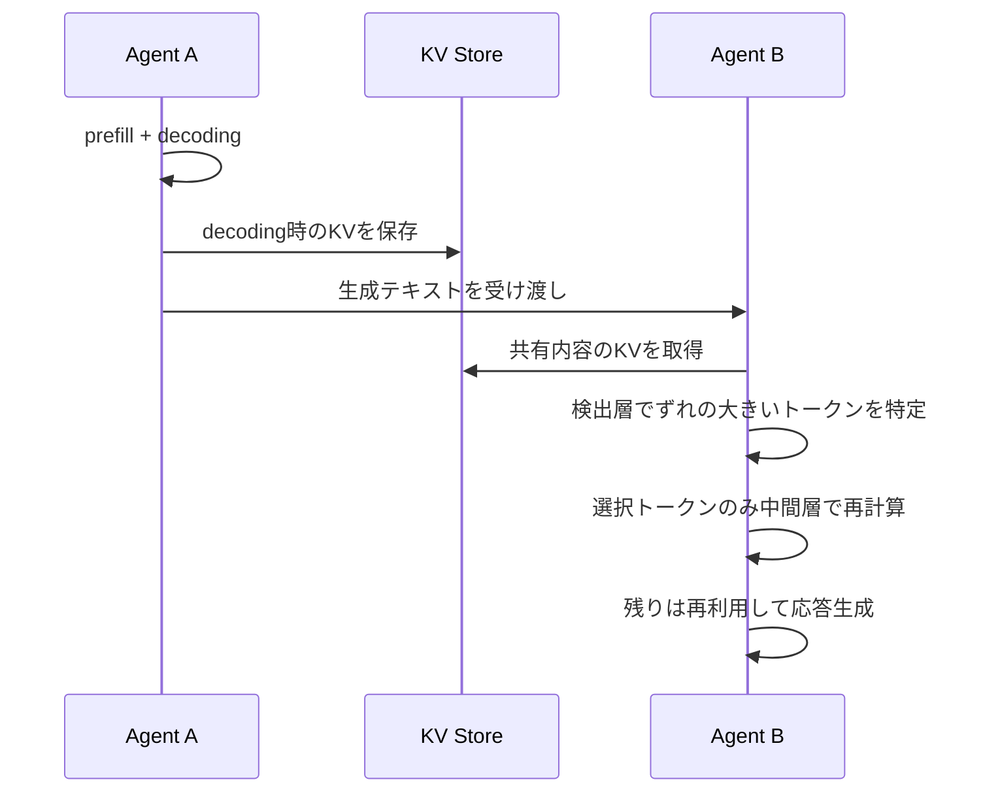
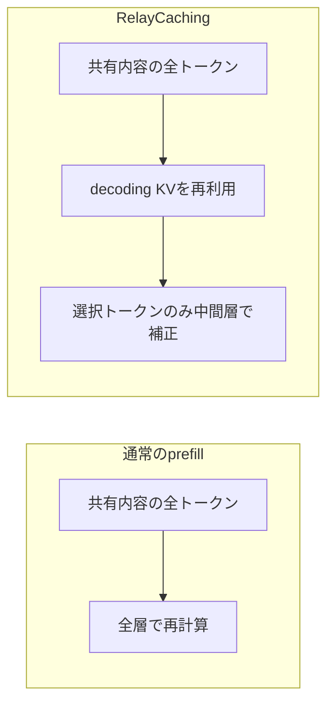

本記事は [RelayCaching: Accelerating LLM Collaboration via Decoding KV Cache Reuse (arXiv:2603.13289)](https://arxiv.org/abs/2603.13289) の解説記事です。本論文はICML 2026に採択されています。

本記事は、Zenn記事「[マルチターンAgent会話のプロンプトキャッシュ設計パターンとヒット率改善](https://zenn.dev/0h_n0/articles/d0cba2aa6f275e)」で扱ったプロンプトキャッシュ設計の、一段下のレイヤ(推論エンジン内部のKVキャッシュ)を掘り下げる位置づけです。

## 論文概要(Abstract)

マルチエージェントLLMシステムでは、前段エージェントが生成した内容を後段エージェントがプロンプトの一部として受け取り、同じ内容に対するprefill計算を繰り返します。著者らは、前段エージェントのdecodingフェーズで得られたKVキャッシュを、後段のprefillフェーズで直接再利用する、学習不要の推論手法 RelayCaching を提案しています。同一内容のKVキャッシュはフェーズをまたいで高い一貫性を持ち、先行文脈(prefix)に起因するずれは疎かつ局所的であるという観察に基づき、必要な箇所だけを選択的に再計算します。著者らは、80%超のKVキャッシュ再利用率、最大4.7倍のTTFT削減、精度低下はごくわずかと報告しています。

## 情報源

- **arXiv ID**: 2603.13289
- **URL**: https://arxiv.org/abs/2603.13289
- **著者**: Yingsheng Geng, Yuchong Gao, Weihong Wu, Guyue Liu, Jiang Liu
- **発表**: ICML 2026
- **評価ドメイン**: 数学推論、一般知識、コード生成

## カンファレンス情報

ICML(International Conference on Machine Learning)は機械学習分野の主要国際会議の一つで、理論から応用、近年はLLMの推論効率化やシステム寄りの研究も数多く採択されています。本論文は、アルゴリズムとシステム実装の境界にある推論高速化の研究として採択されています。

## 背景と動機

複数のLLMエージェントが協調するシステム(例: プランナー、コーダー、レビュアーのパイプライン)では、エージェントAの出力がエージェントBの入力に連結されます。エージェントBはこの出力を「入力トークン」として扱うため、prefill段階で全トークンのKey/Valueを再計算します。しかし、このテキストはAがdecodingで1トークンずつ生成した際に、すでにAのKVキャッシュとして計算済みです。つまり同一内容に対する計算が二重に発生しています。

通常のprefix cachingは「先頭から完全一致する部分」にしか効きません。マルチエージェントでは、後段のプロンプトは「システムプロンプト + 共有内容 + エージェント固有の指示」のように構成され、共有内容の前にエージェント固有の文脈が入ります。先行文脈が異なると、Transformerの因果的な構造上、後続トークンのKV値も変わるため、そのままの流用はできません。この問題が、本論文の出発点です。

ワークフローが深くなるほど共有内容は長くなり、TTFT(Time To First Token)のうちprefillが占める割合が大きくなります。著者らはここを狙っています。

## 主要な貢献

- **一貫性の観察**: 同一内容のKVキャッシュは、decoding時とfull prefill時で高く一致し、prefix差に起因するずれは疎かつ局所的であることを示した。
- **選択的再計算**: ずれが大きいトークンと、後続への影響が大きいトークンだけを再計算し、残りはdecodingキャッシュを再利用する仕組みを提案した。
- **学習不要**: モデルの追加学習や改変を必要とせず、オフラインのキャリブレーションで層範囲を決める推論時手法である。
- **広範な評価**: 数学推論(GSM8K)、一般知識(MMLU)、コード生成(HumanEval)などで、精度と効率の両面を評価した。

## 技術的詳細

### 記法

エージェントAが生成した共有トークン列を $x_{1:n}$ とします。層 $\ell$ におけるトークン $i$ のKey/Valueを $K^{\ell}_i, V^{\ell}_i$ と書きます。

- **decodingキャッシュ**: Aのdecoding中に得られた値。$V^{\ell}_{i,\mathrm{dec}}$
- **full prefillキャッシュ**: 後段Bのプロンプト全体(先行文脈 $c$ を含む)をprefillして得られる基準値。$V^{\ell}_{i,\mathrm{pre}}$

### KVキャッシュ一貫性の定量化

トークン $i$、層 $\ell$ でのずれをコサイン距離で定義します。

$$
d^{\ell}_i = 1 - \frac{\langle V^{\ell}_{i,\mathrm{dec}},\, V^{\ell}_{i,\mathrm{pre}}\rangle}{\lVert V^{\ell}_{i,\mathrm{dec}}\rVert\,\lVert V^{\ell}_{i,\mathrm{pre}}\rVert}
$$

著者らは次の3点を観察として報告しています。

1. **全体としての整合**: Valueのコサイン類似度は全体的に高い(すなわち $d^{\ell}_i$ は小さい)。
2. **U字型の層プロファイル**: 層ごとの平均ずれは中間層で大きく、浅い層と深い層では小さい。
3. **トークンの疎性と層間相関**: ずれが大きいトークンは少数で、その集合は層をまたいで強く相関する。

3点目が肝です。ある1層でずれの大きいトークンを検出できれば、他の層でもほぼ同じトークンが問題になるため、全層を再計算せずに済みます。

### 選択的再計算の基準

論文の説明に基づくと、構成要素は次の2つです。

- **Layer-Range Profiler**: オフラインのキャリブレーションで、ずれが大きい層範囲 $[L_{\mathrm{start}}, L_{\mathrm{end}}]$ と、トークン検出に用いる検出層 $L_{\mathrm{det}}$ を決定する。
- **Token Selection Module**: 次の2種類の選択を組み合わせる。
  - **deviation-based選択**: 検出層 $L_{\mathrm{det}}$ での $d^{L_{\mathrm{det}}}_i$ が大きいトークンを選ぶ。
  - **influence-based選択**: 注意重みで影響が大きいトークンと、共有内容の末尾(suffix)付近のトークンを選ぶ。

選択集合を式で表すと、概念的には次のとおりです(閾値や選択数の具体値は論文を参照してください)。

$$
S = \{\, i \mid d^{L_{\mathrm{det}}}_i > \tau \,\} \;\cup\; S_{\mathrm{infl}} \;\cup\; S_{\mathrm{suffix}}
$$

再計算対象を $S$ としたとき、再利用率(reuse rate)は次のように表せます。

$$
\rho = 1 - \frac{|S|}{n}
$$

再計算は、中間層範囲 $[L_{\mathrm{start}}, L_{\mathrm{end}}]$ で $i \in S$ のトークンに対してのみ行い、それ以外の位置と層ではdecodingキャッシュをそのまま使います。

### キャッシュフロー



### 通常のprefillとの比較



### 学習不要である点

RelayCachingはモデルの重みを更新しません。必要なのは、オフラインで少量のデータから層範囲と検出層を決めるプロファイリングのみです。このため、既存のモデルや推論エンジンに後付けしやすい性質があります。ただし、KV値の外部管理、位置エンコーディング(RoPE等)の扱い、バッチング機構との統合など、エンジン側の実装は必要になります。

## 実装のポイント

以下は論文の考え方を理解するための簡易的な擬似実装です。論文の公式実装ではありません。検出層でのずれからトークンを選び、再利用率を求める部分を示します。

```python
from __future__ import annotations

import numpy as np


def cosine_deviation(v_dec: np.ndarray, v_pre: np.ndarray) -> np.ndarray:
    """トークンごとのコサイン距離 d_i を返す。形状は (n_tokens, d)。"""
    num = (v_dec * v_pre).sum(axis=-1)
    den = np.linalg.norm(v_dec, axis=-1) * np.linalg.norm(v_pre, axis=-1)
    return 1.0 - num / np.maximum(den, 1e-8)


def select_tokens(
    dev_at_det: np.ndarray,
    attn_influence: np.ndarray,
    tau: float,
    top_influence: int,
    suffix_len: int,
) -> np.ndarray:
    """deviation / influence / suffix の和集合として再計算対象を返す。"""
    n = dev_at_det.shape[0]
    mask = dev_at_det > tau
    mask[np.argsort(attn_influence)[-top_influence:]] = True
    mask[max(0, n - suffix_len):] = True
    return np.flatnonzero(mask)


def reuse_rate(selected: np.ndarray, n_tokens: int) -> float:
    """再利用率 rho = 1 - |S| / n。"""
    return 1.0 - len(selected) / n_tokens
```

実装上の注意点は次のとおりです。

- **オフラインプロファイリング**: 層範囲と検出層はモデルごとに異なるため、代表的なタスクで一度キャリブレーションします。
- **位置情報の整合**: 共有内容は後段プロンプト内で位置がずれるため、位置エンコーディングの補正が必要になります(詳細は論文を参照してください)。
- **メモリ管理**: decodingキャッシュをエージェント間で保持する必要があり、保持期間とエビクション方針の設計が必要です。
- **精度とのトレードオフ**: 選択トークンを減らすほど再利用率は上がりますが、精度は下がる可能性があります。

## Production Deployment Guide

ここからは、RelayCaching系の手法を自前のvLLM等ベースの推論基盤に取り込む場合を想定した、筆者による設計例です。論文が提示した内容ではなく、料金等の数値は概算の仮定です。実際の導入前に最新の料金とご自身の負荷で必ず検証してください。

### AWS構成パターン

| 規模 | 構成 | 想定用途 |
|------|------|----------|
| 小規模 | EC2 GPUインスタンス1台(g5系) + ALB | PoC、社内ツール |
| 中規模 | EKS + GPUノードグループ + Karpenter | 複数のエージェントワークフロー |
| 大規模 | EKS + 複数AZ + KVストア分離 + オートスケール | 高スループットの本番サービス |

設計上の要点は、同一ワークフローの全エージェントリクエストを、同じレプリカへルーティングすることです。decodingキャッシュはレプリカのGPUメモリ上にあるため、別レプリカへ分散するとキャッシュが使えません。セッションIDやワークフローIDに基づくスティッキールーティングを推奨します。

### コスト試算(仮定値)

以下は、オンデマンド料金を単純化した概算です(為替・リージョン・時期により変動します)。

| 項目 | 小規模 | 中規模 | 大規模 |
|------|--------|--------|--------|
| GPUインスタンス | 1台 | 4台 | 16台 |
| 概算単価(USD/時間/台) | 約1〜2 | 約1〜2 | 約1〜2 |
| 月間稼働(730時間)の概算 | 約0.7〜1.5千USD | 約3〜6千USD | 約12〜24千USD |
| その他(ALB、ログ、転送) | 数十USD | 数百USD | 千USD前後 |

TTFTが短縮されると、同一GPUで処理できるリクエスト数が増え、台数を減らせる可能性があります。ただし削減幅はワークフロー構成(共有内容の長さ、エージェント数)に依存するため、事前に自社トレースで測定してください。

### Terraform例(EKSのGPUノードグループ)

```hcl
terraform {
  required_providers {
    aws = {
      source  = "hashicorp/aws"
      version = "~> 5.0"
    }
  }
}

variable "cluster_name" {
  type    = string
  default = "relay-inference"
}

variable "subnet_ids" {
  type = list(string)
}

variable "node_role_arn" {
  type = string
}

resource "aws_eks_node_group" "gpu" {
  cluster_name    = var.cluster_name
  node_group_name = "gpu-inference"
  node_role_arn   = var.node_role_arn
  subnet_ids      = var.subnet_ids
  instance_types  = ["g5.2xlarge"]
  ami_type        = "AL2_x86_64_GPU"

  scaling_config {
    desired_size = 2
    min_size     = 1
    max_size     = 8
  }

  labels = {
    workload = "llm-inference"
  }

  taint {
    key    = "nvidia.com/gpu"
    value  = "true"
    effect = "NO_SCHEDULE"
  }
}

resource "aws_cloudwatch_metric_alarm" "ttft_p95" {
  alarm_name          = "relay-ttft-p95-high"
  namespace           = "RelayInference"
  metric_name         = "TTFTSeconds"
  extended_statistic  = "p95"
  comparison_operator = "GreaterThanThreshold"
  threshold           = 2
  evaluation_periods  = 3
  period              = 60
  treat_missing_data  = "notBreaching"
}
```

上記はあくまで骨格です。IAMロール、VPC、セキュリティグループ、スティッキールーティング(ALBのstickiness設定やIngress側のハッシュルーティング)は別途用意してください。

### モニタリング

最低限、次のメトリクスを取得します。

- **TTFT**(p50/p95/p99): エージェント段数ごとに分けて観測する。
- **KV再利用率** $\rho$: 想定より低下していないか。
- **再計算トークン比率** $|S|/n$: 急増はずれの増大を示唆する。
- **品質指標**: 定点タスクの正答率。再利用による劣化を検知する。
- **GPUメモリ使用率**: decodingキャッシュ保持によるメモリ圧迫の検知。

```python
from __future__ import annotations

import time
from dataclasses import dataclass

import boto3


@dataclass(frozen=True)
class RelayMetrics:
    ttft_seconds: float
    reuse_rate: float
    recompute_ratio: float


def publish_metrics(metrics: RelayMetrics, stage: int, region: str = "ap-northeast-1") -> None:
    """CloudWatchにカスタムメトリクスを送信する。"""
    client = boto3.client("cloudwatch", region_name=region)
    dims = [{"Name": "AgentStage", "Value": str(stage)}]
    now = time.time()
    client.put_metric_data(
        Namespace="RelayInference",
        MetricData=[
            {"MetricName": "TTFTSeconds", "Value": metrics.ttft_seconds,
             "Unit": "Seconds", "Dimensions": dims},
            {"MetricName": "KVReuseRate", "Value": metrics.reuse_rate,
             "Unit": "None", "Dimensions": dims},
            {"MetricName": "RecomputeRatio", "Value": metrics.recompute_ratio,
             "Unit": "None", "Dimensions": dims},
        ],
    )
```

ログは1行1イベントの構造化JSONとし、`event`、`level`、`ts`、`request_id`、`duration_ms` を含めます。プロンプト本文など機密情報はログに出さないでください。

### コスト最適化チェックリスト

- [ ] 自社ワークフローで、共有内容がprefillに占める比率を測定したか
- [ ] 同一ワークフローを同一レプリカへ寄せるルーティングを実装したか
- [ ] 再利用率と精度のトレードオフを、自社タスクで評価したか
- [ ] decodingキャッシュの保持期間とエビクション方針を決めたか
- [ ] スポットインスタンスの利用可否(中断時のキャッシュ喪失)を検討したか
- [ ] Savings Plans等の長期割引を検討したか
- [ ] TTFTと品質のアラートを設定したか
- [ ] マネージドAPIのプロンプトキャッシュとの使い分けを整理したか

最後の点は重要です。OpenAIやAnthropic、Geminiなどのマネージドサービスでは、RelayCachingのようなKV操作はユーザー側からできません。そこではZenn記事で扱ったプロンプト構造の設計(固定部分を先頭に置く等)が有効で、セルフホスト環境でのみ本論文の手法が選択肢になります。

## 実験結果

論文の報告に基づく主な結果を示します。以下の数値は私が取得できた要約情報に基づくもので、正確な値や条件は論文のTable/Figureをご確認ください。

### 精度比較

| ベンチマーク | 設定 | Full-Prefill | RelayCaching |
|-------------|------|-------------|--------------|
| GSM8K | 2エージェント | 85.97% | 84.84% |
| MMLU | 2エージェント | 71.24% | 69.28% |
| HumanEval | 4エージェント | 87.58% | 87.58% |

GSM8KではKVキャッシュ再利用率が85.35%と報告されています。精度は、GSM8Kで約1.1ポイント、MMLUで約2.0ポイントの低下、HumanEvalでは差なしです。著者らは「精度低下はごくわずか」としていますが、MMLUの約2ポイントを許容できるかは用途次第です。

### 効率

著者らは、5エージェント構成でTTFTが最大4.71倍に短縮、コンテキスト長12,288トークンでは9.2倍の高速化と報告しています。コンテキストが長いほど、共有内容のprefill削減の効果が大きいという傾向です。

### ベースライン比較

| 手法 | 特徴 | 報告内容 |
|------|------|----------|
| KVCOMM | 検索ベースのキャッシュ再利用 | 再利用率70〜88%、精度は競合的 |
| CacheBlend | 固定20%のトークンを再計算 | 約3.1倍の高速化 |
| EPIC | 位置非依存キャッシュ | 推論タスクの精度が約59〜69% |

固定比率で再計算するCacheBlendや、位置非依存のEPICに対し、RelayCachingは適応的に再計算対象を選ぶことで精度と効率の両立を狙っています。

### アブレーション

suffix補正(共有内容の末尾付近の再計算)を取り除くと、GSM8Kで精度が84.84%から81.65%に低下し、再利用率は約86%のままだったと報告されています。単一の基準ではなく、ずれと影響度の複数の観点から選ぶ必要性を示す結果です。

### 評価モデル

評価にはLlama-3.1-8B-Instruct、Qwen2.5-Coder-7B-Instruct、Mistral-7B-Instruct-v0.3、Qwen3-0.6Bが用いられています。いずれも小〜中規模のモデルであり、より大規模なモデルでの挙動は、この範囲からは判断できません。

## 実運用への応用

セルフホストのLLM基盤で、複数エージェントがテキストを受け渡すパイプライン(計画、実装、レビューの連鎖など)に適しています。特に、エージェント間で長い成果物(コードや文書)を渡す構成ほど、共有内容のprefillが支配的になり、効果が見込めます。

一方で、適用には制約もあります。まず、同一のモデルを同一レプリカ上で連続して使う前提が必要です。異なるモデル間では、KVキャッシュは互換性がありません。また、マネージドAPIを使う場合はKVに触れないため直接は適用できません。さらに、タスクによって精度への影響が異なるため、導入前に自社の評価セットで再利用率と品質を測定することを推奨します。

## 関連研究

- **CacheBlend**: RAGなどで、事前計算された複数チャンクのKVキャッシュを結合し、一部のトークンのみ再計算して精度を補う手法。固定比率の再計算を行う点が、本論文の適応的選択と対比されます。
- **KVCOMM**: マルチエージェント間でKVキャッシュを共有・調整する手法。本論文では主要なベースラインの一つです。
- **EPIC**: 位置非依存のキャッシュにより、先頭一致以外でも再利用を可能にする手法。
- **Prefix Caching(vLLMのPagedAttention系)**: 先頭からの完全一致部分を再利用する標準的な仕組み。RelayCachingは、先行文脈が異なる場合にも再利用を広げる位置づけです。

## まとめと今後の展望

RelayCachingは、「同一内容のKVキャッシュはフェーズをまたいで高い一貫性を持ち、ずれは疎で局所的」という観察を軸に、前段のdecodingキャッシュを後段のprefillで再利用する、学習不要の手法です。著者らは、80%超の再利用率と最大4.7倍のTTFT削減を、小〜中規模モデルと複数ベンチマークで報告しています。

今後の課題として、筆者は次の点が気になります。大規模モデルでの再現性、異なるモデル間のエージェント構成への拡張、そして既存の推論エンジンへの統合コストです。また、MMLUで見られた約2ポイントの精度低下が、他のタスクでどう現れるかも、実運用では確認が必要です。

## 参考文献

1. Yingsheng Geng, Yuchong Gao, Weihong Wu, Guyue Liu, Jiang Liu. "RelayCaching: Accelerating LLM Collaboration via Decoding KV Cache Reuse." ICML 2026. [arXiv:2603.13289](https://arxiv.org/abs/2603.13289)
2. [マルチターンAgent会話のプロンプトキャッシュ設計パターンとヒット率改善(Zenn)](https://zenn.dev/0h_n0/articles/d0cba2aa6f275e)
